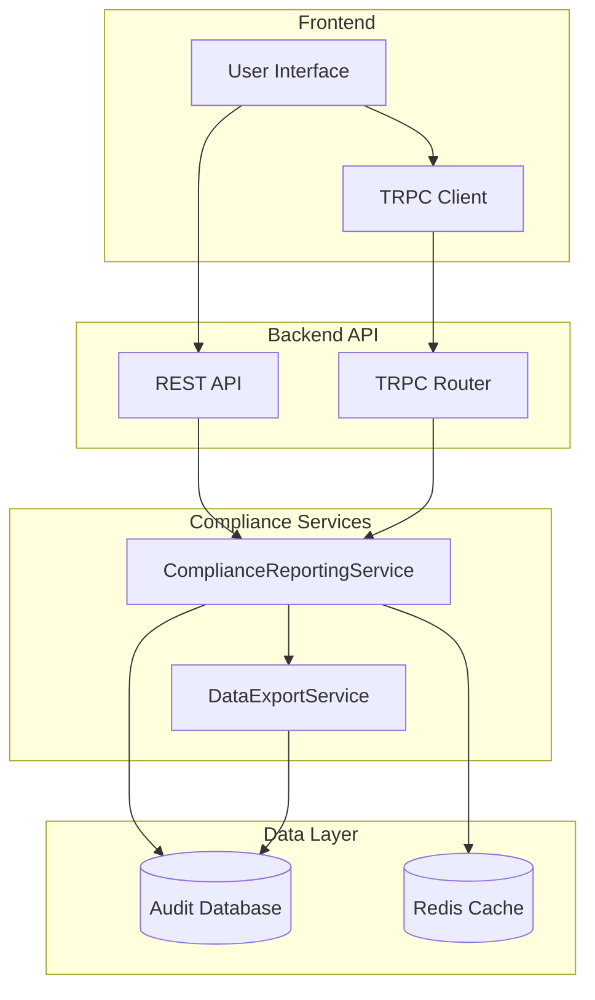
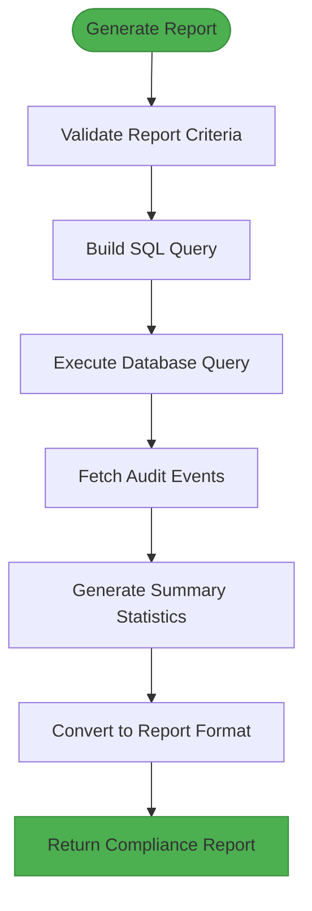
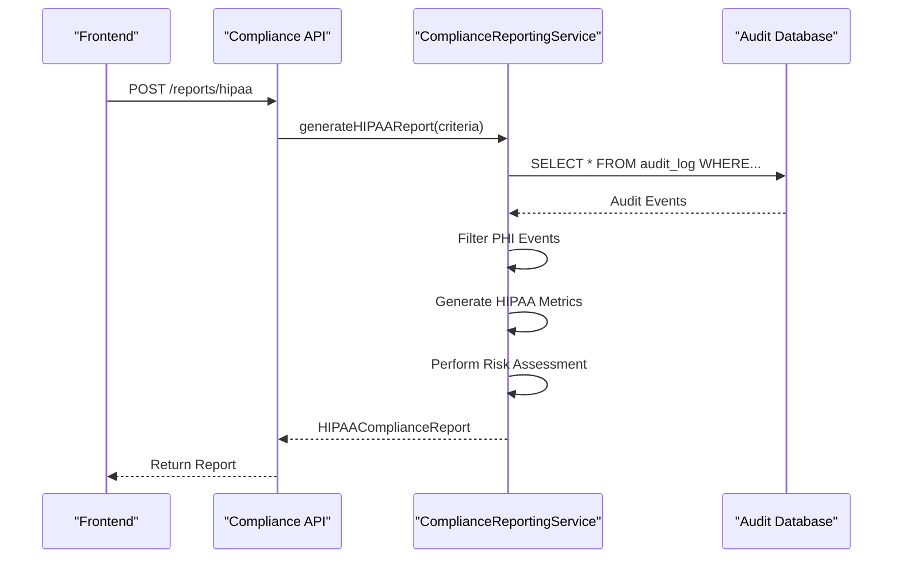
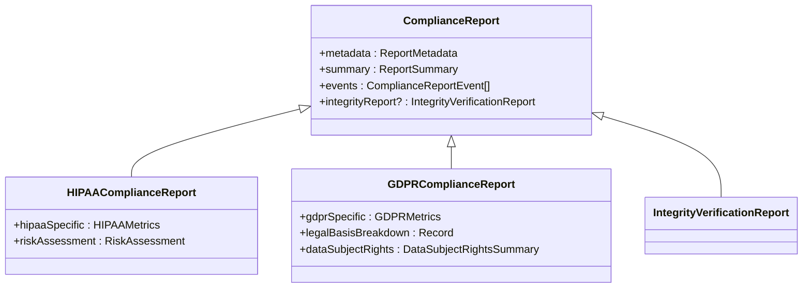
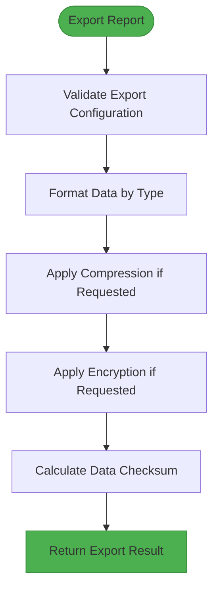
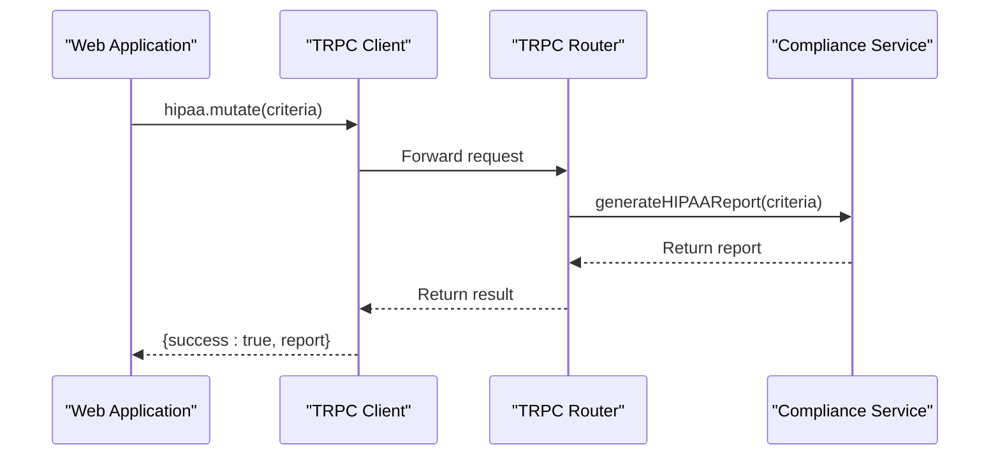
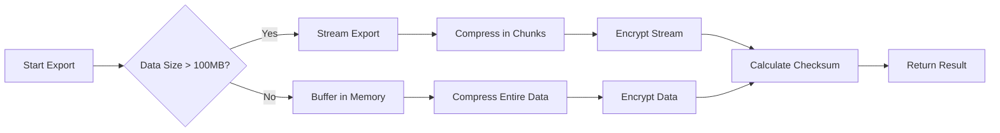
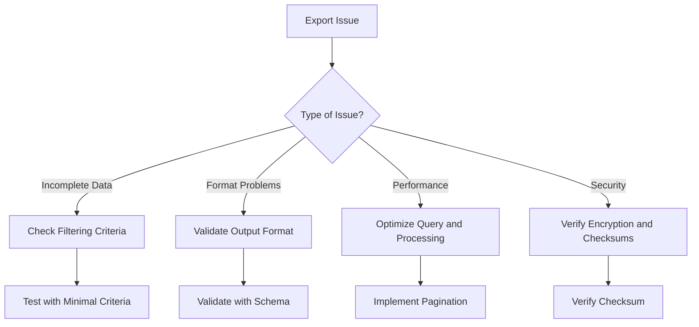

# Compliance Reporting and Export

<cite>
**Referenced Files in This Document**   
- [compliance-reporting.ts](file://packages/audit/src/report/compliance-reporting.ts) - *Updated in recent commit f47a2b0*
- [data-export.ts](file://packages/audit/src/report/data-export.ts) - *Updated in recent commit f47a2b0*
- [compliance-api.ts](file://apps/server/src/routes/compliance-api.ts) - *Modified for GDPR compliance*
- [compliance.ts](file://apps/server/src/routers/compliance.ts) - *Updated TRPC integration*
- [compliance.ts](file://packages/audit-client/src/services/compliance.ts) - *Added GDPR export functionality*
</cite>

## Update Summary
**Changes Made**   
- Updated GDPR compliance reporting section with new data subject access request (DSAR) capabilities
- Enhanced data export service documentation to reflect GDPR-specific export workflows
- Added new section on GDPR data export functionality and pseudonymization
- Updated API endpoints and integration examples for GDPR compliance
- Added new code examples for GDPR data export and report generation
- Updated source references to reflect recent code changes

## Table of Contents
1. [Introduction](#introduction)
2. [Architecture Overview](#architecture-overview)
3. [Compliance Reporting Service](#compliance-reporting-service)
4. [Data Export Service](#data-export-service)
5. [GDPR Data Export and Pseudonymization](#gdpr-data-export-and-pseudonymization)
6. [API Endpoints and Integration](#api-endpoints-and-integration)
7. [Report Generation Examples](#report-generation-examples)
8. [Performance Optimization and Best Practices](#performance-optimization-and-best-practices)
9. [Common Issues and Troubleshooting](#common-issues-and-troubleshooting)

## Introduction
The Compliance Reporting and Export system provides a robust framework for generating regulatory-compliant audit reports and exporting audit data in multiple formats. This document details the architecture, functionality, and integration points of the compliance reporting and data export modules, focusing on GDPR and HIPAA compliance use cases. The system enables organizations to meet regulatory requirements through automated report generation, integrity verification, and secure data export capabilities, with recent enhancements specifically addressing GDPR data subject rights and export requirements.

## Architecture Overview
The compliance reporting system follows a layered architecture with clear separation between data access, business logic, and presentation layers. The core components are organized as follows:



**Diagram sources**
- [compliance-reporting.ts](file://packages/audit/src/report/compliance-reporting.ts)
- [data-export.ts](file://packages/audit/src/report/data-export.ts)
- [compliance-api.ts](file://apps/server/src/routes/compliance-api.ts)
- [compliance.ts](file://apps/server/src/routers/compliance.ts)

## Compliance Reporting Service

The Compliance Reporting Service is responsible for generating regulatory-compliant audit reports based on specified criteria. It supports multiple report types including HIPAA, GDPR, and general compliance reports.

### Report Criteria and Filtering
The service uses the `ReportCriteria` interface to define filtering parameters for report generation:

```typescript
export interface ReportCriteria {
	dateRange: {
		startDate: string
		endDate: string
	}
	principalIds?: string[]
	organizationIds?: string[]
	actions?: string[]
	dataClassifications?: DataClassification[]
	statuses?: Array<'attempt' | 'success' | 'failure'>
	resourceTypes?: string[]
	verifiedOnly?: boolean
	includeIntegrityFailures?: boolean
	limit?: number
	offset?: number
	sortBy?: 'timestamp' | 'status'
	sortOrder?: 'asc' | 'desc'
}
```

The service implements both database-level and in-memory filtering. For performance optimization, the primary filtering occurs at the database level through SQL queries, while additional filtering is applied in memory when necessary.



**Diagram sources**
- [compliance-reporting.ts](file://packages/audit/src/report/compliance-reporting.ts#L400-L600)

**Section sources**
- [compliance-reporting.ts](file://packages/audit/src/report/compliance-reporting.ts)

### HIPAA Compliance Reporting
The HIPAA compliance report extends the base compliance report with healthcare-specific metrics and risk assessment:

```typescript
export interface HIPAAComplianceReport extends ComplianceReport {
	reportType: 'HIPAA_AUDIT_TRAIL'
	hipaaSpecific: {
		phiAccessEvents: number
		phiModificationEvents: number
		unauthorizedAttempts: number
		emergencyAccess: number
		breakGlassEvents: number
		minimumNecessaryViolations: number
	}
	riskAssessment: {
		highRiskEvents: ComplianceReportEvent[]
		suspiciousPatterns: SuspiciousPattern[]
		recommendations: string[]
	}
}
```

The HIPAA report generation process includes:
1. Filtering for Protected Health Information (PHI) related events
2. Calculating PHI-specific metrics
3. Performing risk assessment to identify high-risk events
4. Detecting suspicious access patterns



**Diagram sources**
- [compliance-reporting.ts](file://packages/audit/src/report/compliance-reporting.ts)
- [compliance-api.ts](file://apps/server/src/routes/compliance-api.ts)

### GDPR Compliance Reporting
The GDPR compliance report focuses on data processing activities and data subject rights:

```typescript
export interface GDPRComplianceReport extends ComplianceReport {
	reportType: 'GDPR_PROCESSING_ACTIVITIES'
	gdprSpecific: {
		personalDataEvents: number
		dataSubjectRights: number
		consentEvents: number
		dataBreaches: number
		crossBorderTransfers: number
		retentionViolations: number
	}
	legalBasisBreakdown: Record<string, number>
	dataSubjectRights: {
		accessRequests: number
		rectificationRequests: number
		erasureRequests: number
		portabilityRequests: number
		objectionRequests: number
	}
}
```

Key features of GDPR report generation:
- Identification of personal data processing events
- Tracking of data subject access requests (DSAR)
- Legal basis for processing breakdown
- Consent management events



**Section sources**
- [compliance-reporting.ts](file://packages/audit/src/report/compliance-reporting.ts#L100-L300)
- [compliance-api.ts](file://apps/server/src/routes/compliance-api.ts#L500-L600)

## Data Export Service

The Data Export Service provides multi-format export capabilities for compliance reports and audit events, supporting JSON, CSV, XML, and PDF formats.

### Export Configuration and Formats
The service uses the `ExportConfig` interface to define export parameters:

```typescript
export interface ExportConfig {
	format: ReportFormat
	includeMetadata?: boolean
	includeIntegrityReport?: boolean
	compression?: 'none' | 'gzip' | 'zip'
	encryption?: {
		enabled: boolean
		algorithm?: string
		keyId?: string
	}
}
```

Supported export formats:
- **JSON**: Structured data format for programmatic processing
- **CSV**: Spreadsheet-compatible format for analysis
- **XML**: Standard format for system integration
- **PDF**: Formatted document for formal reporting

### Export Processing Pipeline
The export service follows a processing pipeline that applies formatting, compression, and encryption as specified:



**Diagram sources**
- [data-export.ts](file://packages/audit/src/report/data-export.ts#L200-L400)

**Section sources**
- [data-export.ts](file://packages/audit/src/report/data-export.ts)

### Format-Specific Implementation
Each export format has specific implementation details:

#### JSON Export
```typescript
private async exportToJSON(
	report: ComplianceReport,
	config: ExportConfig
): Promise<{ data: string; contentType: string; filename: string }> {
	const exportData = {
		...(config.includeMetadata !== false && { metadata: report.metadata }),
		summary: report.summary,
		events: report.events,
		...(config.includeIntegrityReport &&
			report.integrityReport && {
				integrityReport: report.integrityReport,
			}),
	}
	const data = JSON.stringify(exportData, null, 2)
	return {
		data,
		contentType: 'application/json',
		filename: `audit-report-${report.metadata.reportId}.json`,
	}
}
```

#### CSV Export
The CSV export includes header rows and properly escaped values to handle commas and quotes in data:

```typescript
private escapeCsvValue(value: string): string {
	if (value.includes(',') || value.includes('"') || value.includes('\n')) {
		return `"${value.replace(/"/g, '""')}"`
	}
	return value
}
```

#### XML Export
The XML export generates well-formed XML with proper escaping of special characters:

```typescript
private escapeXml(value: string): string {
	return value
		.replace(/&/g, '&amp;')
		.replace(/</g, '&lt;')
		.replace(/>/g, '&gt;')
		.replace(/"/g, '&quot;')
		.replace(/'/g, '&apos;')
}
```

#### PDF Export
The PDF export uses HTML templating to generate formatted reports:

```typescript
private generateHTMLReport(report: ComplianceReport, config: ExportConfig): string {
	const html = [
		`<!DOCTYPE html>
		<html>
		<head>
			<title>Audit Compliance Report</title>
			<style>
				body { font-family: Arial, sans-serif; margin: 20px; }
				.header { border-bottom: 2px solid #333; padding-bottom: 10px; margin-bottom: 20px; }
				.summary { background-color: #f5f5f5; padding: 15px; margin-bottom: 20px; }
				.events { margin-top: 20px; }
				table { width: 100%; border-collapse: collapse; margin-top: 10px; }
				th, td { border: 1px solid #ddd; padding: 8px; text-align: left; }
				th { background-color: #f2f2f2; }
				.metadata { font-size: 0.9em; color: #666; }
			</style>
		</head>
		<body>
			<div class="header">
				<h1>Audit Compliance Report</h1>
				<div class="metadata">
					<p>Report ID: ${report.metadata.reportId}</p>
					<p>Report Type: ${report.metadata.reportType}</p>
					<p>Generated: ${report.metadata.generatedAt}</p>
				</div>
			</div>
			
			<div class="summary">
				<h2>Summary</h2>
				<p>Total Events: ${report.metadata.totalEvents}</p>
				<p>Unique Principals: ${report.summary.uniquePrincipals}</p>
				<p>Unique Resources: ${report.summary.uniqueResources}</p>
				<p>Integrity Violations: ${report.summary.integrityViolations}</p>
			</div>
			
			<div class="events">
				<h2>Audit Events</h2>
				<table>
					<thead>
						<tr>
							<th>Timestamp</th>
							<th>Principal</th>
							<th>Action</th>
							<th>Resource</th>
							<th>Status</th>
							<th>Classification</th>
						</tr>
					</thead>
					<tbody>`
	]
	// ... event rows
	return html.join('')
}
```

## GDPR Data Export and Pseudonymization

The system now includes specialized functionality for GDPR data subject access requests (DSAR) and data export requirements, allowing organizations to fulfill data subject rights efficiently.

### GDPR Data Export API
The GDPR data export service provides dedicated endpoints for exporting personal data in response to DSAR requests:

```typescript
/**
 * Export data for GDPR requests
 * Requirement 5.2: WHEN generating GDPR reports THEN the client SHALL support data export and pseudonymization requests
 */
async exportGdprData(params: GdprExportParams): Promise<GdprExportResult> {
	// Validate input using centralized validation
	const validationResult = validateGdprExportParams(params)
	if (!validationResult.success) {
		throw new ValidationError('Invalid GDPR export parameters', {
			...(validationResult.zodError && { originalError: validationResult.zodError }),
		})
	}

	const response = await this.request<GdprExportResult>('/compliance/export/gdpr', {
		method: 'POST',
		body: validationResult.data,
	})

	// Validate response structure
	assertType(response, isObject, 'Invalid GDPR export response from server')
	assertDefined(response.exportId, 'GDPR export response missing export ID')
	assertDefined(response.downloadUrl, 'GDPR export response missing download URL')

	return response
}
```

### Pseudonymization Support
The export service supports pseudonymization of personal data to protect data subject privacy:

```typescript
export interface GdprExportParams {
	subjectId: string
	dataCategories?: DataClassification[]
	includeAuditTrail?: boolean
	pseudonymize?: boolean
	format?: ReportFormat
	dateRange?: {
		startDate: string
		endDate: string
	}
}

export interface GdprExportResult {
	exportId: string
	subjectId: string
	pseudonymized: boolean
	dataCategories: DataClassification[]
	exportedAt: string
	downloadUrl: string
	expiration: string
	size: number
	recordCount: number
}
```

When pseudonymization is requested, the system replaces direct identifiers with pseudonyms while maintaining data relationships for analysis purposes.

**Section sources**
- [compliance.ts](file://packages/audit-client/src/services/compliance.ts#L498-L554)
- [data-export.ts](file://packages/audit/src/report/data-export.ts)

## API Endpoints and Integration

The compliance reporting system exposes both REST and TRPC endpoints for frontend integration.

### REST API Endpoints
The REST API provides standardized endpoints for compliance reporting and export:

```mermaid
graph TB
subgraph "Compliance Reports"
HIPAA[POST /reports/hipaa]
GDPR[POST /reports/gdpr]
Integrity[POST /reports/integrity]
end
subgraph "Export"
Export[POST /export/report]
GDPRExport[POST /export/gdpr]
end
subgraph "Scheduled Reports"
Create[POST /scheduled-reports]
List[GET /scheduled-reports]
Get[GET /scheduled-reports/{id}]
end
HIPAA --> ComplianceService
GDPR --> ComplianceService
Integrity --> ComplianceService
Export --> ExportService
GDPRExport --> ExportService
Create --> ScheduledService
List --> ScheduledService
Get --> ScheduledService
```

**Diagram sources**
- [compliance-api.ts](file://apps/server/src/routes/compliance-api.ts)

### TRPC Integration
The TRPC router provides type-safe endpoints for the frontend application:

```typescript
const complianceRouter = createTRPCRouter({
	report: complianceReportsRouter,
	export: complianceExportRouter,
})
```

The TRPC integration ensures type safety between frontend and backend, reducing the risk of runtime errors.



**Diagram sources**
- [compliance.ts](file://apps/server/src/routers/compliance.ts)

**Section sources**
- [compliance-api.ts](file://apps/server/src/routes/compliance-api.ts)
- [compliance.ts](file://apps/server/src/routers/compliance.ts)

## Report Generation Examples

### GDPR Data Subject Access Request (DSAR) Report
To generate a GDPR DSAR report, use the following API call:

```json
POST /reports/gdpr
{
	"criteria": {
		"startDate": "2023-01-01T00:00:00Z",
		"endDate": "2023-12-31T23:59:59Z",
		"principalIds": ["user-123"],
		"dataClassifications": ["PHI", "CONFIDENTIAL"]
	}
}
```

This generates a report that includes:
- All personal data processing events for the specified user
- Data subject rights requests (access, rectification, erasure, etc.)
- Legal basis for each processing activity
- Cross-border data transfer information

### GDPR Data Export with Pseudonymization
To export GDPR data with pseudonymization for a data subject access request:

```json
POST /export/gdpr
{
	"subjectId": "user-123",
	"dataCategories": ["PHI", "CONFIDENTIAL"],
	"includeAuditTrail": true,
	"pseudonymize": true,
	"format": "json",
	"dateRange": {
		"startDate": "2023-01-01T00:00:00Z",
		"endDate": "2023-12-31T23:59:59Z"
	}
}
```

The response includes a secure download URL for the exported data:

```json
{
	"exportId": "gdpr-export-456",
	"subjectId": "user-123",
	"pseudonymized": true,
	"dataCategories": ["PHI", "CONFIDENTIAL"],
	"exportedAt": "2024-01-15T10:30:00Z",
	"downloadUrl": "https://api.example.com/download/gdpr-export-456?token=abc123",
	"expiration": "2024-01-16T10:30:00Z",
	"size": 1048576,
	"recordCount": 1500
}
```

### HIPAA Compliance Summary
To generate a HIPAA compliance summary, use:

```json
POST /reports/hipaa
{
	"criteria": {
		"startDate": "2023-01-01T00:00:00Z",
		"endDate": "2023-12-31T23:59:59Z",
		"organizationIds": ["org-456"]
	}
}
```

The resulting report includes:
- PHI access and modification events
- Emergency access and break-glass procedures
- Risk assessment with high-risk events
- Recommendations for improving compliance

### Exporting Reports
To export a generated report to CSV format:

```json
POST /export/report
{
	"report": { /* report object */ },
	"config": {
		"format": "csv",
		"includeMetadata": true,
		"compression": "gzip"
	}
}
```

The response includes the exported data with appropriate headers for file download:

```
HTTP/1.1 200 OK
Content-Type: text/csv
Content-Disposition: attachment; filename="audit-report-123.csv"
Content-Length: 12345
X-Export-ID: export-456
X-Checksum: sha256:abc123
```

## Performance Optimization and Best Practices

### Large Data Exports
For large datasets, implement the following best practices:

1. **Use pagination**: Limit results with `limit` and `offset` parameters
2. **Filter aggressively**: Use specific criteria to reduce dataset size
3. **Schedule off-peak exports**: Run large exports during low-usage periods
4. **Use compression**: Enable gzip or zip compression for large files

```typescript
// Example: Paginated export for large datasets
const criteria = {
	dateRange: { startDate, endDate },
	limit: 1000,
	offset: 0,
}

// Process in batches
while (true) {
	const events = await getEvents(criteria)
	if (events.length === 0) break
	
	await exportBatch(events, config)
	criteria.offset += criteria.limit
}
```

### Data Integrity During Export
Ensure data integrity during the export process:

1. **Calculate checksums**: Generate SHA-256 checksums for exported data
2. **Use atomic operations**: Ensure complete file generation before serving
3. **Verify compression**: Check compressed files for integrity
4. **Implement retry logic**: Handle transient failures during export

### Performance Optimization Tips
1. **Leverage caching**: Cache frequently accessed report data
2. **Optimize database queries**: Use indexed fields in filtering criteria
3. **Stream large exports**: Use streaming for very large files to reduce memory usage
4. **Parallel processing**: Process independent report sections in parallel



**Section sources**
- [data-export.ts](file://packages/audit/src/report/data-export.ts)
- [compliance-reporting.ts](file://packages/audit/src/report/compliance-reporting.ts)

## Common Issues and Troubleshooting

### Incomplete Datasets
**Issue**: Exported reports contain fewer events than expected.

**Causes and Solutions**:
- **Pagination limits**: Check if `limit` parameter is too low
- **Date range issues**: Verify startDate and endDate are in correct format
- **Filtering criteria**: Review principalIds, actions, and other filters
- **Database performance**: Check for query timeouts on large datasets

### Format Compatibility Issues
**Issue**: Exported files cannot be opened by target applications.

**Solutions**:
- **CSV encoding**: Ensure UTF-8 encoding for special characters
- **XML validation**: Validate XML structure with schema
- **PDF rendering**: Test PDF output with multiple viewers
- **File extensions**: Ensure correct file extensions (.json, .csv, .xml, .pdf)

### Performance Problems with Large Exports
**Issue**: Export process is slow or times out for large datasets.

**Optimization Strategies**:
1. **Increase timeout settings** for long-running exports
2. **Implement progress tracking** to monitor export status
3. **Use background processing** for very large exports
4. **Optimize database indexes** on frequently queried fields

### Data Integrity Verification
**Issue**: Concerns about data tampering or corruption.

**Verification Methods**:
- **Checksum validation**: Compare X-Checksum header with calculated value
- **Digital signatures**: Implement signing for critical reports
- **Hash verification**: Verify event hashes in integrity reports
- **Audit trail**: Maintain logs of all export activities



**Section sources**
- [compliance-reporting.ts](file://packages/audit/src/report/compliance-reporting.ts)
- [data-export.ts](file://packages/audit/src/report/data-export.ts)