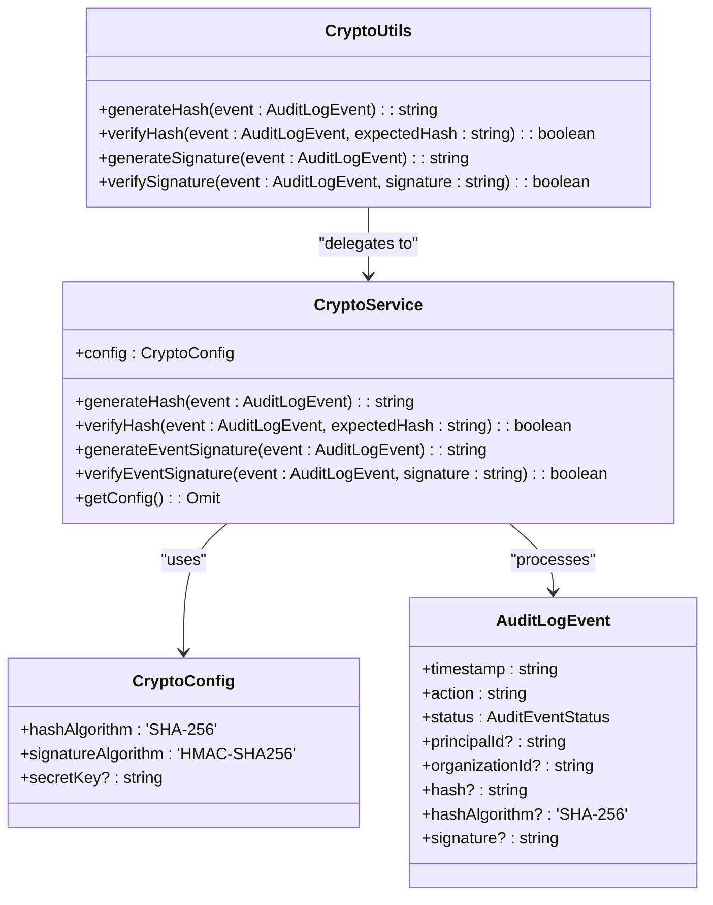
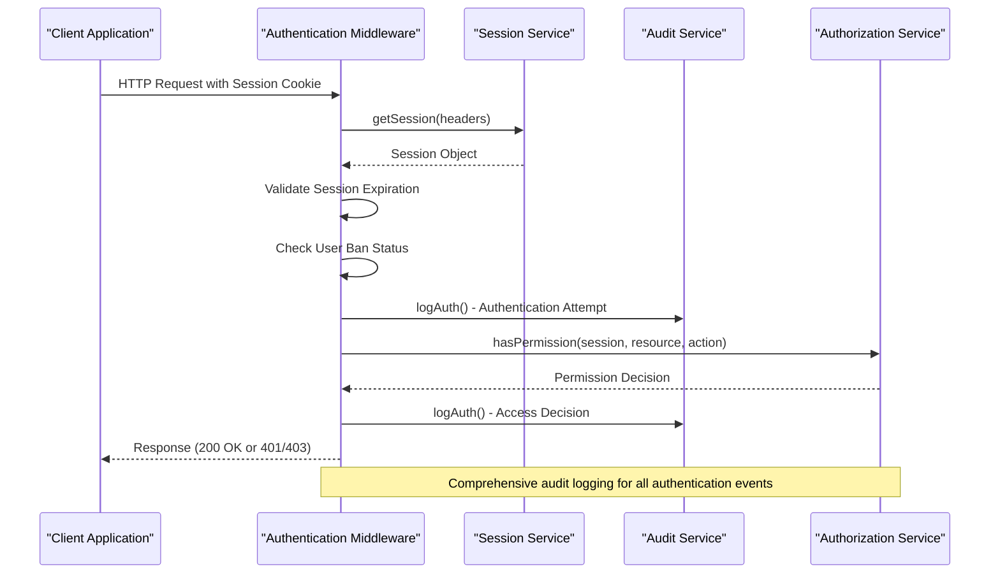
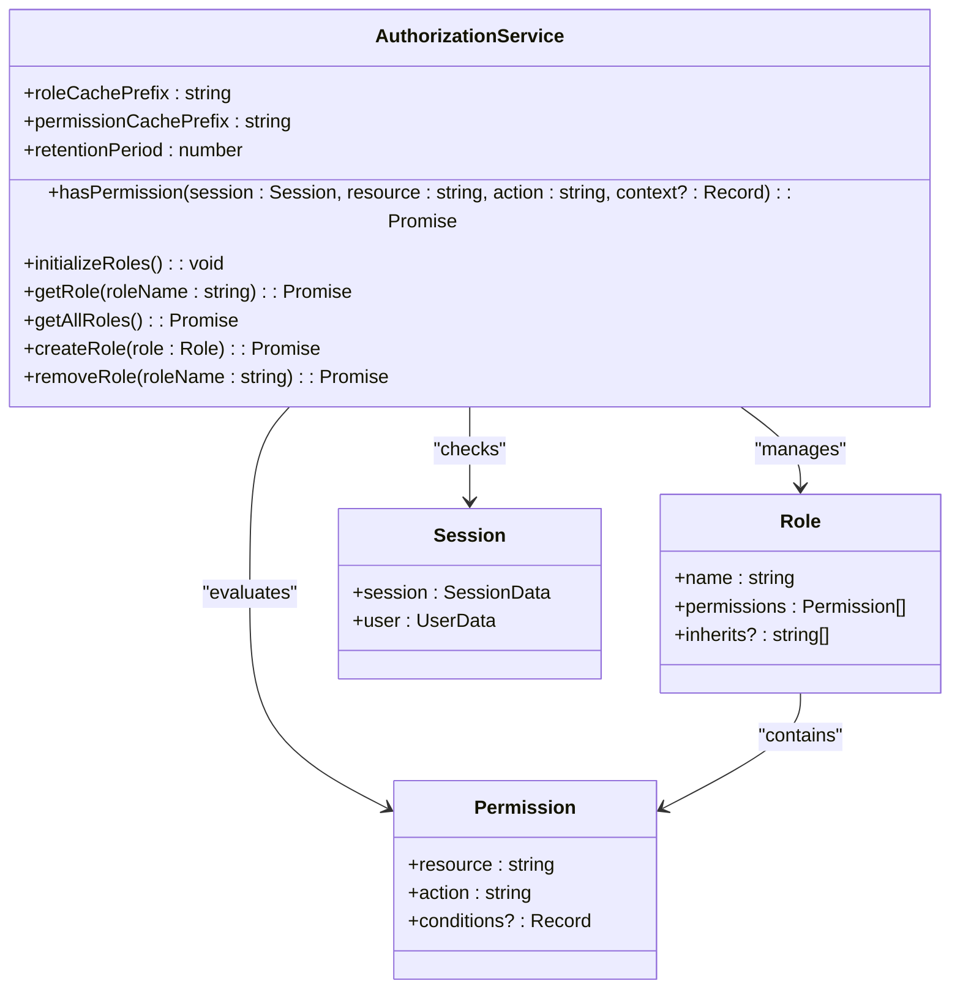
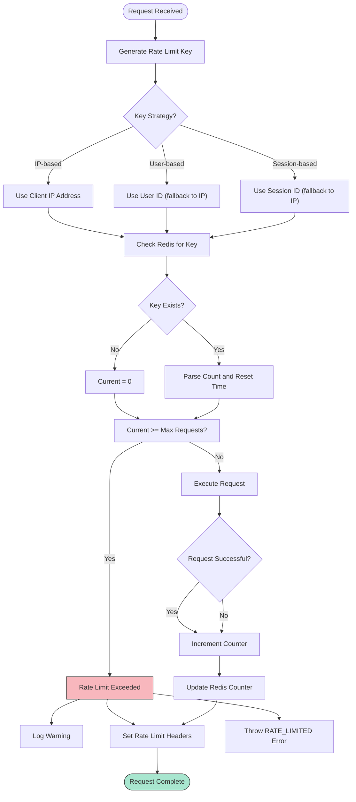

# Data Security Measures

<cite>
**Referenced Files in This Document**   
- [crypto.ts](file://packages/audit/src/crypto.ts#L0-L218)
- [auth.ts](file://apps/server/src/lib/middleware/auth.ts#L0-L765)
- [permissions.ts](file://packages/auth/src/permissions.ts#L0-L593)
- [rate-limit.ts](file://apps/server/src/lib/middleware/rate-limit.ts#L0-L487)
- [validation.ts](file://packages/audit/src/validation.ts#L0-L866)
- [types.ts](file://packages/audit/src/types.ts#L0-L286)
</cite>

## Table of Contents
1. [Introduction](#introduction)
2. [Data Encryption Implementation](#data-encryption-implementation)
3. [Authentication and Authorization](#authentication-and-authorization)
4. [Middleware-Level Security Protections](#middleware-level-security-protections)
5. [Secure API Endpoints and Header Validation](#secure-api-endpoints-and-header-validation)
6. [Vulnerability Mitigation](#vulnerability-mitigation)
7. [Audit Data Security and Zero-Trust Principles](#audit-data-security-and-zero-trust-principles)
8. [Conclusion](#conclusion)

## Introduction
This document provides a comprehensive overview of the data security measures implemented in the smart-logs system. The architecture emphasizes cryptographic integrity, secure authentication, role-based access control, and protection against common vulnerabilities. The system is designed to meet healthcare compliance requirements with a focus on audit data protection and zero-trust principles. The security framework spans multiple layers including data encryption, authentication flows, middleware protections, and comprehensive validation mechanisms.

## Data Encryption Implementation

The system implements cryptographic integrity verification for audit events using SHA-256 hashing and HMAC-SHA256 signatures. The `CryptoService` class in `crypto.ts` provides tamper detection capabilities for audit log events, ensuring data integrity both at rest and in transit.

**Diagram sources**
- [crypto.ts](file://packages/audit/src/crypto.ts#L0-L218)
- [types.ts](file://packages/audit/src/types.ts#L0-L286)

**Section sources**
- [crypto.ts](file://packages/audit/src/crypto.ts#L0-L218)
- [types.ts](file://packages/audit/src/types.ts#L0-L286)

### Cryptographic Algorithms and Key Management
The system uses industry-standard cryptographic algorithms:
- **SHA-256**: For generating deterministic hashes of audit event critical fields
- **HMAC-SHA256**: For creating cryptographic signatures using a secret key

Key management is implemented through environment-based configuration. The system requires a secret key for cryptographic operations, which should be set via environment variables in production. If no key is provided, the system generates a random 32-byte secret (256 bits), but this is not recommended for production environments.

The `CryptoService` extracts critical fields from audit events in a deterministic order, creates a standardized string representation, and applies SHA-256 hashing. This ensures consistency across the system regardless of object property order. The HMAC-SHA256 signature provides additional security by incorporating the secret key, preventing tampering even if an attacker gains access to the hash algorithm.

### Data Integrity Verification
The cryptographic implementation focuses on integrity verification rather than encryption of data at rest. Each audit event can include:
- **Hash**: A SHA-256 hash of critical fields (timestamp, action, status, principalId, etc.)
- **Signature**: An HMAC-SHA256 signature generated using the hash and secret key

This two-layer approach allows for both basic integrity checking (via hash comparison) and authenticated integrity verification (via signature validation). The system automatically validates these cryptographic elements during audit processing, logging any verification failures for security monitoring.

## Authentication and Authorization

The authentication system implements secure JWT-based authentication with comprehensive role-based access control (RBAC). The middleware in `auth.ts` handles session validation, JWT verification, and access control decisions.

**Diagram sources**
- [auth.ts](file://apps/server/src/lib/middleware/auth.ts#L0-L765)
- [permissions.ts](file://packages/auth/src/permissions.ts#L0-L593)

**Section sources**
- [auth.ts](file://apps/server/src/lib/middleware/auth.ts#L0-L765)
- [permissions.ts](file://packages/auth/src/permissions.ts#L0-L593)

### JWT Handling and Session Management
The system uses JWT tokens for session management, with tokens stored in HTTP-only cookies for web clients. The authentication middleware validates session tokens on each request by:

1. Extracting the session from cookies or API keys
2. Validating session expiration against the `expiresAt` timestamp
3. Checking user ban status
4. Populating session context with IP address and user agent

The system supports multiple authentication methods:
- **Session-based authentication**: For web and mobile clients using JWT cookies
- **API key authentication**: For third-party integrations using the `x-api-key` header
- **Combined authentication**: Middleware that accepts either session or API key

All authentication events are logged to the audit system, including successful and failed attempts, session expiration, and account bans. This provides comprehensive visibility into authentication activities.

### Role-Based Access Control
The RBAC system is implemented through the `AuthorizationService` class, which manages permissions and access control decisions. The system supports both system-level and organization-level roles with inheritance capabilities.

**Diagram sources**
- [permissions.ts](file://packages/auth/src/permissions.ts#L0-L593)
- [auth.ts](file://apps/server/src/lib/middleware/auth.ts#L0-L765)

**Section sources**
- [permissions.ts](file://packages/auth/src/permissions.ts#L0-L593)

The system implements a hierarchical role structure:
- **System roles**: Global roles applicable to all organizations
  - `user`: Basic access to audit events, reports, and profile
  - `admin`: Super admin with all permissions (`*:*`)
- **Organization roles**: Context-specific roles
  - `org:member`: Read and create access to audit data
  - `org:admin`: Full CRUD access to audit data and management capabilities
  - `org:owner`: Inherits from `org:admin` with additional organization management permissions

Permission checks are cached in Redis for 5 minutes to improve performance, with a fallback mechanism that evaluates role permissions, organization roles, and resource-specific conditions. The system implements a zero-trust approach by defaulting to deny access unless explicitly permitted.

## Middleware-Level Security Protections

The system implements comprehensive middleware-level protections to defend against common attacks and ensure secure request processing. These protections operate at the request lifecycle level, providing defense in depth.

### Input Validation
Input validation is implemented through the `validation.ts` file, which provides schema validation for audit events. The validation system enforces:

- Required fields: timestamp, action, status
- Type validation: Ensuring proper data types for all fields
- Format validation: ISO 8601 for timestamps
- Length limits: Maximum string length of 10,000 characters
- Allowed values: Restricted lists for status, data classification, and event versions

The validation system also includes sanitization capabilities to prevent injection attacks by validating and potentially modifying input data. All validation errors are captured in structured error objects with field, value, and code information.

### Rate Limiting
The rate limiting middleware in `rate-limit.ts` provides protection against brute force attacks and denial-of-service attempts. The system implements configurable rate limiting with multiple strategies:

**Diagram sources**
- [rate-limit.ts](file://apps/server/src/lib/middleware/rate-limit.ts#L0-L487)

**Section sources**
- [rate-limit.ts](file://apps/server/src/lib/middleware/rate-limit.ts#L0-L487)

The rate limiting system supports:
- Configurable time windows (default: 15 minutes)
- Adjustable request limits
- Multiple identification strategies (IP, user, session)
- Redis-based distributed storage for cluster environments
- Standard rate limit headers (RateLimit-Limit, RateLimit-Remaining, RateLimit-Reset)

The middleware gracefully handles Redis failures by allowing requests to proceed, ensuring availability even if the rate limiting service is temporarily unavailable.

### Session Management
Session management is integrated with the authentication system, with sessions stored in a secure backend store. Key security features include:
- HTTP-only cookies to prevent XSS attacks
- Secure flag for HTTPS-only transmission
- Session expiration validation on each request
- IP address and user agent tracking for anomaly detection
- Comprehensive audit logging of all session activities

The system automatically invalidates expired sessions and logs the event for security monitoring. Session data is enriched with geolocation and other context information when available.

## Secure API Endpoints and Header Validation

The system implements secure API endpoints with comprehensive header validation and security controls. All endpoints are protected by authentication and authorization middleware, ensuring that only authorized users can access resources.

### API Security Headers
The system validates and processes several security-related headers:
- `x-api-key`: For API key authentication
- `authorization`: For Bearer token authentication
- `x-forwarded-for`: For client IP address detection (when behind proxies)
- `x-real-ip`: Alternative IP address header
- Rate limiting headers: Communicate rate limit status to clients

The header validation process includes:
- Normalization of header names (case-insensitive)
- Extraction of values with proper sanitization
- Validation against expected formats
- Fallback mechanisms for alternative headers

### Secure Endpoint Patterns
The system follows secure design patterns for API endpoints:
- **Consistent authentication**: All endpoints require authentication unless explicitly marked as public
- **Principle of least privilege**: Endpoints only expose the minimum necessary data
- **Input validation**: All inputs are validated against schemas
- **Output encoding**: Responses are properly encoded to prevent XSS
- **Error handling**: Generic error messages to avoid information leakage

The middleware architecture ensures that security controls are applied consistently across all endpoints, reducing the risk of security gaps in individual route implementations.

## Vulnerability Mitigation

The system addresses common security vulnerabilities through a combination of technical controls and secure design patterns.

### Injection Attack Prevention
The system mitigates injection attacks through:
- Input validation and sanitization
- Parameterized queries in database operations
- Content-Type validation
- Output encoding
- Schema enforcement for all data structures

The validation system in `validation.ts` prevents injection by enforcing strict data types and formats, rejecting malformed inputs before they can be processed by downstream components.

### Broken Authentication Protection
The authentication system protects against broken authentication through:
- Strong password policies (enforced at identity provider level)
- Session expiration and rotation
- Comprehensive audit logging of authentication events
- Rate limiting on authentication endpoints
- Account lockout after multiple failed attempts
- Secure session storage with HTTP-only cookies

The system logs all authentication attempts, including failures, providing visibility into potential brute force attacks or credential stuffing attempts.

### Insecure Direct Object Reference (IDOR) Prevention
The system prevents IDOR vulnerabilities through:
- Role-based access control checks on all resource access
- Organization context validation
- Explicit permission checks for each operation
- Resource ownership verification
- Path parameter validation against active organization

The `requireOrganizationAccess` middleware ensures that users can only access resources within their active organization, preventing cross-organization access. The permission system evaluates both resource and action for each request, ensuring that users cannot access resources they shouldn't.

## Audit Data Security and Zero-Trust Principles

The system implements zero-trust security principles with a focus on audit data protection. The architecture assumes that no user or system should be trusted by default, requiring continuous verification of security posture.

### Audit Data Protection
Audit data is protected through multiple layers:
- **Cryptographic integrity**: SHA-256 hashes and HMAC signatures ensure data cannot be tampered with
- **Access controls**: Strict RBAC limits who can view, modify, or delete audit data
- **Immutable design**: Audit events are append-only with no modification capabilities
- **Retention policies**: Configurable data retention based on compliance requirements
- **Data classification**: PHI and confidential data is properly classified and protected

The system uses data classification levels (PUBLIC, INTERNAL, CONFIDENTIAL, PHI) to apply appropriate security controls based on sensitivity. This ensures that highly sensitive healthcare data receives the highest level of protection.

### Zero-Trust Implementation
The zero-trust architecture is implemented through:
- **Continuous authentication**: Every request is authenticated and authorized
- **Least privilege access**: Users have only the permissions they need
- **Micro-segmentation**: Organization-level isolation prevents cross-tenant access
- **Comprehensive logging**: All security-relevant events are audited
- **Automated monitoring**: Anomaly detection and alerting for suspicious activities

The system never trusts any request implicitly, requiring verification of identity, context, and permissions for every operation. This approach minimizes the attack surface and limits the potential damage from compromised credentials.

### Best Practices
Recommended security best practices for the system include:
- Setting the `AUDIT_CRYPTO_SECRET` environment variable in production
- Regularly rotating API keys and secrets
- Monitoring audit logs for suspicious activities
- Implementing network-level protections (firewalls, WAF)
- Conducting regular security assessments
- Keeping dependencies updated
- Using HTTPS for all communications
- Implementing multi-factor authentication for administrative accounts

These practices, combined with the built-in security features, create a robust defense-in-depth strategy that protects sensitive audit data and ensures compliance with healthcare regulations.

## Conclusion
The smart-logs system implements a comprehensive security framework that addresses data encryption, authentication, authorization, and vulnerability mitigation. The architecture follows zero-trust principles with defense-in-depth strategies across multiple layers. Key strengths include cryptographic integrity verification for audit data, robust role-based access control, and comprehensive middleware protections. The system is designed to meet healthcare compliance requirements while providing strong protection against common security threats. By following the documented best practices and maintaining proper configuration, organizations can ensure the confidentiality, integrity, and availability of their audit data.