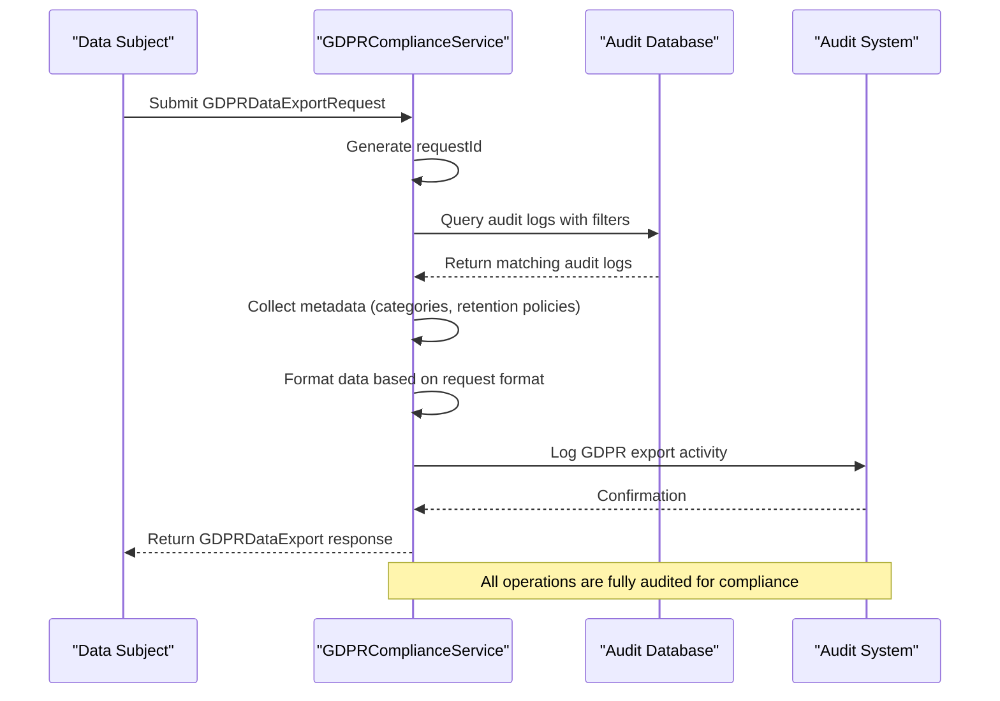
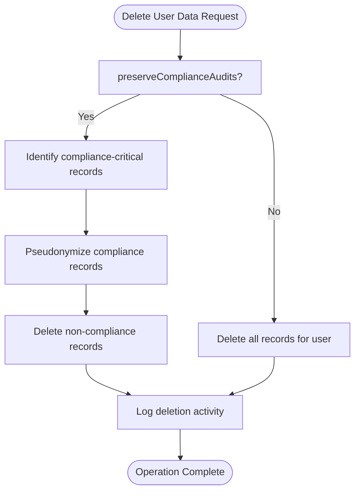
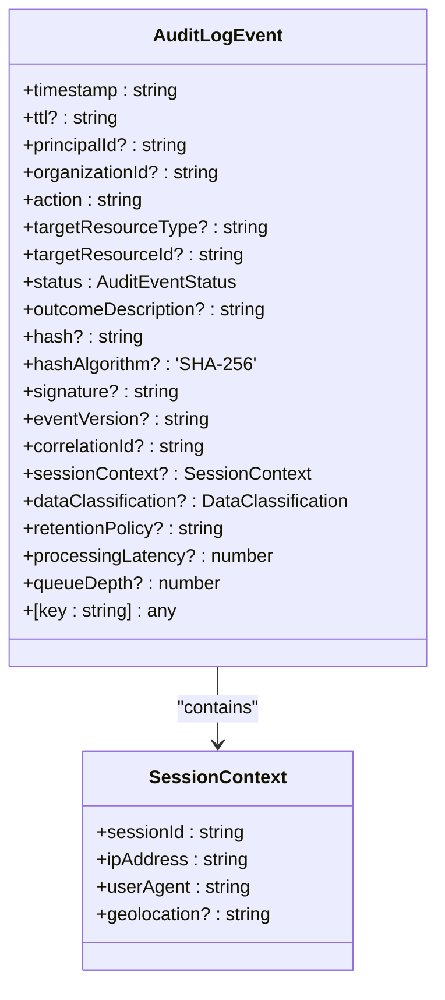
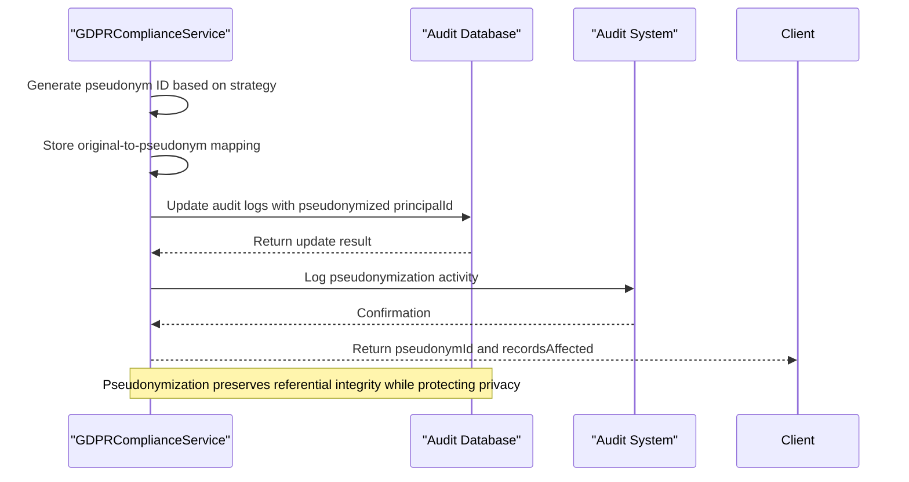
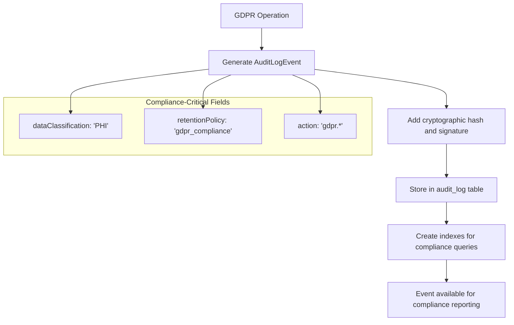
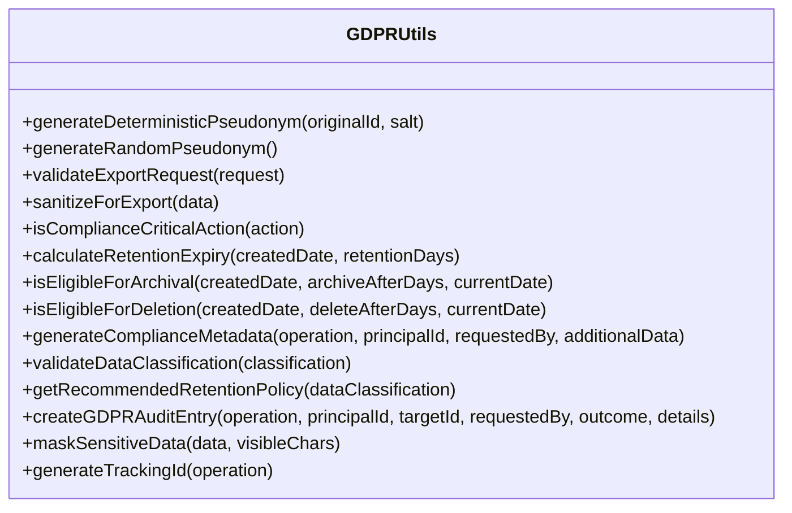

# GDPR Compliance

<cite>
**Referenced Files in This Document**   
- [gdpr-compliance.ts](file://packages/audit/src/gdpr/gdpr-compliance.ts) - *Updated in recent commit with cryptographic and KMS integration*
- [gdpr-utils.ts](file://packages/audit/src/gdpr/gdpr-utils.ts) - *Added in recent commit with enhanced GDPR utilities*
- [types.ts](file://packages/audit/src/types.ts#L1-L286)
- [schema.ts](file://packages/audit-db/src/db/schema.ts#L78-L277)
- [gdpr-compliance.test.ts](file://packages/audit/src/__tests__/gdpr-compliance.test.ts#L1-L200)
- [gdpr-integration.test.ts](file://packages/audit-db/src/__tests__/gdpr-integration.test.ts#L1-L150)
</cite>

## Update Summary
**Changes Made**   
- Updated documentation to reflect new cryptographic and KMS integration in GDPR compliance logic
- Added new section on GDPR utility functions and their implementation
- Enhanced pseudonymization strategy documentation with new deterministic and random methods
- Updated compliance-critical actions list with additional security and compliance actions
- Added documentation for new GDPR utility validation and metadata generation functions
- Updated retention policy recommendations with healthcare-specific policies
- Added new section on sensitive data masking and tracking ID generation

## Table of Contents
1. [Introduction](#introduction)
2. [Core Components](#core-components)
3. [Data Subject Request Handling](#data-subject-request-handling)
4. [Right to Erasure Workflows](#right-to-erasure-workflows)
5. [Consent Tracking and Data Minimization](#consent-tracking-and-data-minimization)
6. [Anonymization and Pseudonymization](#anonymization-and-pseudonymization)
7. [Audit Trail Preservation](#audit-trail-preservation)
8. [Integration Points](#integration-points)
9. [Common Issues and Best Practices](#common-issues-and-best-practices)
10. [GDPR Utility Functions](#gdpr-utility-functions)

## Introduction
The GDPR Compliance system in the smart-logs repository implements a comprehensive framework for handling data subject rights, ensuring compliance with the General Data Protection Regulation (GDPR). The core of this implementation is the `GDPRComplianceService` class, which provides mechanisms for data export, pseudonymization, retention policy enforcement, and secure deletion of personal data. This documentation details the design, functionality, and integration points of the GDPR compliance system, focusing on how personal data is identified, processed, and securely managed throughout its lifecycle.

**Section sources**
- [gdpr-compliance.ts](file://packages/audit/src/gdpr/gdpr-compliance.ts#L1-L50)

## Core Components

The GDPR compliance system is built around several key components that work together to ensure regulatory compliance:

- **GDPRComplianceService**: The main service class that orchestrates all GDPR-related operations
- **AuditLogEvent**: The interface defining the structure of audit log entries
- **auditLog table**: The database schema storing audit events with compliance-specific fields
- **RetentionPolicy**: Configuration for data lifecycle management
- **PseudonymizationStrategy**: Methods for anonymizing personal identifiers
- **GDPRUtils**: Utility class providing enhanced GDPR compliance functions

The system is designed with privacy-by-design principles, ensuring that data minimization, purpose limitation, and integrity are maintained throughout all operations.

```mermaid
classDiagram
class GDPRComplianceService {
+exportUserData(request)
+pseudonymizeUserData(principalId, strategy, requestedBy)
+applyRetentionPolicies()
+deleteUserDataWithAuditTrail(principalId, requestedBy, preserveComplianceAudits)
+getPseudonymMapping(originalId)
+getOriginalId(pseudonymId)
}
class GDPRDataExportRequest {
+principalId : string
+organizationId : string
+requestType : DataSubjectRightType
+format : GDPRExportFormat
+dateRange? : {start : string, end : string}
+includeMetadata? : boolean
+requestedBy : string
+requestTimestamp : string
}
class GDPRDataExport {
+requestId : string
+principalId : string
+organizationId : string
+exportTimestamp : string
+format : GDPRExportFormat
+recordCount : number
+dataSize : number
+data : Buffer
+metadata : {dateRange : {start : string, end : string}, categories : string[], retentionPolicies : string[], exportedBy : string}
}
class RetentionPolicy {
+policyName : string
+dataClassification : DataClassification
+retentionDays : number
+archiveAfterDays? : number
+deleteAfterDays? : number
+isActive : boolean
}
class ArchivalResult {
+recordsArchived : number
+recordsDeleted : number
+archivedAt : string
+policy : string
+summary : {byClassification : Record<string, number>, byAction : Record<string, number>, dateRange : {start : string, end : string}}
}
class GDPRUtils {
+generateDeterministicPseudonym(originalId, salt)
+generateRandomPseudonym()
+validateExportRequest(request)
+sanitizeForExport(data)
+isComplianceCriticalAction(action)
+calculateRetentionExpiry(createdDate, retentionDays)
+isEligibleForArchival(createdDate, archiveAfterDays, currentDate)
+isEligibleForDeletion(createdDate, deleteAfterDays, currentDate)
+generateComplianceMetadata(operation, principalId, requestedBy, additionalData)
+validateDataClassification(classification)
+getRecommendedRetentionPolicy(dataClassification)
+createGDPRAuditEntry(operation, principalId, targetId, requestedBy, outcome, details)
+maskSensitiveData(data, visibleChars)
+generateTrackingId(operation)
}
GDPRComplianceService --> GDPRDataExportRequest : "processes"
GDPRComplianceService --> GDPRDataExport : "returns"
GDPRComplianceService --> RetentionPolicy : "applies"
GDPRComplianceService --> ArchivalResult : "returns"
GDPRComplianceService --> GDPRUtils : "utilizes"
```

**Diagram sources**
- [gdpr-compliance.ts](file://packages/audit/src/gdpr/gdpr-compliance.ts#L1-L686)
- [gdpr-utils.ts](file://packages/audit/src/gdpr/gdpr-utils.ts#L1-L296)

**Section sources**
- [gdpr-compliance.ts](file://packages/audit/src/gdpr/gdpr-compliance.ts#L1-L686)
- [types.ts](file://packages/audit/src/types.ts#L1-L286)
- [gdpr-utils.ts](file://packages/audit/src/gdpr/gdpr-utils.ts#L1-L296)

## Data Subject Request Handling

The GDPR compliance system implements robust handling of data subject requests through the `exportUserData` method of the `GDPRComplianceService`. This method fulfills the right to data portability (GDPR Article 20) by allowing users to export their audit data in portable formats.

### Request Processing Workflow



**Diagram sources**
- [gdpr-compliance.ts](file://packages/audit/src/gdpr/gdpr-compliance.ts#L50-L150)

The `exportUserData` method accepts a `GDPRDataExportRequest` containing:

- **principalId**: The identifier of the user whose data is being exported
- **organizationId**: The organization context for multi-tenant systems
- **requestType**: The type of data subject right being exercised
- **format**: The desired export format (JSON, CSV, or XML)
- **dateRange**: Optional time range filter for the exported data
- **includeMetadata**: Whether to include additional metadata in the export
- **requestedBy**: The identifier of the user making the request
- **requestTimestamp**: When the request was made

The service queries the audit log database using Drizzle ORM, applying filters for the principal ID, organization ID, and optional date range. The results are then formatted according to the requested format and returned with comprehensive metadata.

**Section sources**   
- [gdpr-compliance.ts](file://packages/audit/src/gdpr/gdpr-compliance.ts#L50-L150)

## Right to Erasure Workflows

The system implements GDPR-compliant deletion workflows that balance the "right to be forgotten" with the need to preserve compliance audit trails. This is achieved through the `deleteUserDataWithAuditTrail` method, which provides configurable deletion behavior.

### Deletion Strategy

The right to erasure is implemented with two key considerations:
1. Complete removal of personal data where appropriate
2. Preservation of compliance-critical records

The `deleteUserDataWithAuditTrail` method offers a `preserveComplianceAudits` parameter that determines the deletion strategy:

- When `true` (default): Compliance-critical records are preserved and pseudonymized, while other records are deleted
- When `false`: All records for the user are permanently deleted



**Diagram sources**
- [gdpr-compliance.ts](file://packages/audit/src/gdpr/gdpr-compliance.ts#L400-L480)

The compliance-critical actions that are preserved include:
- `auth.login.success`
- `auth.login.failure`
- `auth.logout`
- `data.access.unauthorized`
- `data.breach.detected`
- `gdpr.data.export`
- `gdpr.data.pseudonymize`
- `gdpr.data.delete`
- `gdpr.retention.apply`
- `security.alert.generated`
- `compliance.audit.performed`
- `system.backup.created`
- `system.backup.restored`

These actions are considered essential for security auditing and regulatory compliance, even after a user requests erasure of their data.

**Section sources**
- [gdpr-compliance.ts](file://packages/audit/src/gdpr/gdpr-compliance.ts#L400-L480)
- [gdpr-utils.ts](file://packages/audit/src/gdpr/gdpr-utils.ts#L100-L120)

## Consent Tracking and Data Minimization

The GDPR compliance system incorporates data minimization principles through its audit event design and retention policies. Personal data is only collected when necessary, and retention periods are strictly enforced.

### Data Classification and Retention

The system uses data classification to determine appropriate retention policies:

- **PUBLIC**: Publicly available information
- **INTERNAL**: Internal business information
- **CONFIDENTIAL**: Sensitive business information
- **PHI**: Protected Health Information (highest sensitivity)



**Diagram sources**
- [types.ts](file://packages/audit/src/types.ts#L1-L286)

The `applyRetentionPolicies` method automatically enforces retention rules by:
1. Identifying active retention policies from the `auditRetentionPolicy` table
2. Archiving records that have exceeded their active retention period
3. Permanently deleting records that have exceeded their deletion period

This ensures that personal data is not retained longer than necessary, fulfilling the data minimization principle of GDPR.

**Section sources**
- [gdpr-compliance.ts](file://packages/audit/src/gdpr/gdpr-compliance.ts#L250-L350)
- [schema.ts](file://packages/audit-db/src/db/schema.ts#L200-L250)
- [gdpr-utils.ts](file://packages/audit/src/gdpr/gdpr-utils.ts#L150-L175)

## Anonymization and Pseudonymization

The system implements sophisticated pseudonymization techniques to protect personal data while maintaining referential integrity for audit purposes.

### Pseudonymization Strategies

The `pseudonymizeUserData` method supports three pseudonymization strategies:

- **hash**: Creates a deterministic hash of the original ID using SHA-256
- **token**: Generates a random token (non-deterministic)
- **encryption**: Base64 encodes the original ID (placeholder for production encryption)



**Diagram sources**
- [gdpr-compliance.ts](file://packages/audit/src/gdpr/gdpr-compliance.ts#L150-L250)

The pseudonymization process:
1. Generates a pseudonym ID using the selected strategy
2. Stores the mapping between original and pseudonymized IDs in memory
3. Updates all audit logs with the pseudonymized principal ID
4. Marks the records as pseudonymized in the details field
5. Logs the pseudonymization activity for audit purposes

The hash strategy uses a salt (from environment variables or a default) to prevent rainbow table attacks, making it more secure than simple hashing.

**Section sources**
- [gdpr-compliance.ts](file://packages/audit/src/gdpr/gdpr-compliance.ts#L150-L250)
- [gdpr-utils.ts](file://packages/audit/src/gdpr/gdpr-utils.ts#L10-L45)

## Audit Trail Preservation

The GDPR compliance system ensures that all data processing activities are fully audited, creating an immutable record of compliance operations.

### Audit Event Structure

All GDPR operations generate audit events with the following characteristics:

- **Cryptographic hashing**: SHA-256 hashes ensure data integrity
- **Digital signatures**: HMAC-SHA256 signatures provide authenticity
- **Immutable fields**: Key fields cannot be modified after creation
- **Comprehensive metadata**: Contextual information for forensic analysis

The audit trail preservation mechanism is critical for demonstrating compliance during regulatory audits. Even when personal data is deleted or pseudonymized, the fact that these operations occurred is permanently recorded.



**Diagram sources**
- [gdpr-compliance.ts](file://packages/audit/src/gdpr/gdpr-compliance.ts#L650-L680)
- [schema.ts](file://packages/audit-db/src/db/schema.ts#L78-L145)

The system maintains two types of audit trails:
1. **Operational audit trails**: Standard audit logs of system activities
2. **Compliance audit trails**: Specialized logs of GDPR operations

Both types are preserved according to their respective retention policies, with compliance trails typically having longer retention periods.

**Section sources**
- [gdpr-compliance.ts](file://packages/audit/src/gdpr/gdpr-compliance.ts#L650-L680)
- [schema.ts](file://packages/audit-db/src/db/schema.ts#L78-L145)

## Integration Points

The GDPR compliance system integrates with multiple components across the architecture to provide comprehensive data protection.

### System Architecture

```mermaid
graph TB
subgraph "Frontend"
Web["Web Application"]
Native["Native App"]
end
subgraph "API Layer"
Server["Server"]
GraphQL["GraphQL API"]
end
subgraph "Services"
GDPR["GDPRComplianceService"]
Audit["Audit Service"]
DB["Audit Database"]
end
Web --> Server
Native --> Server
Server --> GraphQL
GraphQL --> GDPR
GDPR --> Audit
GDPR --> DB
Audit --> DB
style GDPR fill:#f9f,stroke:#333
style Audit fill:#bbf,stroke:#333
style DB fill:#f96,stroke:#333
Note: GDPRComplianceService is the central component for GDPR operations
```

**Diagram sources**
- [gdpr-compliance.ts](file://packages/audit/src/gdpr/gdpr-compliance.ts#L1-L686)
- [schema.ts](file://packages/audit-db/src/db/schema.ts#L78-L277)

The key integration points are:

- **EnhancedAuditDatabaseClient**: Provides database access with monitoring and caching
- **Audit**: The core audit service for logging events with cryptographic integrity
- **auditLog table**: The PostgreSQL table storing audit events with compliance indexes
- **auditRetentionPolicy table**: Configuration for data lifecycle management

The service is designed to be consumed through the GraphQL API, which exposes GDPR operations to the frontend applications.

**Section sources**
- [gdpr-compliance.ts](file://packages/audit/src/gdpr/gdpr-compliance.ts#L1-L686)
- [schema.ts](file://packages/audit-db/src/db/schema.ts#L78-L277)

## Common Issues and Best Practices

### Common Issues

1. **Incomplete Data Deletion**: When related data exists in multiple systems, deletion may be incomplete
   - *Solution*: Implement distributed transaction patterns or compensating actions

2. **Retention Policy Conflicts**: Different regulations may require conflicting retention periods
   - *Solution*: Implement jurisdiction-specific retention policies with clear precedence rules

3. **Cross-Border Data Transfers**: Transferring personal data across borders requires additional safeguards
   - *Solution*: Implement data localization strategies and use standard contractual clauses

4. **Pseudonymization Re-identification**: Weak pseudonymization methods may allow re-identification
   - *Solution*: Use strong cryptographic methods with proper key management

### Best Practices for Audit Logging

1. **Always Generate Audit Trails**: Every GDPR operation must be logged, regardless of outcome
2. **Use Cryptographic Integrity**: Apply hashing and signing to prevent tampering
3. **Preserve Context**: Include sufficient metadata to understand the operation's purpose
4. **Secure Storage**: Store audit logs in a secure, access-controlled environment
5. **Regular Verification**: Periodically verify the integrity of audit logs
6. **Long-Term Retention**: Keep compliance audit trails for the legally required period

The system follows these best practices by:
- Logging all GDPR operations with cryptographic integrity
- Using the `logGDPRActivity` method to ensure consistent audit logging
- Storing audit events in a dedicated, indexed database table
- Implementing retention policies that meet regulatory requirements

**Section sources**
- [gdpr-compliance.ts](file://packages/audit/src/gdpr/gdpr-compliance.ts#L650-L680)
- [types.ts](file://packages/audit/src/types.ts#L1-L286)
- [schema.ts](file://packages/audit-db/src/db/schema.ts#L78-L277)

## GDPR Utility Functions

The GDPR compliance system has been enhanced with a comprehensive set of utility functions in the `GDPRUtils` class to support various compliance operations.

### Key Utility Functions

**Pseudonymization Utilities**
- `generateDeterministicPseudonym`: Creates a consistent pseudonym using SHA-256 hashing with salt
- `generateRandomPseudonym`: Generates a non-deterministic pseudonym using random bytes

**Validation Utilities**
- `validateExportRequest`: Validates GDPR export request parameters
- `validateDataClassification`: Validates data classification against approved types

**Retention Policy Utilities**
- `getRecommendedRetentionPolicy`: Returns recommended retention policies based on data classification
  - PHI: 7 years retention (2555 days)
  - CONFIDENTIAL: 3 years retention (1095 days)
  - INTERNAL: 2 years retention (730 days)
  - PUBLIC: 1 year retention (365 days)

**Compliance Utilities**
- `isComplianceCriticalAction`: Determines if an action should be preserved for compliance
- `generateComplianceMetadata`: Creates standardized metadata for compliance operations
- `createGDPRAuditEntry`: Generates audit entries for GDPR operations

**Data Protection Utilities**
- `maskSensitiveData`: Masks sensitive data with configurable visible characters
- `generateTrackingId`: Creates unique tracking IDs for GDPR operations



**Diagram sources**
- [gdpr-utils.ts](file://packages/audit/src/gdpr/gdpr-utils.ts#L1-L296)

These utility functions are used throughout the GDPR compliance system to ensure consistent implementation of compliance requirements and to provide reusable components for common GDPR operations.

**Section sources**
- [gdpr-utils.ts](file://packages/audit/src/gdpr/gdpr-utils.ts#L1-L296)
- [gdpr-compliance.ts](file://packages/audit/src/gdpr/gdpr-compliance.ts#L150-L250)