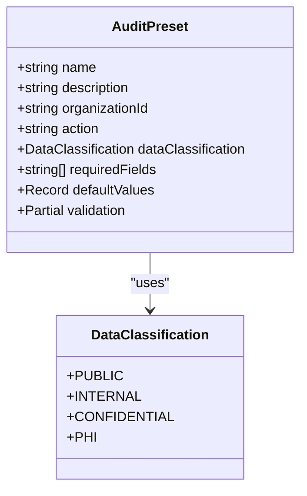
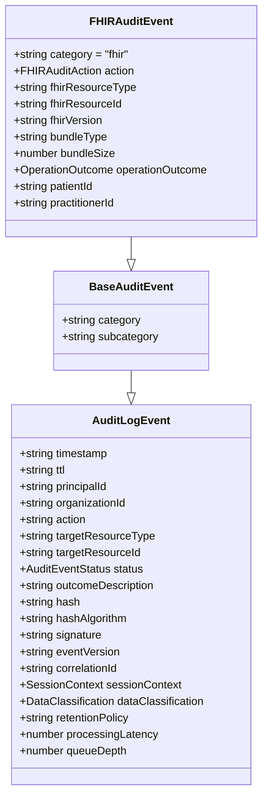
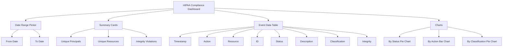
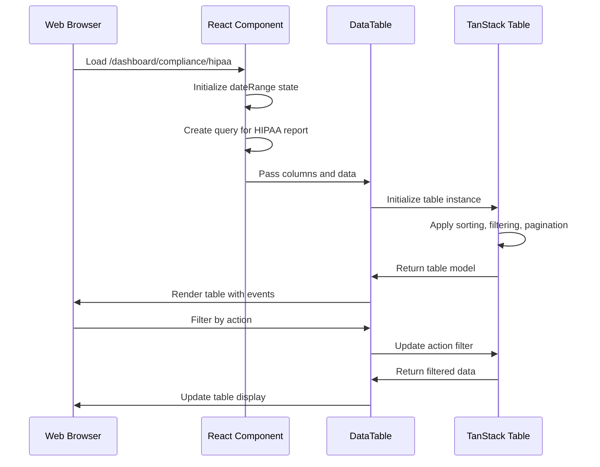
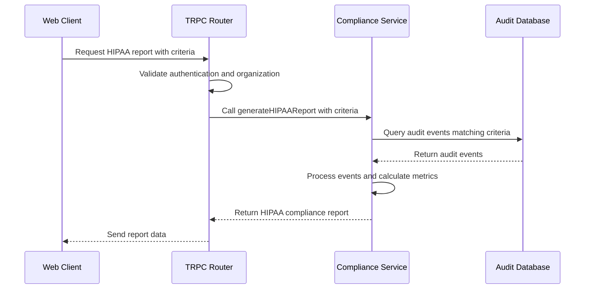
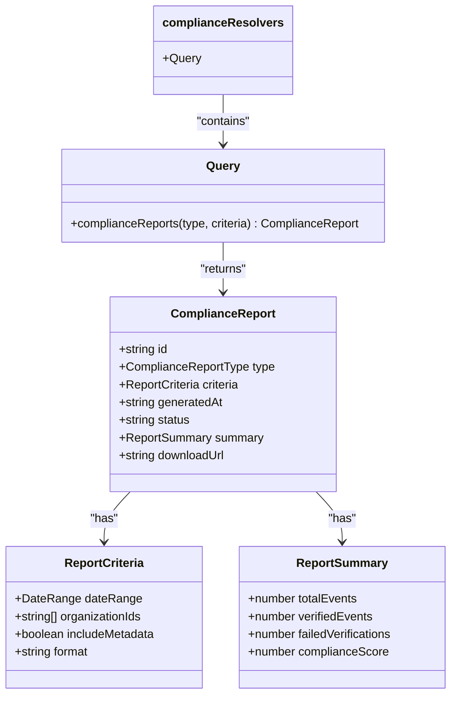

# HIPAA Compliance

<cite>
**Referenced Files in This Document**   
- [compliance.ts](file://packages/audit-sdk/src/compliance.ts)
- [types.ts](file://packages/audit/src/types.ts)
- [event-types.ts](file://packages/audit/src/event/event-types.ts)
- [hipaa.tsx](file://apps/web/src/routes/dashboard/compliance/hipaa.tsx)
- [column.tsx](file://apps/web/src/components/hipaa/column.tsx)
- [data-table.tsx](file://apps/web/src/components/hipaa/data-table.tsx)
- [compliance.ts](file://apps/server/src/routers/compliance.ts)
- [compliance.ts](file://apps/server/src/lib/graphql/resolvers/compliance.ts)
- [preset-types.ts](file://packages/audit/src/preset/preset-types.ts)
- [audit-preset.ts](file://packages/audit/src/preset/audit-preset.ts)
- [security.md](file://apps/docs/src/content/docs/audit/security.md)
- [compliance.test.ts](file://packages/audit-sdk/src/__tests__/compliance.test.ts)
- [compliance-api.ts](file://apps/server/src/routes/compliance-api.ts)
- [reports.ts](file://apps/server/src/routers/reports.ts)
</cite>

## Table of Contents
1. [Introduction](#introduction)
2. [Audit Logging and HIPAA Requirements](#audit-logging-and-hipaa-requirements)
3. [HIPAA Audit Presets and Event Types](#hipaa-audit-presets-and-event-types)
4. [Web Interface for PHI Access Monitoring](#web-interface-for-phi-access-monitoring)
5. [Compliance Reporting and Data Structures](#compliance-reporting-and-data-structures)
6. [Integration with Healthcare Resolvers and Schema](#integration-with-healthcare-resolvers-and-schema)
7. [Common Challenges and Best Practices](#common-challenges-and-best-practices)
8. [Configuration and Compliance Audit Preparation](#configuration-and-compliance-audit-preparation)

## Introduction
This document provides a comprehensive overview of the HIPAA compliance implementation within the SMEDREC audit logging system. It details how the system supports HIPAA requirements for protected health information (PHI) through robust audit logging, integrity checks, and immutable audit trails. The documentation covers the structure and usage of HIPAA-specific audit presets and event types, demonstrates PHI access monitoring via the web interface, and explains integration with healthcare-specific resolvers and schema definitions. Additionally, it addresses common challenges such as ensuring log completeness, preventing tampering, and supporting required retention periods, providing guidance for configuring systems to meet HIPAA technical safeguards and preparing for compliance audits.

## Audit Logging and HIPAA Requirements
The audit logging system is designed to meet HIPAA requirements by capturing comprehensive details of all access to protected health information (PHI). The system ensures that each audit event contains the necessary information to satisfy HIPAA's technical safeguards, including who accessed the data, what action was performed, when it occurred, and from where.

### Access Logging
Access to PHI is meticulously logged with required fields that include:
- **principalId**: Identifies the user or system principal that initiated the action
- **action**: Describes the specific action performed (e.g., "fhir.patient.read")
- **targetResourceType**: Specifies the type of resource accessed (e.g., "Patient")
- **targetResourceId**: Identifies the specific resource accessed
- **timestamp**: Records when the event occurred (automatically generated)
- **sessionContext**: Contains session information including sessionId, ipAddress, and userAgent
- **dataClassification**: Must be set to "PHI" for protected health information

```typescript
// Example of HIPAA-compliant audit log entry
await auditService.log({
	principalId: 'practitioner-123',
	action: 'fhir.patient.read',
	targetResourceType: 'Patient',
	targetResourceId: 'patient-123',
	status: 'success',
	sessionContext: {
		sessionId: 'sess-123',
		ipAddress: '192.168.1.100',
		userAgent: 'EMR/1.0',
	},
	dataClassification: 'PHI',
	retentionPolicy: 'hipaa-6-years',
})
```

### Integrity Checks
To ensure the integrity of audit logs, each event is cryptographically secured with:
- **hash**: SHA-256 cryptographic hash for immutability verification
- **hashAlgorithm**: Specifies the algorithm used (standardized to SHA-256)
- **signature**: HMAC-SHA256 cryptographic signature for additional security

These integrity mechanisms prevent tampering and allow for verification that logs have not been altered after creation.

### Audit Trail Immutability
The audit trail is designed to be immutable through several mechanisms:
1. Cryptographic hashing of each event
2. Digital signatures using HMAC-SHA256
3. Write-once, read-many (WORM) storage principles
4. Automated integrity verification processes
5. Prevention of log deletion or modification

The system automatically generates hashes and signatures, ensuring that any attempt to modify an audit record will be detectable through hash verification failures.

**Section sources**
- [types.ts](file://packages/audit/src/types.ts#L150-L180)
- [security.md](file://apps/docs/src/content/docs/audit/security.md#L364-L409)
- [compliance.test.ts](file://packages/audit-sdk/src/__tests__/compliance.test.ts#L40-L83)

## HIPAA Audit Presets and Event Types
The system implements specialized audit presets and event types specifically designed for HIPAA compliance in healthcare environments.

### HIPAA-Specific Audit Presets
Audit presets provide standardized configurations for common audit scenarios. The HIPAA-specific presets ensure consistent logging across the organization.



**Diagram sources**
- [preset-types.ts](file://packages/audit/src/preset/preset-types.ts#L5-L17)
- [types.ts](file://packages/audit/src/types.ts#L10-L15)

**Section sources**
- [preset-types.ts](file://packages/audit/src/preset/preset-types.ts#L5-L17)

### FHIR Audit Event Types
The system supports FHIR (Fast Healthcare Interoperability Resources) audit events, which are essential for healthcare applications. These events follow healthcare-specific standards and include additional context relevant to medical data.



**Diagram sources**
- [event-types.ts](file://packages/audit/src/event/event-types.ts#L100-L120)
- [types.ts](file://packages/audit/src/types.ts#L20-L40)

**Section sources**
- [event-types.ts](file://packages/audit/src/event/event-types.ts#L100-L120)

### Preset Handler Implementation
The preset handler manages the lifecycle of audit presets, allowing for creation, retrieval, updating, and deletion of presets within an organization.

```mermaid
classDiagram
class PresetHandler {
+getPresets(organizationId) Promise~(AuditPreset & { id? })[]~
+getPreset(name, organizationId) Promise~(AuditPreset & { id? }) | null~
+createPreset(preset) Promise~AuditPreset & { id? }~
+updatePreset(preset) Promise~AuditPreset & { id? }~
+deletePreset(name, organizationId) Promise~{ success : true }~
}
class AuditPreset {
+string name
+string description
+string organizationId
+string action
+DataClassification dataClassification
+string[] requiredFields
+Record<string, any> defaultValues
+Partial<ValidationConfig> validation
}
PresetHandler --> AuditPreset : "manages"
```

**Diagram sources**
- [audit-preset.ts](file://packages/audit/src/preset/audit-preset.ts#L5-L15)
- [preset-types.ts](file://packages/audit/src/preset/preset-types.ts#L5-L17)

**Section sources**
- [audit-preset.ts](file://packages/audit/src/preset/audit-preset.ts#L5-L15)

## Web Interface for PHI Access Monitoring
The web interface provides comprehensive tools for monitoring PHI access and generating compliance reports.

### HIPAA Compliance Dashboard
The HIPAA compliance dashboard allows administrators to monitor and analyze PHI access patterns across the organization. The dashboard has been updated to reflect new reporting requirements and security protocols, including enhanced date range selection and improved data visualization.



**Diagram sources**
- [hipaa.tsx](file://apps/web/src/routes/dashboard/compliance/hipaa.tsx#L0-L346)

**Section sources**
- [hipaa.tsx](file://apps/web/src/routes/dashboard/compliance/hipaa.tsx#L0-L346)

### Data Table Implementation
The data table component renders audit events with sortable and filterable columns, providing an interactive interface for examining PHI access records. The implementation has been updated to use React Query for data fetching and improved loading states with spinner components.



**Diagram sources**
- [data-table.tsx](file://apps/web/src/components/hipaa/data-table.tsx#L0-L130)
- [column.tsx](file://apps/web/src/components/hipaa/column.tsx#L0-L55)

**Section sources**
- [data-table.tsx](file://apps/web/src/components/hipaa/data-table.tsx#L0-L130)
- [column.tsx](file://apps/web/src/components/hipaa/column.tsx#L0-L55)

### Column Configuration
The column configuration defines which fields are displayed in the audit event table and how they are rendered. The configuration includes specific formatting for status and integrity fields to enhance readability.

```typescript
export const createColumns = (): ColumnDef<ComplianceReportEvent>[] => {
	const columns: ColumnDef<ComplianceReportEvent>[] = [
		{
			accessorKey: 'timestamp',
			header: ({ column }) => <DataTableColumnHeader column={column} title="Timestamp" />,
		},
		{
			accessorKey: 'action',
			header: ({ column }) => <DataTableColumnHeader column={column} title="Action" />,
		},
		{
			accessorKey: 'targetResourceType',
			header: ({ column }) => <DataTableColumnHeader column={column} title="Resource" />,
		},
		{
			accessorKey: 'targetResourceId',
			header: ({ column }) => <DataTableColumnHeader column={column} title="ID" />,
		},
		{
			accessorKey: 'status',
			header: ({ column }) => <DataTableColumnHeader column={column} title="Status" />,
			cell: ({ row }) => {
				const status = row.getValue('status') as string
				return <div className={`text-${status} font-medium`}>{status.toUpperCase()}</div>
			},
		},
		{
			accessorKey: 'outcomeDescription',
			header: ({ column }) => <DataTableColumnHeader column={column} title="Description" />,
		},
		{
			accessorKey: 'dataClassification',
			header: ({ column }) => <DataTableColumnHeader column={column} title="Classification" />,
		},
		{
			accessorKey: 'integrityStatus',
			header: ({ column }) => <DataTableColumnHeader column={column} title="Integrity" />,
			cell: ({ row }) => {
				const integrity = row.getValue('integrityStatus') as string
				return <div className="font-medium">{integrity.toUpperCase()}</div>
			},
		},
	]
	return columns
}
```

**Section sources**
- [column.tsx](file://apps/web/src/components/hipaa/column.tsx#L0-L55)

## Compliance Reporting and Data Structures
The system provides robust compliance reporting capabilities that generate detailed HIPAA audit reports based on specified criteria.

### Compliance Report Generation
The compliance reporting system generates comprehensive reports that summarize audit events according to HIPAA requirements. The implementation uses TRPC for API communication and includes error handling for report generation failures.



**Diagram sources**
- [compliance.ts](file://apps/server/src/routers/compliance.ts#L0-L199)
- [compliance.ts](file://apps/server/src/lib/graphql/resolvers/compliance.ts#L0-L136)
- [reports.ts](file://apps/server/src/routers/reports.ts#L26-L63)

**Section sources**
- [compliance.ts](file://apps/server/src/routers/compliance.ts#L0-L199)
- [reports.ts](file://apps/server/src/routers/reports.ts#L26-L63)

### Report Data Structure
The HIPAA compliance report includes comprehensive information about audit events, with specific metrics relevant to HIPAA compliance.

```typescript
interface HIPAAComplianceReport {
	reportType: 'HIPAA_AUDIT_TRAIL'
	hipaaSpecific: {
		phiAccessEvents: number
		phiModificationEvents: number
		unauthorizedAttempts: number
		emergencyAccess: number
		breakGlassEvents: number
		minimumNecessaryViolations: number
	}
	riskAssessment: {
		highRiskEvents: Array<{
			timestamp: string
			principalId: string
			action: string
			targetResourceType: string
			targetResourceId: string
			status: string
		}>
	}
	summary: {
		totalEvents: number
		verifiedEvents: number
		failedVerifications: number
		complianceScore: number
		eventsByStatus: Record<string, number>
		eventsByAction: Record<string, number>
		eventsByDataClassification: Record<string, number>
	}
	events: AuditLogEvent[]
	metadata: {
		reportId: string
		generatedAt: string
		organizationId: string
	}
}
```

**Section sources**
- [compliance-api.ts](file://apps/server/src/routes/compliance-api.ts#L201-L241)
- [compliance.test.ts](file://packages/audit-sdk/src/__tests__/compliance.test.ts#L265-L309)

## Integration with Healthcare Resolvers and Schema
The system integrates with healthcare-specific resolvers and schema definitions to ensure proper handling of PHI and compliance with healthcare regulations.

### GraphQL Compliance Resolver
The GraphQL resolver provides an API endpoint for generating compliance reports, including HIPAA-specific reports. The resolver enforces organization isolation and handles different report types through a switch statement.



**Diagram sources**
- [compliance.ts](file://apps/server/src/lib/graphql/resolvers/compliance.ts#L0-L136)

**Section sources**
- [compliance.ts](file://apps/server/src/lib/graphql/resolvers/compliance.ts#L0-L136)

### Schema Validation
The system uses Zod for schema validation, ensuring that all compliance reports and audit events conform to the required structure.

```typescript
const HIPAAComplianceReportSchema = ComplianceReportSchema.extend({
	reportType: z.literal('HIPAA_AUDIT_TRAIL'),
	hipaaSpecific: z.object({
		phiAccessEvents: z.number(),
		phiModificationEvents: z.number(),
		unauthorizedAttempts: z.number(),
		emergencyAccess: z.number(),
		breakGlassEvents: z.number(),
		minimumNecessaryViolations: z.number(),
	}),
	riskAssessment: z.object({
		highRiskEvents: z.array(
			z.object({
				timestamp: z.string(),
				principalId: z.string().optional(),
				action: z.string(),
				targetResourceType: z.string().optional(),
				targetResourceId: z.string().optional(),
				status: z.string(),
			})
		),
	}),
})
```

**Section sources**
- [compliance-api.ts](file://apps/server/src/routes/compliance-api.ts#L201-L241)

## Common Challenges and Best Practices
Implementing HIPAA compliance in audit logging presents several challenges that require careful consideration and best practices.

### Ensuring Log Completeness
To ensure log completeness, the system implements several strategies:
- **Required fields validation**: The system validates that all required fields are present for HIPAA compliance
- **Automatic field population**: Certain fields like timestamp and eventVersion are automatically generated
- **Comprehensive error handling**: The system captures and logs errors that might otherwise prevent audit logging

```typescript
function validateHIPAA(event: Partial<AuditLogEvent>, hipaaConfig?: ComplianceConfig['hipaa']): void {
	if (!hipaaConfig?.enabled) return

	const requiredFields = hipaaConfig.requiredFields || [
		'principalId',
		'action',
		'targetResourceType',
		'targetResourceId',
		'timestamp',
		'sessionContext',
	]

	for (const field of requiredFields) {
		if (!event[field as keyof AuditLogEvent]) {
			throw new Error(`HIPAA Compliance Error: Required field '${field}' is missing`)
		}
	}
}
```

**Section sources**
- [compliance.ts](file://packages/audit-sdk/src/compliance.ts#L20-L50)

### Preventing Tampering
The system employs multiple layers of protection to prevent tampering with audit logs:
- Cryptographic hashing using SHA-256
- Digital signatures using HMAC-SHA256
- Immutable storage design
- Regular integrity verification
- Access controls to prevent unauthorized modifications

### Supporting Required Retention Periods
HIPAA requires retention of audit logs for six years. The system supports this requirement through:
- **Retention policies**: Events are tagged with retention policies (e.g., "hipaa-6-years")
- **Automated archival**: Logs are automatically moved to long-term storage
- **Retention enforcement**: The system prevents deletion of logs before their retention period expires

```typescript
// Set default retention policy for PHI
if (event.dataClassification === 'PHI' && !event.retentionPolicy) {
	event.retentionPolicy = `hipaa-${hipaaConfig.retentionYears || 6}-years`
}
```

**Section sources**
- [compliance.ts](file://packages/audit-sdk/src/compliance.ts#L80-L129)

## Configuration and Compliance Audit Preparation
Proper configuration is essential for meeting HIPAA technical safeguards and preparing for compliance audits.

### SDK Configuration
The Audit SDK is configured with HIPAA compliance settings that define the behavior of the audit system.

```typescript
const config = {
	storageType: 's3',
	compliance: {
		hipaa: {
			enabled: true,
			retentionYears: 6,
		},
	},
}
const auditSDK = new AuditSDK(config)
```

**Section sources**
- [sdk.test.ts](file://packages/audit-sdk/src/__tests__/sdk.test.ts#L39-L94)

### Compliance Validation
The system includes comprehensive validation to ensure that audit events meet HIPAA requirements.

```typescript
// Validate PHI resources have correct data classification
if (event.targetResourceType && isPHIResource(event.targetResourceType)) {
	if (event.dataClassification !== 'PHI') {
		throw new Error('HIPAA Compliance Error: PHI resources must have dataClassification set to "PHI"')
	}
}

// Validate session context for PHI access
if (event.dataClassification === 'PHI' && !event.sessionContext) {
	throw new Error('HIPAA Compliance Error: PHI access events must include sessionContext')
}
```

**Section sources**
- [compliance.ts](file://packages/audit-sdk/src/compliance.ts#L55-L75)

### Audit Preparation
To prepare for compliance audits, organizations should:
1. Regularly generate and review HIPAA compliance reports
2. Verify that all PHI access is properly logged
3. Confirm that integrity checks are functioning correctly
4. Ensure retention policies are properly applied
5. Test incident response procedures
6. Maintain documentation of compliance efforts

The system supports these activities by providing comprehensive reporting, alerting, and monitoring capabilities that demonstrate compliance with HIPAA requirements.

**Section sources**
- [compliance.test.ts](file://packages/audit-sdk/src/__tests__/compliance.test.ts#L265-L309)
- [security.md](file://apps/docs/src/content/docs/audit/security.md#L364-L409)