# Security and Compliance

<cite>
**Referenced Files in This Document**   
- [gdpr-compliance.ts](file://packages/audit/src/gdpr/gdpr-compliance.ts) - *Updated in recent commit*
- [gdpr-utils.ts](file://packages/audit/src/gdpr/gdpr-utils.ts) - *Updated in recent commit*
- [schema.ts](file://packages/audit-db/src/db/schema.ts)
- [pseudonym_mapping.sql](file://packages/audit-db/drizzle/migrations/0006_silly_tyger_tiger.sql) - *Added in recent commit*
- [0007_keen_ego.sql](file://packages/audit-db/drizzle/migrations/0007_keen_ego.sql) - *Added strategy column to pseudonym mapping*
- [0008_swift_black_panther.sql](file://packages/audit-db/drizzle/migrations/0008_swift_black_panther.sql) - *Made original_id index unique*
- [client.ts](file://packages/infisical-kms/src/client.ts) - *KMS integration for pseudonymization*
- [permissions.ts](file://packages/auth/src/permissions.ts) - *Updated in recent commit*
- [authz.ts](file://packages/auth/src/db/schema/authz.ts) - *Updated in recent commit*
- [types.ts](file://packages/audit/src/config/types.ts) - *Added KMS encryption support*
- [tracer.ts](file://packages/audit/src/observability/tracer.ts) - *OTLP exporter with auth headers*
- [crypto.ts](file://packages/audit/src/crypto.ts) - *Updated in recent commit*
- [audit-api.ts](file://apps/server/src/routes/audit-api.ts) - *Updated in recent commit*
- [audit-events.ts](file://apps/server/src/lib/graphql/resolvers/audit-events.ts) - *Updated in recent commit*
- [execution-history-page.tsx](file://apps/app/src/components/compliance/execution/execution-history-page.tsx) - *Updated in recent commit*
- [report-details-page.tsx](file://apps/app/src/components/compliance/reports/report-details-page.tsx) - *Updated in recent commit*
- [export-button.tsx](file://apps/app/src/components/compliance/export/export-button.tsx) - *Updated in recent commit*
- [CompliancePageHeader.tsx](file://apps/app/src/components/compliance/navigation/CompliancePageHeader.tsx) - *Updated in recent commit*
</cite>

## Update Summary
**Changes Made**   
- Added comprehensive documentation for GDPR pseudonymization implementation including service architecture, strategies, and audit trails
- Enhanced data minimization section with details on persistent pseudonym mapping storage and KMS encryption
- Updated code examples to reflect current pseudonymization implementation with KMS integration
- Added new section on pseudonymization strategies and their implementation
- Updated sequence diagram to show KMS encryption in pseudonym mapping storage
- Added documentation for organization role management with Redis caching
- Updated security measures section to include role-based access control with Redis caching
- Added new class diagram for AuthorizationService and role management
- Added new section on OTLP observability exporter with authentication support
- Integrated KMS encryption configuration details into security measures
- Updated integrity verification section to reflect restricted field hashing and improved verification logic
- Added new flowchart for integrity verification process with debug logging
- Updated security measures section with enhanced hash verification details
- Added new section on pseudonymization of audit events
- Updated pseudonymization strategies section with database schema changes
- Added documentation for unique constraint on original_id in pseudonym mapping table
- Added documentation for custom report type implementation and enhanced execution statuses
- Updated compliance reporting section with details on custom report types and execution history
- Added new section on data export functionality with advanced export options
- Updated UI components documentation for compliance reporting and export features
- Added documentation for keyboard shortcuts dialog in compliance UI
- Maintained existing structure while incorporating new pseudonymization features

## Table of Contents
1. [Introduction](#introduction)
2. [GDPR Compliance Implementation](#gdpr-compliance-implementation)
3. [HIPAA Compliance Features](#hipaa-compliance-features)
4. [Security Measures](#security-measures)
5. [Compliance Reporting and Data Export](#compliance-reporting-and-data-export)
6. [Relationships Between Compliance Modules](#relationships-between-compliance-modules)
7. [Common Compliance Issues and Solutions](#common-compliance-issues-and-solutions)
8. [Best Practices for Production Compliance](#best-practices-for-production-compliance)

## Introduction
The Smart Logs system provides comprehensive security and compliance features designed to meet regulatory requirements including GDPR and HIPAA. The architecture implements data protection principles such as data minimization, right to erasure, consent tracking, and audit logging through a modular system of compliance services, cryptographic integrity verification, and automated reporting. This document details the implementation of these features across the codebase, focusing on practical examples and integration patterns.

## GDPR Compliance Implementation

The GDPR compliance implementation follows privacy-by-design principles with specific features for data subject rights, data minimization, and consent tracking.

### Right to Erasure Implementation
The system implements the right to erasure through a sophisticated pseudonymization approach that preserves compliance audit trails while removing personally identifiable information.

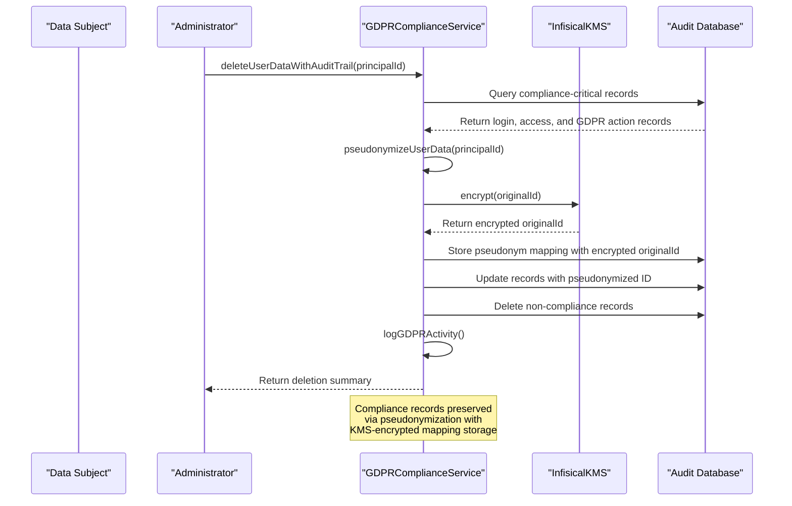

**Section sources**
- [gdpr-compliance.ts](file://packages/audit/src/gdpr/gdpr-compliance.ts#L380-L470)

### Data Minimization and Pseudonymization
The system implements data minimization through pseudonymization strategies that replace personally identifiable information with artificial identifiers while maintaining referential integrity. The implementation includes persistent storage of pseudonym mappings in an encrypted format using KMS integration.

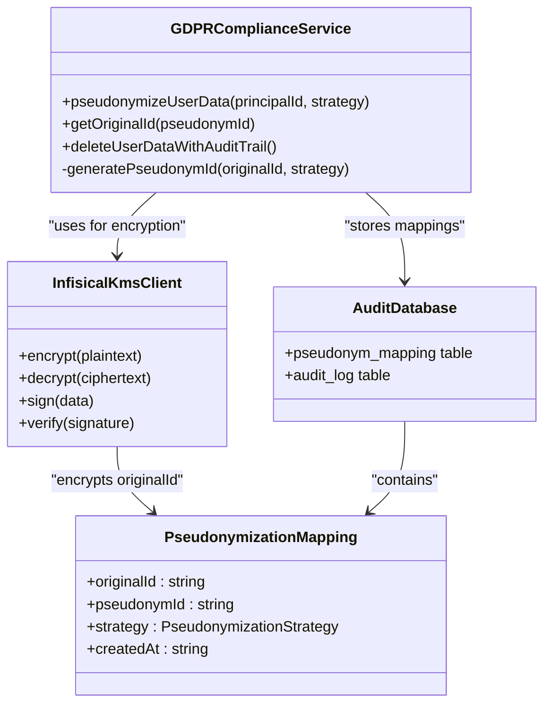

**Section sources**
- [gdpr-compliance.ts](file://packages/audit/src/gdpr/gdpr-compliance.ts#L100-L150)
- [schema.ts](file://packages/audit-db/src/db/schema.ts#L643-L658)
- [pseudonym_mapping.sql](file://packages/audit-db/drizzle/migrations/0006_silly_tyger_tiger.sql)
- [0007_keen_ego.sql](file://packages/audit-db/drizzle/migrations/0007_keen_ego.sql)
- [0008_swift_black_panther.sql](file://packages/audit-db/drizzle/migrations/0008_swift_black_panther.sql)
- [client.ts](file://packages/infisical-kms/src/client.ts)

### Pseudonymization Strategies
The system implements multiple pseudonymization strategies to accommodate different security and performance requirements.

**Hash Strategy**: Uses SHA-256 hashing with salt to create deterministic pseudonyms. This strategy ensures the same original ID always produces the same pseudonym, enabling consistent referential integrity.

```typescript
private generatePseudonymId(originalId: string, strategy: PseudonymizationStrategy): string {
  switch (strategy) {
    case 'hash':
      return `pseudo-${createHash('sha256')
        .update(originalId + process.env.PSEUDONYM_SALT || 'default-salt')
        .digest('hex')
        .substring(0, 16)}`
```

**Token Strategy**: Generates random hexadecimal tokens for non-deterministic pseudonymization. This approach provides stronger privacy protection as it prevents reverse engineering through hash comparison.

```typescript
case 'token':
  return `pseudo-${randomBytes(16).toString('hex')}`
```

**Encryption Strategy**: Uses KMS-managed encryption keys to encrypt original IDs. This strategy provides the highest security level and enables authorized reversal of pseudonymization when required for compliance investigations.

```typescript
case 'encryption':
  const encryptedOriginalId = await this.kms.encrypt(principalId)
  await this.db.insert(pseudonymMapping).values({
    timestamp: new Date().toISOString(),
    pseudonymId,
    originalId: encryptedOriginalId.ciphertext,
    strategy: 'encryption'
  })
```

The pseudonym_mapping table now includes a strategy column to track which pseudonymization method was used for each mapping. This allows for strategy-specific processing and auditing of pseudonymization activities.

**Section sources**
- [gdpr-compliance.ts](file://packages/audit/src/gdpr/gdpr-compliance.ts#L524-L572)
- [gdpr-utils.ts](file://packages/audit/src/gdpr/gdpr-utils.ts#L4-L25)
- [0007_keen_ego.sql](file://packages/audit-db/drizzle/migrations/0007_keen_ego.sql)

### Pseudonymization of Audit Events
The system now supports direct pseudonymization of audit events through the pseudonymizeEvent method, which automatically processes principalId and targetResourceId fields.

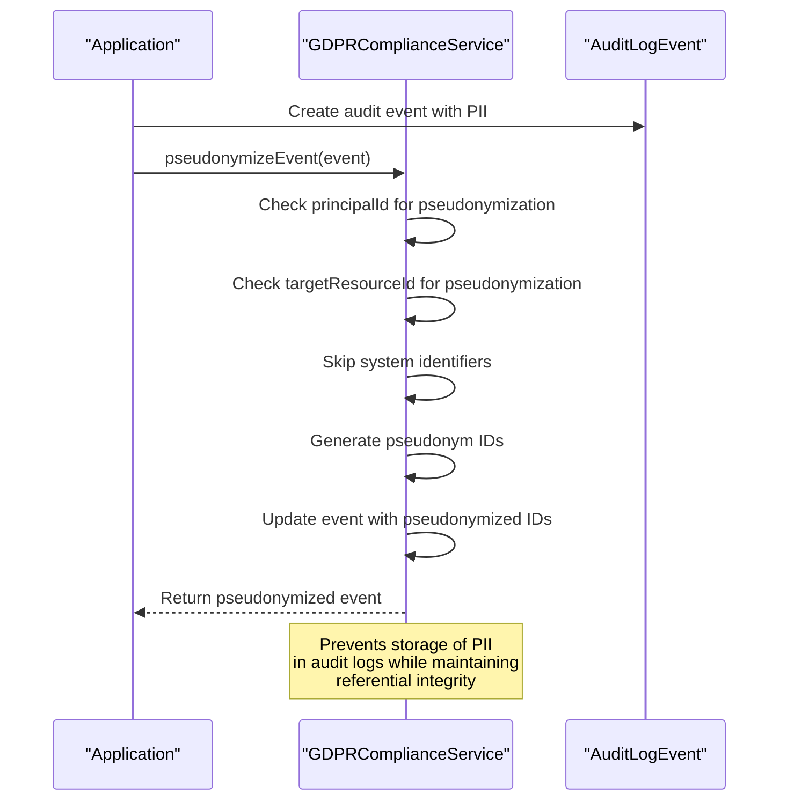

This feature is particularly useful in high-throughput scenarios where events are processed through worker queues, as it ensures personal data is pseudonymized before persistent storage.

**Section sources**
- [gdpr-compliance.ts](file://packages/audit/src/gdpr/gdpr-compliance.ts#L319-L361)
- [index.ts](file://apps/worker/src/index.ts#L586-L630)

### Consent Tracking Implementation
The system tracks consent through the `gdprContext` field in audit events, which captures legal basis, processing purpose, and data categories.

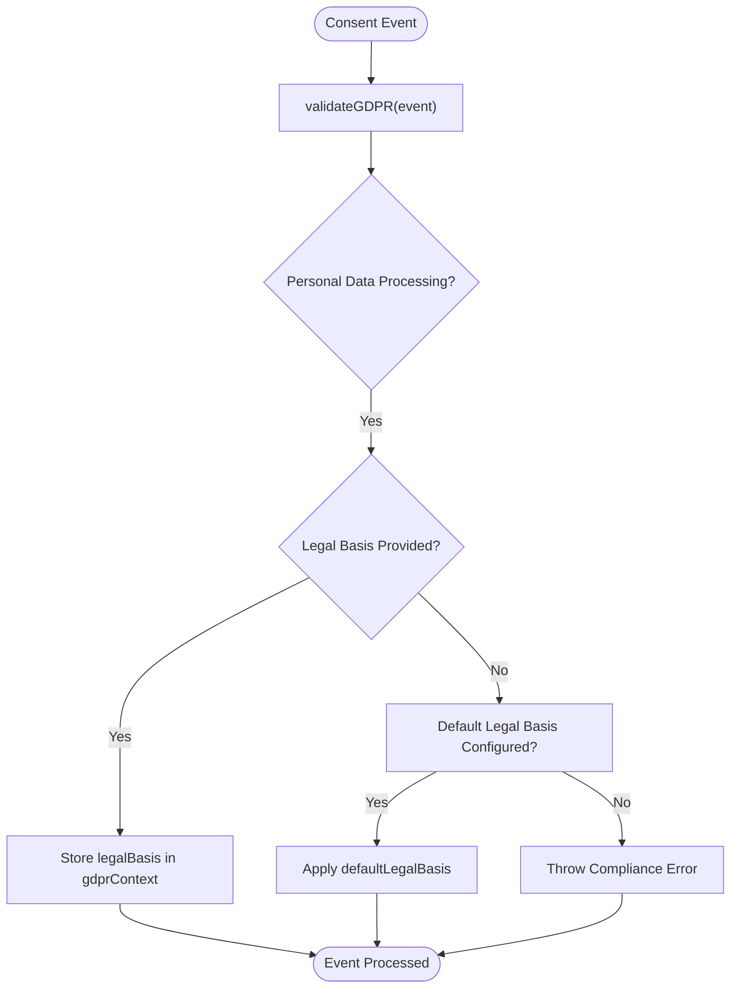

**Section sources**
- [compliance.ts](file://packages/audit-sdk/src/compliance.ts#L100-L130)

## HIPAA Compliance Features

The system implements HIPAA compliance through strict audit logging requirements, PHI data classification, and healthcare-specific audit trails.

### Healthcare Audit Logging
The HIPAA compliance implementation enforces specific requirements for protected health information (PHI) access and modification events.

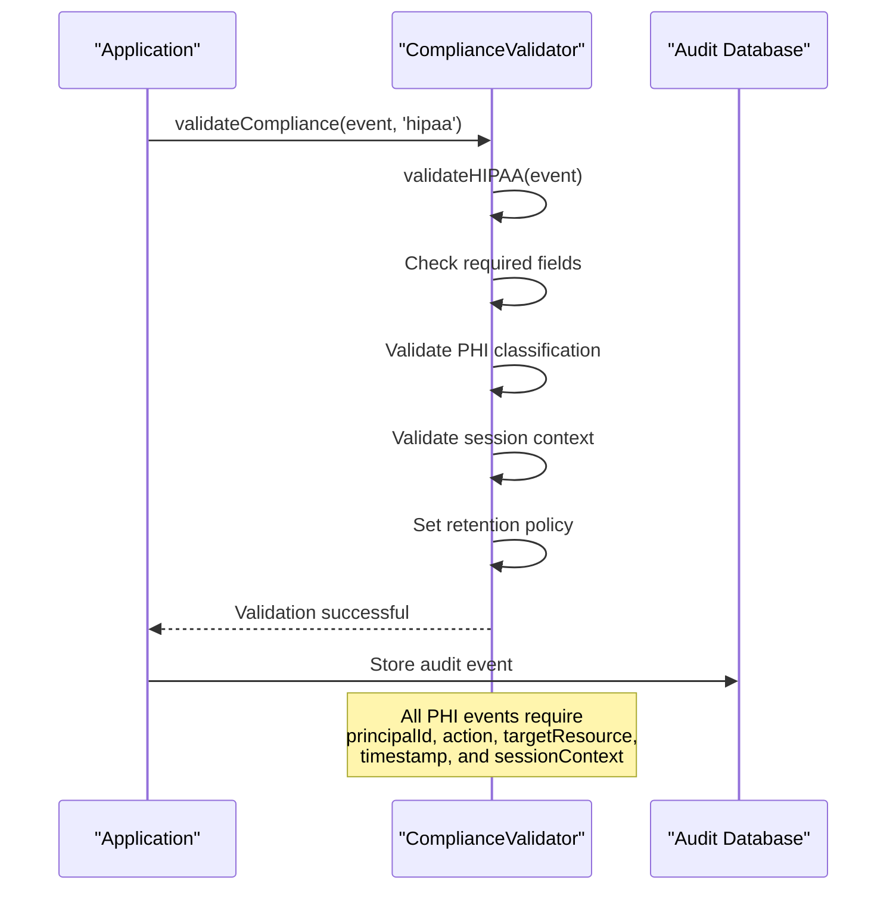

**Section sources**
- [compliance.ts](file://packages/audit-sdk/src/compliance.ts#L40-L80)

### PHI Data Classification
The system identifies PHI resources through a predefined list of healthcare resource types and enforces appropriate data classification.

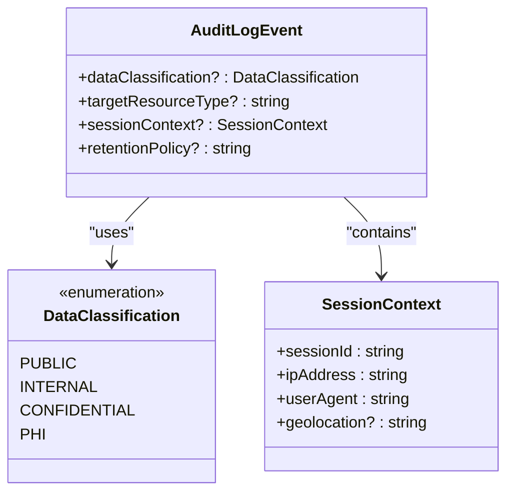

**Section sources**
- [types.ts](file://packages/audit/src/types.ts#L10-L50)
- [schema.ts](file://packages/audit-db/src/db/schema.ts#L20-L30)

## Security Measures

The system implements multiple security measures to protect data integrity and ensure secure access.

### Data Encryption and Integrity
The system ensures data integrity through cryptographic hashing and provides options for data encryption in exports. The Infisical KMS integration uses RSASSA_PSS_SHA_256 as the default signing algorithm for enhanced security. Pseudonym mappings are encrypted using KMS before storage.


**Section sources**
- [compliance-reporting.ts](file://packages/audit/src/report/compliance-reporting.ts#L300-L400)
- [schema.ts](file://packages/audit-db/src/db/schema.ts#L50-L70)
- [client.ts](file://packages/infisical-kms/src/client.ts#L100-L120)

### Secure Authentication and Access Controls
The system implements secure authentication through audit logging of all authentication events and role-based access controls. The authorization service uses Redis caching to improve performance of permission checks.

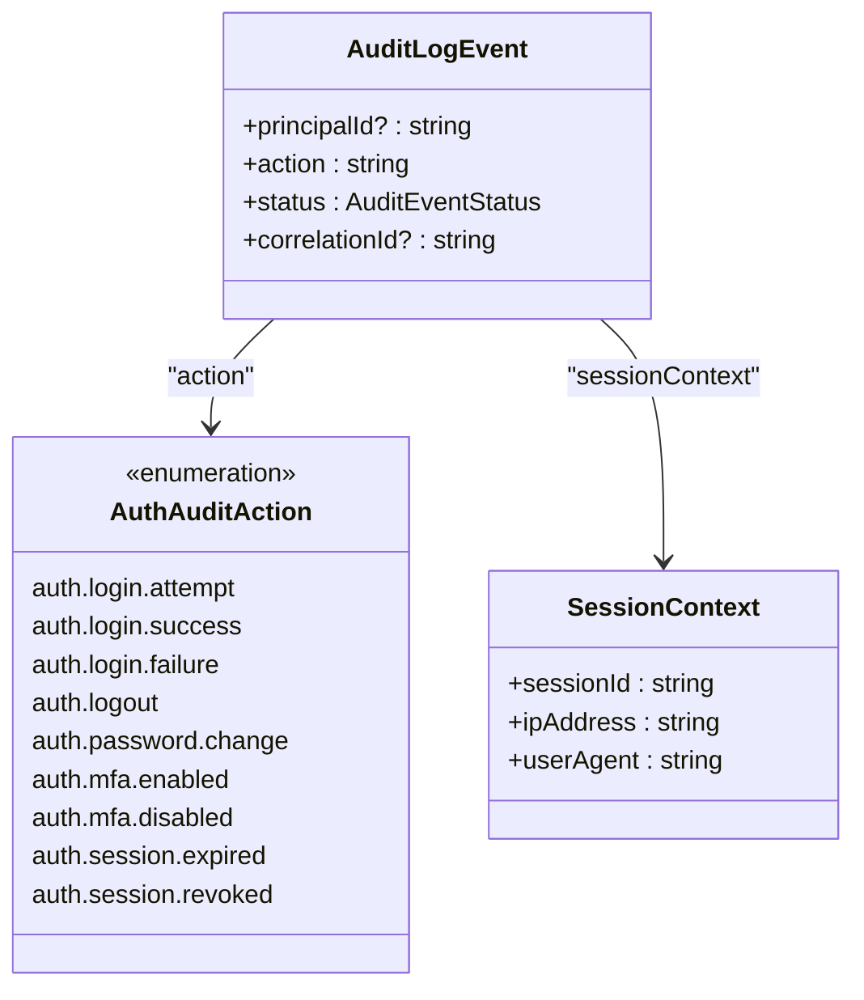

**Section sources**
- [types.ts](file://packages/audit/src/types.ts#L150-L180)

### Organization Role Management with Redis Caching
The system implements organization role management with Redis caching for improved performance. Roles are stored in both PostgreSQL and Redis, with Redis serving as the primary cache for permission checks.

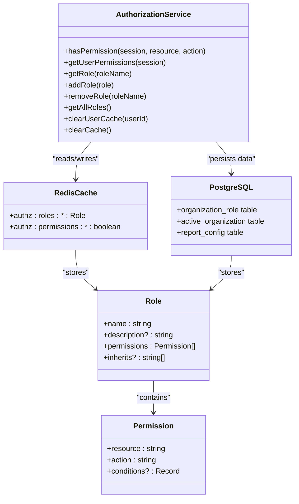

**Section sources**
- [permissions.ts](file://packages/auth/src/permissions.ts#L0-L691)
- [authz.ts](file://packages/auth/src/db/schema/authz.ts#L0-L118)

### KMS Encryption Configuration
The system supports KMS encryption through configurable settings in the SecurityConfig interface. This allows for centralized key management and enhanced security for sensitive operations including pseudonymization and data protection.

```typescript
interface SecurityConfig {
  /** Enable KMS encryption */
  kms: {
    enabled: boolean
    encryptionKey: string
    signingKey: string
    accessToken: string
    baseUrl: string
    algorithm?: 'AES-256-GCM' | 'AES-256-CBC'
    kdf?: 'PBKDF2' | 'scrypt'
    salt?: string
    iterations?: number
  }
}
```

**Section sources**
- [types.ts](file://packages/audit/src/config/types.ts#L430-L475)
- [client.ts](file://packages/infisical-kms/src/client.ts)

### Enhanced Integrity Verification
The system has been updated to restrict the fields used in hash calculation for improved security and integrity verification. The verification process now includes precondition checks and enhanced debug logging to identify verification issues.

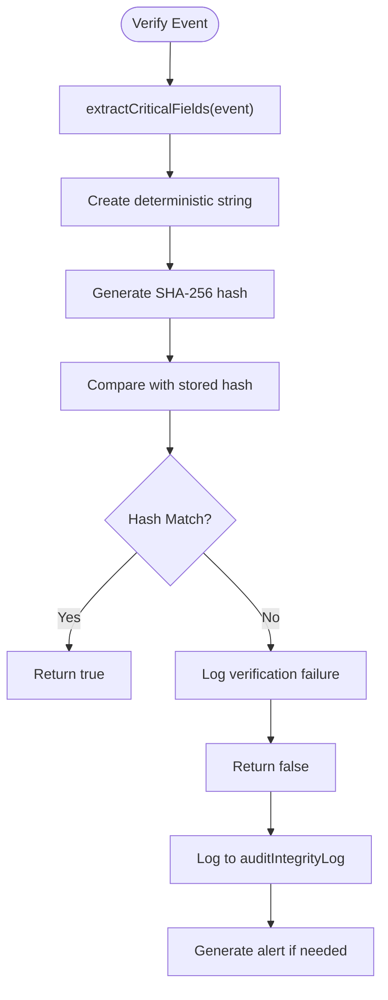

**Section sources**
- [crypto.ts](file://packages/audit/src/crypto.ts#L89-L128)
- [audit-api.ts](file://apps/server/src/routes/audit-api.ts#L700-L799)
- [audit-events.ts](file://apps/server/src/lib/graphql/resolvers/audit-events.ts#L450-L537)

## Compliance Reporting and Data Export

The system provides comprehensive compliance reporting and data export capabilities for regulatory requirements.

### Custom Report Types and Execution Statuses
The system now supports custom report types and enhanced execution statuses for more flexible compliance reporting. The `CUSTOM_REPORT` type allows organizations to define their own report configurations and criteria.

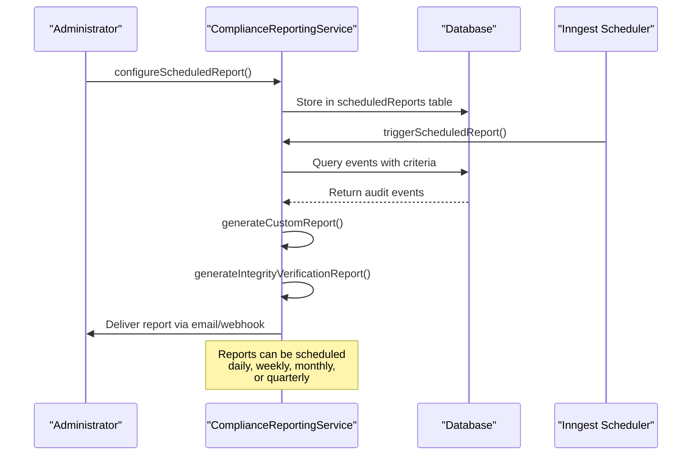

The execution history page now displays enhanced status information including running, pending, cancelled, timeout, and skipped statuses. This provides better visibility into report execution states.

**Section sources**
- [execution-history-page.tsx](file://apps/app/src/components/compliance/execution/execution-history-page.tsx#L47-L671)
- [report-details-page.tsx](file://apps/app/src/components/compliance/reports/report-details-page.tsx#L77-L482)
- [compliance-reporting.ts](file://packages/audit/src/report/compliance-reporting.ts#L200-L300)
- [scheduled-reporting.ts](file://packages/audit/src/report/scheduled-reporting.ts#L274-L1293)

### Data Export Implementation
The system implements comprehensive data export functionality with both quick export options and advanced export capabilities. The export button component provides a dropdown menu with recommended formats and an option for advanced export configuration.

```mermaid
flowchart TD
A([Export Request]) --> B["exportUserData(request)"]
B --> C["Query auditLog table"]
C --> D["Format as JSON/CSV/XML/PDF"]
D --> E["Include metadata"]
E --> F["Log export activity"]
F --> G["Return GDPRDataExport"]
G --> H["Download or Email"]
Note over D: Supports JSON, CSV, XML, and PDF<br/>formats with optional metadata
```

The advanced export manager allows users to select specific columns, include headers and metadata, and track export job progress. Export jobs are displayed with status indicators showing processing, completed, failed, and cancelled states.

```mermaid
classDiagram
class ExportManager {
+type : ExportType
+data : any[]
+onExport : (options : ExportOptions) => Promise<void>
+availableColumns : Array<{key : string, label : string, description? : string}>
+defaultOptions : Partial<ExportOptions>
}
class ExportJob {
+id : string
+type : ExportType
+format : ExportFormat
+status : 'pending' | 'processing' | 'completed' | 'failed' | 'cancelled'
+progress : number
+createdAt : Date
+completedAt? : Date
+downloadUrl? : string
+fileName : string
+fileSize? : number
+error? : string
+options : ExportOptions
}
class ExportOptions {
+format : ExportFormat
+includeHeaders : boolean
+includeMetadata : boolean
+columns? : string[]
+customFields? : string[]
}
ExportManager --> ExportJob : "manages"
ExportManager --> ExportOptions : "configures"
```

**Section sources**
- [export-button.tsx](file://apps/app/src/components/compliance/export/export-button.tsx#L74-L244)
- [export-manager.tsx](file://apps/app/src/components/compliance/export/export-manager.tsx#L482-L645)
- [data-export.ts](file://packages/audit/src/report/data-export.ts#L86-L586)
- [compliance-api.ts](file://apps/server/src/routes/compliance-api.ts#L0-L775)

### Usage Patterns for Compliance Reporting
The reporting system supports various compliance reporting use cases with configurable criteria and delivery options.


**Section sources**
- [compliance-reporting.ts](file://packages/audit/src/report/compliance-reporting.ts#L200-L300)
- [schema.ts](file://packages/audit-db/src/db/schema.ts#L500-L550)

## Relationships Between Compliance Modules

The compliance system consists of interconnected modules that work together to provide comprehensive regulatory compliance.

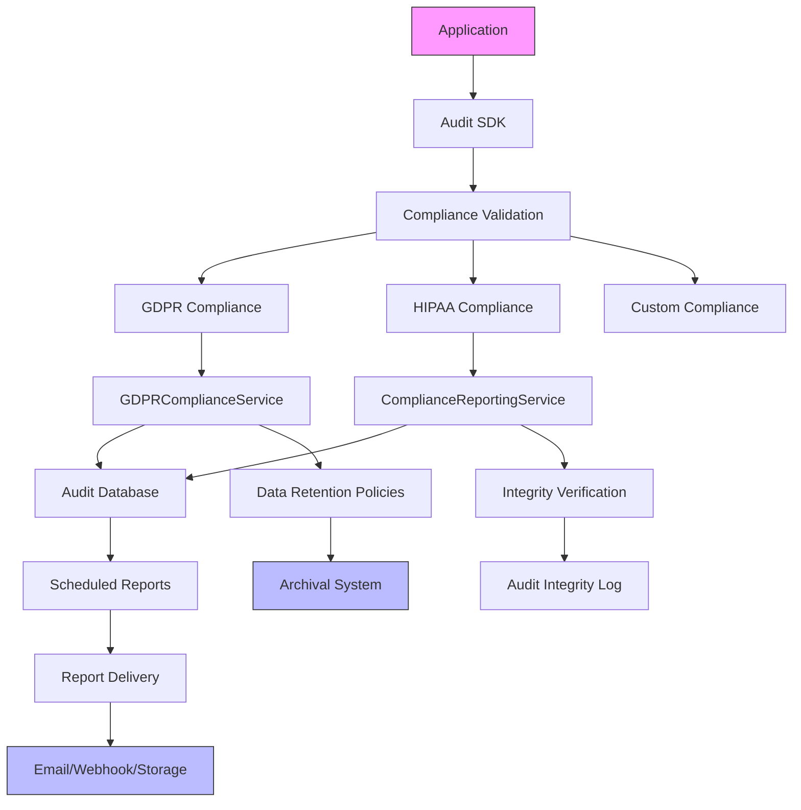

**Section sources**
- [compliance.ts](file://packages/audit-sdk/src/compliance.ts)
- [compliance-reporting.ts](file://packages/audit/src/report/compliance-reporting.ts)
- [gdpr-compliance.ts](file://packages/audit/src/gdpr/gdpr-compliance.ts)
- [schema.ts](file://packages/audit-db/src/db/schema.ts)

## Common Compliance Issues and Solutions

This section addresses common regulatory compliance challenges and their implementations in the system.

### Issue: Balancing Right to Erasure with Audit Requirements
**Problem**: GDPR's right to erasure conflicts with regulatory requirements to maintain audit trails.

**Solution**: The system implements pseudonymization of compliance-critical records while deleting non-essential personal data. Pseudonym mappings are stored in a dedicated encrypted table with KMS integration.

```typescript
async deleteUserDataWithAuditTrail(
  principalId: string,
  requestedBy: string,
  preserveComplianceAudits: boolean = true
): Promise<{ recordsDeleted: number; complianceRecordsPreserved: number }> {
  // Identify compliance-critical records to preserve
  const complianceActions = [
    'auth.login.success',
    'auth.login.failure',
    'data.access.unauthorized',
    'gdpr.data.export',
    'gdpr.data.pseudonymize',
    'gdpr.data.delete',
  ]

  // Pseudonymize compliance records instead of deleting
  const pseudonymResult = await this.pseudonymizeUserData(principalId, 'hash', requestedBy)
  
  // Delete non-compliance records
  const deleteResult = await this.db
    .delete(auditLog)
    .where(
      and(
        eq(auditLog.principalId, principalId),
        sql`NOT (${auditLog.action} = ANY(${complianceActions}))`
      )
    )
}
```

**Section sources**
- [gdpr-compliance.ts](file://packages/audit/src/gdpr/gdpr-compliance.ts#L380-L470)
- [schema.ts](file://packages/audit-db/src/db/schema.ts#L643-L658)
- [pseudonym_mapping.sql](file://packages/audit-db/drizzle/migrations/0006_silly_tyger_tiger.sql)
- [0007_keen_ego.sql](file://packages/audit-db/drizzle/migrations/0007_keen_ego.sql)
- [0008_swift_black_panther.sql](file://packages/audit-db/drizzle/migrations/0008_swift_black_panther.sql)

### Issue: Ensuring Data Minimization in Audit Logs
**Problem**: Collecting excessive data in audit logs violates GDPR's data minimization principle.

**Solution**: The system implements field validation and only collects necessary information for compliance purposes.

```typescript
function validateGDPR(event: Partial<AuditLogEvent>, gdprConfig?: ComplianceConfig['gdpr']): void {
  // Set retention policy for all events
  if (!event.retentionPolicy && gdprConfig.retentionDays) {
    event.retentionPolicy = `gdpr-${gdprConfig.retentionDays}-days`
  }

  // Check for personal data processing
  if (isPersonalDataProcessing(event)) {
    // Require legal basis
    if (!event.gdprContext?.legalBasis) {
      if (gdprConfig.defaultLegalBasis) {
        event.gdprContext = {
          ...event.gdprContext,
          legalBasis: gdprConfig.defaultLegalBasis,
        }
      } else {
        throw new Error('GDPR Compliance Error: Legal basis required for personal data processing')
      }
    }
  }
}
```

**Section sources**
- [compliance.ts](file://packages/audit-sdk/src/compliance.ts#L100-L130)

## Best Practices for Production Compliance

This section outlines best practices for maintaining compliance in production deployments.

### Regular Compliance Audits
Conduct regular audits of the system to ensure ongoing compliance with regulatory requirements.

**Recommendations:**
- Schedule automated HIPAA and GDPR reports monthly
- Verify integrity of audit logs quarterly
- Review retention policies annually
- Test right to erasure procedures regularly

### Monitoring and Alerting
Implement monitoring for compliance-related events and potential violations.

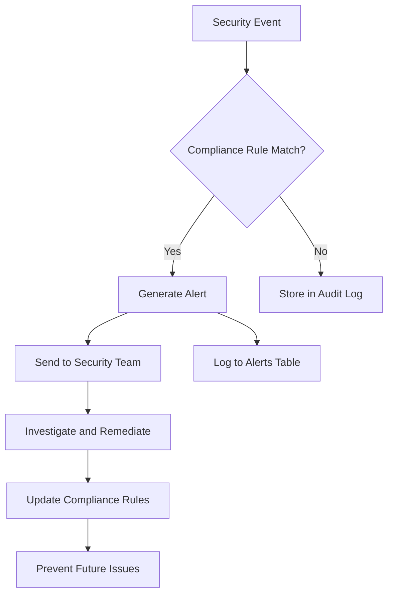

**Section sources**
- [schema.ts](file://packages/audit-db/src/db/schema.ts#L400-L450)

### Data Retention Management
Implement proper data retention policies to comply with regulatory requirements.

**Implementation:**
- Configure retention policies based on data classification
- Automate archival and deletion processes
- Maintain logs of retention policy applications
- Ensure backup systems follow the same retention rules

```typescript
async applyRetentionPolicies(): Promise<ArchivalResult[]> {
  // Get active retention policies
  const policies = await this.client.executeOptimizedQuery(
    (db) =>
      db.select().from(auditRetentionPolicy).where(eq(auditRetentionPolicy.isActive, 'true')),
    { cacheKey: 'active_retention_policies', cacheTTL: 3600 }
  )

  for (const policy of retentionPolicies) {
    const result = await this.applyRetentionPolicy(policy as RetentionPolicy)
    results.push(result)
  }
}
```

**Section sources**
- [gdpr-compliance.ts](file://packages/audit/src/gdpr/gdpr-compliance.ts#L280-L320)

### OTLP Observability Exporter
The system supports OTLP (OpenTelemetry Protocol) for distributed tracing export to observability platforms. The exporter includes authentication support through environment variables.

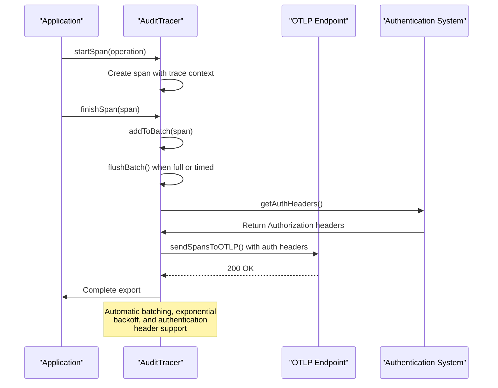

**Section sources**
- [tracer.ts](file://packages/audit/src/observability/tracer.ts#L487-L537)
- [types.ts](file://packages/audit/src/config/types.ts#L430-L475)