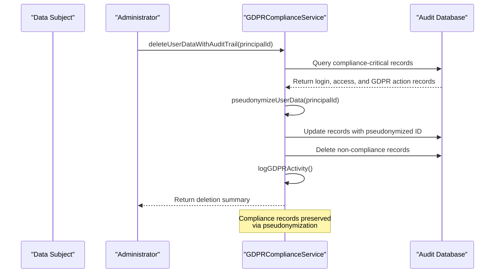
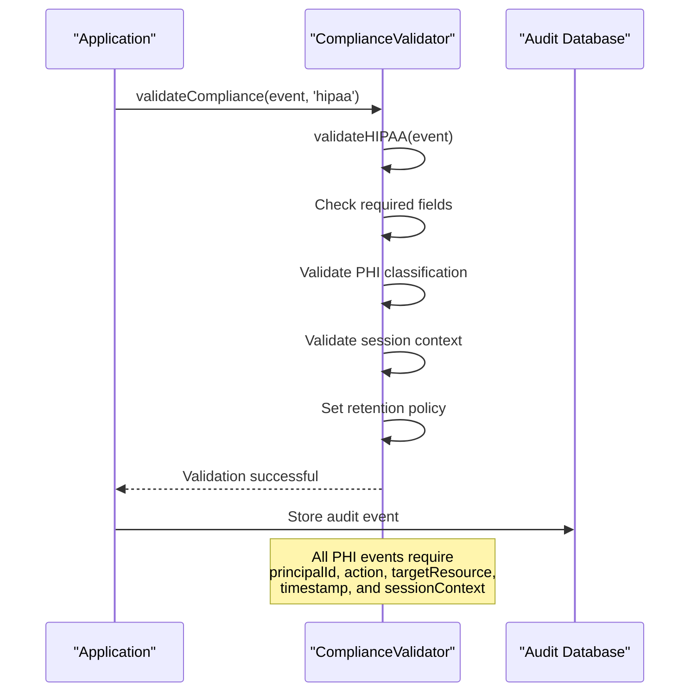
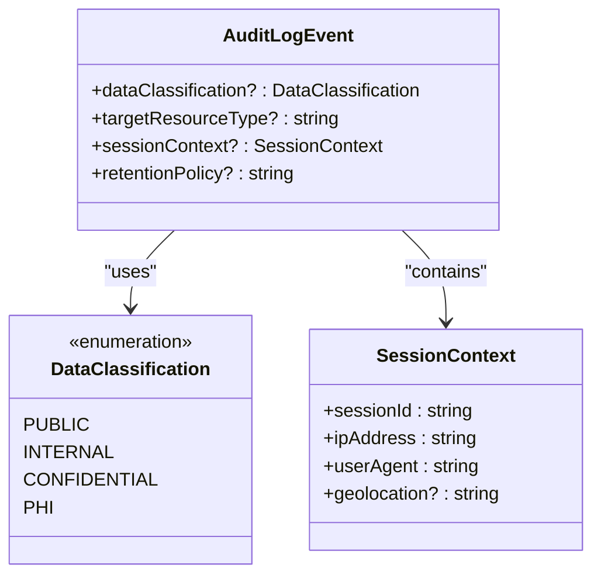
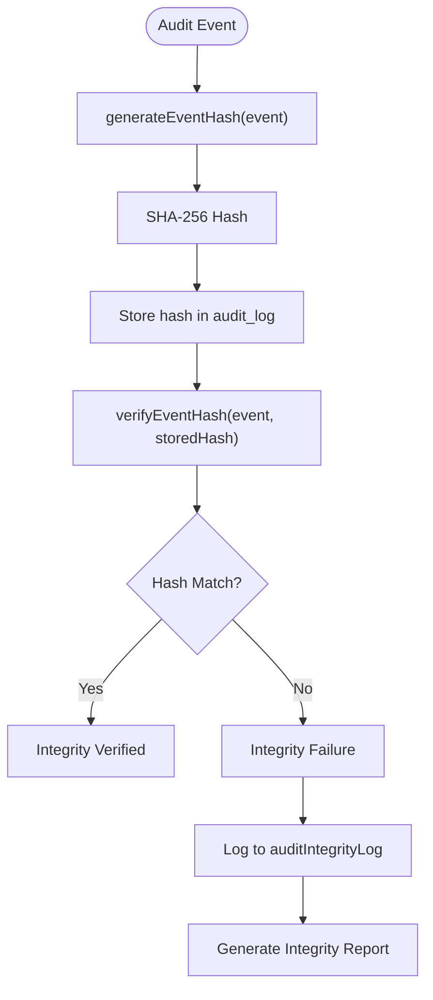
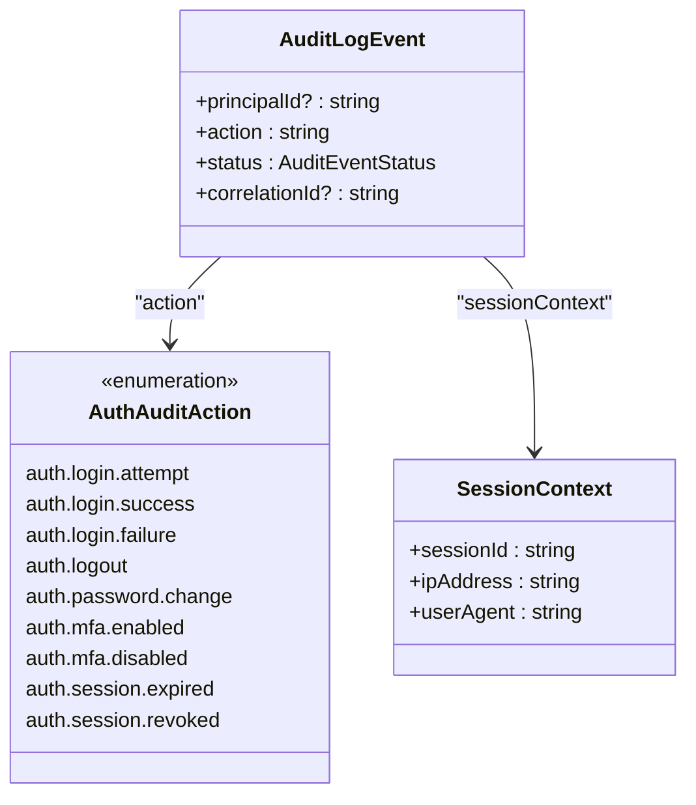
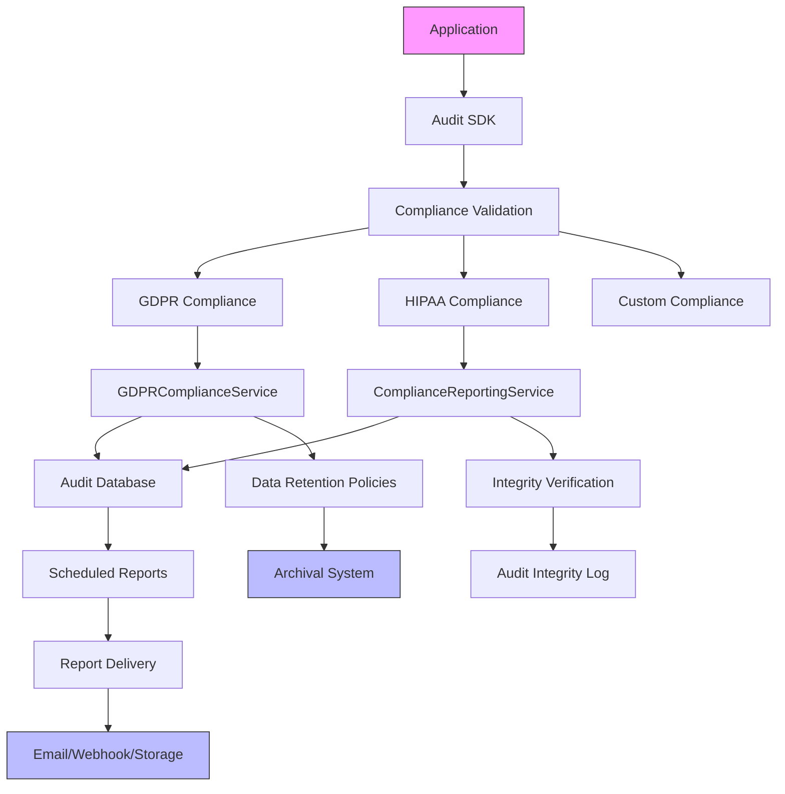
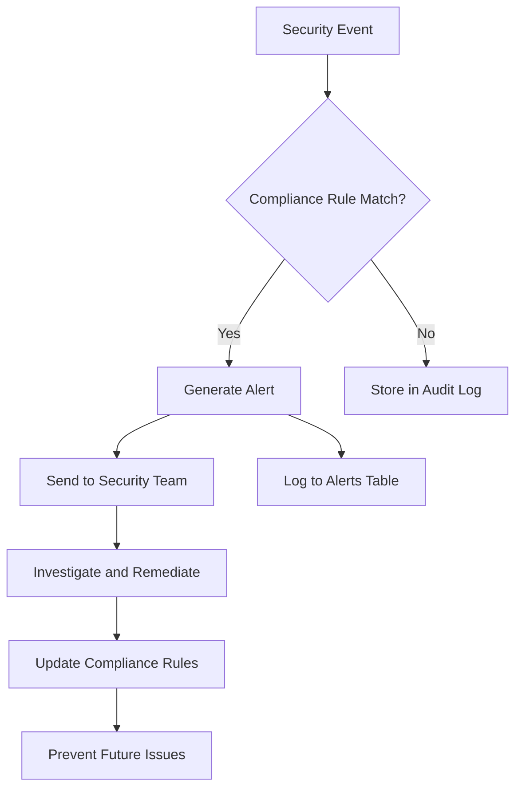

# Security and Compliance

<cite>
**Referenced Files in This Document**   
- [compliance.ts](file://packages/audit-sdk/src/compliance.ts)
- [compliance-reporting.ts](file://packages/audit/src/report/compliance-reporting.ts)
- [gdpr-compliance.ts](file://packages/audit/src/gdpr/gdpr-compliance.ts)
- [schema.ts](file://packages/audit-db/src/db/schema.ts)
- [types.ts](file://packages/audit/src/types.ts)
</cite>

## Table of Contents
1. [Introduction](#introduction)
2. [GDPR Compliance Implementation](#gdpr-compliance-implementation)
3. [HIPAA Compliance Features](#hipaa-compliance-features)
4. [Security Measures](#security-measures)
5. [Compliance Reporting and Data Export](#compliance-reporting-and-data-export)
6. [Relationships Between Compliance Modules](#relationships-between-compliance-modules)
7. [Common Compliance Issues and Solutions](#common-compliance-issues-and-solutions)
8. [Best Practices for Production Compliance](#best-practices-for-production-compliance)

## Introduction
The Smart Logs system provides comprehensive security and compliance features designed to meet regulatory requirements including GDPR and HIPAA. The architecture implements data protection principles such as data minimization, right to erasure, consent tracking, and audit logging through a modular system of compliance services, cryptographic integrity verification, and automated reporting. This document details the implementation of these features across the codebase, focusing on practical examples and integration patterns.

## GDPR Compliance Implementation

The GDPR compliance implementation follows privacy-by-design principles with specific features for data subject rights, data minimization, and consent tracking.

### Right to Erasure Implementation
The system implements the right to erasure through a sophisticated pseudonymization approach that preserves compliance audit trails while removing personally identifiable information.



**Diagram sources**
- [gdpr-compliance.ts](file://packages/audit/src/gdpr/gdpr-compliance.ts#L380-L470)

**Section sources**
- [gdpr-compliance.ts](file://packages/audit/src/gdpr/gdpr-compliance.ts#L380-L470)

### Data Minimization and Pseudonymization
The system implements data minimization through pseudonymization strategies that replace personally identifiable information with artificial identifiers while maintaining referential integrity.

```mermaid
classDiagram
class GDPRComplianceService {
+pseudonymMappings : Map<string, string>
+pseudonymizeUserData(principalId, strategy)
+getPseudonymMapping(originalId)
+getOriginalId(pseudonymId)
-generatePseudonymId(originalId, strategy)
}
class PseudonymizationMapping {
+originalId : string
+pseudonymId : string
+strategy : PseudonymizationStrategy
+createdAt : string
+context : string
}
class GDPRDataExportRequest {
+principalId : string
+organizationId : string
+requestType : DataSubjectRightType
+format : GDPRExportFormat
+dateRange? : {start : string, end : string}
+includeMetadata? : boolean
+requestedBy : string
+requestTimestamp : string
}
GDPRComplianceService --> PseudonymizationMapping : "creates"
GDPRComplianceService --> GDPRDataExportRequest : "processes"
```

**Diagram sources**
- [gdpr-compliance.ts](file://packages/audit/src/gdpr/gdpr-compliance.ts#L100-L150)

**Section sources**
- [gdpr-compliance.ts](file://packages/audit/src/gdpr/gdpr-compliance.ts#L100-L150)

### Consent Tracking Implementation
The system tracks consent through the `gdprContext` field in audit events, which captures legal basis, processing purpose, and data categories.


**Diagram sources**
- [compliance.ts](file://packages/audit-sdk/src/compliance.ts#L100-L130)

**Section sources**
- [compliance.ts](file://packages/audit-sdk/src/compliance.ts#L100-L130)

## HIPAA Compliance Features

The system implements HIPAA compliance through strict audit logging requirements, PHI data classification, and healthcare-specific audit trails.

### Healthcare Audit Logging
The HIPAA compliance implementation enforces specific requirements for protected health information (PHI) access and modification events.



**Diagram sources**
- [compliance.ts](file://packages/audit-sdk/src/compliance.ts#L40-L80)

**Section sources**
- [compliance.ts](file://packages/audit-sdk/src/compliance.ts#L40-L80)

### PHI Data Classification
The system identifies PHI resources through a predefined list of healthcare resource types and enforces appropriate data classification.



**Diagram sources**
- [types.ts](file://packages/audit/src/types.ts#L10-L50)
- [schema.ts](file://packages/audit-db/src/db/schema.ts#L20-L30)

**Section sources**
- [types.ts](file://packages/audit/src/types.ts#L10-L50)
- [schema.ts](file://packages/audit-db/src/db/schema.ts#L20-L30)

## Security Measures

The system implements multiple security measures to protect data integrity and ensure secure access.

### Data Encryption and Integrity
The system ensures data integrity through cryptographic hashing and provides options for data encryption in exports.



**Diagram sources**
- [compliance-reporting.ts](file://packages/audit/src/report/compliance-reporting.ts#L300-L400)
- [schema.ts](file://packages/audit-db/src/db/schema.ts#L50-L70)

**Section sources**
- [compliance-reporting.ts](file://packages/audit/src/report/compliance-reporting.ts#L300-L400)
- [schema.ts](file://packages/audit-db/src/db/schema.ts#L50-L70)

### Secure Authentication and Access Controls
The system implements secure authentication through audit logging of all authentication events and role-based access controls.



**Diagram sources**
- [types.ts](file://packages/audit/src/types.ts#L150-L180)

**Section sources**
- [types.ts](file://packages/audit/src/types.ts#L150-L180)

## Compliance Reporting and Data Export

The system provides comprehensive compliance reporting and data export capabilities for regulatory requirements.

### Usage Patterns for Compliance Reporting
The reporting system supports various compliance reporting use cases with configurable criteria and delivery options.


**Diagram sources**
- [compliance-reporting.ts](file://packages/audit/src/report/compliance-reporting.ts#L200-L300)
- [schema.ts](file://packages/audit-db/src/db/schema.ts#L500-L550)

**Section sources**
- [compliance-reporting.ts](file://packages/audit/src/report/compliance-reporting.ts#L200-L300)
- [schema.ts](file://packages/audit-db/src/db/schema.ts#L500-L550)

### Data Export Implementation
The GDPR data export feature provides data subject access requests in multiple formats with metadata preservation.

```mermaid
flowchart TD
A([Export Request]) --> B["exportUserData(request)"]
B --> C["Query auditLog table"]
C --> D["Format as JSON/CSV/XML"]
D --> E["Include metadata"]
E --> F["Log export activity"]
F --> G["Return GDPRDataExport"]
G --> H["Download or Email"]
Note over D: Supports JSON, CSV, and XML<br/>formats with optional metadata
```

**Diagram sources**
- [gdpr-compliance.ts](file://packages/audit/src/gdpr/gdpr-compliance.ts#L180-L250)

**Section sources**
- [gdpr-compliance.ts](file://packages/audit/src/gdpr/gdpr-compliance.ts#L180-L250)

## Relationships Between Compliance Modules

The compliance system consists of interconnected modules that work together to provide comprehensive regulatory compliance.



**Diagram sources**
- [compliance.ts](file://packages/audit-sdk/src/compliance.ts)
- [compliance-reporting.ts](file://packages/audit/src/report/compliance-reporting.ts)
- [gdpr-compliance.ts](file://packages/audit/src/gdpr/gdpr-compliance.ts)
- [schema.ts](file://packages/audit-db/src/db/schema.ts)

**Section sources**
- [compliance.ts](file://packages/audit-sdk/src/compliance.ts)
- [compliance-reporting.ts](file://packages/audit/src/report/compliance-reporting.ts)
- [gdpr-compliance.ts](file://packages/audit/src/gdpr/gdpr-compliance.ts)
- [schema.ts](file://packages/audit-db/src/db/schema.ts)

## Common Compliance Issues and Solutions

This section addresses common regulatory compliance challenges and their implementations in the system.

### Issue: Balancing Right to Erasure with Audit Requirements
**Problem**: GDPR's right to erasure conflicts with regulatory requirements to maintain audit trails.

**Solution**: The system implements pseudonymization of compliance-critical records while deleting non-essential personal data.

```typescript
async deleteUserDataWithAuditTrail(
  principalId: string,
  requestedBy: string,
  preserveComplianceAudits: boolean = true
): Promise<{ recordsDeleted: number; complianceRecordsPreserved: number }> {
  // Identify compliance-critical records to preserve
  const complianceActions = [
    'auth.login.success',
    'auth.login.failure',
    'data.access.unauthorized',
    'gdpr.data.export',
    'gdpr.data.pseudonymize',
    'gdpr.data.delete',
  ]

  // Pseudonymize compliance records instead of deleting
  const pseudonymResult = await this.pseudonymizeUserData(principalId, 'hash', requestedBy)
  
  // Delete non-compliance records
  const deleteResult = await this.db
    .delete(auditLog)
    .where(
      and(
        eq(auditLog.principalId, principalId),
        sql`NOT (${auditLog.action} = ANY(${complianceActions}))`
      )
    )
}
```

**Section sources**
- [gdpr-compliance.ts](file://packages/audit/src/gdpr/gdpr-compliance.ts#L380-L470)

### Issue: Ensuring Data Minimization in Audit Logs
**Problem**: Collecting excessive data in audit logs violates GDPR's data minimization principle.

**Solution**: The system implements field validation and only collects necessary information for compliance purposes.

```typescript
function validateGDPR(event: Partial<AuditLogEvent>, gdprConfig?: ComplianceConfig['gdpr']): void {
  // Set retention policy for all events
  if (!event.retentionPolicy && gdprConfig.retentionDays) {
    event.retentionPolicy = `gdpr-${gdprConfig.retentionDays}-days`
  }

  // Check for personal data processing
  if (isPersonalDataProcessing(event)) {
    // Require legal basis
    if (!event.gdprContext?.legalBasis) {
      if (gdprConfig.defaultLegalBasis) {
        event.gdprContext = {
          ...event.gdprContext,
          legalBasis: gdprConfig.defaultLegalBasis,
        }
      } else {
        throw new Error('GDPR Compliance Error: Legal basis required for personal data processing')
      }
    }
  }
}
```

**Section sources**
- [compliance.ts](file://packages/audit-sdk/src/compliance.ts#L100-L130)

## Best Practices for Production Compliance

This section outlines best practices for maintaining compliance in production deployments.

### Regular Compliance Audits
Conduct regular audits of the system to ensure ongoing compliance with regulatory requirements.

**Recommendations:**
- Schedule automated HIPAA and GDPR reports monthly
- Verify integrity of audit logs quarterly
- Review retention policies annually
- Test right to erasure procedures regularly

### Monitoring and Alerting
Implement monitoring for compliance-related events and potential violations.



**Section sources**
- [schema.ts](file://packages/audit-db/src/db/schema.ts#L400-L450)

### Data Retention Management
Implement proper data retention policies to comply with regulatory requirements.

**Implementation:**
- Configure retention policies based on data classification
- Automate archival and deletion processes
- Maintain logs of retention policy applications
- Ensure backup systems follow the same retention rules

```typescript
async applyRetentionPolicies(): Promise<ArchivalResult[]> {
  // Get active retention policies
  const policies = await this.client.executeOptimizedQuery(
    (db) =>
      db.select().from(auditRetentionPolicy).where(eq(auditRetentionPolicy.isActive, 'true')),
    { cacheKey: 'active_retention_policies', cacheTTL: 3600 }
  )

  for (const policy of retentionPolicies) {
    const result = await this.applyRetentionPolicy(policy as RetentionPolicy)
    results.push(result)
  }
}
```

**Section sources**
- [gdpr-compliance.ts](file://packages/audit/src/gdpr/gdpr-compliance.ts#L280-L320)