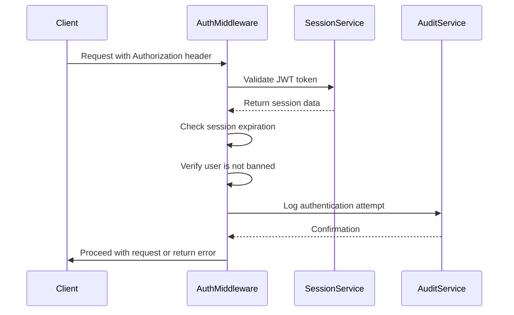
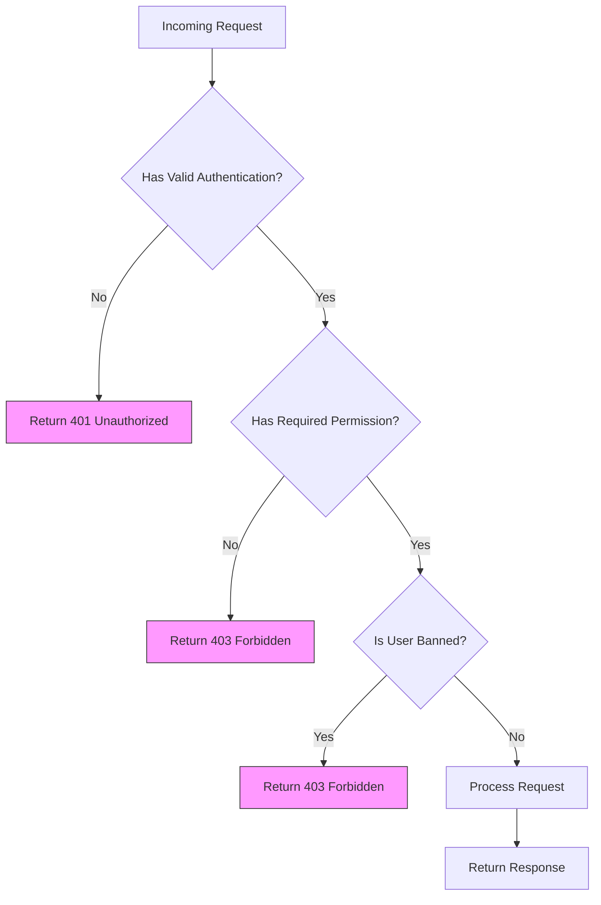
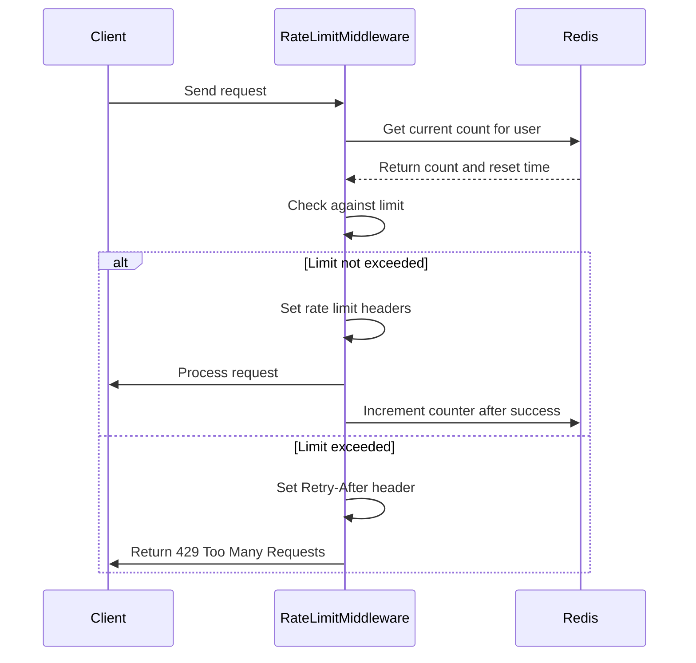
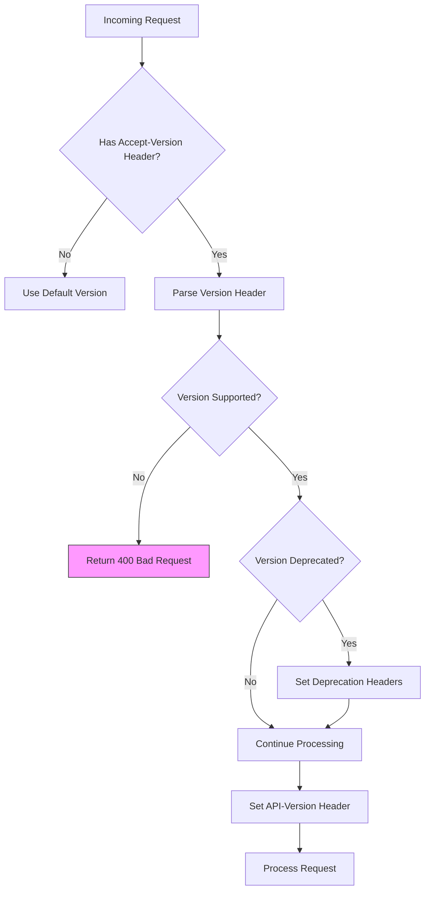
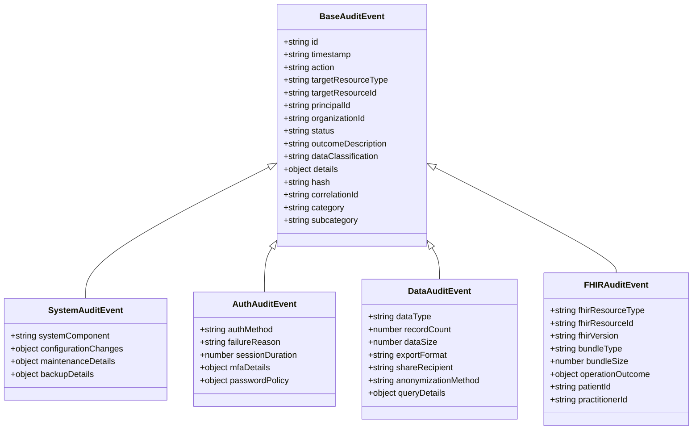
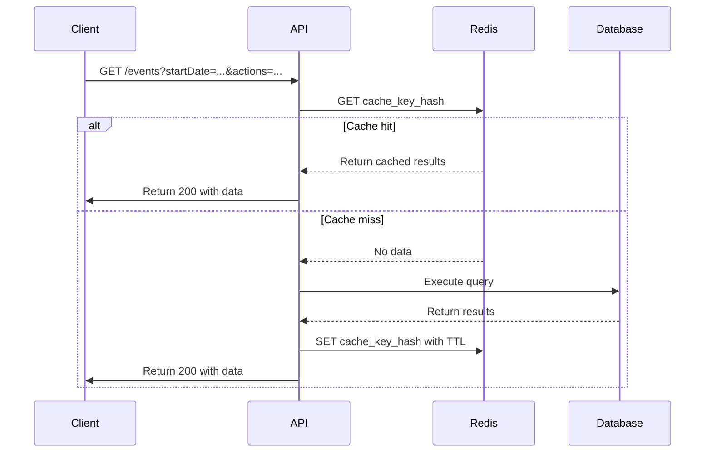

# Audit API

<cite>
**Referenced Files in This Document**   
- [audit-api.ts](file://apps/server/src/routes/audit-api.ts)
- [auth.ts](file://apps/server/src/lib/middleware/auth.ts)
- [rate-limit.ts](file://apps/server/src/lib/middleware/rate-limit.ts)
- [api-version.ts](file://apps/server/src/lib/middleware/api-version.ts)
- [event-types.ts](file://packages/audit/src/event/event-types.ts)
</cite>

## Table of Contents
1. [Introduction](#introduction)
2. [Authentication and Authorization](#authentication-and-authorization)
3. [Rate Limiting](#rate-limiting)
4. [API Versioning](#api-versioning)
5. [Endpoint Reference](#endpoint-reference)
6. [Data Validation and Schemas](#data-validation-and-schemas)
7. [Error Handling](#error-handling)
8. [Request and Response Examples](#request-and-response-examples)
9. [Caching and Performance](#caching-and-performance)
10. [GDPR Compliance](#gdpr-compliance)

## Introduction
The Audit API provides a comprehensive RESTful interface for creating, retrieving, and managing audit events within the system. The API supports robust security features including JWT-based authentication, role-based access control, rate limiting, and API versioning. It enables organizations to maintain a secure and compliant audit trail of all critical system activities.

The API is designed around REST principles with predictable resource-oriented URLs, proper HTTP verbs, and status codes. All requests and responses are JSON-based, and the API supports filtering, pagination, and sorting for efficient data retrieval. The system ensures data integrity through cryptographic hashing and provides specialized endpoints for GDPR compliance operations.

**Section sources**
- [audit-api.ts](file://apps/server/src/routes/audit-api.ts#L1-L50)

## Authentication and Authorization
The Audit API implements a comprehensive authentication and authorization system using JWT tokens and role-based access control. All endpoints require valid authentication unless explicitly documented otherwise.

### Authentication Methods
The API supports two authentication methods:
- **Session-based authentication** using JWT tokens in the Authorization header
- **API key authentication** using the x-api-key header or Authorization header with Bearer prefix



**Diagram sources**
- [auth.ts](file://apps/server/src/lib/middleware/auth.ts#L1-L200)

### Role-Based Access Control
The API implements fine-grained permission controls based on user roles and organizational context. The following roles are supported:
- **admin**: Full access to all audit events across organizations
- **auditor**: Read-only access to audit events with ability to verify integrity
- **user**: Limited access to create audit events and view their own events

The authorization system checks permissions using the `requirePermission` middleware, which validates that the authenticated user has the necessary permissions for the requested resource and action.



**Diagram sources**
- [auth.ts](file://apps/server/src/lib/middleware/auth.ts#L200-L400)

**Section sources**
- [auth.ts](file://apps/server/src/lib/middleware/auth.ts#L1-L400)

## Rate Limiting
The Audit API implements rate limiting to prevent abuse and ensure service availability. The rate limiting system uses Redis for distributed storage, enabling consistent limits across multiple server instances.

### Rate Limiting Strategies
The API employs different rate limiting strategies based on endpoint type:

| Endpoint Type | Window | Max Requests | Key Generator | Purpose |
|---------------|--------|--------------|---------------|---------|
| Authentication | 15 minutes | 5 | IP address | Prevent brute force attacks |
| Read Operations | 1 minute | 1000 | User ID | Limit data scraping |
| Write Operations | 1 minute | 100 | User ID | Control event creation rate |
| Public Endpoints | 1 minute | 60 | IP address | Protect public API access |

### Rate Limit Headers
The API returns standard rate limiting headers to inform clients of their usage limits:

- **RateLimit-Limit**: Total number of requests allowed in the window
- **RateLimit-Remaining**: Number of requests remaining in the current window
- **RateLimit-Reset**: Time when the rate limit resets (Unix timestamp)
- **X-RateLimit-Limit**: Legacy header for backward compatibility
- **X-RateLimit-Remaining**: Legacy header for backward compatibility
- **X-RateLimit-Reset**: Legacy header for backward compatibility
- **Retry-After**: When a client can retry after being rate limited



**Diagram sources**
- [rate-limit.ts](file://apps/server/src/lib/middleware/rate-limit.ts#L1-L200)

**Section sources**
- [rate-limit.ts](file://apps/server/src/lib/middleware/rate-limit.ts#L1-L487)

## API Versioning
The Audit API supports versioning through the Accept-Version header, allowing clients to specify which version of the API they want to use. This enables backward compatibility and smooth transitions between API versions.

### Versioning Strategy
The API follows semantic versioning (MAJOR.MINOR.PATCH) and supports the following versions:
- **1.0.0**: Current stable version with full feature set
- Future versions will be added as needed

Clients can specify the desired version using the Accept-Version header:
```
Accept-Version: 1.0.0
```

If no version is specified, the API defaults to version 1.0.0.

### Version Headers
The API returns the following version-related headers in responses:
- **API-Version**: The actual version used to process the request
- **Deprecation**: Indicates if the requested version is deprecated
- **Sunset**: Date when a deprecated version will be discontinued
- **Link**: Relationship to successor versions



**Diagram sources**
- [api-version.ts](file://apps/server/src/lib/middleware/api-version.ts#L1-L200)

**Section sources**
- [api-version.ts](file://apps/server/src/lib/middleware/api-version.ts#L1-L351)

## Endpoint Reference
This section documents all available endpoints in the Audit API, including their methods, parameters, and response schemas.

### Create Audit Event
Creates a new audit event with the provided data.

**Endpoint**: `POST /events`  
**Authentication**: Required  
**Permissions**: `audit.events:create`  
**Rate Limit**: Moderate (100 requests/minute per user)

#### Request Parameters
**Body (application/json)**:
```json
{
  "action": "string",
  "targetResourceType": "string",
  "targetResourceId": "string",
  "principalId": "string",
  "organizationId": "string",
  "status": "attempt|success|failure",
  "outcomeDescription": "string",
  "dataClassification": "PUBLIC|INTERNAL|CONFIDENTIAL|PHI",
  "sessionContext": "object",
  "details": "object"
}
```

#### Response
**201 Created**: Returns the created audit event
```json
{
  "id": "string",
  "timestamp": "string",
  "action": "string",
  "targetResourceType": "string",
  "targetResourceId": "string",
  "principalId": "string",
  "organizationId": "string",
  "status": "attempt|success|failure",
  "outcomeDescription": "string",
  "dataClassification": "PUBLIC|INTERNAL|CONFIDENTIAL|PHI",
  "details": "object",
  "hash": "string",
  "correlationId": "string"
}
```

**Section sources**
- [audit-api.ts](file://apps/server/src/routes/audit-api.ts#L50-L100)

### Query Audit Events
Retrieves audit events with optional filtering, pagination, and sorting.

**Endpoint**: `GET /events`  
**Authentication**: Required  
**Permissions**: `audit.events:read`  
**Rate Limit**: Lenient (1000 requests/minute per user)

#### Request Parameters
**Query Parameters**:
- **startDate**: Filter events from this date (ISO 8601 format)
- **endDate**: Filter events to this date (ISO 8601 format)
- **principalIds**: Comma-separated list of principal IDs to filter by
- **organizationIds**: Comma-separated list of organization IDs to filter by
- **actions**: Comma-separated list of actions to filter by
- **statuses**: Comma-separated list of statuses to filter by (attempt, success, failure)
- **dataClassifications**: Comma-separated list of data classifications to filter by
- **resourceTypes**: Comma-separated list of resource types to filter by
- **verifiedOnly**: If "true", only return events with cryptographic verification
- **limit**: Number of events to return (default: 50, max: 100)
- **offset**: Number of events to skip for pagination
- **sortField**: Field to sort by (timestamp, status, action)
- **sortDirection**: Sort direction (asc, desc)

#### Response
**200 OK**: Returns paginated audit events
```json
{
  "events": [
    {
      "id": "string",
      "timestamp": "string",
      "action": "string",
      "targetResourceType": "string",
      "targetResourceId": "string",
      "principalId": "string",
      "organizationId": "string",
      "status": "attempt|success|failure",
      "outcomeDescription": "string",
      "dataClassification": "PUBLIC|INTERNAL|CONFIDENTIAL|PHI",
      "details": "object",
      "hash": "string",
      "correlationId": "string"
    }
  ],
  "pagination": {
    "total": "number",
    "limit": "number",
    "offset": "number",
    "hasNext": "boolean",
    "hasPrevious": "boolean"
  }
}
```

**Section sources**
- [audit-api.ts](file://apps/server/src/routes/audit-api.ts#L100-L150)

### Get Audit Event by ID
Retrieves a specific audit event by its ID.

**Endpoint**: `GET /events/{id}`  
**Authentication**: Required  
**Permissions**: `audit.events:read`  
**Rate Limit**: Lenient (1000 requests/minute per user)

#### Request Parameters
**Path Parameters**:
- **id**: The ID of the audit event to retrieve

#### Response
**200 OK**: Returns the requested audit event
```json
{
  "id": "string",
  "timestamp": "string",
  "action": "string",
  "targetResourceType": "string",
  "targetResourceId": "string",
  "principalId": "string",
  "organizationId": "string",
  "status": "attempt|success|failure",
  "outcomeDescription": "string",
  "dataClassification": "PUBLIC|INTERNAL|CONFIDENTIAL|PHI",
  "details": "object",
  "hash": "string",
  "correlationId": "string"
}
```

**Section sources**
- [audit-api.ts](file://apps/server/src/routes/audit-api.ts#L150-L200)

### Verify Audit Event Integrity
Verifies the cryptographic integrity of an audit event.

**Endpoint**: `POST /events/{id}/verify`  
**Authentication**: Required  
**Permissions**: `audit.events:read`  
**Rate Limit**: Moderate (100 requests/minute per user)

#### Request Parameters
**Path Parameters**:
- **id**: The ID of the audit event to verify

#### Response
**200 OK**: Returns verification result
```json
{
  "eventId": "string",
  "verified": "boolean",
  "timestamp": "string",
  "details": {
    "originalHash": "string",
    "computedHash": "string",
    "algorithm": "string"
  }
}
```

**Section sources**
- [audit-api.ts](file://apps/server/src/routes/audit-api.ts#L200-L250)

### Bulk Create Audit Events
Creates multiple audit events in a single request for batch processing.

**Endpoint**: `POST /events/bulk`  
**Authentication**: Required  
**Permissions**: `audit.events:create`  
**Rate Limit**: Moderate (100 requests/minute per user)

#### Request Parameters
**Body (application/json)**:
```json
{
  "events": [
    {
      "action": "string",
      "targetResourceType": "string",
      "targetResourceId": "string",
      "principalId": "string",
      "organizationId": "string",
      "status": "attempt|success|failure",
      "outcomeDescription": "string",
      "dataClassification": "PUBLIC|INTERNAL|CONFIDENTIAL|PHI",
      "sessionContext": "object",
      "details": "object"
    }
  ],
  "validateIntegrity": "boolean"
}
```

#### Response
**201 Created**: Returns processing results
```json
{
  "successful": [
    {
      "success": "boolean",
      "eventData": "object"
    }
  ],
  "failed": [
    {
      "error": "string",
      "eventData": "object"
    }
  ],
  "summary": {
    "total": "number",
    "successful": "number",
    "failed": "number"
  }
}
```

**Section sources**
- [audit-api.ts](file://apps/server/src/routes/audit-api.ts#L800-L850)

### GDPR Data Export
Exports all audit data for a specific user in the requested format for GDPR compliance.

**Endpoint**: `POST /gdpr/export`  
**Authentication**: Required  
**Permissions**: `audit.events:export`  
**Rate Limit**: Strict (5 requests/15 minutes per user)

#### Request Parameters
**Body (application/json)**:
```json
{
  "principalId": "string",
  "format": "json|csv|xml",
  "dateRange": {
    "startDate": "string",
    "endDate": "string"
  },
  "includeMetadata": "boolean"
}
```

#### Response
**200 OK**: Returns export result
```json
{
  "requestId": "string",
  "recordCount": "number",
  "dataSize": "number",
  "format": "string",
  "exportTimestamp": "string",
  "data": "string",
  "metadata": {
    "dateRange": {
      "start": "string",
      "end": "string"
    },
    "categories": ["string"],
    "retentionPolicies": ["string"],
    "exportedBy": "string"
  }
}
```

**Section sources**
- [audit-api.ts](file://apps/server/src/routes/audit-api.ts#L600-L650)

### GDPR Pseudonymize
Pseudonymizes all audit data for a specific user while maintaining referential integrity.

**Endpoint**: `POST /gdpr/pseudonymize`  
**Authentication**: Required  
**Permissions**: `audit.events:pseudonymize`  
**Rate Limit**: Strict (5 requests/15 minutes per user)

#### Request Parameters
**Body (application/json)**:
```json
{
  "principalId": "string",
  "resourceType": "string",
  "strategy": "hash|token|encryption"
}
```

#### Response
**200 OK**: Returns pseudonymization result
```json
{
  "pseudonymId": "string",
  "recordsAffected": "number"
}
```

**Section sources**
- [audit-api.ts](file://apps/server/src/routes/audit-api.ts#L700-L750)

## Data Validation and Schemas
The Audit API uses Zod for comprehensive data validation, ensuring that all incoming and outgoing data conforms to defined schemas.

### Field Constraints
The following table outlines the constraints for key fields in audit events:

| Field | Type | Required | Constraints | Description |
|-------|------|----------|-------------|-------------|
| action | string | Yes | 1-100 characters | The action performed |
| targetResourceType | string | Yes | 1-50 characters | Type of resource targeted |
| principalId | string | Yes | Valid UUID | ID of the user performing the action |
| organizationId | string | Yes | Valid UUID | ID of the organization |
| status | enum | Yes | attempt, success, failure | Outcome status of the action |
| outcomeDescription | string | No | Max 500 characters | Additional details about the outcome |
| dataClassification | enum | Yes | PUBLIC, INTERNAL, CONFIDENTIAL, PHI | Sensitivity level of the data |
| details | object | No | Max 100 properties | Additional structured data about the event |

### Event Categorization
The system supports specialized event types for different categories of audit events:



**Diagram sources**
- [event-types.ts](file://packages/audit/src/event/event-types.ts#L1-L100)

**Section sources**
- [event-types.ts](file://packages/audit/src/event/event-types.ts#L1-L309)

## Error Handling
The Audit API uses a consistent error response format across all endpoints to provide clear feedback to clients.

### Error Response Format
All error responses follow the same structure:
```json
{
  "code": "string",
  "message": "string",
  "details": "object"
}
```

### Status Codes
The API uses standard HTTP status codes to indicate the result of requests:

| Status Code | Meaning | Description |
|-------------|---------|-------------|
| 200 | OK | Request successful |
| 201 | Created | Resource created successfully |
| 400 | Bad Request | Invalid request parameters or body |
| 401 | Unauthorized | Authentication required or failed |
| 403 | Forbidden | Insufficient permissions |
| 404 | Not Found | Resource not found |
| 429 | Too Many Requests | Rate limit exceeded |
| 500 | Internal Server Error | Unexpected server error |

### Error Codes
The API returns specific error codes in the response body:

| Error Code | Meaning | Description |
|------------|---------|-------------|
| BAD_REQUEST | 400 | The request was invalid or malformed |
| UNAUTHORIZED | 401 | Authentication is required or has failed |
| FORBIDDEN | 403 | The request is understood but refused |
| NOT_FOUND | 404 | The requested resource could not be found |
| RATE_LIMITED | 429 | The client has sent too many requests |
| INTERNAL_SERVER_ERROR | 500 | An unexpected error occurred on the server |

**Section sources**
- [audit-api.ts](file://apps/server/src/routes/audit-api.ts#L1-L50)
- [auth.ts](file://apps/server/src/lib/middleware/auth.ts#L1-L400)

## Request and Response Examples
This section provides practical examples of API usage with curl commands.

### Creating an Audit Event
```bash
curl -X POST https://api.example.com/v1/events \
  -H "Authorization: Bearer <your-jwt-token>" \
  -H "Content-Type: application/json" \
  -H "Accept-Version: 1.0.0" \
  -d '{
    "action": "user.login",
    "targetResourceType": "user",
    "principalId": "usr-123",
    "organizationId": "org-456",
    "status": "success",
    "dataClassification": "INTERNAL",
    "details": {
      "ipAddress": "192.168.1.1",
      "userAgent": "Mozilla/5.0"
    }
  }'
```

### Querying Audit Events
```bash
curl -X GET "https://api.example.com/v1/events?startDate=2023-01-01T00:00:00Z&endDate=2023-01-31T23:59:59Z&actions=user.login,user.logout&limit=10" \
  -H "Authorization: Bearer <your-jwt-token>" \
  -H "Accept-Version: 1.0.0"
```

### Verifying Event Integrity
```bash
curl -X POST https://api.example.com/v1/events/evt-789/verify \
  -H "Authorization: Bearer <your-jwt-token>" \
  -H "Accept-Version: 1.0.0"
```

### Bulk Creating Events
```bash
curl -X POST https://api.example.com/v1/events/bulk \
  -H "Authorization: Bearer <your-jwt-token>" \
  -H "Content-Type: application/json" \
  -H "Accept-Version: 1.0.0" \
  -d '{
    "events": [
      {
        "action": "document.view",
        "targetResourceType": "document",
        "targetResourceId": "doc-001",
        "principalId": "usr-123",
        "organizationId": "org-456",
        "status": "success",
        "dataClassification": "CONFIDENTIAL"
      },
      {
        "action": "document.download",
        "targetResourceType": "document",
        "targetResourceId": "doc-002",
        "principalId": "usr-123",
        "organizationId": "org-456",
        "status": "success",
        "dataClassification": "CONFIDENTIAL"
      }
    ]
  }'
```

**Section sources**
- [audit-api.ts](file://apps/server/src/routes/audit-api.ts#L50-L250)

## Caching and Performance
The Audit API implements caching strategies to improve performance and reduce database load.

### ETag-Based Caching
The API supports ETag-based caching for GET requests. When a client makes a request, the server includes an ETag header in the response:

```
ETag: "abc123xyz"
```

Subsequent requests can include the If-None-Match header with the ETag value:

```
If-None-Match: "abc123xyz"
```

If the resource has not changed, the server returns a 304 Not Modified response with no body, saving bandwidth.

### Query Caching
The API automatically caches the results of common queries using Redis. The cache key is generated based on the query parameters and organization ID, ensuring that each organization's data is isolated.

Cache invalidation occurs when:
- New audit events are created
- Existing events are modified (rare)
- Cache TTL expires (typically 5 minutes for query results)



**Diagram sources**
- [audit-api.ts](file://apps/server/src/routes/audit-api.ts#L300-L400)

**Section sources**
- [audit-api.ts](file://apps/server/src/routes/audit-api.ts#L250-L400)

## GDPR Compliance
The Audit API provides specialized endpoints to support GDPR compliance requirements, including data export and pseudonymization.

### Right to Access
The GDPR data export endpoint allows organizations to fulfill data subject access requests (DSARs) by exporting all audit data for a specific user.

### Right to Be Forgotten
While the system maintains immutable audit logs for compliance purposes, the pseudonymization endpoint allows organizations to exercise the right to be forgotten by replacing personally identifiable information with pseudonyms while maintaining the integrity of the audit trail.

### Data Minimization
The API enforces data minimization principles by:
- Requiring explicit data classification for all events
- Implementing retention policies based on data sensitivity
- Providing tools to identify and manage personal data

### Processing Legal Basis
All audit events include metadata that supports compliance with GDPR processing legal basis requirements:
- **Lawful basis**: Events are created as part of legitimate business interests
- **Purpose limitation**: Events are only used for security, compliance, and operational purposes
- **Storage limitation**: Events are retained according to defined retention policies

**Section sources**
- [audit-api.ts](file://apps/server/src/routes/audit-api.ts#L600-L750)