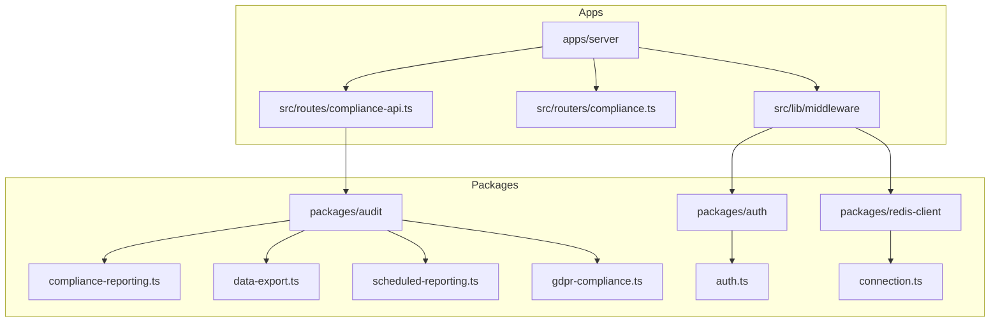
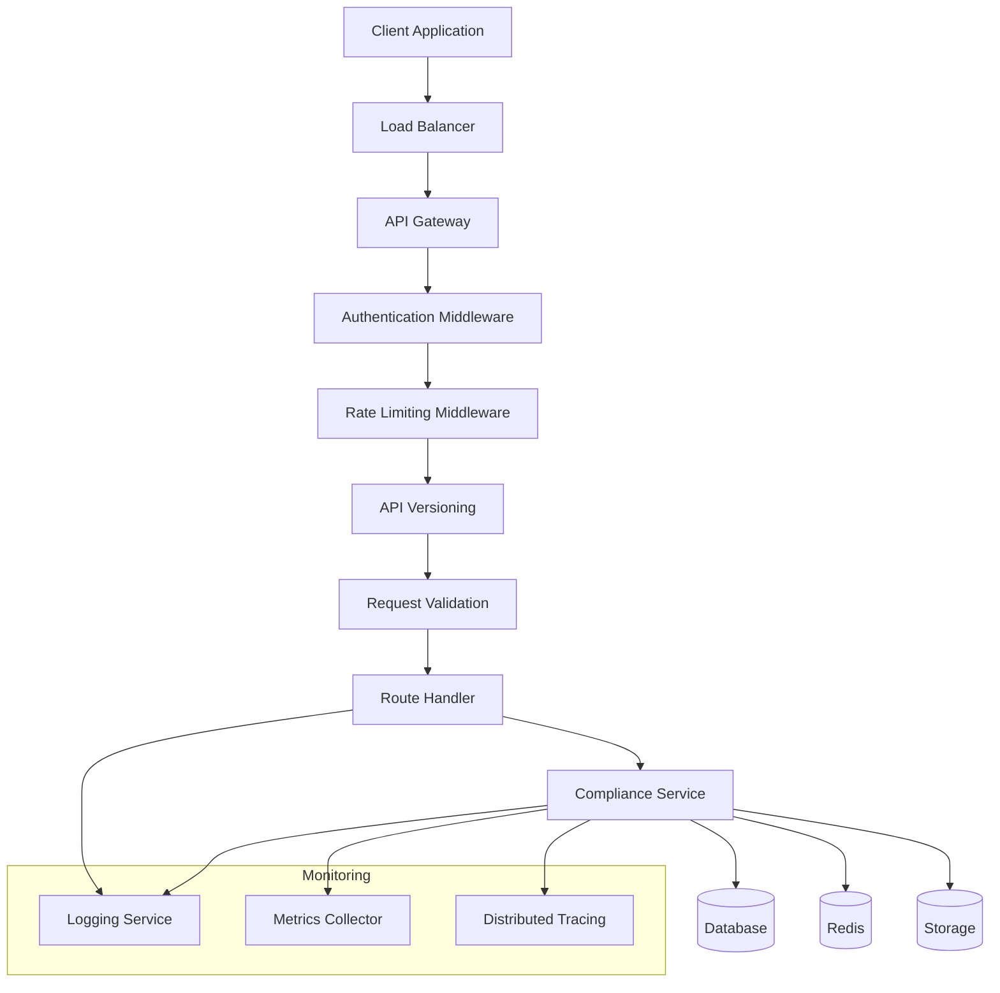
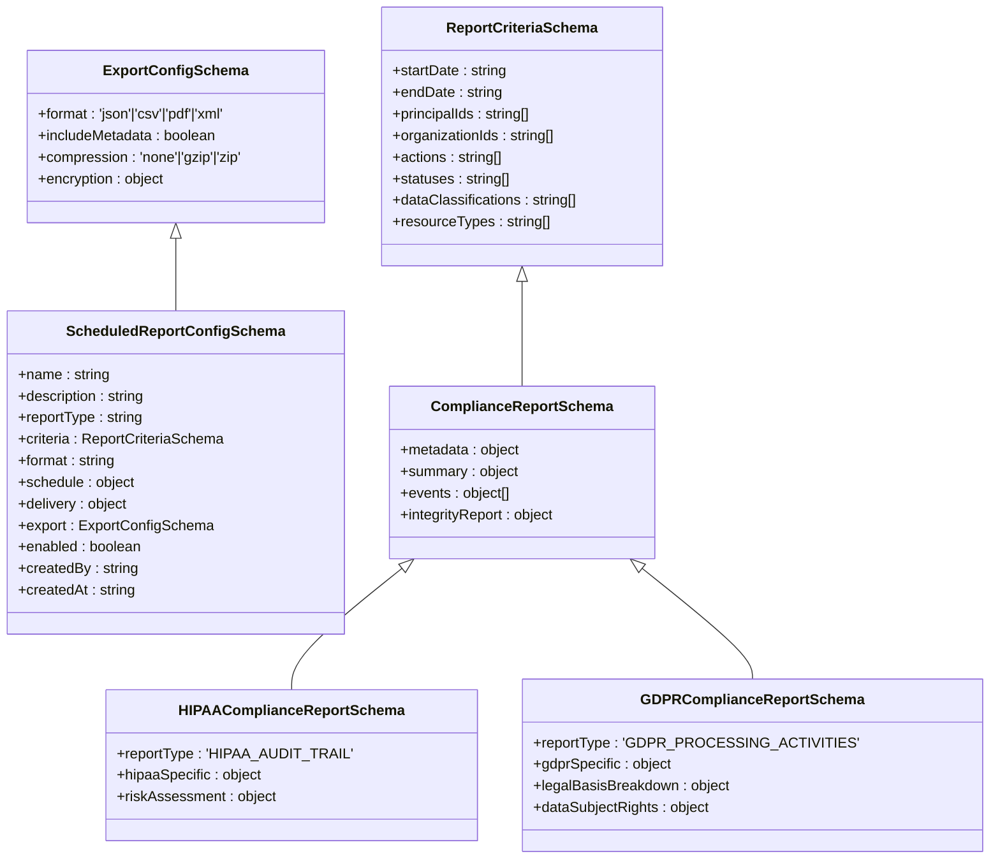
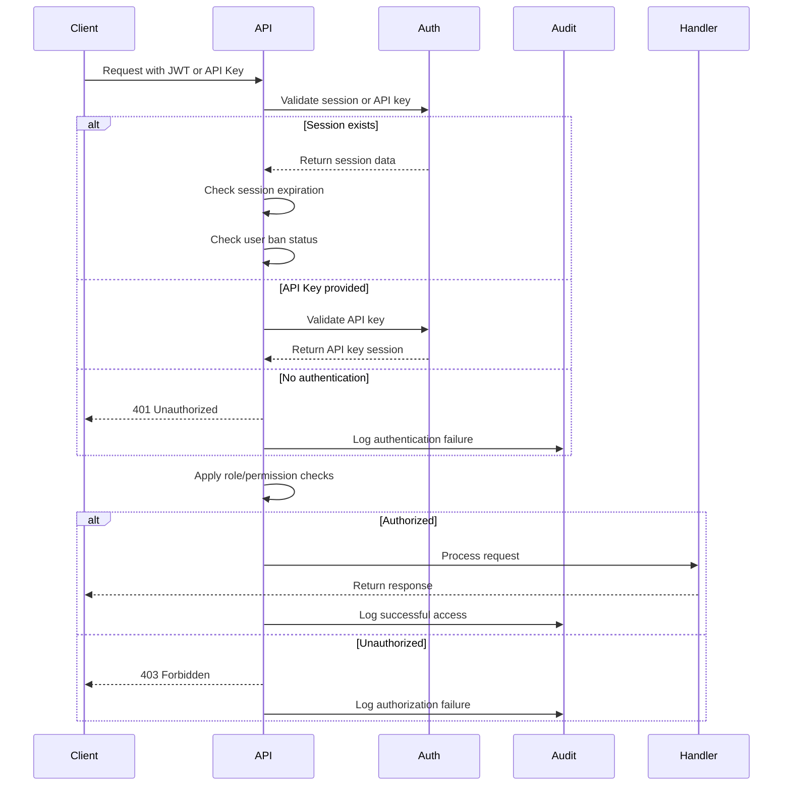
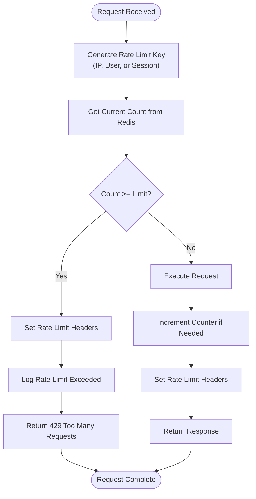
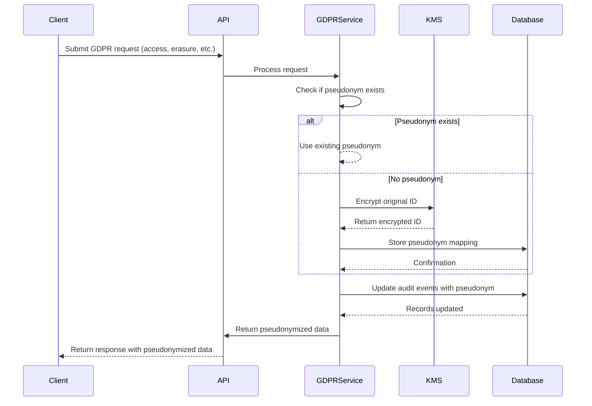
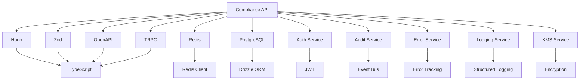

# Compliance API

<cite>
**Referenced Files in This Document**   
- [compliance-api.ts](file://apps\server\src\routes\compliance-api.ts) - *Updated in recent commit*
- [gdpr-compliance.ts](file://packages\audit\src\gdpr\gdpr-compliance.ts) - *Updated in recent commit*
- [index.ts](file://apps\worker\src\index.ts) - *Updated in recent commit*
</cite>

## Update Summary
**Changes Made**   
- Updated documentation to reflect the implementation of pseudonymization in GDPR compliance workflows
- Added details about pseudonymization logic and its integration into audit event processing
- Enhanced description of GDPR data subject rights implementation
- Updated architecture overview to include pseudonymization phase in event processing pipeline
- Added new sequence diagram showing pseudonymization workflow
- Updated dependency analysis to include KMS integration for pseudonym mapping encryption

## Table of Contents
1. [Introduction](#introduction)
2. [Project Structure](#project-structure)
3. [Core Components](#core-components)
4. [Architecture Overview](#architecture-overview)
5. [Detailed Component Analysis](#detailed-component-analysis)
6. [Dependency Analysis](#dependency-analysis)
7. [Performance Considerations](#performance-considerations)
8. [Troubleshooting Guide](#troubleshooting-guide)
9. [Conclusion](#conclusion)

## Introduction

The Compliance API is a RESTful service designed to support regulatory compliance with GDPR and HIPAA standards. It enables organizations to generate compliance reports, export personal data, manage data subject requests, and verify audit trail integrity. The API is built using Hono and OpenAPI for type-safe route definitions, and integrates with backend services for report generation, data export, and scheduled reporting.

Key features include:
- Generation of HIPAA and GDPR compliance reports
- Export of audit data in multiple formats (JSON, CSV, PDF, XML)
- Management of scheduled compliance reports
- Integrity verification of audit events
- Support for data classification and filtering
- Implementation of GDPR-compliant pseudonymization for data subject rights
- Integration with authentication and rate limiting systems

The API follows a modular design with clear separation of concerns, using middleware for authentication, rate limiting, and error handling. It is designed to be secure, scalable, and compliant with industry standards.

## Project Structure

The Compliance API is part of a larger monorepo with a well-defined structure. The core API routes are located in the `apps/server/src/routes` directory, while shared utilities and services are organized in the `packages` directory.

**Diagram sources**
- [compliance-api.ts](file://apps\server\src\routes\compliance-api.ts)
- [compliance.ts](file://apps\server\src\routers\compliance.ts)
- [gdpr-compliance.ts](file://packages\audit\src\gdpr\gdpr-compliance.ts)

**Section sources**
- [compliance-api.ts](file://apps\server\src\routes\compliance-api.ts)

## Core Components

The Compliance API consists of several key components that work together to provide compliance functionality:

- **compliance-api.ts**: Main route definitions using Hono and OpenAPI
- **compliance.ts**: TRPC router for compliance operations
- **auth.ts**: Authentication middleware with JWT and API key support
- **rate-limit.ts**: Rate limiting middleware with Redis integration
- **api-version.ts**: API versioning middleware
- **gdpr-compliance.ts**: GDPR compliance service with pseudonymization capabilities

These components are orchestrated through a middleware pipeline that handles authentication, rate limiting, request validation, and error handling before routing to the appropriate handler.

The API uses Zod for request and response validation, ensuring type safety and data integrity. It also integrates with a logging and audit system to track all API interactions for security and compliance purposes.

**Section sources**
- [compliance-api.ts](file://apps\server\src\routes\compliance-api.ts)
- [auth.ts](file://apps\server\src\lib\middleware\auth.ts)
- [rate-limit.ts](file://apps\server\src\lib\middleware\rate-limit.ts)
- [gdpr-compliance.ts](file://packages\audit\src\gdpr\gdpr-compliance.ts)

## Architecture Overview

The Compliance API follows a layered architecture with clear separation between routing, business logic, and data access layers. It uses a middleware-based approach to handle cross-cutting concerns like authentication, rate limiting, and error handling.

**Diagram sources**
- [compliance-api.ts](file://apps\server\src\routes\compliance-api.ts)
- [auth.ts](file://apps\server\src\lib\middleware\auth.ts)
- [rate-limit.ts](file://apps\server\src\lib\middleware\rate-limit.ts)
- [api-version.ts](file://apps\server\src\lib\middleware\api-version.ts)

## Detailed Component Analysis

### Compliance API Routes

The compliance API routes are defined using Hono's OpenAPI integration, providing type-safe endpoint definitions with automatic documentation generation.

#### Route Definitions

**Diagram sources**
- [compliance-api.ts](file://apps\server\src\routes\compliance-api.ts)

**Section sources**
- [compliance-api.ts](file://apps\server\src\routes\compliance-api.ts)

### Authentication and Authorization

The API uses JWT-based authentication with role-based access control. It supports both session-based and API key authentication.

#### Authentication Flow

**Diagram sources**
- [auth.ts](file://apps\server\src\lib\middleware\auth.ts)

**Section sources**
- [auth.ts](file://apps\server\src\lib\middleware\auth.ts)

### Rate Limiting Implementation

The API implements rate limiting using Redis for distributed storage, supporting different strategies based on IP, user, or session.

#### Rate Limiting Logic

**Diagram sources**
- [rate-limit.ts](file://apps\server\src\lib\middleware\rate-limit.ts)

**Section sources**
- [rate-limit.ts](file://apps\server\src\lib\middleware\rate-limit.ts)

### GDPR Pseudonymization Implementation

The updated GDPR compliance service now includes pseudonymization capabilities to support data subject rights while maintaining audit trail integrity.

#### Pseudonymization Workflow

**Diagram sources**
- [gdpr-compliance.ts](file://packages\audit\src\gdpr\gdpr-compliance.ts)
- [index.ts](file://apps\worker\src\index.ts)

**Section sources**
- [gdpr-compliance.ts](file://packages\audit\src\gdpr\gdpr-compliance.ts)

## Dependency Analysis

The Compliance API has several key dependencies that enable its functionality:

**Diagram sources**
- [compliance-api.ts](file://apps\server\src\routes\compliance-api.ts)
- [auth.ts](file://apps\server\src\lib\middleware\auth.ts)
- [rate-limit.ts](file://apps\server\src\lib\middleware\rate-limit.ts)
- [gdpr-compliance.ts](file://packages\audit\src\gdpr\gdpr-compliance.ts)

**Section sources**
- [compliance-api.ts](file://apps\server\src\routes\compliance-api.ts)
- [auth.ts](file://apps\server\src\lib\middleware\auth.ts)
- [rate-limit.ts](file://apps\server\src\lib\middleware\rate-limit.ts)
- [gdpr-compliance.ts](file://packages\audit\src\gdpr\gdpr-compliance.ts)

## Performance Considerations

The Compliance API is designed with performance in mind, using several optimization techniques:

- **Caching**: Uses Redis to cache frequently accessed data and rate limiting information
- **Database Optimization**: Leverages PostgreSQL partitioning and indexing for audit data
- **Asynchronous Processing**: Long-running reports are processed asynchronously
- **Connection Pooling**: Uses connection pooling for database and Redis connections
- **Request Batching**: Supports batch operations where applicable
- **Compression**: Supports response compression for large data exports
- **Pseudonymization Caching**: Caches pseudonym mappings to avoid repeated KMS calls

The API also implements adaptive rate limiting that applies different limits based on endpoint type:
- Authentication endpoints: 5 requests per 15 minutes per IP
- Write operations: 100 requests per minute per user
- Read operations: 1000 requests per minute per user
- Public endpoints: 60 requests per minute per IP

These limits help prevent abuse while maintaining good performance for legitimate users.

## Troubleshooting Guide

Common issues and their solutions:

### Authentication Failures
- **401 Unauthorized**: Ensure valid JWT or API key is provided in Authorization header
- **403 Forbidden**: Check user roles and permissions; ensure user is not banned
- **Session Expired**: Refresh the session or re-authenticate

### Rate Limiting Issues
- **429 Too Many Requests**: Wait for the reset time indicated in Retry-After header
- **Unexpected Rate Limiting**: Verify rate limit key strategy (IP, user, session)
- **Redis Connection Issues**: Check Redis connectivity and configuration

### Report Generation Problems
- **Slow Reports**: Use date ranges to limit scope; consider scheduled reports
- **Missing Data**: Verify organization ID and permissions; check date ranges
- **Validation Errors**: Ensure request body conforms to schema; check required fields

### Data Export Issues
- **Large Exports**: Use asynchronous processing; consider compression
- **Format Errors**: Verify supported formats (JSON, CSV, PDF, XML)
- **Delivery Failures**: Check webhook URLs or storage locations

### GDPR Pseudonymization Issues
- **Pseudonymization Failures**: Check KMS connectivity and encryption keys
- **Missing Pseudonym Mappings**: Verify pseudonym mapping table is accessible
- **Performance Degradation**: Monitor KMS call frequency and implement caching

Logs and audit trails are available for troubleshooting, with detailed information about each request and response.

**Section sources**
- [compliance-api.ts](file://apps\server\src\routes\compliance-api.ts)
- [auth.ts](file://apps\server\src\lib\middleware\auth.ts)
- [rate-limit.ts](file://apps\server\src\lib\middleware\rate-limit.ts)
- [gdpr-compliance.ts](file://packages\audit\src\gdpr\gdpr-compliance.ts)

## Conclusion

The Compliance API provides a comprehensive solution for GDPR and HIPAA compliance, offering robust features for report generation, data export, and audit trail verification. Its modular design, strong type safety, and comprehensive middleware support make it reliable and maintainable.

Key strengths include:
- Clear separation of concerns with well-defined components
- Strong security with JWT authentication and role-based access control
- Scalable architecture with Redis-based rate limiting
- Comprehensive error handling and logging
- Type-safe API definitions with OpenAPI and Zod
- GDPR-compliant pseudonymization to support data subject rights while preserving audit integrity

The API is production-ready and follows best practices for RESTful design, security, and performance. It can be extended to support additional compliance standards or integrated with other systems as needed.