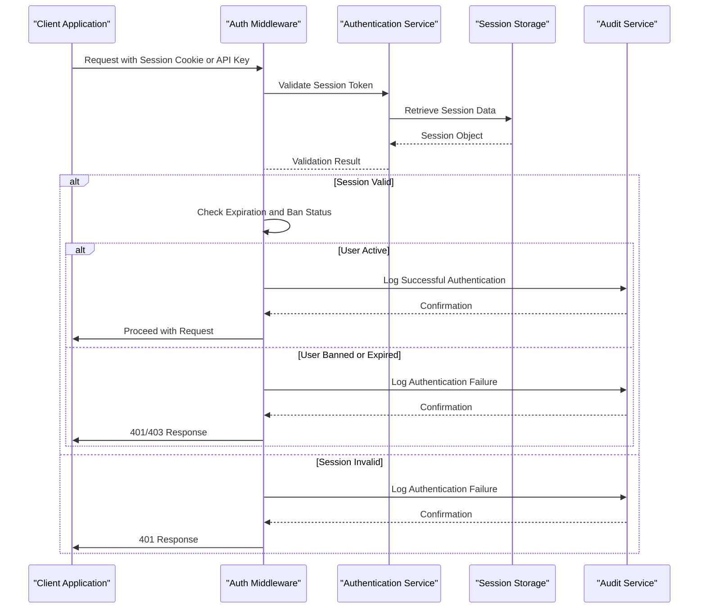
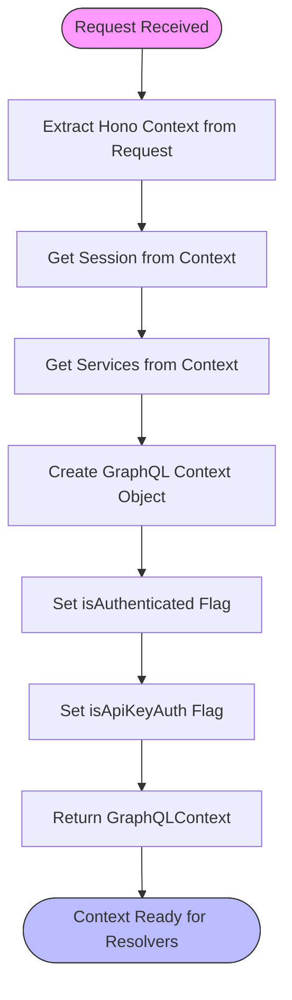
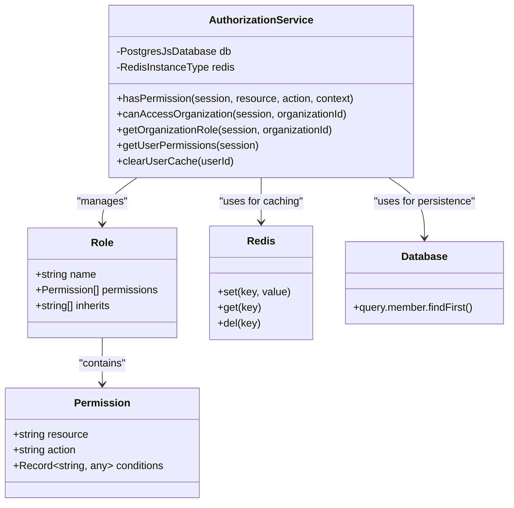
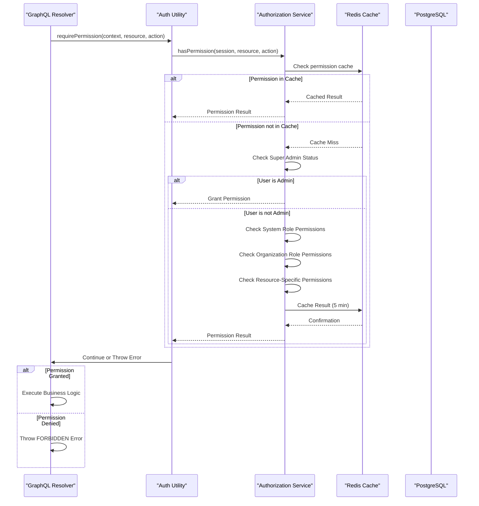
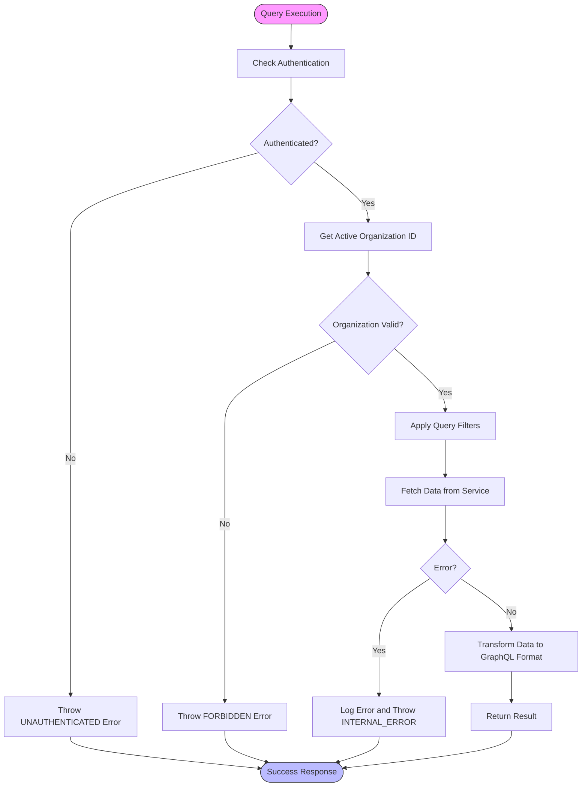
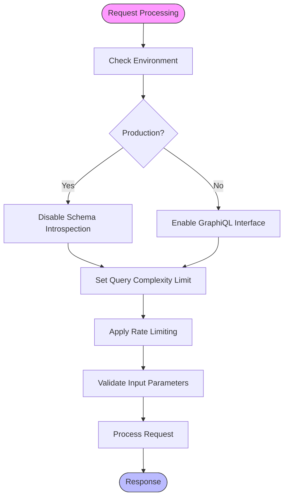

# Authentication & Authorization

<cite>
**Referenced Files in This Document**   
- [auth.ts](file://apps/server/src/lib/graphql/auth.ts)
- [server.ts](file://apps/server/src/lib/graphql/server.ts)
- [auth.ts](file://apps/server/src/lib/middleware/auth.ts)
- [permissions.ts](file://packages/auth/src/permissions.ts)
- [types.ts](file://apps/server/src/lib/graphql/types.ts)
- [alerts.ts](file://apps/server/src/lib/graphql/resolvers/alerts.ts)
- [auth.test.ts](file://apps/server/src/lib/middleware/__tests__/auth.test.ts)
- [authorization.test.ts](file://apps/server/src/lib/services/__tests__/authorization.test.ts)
- [api-version.ts](file://apps/server/src/lib/middleware/api-version.ts)
</cite>

## Table of Contents
1. [Introduction](#introduction)
2. [Authentication Mechanism](#authentication-mechanism)
3. [Context Population Process](#context-population-process)
4. [Role-Based Access Control (RBAC)](#role-based-access-control-rbac)
5. [Permission Checking in Resolvers](#permission-checking-in-resolvers)
6. [Protected Queries and Mutations](#protected-queries-and-mutations)
7. [Token Refresh and Session Management](#token-refresh-and-session-management)
8. [Secure Header Practices](#secure-header-practices)
9. [Security Testing Coverage](#security-testing-coverage)
10. [Security Pitfalls and Mitigation Strategies](#security-pitfalls-and-mitigation-strategies)

## Introduction
This document details the authentication and authorization mechanisms implemented in the GraphQL API for the Smart Logs system. The architecture employs JWT-based authentication enforced through middleware, with comprehensive role-based access control (RBAC) at both the field and resolver levels. The system integrates authentication state into the GraphQL context, enabling granular permission checks throughout the API layer. This documentation covers the complete authentication flow, context population, RBAC implementation, and security measures designed to protect sensitive audit and compliance data.

## Authentication Mechanism

The authentication system is built around JWT tokens and session management, with middleware enforcing authentication requirements across the API surface. The primary authentication enforcement occurs through the `requireAuth` middleware in the Hono framework.

The authentication process begins with session validation in the `requireAuth` middleware, which extracts session information from cookies or API keys. The middleware validates that the session exists, has not expired, and that the user account is not banned. If any of these conditions fail, appropriate HTTP exceptions are thrown with corresponding audit logs.

**Diagram sources**
- [auth.ts](file://apps/server/src/lib/middleware/auth.ts)
- [auth.test.ts](file://apps/server/src/lib/middleware/__tests__/auth.test.ts)

**Section sources**
- [auth.ts](file://apps/server/src/lib/middleware/auth.ts#L1-L200)

## Context Population Process

The GraphQL context is populated during the request lifecycle, integrating authentication state from the Hono context into the GraphQL execution environment. This process occurs in the `createGraphQLServer` function within the server configuration.

When a GraphQL request is received, the context creation function extracts the Hono context from the request object. It then retrieves the session and services objects from the Hono context using the `get` method. These components are combined into a `GraphQLContext` object that includes authentication status, session data, request ID, and service dependencies.

The context population process ensures that all resolvers have access to the user's authentication state and session information without requiring direct access to the request object. This abstraction enables consistent authentication checks across all GraphQL operations.

**Diagram sources**
- [server.ts](file://apps/server/src/lib/graphql/server.ts#L45-L85)

**Section sources**
- [server.ts](file://apps/server/src/lib/graphql/server.ts#L1-L132)
- [types.ts](file://apps/server/src/lib/graphql/types.ts#L15-L25)

## Role-Based Access Control (RBAC)

The system implements a comprehensive role-based access control (RBAC) system with both system-level and organization-level roles. The RBAC implementation is defined in the `AuthorizationService` class within the auth package, which manages permissions for different user roles.

The RBAC system includes the following role hierarchies:

- **System Roles**: 
  - `user`: Basic access to audit events and reports
  - `admin`: Super administrator with complete system access

- **Organization Roles**:
  - `org:member`: Read and create access to audit data
  - `org:admin`: Full access to audit data with update and delete permissions
  - `org:owner`: Inherits from org:admin with additional organization management permissions

**Diagram sources**
- [permissions.ts](file://packages/auth/src/permissions.ts#L1-L100)
- [permissions.ts](file://packages/auth/src/permissions.ts#L101-L200)

**Section sources**
- [permissions.ts](file://packages/auth/src/permissions.ts#L1-L593)

## Permission Checking in Resolvers

Permissions are checked within resolvers using the authorization module from the `@smart-logs/auth` package. The system provides both imperative and declarative methods for permission enforcement, allowing developers to choose the appropriate pattern for their use case.

The primary method for permission checking is through the `requirePermission` function in the GraphQL auth utilities, which asynchronously checks whether a user has the required permission for a specific resource and action. This function leverages the `AuthorizationService` to perform the actual permission check, with results cached in Redis for performance optimization.

The permission checking system supports wildcard matching for both resources and actions, allowing for flexible permission definitions. For example, a permission with resource `audit.*` and action `*` would grant access to all audit-related resources and actions. The system also supports conditional permissions based on context parameters, enabling fine-grained access control based on resource ownership or organizational affiliation.

**Diagram sources**
- [auth.ts](file://apps/server/src/lib/graphql/auth.ts#L100-L150)
- [permissions.ts](file://packages/auth/src/permissions.ts#L200-L300)

**Section sources**
- [auth.ts](file://apps/server/src/lib/graphql/auth.ts#L1-L328)
- [permissions.ts](file://packages/auth/src/permissions.ts#L200-L400)

## Protected Queries and Mutations

The system implements protected queries and mutations through a combination of middleware decorators and explicit permission checks within resolver functions. The alerts resolver provides a clear example of how authentication and authorization are enforced at the resolver level.

For queries, the system typically checks authentication and organization access before retrieving data. The `alerts` query, for example, verifies that the user has a valid session and an active organization before fetching alert data from the monitoring service.

For mutations, the system performs additional permission checks based on the specific action being performed. The `acknowledgeAlert` mutation, for instance, would typically require the user to have the appropriate role within their organization to acknowledge alerts.

The system also provides decorator functions like `withAuth`, `withRole`, and `withPermission` that can be used to wrap resolver functions, automatically enforcing authentication and authorization requirements without requiring boilerplate code within each resolver.

**Diagram sources**
- [alerts.ts](file://apps/server/src/lib/graphql/resolvers/alerts.ts#L1-L50)
- [auth.ts](file://apps/server/src/lib/graphql/auth.ts#L250-L300)

**Section sources**
- [alerts.ts](file://apps/server/src/lib/graphql/resolvers/alerts.ts#L1-L200)
- [auth.ts](file://apps/server/src/lib/graphql/auth.ts#L250-L328)

## Token Refresh and Session Management

The system handles token refresh and session management through the authentication middleware and session service integration. While the specific token refresh implementation details are not fully visible in the provided code, the architecture supports session validation and renewal through the session object's expiration mechanism.

Session management is centralized in the Hono context, where session data is stored and accessed through the `get` and `set` methods. The session object contains an `expiresAt` timestamp that is checked during authentication to determine if the session is still valid. When a session is nearing expiration, the system can issue a new token to extend the session duration.

The authentication middleware also handles IP address and user agent validation, ensuring that sessions are only valid from the same client that originally created them. This helps prevent session hijacking and adds an additional layer of security to the authentication process.

Session data is stored in a secure manner, with sensitive information protected through encryption when necessary. The system also supports API key authentication for third-party integrations, allowing services to authenticate without using session cookies.

## Secure Header Practices

The system implements secure header practices through middleware configuration and framework defaults. The GraphQL server is configured to disable introspection in production environments by setting `graphiql: process.env.NODE_ENV !== 'production'`, which prevents unauthorized access to the schema definition.

The authentication middleware also implements proper HTTP status codes for authentication failures, returning 401 for unauthenticated requests and 403 for forbidden access. These responses are accompanied by appropriate error messages that do not leak sensitive information about the system's internal state.

Rate limiting is implemented through the `rateLimit` middleware, which tracks request counts by IP address, user, or session. The middleware sets standard rate limit headers to inform clients of their remaining request quota, helping to prevent abuse while maintaining a good developer experience.

The system also implements proper CORS policies through Hono middleware, ensuring that API requests can only originate from authorized domains. Security headers like `X-Content-Type-Options`, `X-Frame-Options`, and `X-XSS-Protection` are likely configured at the server level to protect against common web vulnerabilities.

## Security Testing Coverage

The authentication and authorization system is thoroughly tested through comprehensive unit and integration tests that verify security coverage across all components. The test suite includes specific test cases for authentication, role-based access control, and permission checking.

The `auth.test.ts` file contains tests that verify the behavior of the authentication middleware under various conditions, including:
- Successful authentication with valid sessions
- Rejection of requests with expired sessions
- Blocking access for banned users
- Proper handling of API key authentication
- Role-based access control enforcement
- Organization-level access restrictions

```mermaid
flowchart TD
TestSuite([Security Test Suite]) --> AuthTests["Authentication Tests"]
TestSuite --> RoleTests["Role-Based Access Tests"]
TestSuite --> OrgTests["Organization Access Tests"]
TestSuite --> ApiKeyTests["API Key Authentication Tests"]
TestSuite --> PermissionTests["Permission Checking Tests"]
AuthTests --> ValidSession["Valid Session Test"]
AuthTests --> ExpiredSession["Expired Session Test"]
AuthTests --> BannedUser["Banned User Test"]
RoleTests --> UserRole["User Role Test"]
RoleTests --> AdminRole["Admin Role Test"]
OrgTests --> ActiveOrg["Active Organization Test"]
OrgTests --> NoOrg["No Organization Test"]
OrgTests --> SuperAdmin["Super Admin Test"]
ApiKeyTests --> ValidKey["Valid API Key Test"]
ApiKeyTests --> MissingKey["Missing API Key Test"]
PermissionTests --> ReadAccess["Read Permission Test"]
PermissionTests --> WriteAccess["Write Permission Test"]
PermissionTests --> Ownership["Ownership Permission Test"]
style TestSuite fill:#f9f,stroke:#333
style ValidSession fill:#cfc,stroke:#333
style ExpiredSession fill:#fcc,stroke:#333
style BannedUser fill:#fcc,stroke:#333
style UserRole fill:#cfc,stroke:#333
style AdminRole fill:#cfc,stroke:#333
style ActiveOrg fill:#cfc,stroke:#333
style NoOrg fill:#fcc,stroke:#333
style SuperAdmin fill:#cfc,stroke:#333
style ValidKey fill:#cfc,stroke:#333
style MissingKey fill:#fcc,stroke:#333
style ReadAccess fill:#cfc,stroke:#333
style WriteAccess fill:#fcc,stroke:#333
style Ownership fill:#cfc,stroke:#333
```

The `authorization.test.ts` file contains tests that verify the RBAC implementation, including:
- Super admin access to all resources
- Regular user permissions for read operations
- Organization admin permissions for administrative actions
- Organization owner permissions for organization management
- Resource-specific permissions based on ownership
- Organization-level access controls

These tests ensure that the security mechanisms function correctly and that unauthorized access is properly prevented across all scenarios.

**Diagram sources**
- [auth.test.ts](file://apps/server/src/lib/middleware/__tests__/auth.test.ts#L1-L100)
- [authorization.test.ts](file://apps/server/src/lib/services/__tests__/authorization.test.ts#L1-L100)

**Section sources**
- [auth.test.ts](file://apps/server/src/lib/middleware/__tests__/auth.test.ts#L1-L398)
- [authorization.test.ts](file://apps/server/src/lib/services/__tests__/authorization.test.ts#L1-L316)

## Security Pitfalls and Mitigation Strategies

The system addresses common security pitfalls through various mitigation strategies implemented in the codebase. One key security measure is the control of GraphQL introspection in production environments, which is handled by conditionally enabling the GraphiQL interface based on the `NODE_ENV` environment variable.

Query complexity limiting is implemented through version-specific configuration, with a `maxQueryComplexity` limit set to 1000 in the API version configuration. This helps prevent denial-of-service attacks through overly complex queries that could overwhelm the server.

The system also implements proper error handling that masks internal error details in production environments through the `maskedErrors` configuration in the GraphQL server. This prevents information leakage that could be exploited by attackers.

Additional security measures include:
- Session expiration and renewal to limit the window of opportunity for session hijacking
- IP address and user agent validation to detect session tampering
- Comprehensive audit logging of all authentication and authorization events
- Rate limiting to prevent brute force attacks and API abuse
- Redis-based caching of permission checks to reduce database load while maintaining security
- Regular security configuration validation that enforces requirements like SSL in production environments

These mitigation strategies work together to create a robust security posture that protects against common attack vectors while maintaining a good user experience for legitimate users.

**Diagram sources**
- [server.ts](file://apps/server/src/lib/graphql/server.ts#L100-L120)
- [api-version.ts](file://apps/server/src/lib/middleware/api-version.ts#L324-L349)

**Section sources**
- [server.ts](file://apps/server/src/lib/graphql/server.ts#L100-L132)
- [api-version.ts](file://apps/server/src/lib/middleware/api-version.ts#L324-L349)
- [permissions.ts](file://packages/auth/src/permissions.ts#L500-L550)