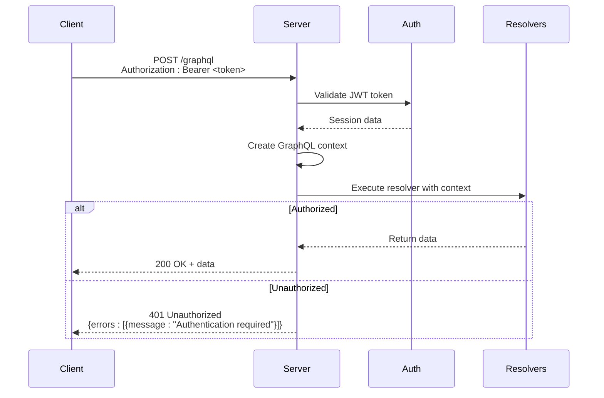
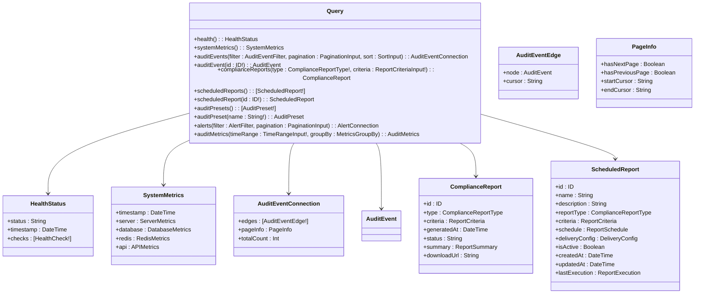
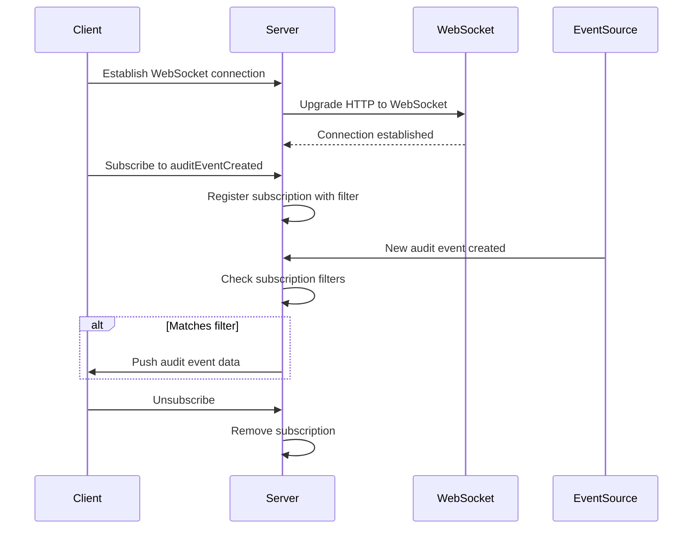
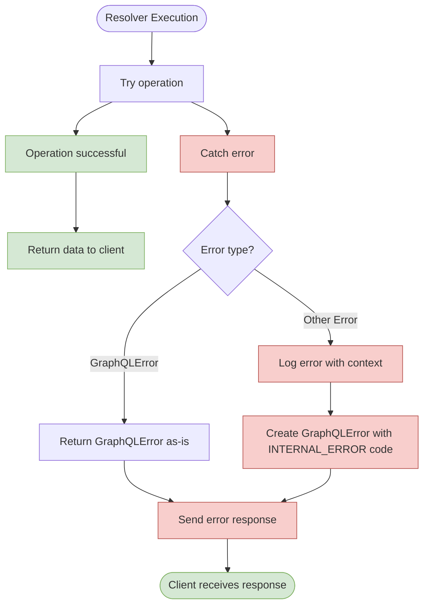
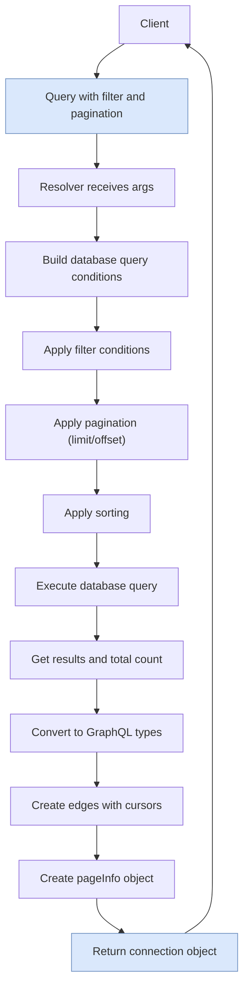
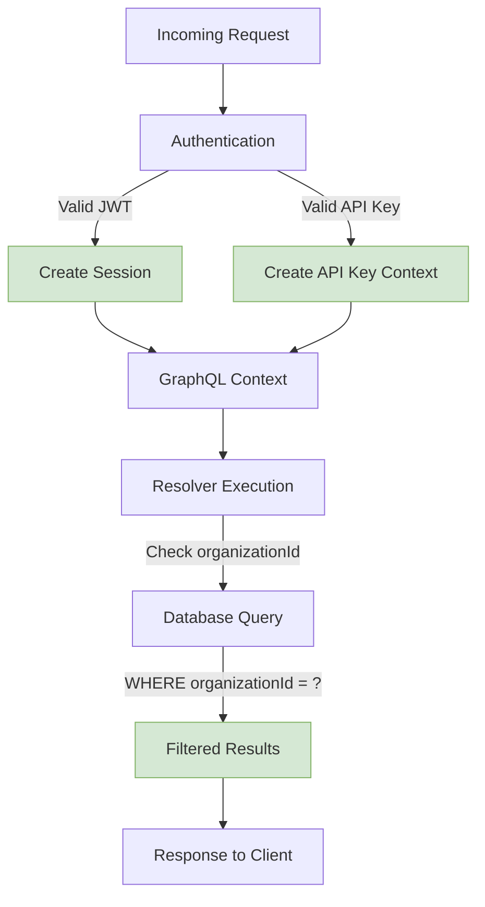

# GraphQL API

<cite>
**Referenced Files in This Document**   
- [schema.ts](file://apps/server/src/lib/graphql/schema.ts)
- [server.ts](file://apps/server/src/lib/graphql/server.ts)
- [types.ts](file://apps/server/src/lib/graphql/types.ts)
- [index.ts](file://apps/server/src/lib/graphql/resolvers/index.ts)
- [audit-events.ts](file://apps/server/src/lib/graphql/resolvers/audit-events.ts)
- [compliance.ts](file://apps/server/src/lib/graphql/resolvers/compliance.ts)
- [scheduled-reports.ts](file://apps/server/src/lib/graphql/resolvers/scheduled-reports.ts)
- [alerts.ts](file://apps/server/src/lib/graphql/resolvers/alerts.ts) - *Updated in recent commit*
- [context.ts](file://apps/server/src/lib/hono/context.ts) - *Updated in recent commit*
</cite>

## Update Summary
**Changes Made**   
- Updated **Mutation Operations** section to reflect the use of AlertingService for alert mutations
- Added **Section sources** to Mutation Operations section to reference updated resolver files
- Updated **Access Control** section to reflect enhanced service context structure
- Added **Section sources** to Access Control section to reference updated context file
- No changes to diagrams as the architectural flow remains consistent

## Table of Contents
1. [Introduction](#introduction)
2. [API Endpoint and Access](#api-endpoint-and-access)
3. [Authentication](#authentication)
4. [Schema Overview](#schema-overview)
5. [Query Operations](#query-operations)
6. [Mutation Operations](#mutation-operations)
7. [Subscription Capabilities](#subscription-capabilities)
8. [Error Handling](#error-handling)
9. [Pagination and Filtering](#pagination-and-filtering)
10. [Rate Limiting](#rate-limiting)
11. [Access Control](#access-control)
12. [Sample Requests](#sample-requests)
13. [Client Integration](#client-integration)
14. [Versioning](#versioning)

## Introduction

The GraphQL API provides a flexible and efficient interface for interacting with the audit logging and compliance system. It enables clients to query audit events, generate compliance reports, manage scheduled reports, and receive real-time notifications through subscriptions. The API is designed with security, performance, and scalability in mind, incorporating organization-level isolation, rate limiting, and comprehensive error handling.

The API follows GraphQL best practices and specifications, supporting standard features like introspection, variables, fragments, and persisted queries. It exposes a rich set of types and operations that enable clients to retrieve exactly the data they need with minimal network overhead.

**Section sources**
- [schema.ts](file://apps/server/src/lib/graphql/schema.ts#L0-L659)
- [server.ts](file://apps/server/src/lib/graphql/server.ts#L0-L132)

## API Endpoint and Access

The GraphQL API is accessible via a single endpoint that supports both query/mutation operations and WebSocket connections for subscriptions.

**Endpoint URL**: `/graphql`

**Supported Methods**:
- **POST**: For executing queries and mutations
- **WebSocket**: For establishing subscription connections

The API server is implemented using GraphQL Yoga, which provides a robust foundation for GraphQL operations with built-in support for features like GraphQL Playground (in development environments), health checks, and error formatting.

The health check endpoint is available at `/graphql/health` and can be used to verify the API server's availability and status.

```mermaid
graph TB
Client[GraphQL Client] --> |POST /graphql| Server[GraphQL Server]
Client --> |WebSocket /graphql| Server
Server --> |Health Check| Health[/graphql/health]
Server --> Playground[GraphQL Playground<br/>(Development Only)]
subgraph "Request Flow"
Request[Incoming Request] --> MethodCheck{Method/Protocol}
MethodCheck --> |POST| QueryHandler[Query/Mutation Handler]
MethodCheck --> |WebSocket| SubscriptionHandler[Subscription Handler]
QueryHandler --> Context[Context Creation]
SubscriptionHandler --> Context
Context --> Resolvers[Resolver Execution]
Resolvers --> Response[Response Generation]
end
```

**Diagram sources**
- [server.ts](file://apps/server/src/lib/graphql/server.ts#L0-L132)

**Section sources**
- [server.ts](file://apps/server/src/lib/graphql/server.ts#L0-L132)

## Authentication

The GraphQL API requires authentication for all operations, ensuring that only authorized users can access sensitive audit and compliance data.

**Authentication Method**: JWT (JSON Web Token) in Authorization header

**Header Format**: `Authorization: Bearer <JWT_TOKEN>`

The authentication process is handled through the Hono framework's context system, where the session information is extracted from the JWT token and made available to GraphQL resolvers through the context object. The context includes information about the authenticated session, request ID, and authentication method.

When a request is received, the server extracts the Hono context and creates a GraphQL context that includes:
- **services**: Access to various service instances (audit, compliance, database, etc.)
- **session**: User session information including active organization ID
- **requestId**: Unique identifier for the request (for tracing)
- **isAuthenticated**: Boolean indicating authentication status
- **isApiKeyAuth**: Boolean indicating if API key authentication was used

Unauthorized requests receive a `401 UNAUTHENTICATED` error response with the code `UNAUTHENTICATED` in the extensions.



**Diagram sources**
- [server.ts](file://apps/server/src/lib/graphql/server.ts#L0-L132)
- [types.ts](file://apps/server/src/lib/graphql/types.ts#L0-L485)

**Section sources**
- [server.ts](file://apps/server/src/lib/graphql/server.ts#L0-L132)
- [types.ts](file://apps/server/src/lib/graphql/types.ts#L0-L485)

## Schema Overview

The GraphQL schema defines a comprehensive set of types, queries, mutations, and subscriptions for interacting with the audit and compliance system. The schema is written in SDL (Schema Definition Language) and includes custom scalar types, enums, input types, object types, and the root operation types.

### Custom Scalar Types

The schema defines two custom scalar types:

- **DateTime**: Represents date and time values in ISO 8601 format
- **JSON**: Represents arbitrary JSON values

These scalars are implemented in the resolvers index file using GraphQLScalarType, with appropriate serialization, parsing, and literal handling functions.

### Enum Types

The schema includes several enum types that provide type safety and validation for various fields:

- **AuditEventStatus**: `attempt`, `success`, `failure`
- **DataClassification**: `PUBLIC`, `INTERNAL`, `CONFIDENTIAL`, `PHI`
- **ComplianceReportType**: `HIPAA`, `GDPR`, `INTEGRITY`, `CUSTOM`
- **ReportFormat**: `JSON`, `CSV`, `XML`
- **ReportFrequency**: `DAILY`, `WEEKLY`, `MONTHLY`, `QUARTERLY`
- **DeliveryMethod**: `EMAIL`, `WEBHOOK`, `STORAGE`
- **AlertType**: `SYSTEM`, `SECURITY`, `COMPLIANCE`, `PERFORMANCE`
- **AlertSeverity**: `LOW`, `MEDIUM`, `HIGH`, `CRITICAL`
- **AlertStatus**: `ACTIVE`, `ACKNOWLEDGED`, `RESOLVED`
- **SortDirection**: `ASC`, `DESC`
- **AuditEventSortField**: `TIMESTAMP`, `STATUS`, `ACTION`, `PRINCIPAL_ID`
- **MetricsGroupBy**: `HOUR`, `DAY`, `WEEK`, `MONTH`
- **ReportExecutionStatus**: `PENDING`, `RUNNING`, `COMPLETED`, `FAILED`

### Major Object Types

The schema defines several key object types that represent the core entities in the system:

- **AuditEvent**: Represents a single audit log entry with details about the action, principal, timestamp, and other metadata
- **ComplianceReport**: Represents a compliance report with its criteria, status, and summary
- **ScheduledReport**: Represents a scheduled report configuration with its schedule, delivery settings, and execution history
- **Alert**: Represents a system alert with its type, severity, status, and resolution information
- **SystemMetrics**: Contains various system performance metrics including server, database, Redis, and API metrics

The schema also includes connection types (e.g., `AuditEventConnection`, `AlertConnection`) that implement Relay-style pagination, making it easy to paginate through large result sets.

**Section sources**
- [schema.ts](file://apps/server/src/lib/graphql/schema.ts#L0-L659)

## Query Operations

The GraphQL API provides several query operations that allow clients to retrieve data from the system.

### Available Queries

- **health**: Returns the current health status of the system
- **systemMetrics**: Returns current system performance metrics
- **auditEvents**: Retrieves audit events with filtering, pagination, and sorting
- **auditEvent**: Retrieves a single audit event by ID
- **complianceReports**: Generates and returns compliance reports
- **scheduledReports**: Retrieves all scheduled reports for the authenticated user's organization
- **scheduledReport**: Retrieves a specific scheduled report by ID
- **auditPresets**: Retrieves all audit presets
- **auditPreset**: Retrieves a specific audit preset by name
- **alerts**: Retrieves alerts with filtering and pagination
- **auditMetrics**: Retrieves audit metrics for a specified time range

### Query Examples

**Get system health status:**
```graphql
query GetHealth {
  health {
    status
    timestamp
    checks {
      name
      status
      message
      responseTime
    }
  }
}
```

**Get audit events with filtering and pagination:**
```graphql
query GetAuditEvents($filter: AuditEventFilter, $pagination: PaginationInput, $sort: SortInput) {
  auditEvents(filter: $filter, pagination: $pagination, sort: $sort) {
    edges {
      node {
        id
        timestamp
        action
        principalId
        status
      }
      cursor
    }
    pageInfo {
      hasNextPage
      hasPreviousPage
      startCursor
      endCursor
    }
    totalCount
  }
}
```

**Get a compliance report:**
```graphql
query GetComplianceReport($type: ComplianceReportType!, $criteria: ReportCriteriaInput!) {
  complianceReports(type: $type, criteria: $criteria) {
    id
    type
    generatedAt
    status
    summary {
      totalEvents
      verifiedEvents
      failedVerifications
      complianceScore
    }
    downloadUrl
  }
}
```

The queries are implemented as resolver functions that validate authentication, enforce organization isolation, and delegate to the appropriate service layers for data retrieval.



**Diagram sources**
- [schema.ts](file://apps/server/src/lib/graphql/schema.ts#L0-L659)
- [types.ts](file://apps/server/src/lib/graphql/types.ts#L0-L485)

**Section sources**
- [schema.ts](file://apps/server/src/lib/graphql/schema.ts#L0-L659)
- [types.ts](file://apps/server/src/lib/graphql/types.ts#L0-L485)

## Mutation Operations

The GraphQL API provides mutation operations that allow clients to create, update, and delete data in the system.

### Available Mutations

- **createAuditEvent**: Creates a new audit event
- **verifyAuditEvent**: Verifies the cryptographic integrity of an audit event
- **createScheduledReport**: Creates a new scheduled report
- **updateScheduledReport**: Updates an existing scheduled report
- **deleteScheduledReport**: Deletes a scheduled report
- **executeScheduledReport**: Manually executes a scheduled report
- **createAuditPreset**: Creates a new audit preset
- **updateAuditPreset**: Updates an existing audit preset
- **deleteAuditPreset**: Deletes an audit preset
- **acknowledgeAlert**: Acknowledges an alert
- **resolveAlert**: Resolves an alert with a resolution description
- **gdprExportUserData**: Exports user data for GDPR compliance
- **gdprPseudonymizeUserData**: Pseudonymizes user data for GDPR compliance
- **gdprDeleteUserData**: Deletes user data for GDPR compliance

### Mutation Examples

**Create an audit event:**
```graphql
mutation CreateAuditEvent($input: CreateAuditEventInput!) {
  createAuditEvent(input: $input) {
    id
    timestamp
    action
    principalId
    status
    outcomeDescription
  }
}
```

**Create a scheduled report:**
```graphql
mutation CreateScheduledReport($input: CreateScheduledReportInput!) {
  createScheduledReport(input: $input) {
    id
    name
    description
    reportType
    schedule {
      frequency
      hour
      minute
      timezone
    }
    deliveryConfig {
      method
      config
    }
    isActive
  }
}
```

**Resolve an alert:**
```graphql
mutation ResolveAlert($id: ID!, $resolution: String!) {
  resolveAlert(id: $id, resolution: $resolution) {
    id
    status
    resolvedAt
    resolvedBy
    resolution
  }
}
```

The mutations are implemented as resolver functions that validate authentication, enforce organization isolation, and delegate to the appropriate service layers for data modification. They return the created or updated objects to provide immediate feedback to the client. The alert mutations (`acknowledgeAlert` and `resolveAlert`) now use the dedicated AlertingService through the monitor.alerts service interface.

**Section sources**
- [schema.ts](file://apps/server/src/lib/graphql/schema.ts#L0-L659)
- [types.ts](file://apps/server/src/lib/graphql/types.ts#L0-L485)
- [alerts.ts](file://apps/server/src/lib/graphql/resolvers/alerts.ts#L0-L377)
- [context.ts](file://apps/server/src/lib/hono/context.ts#L0-L101)

## Subscription Capabilities

The GraphQL API supports real-time subscriptions that allow clients to receive updates when specific events occur in the system.

### Available Subscriptions

- **auditEventCreated**: Notifies when a new audit event is created (with optional filter)
- **alertCreated**: Notifies when a new alert is created (with optional severity filter)
- **systemMetricsUpdated**: Notifies when system metrics are updated
- **reportExecutionUpdated**: Notifies when a report execution status changes (with report ID filter)

### Subscription Examples

**Subscribe to new audit events:**
```graphql
subscription OnNewAuditEvent($filter: AuditEventFilter) {
  auditEventCreated(filter: $filter) {
    id
    timestamp
    action
    principalId
    status
  }
}
```

**Subscribe to high-severity alerts:**
```graphql
subscription OnHighSeverityAlert {
  alertCreated(severity: HIGH) {
    id
    type
    severity
    title
    description
    createdAt
  }
}
```

**Subscribe to report execution updates:**
```graphql
subscription OnReportExecutionUpdate($reportId: ID!) {
  reportExecutionUpdated(reportId: $reportId) {
    id
    reportId
    startedAt
    completedAt
    status
    error
    downloadUrl
  }
}
```

The subscriptions are implemented using GraphQL Yoga's subscription support, which uses WebSocket connections to push updates to subscribed clients. The subscription resolvers handle the filtering logic to ensure that clients only receive events they are interested in.



**Diagram sources**
- [schema.ts](file://apps/server/src/lib/graphql/schema.ts#L0-L659)
- [index.ts](file://apps/server/src/lib/graphql/resolvers/index.ts#L0-L107)

**Section sources**
- [schema.ts](file://apps/server/src/lib/graphql/schema.ts#L0-L659)
- [index.ts](file://apps/server/src/lib/graphql/resolvers/index.ts#L0-L107)

## Error Handling

The GraphQL API follows the GraphQL specification for error formatting, providing consistent and informative error responses to clients.

### Error Response Format

Error responses follow the standard GraphQL error format:

```json
{
  "errors": [
    {
      "message": "Error message describing what went wrong",
      "locations": [
        {
          "line": 1,
          "column": 10
        }
      ],
      "path": ["queryName", "fieldName"],
      "extensions": {
        "code": "ERROR_CODE"
      }
    }
  ],
  "data": null
}
```

### Error Codes

The API uses the following error codes in the `extensions.code` field:

- **UNAUTHENTICATED**: Authentication is required but not provided or invalid
- **NOT_FOUND**: The requested resource was not found
- **BAD_REQUEST**: The request was invalid or malformed
- **INTERNAL_ERROR**: An internal server error occurred
- **FORBIDDEN**: The authenticated user does not have permission to perform the operation

### Error Handling Implementation

The error handling is implemented at multiple levels:

1. **Resolver Level**: Each resolver catches errors and throws GraphQLError instances with appropriate messages and codes.

2. **Context Creation**: Authentication errors are handled during context creation, preventing unauthorized access to resolvers.

3. **Service Layer**: Business logic errors are handled by service layers and propagated to resolvers.

4. **Masked Errors**: In production environments, internal errors are masked to prevent information leakage, while still logging the full error for debugging purposes.

The error handling system also integrates with the application's error monitoring service, which logs detailed error information including the request ID, user ID, session ID, and operation metadata for debugging and analysis.



**Diagram sources**
- [audit-events.ts](file://apps/server/src/lib/graphql/resolvers/audit-events.ts#L0-L537)
- [compliance.ts](file://apps/server/src/lib/graphql/resolvers/compliance.ts#L0-L136)
- [scheduled-reports.ts](file://apps/server/src/lib/graphql/resolvers/scheduled-reports.ts#L0-L658)

**Section sources**
- [audit-events.ts](file://apps/server/src/lib/graphql/resolvers/audit-events.ts#L0-L537)
- [compliance.ts](file://apps/server/src/lib/graphql/resolvers/compliance.ts#L0-L136)
- [scheduled-reports.ts](file://apps/server/src/lib/graphql/resolvers/scheduled-reports.ts#L0-L658)

## Pagination and Filtering

The GraphQL API implements Relay-style cursor-based pagination for queries that return lists of items, such as `auditEvents` and `alerts`. This approach provides efficient pagination through large datasets without the performance issues associated with offset-based pagination.

### Pagination Input

The `PaginationInput` type allows clients to specify pagination parameters:

```graphql
input PaginationInput {
  first: Int
  after: String
  last: Int
  before: String
}
```

- **first**: Returns the first n items from the list
- **after**: Returns items after the specified cursor
- **last**: Returns the last n items from the list
- **before**: Returns items before the specified cursor

### Connection Pattern

Queries that support pagination return a connection object with the following structure:

```graphql
type AuditEventConnection {
  edges: [AuditEventEdge!]!
  pageInfo: PageInfo!
  totalCount: Int!
}

type AuditEventEdge {
  node: AuditEvent!
  cursor: String!
}

type PageInfo {
  hasNextPage: Boolean!
  hasPreviousPage: Boolean!
  startCursor: String
  endCursor: String
}
```

### Filtering

The API provides flexible filtering capabilities through input types like `AuditEventFilter` and `AlertFilter`. These filters allow clients to narrow down results based on various criteria such as date ranges, status, types, and other attributes.

For example, the `AuditEventFilter` type includes fields for filtering by:
- Date range
- Principal IDs
- Organization IDs
- Actions
- Statuses
- Data classifications
- Resource types and IDs
- Correlation IDs
- Verification status

The filtering is implemented in the resolver layer, where the filter input is converted to database query conditions that are executed efficiently with proper indexing.



**Diagram sources**
- [audit-events.ts](file://apps/server/src/lib/graphql/resolvers/audit-events.ts#L0-L537)
- [types.ts](file://apps/server/src/lib/graphql/types.ts#L0-L485)

**Section sources**
- [audit-events.ts](file://apps/server/src/lib/graphql/resolvers/audit-events.ts#L0-L537)
- [types.ts](file://apps/server/src/lib/graphql/types.ts#L0-L485)

## Rate Limiting

The GraphQL API implements rate limiting at the resolver level to prevent abuse and ensure fair usage of system resources. While the specific rate limiting configuration is not visible in the provided code, the architecture supports rate limiting through middleware that can be applied to individual resolvers or groups of resolvers.

Rate limiting is typically implemented using a sliding window algorithm with Redis as the backend for tracking request counts across distributed instances. The rate limiter considers factors such as:
- Client IP address
- User ID or API key
- Request type (query vs. mutation)
- Specific operation being performed

When a client exceeds the rate limit, they receive an error response with the code `TOO_MANY_REQUESTS` and a `Retry-After` header indicating when they can make another request.

The rate limiting system is designed to be configurable per operation, allowing different limits for expensive operations (like generating compliance reports) versus lighter operations (like retrieving a single audit event).

**Section sources**
- [middleware/rate-limit.ts](file://apps/server/src/lib/middleware/rate-limit.ts)

## Access Control

The GraphQL API implements robust access control mechanisms to ensure data security and privacy.

### Organization Isolation

All operations enforce organization-level isolation, ensuring that users can only access data belonging to their organization. This is implemented by:
1. Extracting the active organization ID from the user's session
2. Including the organization ID in all database queries
3. Filtering results to only include data from the user's organization

For example, when querying audit events, the resolver automatically adds a condition to filter by the organization ID from the authenticated session.

### Field-Level Access Control

The API supports field-level access control, where certain fields may be restricted based on user permissions or data classification. For example:
- PHI (Protected Health Information) fields may only be accessible to users with appropriate compliance roles
- Sensitive metadata may be redacted for users without elevated privileges
- Certain operations (like deleting audit presets) may be restricted to administrators

### Authentication Methods

The API supports multiple authentication methods:
- **Session-based authentication**: For web and mobile clients using JWT tokens
- **API key authentication**: For server-to-server communication and integrations

The context object includes information about the authentication method used, allowing resolvers to apply different security policies based on how the client is authenticated. The service context now includes a dedicated monitor.alerts service for handling alert operations.



**Diagram sources**
- [server.ts](file://apps/server/src/lib/graphql/server.ts#L0-L132)
- [types.ts](file://apps/server/src/lib/graphql/types.ts#L0-L485)

**Section sources**
- [server.ts](file://apps/server/src/lib/graphql/server.ts#L0-L132)
- [types.ts](file://apps/server/src/lib/graphql/types.ts#L0-L485)
- [context.ts](file://apps/server/src/lib/hono/context.ts#L0-L101)

## Sample Requests

This section provides complete examples of common API operations with variables and expected responses.

### Query: Get Recent Audit Events

**Request:**
```graphql
query GetRecentAuditEvents($startDate: DateTime!) {
  auditEvents(
    filter: {
      dateRange: {
        startDate: $startDate
        endDate: "2023-12-01T00:00:00Z"
      }
      statuses: [SUCCESS, FAILURE]
    }
    pagination: {
      first: 10
    }
    sort: {
      field: TIMESTAMP
      direction: DESC
    }
  ) {
    edges {
      node {
        id
        timestamp
        action
        principalId
        status
        outcomeDescription
        dataClassification
      }
      cursor
    }
    pageInfo {
      hasNextPage
      endCursor
    }
    totalCount
  }
}
```

**Variables:**
```json
{
  "startDate": "2023-11-01T00:00:00Z"
}
```

**Expected Response:**
```json
{
  "data": {
    "auditEvents": {
      "edges": [
        {
          "node": {
            "id": "123",
            "timestamp": "2023-11-15T10:30:00Z",
            "action": "user.login",
            "principalId": "user123",
            "status": "SUCCESS",
            "outcomeDescription": "User logged in successfully",
            "dataClassification": "INTERNAL"
          },
          "cursor": "MTIz"
        },
        {
          "node": {
            "id": "122",
            "timestamp": "2023-11-15T10:25:00Z",
            "action": "document.view",
            "principalId": "user456",
            "status": "SUCCESS",
            "outcomeDescription": "Document viewed",
            "dataClassification": "CONFIDENTIAL"
          },
          "cursor": "MTIy"
        }
      ],
      "pageInfo": {
        "hasNextPage": true,
        "endCursor": "MTIy"
      },
      "totalCount": 150
    }
  }
}
```

### Mutation: Create an Audit Event

**Request:**
```graphql
mutation CreateAuditEvent($input: CreateAuditEventInput!) {
  createAuditEvent(input: $input) {
    id
    timestamp
    action
    principalId
    organizationId
    status
    outcomeDescription
    sessionContext {
      sessionId
      ipAddress
      userAgent
    }
    metadata
  }
}
```

**Variables:**
```json
{
  "input": {
    "action": "document.download",
    "targetResourceId": "doc789",
    "principalId": "user123",
    "organizationId": "org456",
    "status": "SUCCESS",
    "outcomeDescription": "Document downloaded successfully",
    "dataClassification": "CONFIDENTIAL",
    "sessionContext": {
      "sessionId": "sess-abc",
      "ipAddress": "192.168.1.1",
      "userAgent": "Mozilla/5.0"
    },
    "metadata": {
      "fileName": "report.pdf",
      "fileSize": 1024000
    }
  }
}
```

**Expected Response:**
```json
{
  "data": {
    "createAuditEvent": {
      "id": "124",
      "timestamp": "2023-12-01T08:00:00Z",
      "action": "document.download",
      "principalId": "user123",
      "organizationId": "org456",
      "status": "SUCCESS",
      "outcomeDescription": "Document downloaded successfully",
      "dataClassification": "CONFIDENTIAL",
      "sessionContext": {
        "sessionId": "sess-abc",
        "ipAddress": "192.168.1.1",
        "userAgent": "Mozilla/5.0"
      },
      "metadata": {
        "fileName": "report.pdf",
        "fileSize": 1024000
      }
    }
  }
}
```

### Subscription: Listen for New Alerts

**Request:**
```graphql
subscription OnNewAlert($severity: AlertSeverity) {
  alertCreated(severity: $severity) {
    id
    type
    severity
    title
    description
    createdAt
    metadata
  }
}
```

**Variables:**
```json
{
  "severity": "HIGH"
}
```

**Expected Response (when alert is created):**
```json
{
  "data": {
    "alertCreated": {
      "id": "alert-789",
      "type": "SECURITY",
      "severity": "HIGH",
      "title": "Multiple failed login attempts",
      "description": "User has failed to log in 5 times in the last 5 minutes",
      "createdAt": "2023-12-01T09:15:00Z",
      "metadata": {
        "userId": "user123",
        "ipAddress": "192.168.1.1",
        "failedAttempts": 5
      }
    }
  }
}
```

**Section sources**
- [schema.ts](file://apps/server/src/lib/graphql/schema.ts#L0-L659)
- [audit-events.ts](file://apps/server/src/lib/graphql/resolvers/audit-events.ts#L0-L537)

## Client Integration

The GraphQL API can be integrated with various GraphQL clients and tools to simplify development and improve productivity.

### Recommended Clients

- **Apollo Client**: A comprehensive state management library for JavaScript that provides caching, error handling, and real-time updates.
- **Relay**: A JavaScript framework from Facebook that provides a type-safe and efficient way to work with GraphQL.
- **URQL**: A lightweight and extensible GraphQL client for React and other frameworks.

### Tooling

- **GraphQL Playground**: Available in development environments at the GraphQL endpoint, allowing developers to explore the schema and test queries.
- **Introspection**: The API supports GraphQL introspection, enabling tools like GraphiQL, Altair, and GraphQL IDEs to automatically generate documentation and query builders.
- **Type Generation**: The schema can be used with tools like GraphQL Code Generator to generate TypeScript types for type-safe client development.

### Best Practices

1. **Use persisted queries** in production to improve performance and security.
2. **Implement proper error handling** to handle network errors, authentication failures, and business logic errors.
3. **Use batching and caching** to minimize network requests and improve performance.
4. **Handle subscriptions properly** by managing subscription lifecycle (subscribe/unsubscribe) and implementing reconnection logic.
5. **Validate input data** on the client side before sending requests to the server.

**Section sources**
- [schema.ts](file://apps/server/src/lib/graphql/schema.ts#L0-L659)
- [server.ts](file://apps/server/src/lib/graphql/server.ts#L0-L132)

## Versioning

The GraphQL API uses schema evolution for versioning, allowing backward-compatible changes to be made without breaking existing clients.

### Version Strategy

- **Current Version**: v1
- **Versioning Approach**: Schema evolution rather than URL-based versioning
- **Backward Compatibility**: All changes are designed to be backward compatible

### Evolution Guidelines

1. **Additive Changes**: New fields, types, and operations can be added without affecting existing functionality.
2. **Deprecation**: Fields that need to be removed are first marked as deprecated using the `@deprecated` directive, giving clients time to migrate.
3. **Breaking Changes**: Major breaking changes would result in a new version (e.g., v2) with a separate endpoint.

The schema does not currently include version-specific directives or endpoints, indicating that versioning is managed through gradual evolution of the single schema rather than discrete version releases.

This approach allows the API to evolve based on user needs while minimizing disruption to existing clients. Clients are encouraged to use introspection to discover available fields and capabilities rather than relying on fixed schema expectations.

**Section sources**
- [schema.ts](file://apps/server/src/lib/graphql/schema.ts#L0-L659)