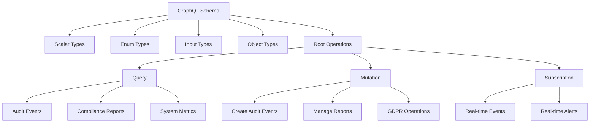
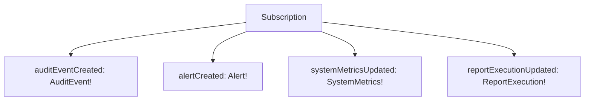
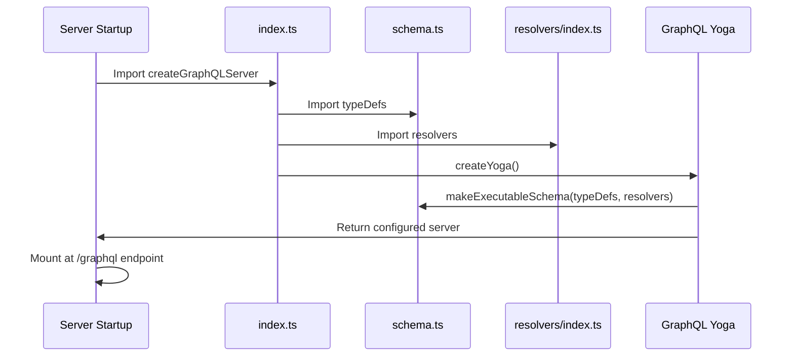
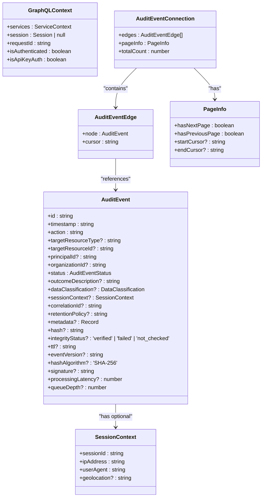
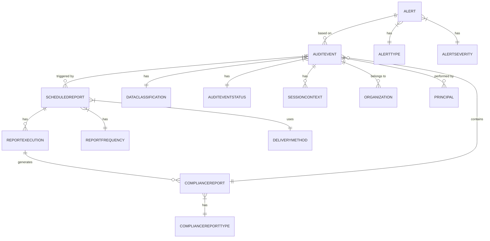

# GraphQL Schema

<cite>
**Referenced Files in This Document**   
- [schema.ts](file://apps/server/src/lib/graphql/schema.ts)
- [types.ts](file://apps/server/src/lib/graphql/types.ts)
- [schema.test.ts](file://apps/server/src/lib/graphql/__tests__/schema.test.ts)
- [GRAPHQL_AUDIT_COMPATIBILITY_FIXES.md](file://apps/server/src/lib/graphql/GRAPHQL_AUDIT_COMPATIBILITY_FIXES.md)
- [server.ts](file://apps/server/src/lib/graphql/server.ts)
- [index.ts](file://apps/server/src/lib/graphql/index.ts)
</cite>

## Table of Contents
1. [Introduction](#introduction)
2. [Schema Definition and Structure](#schema-definition-and-structure)
3. [Root Operation Types](#root-operation-types)
4. [Object Types](#object-types)
5. [Input Types and Validation](#input-types-and-validation)
6. [Enum Types](#enum-types)
7. [Scalar Types](#scalar-types)
8. [Schema Generation and Runtime Loading](#schema-generation-and-runtime-loading)
9. [Type Safety and TypeScript Integration](#type-safety-and-typescript-integration)
10. [Schema Versioning and Backward Compatibility](#schema-versioning-and-backward-compatibility)
11. [Testing and Validation](#testing-and-validation)
12. [Relationships and Data Flow](#relationships-and-data-flow)

## Introduction
This document provides comprehensive documentation for the GraphQL schema used in the smart-logs application. The schema defines a robust audit logging system with support for compliance reporting, real-time alerts, scheduled reports, and GDPR operations. It follows GraphQL best practices with a well-structured type system, proper pagination, filtering capabilities, and subscription support for real-time updates. The schema is designed to be type-safe, maintainable, and compatible with the underlying audit package and database schema.

## Schema Definition and Structure
The GraphQL schema is defined using Schema Definition Language (SDL) in the `schema.ts` file. It follows a modular structure with clear separation between different type categories including object types, input types, enums, and scalar types. The schema supports all three root operation types: Query, Mutation, and Subscription, enabling comprehensive data retrieval, modification, and real-time streaming capabilities.



**Diagram sources**
- [schema.ts](file://apps/server/src/lib/graphql/schema.ts)

**Section sources**
- [schema.ts](file://apps/server/src/lib/graphql/schema.ts)

## Root Operation Types

### Query Type
The Query type provides read-only access to various data entities in the system. It supports complex filtering, pagination, and sorting capabilities for audit events and alerts, while also exposing system health and metrics information.

**Fields:**
- **health**: Returns system health status with component-level details
- **systemMetrics**: Provides real-time system performance metrics
- **auditEvents**: Retrieves audit events with filtering, pagination, and sorting
- **auditEvent**: Retrieves a specific audit event by ID
- **complianceReports**: Generates compliance reports based on criteria
- **scheduledReports**: Lists all scheduled reports
- **scheduledReport**: Retrieves a specific scheduled report by ID
- **auditPresets**: Lists all audit presets
- **auditPreset**: Retrieves a specific audit preset by name
- **auditMetrics**: Provides aggregated audit metrics over time ranges
- **alerts**: Retrieves alerts with filtering and pagination

```mermaid
graph TD
Query --> Health[health: HealthStatus!]
Query --> Metrics[systemMetrics: SystemMetrics!]
Query --> AuditEvents[auditEvents: AuditEventConnection!]
Query --> AuditEvent[auditEvent(id: ID!): AuditEvent]
Query --> Reports[complianceReports: ComplianceReport!]
Query --> ScheduledReports[scheduledReports: [ScheduledReport!]!]
Query --> Presets[auditPresets: [AuditPreset!]!]
Query --> AlertMetrics[auditMetrics: AuditMetrics!]
Query --> Alerts[alerts: AlertConnection!]
```

**Diagram sources**
- [schema.ts](file://apps/server/src/lib/graphql/schema.ts#L400-L450)

**Section sources**
- [schema.ts](file://apps/server/src/lib/graphql/schema.ts#L400-L450)

### Mutation Type
The Mutation type enables data modification operations, allowing clients to create, update, and delete various entities in the system. It supports audit event creation, report management, alert handling, and GDPR compliance operations.

**Fields:**
- **createAuditEvent**: Creates a new audit event
- **verifyAuditEvent**: Verifies the integrity of an audit event
- **createScheduledReport**: Creates a new scheduled report
- **updateScheduledReport**: Updates an existing scheduled report
- **deleteScheduledReport**: Deletes a scheduled report
- **executeScheduledReport**: Manually executes a scheduled report
- **createAuditPreset**: Creates a new audit preset
- **updateAuditPreset**: Updates an existing audit preset
- **deleteAuditPreset**: Deletes an audit preset
- **acknowledgeAlert**: Acknowledges an alert
- **resolveAlert**: Resolves an alert with resolution details
- **gdprExportUserData**: Exports user data for GDPR compliance
- **gdprPseudonymizeUserData**: Pseudonymizes user data for GDPR compliance
- **gdprDeleteUserData**: Deletes user data for GDPR compliance

```mermaid
graph TD
Mutation --> CreateAudit[createAuditEvent: AuditEvent!]
Mutation --> VerifyAudit[verifyAuditEvent: IntegrityVerificationResult!]
Mutation --> CreateReport[createScheduledReport: ScheduledReport!]
Mutation --> UpdateReport[updateScheduledReport: ScheduledReport!]
Mutation --> DeleteReport[deleteScheduledReport: Boolean!]
Mutation --> ExecuteReport[executeScheduledReport: ReportExecution!]
Mutation --> CreatePreset[createAuditPreset: AuditPreset!]
Mutation --> UpdatePreset[updateAuditPreset: AuditPreset!]
Mutation --> DeletePreset[deleteAuditPreset: Boolean!]
Mutation --> AcknowledgeAlert[acknowledgeAlert: Alert!]
Mutation --> ResolveAlert[resolveAlert: Alert!]
Mutation --> GDPRExport[gdprExportUserData: GDPRExportResult!]
Mutation --> GDPRPseudonymize[gdprPseudonymizeUserData: GDPRPseudonymizeResult!]
Mutation --> GDPRDelete[gdprDeleteUserData: GDPRDeleteResult!]
```



**Diagram sources**
- [schema.ts](file://apps/server/src/lib/graphql/schema.ts#L450-L500)

**Section sources**
- [schema.ts](file://apps/server/src/lib/graphql/schema.ts#L450-L500)

### Subscription Type
The Subscription type enables real-time data streaming, allowing clients to receive updates as events occur in the system. This is particularly useful for monitoring and alerting scenarios where immediate notification is required.

**Fields:**
- **auditEventCreated**: Streams newly created audit events with optional filtering
- **alertCreated**: Streams newly created alerts with optional severity filtering
- **systemMetricsUpdated**: Streams updated system metrics at regular intervals
- **reportExecutionUpdated**: Streams updates to report execution status for a specific report



**Diagram sources**
- [schema.ts](file://apps/server/src/lib/graphql/schema.ts#L500-L520)

**Section sources**
- [schema.ts](file://apps/server/src/lib/graphql/schema.ts#L500-L520)

## Object Types

### AuditEvent
The AuditEvent type represents a single audit log entry in the system. It contains comprehensive information about an action performed within the application, including contextual data, security information, and integrity verification details.

**Fields:**
- **id**: Unique identifier for the audit event (ID!)
- **timestamp**: When the event occurred (DateTime!)
- **action**: The action that was performed (String!)
- **targetResourceType**: Type of resource that was targeted
- **targetResourceId**: Identifier of the targeted resource
- **principalId**: Identifier of the user or system that performed the action
- **organizationId**: Identifier of the organization associated with the event
- **status**: Status of the action (AuditEventStatus!)
- **outcomeDescription**: Human-readable description of the outcome
- **dataClassification**: Sensitivity level of the data involved (DataClassification)
- **sessionContext**: Information about the session in which the action occurred (SessionContext)
- **correlationId**: Identifier used to correlate related events
- **retentionPolicy**: Retention policy applied to this event
- **metadata**: Additional arbitrary metadata (JSON)
- **hash**: Cryptographic hash of the event data
- **integrityStatus**: Result of integrity verification
- **ttl**: Time-to-live for the event
- **eventVersion**: Version of the event schema
- **hashAlgorithm**: Algorithm used for hashing
- **signature**: Digital signature of the event
- **processingLatency**: Time taken to process the event
- **queueDepth**: Depth of the processing queue when the event was handled

**Section sources**
- [schema.ts](file://apps/server/src/lib/graphql/schema.ts#L50-L100)
- [types.ts](file://apps/server/src/lib/graphql/types.ts#L25-L49)

### Alert
The Alert type represents a system alert triggered by specific conditions or events. Alerts are used for monitoring system health, security incidents, compliance violations, and performance issues.

**Fields:**
- **id**: Unique identifier for the alert (ID!)
- **type**: Category of the alert (AlertType!)
- **severity**: Urgency level of the alert (AlertSeverity!)
- **title**: Brief descriptive title (String!)
- **description**: Detailed description of the alert (String!)
- **createdAt**: Timestamp when the alert was created (DateTime!)
- **acknowledgedAt**: Timestamp when the alert was acknowledged
- **resolvedAt**: Timestamp when the alert was resolved
- **acknowledgedBy**: Identifier of the user who acknowledged the alert
- **resolvedBy**: Identifier of the user who resolved the alert
- **resolution**: Description of how the alert was resolved
- **metadata**: Additional context-specific information (JSON)

**Section sources**
- [schema.ts](file://apps/server/src/lib/graphql/schema.ts#L270-L285)
- [types.ts](file://apps/server/src/lib/graphql/types.ts#L254-L267)

### ComplianceReport
The ComplianceReport type represents a compliance report generated by the system. These reports are used to demonstrate adherence to regulatory requirements such as HIPAA, GDPR, and internal integrity standards.

**Fields:**
- **id**: Unique identifier for the report (ID!)
- **type**: Category of compliance report (ComplianceReportType!)
- **criteria**: The criteria used to generate the report (ReportCriteria!)
- **generatedAt**: Timestamp when the report was generated (DateTime!)
- **status**: Current status of the report (String!)
- **summary**: Summary statistics for the report (ReportSummary!)
- **downloadUrl**: URL where the complete report can be downloaded

**Section sources**
- [schema.ts](file://apps/server/src/lib/graphql/schema.ts#L220-L235)
- [types.ts](file://apps/server/src/lib/graphql/types.ts#L160-L168)

### ScheduledReport
The ScheduledReport type represents a report that is configured to run automatically on a recurring schedule. This enables regular compliance monitoring and reporting without manual intervention.

**Fields:**
- **id**: Unique identifier for the scheduled report (ID!)
- **name**: Human-readable name of the report (String!)
- **description**: Detailed description of the report's purpose
- **reportType**: Type of compliance report to generate (ComplianceReportType!)
- **criteria**: Criteria for the report data (ReportCriteria!)
- **schedule**: Scheduling configuration (ReportSchedule!)
- **deliveryConfig**: Configuration for report delivery (DeliveryConfig!)
- **isActive**: Whether the schedule is currently active (Boolean!)
- **createdAt**: Timestamp when the schedule was created (DateTime!)
- **updatedAt**: Timestamp when the schedule was last modified (DateTime!)
- **lastExecution**: Information about the most recent execution (ReportExecution)

**Section sources**
- [schema.ts](file://apps/server/src/lib/graphql/schema.ts#L250-L270)
- [types.ts](file://apps/server/src/lib/graphql/types.ts#L190-L202)

### GDPROptions
The schema includes comprehensive GDPR compliance operations through three specific mutation fields that handle data subject rights requests. These operations enable the system to comply with GDPR requirements for data access, anonymization, and deletion.

**GDPR Operations:**
- **gdprExportUserData**: Exports all personal data for a specific data subject in a structured format
- **gdprPseudonymizeUserData**: Replaces personally identifiable information with pseudonyms while maintaining data utility for compliance auditing
- **gdprDeleteUserData**: Permanently removes personal data for a data subject, with options to preserve compliance-related audit records

**Section sources**
- [schema.ts](file://apps/server/src/lib/graphql/schema.ts#L500-L520)

## Input Types and Validation

### AuditEventFilter
The AuditEventFilter input type enables flexible querying of audit events with multiple filtering criteria.

**Fields:**
- **dateRange**: Time range filter (TimeRangeInput)
- **principalIds**: Filter by principal identifiers ([String!])
- **organizationIds**: Filter by organization identifiers ([String!])
- **actions**: Filter by action types ([String!])
- **statuses**: Filter by event statuses ([AuditEventStatus!])
- **dataClassifications**: Filter by data sensitivity levels ([DataClassification!])
- **resourceTypes**: Filter by resource types ([String!])
- **resourceIds**: Filter by resource identifiers ([String!])
- **verifiedOnly**: Only include events with verified integrity
- **correlationIds**: Filter by correlation identifiers ([String!])

**Section sources**
- [schema.ts](file://apps/server/src/lib/graphql/schema.ts#L30-L50)
- [types.ts](file://apps/server/src/lib/graphql/types.ts#L55-L75)

### PaginationInput
The PaginationInput type implements cursor-based pagination for efficient navigation through large datasets.

**Fields:**
- **first**: Return the first n items (Int)
- **after**: Cursor to start after (String)
- **last**: Return the last n items (Int)
- **before**: Cursor to end before (String)

**Section sources**
- [schema.ts](file://apps/server/src/lib/graphql/schema.ts#L40-L45)
- [types.ts](file://apps/server/src/lib/graphql/types.ts#L80-L85)

### CreateAuditEventInput
The CreateAuditEventInput type defines the required and optional fields for creating a new audit event.

**Fields:**
- **action**: Action performed (String!, required)
- **targetResourceType**: Type of resource targeted
- **targetResourceId**: Identifier of targeted resource
- **principalId**: Identifier of the actor (String!, required)
- **organizationId**: Identifier of the organization (String!, required)
- **status**: Outcome status (AuditEventStatus!, required)
- **outcomeDescription**: Human-readable outcome description
- **dataClassification**: Sensitivity level of data involved (DataClassification)
- **sessionContext**: Session information (SessionContextInput)
- **correlationId**: Correlation identifier
- **retentionPolicy**: Retention policy to apply
- **metadata**: Additional structured data (JSON)

**Section sources**
- [schema.ts](file://apps/server/src/lib/graphql/schema.ts#L50-L80)
- [types.ts](file://apps/server/src/lib/graphql/types.ts#L280-L300)

## Enum Types

### AuditEventType
The AuditEventType enum classifies different categories of audit events in the system.

**Values:**
- **attempt**: An action was attempted
- **success**: An action completed successfully
- **failure**: An action failed to complete

**Section sources**
- [schema.ts](file://apps/server/src/lib/graphql/schema.ts#L3-L5)

### AlertSeverity
The AlertSeverity enum indicates the urgency and importance of an alert.

**Values:**
- **LOW**: Minor issue requiring attention
- **MEDIUM**: Significant issue requiring prompt attention
- **HIGH**: Major issue requiring immediate attention
- **CRITICAL**: Severe issue requiring immediate resolution

**Section sources**
- [schema.ts](file://apps/server/src/lib/graphql/schema.ts#L15-L18)

### Other Enum Types
The schema includes several other enum types for various purposes:

- **DataClassification**: PUBLIC, INTERNAL, CONFIDENTIAL, PHI
- **ComplianceReportType**: HIPAA, GDPR, INTEGRITY, CUSTOM
- **ReportFormat**: JSON, CSV, XML
- **ReportFrequency**: DAILY, WEEKLY, MONTHLY, QUARTERLY
- **DeliveryMethod**: EMAIL, WEBHOOK, STORAGE
- **AlertType**: SYSTEM, SECURITY, COMPLIANCE, PERFORMANCE
- **AlertStatus**: ACTIVE, ACKNOWLEDGED, RESOLVED
- **SortDirection**: ASC, DESC
- **AuditEventSortField**: TIMESTAMP, STATUS, ACTION, PRINCIPAL_ID
- **MetricsGroupBy**: HOUR, DAY, WEEK, MONTH
- **ReportExecutionStatus**: PENDING, RUNNING, COMPLETED, FAILED

**Section sources**
- [schema.ts](file://apps/server/src/lib/graphql/schema.ts#L6-L30)

## Scalar Types
The schema defines custom scalar types to handle specialized data formats.

### DateTime
The DateTime scalar represents a point in time with ISO 8601 format (YYYY-MM-DDTHH:MM:SS.sssZ). This scalar is used throughout the schema for timestamps, ensuring consistent date and time handling across all operations.

### JSON
The JSON scalar represents arbitrary JSON data, allowing flexible metadata storage and transmission. This scalar enables clients to include structured data with audit events, reports, and other entities without requiring predefined fields.

**Section sources**
- [schema.ts](file://apps/server/src/lib/graphql/schema.ts#L1-L2)

## Schema Generation and Runtime Loading
The GraphQL schema is generated and loaded at runtime using GraphQL Yoga, a flexible GraphQL server implementation. The schema is constructed using the `makeExecutableSchema` function from `@graphql-tools/schema`, which combines the SDL type definitions with resolver functions.



**Diagram sources**
- [server.ts](file://apps/server/src/lib/graphql/server.ts#L20-L40)
- [index.ts](file://apps/server/src/lib/graphql/index.ts)

**Section sources**
- [server.ts](file://apps/server/src/lib/graphql/server.ts)
- [index.ts](file://apps/server/src/lib/graphql/index.ts)

## Type Safety and TypeScript Integration
The schema maintains type safety through a comprehensive TypeScript integration strategy. The `types.ts` file defines TypeScript interfaces that mirror the GraphQL schema types, ensuring consistency between the schema definition and the resolver implementations.

The system imports types from the audit package (`@repo/audit`) to ensure compatibility between the GraphQL layer and the underlying audit functionality. This includes importing `AuditEventStatus`, `DataClassification`, and `SessionContext` types, which are then used in the GraphQL type definitions.



**Diagram sources**
- [types.ts](file://apps/server/src/lib/graphql/types.ts)

**Section sources**
- [types.ts](file://apps/server/src/lib/graphql/types.ts)

## Schema Versioning and Backward Compatibility
The schema maintains backward compatibility through a documented compatibility strategy outlined in `GRAPHQL_AUDIT_COMPATIBILITY_FIXES.md`. Key practices include:

1. **Enum Value Consistency**: Enum values are aligned with the audit package, using lowercase values (e.g., "attempt", "success", "failure") to match the underlying package.

2. **Field Evolution**: New fields are added as optional to avoid breaking existing queries, following GraphQL's best practices for schema evolution.

3. **Type Reuse**: The schema imports types from the audit package to ensure consistency across the system, reducing the risk of type mismatches.

4. **Database Compatibility**: The schema accounts for the database structure where core fields are stored as direct columns while additional properties are stored in a JSONB `details` field.

5. **Gradual Migration**: Changes are implemented incrementally with proper testing to ensure existing functionality continues to work.

The compatibility fixes document specifically addresses alignment between the GraphQL implementation and the audit package, ensuring type consistency and proper data mapping across the system.

**Section sources**
- [GRAPHQL_AUDIT_COMPATIBILITY_FIXES.md](file://apps/server/src/lib/graphql/GRAPHQL_AUDIT_COMPATIBILITY_FIXES.md)

## Testing and Validation
The schema is thoroughly tested using Vitest to ensure correctness and reliability. The test suite in `schema.test.ts` validates various aspects of the schema:

```mermaid
flowchart TD
A[Schema Tests] --> B[Schema Validation]
A --> C[Type Definitions]
A --> D[Query Type]
A --> E[Mutation Type]
A --> F[Subscription Type]
A --> G[Field Relationships]
A --> H[Enum Values]
A --> I[Input Validation]
A --> J[Schema Introspection]
B --> B1[Valid GraphQL schema]
B --> B2[Query syntax validation]
B --> B3[Mutation syntax validation]
B --> B4[Subscription syntax validation]
C --> C1[Scalar types]
C --> C2[Enum types]
C --> C3[Input types]
C --> C4[Object types]
D --> D1[Required query fields]
D --> D2[Correct field types]
D --> D3[Correct arguments]
E --> E1[Required mutation fields]
E --> E2[Correct field types]
E --> E3[Correct arguments]
F --> F1[Required subscription fields]
F --> F2[Correct field types]
F --> F3[Correct arguments]
G --> G1[AuditEvent relationships]
G --> G2[AuditEventConnection relationships]
G --> G3[ComplianceReport relationships]
H --> H1[AuditEventStatus values]
H --> H2[DataClassification values]
H --> H3[ComplianceReportType values]
H --> H4[AlertSeverity values]
I --> I1[CreateAuditEventInput structure]
I --> I2[AuditEventFilter structure]
I --> I3[PaginationInput structure]
J --> J1[Introspection queries]
J --> J2[Type information queries]
```



**Diagram sources**
- [schema.test.ts](file://apps/server/src/lib/graphql/__tests__/schema.test.ts)

**Section sources**
- [schema.test.ts](file://apps/server/src/lib/graphql/__tests__/schema.test.ts)

## Relationships and Data Flow
The schema entities are interconnected through various relationships that enable comprehensive audit and compliance functionality.



The data flow begins with audit events being created through the `createAuditEvent` mutation or automatically by system operations. These events can trigger alerts based on predefined conditions. Compliance reports are generated by querying audit events based on specific criteria. Scheduled reports automate this process by running compliance reports on a recurring basis. The system also supports real-time subscriptions that allow clients to receive immediate notifications of new audit events and alerts.

**Diagram sources**
- [schema.ts](file://apps/server/src/lib/graphql/schema.ts)
- [types.ts](file://apps/server/src/lib/graphql/types.ts)

**Section sources**
- [schema.ts](file://apps/server/src/lib/graphql/schema.ts)
- [types.ts](file://apps/server/src/lib/graphql/types.ts)