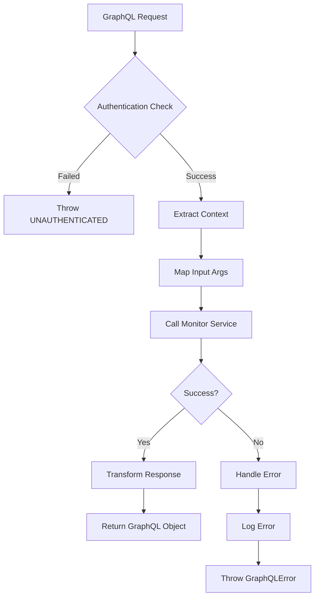
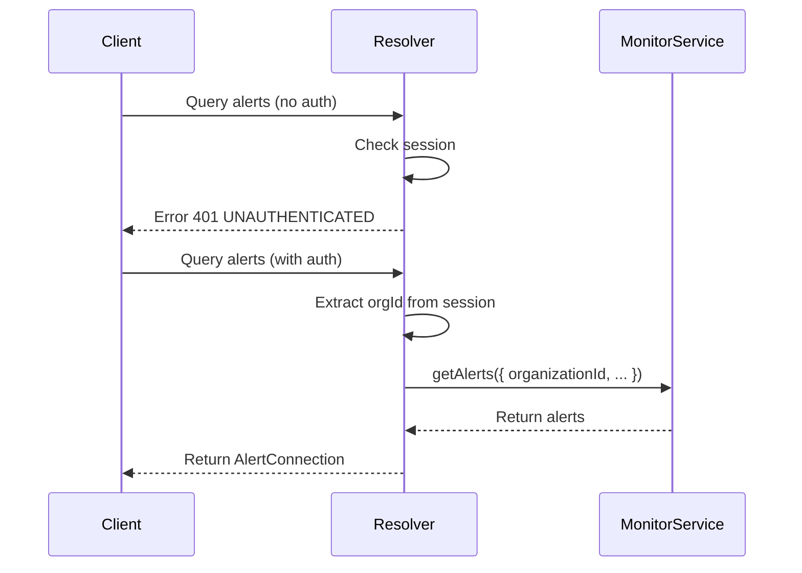
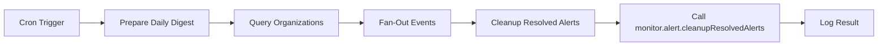

# Alerts Resolvers

<cite>
**Referenced Files in This Document**   
- [alerts.ts](file://apps/server/src/lib/graphql/resolvers/alerts.ts)
- [alerts.test.ts](file://apps/server/src/lib/graphql/resolvers/__tests__/alerts.test.ts)
- [cleanup-old-alerts.ts](file://apps/inngest/src/inngest/functions/alerts/cleanup-old-alerts.ts)
</cite>

## Table of Contents
1. [Introduction](#introduction)
2. [Core Components](#core-components)
3. [Query Resolvers](#query-resolvers)
4. [Mutation Resolvers](#mutation-resolvers)
5. [Authentication and Authorization](#authentication-and-authorization)
6. [Error Handling Patterns](#error-handling-patterns)
7. [Integration with Inngest Background Processing](#integration-with-inngest-background-processing)
8. [Resolver Usage Examples from Integration Tests](#resolver-usage-examples-from-integration-tests)
9. [Conclusion](#conclusion)

## Introduction
This document provides comprehensive documentation for the GraphQL resolvers responsible for managing alerts within the system. The resolvers enable clients to retrieve, acknowledge, and resolve alerts through a well-defined API surface. These operations are critical for monitoring, incident response, and compliance workflows. The implementation integrates with the underlying alerting system, enforces authentication and authorization, handles errors gracefully, and supports background processing via Inngest for maintenance tasks such as cleanup of resolved alerts.

**Section sources**
- [alerts.ts](file://apps/server/src/lib/graphql/resolvers/alerts.ts#L1-L376)

## Core Components
The alerts resolvers are implemented in the `alertResolvers` object, which defines both query and mutation operations for interacting with alert data. The resolver logic abstracts interactions with the monitoring service, transforms data between internal and GraphQL representations, and ensures proper session context and error handling. Key helper functions include cursor-based pagination utilities and type mappers between the GraphQL schema and the underlying monitoring system's alert types.

**Diagram sources**
- [alerts.ts](file://apps/server/src/lib/graphql/resolvers/alerts.ts#L1-L376)

**Section sources**
- [alerts.ts](file://apps/server/src/lib/graphql/resolvers/alerts.ts#L1-L376)

## Query Resolvers

### alerts Query
The `alerts` query retrieves a paginated list of alerts filtered by optional criteria such as status, severity, and type.

**Input Arguments:**
- `filter?: AlertFilter`  
  - `status?: "ACTIVE" | "ACKNOWLEDGED" | "RESOLVED"`  
  - `severities?: AlertSeverity[]` (supports single value filtering)  
  - `types?: AlertType[]` (supports single value filtering)  
- `pagination?: PaginationInput`  
  - `first?: number` (default: 50)  
  - `after?: string` (cursor for offset-based pagination)  

**Return Type:** `AlertConnection`  
- `edges: { node: Alert; cursor: string }[]`  
- `pageInfo: { hasNextPage: boolean; hasPreviousPage: boolean; startCursor?: string; endCursor?: string }`  
- `totalCount: number`  

**Business Logic:**
- Authenticates the user session.
- Extracts the organization ID from the session context.
- Maps GraphQL filter conditions to the monitoring service’s `AlertQueryFilters`.
- Converts cursor-based pagination to offset/limit.
- Fetches alerts via `monitor.alert.getAlerts()`.
- Transforms monitor alerts into GraphQL `Alert` objects, including type mapping (e.g., `METRICS` → `SYSTEM`).
- Logs retrieval activity and returns a properly formatted connection.

**Section sources**
- [alerts.ts](file://apps/server/src/lib/graphql/resolvers/alerts.ts#L50-L149)

## Mutation Resolvers

### acknowledgeAlert Mutation
Acknowledges an alert, marking it as seen by a user.

**Input Arguments:**
- `id: string` (required) – The unique identifier of the alert.

**Return Type:** `Alert`  
Returns the updated alert object with `acknowledgedAt` and `acknowledgedBy` fields populated.

**Business Logic:**
- Validates authentication.
- Calls `monitor.alert.acknowledgeAlert(id, userId)` to update the alert state.
- Retrieves the updated alert using `getAlertById`.
- Maps the result to the GraphQL `Alert` type.
- Logs the acknowledgment event.
- Throws `NOT_FOUND` if the alert does not exist.

**Section sources**
- [alerts.ts](file://apps/server/src/lib/graphql/resolvers/alerts.ts#L154-L215)

### resolveAlert Mutation
Resolves an alert, indicating that the issue has been addressed.

**Input Arguments:**
- `id: string` (required) – The alert ID.
- `resolution: string` (required) – A description of how the alert was resolved.

**Return Type:** `Alert`  
Returns the resolved alert with `resolvedAt`, `resolvedBy`, and `resolution` fields set.

**Business Logic:**
- Ensures the user is authenticated.
- Invokes `monitor.alert.resolveAlert(id, userId, { resolvedBy, resolutionNotes })`.
- Fetches the updated alert state.
- Constructs the GraphQL response, preserving the provided resolution note.
- Logs resolution details.
- Handles errors appropriately, rethrowing known `GraphQLError` instances.

**Section sources**
- [alerts.ts](file://apps/server/src/lib/graphql/resolvers/alerts.ts#L220-L300)

## Authentication and Authorization
All resolver functions enforce authentication by checking the presence of a valid session in the `GraphQLContext`. If `context.session` is null or undefined, a `GraphQLError` with code `UNAUTHENTICATED` is thrown immediately.

Authorization is organization-based: each operation uses the `activeOrganizationId` from the session to scope alert access and modifications. This ensures users can only interact with alerts belonging to their current organization. No additional role-based permissions are enforced within the resolvers themselves; this logic is assumed to be handled at the session or service level.

**Diagram sources**
- [alerts.ts](file://apps/server/src/lib/graphql/resolvers/alerts.ts#L65-L69)
- [alerts.ts](file://apps/server/src/lib/graphql/resolvers/alerts.ts#L168-L172)
- [alerts.ts](file://apps/server/src/lib/graphql/resolvers/alerts.ts#L233-L237)

**Section sources**
- [alerts.ts](file://apps/server/src/lib/graphql/resolvers/alerts.ts#L65-L69)
- [alerts.ts](file://apps/server/src/lib/graphql/resolvers/alerts.ts#L168-L172)
- [alerts.ts](file://apps/server/src/lib/graphql/resolvers/alerts.ts#L233-L237)

## Error Handling Patterns
The resolvers implement a consistent error handling strategy:

- **Client Errors**: Thrown as `GraphQLError` with appropriate codes (`UNAUTHENTICATED`, `NOT_FOUND`).
- **Internal Errors**: Caught, logged, reported via `error.handleError()`, and rethrown as generic `INTERNAL_ERROR`.
- **Error Reporting**: Errors are reported to a centralized error service with contextual metadata including request ID, user ID, session ID, and operation-specific data.
- **Logging**: All operations are logged at info level on success; errors are logged at error level before propagation.

The pattern ensures that sensitive internal error details are not exposed to clients while enabling observability and debugging through structured logging and error tracking.

**Section sources**
- [alerts.ts](file://apps/server/src/lib/graphql/resolvers/alerts.ts#L124-L147)
- [alerts.ts](file://apps/server/src/lib/graphql/resolvers/alerts.ts#L197-L214)
- [alerts.ts](file://apps/server/src/lib/graphql/resolvers/alerts.ts#L271-L299)

## Integration with Inngest Background Processing
The system integrates with Inngest for asynchronous cleanup of resolved alerts. While the GraphQL resolvers handle real-time interactions, the background process ensures data hygiene by removing stale alerts based on retention policies.

### cleanup-old-alerts.ts
This Inngest function performs two key operations:

1. **Daily Digest Preparation**:  
   - Triggered via cron (`TZ=Europe/Lisbon 0 5 * * *`).  
   - Queries all organizations and their `retention_days` settings.  
   - Uses a fan-out pattern to emit one `alerts/cleanup.resolved.alerts` event per organization.  

2. **Per-Org Cleanup Execution**:  
   - Listens for `alerts/cleanup.resolved.alerts` events.  
   - Invokes `monitor.alert.cleanupResolvedAlerts(organization_id, retention_days)` to remove alerts older than the retention period.  
   - Logs success or failure and reports errors via the same error handling pipeline.

This decoupled design allows scalable, reliable cleanup without impacting API performance.

**Diagram sources**
- [cleanup-old-alerts.ts](file://apps/inngest/src/inngest/functions/alerts/cleanup-old-alerts.ts#L1-L108)

**Section sources**
- [cleanup-old-alerts.ts](file://apps/inngest/src/inngest/functions/alerts/cleanup-old-alerts.ts#L1-L108)

## Resolver Usage Examples from Integration Tests
Integration tests validate resolver behavior using mocks of the underlying services.

### Test: Fetch Alerts Successfully
- Mocks `monitor.alert.getAlerts` to return a single alert.
- Verifies the resolver returns a properly formatted `AlertConnection` with correct type mapping and cursor pagination.
- Confirms logging occurs with expected metadata.

### Test: METRICS Type Mapping
- Provides a monitor alert with type `METRICS`.
- Asserts the resolver maps it to `SYSTEM` in the GraphQL response, per the `mapAlertType` logic.

### Test: Acknowledge Alert
- Mocks successful acknowledgment and subsequent `getAlertById` call.
- Checks that the returned alert has `acknowledgedAt` and `acknowledgedBy` fields set.

### Test: Resolve Alert
- Calls `resolveAlert` with a resolution note.
- Validates that the `resolution` field is preserved in the response and logged.

### Test: Unauthenticated Access
- Invokes resolvers with `session: null`.
- Confirms a `GraphQLError` with code `UNAUTHENTICATED` is thrown.

These tests ensure correctness, type safety, and proper error propagation.

**Section sources**
- [alerts.test.ts](file://apps/server/src/lib/graphql/resolvers/__tests__/alerts.test.ts#L1-L172)

## Conclusion
The alerts resolvers provide a robust, secure, and observable interface for managing alert lifecycle operations. They integrate tightly with the monitoring system, enforce authentication and organization scoping, and follow consistent patterns for error handling and logging. The design supports both real-time interactions via GraphQL and asynchronous maintenance via Inngest, ensuring system reliability and data integrity. The inclusion of comprehensive integration tests further validates the correctness of resolver logic under various conditions.