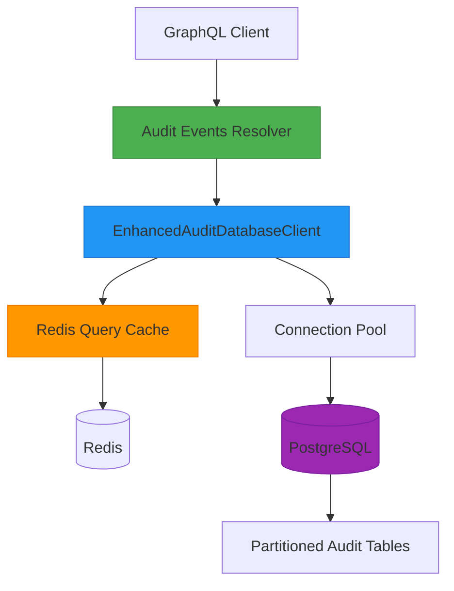

# Audit Events Resolvers

<cite>
**Referenced Files in This Document**   
- [audit-events.ts](file://apps/server/src/lib/graphql/resolvers/audit-events.ts)
- [types.ts](file://apps/server/src/lib/graphql/types.ts)
- [schema.ts](file://apps/server/src/lib/graphql/schema.ts)
- [audit-db/index.ts](file://packages/audit-db/src/index.ts)
- [enhanced-client.ts](file://packages/audit-db/src/db/enhanced-client.ts)
- [audit.ts](file://packages/audit/src/audit.ts)
- [schema.ts](file://packages/audit-db/src/db/schema.ts)
- [redis-query-cache.ts](file://packages/audit-db/src/cache/redis-query-cache.ts)
</cite>

## Table of Contents
1. [Introduction](#introduction)
2. [Core Resolver Functions](#core-resolver-functions)
3. [Data Retrieval and Caching](#data-retrieval-and-caching)
4. [Input Validation and Access Control](#input-validation-and-access-control)
5. [Response Formatting and Pagination](#response-formatting-and-pagination)
6. [Integration with Other Services](#integration-with-other-services)
7. [Performance Considerations](#performance-considerations)
8. [Usage Examples](#usage-examples)
9. [Conclusion](#conclusion)

## Introduction

The audit events resolvers provide a GraphQL interface for querying and manipulating audit event data within the system. These resolvers enable secure, efficient access to audit logs with comprehensive filtering, pagination, and sorting capabilities. The implementation leverages the audit-db package for database operations and incorporates caching mechanisms to optimize performance. The resolvers enforce strict access control, ensuring that users can only access audit events within their organization context. This documentation details the functionality of each resolver, the underlying data retrieval mechanisms, and best practices for efficient querying.

## Core Resolver Functions

The audit events resolvers implement several key functions for managing audit event data. The `auditEvents` query resolver enables flexible retrieval of audit events with support for complex filtering criteria including date ranges, principal IDs, actions, statuses, and data classifications. This resolver supports cursor-based pagination for efficient navigation through large datasets. The `auditEvent` query resolver provides direct access to individual audit events by ID with proper organization isolation. For data manipulation, the `createAuditEvent` mutation resolver allows authorized users to create new audit events, automatically enriching them with metadata such as timestamps and organization context. The `verifyAuditEvent` mutation resolver enables cryptographic verification of audit event integrity by validating the event's hash against its computed value, ensuring tamper detection. All resolvers enforce authentication and organization-based access control to maintain data security and compliance.

**Section sources**
- [audit-events.ts](file://apps/server/src/lib/graphql/resolvers/audit-events.ts#L1-L537)

## Data Retrieval and Caching

The audit events resolvers retrieve data from the audit database through the audit-db package, which provides an enhanced database client with comprehensive performance optimizations. The resolvers utilize the `executeMonitoredQuery` and `executeOptimizedQuery` methods from the enhanced client to perform database operations with built-in performance monitoring and caching. The system implements a multi-layer caching strategy using Redis as a distributed cache. The `RedisQueryCache` class manages cached query results with configurable TTL (time-to-live) and automatic cache invalidation. Each query is assigned a unique cache key generated from the query parameters using SHA-256 hashing, ensuring consistent cache lookups for identical queries. The caching mechanism significantly reduces database load for frequently accessed data patterns, particularly for common filter combinations and recent event queries. The enhanced client also integrates connection pooling, query performance monitoring, and automatic optimization based on usage patterns.

**Diagram sources **
- [audit-events.ts](file://apps/server/src/lib/graphql/resolvers/audit-events.ts#L1-L537)
- [enhanced-client.ts](file://packages/audit-db/src/db/enhanced-client.ts#L1-L655)
- [redis-query-cache.ts](file://packages/audit-db/src/cache/redis-query-cache.ts#L1-L413)

**Section sources**
- [audit-events.ts](file://apps/server/src/lib/graphql/resolvers/audit-events.ts#L1-L537)
- [enhanced-client.ts](file://packages/audit-db/src/db/enhanced-client.ts#L1-L655)
- [redis-query-cache.ts](file://packages/audit-db/src/cache/redis-query-cache.ts#L1-L413)

## Input Validation and Access Control

The audit events resolvers implement comprehensive input validation and access control mechanisms to ensure data integrity and security. All resolver functions first verify user authentication by checking the presence of a valid session in the GraphQL context. For organization-based access control, the resolvers extract the active organization ID from the session and include it as a mandatory condition in all database queries, preventing cross-organization data access. Input parameters are validated against defined types and constraints, with appropriate error handling for invalid inputs. The `auditEvents` resolver validates filter criteria, pagination parameters, and sort options before executing the query. The `createAuditEvent` mutation performs additional validation on the input data, ensuring required fields are present and values conform to expected formats. Error handling is centralized through the error service, which logs detailed error information while returning sanitized error messages to clients to prevent information leakage.

**Section sources**
- [audit-events.ts](file://apps/server/src/lib/graphql/resolvers/audit-events.ts#L1-L537)
- [types.ts](file://apps/server/src/lib/graphql/types.ts#L1-L486)

## Response Formatting and Pagination

The audit events resolvers return data in a standardized format that includes proper pagination metadata and cursor-based navigation. The `auditEvents` resolver returns an `AuditEventConnection` type containing edges, page info, and total count. Each edge includes a node (the audit event data) and a cursor for pagination. The cursors are base64-encoded offsets that enable efficient navigation through large datasets without the performance issues associated with offset-based pagination. The response includes comprehensive metadata such as total count, hasNextPage, and hasPreviousPage flags to support UI pagination controls. Audit events are converted from the database format to the GraphQL schema using the `convertDbEventToGraphQL` helper function, which maps database fields to the appropriate GraphQL types and handles optional fields. The resolver supports sorting by multiple fields including timestamp, action, status, and principal ID, with configurable sort direction. The response structure is designed to be compatible with common GraphQL client libraries and pagination patterns.

**Section sources**
- [audit-events.ts](file://apps/server/src/lib/graphql/resolvers/audit-events.ts#L1-L537)
- [types.ts](file://apps/server/src/lib/graphql/types.ts#L1-L486)

## Integration with Other Services

The audit events resolvers integrate with several other services to provide comprehensive functionality. The resolvers leverage the audit service from the audit package to create new audit events, which are then processed through a reliable event processor using BullMQ and Redis. This integration ensures guaranteed delivery and durability of audit events even during system failures. The resolvers also integrate with observability systems by logging detailed information about query execution, including performance metrics and error details. For compliance reporting, the audit events data serves as the foundation for generating HIPAA, GDPR, and other regulatory reports through the compliance service. The integrity verification functionality integrates with cryptographic services to generate and verify event hashes, ensuring data immutability. The resolvers also support real-time event streaming through GraphQL subscriptions, enabling integration with alerting and monitoring systems. These integrations create a cohesive ecosystem where audit events serve as a central data source for security, compliance, and operational visibility.

**Section sources**
- [audit-events.ts](file://apps/server/src/lib/graphql/resolvers/audit-events.ts#L1-L537)
- [audit.ts](file://packages/audit/src/audit.ts#L1-L906)

## Performance Considerations

The audit events resolvers are optimized for performance when handling large-scale event retrieval. The implementation leverages database partitioning by time (monthly partitions) to improve query performance and enable efficient data lifecycle management. Indexes are strategically created on commonly queried fields such as timestamp, principal ID, organization ID, action, and status to accelerate filter operations. The caching layer significantly reduces database load for frequently accessed queries, with cache hit ratios monitored and reported through the performance monitoring system. For large result sets, the cursor-based pagination approach avoids the performance degradation associated with high OFFSET values in traditional pagination. The enhanced database client includes automatic performance optimization features that analyze query patterns and suggest index improvements. The system also implements query cost analysis to prevent excessively expensive queries that could impact overall system performance. When retrieving large volumes of events, clients are encouraged to use specific filters and reasonable page sizes to maintain optimal performance.

**Section sources**
- [audit-events.ts](file://apps/server/src/lib/graphql/resolvers/audit-events.ts#L1-L537)
- [enhanced-client.ts](file://packages/audit-db/src/db/enhanced-client.ts#L1-L655)
- [schema.ts](file://packages/audit-db/src/db/schema.ts#L1-L661)

## Usage Examples

The audit events resolvers support various real-world usage scenarios. For security monitoring, administrators can query failed login attempts across specific time periods to detect potential brute force attacks. Compliance officers can retrieve all events related to protected health information (PHI) for HIPAA audits, filtering by data classification and action type. System administrators can monitor user activity by querying events for specific principals or resource types. The resolvers support complex filter combinations, such as finding all failed attempts to access confidential resources within the last 24 hours. For operational troubleshooting, support teams can retrieve events by correlation ID to trace the execution flow of specific operations. The integrity verification functionality enables auditors to validate the authenticity of specific events, generating cryptographic proof of data integrity. These examples demonstrate the flexibility and power of the audit events resolvers in supporting security, compliance, and operational use cases.

**Section sources**
- [audit-events.ts](file://apps/server/src/lib/graphql/resolvers/audit-events.ts#L1-L537)
- [schema.ts](file://apps/server/src/lib/graphql/schema.ts#L1-L660)

## Conclusion

The audit events resolvers provide a robust, secure, and performant interface for accessing and managing audit event data. By leveraging the audit-db package's advanced features including connection pooling, query caching, and performance monitoring, the resolvers deliver efficient data retrieval even at scale. The comprehensive filtering, pagination, and sorting capabilities enable flexible querying patterns to support various use cases from security monitoring to compliance reporting. The integration with cryptographic services ensures data integrity and tamper detection, while the access control mechanisms maintain data isolation between organizations. The resolvers follow GraphQL best practices with proper error handling, response formatting, and subscription support. For optimal performance, clients should leverage caching by using consistent query parameters, apply specific filters to limit result sets, and use cursor-based pagination for navigating large datasets.