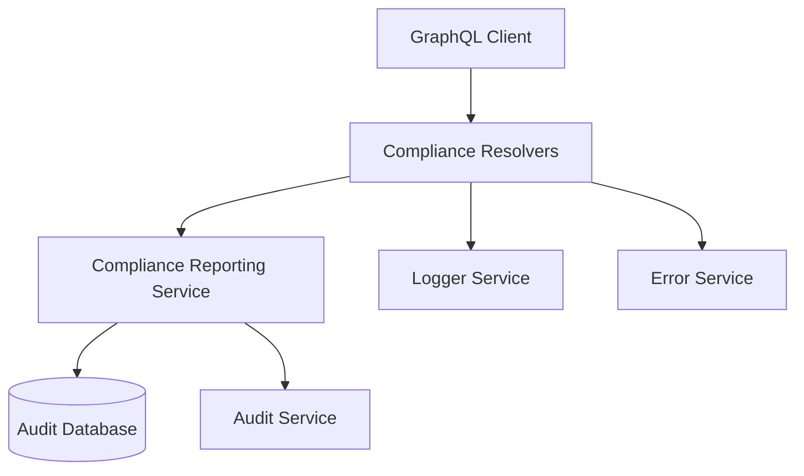
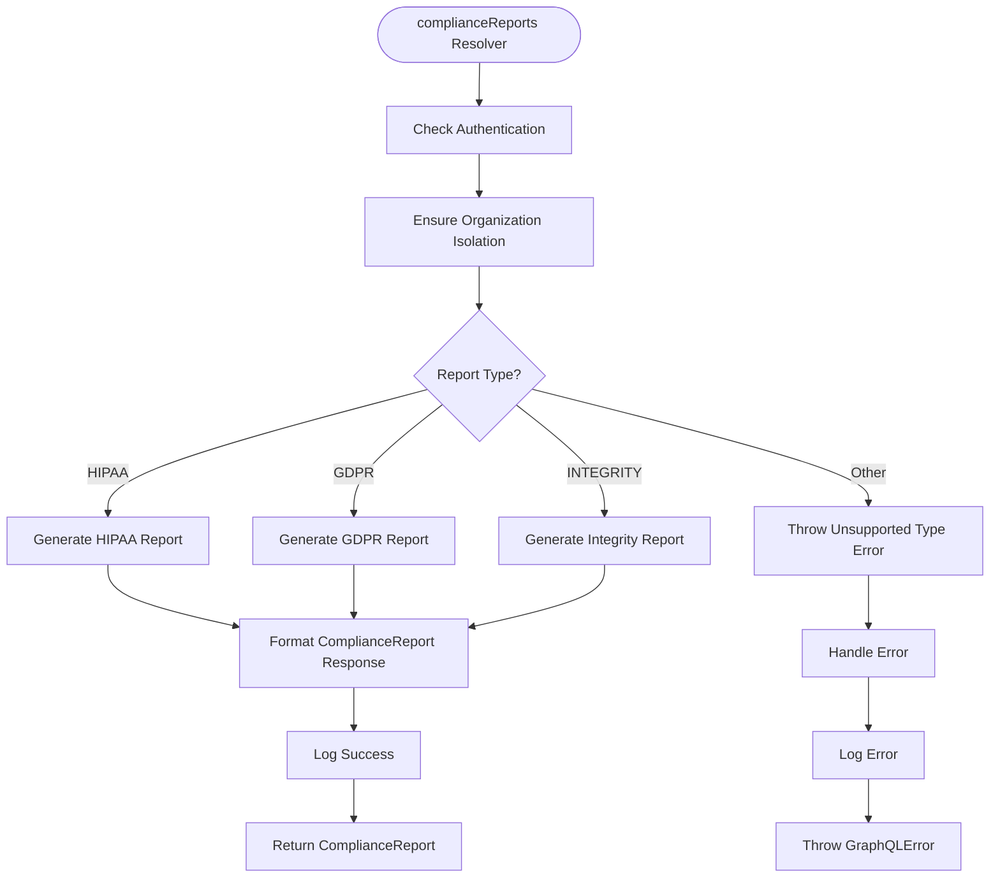
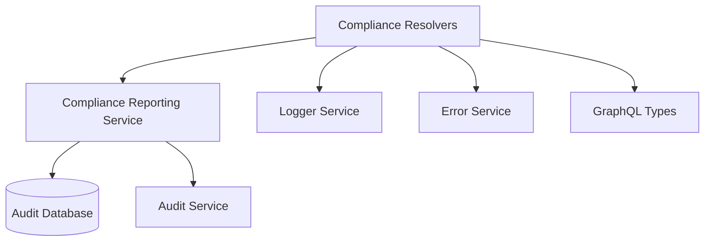

# Compliance Resolvers

<cite>
**Referenced Files in This Document**   
- [compliance.ts](file://apps/server/src/lib/graphql/resolvers/compliance.ts)
- [compliance-reporting.ts](file://packages/audit/src/report/compliance-reporting.ts)
- [types.ts](file://apps/server/src/lib/graphql/types.ts)
</cite>

## Table of Contents
1. [Introduction](#introduction)
2. [Core Components](#core-components)
3. [Architecture Overview](#architecture-overview)
4. [Detailed Component Analysis](#detailed-component-analysis)
5. [Dependency Analysis](#dependency-analysis)
6. [Performance Considerations](#performance-considerations)
7. [Troubleshooting Guide](#troubleshooting-guide)
8. [Conclusion](#conclusion)

## Introduction
The Compliance Resolvers module provides a GraphQL interface for generating compliance reports based on audit data. It supports multiple compliance frameworks including HIPAA, GDPR, and integrity verification. The resolvers validate audit data against compliance rules, generate compliance statuses, and interact with the compliance reporting module in the audit package. This documentation details each resolver function, their interactions, error handling mechanisms, and usage patterns.

## Core Components
The compliance resolvers are implemented in the `compliance.ts` file and provide a GraphQL interface for compliance reporting. The main resolver function is `complianceReports`, which handles the generation of compliance reports based on the specified type and criteria. The resolver interacts with the compliance reporting service to generate reports for different compliance frameworks.

**Section sources**
- [compliance.ts](file://apps/server/src/lib/graphql/resolvers/compliance.ts#L1-L136)

## Architecture Overview
The compliance resolvers follow a layered architecture where the GraphQL resolvers serve as the entry point, delegating the actual report generation to the compliance reporting service in the audit package. The resolvers handle authentication, organization isolation, and error handling, while the reporting service handles the business logic of generating compliance reports.

**Diagram sources**
- [compliance.ts](file://apps/server/src/lib/graphql/resolvers/compliance.ts#L1-L136)
- [compliance-reporting.ts](file://packages/audit/src/report/compliance-reporting.ts#L1-L952)

## Detailed Component Analysis

### Compliance Resolvers Analysis
The compliance resolvers provide a GraphQL interface for generating compliance reports. The main resolver function is `complianceReports`, which takes a report type and criteria as input and returns a compliance report.

#### Resolver Function
The `complianceReports` resolver function handles the generation of compliance reports. It first checks authentication, ensures organization isolation in the criteria, and then delegates the report generation to the appropriate method based on the report type.

**Diagram sources**
- [compliance.ts](file://apps/server/src/lib/graphql/resolvers/compliance.ts#L15-L136)

#### Error Handling
The resolver implements comprehensive error handling, catching both GraphQL errors and general errors. For non-GraphQL errors, it logs the error, reports it to the error service, and throws a GraphQL error with an internal error code.

**Section sources**
- [compliance.ts](file://apps/server/src/lib/graphql/resolvers/compliance.ts#L75-L136)

## Dependency Analysis
The compliance resolvers have dependencies on several services and types. They depend on the compliance reporting service for generating reports, the logger service for logging, and the error service for error handling. They also depend on GraphQL types for input and output.

**Diagram sources**
- [compliance.ts](file://apps/server/src/lib/graphql/resolvers/compliance.ts#L1-L136)
- [compliance-reporting.ts](file://packages/audit/src/report/compliance-reporting.ts#L1-L952)

## Performance Considerations
The compliance resolvers are designed to handle large volumes of audit data efficiently. The reporting service uses database queries with appropriate filtering and pagination to retrieve audit events. The resolvers also include logging of performance metrics such as the number of events processed.

## Troubleshooting Guide
Common issues with the compliance resolvers include authentication failures, unsupported report types, and database query failures. Authentication failures result in an UNAUTHENTICATED error, while unsupported report types result in a BAD_REQUEST error. Database query failures are logged and result in an INTERNAL_ERROR error.

**Section sources**
- [compliance.ts](file://apps/server/src/lib/graphql/resolvers/compliance.ts#L75-L136)

## Conclusion
The compliance resolvers provide a robust GraphQL interface for generating compliance reports. They support multiple compliance frameworks and include comprehensive error handling and logging. The resolvers follow a clean architecture with clear separation of concerns between the GraphQL interface and the business logic in the reporting service.