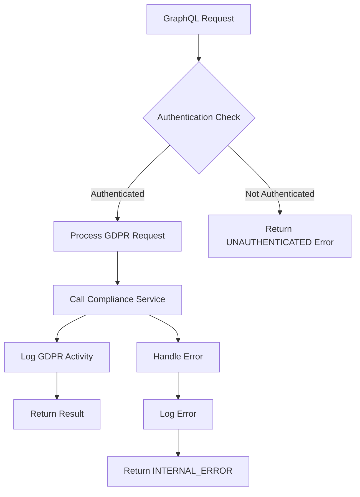
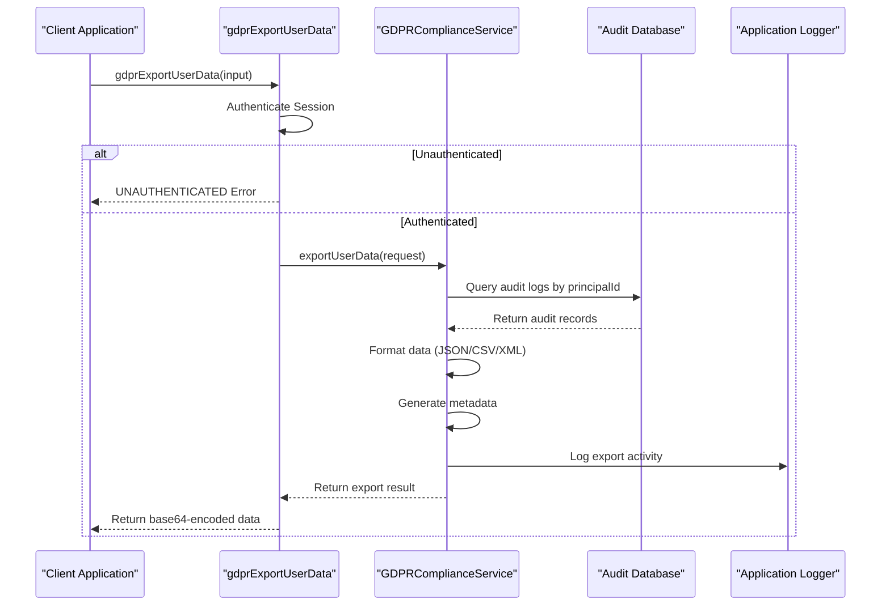
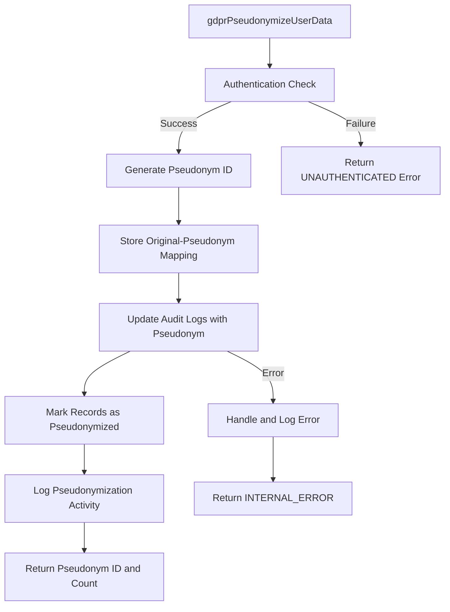
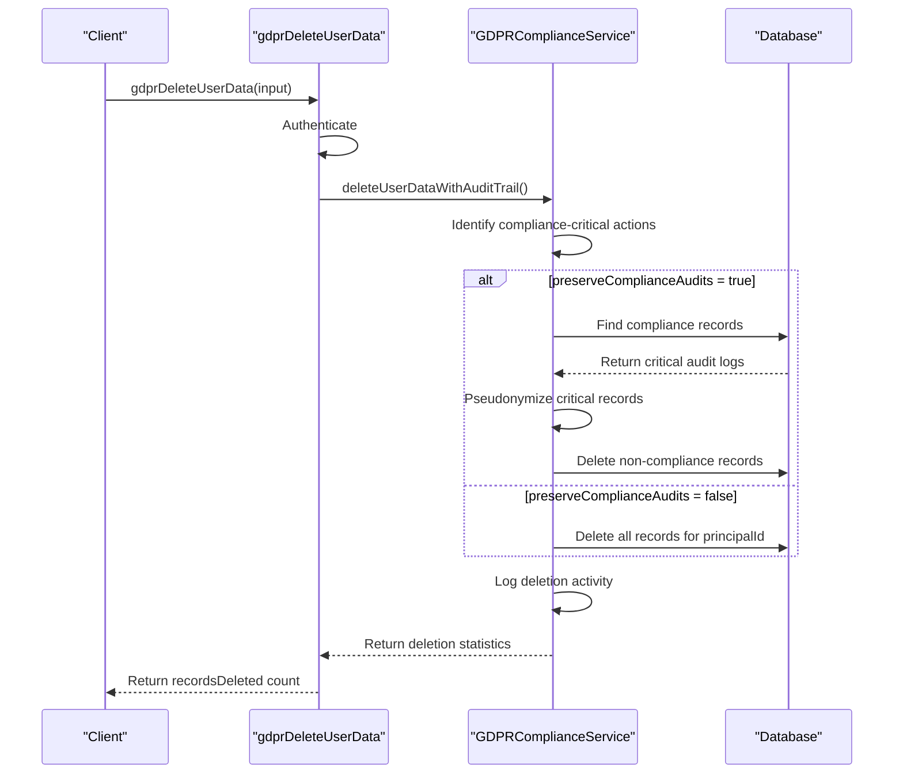
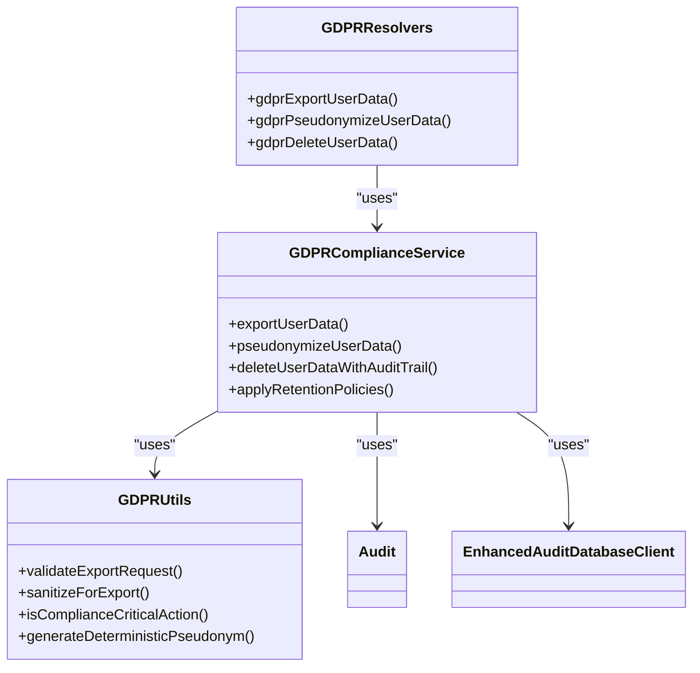
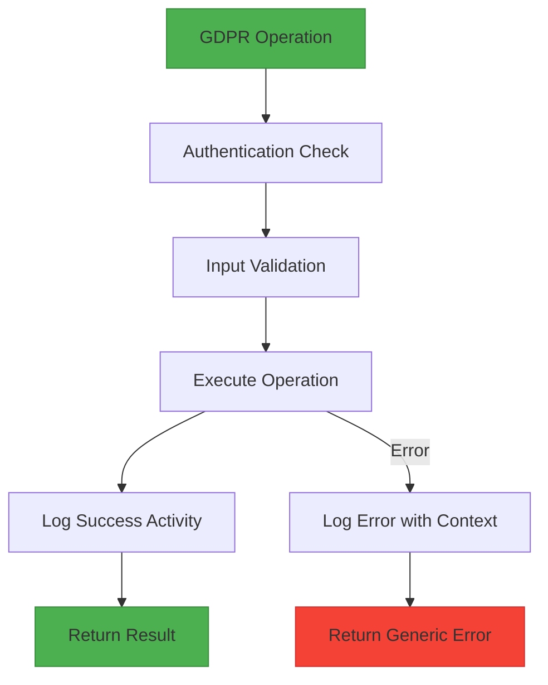

# GDPR Resolvers

<cite>
**Referenced Files in This Document**   
- [gdpr.ts](file://apps/server/src/lib/graphql/resolvers/gdpr.ts)
- [gdpr-compliance.ts](file://packages/audit/src/gdpr/gdpr-compliance.ts)
- [gdpr-utils.ts](file://packages/audit/src/gdpr/gdpr-utils.ts)
- [types.ts](file://apps/server/src/lib/graphql/types.ts)
</cite>

## Table of Contents
1. [Introduction](#introduction)
2. [Core GDPR Resolver Functions](#core-gdpr-resolver-functions)
3. [Data Export Implementation](#data-export-implementation)
4. [Pseudonymization Workflow](#pseudonymization-workflow)
5. [Data Deletion with Audit Trail](#data-deletion-with-audit-trail)
6. [Integration with GDPR Compliance Module](#integration-with-gdpr-compliance-module)
7. [Data Anonymization and Processing](#data-anonymization-and-processing)
8. [Audit Logging and Security Safeguards](#audit-logging-and-security-safeguards)
9. [Resolver Usage Examples](#resolver-usage-examples)
10. [Data Export Formats](#data-export-formats)

## Introduction
The GDPR resolvers provide a GraphQL interface for handling data subject rights requests in compliance with General Data Protection Regulation (GDPR) requirements. These resolvers implement the right to access, rectification, erasure, and data portability through secure, audited operations. The system integrates with the gdpr-compliance module to ensure proper handling of personal data while maintaining necessary audit trails for compliance purposes. All operations include authentication checks, comprehensive logging, and error handling to ensure data privacy and regulatory compliance.

## Core GDPR Resolver Functions
The GDPR resolvers implement three primary mutation operations for handling data subject rights requests: data export, pseudonymization, and deletion. Each resolver function enforces authentication requirements and integrates with the underlying gdpr-compliance service to execute GDPR-compliant operations.



**Diagram sources**
- [gdpr.ts](file://apps/server/src/lib/graphql/resolvers/gdpr.ts#L1-L246)

**Section sources**
- [gdpr.ts](file://apps/server/src/lib/graphql/resolvers/gdpr.ts#L1-L246)

## Data Export Implementation
The `gdprExportUserData` resolver implements the right to data access and portability by exporting a data subject's audit records in a portable format. The resolver accepts input parameters including the principal ID, export format, date range, and metadata inclusion preferences.



**Diagram sources**
- [gdpr.ts](file://apps/server/src/lib/graphql/resolvers/gdpr.ts#L30-L100)
- [gdpr-compliance.ts](file://packages/audit/src/gdpr/gdpr-compliance.ts#L118-L178)

**Section sources**
- [gdpr.ts](file://apps/server/src/lib/graphql/resolvers/gdpr.ts#L30-L100)
- [gdpr-compliance.ts](file://packages/audit/src/gdpr/gdpr-compliance.ts#L118-L178)

## Pseudonymization Workflow
The `gdprPseudonymizeUserData` resolver implements data minimization and privacy by design principles by allowing pseudonymization of personal data. This operation replaces identifiable information with pseudonyms while maintaining referential integrity through mapping storage.



**Diagram sources**
- [gdpr.ts](file://apps/server/src/lib/graphql/resolvers/gdpr.ts#L105-L150)
- [gdpr-compliance.ts](file://packages/audit/src/gdpr/gdpr-compliance.ts#L180-L220)

**Section sources**
- [gdpr.ts](file://apps/server/src/lib/graphql/resolvers/gdpr.ts#L105-L150)
- [gdpr-compliance.ts](file://packages/audit/src/gdpr/gdpr-compliance.ts#L180-L220)

## Data Deletion with Audit Trail
The `gdprDeleteUserData` resolver implements the right to erasure ("right to be forgotten") while preserving compliance-critical audit trails. The resolver provides an option to preserve compliance audits, ensuring regulatory requirements are met while removing personal data.



**Diagram sources**
- [gdpr.ts](file://apps/server/src/lib/graphql/resolvers/gdpr.ts#L155-L200)
- [gdpr-compliance.ts](file://packages/audit/src/gdpr/gdpr-compliance.ts#L380-L450)

**Section sources**
- [gdpr.ts](file://apps/server/src/lib/graphql/resolvers/gdpr.ts#L155-L200)
- [gdpr-compliance.ts](file://packages/audit/src/gdpr/gdpr-compliance.ts#L380-L450)

## Integration with GDPR Compliance Module
The GDPR resolvers integrate with the gdpr-compliance module in the audit package to ensure consistent implementation of GDPR policies across the system. This integration provides a unified interface for data subject rights requests while maintaining separation of concerns between the GraphQL API layer and compliance logic.



**Diagram sources**
- [gdpr.ts](file://apps/server/src/lib/graphql/resolvers/gdpr.ts#L1-L246)
- [gdpr-compliance.ts](file://packages/audit/src/gdpr/gdpr-compliance.ts#L1-L685)
- [gdpr-utils.ts](file://packages/audit/src/gdpr/gdpr-utils.ts#L1-L295)

**Section sources**
- [gdpr.ts](file://apps/server/src/lib/graphql/resolvers/gdpr.ts#L1-L246)
- [gdpr-compliance.ts](file://packages/audit/src/gdpr/gdpr-compliance.ts#L1-L685)

## Data Anonymization and Processing
The system implements multiple data anonymization strategies through the pseudonymization feature, allowing organizations to choose the appropriate method based on their security requirements and use cases. The GDPR compliance service maintains a mapping between original identifiers and pseudonyms to ensure referential integrity while protecting personal data.

### Pseudonymization Strategies
The system supports three pseudonymization strategies:

| Strategy | Description | Use Case |
|---------|-----------|---------|
| hash | Deterministic hashing of original ID with salt | When consistent pseudonymization is required across systems |
| token | Random token generation | When non-deterministic pseudonymization is preferred |
| encryption | Base64 encoding of original ID | When reversible pseudonymization is needed (placeholder for actual encryption) |

The pseudonymization process ensures that audit trails remain intact while personal data is protected, allowing for compliance investigations when necessary through authorized access to the original identifier mappings.

**Section sources**
- [gdpr-compliance.ts](file://packages/audit/src/gdpr/gdpr-compliance.ts#L550-L580)
- [gdpr-utils.ts](file://packages/audit/src/gdpr/gdpr-utils.ts#L5-L45)

## Audit Logging and Security Safeguards
All GDPR operations are comprehensively logged to maintain an audit trail of data subject rights requests. The system implements multiple security safeguards to protect personal data and ensure compliance with regulatory requirements.

### Security Features
- **Authentication Enforcement**: All resolver functions require authenticated sessions
- **Input Validation**: Request parameters are validated before processing
- **Error Handling**: Errors are logged with context but generic messages returned to clients
- **Audit Trail**: All GDPR operations are recorded as audit events
- **Data Protection**: Sensitive system fields are removed from exported data

The audit logging system captures key details of each GDPR operation, including the requester, target principal, operation type, and outcome, providing a complete record for compliance purposes.



**Diagram sources**
- [gdpr.ts](file://apps/server/src/lib/graphql/resolvers/gdpr.ts#L30-L246)
- [gdpr-compliance.ts](file://packages/audit/src/gdpr/gdpr-compliance.ts#L650-L685)

**Section sources**
- [gdpr.ts](file://apps/server/src/lib/graphql/resolvers/gdpr.ts#L30-L246)
- [gdpr-compliance.ts](file://packages/audit/src/gdpr/gdpr-compliance.ts#L650-L685)

## Resolver Usage Examples
The GDPR resolvers can be used through GraphQL mutations to handle data subject rights requests. The following examples demonstrate typical usage patterns for each resolver function.

### Data Export Example
```graphql
mutation {
  gdprExportUserData(input: {
    principalId: "user-123"
    format: json
    dateRange: {
      startDate: "2023-01-01T00:00:00Z"
      endDate: "2023-12-31T23:59:59Z"
    }
    includeMetadata: true
  }) {
    requestId
    recordCount
    dataSize
    format
    exportTimestamp
    metadata {
      dateRange {
        start
        end
      }
      categories
      retentionPolicies
      exportedBy
    }
    data
  }
}
```

### Pseudonymization Example
```graphql
mutation {
  gdprPseudonymizeUserData(input: {
    principalId: "user-123"
    strategy: hash
  }) {
    pseudonymId
    recordsAffected
    timestamp
  }
}
```

### Data Deletion Example
```graphql
mutation {
  gdprDeleteUserData(input: {
    principalId: "user-123"
    preserveComplianceAudits: true
  }) {
    recordsDeleted
    complianceRecordsPreserved
    timestamp
  }
}
```

**Section sources**
- [gdpr.ts](file://apps/server/src/lib/graphql/resolvers/gdpr.ts#L30-L200)
- [types.ts](file://apps/server/src/lib/graphql/types.ts#L446-L484)

## Data Export Formats
The system supports multiple data export formats to accommodate different data portability requirements. Users can request data in JSON, CSV, or XML formats depending on their needs.

### Format Characteristics
| Format | Advantages | Limitations |
|-------|-----------|-----------|
| JSON | Native to web applications, preserves complex data structures | May be less accessible to non-technical users |
| CSV | Widely supported by spreadsheet applications, human-readable | Limited support for nested data structures |
| XML | Standardized format with schema support, hierarchical data representation | Verbose, larger file sizes |

The export process includes sanitization of data by removing internal system fields such as hash values, signatures, and performance metrics to ensure only relevant personal data is included in the export.

**Section sources**
- [gdpr-compliance.ts](file://packages/audit/src/gdpr/gdpr-compliance.ts#L585-L645)
- [types.ts](file://apps/server/src/lib/graphql/types.ts#L446-L448)