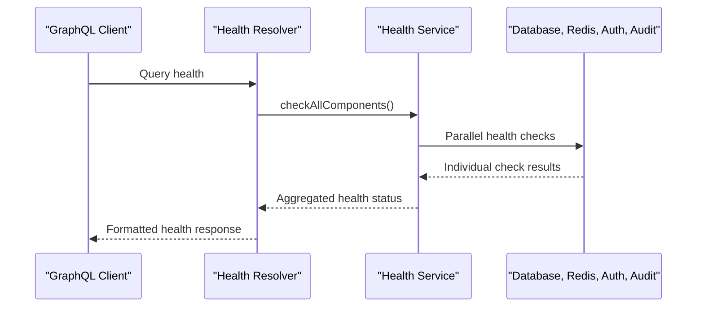
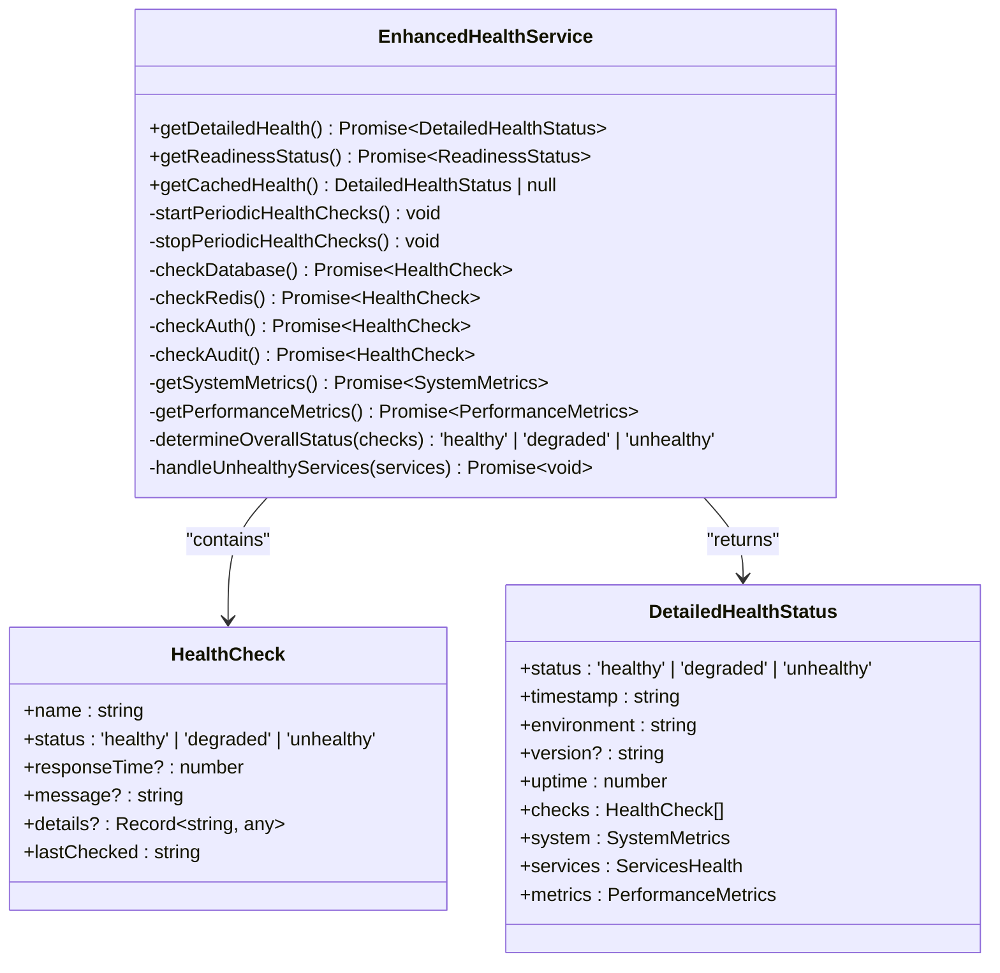
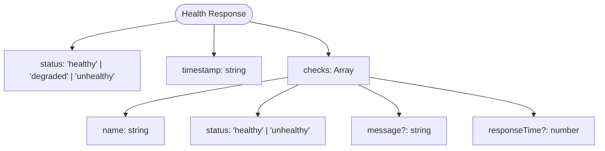
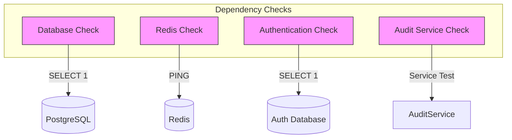
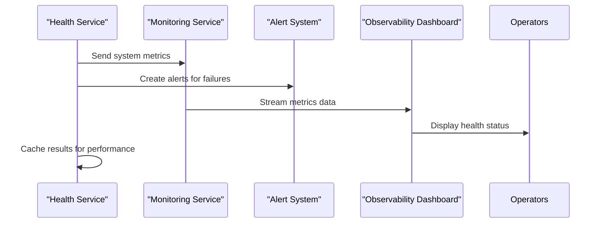
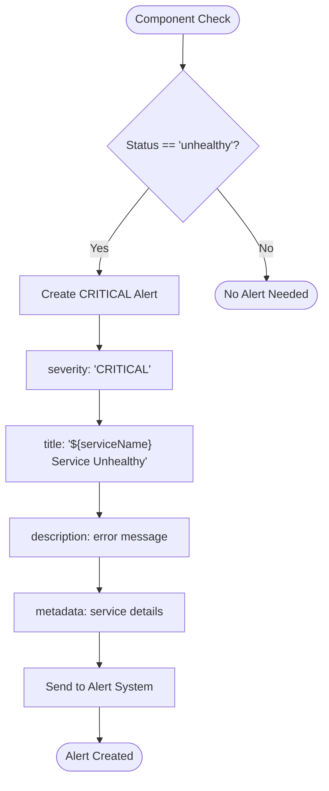

# Health Resolvers

<cite>
**Referenced Files in This Document**   
- [health.ts](file://apps/server/src/lib/graphql/resolvers/health.ts)
- [health.ts](file://apps/server/src/lib/services/health.ts)
- [types.ts](file://apps/server/src/lib/graphql/types.ts)
- [health.ts](file://apps/server/src/routers/health.ts)
- [health.ts](file://packages/audit-client/src/services/health.ts)
</cite>

## Table of Contents
1. [Introduction](#introduction)
2. [Core Components](#core-components)
3. [Health Resolver Function](#health-resolver-function)
4. [Health Service Implementation](#health-service-implementation)
5. [Response Structure](#response-structure)
6. [Dependency Checks](#dependency-checks)
7. [Integration with Monitoring Systems](#integration-with-monitoring-systems)
8. [Alerting and Failover Mechanisms](#alerting-and-failover-mechanisms)
9. [Usage Examples](#usage-examples)
10. [Conclusion](#conclusion)

## Introduction
The health resolvers in the system provide comprehensive monitoring capabilities for assessing the operational status of various components and dependencies. These resolvers enable both basic and detailed health checks through multiple interfaces including GraphQL, REST, and tRPC. The system is designed to support Kubernetes readiness/liveness probes, real-time monitoring, and alerting mechanisms to ensure high availability and reliability.

## Core Components

The health monitoring system consists of several key components working together to provide a complete health assessment solution:

- **GraphQL Resolver**: Exposes health status through GraphQL queries
- **Health Service**: Core implementation that performs component checks
- **Router Endpoints**: Provides REST and tRPC access to health information
- **Client SDK**: Enables external systems to interact with health monitoring

**Section sources**
- [health.ts](file://apps/server/src/lib/graphql/resolvers/health.ts)
- [health.ts](file://apps/server/src/lib/services/health.ts)
- [health.ts](file://apps/server/src/routers/health.ts)

## Health Resolver Function

The primary health resolver function is implemented in the GraphQL layer and serves as one of the main entry points for health status queries. It orchestrates the collection of health information from various components and formats the response according to the defined schema.



**Diagram sources**
- [health.ts](file://apps/server/src/lib/graphql/resolvers/health.ts#L15-L68)
- [health.ts](file://apps/server/src/lib/services/health.ts#L15-L625)

**Section sources**
- [health.ts](file://apps/server/src/lib/graphql/resolvers/health.ts#L15-L68)

## Health Service Implementation

The EnhancedHealthService class provides the core implementation for health monitoring with comprehensive capabilities including periodic checks, system metrics collection, and alert generation. The service performs parallel health checks on all registered components and aggregates the results to determine overall system status.

Key features of the health service include:
- Periodic health checks every 30 seconds
- Parallel execution of component checks
- System resource monitoring (memory, CPU)
- Performance metrics integration
- Alert creation for unhealthy services



**Diagram sources**
- [health.ts](file://apps/server/src/lib/services/health.ts#L15-L625)

**Section sources**
- [health.ts](file://apps/server/src/lib/services/health.ts#L15-L625)

## Response Structure

The health resolver returns a structured response that provides detailed information about the system's health status. The response includes both high-level status indicators and detailed component information.

### Health Status Response
The health status response follows a standardized structure with the following properties:

| Property | Type | Description |
|--------|------|-------------|
| status | string | Overall system status: 'healthy', 'degraded', or 'unhealthy' |
| timestamp | string | ISO timestamp of when the check was performed |
| checks | Array | Individual component check results |
| checks.name | string | Name of the component being checked |
| checks.status | string | Component status: 'healthy' or 'unhealthy' |
| checks.message | string | Optional message describing the check result |
| checks.responseTime | number | Response time in milliseconds |



**Diagram sources**
- [types.ts](file://apps/server/src/lib/graphql/types.ts#L430-L445)
- [health.ts](file://apps/server/src/lib/graphql/resolvers/health.ts#L15-L68)

**Section sources**
- [types.ts](file://apps/server/src/lib/graphql/types.ts#L430-L445)

## Dependency Checks

The health system performs comprehensive checks on critical dependencies to ensure all required services are operational. These checks are executed in parallel to minimize the overall response time.

### Component Health Checks
The system monitors the following key components:

- **Database**: Checks connection to the audit database with a simple query
- **Redis**: Verifies Redis connectivity using the PING command
- **Authentication**: Validates connection to the authentication database
- **Audit Service**: Tests the core audit service functionality

Each component check includes:
- Response time measurement
- Status determination (healthy/unhealthy)
- Detailed error information when applicable
- Last check timestamp



**Diagram sources**
- [health.ts](file://apps/server/src/lib/services/health.ts#L200-L350)

**Section sources**
- [health.ts](file://apps/server/src/lib/services/health.ts#L200-L350)

## Integration with Monitoring Systems

The health resolvers are tightly integrated with the system's monitoring infrastructure to provide observability and enable proactive issue detection. The integration includes both data collection and alerting capabilities.

### Monitoring Data Flow
The health service collects various metrics that are used for system observability:

- System resource utilization (memory, CPU)
- Performance metrics (requests per second, error rate)
- Connection pool statistics
- External service dependencies



**Diagram sources**
- [health.ts](file://apps/server/src/lib/services/health.ts#L350-L400)
- [health.ts](file://apps/server/src/lib/services/health.ts#L580-L623)

**Section sources**
- [health.ts](file://apps/server/src/lib/services/health.ts#L350-L400)

## Alerting and Failover Mechanisms

The health system includes robust alerting capabilities that trigger when components become unhealthy. These alerts are integrated with the system's notification infrastructure to ensure timely response to issues.

### Alert Generation Process
When a component check fails, the system automatically creates a critical alert with detailed information:

- Alert severity is set to 'CRITICAL'
- Descriptive title based on the failed component
- Detailed description including error messages
- Metadata with service name and response time
- Automatic assignment to the health-monitor source

The system also supports failover mechanisms through Kubernetes readiness probes, which can remove unhealthy instances from the load balancing pool.



**Diagram sources**
- [health.ts](file://apps/server/src/lib/services/health.ts#L580-L623)

**Section sources**
- [health.ts](file://apps/server/src/lib/services/health.ts#L580-L623)

## Usage Examples

The health resolvers can be accessed through multiple interfaces, providing flexibility for different use cases.

### GraphQL Query Example
```graphql
query GetHealthStatus {
  health {
    status
    timestamp
    checks {
      name
      status
      message
      responseTime
    }
  }
}
```

### REST API Usage
The system also exposes health endpoints through REST APIs for integration with load balancers and monitoring tools:
- `GET /health` - Basic health check
- `GET /health/detailed` - Comprehensive health status
- `GET /health/ready` - Readiness probe for Kubernetes

### Client SDK Usage
The audit-client package provides a convenient interface for interacting with health monitoring:

```typescript
const healthService = new HealthService(config);
const status = await healthService.check();
const systemInfo = await healthService.getSystemInfo();
const connectivity = await healthService.testConnectivity(['database', 'redis']);
```

**Section sources**
- [health.ts](file://apps/server/src/lib/graphql/resolvers/health.ts#L15-L68)
- [health.ts](file://apps/server/src/routers/health.ts#L5-L64)
- [health.ts](file://packages/audit-client/src/services/health.ts#L181-L227)

## Conclusion
The health resolvers provide a comprehensive solution for monitoring system health and service availability. By combining GraphQL, REST, and tRPC interfaces with robust dependency checking and alerting capabilities, the system ensures high availability and enables proactive issue detection. The integration with monitoring systems and support for Kubernetes probes makes it suitable for production environments requiring high reliability and observability.