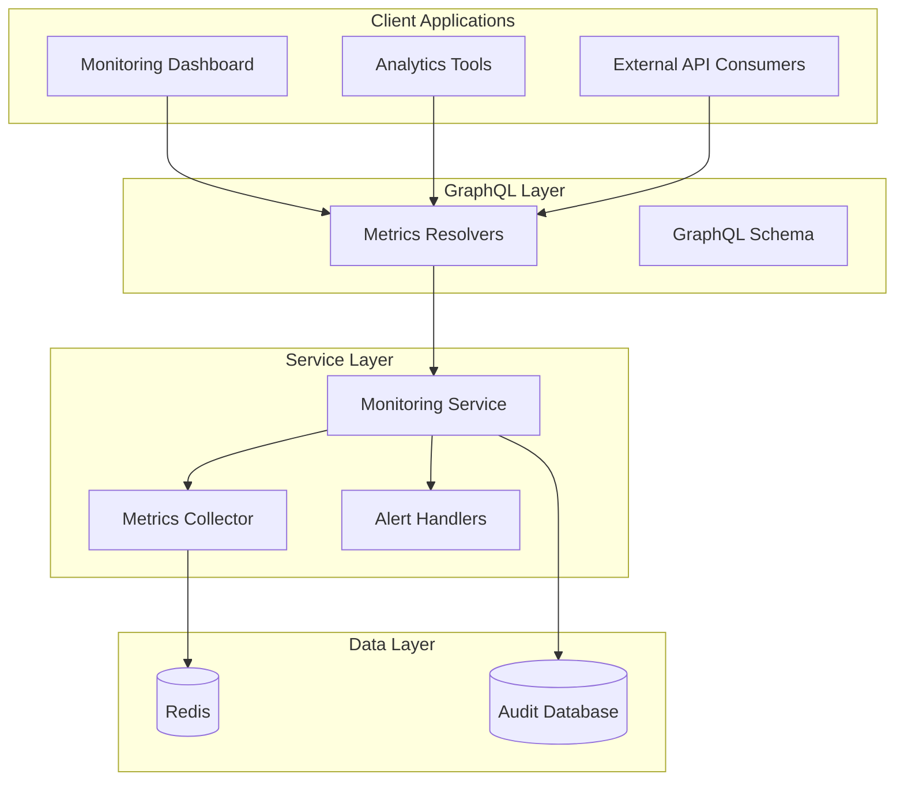
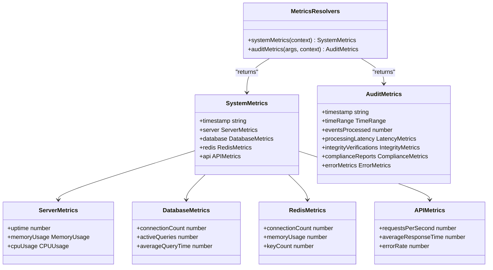
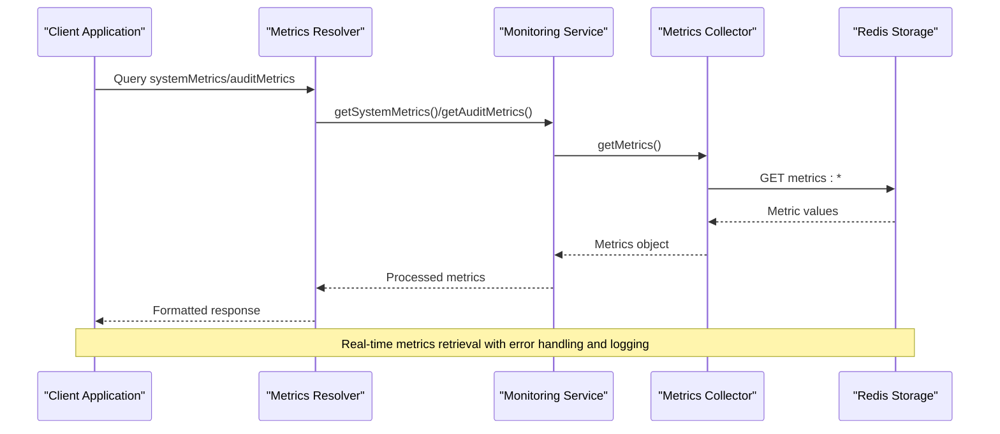
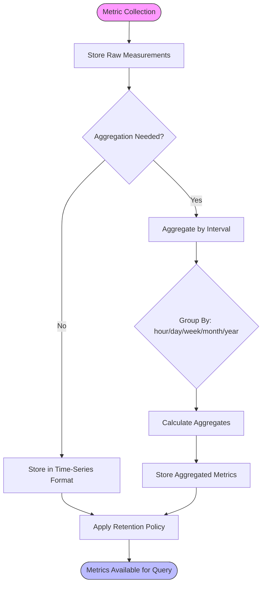
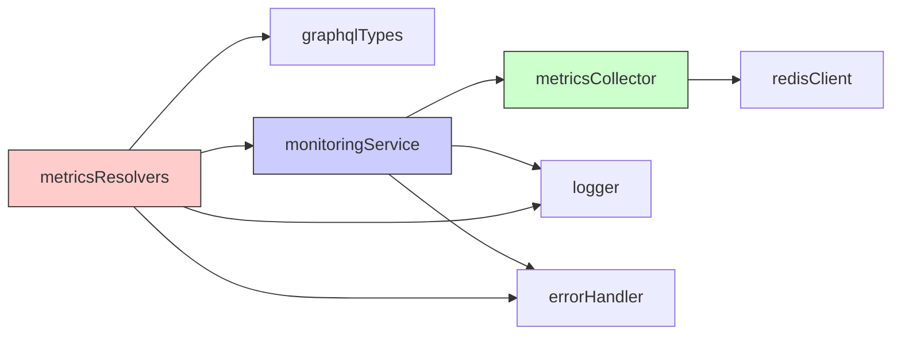

# Metrics Resolvers

<cite>
**Referenced Files in This Document**   
- [metrics.ts](file://apps/server/src/lib/graphql/resolvers/metrics.ts)
- [types.ts](file://apps/server/src/lib/graphql/types.ts)
- [metrics-collector.ts](file://packages/audit/src/monitor/metrics-collector.ts)
- [monitoring-types.ts](file://packages/audit/src/monitor/monitoring-types.ts)
- [monitoring.ts](file://packages/audit/src/monitor/monitoring.ts)
</cite>

## Table of Contents
1. [Introduction](#introduction)
2. [Core Components](#core-components)
3. [Architecture Overview](#architecture-overview)
4. [Detailed Component Analysis](#detailed-component-analysis)
5. [Dependency Analysis](#dependency-analysis)
6. [Performance Considerations](#performance-considerations)
7. [Troubleshooting Guide](#troubleshooting-guide)
8. [Conclusion](#conclusion)

## Introduction
The Metrics Resolvers system provides comprehensive monitoring and analytics capabilities for the audit logging platform. It enables retrieval of both system-level operational metrics and audit-specific business metrics through GraphQL resolvers. The system aggregates data from multiple sources including audit logs, event processors, and application instrumentation to support real-time analytics, reporting, and integration with monitoring dashboards. This documentation details the resolver functions, data aggregation mechanisms, time-series handling, and integration capabilities that form the foundation of the platform's observability framework.

## Core Components

The metrics system consists of several interconnected components that work together to collect, process, and expose metrics data. The primary components include the GraphQL resolvers that serve as the API endpoints, the metrics collector that handles data storage and retrieval, and the monitoring service that orchestrates metric collection from various system components. These components work in concert to provide both real-time and historical metric data with support for various aggregation intervals and filtering options.

**Section sources**
- [metrics.ts](file://apps/server/src/lib/graphql/resolvers/metrics.ts#L1-L189)
- [monitoring.ts](file://packages/audit/src/monitor/monitoring.ts#L1-L1399)

## Architecture Overview

**Diagram sources**
- [metrics.ts](file://apps/server/src/lib/graphql/resolvers/metrics.ts#L1-L189)
- [monitoring.ts](file://packages/audit/src/monitor/monitoring.ts#L1-L1399)
- [metrics-collector.ts](file://packages/audit/src/monitor/metrics-collector.ts#L1-L386)

## Detailed Component Analysis

### Metrics Resolvers Analysis

The metrics resolvers provide two primary query endpoints: `systemMetrics` and `auditMetrics`. The `systemMetrics` resolver retrieves operational metrics about the server environment including CPU usage, memory consumption, database connections, and API performance. The `auditMetrics` resolver provides business-oriented metrics related to audit event processing, integrity verification, compliance reporting, and error rates. Both resolvers implement comprehensive error handling and logging to ensure reliability and traceability.

#### Resolver Functions

**Diagram sources**
- [metrics.ts](file://apps/server/src/lib/graphql/resolvers/metrics.ts#L1-L189)
- [types.ts](file://apps/server/src/lib/graphql/types.ts#L1-L486)

#### Metrics Collection Flow

**Diagram sources**
- [metrics.ts](file://apps/server/src/lib/graphql/resolvers/metrics.ts#L1-L189)
- [monitoring.ts](file://packages/audit/src/monitor/monitoring.ts#L1-L1399)
- [metrics-collector.ts](file://packages/audit/src/monitor/metrics-collector.ts#L1-L386)

### Time-Series Data Handling

The metrics system implements robust time-series data handling capabilities that support various aggregation intervals and filtering options. Metrics are collected and stored with timestamps, enabling historical analysis and trend identification. The system supports multiple time range presets (1h, 6h, 24h, 7d, 30d) as well as custom date ranges, allowing users to analyze data at different granularities.

#### Time-Series Aggregation

**Diagram sources**
- [monitoring.ts](file://packages/audit/src/monitor/monitoring.ts#L1-L1399)
- [metrics-collector.ts](file://packages/audit/src/monitor/metrics-collector.ts#L1-L386)

## Dependency Analysis

**Diagram sources**
- [metrics.ts](file://apps/server/src/lib/graphql/resolvers/metrics.ts#L1-L189)
- [monitoring.ts](file://packages/audit/src/monitor/monitoring.ts#L1-L1399)
- [metrics-collector.ts](file://packages/audit/src/monitor/metrics-collector.ts#L1-L386)
- [types.ts](file://apps/server/src/lib/graphql/types.ts#L1-L486)

**Section sources**
- [metrics.ts](file://apps/server/src/lib/graphql/resolvers/metrics.ts#L1-L189)
- [monitoring.ts](file://packages/audit/src/monitor/monitoring.ts#L1-L1399)
- [metrics-collector.ts](file://packages/audit/src/monitor/metrics-collector.ts#L1-L386)

## Performance Considerations

The metrics system is designed with performance and scalability in mind. Metrics collection is optimized to minimize overhead on the main application flow, with asynchronous operations where possible. The use of Redis as the primary storage backend ensures low-latency access to metrics data, supporting real-time analytics requirements. The system implements efficient data structures and algorithms for metric aggregation, with time complexity considerations for large datasets. Caching strategies are employed to reduce database load and improve response times for frequently accessed metrics.

## Troubleshooting Guide

When encountering issues with metrics retrieval or reporting, consider the following common scenarios and their solutions:

**Section sources**
- [metrics.ts](file://apps/server/src/lib/graphql/resolvers/metrics.ts#L1-L189)
- [monitoring.ts](file://packages/audit/src/monitor/monitoring.ts#L1-L1399)
- [metrics-collector.ts](file://packages/audit/src/monitor/metrics-collector.ts#L1-L386)

## Conclusion

The Metrics Resolvers system provides a comprehensive solution for monitoring and analytics in the audit logging platform. By exposing both operational and business metrics through a well-defined GraphQL API, it enables real-time visibility into system performance and compliance status. The architecture leverages Redis for efficient metrics storage and retrieval, supporting time-series analysis with various aggregation intervals and filtering options. Integration with monitoring dashboards and visualization tools allows for effective data presentation and alerting. The system's design prioritizes reliability, performance, and ease of use, making it a valuable component for maintaining system health and meeting compliance requirements.