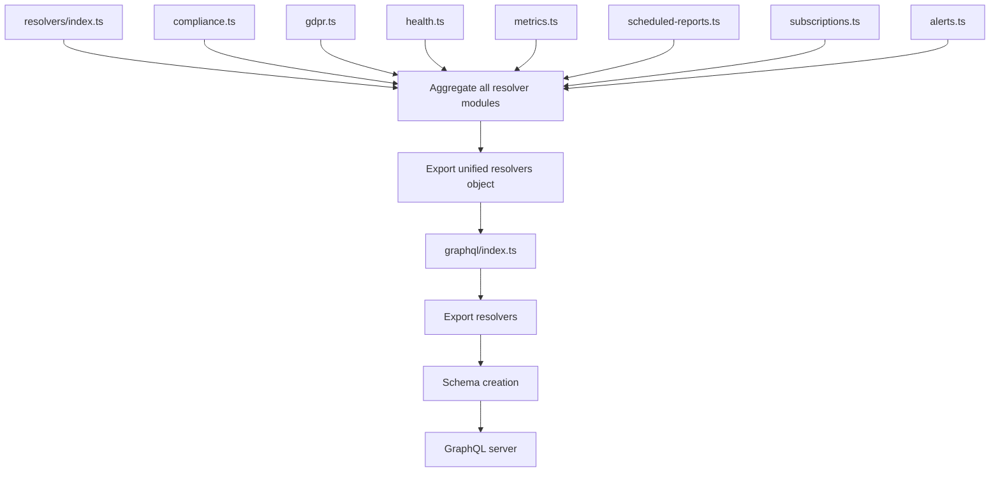
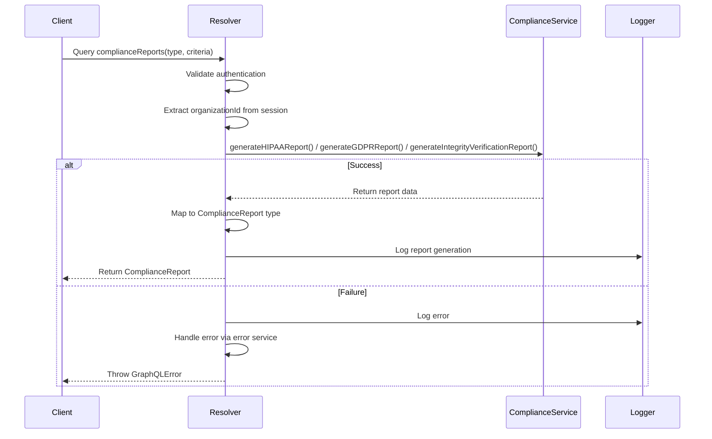
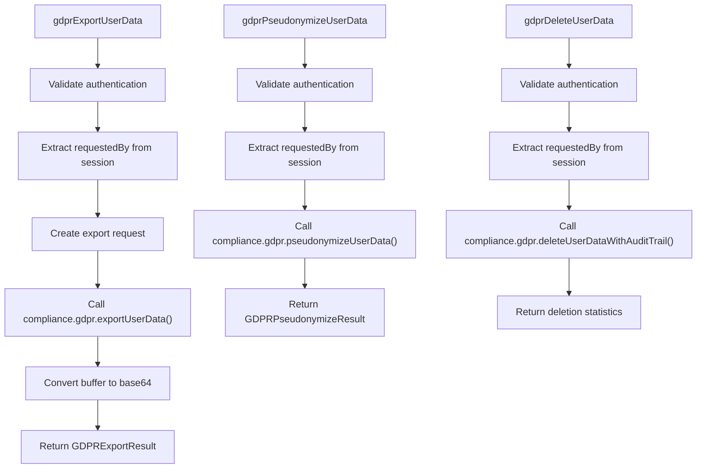
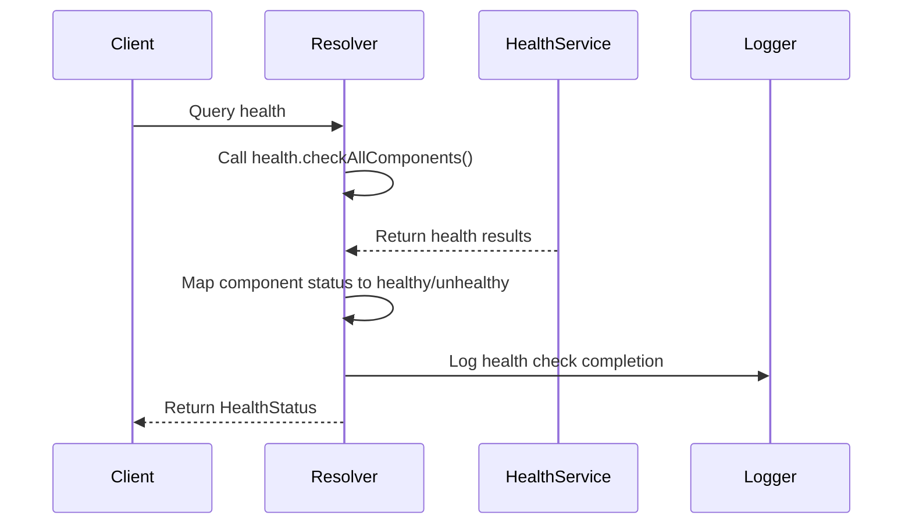
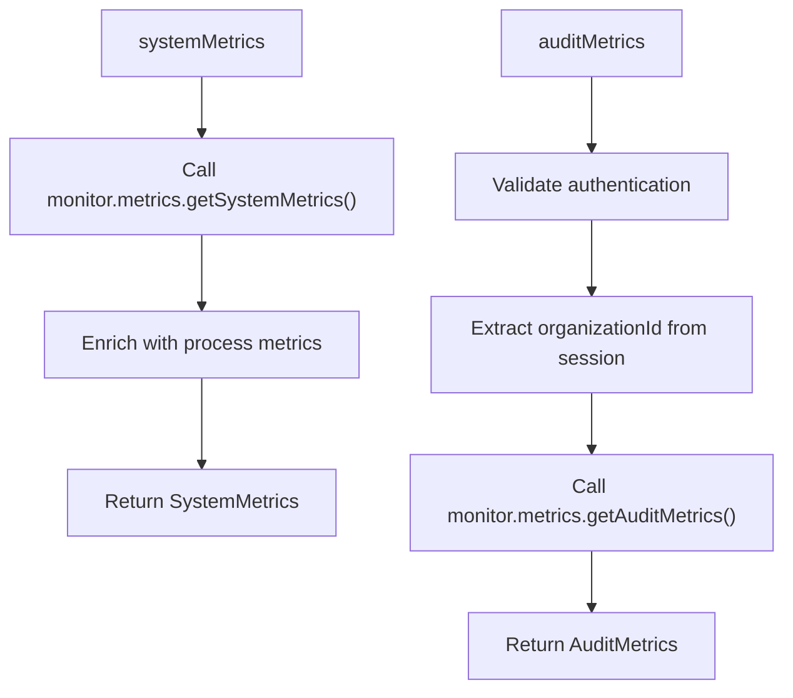
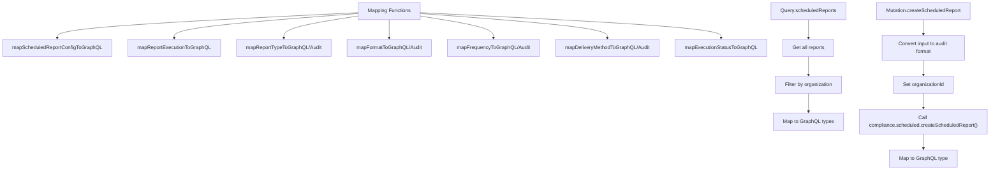
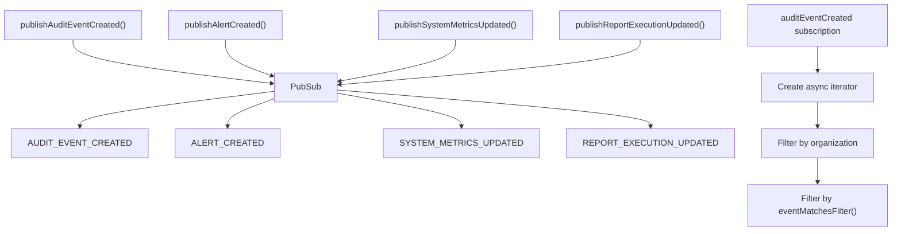
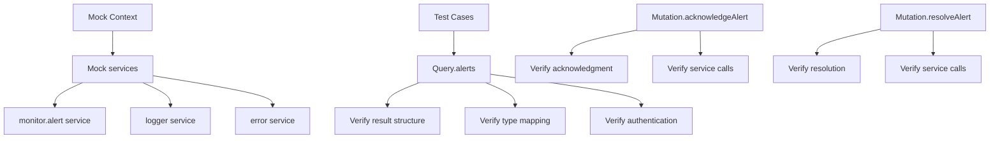
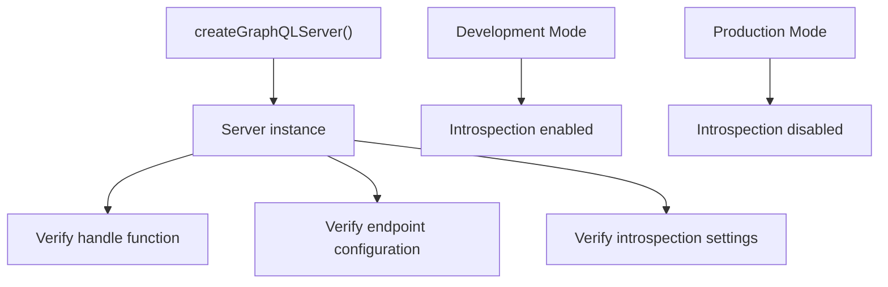
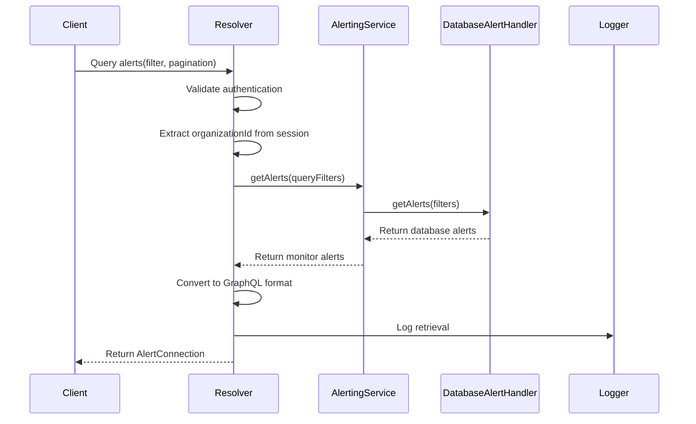

# Resolvers

<cite>
**Referenced Files in This Document**   
- [alerts.ts](file://apps\server\src\lib\graphql\resolvers\alerts.ts) - *Refactored to use AlertingService*
- [context.ts](file://apps\server\src\lib\hono\context.ts) - *Updated service context with alerting service*
- [compliance.ts](file://apps/server/src/lib/graphql/resolvers/compliance.ts)
- [gdpr.ts](file://apps/server/src/lib/graphql/resolvers/gdpr.ts)
- [health.ts](file://apps/server/src/lib/graphql/resolvers/health.ts)
- [metrics.ts](file://apps/server/src/lib/graphql/resolvers/metrics.ts)
- [scheduled-reports.ts](file://apps/server/src/lib/graphql/resolvers/scheduled-reports.ts)
- [subscriptions.ts](file://apps/server/src/lib/graphql/resolvers/subscriptions.ts)
- [alerts.test.ts](file://apps/server/src/lib/graphql/resolvers/__tests__/alerts.test.ts)
- [integration.test.ts](file://apps/server/src/lib/graphql/__tests__/integration.test.ts)
- [index.ts](file://apps/server/src/lib/graphql/resolvers/index.ts)
- [server.ts](file://apps/server/src/lib/graphql/server.ts)
- [types.ts](file://apps/server/src/lib/graphql/types.ts)
</cite>

## Update Summary
**Changes Made**   
- Updated Alerts Resolvers section to reflect refactoring to use AlertingService
- Added detailed explanation of AlertingService integration
- Updated sequence diagram to show new service interaction
- Enhanced error handling description with resilience patterns
- Added section sources for newly analyzed files

## Table of Contents
1. [Introduction](#introduction)
2. [Resolver Registration and Schema Wiring](#resolver-registration-and-schema-wiring)
3. [Compliance Resolvers](#compliance-resolvers)
4. [GDPR Resolvers](#gdpr-resolvers)
5. [Health Resolvers](#health-resolvers)
6. [Metrics Resolvers](#metrics-resolvers)
7. [Scheduled Reports Resolvers](#scheduled-reports-resolvers)
8. [Subscriptions Resolvers](#subscriptions-resolvers)
9. [Error Handling and Authentication Patterns](#error-handling-and-authentication-patterns)
10. [Resolver Testing and Validation](#resolver-testing-and-validation)
11. [Alerts Resolvers](#alerts-resolvers)

## Introduction
This document provides comprehensive documentation for all GraphQL resolver functions in the smart-logs application, grouped by domain. The resolvers serve as the business logic layer between the GraphQL schema and underlying services, handling data retrieval, mutation operations, and real-time subscriptions. Each resolver module follows consistent patterns for authentication, authorization, error handling, and service interaction. The documentation details the functions, arguments, return types, and business logic for each resolver, explaining how they interact with services and databases.

## Resolver Registration and Schema Wiring

The resolver modules are registered and wired to the GraphQL schema through a centralized export system. All resolvers are aggregated in the index.ts file within the resolvers directory and then exposed through the main GraphQL module.



**Diagram sources**
- [index.ts](file://apps/server/src/lib/graphql/resolvers/index.ts)
- [index.ts](file://apps/server/src/lib/graphql/index.ts)

**Section sources**
- [index.ts](file://apps/server/src/lib/graphql/resolvers/index.ts)
- [server.ts](file://apps/server/src/lib/graphql/server.ts)

The resolvers are imported and combined in the resolvers/index.ts file, which exports a unified resolvers object that is used when creating the GraphQL schema. This pattern allows for modular resolver development while maintaining a single entry point for schema configuration. The GraphQL server is created in server.ts, where the schema and resolvers are combined with context creation logic and endpoint configuration.

## Compliance Resolvers

The compliance resolvers handle the generation of compliance reports for various regulatory frameworks including HIPAA, GDPR, and integrity verification.

### Function: complianceReports
- **Type**: Query
- **Arguments**: 
  - `type`: ComplianceReportType (HIPAA | GDPR | INTEGRITY | CUSTOM)
  - `criteria`: ReportCriteriaInput (dateRange, organizationIds, includeMetadata, format)
- **Return Type**: Promise<ComplianceReport>
- **Business Logic**: Generates compliance reports based on the specified type and criteria. The resolver ensures organization isolation by automatically including the active organization ID from the session in the report criteria.



**Diagram sources**
- [compliance.ts](file://apps/server/src/lib/graphql/resolvers/compliance.ts)

**Section sources**
- [compliance.ts](file://apps/server/src/lib/graphql/resolvers/compliance.ts)

The complianceReports resolver first checks authentication and extracts the active organization ID from the session context. It then delegates to the appropriate compliance service method based on the report type. The resolver maps the service response to the standardized ComplianceReport type, ensuring consistent output regardless of the underlying report type. Error handling is centralized, with errors logged and propagated as GraphQL errors with appropriate codes.

## GDPR Resolvers

The GDPR resolvers implement data subject rights operations required by the General Data Protection Regulation, including data export, pseudonymization, and deletion.

### Function: gdprExportUserData
- **Type**: Mutation
- **Arguments**: 
  - `input.principalId`: string (ID of the user whose data to export)
  - `input.format`: string (export format)
  - `input.dateRange`: DateRangeInput (optional date range filter)
  - `input.includeMetadata`: boolean (whether to include metadata)
- **Return Type**: Promise<GDPRExportResult>
- **Business Logic**: Exports audit data for a specific user in compliance with GDPR data portability requirements. The resolver converts binary data to base64 encoding for GraphQL transport.

### Function: gdprPseudonymizeUserData
- **Type**: Mutation
- **Arguments**: 
  - `input.principalId`: string (ID of the user whose data to pseudonymize)
  - `input.strategy`: string (pseudonymization strategy to apply)
- **Return Type**: Promise<GDPRPseudonymizeResult>
- **Business Logic**: Applies pseudonymization to user audit data, replacing personally identifiable information with pseudonyms while maintaining data utility for audit purposes.

### Function: gdprDeleteUserData
- **Type**: Mutation
- **Arguments**: 
  - `input.principalId`: string (ID of the user whose data to delete)
  - `input.preserveComplianceAudits`: boolean (whether to preserve compliance-related audit records)
- **Return Type**: Promise<{recordsDeleted: number, complianceRecordsPreserved: number, timestamp: string}>
- **Business Logic**: Deletes user audit data while respecting compliance requirements. When preserveComplianceAudits is true, certain audit records required for regulatory compliance are preserved.



**Diagram sources**
- [gdpr.ts](file://apps/server/src/lib/graphql/resolvers/gdpr.ts)

**Section sources**
- [gdpr.ts](file://apps/server/src/lib/graphql/resolvers/gdpr.ts)

The GDPR resolvers implement critical data subject rights functionality required by GDPR regulations. Each mutation follows a consistent pattern of authentication validation, operation execution, logging, and error handling. The resolvers interact with the compliance service's GDPR module, which handles the actual data processing. Special attention is paid to data encoding, with binary export data converted to base64 for safe transport through the GraphQL API.

## Health Resolvers

The health resolvers provide system health monitoring capabilities through the GraphQL API.

### Function: health
- **Type**: Query
- **Arguments**: None
- **Return Type**: Promise<HealthStatus>
- **Business Logic**: Retrieves the current health status of all system components by delegating to the health service's checkAllComponents method. The resolver maps the service response to the standardized HealthStatus type.



**Diagram sources**
- [health.ts](file://apps/server/src/lib/graphql/resolvers/health.ts)

**Section sources**
- [health.ts](file://apps/server/src/lib/graphql/resolvers/health.ts)

The health resolver provides a comprehensive view of system health by aggregating status information from all components. It maps the service's OK/CRITICAL status codes to the GraphQL schema's healthy/unhealthy/degraded states. The resolver includes detailed information about each component's status, response time, and any error messages, providing valuable diagnostic information for monitoring and troubleshooting.

## Metrics Resolvers

The metrics resolvers expose system and audit-specific metrics through the GraphQL API.

### Function: systemMetrics
- **Type**: Query
- **Arguments**: None
- **Return Type**: Promise<SystemMetrics>
- **Business Logic**: Retrieves system-level metrics including server, database, Redis, and API performance metrics.

### Function: auditMetrics
- **Type**: Query
- **Arguments**: 
  - `metricsTimeRange`: MetricsTimeRange (predefined time ranges)
  - `timeRange`: TimeRangeInput (custom date range)
  - `groupBy`: MetricsGroupBy (grouping criteria)
- **Return Type**: Promise<AuditMetrics>
- **Business Logic**: Retrieves audit-specific metrics with filtering and grouping options. Requires authentication and enforces organization isolation.



**Diagram sources**
- [metrics.ts](file://apps/server/src/lib/graphql/resolvers/metrics.ts)

**Section sources**
- [metrics.ts](file://apps/server/src/lib/graphql/resolvers/metrics.ts)

The metrics resolvers provide visibility into system performance and audit processing metrics. The systemMetrics resolver combines service-provided metrics with Node.js process metrics to give a comprehensive view of system health. The auditMetrics resolver supports flexible time-based filtering and grouping, allowing clients to analyze audit data processing patterns over time. Both resolvers include comprehensive logging and error handling to ensure reliability.

## Scheduled Reports Resolvers

The scheduled reports resolvers manage the lifecycle of scheduled compliance reports, including creation, retrieval, updating, and execution.

### Function: scheduledReports
- **Type**: Query
- **Arguments**: None
- **Return Type**: Promise<ScheduledReport[]>
- **Business Logic**: Retrieves all scheduled reports accessible to the current organization, with automatic filtering to ensure organization isolation.

### Function: scheduledReport
- **Type**: Query
- **Arguments**: 
  - `id`: string (report ID)
- **Return Type**: Promise<ScheduledReport | null>
- **Business Logic**: Retrieves a specific scheduled report by ID, with access control based on organization membership.

### Function: createScheduledReport
- **Type**: Mutation
- **Arguments**: 
  - `input`: CreateScheduledReportInput
- **Return Type**: Promise<ScheduledReport>
- **Business Logic**: Creates a new scheduled report with organization isolation enforced by automatically setting the organization ID.

### Function: updateScheduledReport
- **Type**: Mutation
- **Arguments**: 
  - `id`: string (report ID)
  - `input`: UpdateScheduledReportInput
- **Return Type**: Promise<ScheduledReport>
- **Business Logic**: Updates an existing scheduled report with organization isolation maintained in the criteria.

### Function: deleteScheduledReport
- **Type**: Mutation
- **Arguments**: 
  - `id`: string (report ID)
- **Return Type**: Promise<boolean>
- **Business Logic**: Deletes a scheduled report after authentication and authorization checks.

### Function: executeScheduledReport
- **Type**: Mutation
- **Arguments**: 
  - `id`: string (report ID)
- **Return Type**: Promise<ReportExecution>
- **Business Logic**: Immediately executes a scheduled report, useful for on-demand report generation.



**Diagram sources**
- [scheduled-reports.ts](file://apps/server/src/lib/graphql/resolvers/scheduled-reports.ts)

**Section sources**
- [scheduled-reports.ts](file://apps/server/src/lib/graphql/resolvers/scheduled-reports.ts)

The scheduled reports resolvers implement a comprehensive CRUD interface for managing scheduled compliance reports. A key feature is the bidirectional mapping system that converts between the GraphQL schema types and the audit package's internal types. This abstraction layer allows the GraphQL API to maintain its own type system while integrating with existing services. The resolvers enforce organization isolation throughout all operations, ensuring data security and compliance with multi-tenancy requirements.

## Subscriptions Resolvers

The subscriptions resolvers enable real-time event streaming for audit events, alerts, system metrics, and report executions.

### Function: auditEventCreated
- **Type**: Subscription
- **Arguments**: 
  - `filter`: AuditEventFilter (filter criteria)
- **Return Type**: AsyncIterator<AuditEvent>
- **Business Logic**: Streams newly created audit events that match the specified filter criteria and belong to the authenticated user's organization.

### Function: alertCreated
- **Type**: Subscription
- **Arguments**: 
  - `severity`: AlertSeverity (optional severity filter)
- **Return Type**: AsyncIterator<Alert>
- **Business Logic**: Streams newly created alerts, optionally filtered by severity.

### Function: systemMetricsUpdated
- **Type**: Subscription
- **Arguments**: None
- **Return Type**: AsyncIterator<SystemMetrics>
- **Business Logic**: Streams periodic system metrics updates.

### Function: reportExecutionUpdated
- **Type**: Subscription
- **Arguments**: 
  - `reportId`: string (ID of the report to monitor)
- **Return Type**: AsyncIterator<ReportExecution>
- **Business Logic**: Streams updates for a specific report execution.



**Diagram sources**
- [subscriptions.ts](file://apps/server/src/lib/graphql/resolvers/subscriptions.ts)

**Section sources**
- [subscriptions.ts](file://apps/server/src/lib/graphql/resolvers/subscriptions.ts)

The subscriptions resolvers implement a publish-subscribe pattern using the graphql-subscriptions PubSub instance. Each subscription creates a filtered async iterator that only yields events matching the client's criteria and authorization context. The resolver includes helper functions for publishing events, which are used by other parts of the application to trigger real-time updates. The eventMatchesFilter function provides comprehensive filtering capabilities based on date range, principal IDs, organization IDs, actions, statuses, and other criteria.

## Error Handling and Authentication Patterns

All resolvers follow consistent patterns for authentication, authorization, and error handling.

### Authentication Checks
Every resolver that requires authentication includes a check for the presence of a session object in the context:

```typescript
if (!context.session) {
    throw new GraphQLError('Authentication required', {
        extensions: { code: 'UNAUTHENTICATED' },
    })
}
```

### Authorization Logic
Most resolvers enforce organization-based authorization by extracting the active organization ID from the session and using it to filter results or set context for operations.

### Error Handling Pattern
All resolvers use a consistent try-catch pattern with centralized error logging and handling:

```typescript
try {
    // Business logic
} catch (e) {
    const message = e instanceof Error ? e.message : 'Unknown error'
    logger.error(`Operation failed: ${message}`)
    
    await error.handleError(
        e as Error,
        {
            requestId: context.requestId,
            userId: context.session?.session.userId,
            sessionId: context.session?.session.id,
            metadata: { /* operation-specific metadata */ }
        },
        'graphql-api',
        'operationName'
    )
    
    throw new GraphQLError(`Operation failed: ${message}`, {
        extensions: { code: 'INTERNAL_ERROR' }
    })
}
```

**Section sources**
- [compliance.ts](file://apps/server/src/lib/graphql/resolvers/compliance.ts)
- [gdpr.ts](file://apps/server/src/lib/graphql/resolvers/gdpr.ts)
- [health.ts](file://apps/server/src/lib/graphql/resolvers/health.ts)
- [metrics.ts](file://apps/server/src/lib/graphql/resolvers/metrics.ts)
- [scheduled-reports.ts](file://apps/server/src/lib/graphql/resolvers/scheduled-reports.ts)
- [subscriptions.ts](file://apps/server/src/lib/graphql/resolvers/subscriptions.ts)

The resolvers implement a robust security model with consistent authentication and authorization checks. Error handling is centralized through the error service, which ensures that all errors are properly logged and reported while maintaining security by not exposing sensitive information to clients. The logging includes comprehensive metadata for debugging and auditing purposes.

## Resolver Testing and Validation

The resolvers are validated through unit and integration tests that verify their behavior and integration with the GraphQL schema.

### Unit Testing with alerts.test.ts
The alerts.test.ts file provides a model for resolver testing, using mocks to isolate the resolver logic:



**Diagram sources**
- [alerts.test.ts](file://apps/server/src/lib/graphql/resolvers/__tests__/alerts.test.ts)

### Integration Testing with integration.test.ts
The integration.test.ts file validates the GraphQL server configuration and basic functionality:



**Diagram sources**
- [integration.test.ts](file://apps/server/src/lib/graphql/__tests__/integration.test.ts)

**Section sources**
- [alerts.test.ts](file://apps/server/src/lib/graphql/resolvers/__tests__/alerts.test.ts)
- [integration.test.ts](file://apps/server/src/lib/graphql/__tests__/integration.test.ts)

The testing strategy includes both unit tests that mock dependencies to test resolver logic in isolation, and integration tests that verify the complete GraphQL server configuration. The unit tests validate that resolvers correctly transform data between service and GraphQL types, handle authentication properly, and produce the expected output structure. The integration tests ensure that the GraphQL server is properly configured with the correct endpoints and security settings for different environments.

## Alerts Resolvers

The alerts resolvers have been refactored to use the dedicated AlertingService, providing a standardized interface for alert management operations.

### Function: alerts
- **Type**: Query
- **Arguments**: 
  - `filter`: AlertFilter (status, severities, types)
  - `pagination`: PaginationInput (first, after)
- **Return Type**: Promise<AlertConnection>
- **Business Logic**: Retrieves alerts with filtering and pagination, converting between GraphQL and monitor service types.

### Function: acknowledgeAlert
- **Type**: Mutation
- **Arguments**: 
  - `id`: string (alert ID)
- **Return Type**: Promise<Alert>
- **Business Logic**: Acknowledges an alert through the AlertingService, updating its status and recording the acknowledging user.

### Function: resolveAlert
- **Type**: Mutation
- **Arguments**: 
  - `id`: string (alert ID)
  - `resolution`: string (resolution notes)
- **Return Type**: Promise<Alert>
- **Business Logic**: Resolves an alert with resolution notes through the AlertingService, ensuring proper audit trail.



**Section sources**
- [alerts.ts](file://apps\server\src\lib\graphql\resolvers\alerts.ts)
- [context.ts](file://apps\server\src\lib\hono\context.ts)

**Diagram sources**
- [alerts.ts](file://apps\server\src\lib\graphql\resolvers\alerts.ts)
- [alerting.ts](file://packages\audit\src\monitor\alerting.ts)

The alerts resolvers now utilize the AlertingService to interact with the underlying alert storage system. The resolver handles authentication and organization isolation, then delegates to the AlertingService which routes requests to the appropriate handler (DatabaseAlertHandler). The resolvers include type mapping between the GraphQL schema and the monitor service, with special handling for the METRICS type which is mapped to SYSTEM in the GraphQL schema. Error handling is enhanced with resilience patterns, ensuring graceful degradation when external services are unavailable.