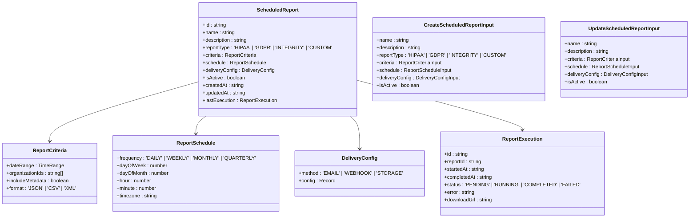
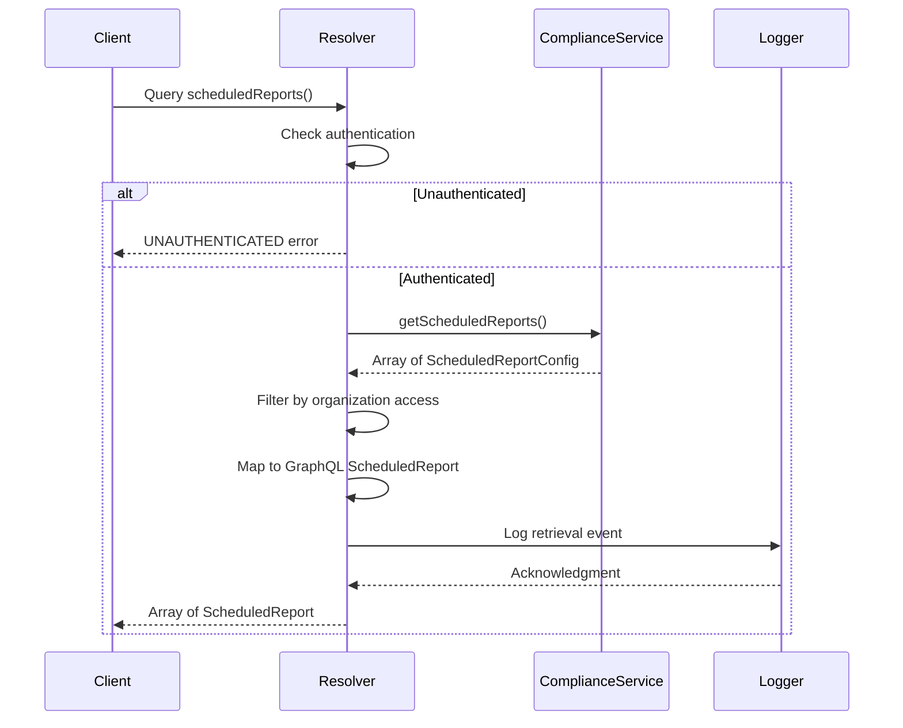
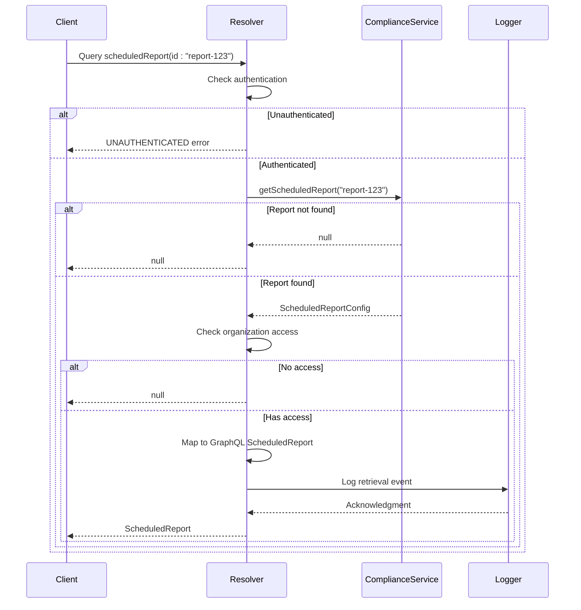
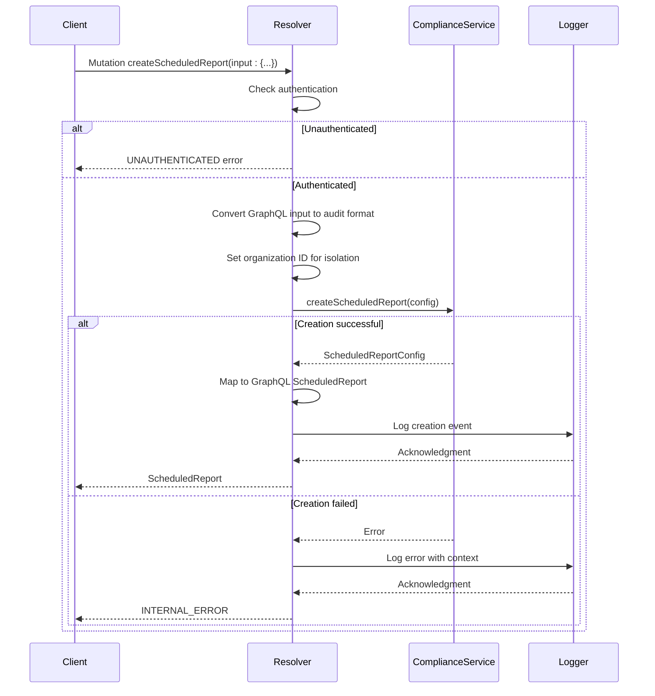
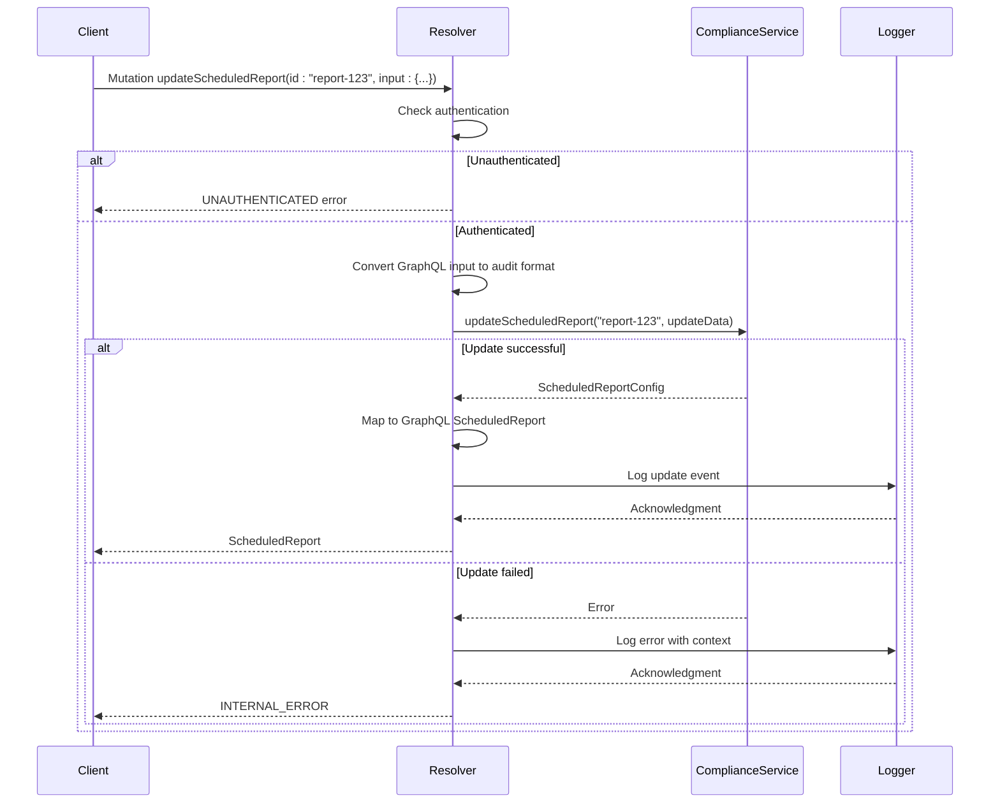
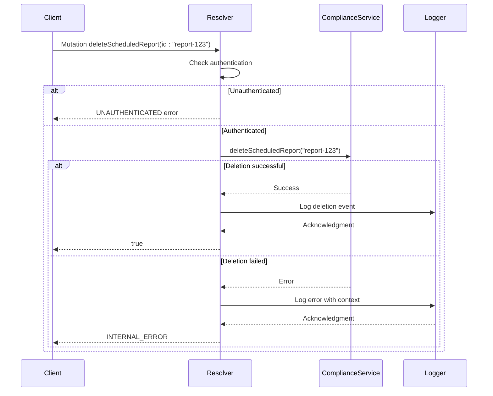
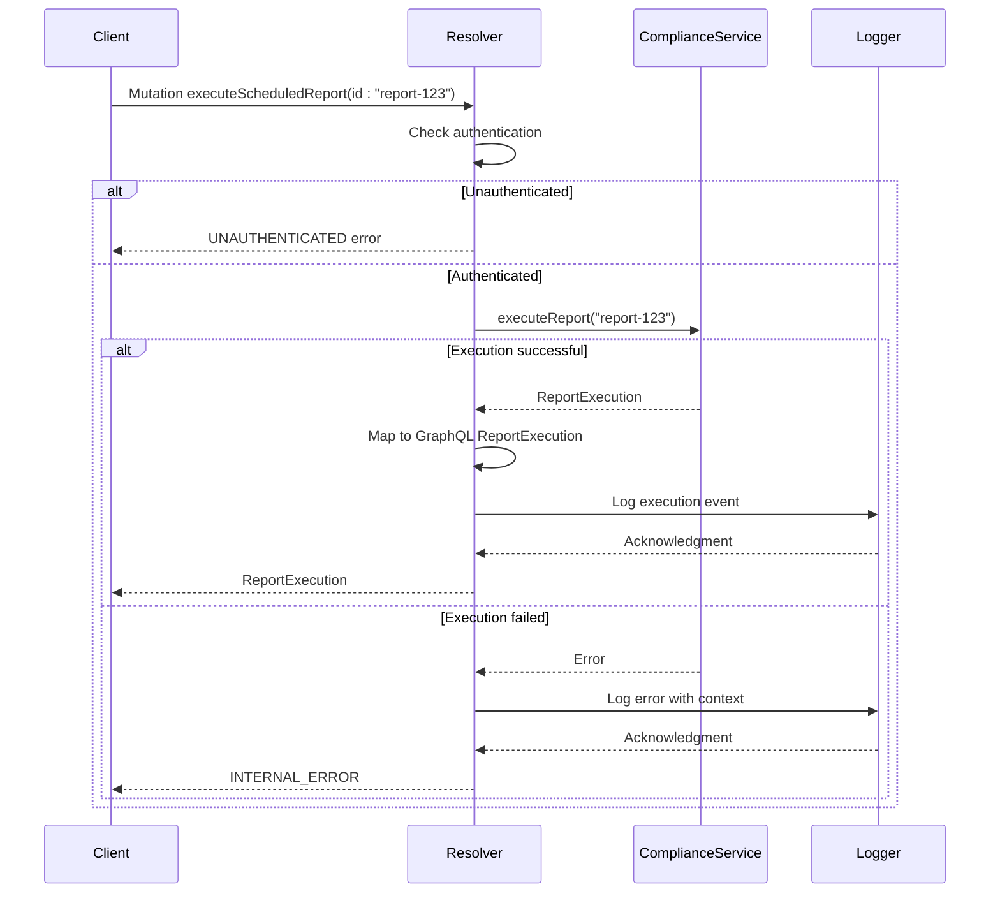
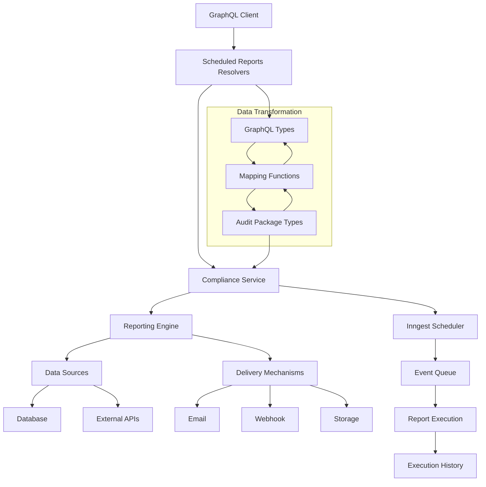
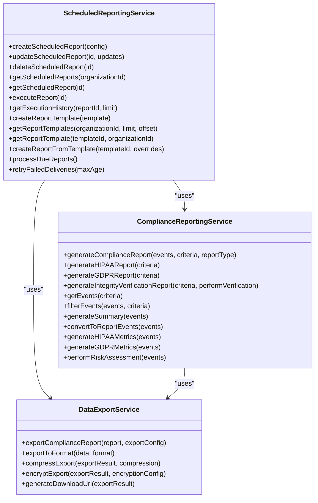
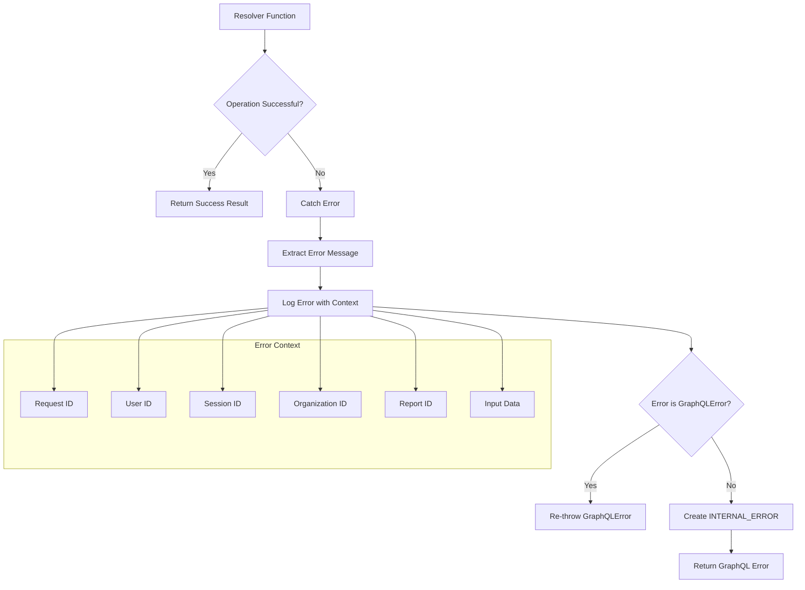

# Scheduled Reports Resolvers

<cite>
**Referenced Files in This Document**   
- [scheduled-reports.ts](file://apps/server/src/lib/graphql/resolvers/scheduled-reports.ts)
- [types.ts](file://apps/server/src/lib/graphql/types.ts)
- [compliance-reporting.ts](file://packages/audit/src/report/compliance-reporting.ts)
- [scheduled-reporting.ts](file://packages/audit/src/report/scheduled-reporting.ts)
</cite>

## Table of Contents
1. [Introduction](#introduction)
2. [Core Components](#core-components)
3. [Resolver Functions](#resolver-functions)
4. [Data Flow and Integration](#data-flow-and-integration)
5. [Error Handling](#error-handling)
6. [Usage Examples](#usage-examples)
7. [Conclusion](#conclusion)

## Introduction

The Scheduled Reports Resolvers provide a GraphQL interface for managing automated compliance reporting configurations. This system enables users to create, retrieve, update, and delete scheduled report configurations that generate compliance reports (HIPAA, GDPR, INTEGRITY, CUSTOM) according to specified recurrence rules and deliver them through various mechanisms. The resolvers act as an intermediary layer between the GraphQL API and the underlying compliance reporting service, handling authentication, authorization, data transformation, and error management.

**Section sources**
- [scheduled-reports.ts](file://apps/server/src/lib/graphql/resolvers/scheduled-reports.ts#L1-L50)

## Core Components

The scheduled reports functionality is built on several core components that work together to provide a comprehensive reporting solution. The GraphQL resolvers interact with the compliance service to manage scheduled report configurations and executions, while various mapping functions ensure compatibility between different data representations.



**Diagram sources**
- [types.ts](file://apps/server/src/lib/graphql/types.ts#L300-L350)

**Section sources**
- [scheduled-reports.ts](file://apps/server/src/lib/graphql/resolvers/scheduled-reports.ts#L1-L659)
- [types.ts](file://apps/server/src/lib/graphql/types.ts#L300-L350)

## Resolver Functions

The scheduled reports resolvers provide a comprehensive set of GraphQL operations for managing scheduled report configurations and executions. These resolvers handle authentication, authorization, data transformation, and integration with the underlying compliance reporting service.

### Query Resolvers

#### scheduledReports
Retrieves all scheduled reports accessible to the authenticated user's organization. The resolver filters reports by organization ID for security isolation and transforms the audit package configuration into the GraphQL ScheduledReport type.



**Diagram sources**
- [scheduled-reports.ts](file://apps/server/src/lib/graphql/resolvers/scheduled-reports.ts#L150-L195)

#### scheduledReport
Retrieves a specific scheduled report by ID. The resolver verifies that the authenticated user has access to the report based on organization membership and transforms the audit package configuration into the GraphQL ScheduledReport type.



**Diagram sources**
- [scheduled-reports.ts](file://apps/server/src/lib/graphql/resolvers/scheduled-reports.ts#L200-L250)

### Mutation Resolvers

#### createScheduledReport
Creates a new scheduled report configuration. The resolver converts the GraphQL input format to the audit package format, ensures organization isolation by setting the organization ID, and creates the report through the compliance service.



**Diagram sources**
- [scheduled-reports.ts](file://apps/server/src/lib/graphql/resolvers/scheduled-reports.ts#L255-L350)

#### updateScheduledReport
Updates an existing scheduled report configuration. The resolver converts the GraphQL input format to the audit package format, applies the updates through the compliance service, and handles organization isolation.



**Diagram sources**
- [scheduled-reports.ts](file://apps/server/src/lib/graphql/resolvers/scheduled-reports.ts#L355-L450)

#### deleteScheduledReport
Deletes a scheduled report configuration by ID. The resolver removes the report from the compliance service and logs the deletion event.



**Diagram sources**
- [scheduled-reports.ts](file://apps/server/src/lib/graphql/resolvers/scheduled-reports.ts#L455-L500)

#### executeScheduledReport
Triggers immediate execution of a scheduled report. The resolver invokes the compliance service to execute the report and returns the execution details.



**Diagram sources**
- [scheduled-reports.ts](file://apps/server/src/lib/graphql/resolvers/scheduled-reports.ts#L505-L550)

**Section sources**
- [scheduled-reports.ts](file://apps/server/src/lib/graphql/resolvers/scheduled-reports.ts#L150-L550)

## Data Flow and Integration

The scheduled reports resolvers integrate with the reporting engine through the compliance service to trigger report generation and handle delivery mechanisms. The system uses a layered architecture with data transformation between different representations.



**Diagram sources**
- [scheduled-reports.ts](file://apps/server/src/lib/graphql/resolvers/scheduled-reports.ts#L1-L659)
- [scheduled-reporting.ts](file://packages/audit/src/report/scheduled-reporting.ts#L1-L988)

The integration with the report templates system allows users to create scheduled reports from predefined templates. When creating a report from a template, default values for criteria, format, schedule, and delivery are applied, which can be overridden with custom values.



**Diagram sources**
- [scheduled-reporting.ts](file://packages/audit/src/report/scheduled-reporting.ts#L1-L988)
- [compliance-reporting.ts](file://packages/audit/src/report/compliance-reporting.ts#L1-L952)

**Section sources**
- [scheduled-reports.ts](file://apps/server/src/lib/graphql/resolvers/scheduled-reports.ts#L1-L659)
- [scheduled-reporting.ts](file://packages/audit/src/report/scheduled-reporting.ts#L1-L988)

## Error Handling

The scheduled reports resolvers implement comprehensive error handling to ensure robust operation and provide meaningful feedback to clients. Errors are caught, logged with context, and transformed into appropriate GraphQL errors.



**Diagram sources**
- [scheduled-reports.ts](file://apps/server/src/lib/graphql/resolvers/scheduled-reports.ts#L150-L550)

The error handling strategy includes:

- **Authentication validation**: Ensuring users are authenticated before processing requests
- **Authorization checks**: Verifying organization access for report operations
- **Input validation**: Relying on GraphQL schema validation for input data
- **Service error propagation**: Converting service-level errors to GraphQL errors
- **Comprehensive logging**: Recording errors with contextual information for debugging
- **Error masking**: Preventing sensitive information from being exposed to clients

Specific error codes used include:
- `UNAUTHENTICATED`: When no valid session is present
- `NOT_FOUND`: When a requested report does not exist
- `INTERNAL_ERROR`: For unexpected errors during operation

**Section sources**
- [scheduled-reports.ts](file://apps/server/src/lib/graphql/resolvers/scheduled-reports.ts#L150-L550)

## Usage Examples

The scheduled reports resolvers support various use cases for managing compliance reporting configurations. Below are examples of common operations.

### Creating a Daily HIPAA Report

To create a daily HIPAA compliance report that delivers via email:

```graphql
mutation CreateDailyHIPAAReport {
  createScheduledReport(input: {
    name: "Daily HIPAA Audit"
    description: "Daily HIPAA compliance audit report"
    reportType: HIPAA
    criteria: {
      dateRange: {
        startDate: "2024-01-01T00:00:00Z"
        endDate: "2024-01-01T23:59:59Z"
      }
      includeMetadata: true
      format: JSON
    }
    schedule: {
      frequency: DAILY
      hour: 9
      minute: 0
      timezone: "America/New_York"
    }
    deliveryConfig: {
      method: EMAIL
      config: {
        recipients: ["compliance@company.com"]
      }
    }
    isActive: true
  }) {
    id
    name
    reportType
    schedule {
      frequency
      hour
      minute
    }
    deliveryConfig {
      method
      config
    }
    isActive
  }
}
```

### Retrieving Scheduled Reports

To retrieve all scheduled reports for the authenticated user's organization:

```graphql
query GetScheduledReports {
  scheduledReports {
    id
    name
    description
    reportType
    criteria {
      dateRange {
        startDate
        endDate
      }
      format
    }
    schedule {
      frequency
      dayOfWeek
      dayOfMonth
      hour
      minute
      timezone
    }
    deliveryConfig {
      method
      config
    }
    isActive
    createdAt
    updatedAt
    lastExecution {
      id
      startedAt
      completedAt
      status
      downloadUrl
    }
  }
}
```

### Updating a Report Schedule

To update an existing report to run weekly on Mondays at 8:30 AM UTC:

```graphql
mutation UpdateReportSchedule {
  updateScheduledReport(
    id: "report-123"
    input: {
      schedule: {
        frequency: WEEKLY
        dayOfWeek: 1
        hour: 8
        minute: 30
        timezone: "UTC"
      }
    }
  ) {
    id
    schedule {
      frequency
      dayOfWeek
      hour
      minute
      timezone
    }
  }
}
```

### Executing a Report Immediately

To trigger immediate execution of a scheduled report:

```graphql
mutation ExecuteReportNow {
  executeScheduledReport(id: "report-123") {
    id
    reportId
    startedAt
    completedAt
    status
    error
    downloadUrl
  }
}
```

**Section sources**
- [scheduled-reports.ts](file://apps/server/src/lib/graphql/resolvers/scheduled-reports.ts#L150-L550)

## Conclusion

The Scheduled Reports Resolvers provide a robust GraphQL interface for managing automated compliance reporting configurations. The system enables organizations to create, retrieve, update, and delete scheduled reports that generate compliance documentation according to regulatory requirements (HIPAA, GDPR, etc.). Key features include flexible scheduling options, multiple delivery mechanisms, integration with report templates, and comprehensive error handling.

The resolvers act as a bridge between the GraphQL API and the underlying compliance reporting service, handling authentication, authorization, data transformation, and error management. By leveraging the Inngest scheduler and a layered architecture, the system ensures reliable report generation and delivery while maintaining data isolation between organizations.

This documentation covers the core functionality, data flow, integration points, and usage patterns for the scheduled reports system, providing a comprehensive reference for developers and administrators working with the compliance reporting features.