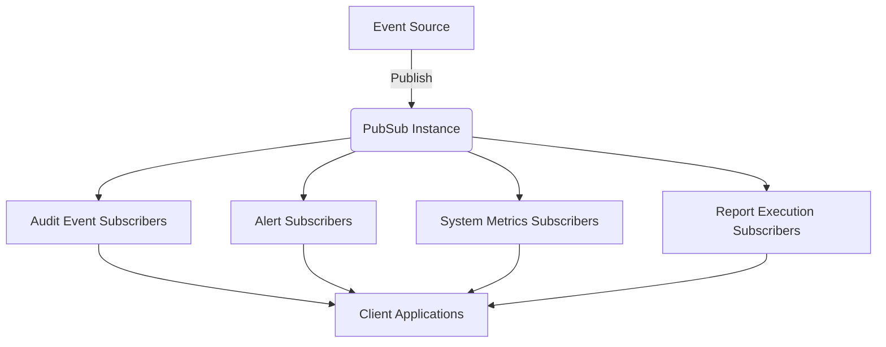
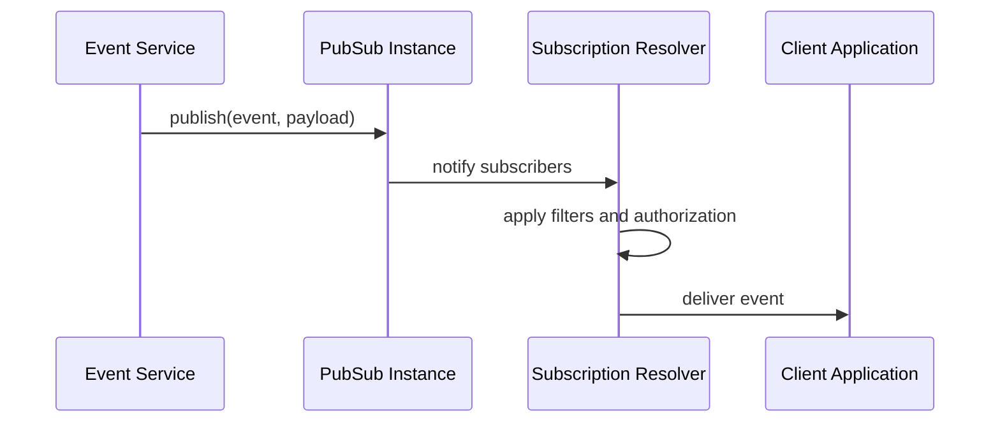
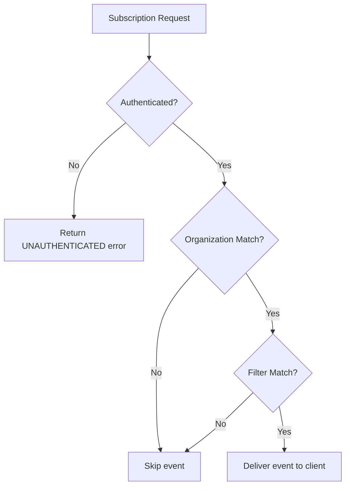
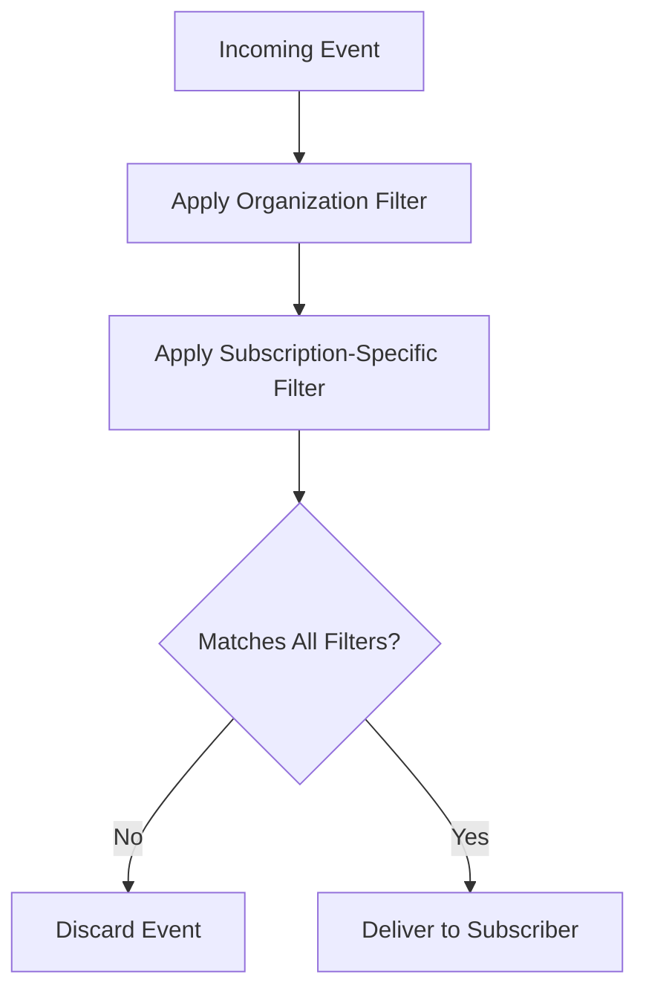
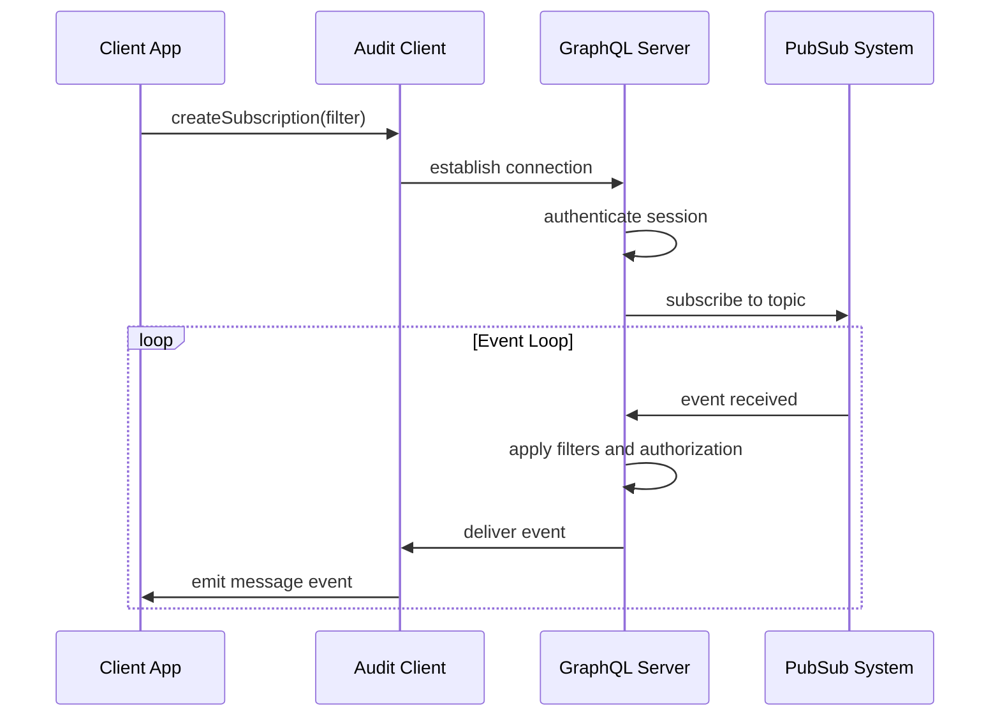

# Subscriptions Resolvers

<cite>
**Referenced Files in This Document**   
- [subscriptions.ts](file://apps/server/src/lib/graphql/resolvers/subscriptions.ts)
- [types.ts](file://apps/server/src/lib/graphql/types.ts)
- [index.ts](file://apps/server/src/lib/graphql/resolvers/index.ts)
- [events.ts](file://packages/audit-client/src/services/events.ts)
</cite>

## Table of Contents
1. [Introduction](#introduction)
2. [Subscription Architecture](#subscription-architecture)
3. [Pub/Sub Mechanism](#pubsub-mechanism)
4. [Authentication and Authorization](#authentication-and-authorization)
5. [Event Filtering](#event-filtering)
6. [Payload Structure](#payload-structure)
7. [Client Subscription Handling](#client-subscription-handling)
8. [Integration with Observability](#integration-with-observability)
9. [Connection Management](#connection-management)
10. [Subscription Examples](#subscription-examples)

## Introduction
This document provides comprehensive documentation for the GraphQL subscriptions resolvers in the smart-logs application. The subscription system enables real-time updates for critical events including audit log entries, system alerts, and health monitoring. Built on the GraphQL Subscriptions specification, the implementation uses a pub/sub pattern to deliver events to authorized clients as they occur. The system supports multiple subscription types with sophisticated filtering capabilities, ensuring clients receive only relevant events while maintaining security and performance.

**Section sources**
- [subscriptions.ts](file://apps/server/src/lib/graphql/resolvers/subscriptions.ts#L1-L315)

## Subscription Architecture
The subscription architecture follows a publish-subscribe pattern where events are published to specific topics and clients subscribe to receive notifications. The system is built around a central PubSub instance that manages the event distribution. There are four primary subscription types available:

- **Audit Event Creation**: Real-time notifications when new audit events are created
- **Alert Creation**: Notifications for new system alerts based on severity levels
- **System Metrics Updates**: Periodic updates on system health and performance metrics
- **Report Execution Updates**: Notifications about the status changes of scheduled reports

Each subscription type is implemented as a resolver function that handles the subscription lifecycle, including client connection, authentication, filtering, and event delivery. The architecture separates the subscription logic from the event publishing logic, allowing different parts of the application to publish events without knowing the details of subscriber management.



**Diagram sources**
- [subscriptions.ts](file://apps/server/src/lib/graphql/resolvers/subscriptions.ts#L1-L315)

**Section sources**
- [subscriptions.ts](file://apps/server/src/lib/graphql/resolvers/subscriptions.ts#L1-L315)

## Pub/Sub Mechanism
The pub/sub mechanism is implemented using the `graphql-subscriptions` package with a central PubSub instance that manages event distribution. The system defines specific event types as constants to ensure type safety and prevent typos in event names.

### Event Types
The system defines the following subscription event types:
- `AUDIT_EVENT_CREATED`: Triggered when a new audit event is created
- `ALERT_CREATED`: Triggered when a new alert is generated
- `SYSTEM_METRICS_UPDATED`: Triggered when system metrics are updated
- `REPORT_EXECUTION_UPDATED`: Triggered when a report execution status changes

### Publishing Events
The system provides helper functions to publish events to the appropriate channels:
- `publishAuditEventCreated(event)`: Publishes a new audit event
- `publishAlertCreated(alert)`: Publishes a new alert
- `publishSystemMetricsUpdated(metrics)`: Publishes updated system metrics
- `publishReportExecutionUpdated(execution)`: Publishes report execution updates

These functions are designed to be called from various parts of the application when relevant events occur, decoupling event generation from subscription management.



**Diagram sources**
- [subscriptions.ts](file://apps/server/src/lib/graphql/resolvers/subscriptions.ts#L45-L53)
- [subscriptions.ts](file://apps/server/src/lib/graphql/resolvers/subscriptions.ts#L300-L315)

**Section sources**
- [subscriptions.ts](file://apps/server/src/lib/graphql/resolvers/subscriptions.ts#L1-L315)

## Authentication and Authorization
The subscription system implements robust authentication and authorization mechanisms to ensure that clients can only access events they are permitted to see.

### Authentication
All subscriptions require authentication. The system checks for a valid session in the GraphQL context:
```typescript
if (!context.session) {
    throw new GraphQLError('Authentication required', {
        extensions: { code: 'UNAUTHENTICATED' },
    })
}
```
Clients must provide valid authentication credentials (typically via JWT tokens) to establish a subscription connection.

### Authorization
The system implements organization-based authorization to ensure data isolation between organizations:
- **Audit Events**: Subscribers only receive events from their active organization
- **Alerts**: Future implementation will include organization-based filtering
- **System Metrics**: Global metrics accessible to all authenticated users
- **Report Executions**: Access controlled by organization membership (implementation note indicates this needs to be completed)

For audit events, the resolver explicitly checks that the event's organization ID matches the subscriber's active organization ID, preventing cross-organization data leakage.



**Diagram sources**
- [subscriptions.ts](file://apps/server/src/lib/graphql/resolvers/subscriptions.ts#L65-L75)
- [subscriptions.ts](file://apps/server/src/lib/graphql/resolvers/subscriptions.ts#L155-L165)

**Section sources**
- [subscriptions.ts](file://apps/server/src/lib/graphql/resolvers/subscriptions.ts#L60-L80)
- [subscriptions.ts](file://apps/server/src/lib/graphql/resolvers/subscriptions.ts#L150-L170)

## Event Filtering
The subscription system supports sophisticated event filtering to allow clients to receive only the events that match their criteria.

### Audit Event Filtering
The `auditEventCreated` subscription supports comprehensive filtering through the `AuditEventFilter` input type, which includes:
- **Date Range**: Filter events by timestamp range
- **Principal IDs**: Filter by specific user or service principals
- **Organization IDs**: Filter by organization (though organization access is already enforced)
- **Actions**: Filter by specific action types
- **Statuses**: Filter by event status
- **Data Classifications**: Filter by data sensitivity level
- **Resource Types**: Filter by target resource type
- **Resource IDs**: Filter by specific resource identifiers
- **Correlation IDs**: Filter by correlation ID for tracing
- **Verified Only**: Filter to show only integrity-verified events

The filtering is implemented through the `eventMatchesFilter` helper function, which evaluates each event against the provided filter criteria.

### Alert Filtering
The `alertCreated` subscription supports severity-based filtering, allowing clients to subscribe only to alerts of specific severity levels (LOW, MEDIUM, HIGH, CRITICAL).

### Report Execution Filtering
The `reportExecutionUpdated` subscription filters by report ID, allowing clients to monitor the status of specific scheduled reports.



**Diagram sources**
- [subscriptions.ts](file://apps/server/src/lib/graphql/resolvers/subscriptions.ts#L25-L98)
- [subscriptions.ts](file://apps/server/src/lib/graphql/resolvers/subscriptions.ts#L175-L185)

**Section sources**
- [subscriptions.ts](file://apps/server/src/lib/graphql/resolvers/subscriptions.ts#L25-L98)
- [types.ts](file://apps/server/src/lib/graphql/types.ts#L50-L85)

## Payload Structure
The subscription system delivers events with well-defined payload structures that match the corresponding GraphQL types.

### Audit Event Payload
The `auditEventCreated` subscription returns a complete `AuditEvent` object with the following structure:
- **id**: Unique identifier for the audit event
- **timestamp**: ISO 8601 timestamp of the event
- **action**: Description of the action performed
- **targetResourceType**: Type of resource affected
- **targetResourceId**: Identifier of the resource affected
- **principalId**: ID of the user or service that performed the action
- **organizationId**: ID of the organization the event belongs to
- **status**: Status of the action (success, failure, etc.)
- **dataClassification**: Sensitivity level of the data involved
- **correlationId**: ID for tracing related events
- **integrityStatus**: Verification status of the event's integrity

### Alert Payload
The `alertCreated` subscription returns an `Alert` object containing:
- **id**: Unique identifier for the alert
- **type**: Category of the alert (SYSTEM, SECURITY, COMPLIANCE, PERFORMANCE)
- **severity**: Urgency level (LOW, MEDIUM, HIGH, CRITICAL)
- **title**: Brief description of the alert
- **description**: Detailed information about the alert
- **createdAt**: Timestamp when the alert was created

### System Metrics Payload
The `systemMetricsUpdated` subscription returns a `SystemMetrics` object with nested metrics for:
- **Server**: Uptime, memory usage, CPU usage
- **Database**: Connection count, active queries, query performance
- **Redis**: Connection count, memory usage, key count
- **API**: Request rate, response time, error rate

### Report Execution Payload
The `reportExecutionUpdated` subscription returns a `ReportExecution` object with:
- **id**: Unique identifier for the execution
- **reportId**: ID of the scheduled report
- **startedAt**: Timestamp when execution began
- **completedAt**: Timestamp when execution completed (if applicable)
- **status**: Current status (PENDING, RUNNING, COMPLETED, FAILED)
- **error**: Error message if execution failed

**Section sources**
- [types.ts](file://apps/server/src/lib/graphql/types.ts#L10-L200)

## Client Subscription Handling
The system handles client subscriptions through a combination of server-side resolvers and client-side management.

### Server-Side Handling
Each subscription resolver returns an async iterator that implements the subscription protocol:
- The iterator processes events as they arrive from the PubSub system
- It applies authorization and filtering logic to determine if an event should be delivered
- It implements the async iterator protocol with `next()`, `return()`, and `throw()` methods
- The iterator maintains its own state and handles backpressure from slow clients

When a filter condition is not met, the resolver recursively calls `this.next()` to skip the current event and retrieve the next one, ensuring that only matching events are delivered to the client.

### Client-Side Implementation
The client implementation in `packages/audit-client/src/services/events.ts` provides a robust subscription management system:
- Supports both WebSocket and Server-Sent Events (SSE) transports
- Implements automatic reconnection with exponential backoff
- Manages heartbeat messages to detect connection failures
- Provides event handlers for message, error, connect, and disconnect events
- Allows dynamic filter updates by reconnecting with new parameters

The client handles connection lifecycle events and provides a clean API for applications to subscribe to events and receive notifications.



**Diagram sources**
- [subscriptions.ts](file://apps/server/src/lib/graphql/resolvers/subscriptions.ts#L100-L193)
- [events.ts](file://packages/audit-client/src/services/events.ts#L277-L323)

**Section sources**
- [subscriptions.ts](file://apps/server/src/lib/graphql/resolvers/subscriptions.ts#L100-L193)
- [events.ts](file://packages/audit-client/src/services/events.ts#L277-L457)

## Integration with Observability
The subscription system is designed to integrate with the application's observability infrastructure, though specific implementation details are not fully exposed in the provided code.

### Monitoring Considerations
While the direct integration points are not visible in the subscription resolvers, the system is structured to support observability:
- Each subscription event could be traced with correlation IDs
- The pub/sub mechanism allows for monitoring message throughput
- Error handling in subscriptions provides hooks for error tracking
- The async iterator pattern enables monitoring of subscription performance

### Potential Integration Points
The system could integrate with observability tools through:
- **Metrics Collection**: Tracking subscription connection counts, message rates, and delivery latency
- **Distributed Tracing**: Including trace IDs in subscription payloads to correlate events across systems
- **Error Monitoring**: Capturing and reporting subscription errors to centralized monitoring systems
- **Audit Logging**: Logging subscription access for security and compliance purposes

The presence of comprehensive types for system metrics suggests that performance monitoring is a first-class concern in the application architecture.

**Section sources**
- [types.ts](file://apps/server/src/lib/graphql/types.ts#L150-L200)

## Connection Management
The subscription system implements several strategies for managing client connections efficiently.

### Server-Side Connection Handling
The GraphQL server manages subscription connections through the async iterator pattern:
- Each subscription maintains its own iterator state
- The system handles backpressure by allowing clients to process events at their own pace
- Connection cleanup is handled through the iterator's `return` and `throw` methods
- The `[Symbol.asyncIterator]()` method ensures the iterator is iterable

### Client-Side Connection Resilience
The client implementation includes robust connection management features:
- **Automatic Reconnection**: Attempts to reconnect when connections are lost
- **Reconnect Backoff**: Uses exponential backoff to avoid overwhelming the server
- **Heartbeat Monitoring**: Sends periodic heartbeat messages to detect stale connections
- **Graceful Disconnection**: Properly closes connections and notifies subscribers

The client allows configuration of reconnect behavior, maximum reconnect attempts, and heartbeat intervals, giving applications control over connection resilience.

### Transport Options
The system supports multiple transport protocols:
- **WebSocket**: Default transport for real-time, bidirectional communication
- **Server-Sent Events (SSE)**: Alternative transport for environments where WebSockets are restricted

Clients can specify their preferred transport method, allowing flexibility in different deployment scenarios.

**Section sources**
- [events.ts](file://packages/audit-client/src/services/events.ts#L277-L457)

## Subscription Examples
This section provides examples of client subscription queries and demonstrates the server-side resolver logic.

### Client Subscription Queries
**Audit Events with Filter:**
```graphql
subscription AuditEventCreated($filter: AuditEventFilter) {
  auditEventCreated(filter: $filter) {
    id
    timestamp
    action
    principalId
    status
    dataClassification
  }
}
```

**Alerts by Severity:**
```graphql
subscription AlertCreated($severity: AlertSeverity) {
  alertCreated(severity: $severity) {
    id
    type
    severity
    title
    description
    createdAt
  }
}
```

**System Metrics:**
```graphql
subscription SystemMetricsUpdated {
  systemMetricsUpdated {
    timestamp
    server {
      uptime
      memoryUsage {
        percentage
      }
      cpuUsage {
        percentage
      }
    }
    database {
      connectionCount
      averageQueryTime
    }
  }
}
```

**Report Execution Status:**
```graphql
subscription ReportExecutionUpdated($reportId: String!) {
  reportExecutionUpdated(reportId: $reportId) {
    id
    status
    startedAt
    completedAt
    error
  }
}
```

### Server-Side Resolver Logic
The server-side resolvers follow a consistent pattern for handling subscriptions:

1. **Authentication Check**: Verify the client is authenticated
2. **Organization Context**: Extract the active organization from the session
3. **Async Iterator Creation**: Create an iterator for the appropriate event topic
4. **Event Processing**: For each event, apply authorization and filtering
5. **Payload Resolution**: Extract the relevant data from the event payload

The `auditEventCreated` resolver demonstrates this pattern comprehensively, checking both organization access and filter criteria before delivering events to the client.

**Section sources**
- [subscriptions.ts](file://apps/server/src/lib/graphql/resolvers/subscriptions.ts#L100-L276)
- [index.ts](file://apps/server/src/lib/graphql/resolvers/index.ts#L1-L107)