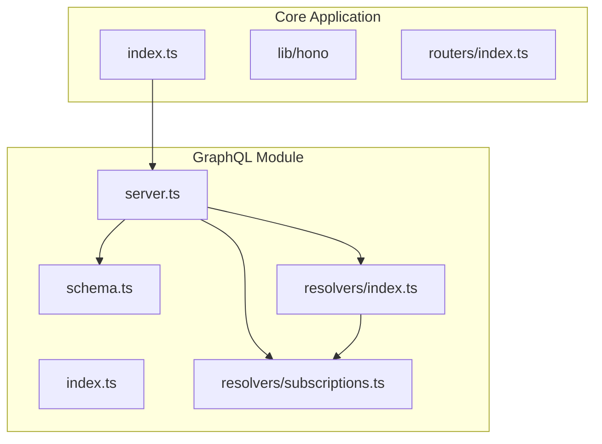
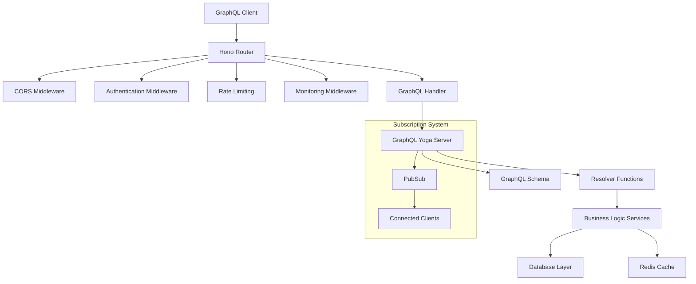
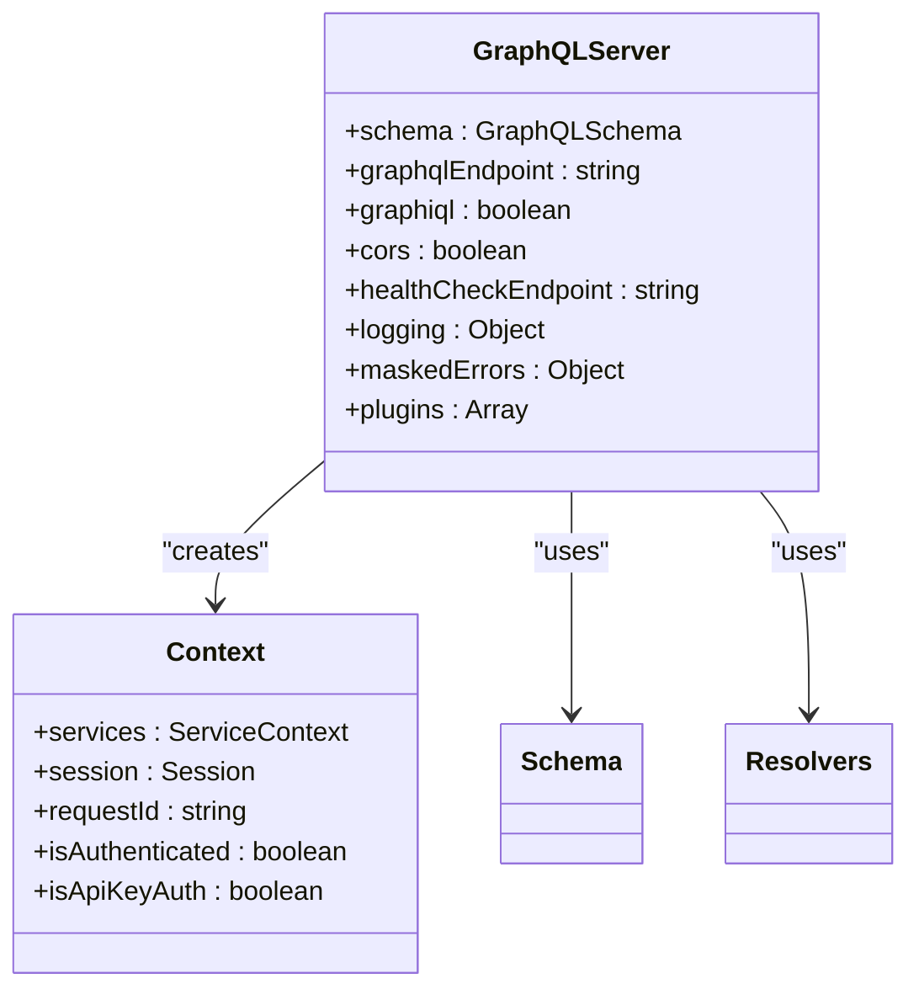
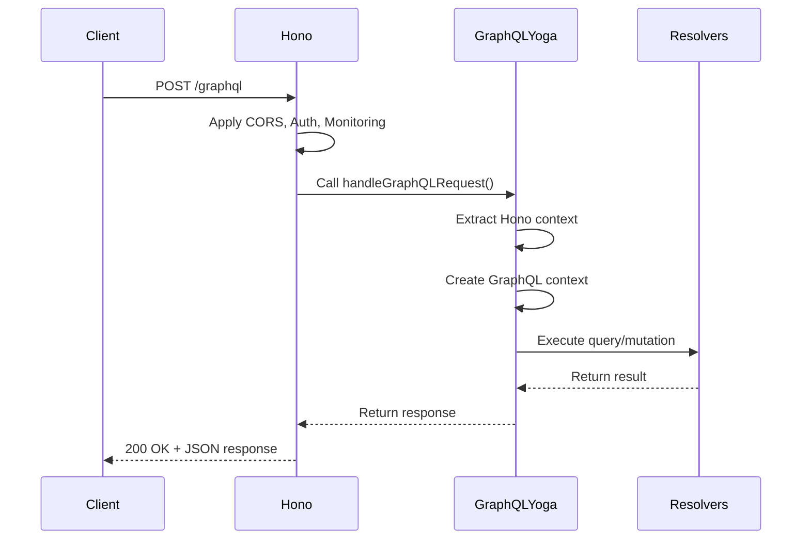
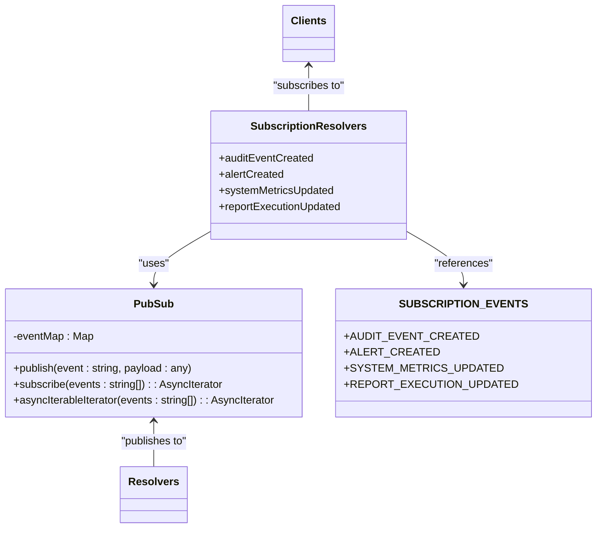
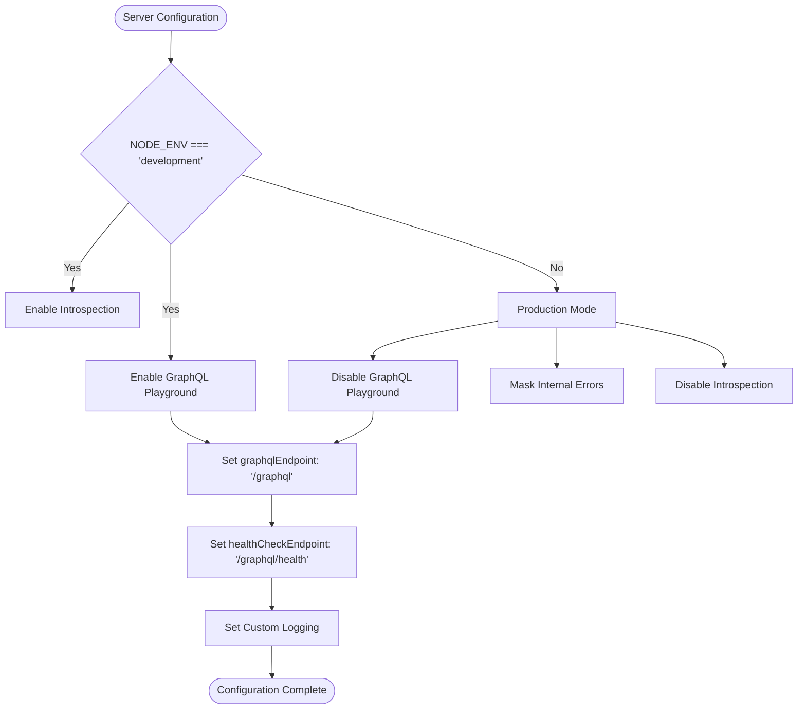
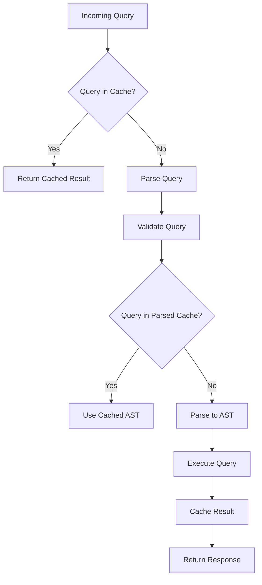

# Server Configuration

<cite>
**Referenced Files in This Document**   
- [index.ts](file://apps/server/src/index.ts)
- [server.ts](file://apps/server/src/lib/graphql/server.ts)
- [index.ts](file://apps/server/src/lib/graphql/index.ts)
- [subscriptions.ts](file://apps/server/src/lib/graphql/resolvers/subscriptions.ts)
- [schema.ts](file://apps/server/src/lib/graphql/schema.ts)
- [resolvers/index.ts](file://apps/server/src/lib/graphql/resolvers/index.ts)
- [integration.test.ts](file://apps/server/src/lib/graphql/__tests__/integration.test.ts)
- [init.ts](file://apps/server/src/lib/hono/init.ts)
- [context.ts](file://apps/server/src/lib/hono/context.ts)
</cite>

## Table of Contents
1. [Introduction](#introduction)
2. [Project Structure](#project-structure)
3. [Core Components](#core-components)
4. [Architecture Overview](#architecture-overview)
5. [Detailed Component Analysis](#detailed-component-analysis)
6. [Dependency Analysis](#dependency-analysis)
7. [Performance Considerations](#performance-considerations)
8. [Troubleshooting Guide](#troubleshooting-guide)
9. [Conclusion](#conclusion)

## Introduction
This document provides comprehensive documentation for the GraphQL server setup and integration within the Hono-based application. It details how the GraphQL endpoint is mounted at /graphql, WebSocket support for subscriptions, server configuration options, middleware integration, startup sequence, performance considerations, and end-to-end request flow as demonstrated in integration tests.

## Project Structure
The server application follows a modular architecture with clear separation of concerns. The GraphQL implementation is located in the `apps/server/src/lib/graphql` directory, which contains dedicated modules for schema definition, resolvers, server configuration, and subscription handling.



**Diagram sources**
- [schema.ts](file://apps/server/src/lib/graphql/schema.ts)
- [resolvers/index.ts](file://apps/server/src/lib/graphql/resolvers/index.ts)
- [server.ts](file://apps/server/src/lib/graphql/server.ts)
- [subscriptions.ts](file://apps/server/src/lib/graphql/resolvers/subscriptions.ts)
- [index.ts](file://apps/server/src/index.ts)

**Section sources**
- [index.ts](file://apps/server/src/index.ts)
- [server.ts](file://apps/server/src/lib/graphql/server.ts)

## Core Components
The GraphQL server implementation consists of several core components that work together to provide a robust API endpoint. The main components include the GraphQL schema definition, resolver functions, server configuration, and subscription handling mechanism.

The integration between Hono and GraphQL is achieved through a middleware pattern where GraphQL requests are handled by a dedicated function that bridges the Hono context with the GraphQL Yoga server. This allows for seamless integration of authentication, error handling, and monitoring middleware across both REST and GraphQL endpoints.

**Section sources**
- [server.ts](file://apps/server/src/lib/graphql/server.ts)
- [index.ts](file://apps/server/src/lib/graphql/index.ts)
- [resolvers/index.ts](file://apps/server/src/lib/graphql/resolvers/index.ts)

## Architecture Overview
The GraphQL server is built on top of the Hono web framework using GraphQL Yoga as the GraphQL server implementation. The architecture follows a layered approach where the Hono router handles HTTP requests and routes them to the appropriate GraphQL handler.



**Diagram sources**
- [index.ts](file://apps/server/src/index.ts)
- [server.ts](file://apps/server/src/lib/graphql/server.ts)
- [init.ts](file://apps/server/src/lib/hono/init.ts)

## Detailed Component Analysis

### GraphQL Server Configuration
The GraphQL server is configured using GraphQL Yoga with specific options for endpoint configuration, development tools, and production security.



**Diagram sources**
- [server.ts](file://apps/server/src/lib/graphql/server.ts)
- [context.ts](file://apps/server/src/lib/hono/context.ts)

**Section sources**
- [server.ts](file://apps/server/src/lib/graphql/server.ts)

### GraphQL Endpoint Integration
The GraphQL endpoint is mounted at /graphql using the Hono router. The integration is handled through the `handleGraphQLRequest` function which bridges the Hono context with the GraphQL Yoga server.



**Diagram sources**
- [index.ts](file://apps/server/src/index.ts)
- [server.ts](file://apps/server/src/lib/graphql/server.ts)

**Section sources**
- [index.ts](file://apps/server/src/index.ts)
- [server.ts](file://apps/server/src/lib/graphql/server.ts)

### WebSocket Support for Subscriptions
The GraphQL server implements subscriptions using the GraphQL over WebSocket protocol through the PubSub pattern. The `graphql-subscriptions` package provides the PubSub implementation that enables real-time updates.



**Diagram sources**
- [subscriptions.ts](file://apps/server/src/lib/graphql/resolvers/subscriptions.ts)
- [server.ts](file://apps/server/src/lib/graphql/server.ts)

**Section sources**
- [subscriptions.ts](file://apps/server/src/lib/graphql/resolvers/subscriptions.ts)

### Server Configuration Options
The server configuration includes several options that control the behavior of the GraphQL endpoint, including introspection, playground availability, and debug mode toggles.



**Diagram sources**
- [server.ts](file://apps/server/src/lib/graphql/server.ts)
- [integration.test.ts](file://apps/server/src/lib/graphql/__tests__/integration.test.ts)

**Section sources**
- [server.ts](file://apps/server/src/lib/graphql/server.ts)
- [integration.test.ts](file://apps/server/src/lib/graphql/__tests__/integration.test.ts)

### Request Processing Pipeline
The request processing pipeline handles batching, persisted queries, and CORS policies through middleware integration.


**Diagram sources**
- [index.ts](file://apps/server/src/index.ts)
- [server.ts](file://apps/server/src/lib/graphql/server.ts)
- [init.ts](file://apps/server/src/lib/hono/init.ts)

**Section sources**
- [index.ts](file://apps/server/src/index.ts)
- [init.ts](file://apps/server/src/lib/hono/init.ts)

## Dependency Analysis
The GraphQL server has several key dependencies that enable its functionality. The primary dependency is GraphQL Yoga, which provides the GraphQL server implementation. Additional dependencies include graphql-subscriptions for subscription handling, @graphql-tools/schema for schema creation, and various Hono middleware packages for cross-cutting concerns.

```mermaid
graph TD
GraphQLServer --> Yoga[graphql-yoga]
GraphQLServer --> Tools[@graphql-tools/schema]
GraphQLServer --> Subscriptions[graphql-subscriptions]
GraphQLServer --> Hono[@hono/node-server]
Yoga --> Express[express]
Yoga --> Graphql[graphql]
Subscriptions --> NodeEvents[events]
Hono --> Cors[hono/cors]
Hono --> Trpc[@hono/trpc-server]
```

**Diagram sources**
- [package.json](file://apps/server/package.json)
- [server.ts](file://apps/server/src/lib/graphql/server.ts)

## Performance Considerations
The GraphQL server implementation includes several performance optimizations to ensure efficient query processing and response delivery.

### Query Parsing and Validation Caching
The server leverages GraphQL Yoga's built-in caching mechanisms for query parsing and validation. This reduces the computational overhead for repeated queries and improves response times.

### Response Compression
The server implements response compression through Hono's built-in middleware, reducing bandwidth usage and improving response times for large query results.

### Connection Pooling
Database connections are managed through connection pooling, which reduces the overhead of establishing new connections for each request.

### Redis Caching
Frequently accessed data is cached in Redis, reducing database load and improving response times for common queries.



**Diagram sources**
- [server.ts](file://apps/server/src/lib/graphql/server.ts)
- [init.ts](file://apps/server/src/lib/hono/init.ts)

**Section sources**
- [server.ts](file://apps/server/src/lib/graphql/server.ts)
- [init.ts](file://apps/server/src/lib/hono/init.ts)

## Troubleshooting Guide
This section provides guidance for troubleshooting common issues with the GraphQL server implementation.

### Common Issues and Solutions
- **GraphQL Playground not accessible**: Ensure NODE_ENV is not set to 'production' as the playground is disabled in production mode.
- **Subscription connection failures**: Verify that the WebSocket connection is properly established and that the client is using the correct protocol (graphql-ws).
- **Authentication errors**: Check that the authentication middleware is properly configured and that the session or API key is being passed correctly.
- **CORS errors**: Verify that the CORS configuration in the server config matches the client's origin.
- **Slow query performance**: Check the monitoring middleware output and consider adding caching for frequently accessed data.

**Section sources**
- [server.ts](file://apps/server/src/lib/graphql/server.ts)
- [index.ts](file://apps/server/src/index.ts)
- [integration.test.ts](file://apps/server/src/lib/graphql/__tests__/integration.test.ts)

## Conclusion
The GraphQL server implementation provides a robust and feature-complete API endpoint integrated with the Hono web framework. The architecture follows best practices for security, performance, and maintainability, with clear separation of concerns and comprehensive middleware support. The implementation supports both query/mutation operations and real-time subscriptions through WebSockets, providing a complete GraphQL experience for clients.

The server configuration options allow for flexible deployment in different environments, with appropriate security measures in place for production use. The integration with Hono's middleware system ensures consistent handling of cross-cutting concerns such as authentication, rate limiting, and monitoring across both REST and GraphQL endpoints.