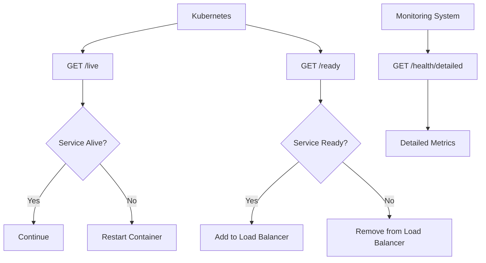

# Health API

<cite>
**Referenced Files in This Document**   
- [health-api.ts](file://apps/server/src/routes/health-api.ts)
- [health.ts](file://apps/server/src/lib/services/health.ts)
- [health.ts](file://apps/server/src/routers/health.ts)
</cite>

## Table of Contents
1. [Introduction](#introduction)
2. [Health Endpoints](#health-endpoints)
3. [Response Schema](#response-schema)
4. [HTTP Status Codes](#http-status-codes)
5. [Use Cases](#use-cases)
6. [Caching and Rate Limiting](#caching-and-rate-limiting)
7. [Versioning and Authentication](#versioning-and-authentication)
8. [Examples](#examples)
9. [Integration with Kubernetes and Monitoring](#integration-with-kubernetes-and-monitoring)

## Introduction
The Health API provides endpoints to monitor the health and readiness of the system. These endpoints are used for liveness and readiness probes in container orchestration platforms like Kubernetes, as well as for monitoring system health and performance.

**Section sources**
- [health-api.ts](file://apps/server/src/routes/health-api.ts#L1-L50)

## Health Endpoints

### GET /health
The `GET /health` endpoint performs a basic health check to determine if the server is operational. It returns a simple status indicating whether the server is healthy.

### GET /ready
The `GET /ready` endpoint serves as a readiness probe, checking if the service is ready to accept traffic. It verifies the status of critical dependencies such as the database, Redis, authentication service, and migrations.

### GET /live
The `GET /live` endpoint acts as a liveness probe, determining if the service is alive and responsive. It performs a minimal check to ensure the process is running.

### GET /health/detailed
The `GET /health/detailed` endpoint provides comprehensive health status, including service checks, system metrics, and performance data. This endpoint is useful for detailed diagnostics and monitoring.

### GET /health/database
The `GET /health/database` endpoint returns detailed health information about the database, including connection pool status, query cache, partitions, and performance.

**Section sources**
- [health-api.ts](file://apps/server/src/routes/health-api.ts#L96-L537)

## Response Schema

### Basic Health Response
```json
{
  "status": "healthy",
  "timestamp": "2023-09-15T10:00:00Z",
  "environment": "production",
  "version": "1.0.0",
  "uptime": 3600
}
```

### Detailed Health Response
```json
{
  "status": "healthy",
  "timestamp": "2023-09-15T10:00:00Z",
  "environment": "production",
  "version": "1.0.0",
  "uptime": 3600,
  "checks": [
    {
      "name": "Database",
      "status": "healthy",
      "responseTime": 12,
      "message": "Database connection successful",
      "lastChecked": "2023-09-15T10:00:00Z"
    },
    {
      "name": "Redis",
      "status": "healthy",
      "responseTime": 3,
      "message": "Redis connection successful",
      "lastChecked": "2023-09-15T10:00:00Z"
    }
  ],
  "system": {
    "memory": {
      "used": 1048576,
      "total": 2097152,
      "percentage": 50
    },
    "cpu": {
      "usage": 0.75,
      "loadAverage": [0.5, 0.7, 1.0]
    }
  },
  "services": {
    "database": {
      "name": "Database",
      "status": "healthy",
      "responseTime": 12,
      "message": "Database connection successful",
      "lastChecked": "2023-09-15T10:00:00Z"
    },
    "redis": {
      "name": "Redis",
      "status": "healthy",
      "responseTime": 3,
      "message": "Redis connection successful",
      "lastChecked": "2023-09-15T10:00:00Z"
    },
    "auth": {
      "name": "Authentication",
      "status": "healthy",
      "responseTime": 5,
      "message": "Authentication service operational",
      "lastChecked": "2023-09-15T10:00:00Z"
    },
    "audit": {
      "name": "Audit Service",
      "status": "healthy",
      "responseTime": 8,
      "message": "Audit service operational",
      "lastChecked": "2023-09-15T10:00:00Z"
    }
  },
  "metrics": {
    "requestsPerSecond": 100,
    "averageResponseTime": 25,
    "errorRate": 0.01,
    "activeConnections": 50
  }
}
```

### Readiness Response
```json
{
  "status": "ready",
  "timestamp": "2023-09-15T10:00:00Z",
  "checks": {
    "database": true,
    "redis": true,
    "auth": true,
    "migrations": true
  }
}
```

**Section sources**
- [health-api.ts](file://apps/server/src/routes/health-api.ts#L44-L156)

## HTTP Status Codes
- **200 OK**: The service is healthy and operational.
- **503 Service Unavailable**: The service is unhealthy or not ready to accept traffic.

## Use Cases

### Liveness Probes
The `GET /live` endpoint is used by Kubernetes to determine if the container should be restarted. If the endpoint returns a 503 status, Kubernetes will restart the container.

### Readiness Probes
The `GET /ready` endpoint is used by Kubernetes to determine if the container is ready to accept traffic. If the endpoint returns a 503 status, the container will not receive traffic.

### Monitoring
The `GET /health/detailed` endpoint is used by monitoring systems to collect detailed health and performance metrics.

**Section sources**
- [health-api.ts](file://apps/server/src/routes/health-api.ts#L302-L343)

## Caching and Rate Limiting

### Caching
The `GET /health` endpoint uses caching to improve performance. The health status is cached for 30 seconds, reducing the load on the system.

### Rate Limiting
The health endpoints are exempt from rate limiting to ensure they are always accessible for monitoring and orchestration purposes.

**Section sources**
- [health.ts](file://apps/server/src/lib/services/health.ts#L30-L50)

## Versioning and Authentication

### Versioning
The Health API is versioned as v1. The version is included in the response under the `version` field.

### Authentication
The health endpoints do not require authentication. However, an optional API key can be provided for extended diagnostics.

**Section sources**
- [health-api.ts](file://apps/server/src/routes/health-api.ts#L302-L343)

## Examples

### Curl Command for Local Health Check
```bash
curl http://localhost:3000/health
```

### Curl Command for Remote Health Check
```bash
curl https://api.example.com/health
```

### Curl Command for Detailed Health Check
```bash
curl https://api.example.com/health/detailed
```

### Curl Command for Readiness Probe
```bash
curl https://api.example.com/ready
```

### Curl Command for Liveness Probe
```bash
curl https://api.example.com/live
```

**Section sources**
- [health-api.ts](file://apps/server/src/routes/health-api.ts#L302-L343)

## Integration with Kubernetes and Monitoring

### Kubernetes Probes
The Health API integrates seamlessly with Kubernetes probes. The `GET /live` and `GET /ready` endpoints are configured in the Kubernetes deployment to manage container lifecycle.

### Monitoring Systems
The `GET /health/detailed` endpoint provides comprehensive data for monitoring systems like Prometheus and Grafana. This data can be used to create dashboards and alerts.



**Diagram sources**
- [health-api.ts](file://apps/server/src/routes/health-api.ts#L302-L343)
- [health.ts](file://apps/server/src/lib/services/health.ts#L30-L50)

**Section sources**
- [health-api.ts](file://apps/server/src/routes/health-api.ts#L302-L343)
- [health.ts](file://apps/server/src/lib/services/health.ts#L30-L50)