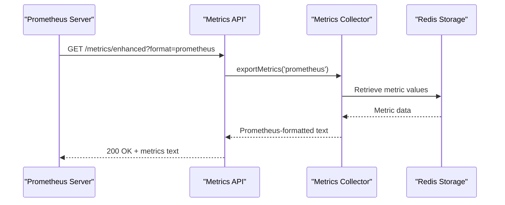
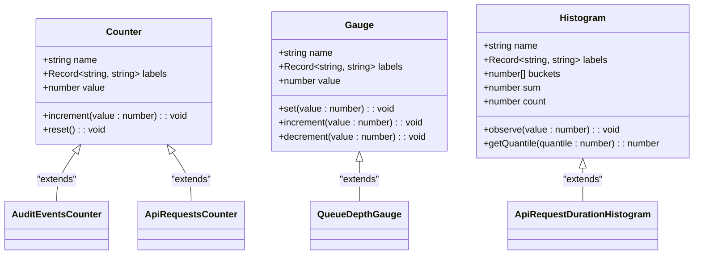
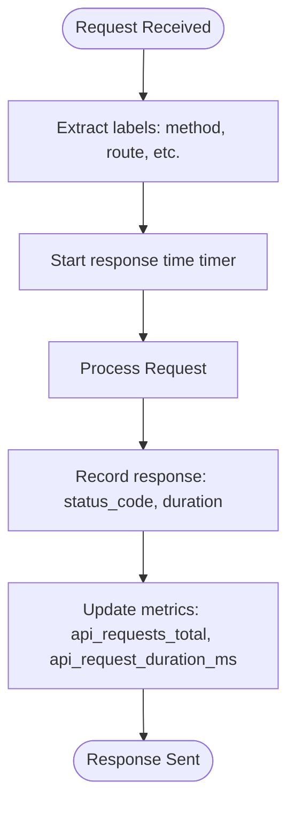
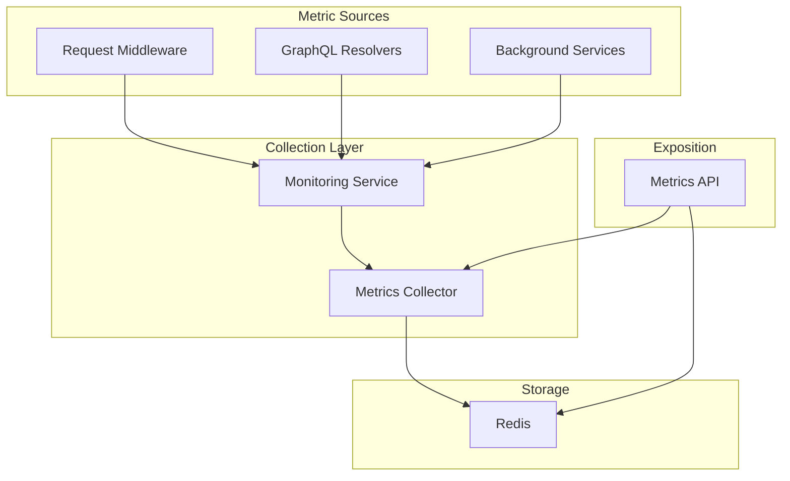

# Metrics API

<cite>
**Referenced Files in This Document**   
- [observability-api.ts](file://apps/server/src/routes/observability-api.ts)
- [index.ts](file://apps/worker/src/index.ts)
- [monitoring.ts](file://packages/audit/src/monitor/monitoring.ts)
- [metrics-collector.ts](file://packages/audit/src/monitor/metrics-collector.ts)
- [monitoring-types.ts](file://packages/audit/src/monitor/monitoring-types.ts)
- [monitoring.ts](file://apps/server/src/lib/middleware/monitoring.ts)
</cite>

## Table of Contents
1. [Metrics API Overview](#metrics-api-overview)
2. [Endpoint Details](#endpoint-details)
3. [Metric Types and Semantics](#metric-types-and-semantics)
4. [Response Format and Structure](#response-format-and-structure)
5. [Metric Collection Mechanisms](#metric-collection-mechanisms)
6. [Security and Access Control](#security-and-access-control)
7. [Integration with Monitoring Stacks](#integration-with-monitoring-stacks)
8. [Alerting Rules and Use Cases](#alerting-rules-and-use-cases)
9. [Example Output](#example-output)

## Metrics API Overview

The Metrics API provides system and audit-related metrics in Prometheus format through the `/metrics/enhanced` endpoint. This endpoint is designed for integration with monitoring systems like Prometheus, Grafana, and Alertmanager. The metrics are collected from various sources including request middleware, GraphQL resolvers, and background services. The API is versioned (v1) and provides stability guarantees for metric names and labels.

**Section sources**
- [observability-api.ts](file://apps/server/src/routes/observability-api.ts#L1-L400)
- [index.ts](file://apps/worker/src/index.ts#L170-L369)

## Endpoint Details

### GET /metrics/enhanced

The `/metrics/enhanced` endpoint exposes system and audit-related metrics in Prometheus format. It supports both JSON and Prometheus text format responses through the `format` query parameter. When no format is specified, the default is JSON.

- **Method**: GET
- **Path**: `/metrics/enhanced`
- **Authentication**: None (unauthenticated access)
- **Response Format**: `text/plain` for Prometheus format, `application/json` for JSON format
- **Version**: v1
- **Stability**: Stable - metric names and labels are guaranteed to remain consistent across minor version updates

The endpoint is accessible via internal network only, ensuring that sensitive metrics are not exposed to external networks. The metrics are scraped at regular intervals by monitoring systems.



**Diagram sources**
- [observability-api.ts](file://apps/server/src/routes/observability-api.ts#L1-L400)
- [index.ts](file://apps/worker/src/index.ts#L170-L369)
- [metrics-collector.ts](file://packages/audit/src/monitor/metrics-collector.ts#L1-L386)

**Section sources**
- [observability-api.ts](file://apps/server/src/routes/observability-api.ts#L1-L400)
- [index.ts](file://apps/worker/src/index.ts#L170-L369)

## Metric Types and Semantics

The Metrics API exposes three primary types of metrics: counters, gauges, and histograms. Each metric includes labels that provide additional context and enable dimensional analysis.

### Counters

Counters represent monotonically increasing values that track the total number of occurrences of specific events. They are reset only when the service restarts.

- **audit_events_total**: Total number of audit events processed
  - Labels: `status` (success, failure), `action_type` (login, data_access, etc.)
- **api_requests_total**: Total number of API requests served
  - Labels: `method` (GET, POST, PUT, DELETE), `status_code` (200, 404, 500, etc.), `route` (endpoint path)
- **alerts_generated_total**: Total number of alerts generated by the monitoring system
- **suspicious_patterns_detected_total**: Total number of suspicious patterns detected
- **errors_generated_total**: Total number of errors generated by the system

### Gauges

Gauges represent single numerical values that can arbitrarily go up and down. They are used to measure instantaneous values.

- **queue_depth**: Current depth of the processing queue
- **memory_usage_bytes**: Current memory usage of the process
- **cpu_usage_percent**: Current CPU usage percentage
- **active_connections**: Number of active database connections

### Histograms

Histograms track the distribution of observed values, typically response times or processing latencies. They provide quantile calculations (p50, p95, p99).

- **api_request_duration_ms**: Distribution of API request durations in milliseconds
  - Labels: `method`, `route`, `status_code`
- **event_processing_latency_ms**: Distribution of audit event processing latencies
  - Labels: `event_type`, `processing_stage`



**Diagram sources**
- [monitoring.ts](file://packages/audit/src/monitor/monitoring.ts#L1-L1417)
- [metrics-collector.ts](file://packages/audit/src/monitor/metrics-collector.ts#L1-L386)
- [monitoring-types.ts](file://packages/audit/src/monitor/monitoring-types.ts#L1-L198)

**Section sources**
- [monitoring.ts](file://packages/audit/src/monitor/monitoring.ts#L1-L1417)
- [metrics-collector.ts](file://packages/audit/src/monitor/metrics-collector.ts#L1-L386)
- [monitoring-types.ts](file://packages/audit/src/monitor/monitoring-types.ts#L1-L198)

## Response Format and Structure

The `/metrics/enhanced` endpoint returns metrics in either JSON or Prometheus text format, depending on the `format` query parameter. When `format=prometheus`, the response is in plain text with a `text/plain` content type, conforming to the Prometheus exposition format.

### Prometheus Format Structure

The Prometheus format consists of metric samples, each on a separate line, with the following structure:

```
metric_name{label_name="label_value",...} value timestamp
```

- **metric_name**: Name of the metric (e.g., `api_request_duration_ms_count`)
- **labels**: Optional key-value pairs enclosed in curly braces that provide additional dimensions
- **value**: Numeric value of the metric sample
- **timestamp**: Optional Unix timestamp in milliseconds (usually omitted)

The endpoint automatically generates multiple time series for histograms, including:
- `_count`: Total number of observations
- `_sum`: Total sum of all observed values
- `_bucket`: Cumulative count of observations in each bucket

### JSON Format Structure

When `format=json`, the response is a JSON object containing all metrics with their values and metadata. This format is primarily intended for debugging and development purposes.

```json
{
  "metrics": "# HELP api_requests_total Total number of API requests\n# TYPE api_requests_total counter\napi_requests_total{method=\"GET\",route=\"/metrics/enhanced\",status_code=\"200\"} 42\n..."
}
```

**Section sources**
- [observability-api.ts](file://apps/server/src/routes/observability-api.ts#L1-L400)
- [index.ts](file://apps/worker/src/index.ts#L170-L369)
- [metrics-collector.ts](file://packages/audit/src/monitor/metrics-collector.ts#L1-L386)

## Metric Collection Mechanisms

Metrics are collected from multiple sources throughout the system, including request middleware, GraphQL resolvers, and background services. The collection is performed asynchronously to minimize performance impact on the main application flow.

### Request Middleware

The monitoring middleware intercepts HTTP requests and responses to collect API-related metrics. It records request duration, status codes, and other relevant information.



**Diagram sources**
- [monitoring.ts](file://apps/server/src/lib/middleware/monitoring.ts#L1-L100)
- [observability-api.ts](file://apps/server/src/routes/observability-api.ts#L1-L400)

**Section sources**
- [monitoring.ts](file://apps/server/src/lib/middleware/monitoring.ts#L1-L100)

### GraphQL Resolvers

GraphQL resolvers collect metrics related to query execution, including execution time, error rates, and field-level performance. Each resolver can increment counters and record histogram observations.

### Background Services

Background services, such as the audit worker, collect metrics related to event processing, queue depth, and system health. These metrics are stored in Redis and aggregated for the `/metrics/enhanced` endpoint.

The metrics collector uses Redis as a backend storage, with keys prefixed by `metrics:`. Counters are implemented using Redis INCR commands, while gauges and histograms use SET and custom aggregation logic.



**Diagram sources**
- [monitoring.ts](file://packages/audit/src/monitor/monitoring.ts#L1-L1417)
- [metrics-collector.ts](file://packages/audit/src/monitor/metrics-collector.ts#L1-L386)
- [index.ts](file://apps/worker/src/index.ts#L170-L369)

**Section sources**
- [monitoring.ts](file://packages/audit/src/monitor/monitoring.ts#L1-L1417)
- [metrics-collector.ts](file://packages/audit/src/monitor/metrics-collector.ts#L1-L386)
- [index.ts](file://apps/worker/src/index.ts#L170-L369)

## Security and Access Control

The `/metrics/enhanced` endpoint is unauthenticated but should only be exposed on internal networks. This design decision balances accessibility for monitoring systems with security considerations.

### Network-Level Security

- The endpoint is only accessible from internal IP ranges
- Firewall rules restrict access to monitoring servers
- No sensitive personal information is included in metric labels
- The service is deployed in a private Kubernetes namespace with network policies

### Data Privacy

Metric labels are carefully designed to avoid including personally identifiable information (PII). User identifiers are hashed before being used as labels, and IP addresses are truncated to prevent identification.

### Security Considerations

While the endpoint is unauthenticated, it does not expose sensitive operational details that could be exploited by attackers. The metrics focus on system performance and audit events rather than application logic or data.

**Section sources**
- [observability-api.ts](file://apps/server/src/routes/observability-api.ts#L1-L400)
- [k8s](file://apps/server/k8s#L1-L100)

## Integration with Monitoring Stacks

The Metrics API is designed for seamless integration with standard monitoring stacks, particularly Prometheus and Grafana.

### Prometheus Configuration

To scrape metrics from the endpoint, add the following configuration to your `prometheus.yml`:

```yaml
scrape_configs:
  - job_name: 'smart-logs'
    scrape_interval: 15s
    static_configs:
      - targets: ['smart-logs-server:3000']
    metrics_path: /metrics/enhanced
    params:
      format: ['prometheus']
```

The scrape interval is set to 15 seconds, which provides a good balance between granularity and performance. The `format=prometheus` parameter ensures the endpoint returns metrics in the correct format.

### Grafana Dashboards

Grafana dashboards can be created using the collected metrics to visualize system performance, audit event trends, and alert statistics. Example dashboard panels include:

- API request rate (requests per second)
- Error rate over time
- P95 and P99 API response times
- Audit event processing latency
- Active alert count by severity

### Alertmanager Integration

Alerting rules can be defined in Prometheus to trigger notifications through Alertmanager when certain thresholds are exceeded.

**Section sources**
- [observability-api.ts](file://apps/server/src/routes/observability-api.ts#L1-L400)
- [docker-compose.yml](file://docker-compose.yml#L1-L50)

## Alerting Rules and Use Cases

The collected metrics enable the creation of effective alerting rules for monitoring system health and performance.

### Example Alerting Rules

```yaml
# High error rate
- alert: HighApiErrorRate
  expr: rate(api_requests_total{status_code=~"5.."}[5m]) / rate(api_requests_total[5m]) > 0.05
  for: 10m
  labels:
    severity: critical
  annotations:
    summary: "High API error rate ({{ $value | humanize }})"
    description: "More than 5% of API requests are failing over the last 5 minutes."

# High latency
- alert: HighApiLatency
  expr: histogram_quantile(0.99, sum(rate(api_request_duration_ms_bucket[5m])) by (le)) > 1000
  for: 10m
  labels:
    severity: warning
  annotations:
    summary: "High API latency ({{ $value }}ms)"
    description: "The 99th percentile API response time is above 1 second."

# Suspicious activity
- alert: SuspiciousPatternDetected
  expr: increase(suspicious_patterns_detected_total[1h]) > 5
  for: 5m
  labels:
    severity: critical
  annotations:
    summary: "Multiple suspicious patterns detected ({{ $value }})"
    description: "More than 5 suspicious patterns have been detected in the last hour."

# System resource usage
- alert: HighMemoryUsage
  expr: memory_usage_percent > 80
  for: 15m
  labels:
    severity: warning
  annotations:
    summary: "High memory usage ({{ $value }}%)"
    description: "The application is using more than 80% of available memory."
```

### Use Cases

1. **Performance Monitoring**: Track API response times and error rates to identify performance bottlenecks.
2. **Security Monitoring**: Detect unusual patterns in audit events that may indicate security incidents.
3. **Capacity Planning**: Monitor queue depth and processing rates to plan for scaling.
4. **Incident Response**: Use historical metrics to diagnose and resolve system issues.
5. **Compliance Reporting**: Generate reports on system availability and security events.

**Section sources**
- [monitoring.ts](file://packages/audit/src/monitor/monitoring.ts#L1-L1417)
- [observability-api.ts](file://apps/server/src/routes/observability-api.ts#L1-L400)

## Example Output

The following is an example of the Prometheus-formatted output from the `/metrics/enhanced` endpoint:

```
# HELP api_requests_total Total number of API requests
# TYPE api_requests_total counter
api_requests_total{method="GET",route="/metrics/enhanced",status_code="200"} 42
api_requests_total{method="POST",route="/api/events",status_code="201"} 156
api_requests_total{method="GET",route="/api/events",status_code="200"} 892
api_requests_total{method="GET",route="/api/events",status_code="404"} 12

# HELP api_request_duration_ms API request duration in milliseconds
# TYPE api_request_duration_ms histogram
api_request_duration_ms_bucket{le="10",method="GET",route="/metrics/enhanced"} 35
api_request_duration_ms_bucket{le="50",method="GET",route="/metrics/enhanced"} 40
api_request_duration_ms_bucket{le="100",method="GET",route="/metrics/enhanced"} 42
api_request_duration_ms_bucket{le="200",method="GET",route="/metrics/enhanced"} 42
api_request_duration_ms_bucket{le="+Inf",method="GET",route="/metrics/enhanced"} 42
api_request_duration_ms_count{method="GET",route="/metrics/enhanced"} 42
api_request_duration_ms_sum{method="GET",route="/metrics/enhanced"} 1856

# HELP audit_events_total Total number of audit events processed
# TYPE audit_events_total counter
audit_events_total{action_type="login",status="success"} 234
audit_events_total{action_type="login",status="failure"} 45
audit_events_total{action_type="data_access",status="success"} 567

# HELP queue_depth Current depth of the processing queue
# TYPE queue_depth gauge
queue_depth 3

# HELP memory_usage_bytes Current memory usage of the process
# TYPE memory_usage_bytes gauge
memory_usage_bytes 125829120

# HELP suspicious_patterns_detected_total Total number of suspicious patterns detected
# TYPE suspicious_patterns_detected_total counter
suspicious_patterns_detected_total{pattern_type="FAILED_AUTH"} 3
suspicious_patterns_detected_total{pattern_type="UNAUTHORIZED_ACCESS"} 1
```

This output demonstrates the three main metric types (counter, histogram, and gauge) with appropriate labels and documentation comments. Monitoring systems can parse this text format and create time series for visualization and alerting.

**Section sources**
- [observability-api.ts](file://apps/server/src/routes/observability-api.ts#L1-L400)
- [metrics-collector.ts](file://packages/audit/src/monitor/metrics-collector.ts#L1-L386)
- [index.ts](file://apps/worker/src/index.ts#L170-L369)