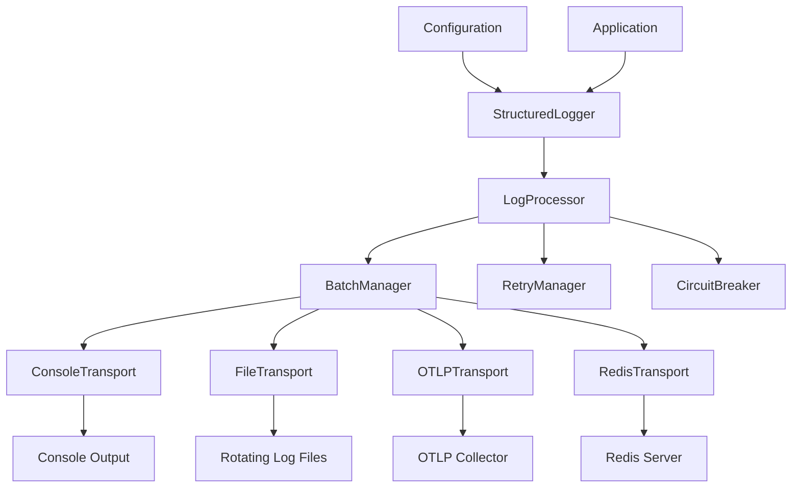
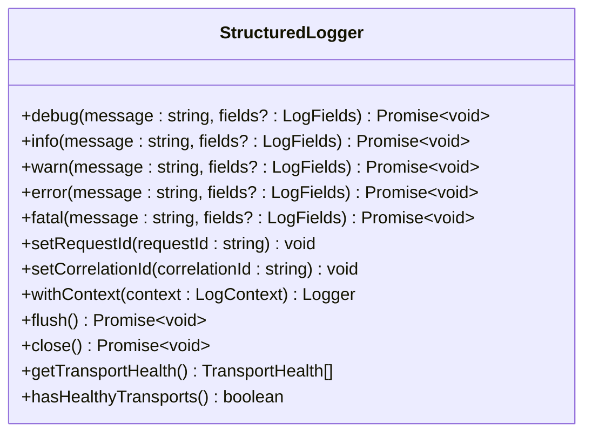
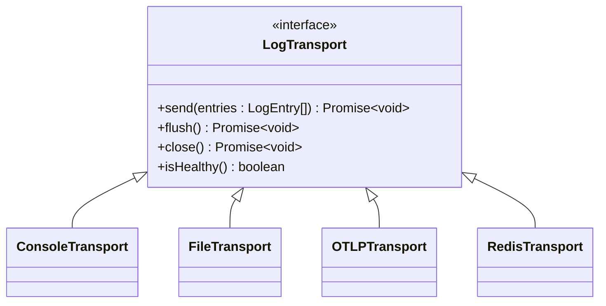
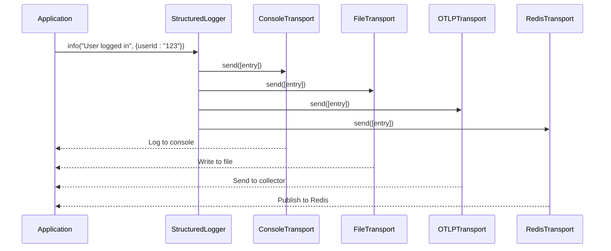
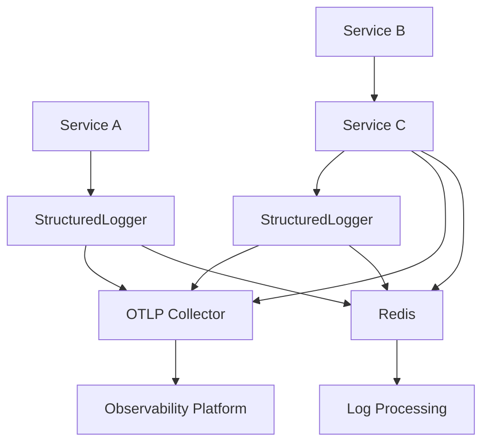
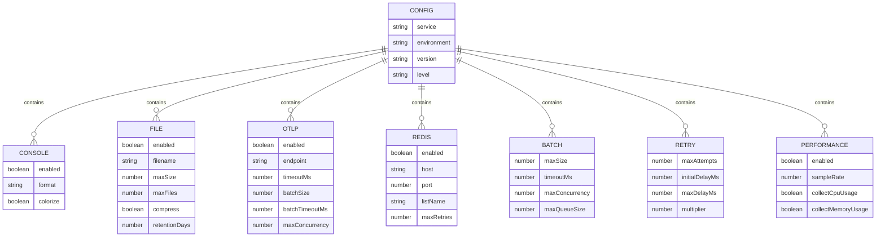
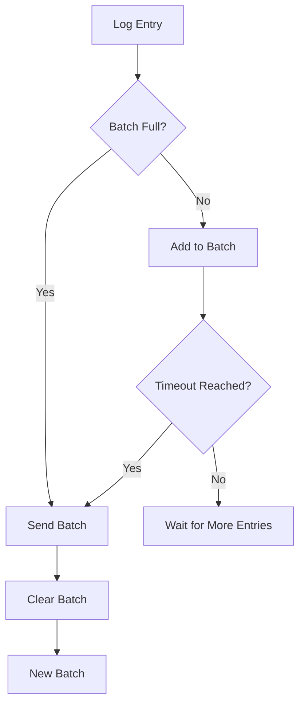
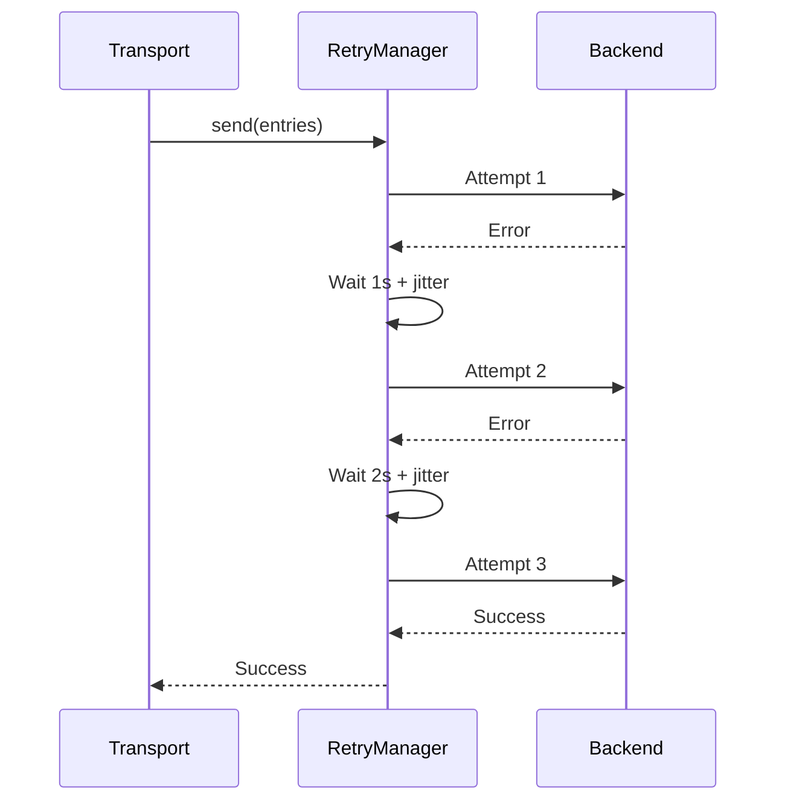
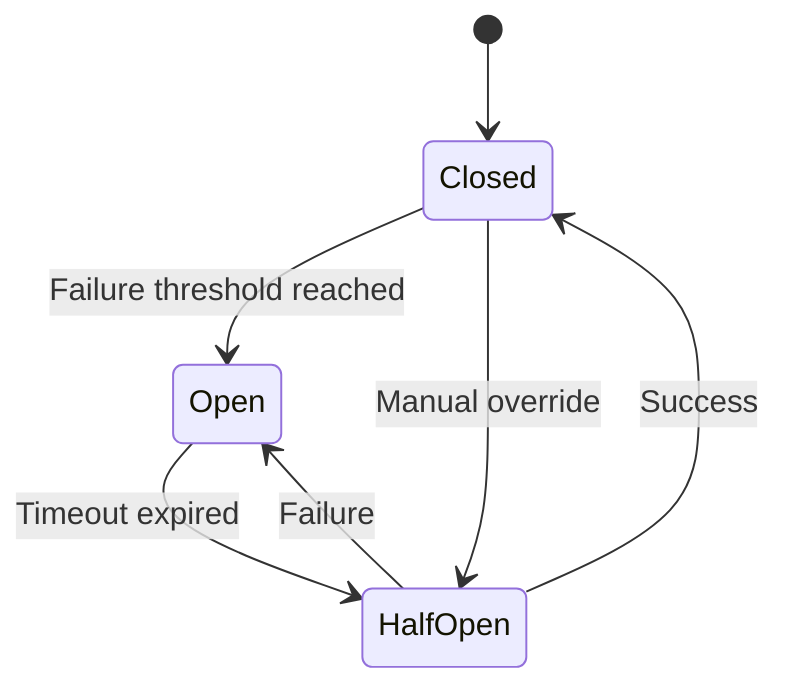

# Structured Logging Architecture

<cite>
**Referenced Files in This Document**   
- [structured-logger.ts](file://packages/logs/src/core/structured-logger.ts)
- [otlp-transport.ts](file://packages/logs/src/transports/otlp-transport.ts)
- [redis-transport.ts](file://packages/logs/src/transports/redis-transport.ts)
- [console-transport.ts](file://packages/logs/src/transports/console-transport.ts)
- [file-transport.ts](file://packages/logs/src/transports/file-transport.ts)
- [batch-manager.ts](file://packages/logs/src/core/batch-manager.ts)
- [circuit-breaker.ts](file://packages/logs/src/core/circuit-breaker.ts)
- [retry-manager.ts](file://packages/logs/src/core/retry-manager.ts)
- [config.ts](file://packages/logs/src/types/config.ts)
- [index.ts](file://packages/logs/src/index.ts)
- [migration-utils.ts](file://packages/logs/src/compatibility/migration-utils.ts)
- [run-example.mjs](file://packages/logs/examples/run-example.mjs)
</cite>

## Table of Contents
1. [Introduction](#introduction)
2. [Architecture Overview](#architecture-overview)
3. [Core Components](#core-components)
4. [API Interfaces](#api-interfaces)
5. [Integration Patterns](#integration-patterns)
6. [Configuration Management](#configuration-management)
7. [Reliability Features](#reliability-features)
8. [Practical Examples](#practical-examples)
9. [Migration Guidance](#migration-guidance)
10. [Troubleshooting](#troubleshooting)

## Introduction

The Structured Logging Architecture provides a comprehensive, multi-transport logging solution designed for modern distributed systems. This architecture enables applications to emit structured log entries that can be efficiently processed, stored, and analyzed across various destinations.

The system is built with production readiness in mind, featuring asynchronous operations, batching, retry mechanisms, circuit breakers, and graceful shutdown capabilities. It supports multiple transport mechanisms including console, file, OTLP (OpenTelemetry Protocol), and Redis, allowing flexible integration with various monitoring and observability platforms.

This documentation covers the architecture's design principles, core components, API interfaces, integration patterns, and practical usage examples to help developers effectively implement and maintain the logging system.

## Architecture Overview

The Structured Logging Architecture follows a modular design with clear separation of concerns between the logger interface, transport mechanisms, and reliability components.



**Diagram sources**
- [structured-logger.ts](file://packages/logs/src/core/structured-logger.ts)
- [batch-manager.ts](file://packages/logs/src/core/batch-manager.ts)
- [otlp-transport.ts](file://packages/logs/src/transports/otlp-transport.ts)
- [redis-transport.ts](file://packages/logs/src/transports/redis-transport.ts)

**Section sources**
- [structured-logger.ts](file://packages/logs/src/core/structured-logger.ts)
- [index.ts](file://packages/logs/src/index.ts)

## Core Components

The architecture consists of several core components that work together to provide a robust logging solution.

### StructuredLogger

The primary entry point for the logging system, the StructuredLogger class provides a clean API for emitting log entries with various severity levels. It manages the logging context, including correlation IDs for distributed tracing, and coordinates the delivery of log entries to configured transports.

The logger operates asynchronously, returning Promises for all logging operations to prevent blocking the event loop. It also implements graceful shutdown patterns, ensuring that all pending log entries are delivered before the application terminates.

### Transport Mechanisms

The architecture supports multiple transport mechanisms, each implemented as a separate module with a consistent interface:

- **ConsoleTransport**: Outputs logs to stdout/stderr with support for pretty-printed or JSON formats
- **FileTransport**: Writes logs to rotating files with configurable size and time-based rotation
- **OTLPTransport**: Exports logs to OTLP-compatible collectors using HTTP/JSON with optional gzip compression
- **RedisTransport**: Publishes logs to Redis using lists, streams, or pub/sub patterns

Each transport implements the same interface, allowing them to be used interchangeably and combined in various configurations.

### Processing Pipeline

The logging pipeline includes several stages that process log entries before delivery:

1. **Context Enrichment**: Adding metadata like service name, environment, hostname, and process ID
2. **Batching**: Collecting multiple log entries into batches for efficient delivery
3. **Retry Management**: Handling transient failures with configurable retry policies
4. **Circuit Breaking**: Preventing cascading failures by temporarily halting operations during prolonged outages
5. **Delivery**: Transmitting log entries to the configured destination

This pipeline ensures reliable log delivery while maintaining application performance.

**Section sources**
- [structured-logger.ts](file://packages/logs/src/core/structured-logger.ts)
- [otlp-transport.ts](file://packages/logs/src/transports/otlp-transport.ts)
- [redis-transport.ts](file://packages/logs/src/transports/redis-transport.ts)
- [console-transport.ts](file://packages/logs/src/transports/console-transport.ts)
- [file-transport.ts](file://packages/logs/src/transports/file-transport.ts)

## API Interfaces

The architecture provides a consistent and intuitive API for logging operations.

### Logger Interface

The StructuredLogger class exposes the following methods:



**Diagram sources**
- [structured-logger.ts](file://packages/logs/src/core/structured-logger.ts)

### Log Entry Structure

All log entries follow a standardized structure with the following properties:

- **id**: Unique identifier for the log entry (UUID)
- **timestamp**: ISO timestamp of when the log was created
- **level**: Log severity level (debug, info, warn, error, fatal)
- **message**: Human-readable log message
- **correlationId**: Identifier for correlating related operations across services
- **requestId**: Identifier for tracking individual requests
- **fields**: Additional structured data as key-value pairs
- **metadata**: System-generated metadata including service, environment, hostname, and PID
- **source**: Name of the service that generated the log
- **version**: Application version

This structure ensures consistency across all logs and enables effective querying and analysis.

### Transport Interface

All transports implement a common interface that defines the contract for log delivery:



**Diagram sources**
- [structured-logger.ts](file://packages/logs/src/core/structured-logger.ts)
- [otlp-transport.ts](file://packages/logs/src/transports/otlp-transport.ts)
- [redis-transport.ts](file://packages/logs/src/transports/redis-transport.ts)

**Section sources**
- [structured-logger.ts](file://packages/logs/src/core/structured-logger.ts)
- [otlp-transport.ts](file://packages/logs/src/transports/otlp-transport.ts)
- [redis-transport.ts](file://packages/logs/src/transports/redis-transport.ts)

## Integration Patterns

The architecture supports several integration patterns to accommodate different deployment scenarios and requirements.

### Multi-Transport Configuration

Applications can configure multiple transports simultaneously, allowing logs to be sent to different destinations for various purposes:



**Diagram sources**
- [structured-logger.ts](file://packages/logs/src/core/structured-logger.ts)
- [otlp-transport.ts](file://packages/logs/src/transports/otlp-transport.ts)
- [redis-transport.ts](file://packages/logs/src/transports/redis-transport.ts)

### Development vs Production

Different configurations are recommended for development and production environments:

**Development Configuration:**
- Console output with pretty formatting and colors
- Lower log levels (debug) enabled
- No file logging or minimal file logging
- Optional OTLP for local observability

**Production Configuration:**
- JSON-formatted console output (for containerized environments)
- File logging with rotation and compression
- OTLP export to centralized observability platform
- Redis for real-time log processing
- Higher log levels (info or warn) to reduce volume

### Microservices Architecture

In a microservices environment, each service should have its own logger instance with service-specific configuration:



**Diagram sources**
- [structured-logger.ts](file://packages/logs/src/core/structured-logger.ts)
- [otlp-transport.ts](file://packages/logs/src/transports/otlp-transport.ts)
- [redis-transport.ts](file://packages/logs/src/transports/redis-transport.ts)

**Section sources**
- [structured-logger.ts](file://packages/logs/src/core/structured-logger.ts)
- [run-example.mjs](file://packages/logs/examples/run-example.mjs)

## Configuration Management

The architecture uses a comprehensive configuration system with runtime validation.

### Configuration Schema

Configuration is validated using Zod schemas that ensure all settings are correct and complete:



**Diagram sources**
- [config.ts](file://packages/logs/src/types/config.ts)

### Configuration Validation

All configurations are validated at runtime using the ConfigValidator class, which provides clear error messages for invalid configurations:

```typescript
import { ConfigValidator } from '@repo/logs'

const config = {
  service: 'my-service',
  environment: 'production',
  otlp: {
    enabled: true,
    endpoint: 'https://collector.example.com/v1/logs'
  }
}

// Validate configuration before use
const validatedConfig = ConfigValidator.validate(config)
const logger = new StructuredLogger(validatedConfig)
```

The validation process checks for required fields, valid values, and proper structure, preventing configuration errors that could lead to logging failures.

**Section sources**
- [config.ts](file://packages/logs/src/types/config.ts)

## Reliability Features

The architecture includes several reliability features to ensure log delivery even under adverse conditions.

### Batching

The DefaultBatchManager component collects log entries into batches for efficient delivery:



Batches are sent when they reach the configured size or when the timeout period expires, whichever comes first. This balances efficiency with latency requirements.

**Diagram sources**
- [batch-manager.ts](file://packages/logs/src/core/batch-manager.ts)

### Retry Mechanism

The DefaultRetryManager implements exponential backoff with jitter to handle transient failures:



The retry policy is configurable with parameters for maximum attempts, initial delay, maximum delay, and multiplier.

**Diagram sources**
- [retry-manager.ts](file://packages/logs/src/core/retry-manager.ts)

### Circuit Breaker

The DefaultCircuitBreaker prevents cascading failures by temporarily halting operations during prolonged outages:



The circuit breaker has three states:
- **Closed**: Normal operation, requests are allowed
- **Open**: Failure threshold exceeded, requests are rejected immediately
- **Half-Open**: After timeout, limited requests are allowed to test recovery

This pattern prevents overwhelming failing services with repeated requests.

**Diagram sources**
- [circuit-breaker.ts](file://packages/logs/src/core/circuit-breaker.ts)

**Section sources**
- [batch-manager.ts](file://packages/logs/src/core/batch-manager.ts)
- [retry-manager.ts](file://packages/logs/src/core/retry-manager.ts)
- [circuit-breaker.ts](file://packages/logs/src/core/circuit-breaker.ts)

## Practical Examples

This section provides practical examples of using the Structured Logging Architecture.

### Basic Usage

The simplest way to use the logger is with minimal configuration:

```typescript
import { StructuredLogger } from '@repo/logs'

const logger = new StructuredLogger({
  service: 'my-service',
  environment: 'development',
})

await logger.info('Application starting', { version: '1.0.0' })
await logger.flush()
await logger.close()
```

### Production Configuration

A more comprehensive configuration for production use:

```typescript
const logger = new StructuredLogger({
  service: 'payment-service',
  environment: 'production',
  console: { enabled: true, format: 'json', colorize: false },
  file: { 
    enabled: true, 
    filename: '/var/log/payment-service/app.log',
    maxSize: 50 * 1024 * 1024, // 50MB
    maxFiles: 10,
    compress: true,
    retentionDays: 90
  },
  otlp: { 
    enabled: true, 
    endpoint: 'https://collector.example.com/v1/logs',
    headers: { 'Authorization': 'Bearer token' }
  },
  redis: { 
    enabled: true, 
    host: 'redis.example.com', 
    port: 6379, 
    listName: 'payment-logs' 
  },
  batch: { maxSize: 200, timeoutMs: 10000 },
  retry: { maxAttempts: 5, initialDelayMs: 2000 }
})
```

### Context Management

Using context to add correlation information:

```typescript
// Set correlation ID for distributed tracing
logger.setCorrelationId('correlation-123')

// Create a child logger with additional context
const requestLogger = logger.withContext({
  requestId: 'request-456',
  userId: 'user-789'
})

await requestLogger.info('Processing payment', { amount: 99.99 })
```

**Section sources**
- [run-example.mjs](file://packages/logs/examples/run-example.mjs)
- [structured-logger.ts](file://packages/logs/src/core/structured-logger.ts)

## Migration Guidance

The architecture includes tools to help migrate from legacy logging systems.

### Configuration Migration

The ConfigMigrator class can convert legacy configuration formats to the new format:

```typescript
import { ConfigMigrator } from '@repo/logs/compatibility'

// Legacy configuration
const legacyConfig = {
  level: 'info',
  format: 'json',
  exporterType: 'otlp',
  exporterEndpoint: 'http://localhost:4318/v1/logs'
}

// Migrate to new format
const migratedConfig = ConfigMigrator.migrateLegacyConfig(legacyConfig)
const logger = new StructuredLogger(migratedConfig)
```

### Gradual Migration

Applications can use compatibility wrappers to gradually migrate:

```typescript
import { Compatibility } from '@repo/logs'

// Use legacy interface with new implementation
const legacyLogger = new Compatibility.LegacyLoggerWrapper({
  service: 'migrated-service',
  level: 'info'
})

// This uses the new StructuredLogger under the hood
legacyLogger.info('This works with old API')
```

The migration process can be done incrementally, allowing teams to update their codebase at their own pace while benefiting from the improved reliability and features of the new architecture.

**Section sources**
- [migration-utils.ts](file://packages/logs/src/compatibility/migration-utils.ts)
- [index.ts](file://packages/logs/src/compatibility/index.ts)

## Troubleshooting

This section provides guidance for diagnosing and resolving common issues.

### Common Issues and Solutions

| Issue | Possible Cause | Solution |
|------|---------------|----------|
| Logs not appearing in destination | Transport not enabled or misconfigured | Verify transport configuration and ensure enabled flag is true |
| High memory usage | Large log volume or backpressure | Increase batch size, reduce log level, or add file transport for buffering |
| Connection failures | Network issues or incorrect endpoint | Verify network connectivity and endpoint URL |
| Slow application performance | Synchronous logging or large payloads | Ensure using async methods and consider reducing log field size |
| Unflushed logs on shutdown | Missing flush/close calls | Always call flush() and close() in shutdown handlers |

### Health Monitoring

The logger provides methods to monitor transport health:

```typescript
// Check if logger has healthy transports
if (!logger.hasHealthyTransports()) {
  console.error('Logger has no healthy transports')
}

// Get detailed health status
const health = logger.getTransportHealth()
health.forEach(({ name, healthy, lastError }) => {
  if (!healthy) {
    console.error(`Transport ${name} is unhealthy:`, lastError)
  }
})
```

### Debugging Configuration

Enable debug mode to get detailed information about logger operations:

```typescript
const logger = new StructuredLogger({
  service: 'debug-service',
  environment: 'development',
  enableDebugMode: true,
  console: { enabled: true, format: 'pretty' }
})
```

When debug mode is enabled, the logger will output additional information about batch operations, retries, and other internal processes.

**Section sources**
- [structured-logger.ts](file://packages/logs/src/core/structured-logger.ts)
- [otlp-transport.ts](file://packages/logs/src/transports/otlp-transport.ts)
- [redis-transport.ts](file://packages/logs/src/transports/redis-transport.ts)