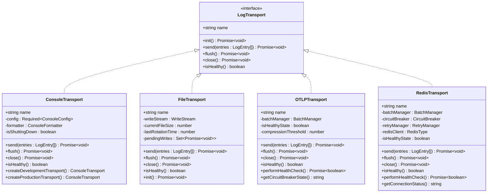
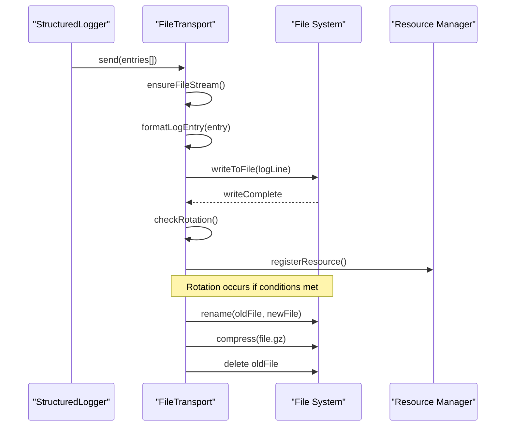
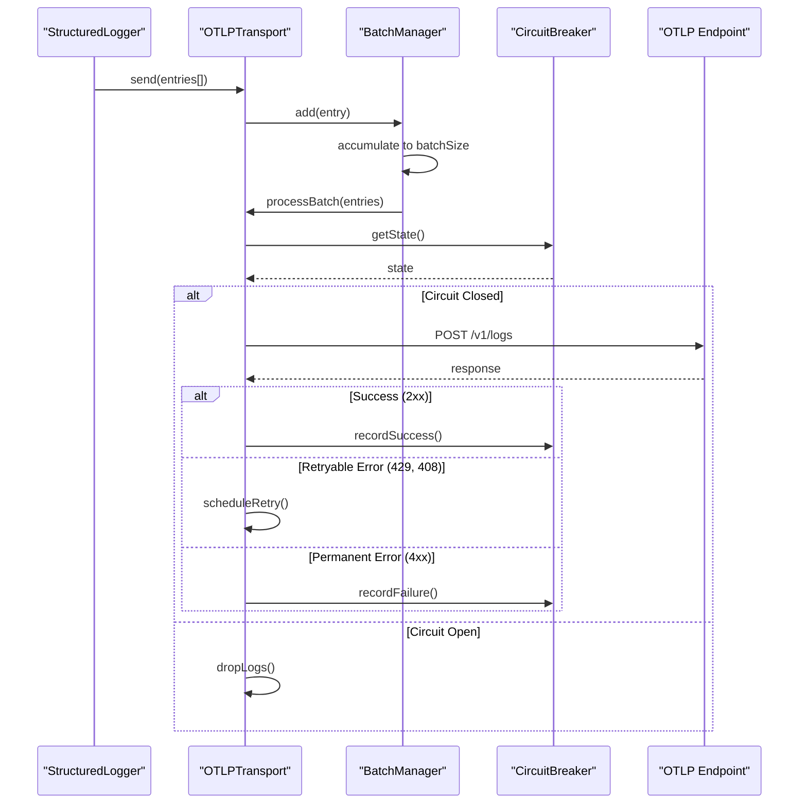
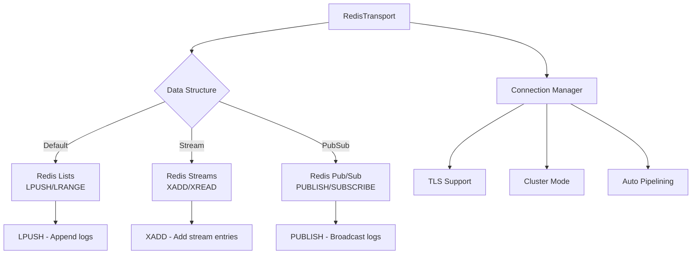
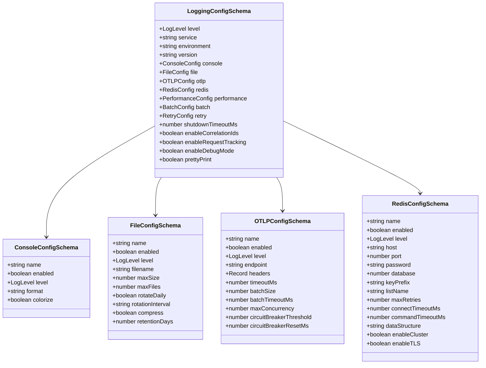

# Structured Logging Transports

<cite>
**Referenced Files in This Document**
- [packages/logs/src/transports/index.ts](file://packages/logs/src/transports/index.ts)
- [packages/logs/src/transports/console-transport.ts](file://packages/logs/src/transports/console-transport.ts)
- [packages/logs/src/transports/file-transport.ts](file://packages/logs/src/transports/file-transport.ts)
- [packages/logs/src/transports/otlp-transport.ts](file://packages/logs/src/transports/otlp-transport.ts)
- [packages/logs/src/transports/redis-transport.ts](file://packages/logs/src/transports/redis-transport.ts)
- [packages/logs/src/types/config.ts](file://packages/logs/src/types/config.ts)
- [packages/logs/src/types/transport.ts](file://packages/logs/src/types/transport.ts)
- [packages/logs/src/utils/console-formatter.ts](file://packages/logs/src/utils/console-formatter.ts)
- [packages/logs/examples/multi-transport-usage.ts](file://packages/logs/examples/multi-transport-usage.ts)
- [packages/logs/docs/getting-started.md](file://packages/logs/docs/getting-started.md)
- [packages/logs/docs/tutorials.md](file://packages/logs/docs/tutorials.md)
- [packages/logs/docs/troubleshooting.md](file://packages/logs/docs/troubleshooting.md)
</cite>

## Table of Contents
1. [Introduction](#introduction)
2. [Transport Architecture](#transport-architecture)
3. [Console Transport](#console-transport)
4. [File Transport](#file-transport)
5. [OTLP Transport](#otlp-transport)
6. [Redis Transport](#redis-transport)
7. [Configuration Management](#configuration-management)
8. [Integration Patterns](#integration-patterns)
9. [Performance Considerations](#performance-considerations)
10. [Troubleshooting Guide](#troubleshooting-guide)
11. [Best Practices](#best-practices)

## Introduction

The Structured Logging Transports system provides a comprehensive logging infrastructure with four distinct output destinations: Console, File, OTLP (OpenTelemetry Protocol), and Redis. Each transport is designed to meet specific use cases while maintaining a consistent interface through the `LogTransport` protocol.

The transport system emphasizes reliability, performance, and configurability. Each transport implements advanced features such as batching, compression, circuit breakers, retry mechanisms, and graceful shutdown procedures. The system supports multi-transport logging, allowing applications to send logs to multiple destinations simultaneously for redundancy and different analytical needs.

## Transport Architecture

All transports implement the `LogTransport` interface, ensuring consistent behavior across different output destinations:



**Diagram sources**
- [packages/logs/src/types/transport.ts](file://packages/logs/src/types/transport.ts#L1-L94)
- [packages/logs/src/transports/console-transport.ts](file://packages/logs/src/transports/console-transport.ts#L1-L50)
- [packages/logs/src/transports/file-transport.ts](file://packages/logs/src/transports/file-transport.ts#L1-L50)
- [packages/logs/src/transports/otlp-transport.ts](file://packages/logs/src/transports/otlp-transport.ts#L1-L50)
- [packages/logs/src/transports/redis-transport.ts](file://packages/logs/src/transports/redis-transport.ts#L1-L50)

**Section sources**
- [packages/logs/src/types/transport.ts](file://packages/logs/src/types/transport.ts#L1-L94)
- [packages/logs/src/transports/index.ts](file://packages/logs/src/transports/index.ts#L1-L6)

## Console Transport

The Console Transport provides real-time logging output with configurable formatting and colorization. It supports both development and production environments with specialized configuration options.

### Key Features

- **Dual Formatting Modes**: Pretty-print for development with colorization and JSON for production
- **Smart Level-Based Filtering**: Automatic filtering based on configured log levels
- **Error Handling**: Fallback mechanisms to prevent logging failures from breaking applications
- **Environment-Specific Configurations**: Built-in development and production transport creators

### Implementation Details

The Console Transport uses the `ConsoleFormatter` for sophisticated output formatting:

```typescript
// Development-friendly transport
const devTransport = ConsoleTransport.createDevelopmentTransport({
    showTimestamp: true,
    showLevel: true,
    showCorrelationId: true,
    showRequestId: true,
    showFields: true,
    showMetadata: true,
    showPerformance: true,
    timestampFormat: 'short',
});

// Production-friendly transport  
const prodTransport = ConsoleTransport.createProductionTransport({
    showTimestamp: true,
    showLevel: true,
    showCorrelationId: true,
    showRequestId: true,
    showFields: true,
    showMetadata: true,
    showPerformance: false,
    timestampFormat: 'iso',
    maxFieldLength: 500,
    maxMessageLength: 2000,
});
```

### Configuration Options

| Option | Type | Default | Description |
|--------|------|---------|-------------|
| `format` | `'json' \| 'pretty'` | `'pretty'` | Output format |
| `colorize` | `boolean` | `true` | Enable terminal colors |
| `level` | `LogLevel` | `undefined` | Minimum log level |
| `enabled` | `boolean` | `true` | Transport activation |

### Formatting Capabilities

The Console Formatter provides extensive customization:

- **Timestamp Formats**: ISO, local, or short formats
- **Field Filtering**: Selective field display
- **Sensitive Data Masking**: Automatic masking of sensitive fields
- **Performance Metrics**: CPU/memory usage display
- **Metadata Enrichment**: Request, database, and security metadata

**Section sources**
- [packages/logs/src/transports/console-transport.ts](file://packages/logs/src/transports/console-transport.ts#L1-L200)
- [packages/logs/src/utils/console-formatter.ts](file://packages/logs/src/utils/console-formatter.ts#L1-L618)

## File Transport

The File Transport provides durable, rotated logging with configurable retention policies. It implements atomic writes, compression, and comprehensive error handling.

### Key Features

- **Atomic Writes**: Non-blocking, asynchronous file operations
- **Automatic Rotation**: Size-based and time-based rotation with compression
- **Retention Management**: Configurable file retention periods
- **Resource Management**: Proper cleanup and graceful shutdown
- **Test Environment Support**: Eager file creation for testing

### Implementation Architecture



**Diagram sources**
- [packages/logs/src/transports/file-transport.ts](file://packages/logs/src/transports/file-transport.ts#L80-L150)

### File Rotation Strategy

The File Transport implements a sophisticated rotation system:

1. **Size-Based Rotation**: Rotates when file exceeds `maxSize` (default: 10MB)
2. **Time-Based Rotation**: Daily rotation when `rotateDaily` is enabled
3. **Compression**: Optional GZIP compression of rotated files
4. **Retention**: Automatic deletion of files older than `retentionDays`

### Configuration Options

| Option | Type | Default | Description |
|--------|------|---------|-------------|
| `filename` | `string` | `undefined` | Target file path |
| `maxSize` | `number` | `10485760` (10MB) | Maximum file size |
| `maxFiles` | `number` | `5` | Maximum rotated files |
| `rotateDaily` | `boolean` | `false` | Daily rotation |
| `rotationInterval` | `'daily' \| 'weekly' \| 'monthly'` | `'daily'` | Rotation frequency |
| `compress` | `boolean` | `true` | Compress rotated files |
| `retentionDays` | `number` | `30` | Retention period |

### Error Handling and Recovery

The File Transport implements robust error handling:

- **Write Failures**: Graceful degradation with fallback mechanisms
- **Permission Errors**: Clear error messages and recovery suggestions
- **Disk Space**: Monitoring and graceful degradation
- **Concurrent Access**: Atomic write operations to prevent corruption

**Section sources**
- [packages/logs/src/transports/file-transport.ts](file://packages/logs/src/transports/file-transport.ts#L1-L641)

## OTLP Transport

The OTLP Transport enables OpenTelemetry-compatible log export with advanced features for production environments. It implements batching, compression, circuit breakers, and retry mechanisms.

### Key Features

- **OpenTelemetry Standard**: Full OTLP v1 protocol compliance
- **Batch Processing**: Efficient batching with configurable sizes and timeouts
- **Compression**: Automatic payload compression for large batches
- **Circuit Breaker**: Automatic failover protection
- **Retry Logic**: Intelligent retry with exponential backoff
- **Health Monitoring**: Built-in health check capabilities

### OTLP Protocol Implementation



**Diagram sources**
- [packages/logs/src/transports/otlp-transport.ts](file://packages/logs/src/transports/otlp-transport.ts#L100-L200)

### Configuration Options

| Option | Type | Default | Description |
|--------|------|---------|-------------|
| `endpoint` | `string` | `undefined` | OTLP endpoint URL |
| `headers` | `Record<string, string>` | `{}` | HTTP headers |
| `timeoutMs` | `number` | `30000` | Request timeout |
| `batchSize` | `number` | `100` | Batch size |
| `batchTimeoutMs` | `number` | `5000` | Batch timeout |
| `maxConcurrency` | `number` | `10` | Concurrent requests |
| `circuitBreakerThreshold` | `number` | `5` | Failure threshold |
| `circuitBreakerResetMs` | `number` | `60000` | Reset timeout |

### Health Monitoring

The OTLP Transport provides comprehensive health monitoring:

```typescript
// Health check implementation
async performHealthCheck(): Promise<boolean> {
    try {
        const response = await fetch(this.config.endpoint!, {
            method: 'HEAD',
            headers: {
                'User-Agent': 'structured-logger/1.0.0',
                ...this.config.headers,
            },
            signal: AbortSignal.timeout(5000),
        });
        
        return response.ok || response.status === 405;
    } catch (error) {
        return false;
    }
}
```

### Status Code Classification

The transport intelligently classifies HTTP status codes:

- **Retryable**: 429 (Too Many Requests), 408 (Request Timeout)
- **Permanent**: 4xx errors (except 429, 408)
- **Success**: 2xx responses
- **Unhealthy**: Network errors and 5xx responses

**Section sources**
- [packages/logs/src/transports/otlp-transport.ts](file://packages/logs/src/transports/otlp-transport.ts#L1-L529)

## Redis Transport

The Redis Transport provides high-performance, distributed logging with support for multiple Redis data structures and advanced resilience features.

### Key Features

- **Multiple Data Structures**: Lists, Streams, and Pub/Sub support
- **Cluster Support**: Native Redis Cluster connectivity
- **Advanced Resilience**: Circuit breakers, retry mechanisms, and auto-reconnection
- **Batch Processing**: Efficient batching with configurable parameters
- **Connection Management**: TLS support and connection pooling

### Redis Data Structure Support



**Diagram sources**
- [packages/logs/src/transports/redis-transport.ts](file://packages/logs/src/transports/redis-transport.ts#L50-L150)

### Configuration Options

| Option | Type | Default | Description |
|--------|------|---------|-------------|
| `host` | `string` | `'localhost'` | Redis host |
| `port` | `number` | `6379` | Redis port |
| `password` | `string` | `undefined` | Authentication password |
| `database` | `number` | `0` | Database number |
| `keyPrefix` | `string` | `'logs:'` | Key prefix |
| `listName` | `string` | `'application-logs'` | List/stream/channel name |
| `maxRetries` | `number` | `3` | Maximum retry attempts |
| `connectTimeoutMs` | `number` | `10000` | Connection timeout |
| `commandTimeoutMs` | `number` | `5000` | Command timeout |
| `dataStructure` | `'list' \| 'stream' \| 'pubsub'` | `'list'` | Redis data structure |
| `enableCluster` | `boolean` | `false` | Enable cluster mode |
| `enableTLS` | `boolean` | `false` | Enable TLS |

### Connection Management

The Redis Transport implements sophisticated connection management:

```typescript
// Connection lifecycle
private async initializeConnection(): Promise<void> {
    try {
        if (this.isClusterMode) {
            this.redisClient = new Redis.Cluster(
                this.config.clusterNodes!,
                this.getRedisOptions()
            );
        } else {
            this.redisClient = new Redis(this.getRedisOptions());
        }
        
        // Setup event listeners
        this.redisClient.on('error', (error) => {
            this.handleConnectionError(error);
        });
        
        this.redisClient.on('reconnecting', () => {
            this.connectionAttempts++;
        });
        
    } catch (error) {
        this.handleConnectionError(error);
    }
}
```

### Circuit Breaker Integration

The Redis Transport integrates with the circuit breaker pattern for automatic failover:

- **Failure Detection**: Monitors connection and command failures
- **Automatic Tripping**: Opens circuit after configurable failure threshold
- **Recovery Monitoring**: Gradually attempts reconnection
- **Graceful Degradation**: Drops logs during outages

**Section sources**
- [packages/logs/src/transports/redis-transport.ts](file://packages/logs/src/transports/redis-transport.ts#L1-L783)

## Configuration Management

The logging system uses Zod schemas for runtime validation and comprehensive configuration management.

### Configuration Schema Architecture



**Diagram sources**
- [packages/logs/src/types/config.ts](file://packages/logs/src/types/config.ts#L1-L241)

### Validation and Error Handling

The `ConfigValidator` provides comprehensive validation with clear error messages:

```typescript
// Complete configuration validation
static validate(config: unknown): LoggingConfig {
    try {
        return LoggingConfigSchema.parse(config);
    } catch (error) {
        if (error instanceof z.ZodError) {
            const errorMessages = error.issues
                .map((err: any) => `${err.path.join('.')}: ${err.message}`)
                .join(', ');
            throw new Error(`Configuration validation failed: ${errorMessages}`);
        }
        throw error;
    }
}

// Partial configuration validation
static validatePartial(config: unknown): Partial<LoggingConfig> {
    // Schema without defaults for partial validation
    const partialSchema = z.object({
        level: LogLevelSchema.optional(),
        service: z.string().min(1, 'Service name cannot be empty').optional(),
        // ... other optional fields
    }).strict();
    
    return partialSchema.parse(config);
}
```

**Section sources**
- [packages/logs/src/types/config.ts](file://packages/logs/src/types/config.ts#L1-L241)

## Integration Patterns

### Multi-Transport Configuration

The StructuredLogger supports simultaneous use of multiple transports for redundancy and different analytical needs:

```typescript
const logger = new StructuredLogger({
    service: 'api-service',
    environment: 'production',
    console: {
        enabled: true,
        format: 'json',
        colorize: false,
    },
    file: {
        enabled: true,
        filename: '/var/log/api-service/app.log',
        maxSize: 50 * 1024 * 1024, // 50MB
        maxFiles: 10,
        compress: true,
        retentionDays: 30,
    },
    otlp: {
        enabled: true,
        endpoint: 'https://otel-collector.example.com/v1/logs',
        batchSize: 50,
        timeoutMs: 30000,
    },
    redis: {
        enabled: true,
        host: 'redis-cluster.internal',
        port: 6379,
        keyPrefix: 'logs:',
        listName: 'api-logs',
        maxRetries: 3,
        enableCluster: true,
    },
});
```

### Factory Pattern Usage

The library provides factory functions for common configurations:

```typescript
// Development logger with console output
const devLogger = createDevelopmentLogger('my-service');

// Production logger with console and OTLP
const prodLogger = createConsoleAndOTLPLogger(
    'my-service', 
    'https://otlp-endpoint.com/v1/logs'
);

// Production logger with all transports
const factoryLogger = LoggerFactory.createProductionLogger('my-service', {
    otlpEndpoint: 'https://otlp-endpoint.com/v1/logs',
    fileConfig: {
        filename: 'production.log',
        maxSize: 50 * 1024 * 1024,
    },
});
```

### Graceful Shutdown Pattern

Proper shutdown ensures all pending logs are delivered:

```typescript
// Signal handlers for graceful shutdown
process.on('SIGTERM', async () => {
    console.log('Received SIGTERM, initiating graceful shutdown...');
    
    try {
        // Flush all transports
        await logger.flush();
        
        // Close all transports
        await logger.close();
        
        console.log('All logs delivered, shutting down');
        process.exit(0);
    } catch (error) {
        console.error('Error during shutdown:', error);
        process.exit(1);
    }
});

// Handle uncaught exceptions
process.on('uncaughtException', async (error) => {
    console.error('Uncaught exception:', error);
    try {
        await logger.error('Uncaught exception', { error: error.message });
        await logger.flush();
        await logger.close();
    } catch (shutdownError) {
        console.error('Error during shutdown:', shutdownError);
    }
    process.exit(1);
});
```

**Section sources**
- [packages/logs/examples/multi-transport-usage.ts](file://packages/logs/examples/multi-transport-usage.ts#L1-L81)
- [packages/logs/docs/tutorials.md](file://packages/logs/docs/tutorials.md#L1-L139)

## Performance Considerations

### Batching Strategies

Each transport implements intelligent batching to optimize performance:

- **Console Transport**: Immediate synchronous writes with setImmediate for non-blocking
- **File Transport**: Parallel writes with atomic operations and rotation checks
- **OTLP Transport**: Configurable batch sizes with compression and concurrent requests
- **Redis Transport**: Smaller batches to prevent memory issues with configurable concurrency

### Memory Management

- **Streaming Writes**: File transport uses streaming to avoid loading entire logs into memory
- **Connection Pooling**: Redis transport manages connections efficiently
- **Buffer Limits**: Configurable limits on pending operations and buffer sizes

### Throughput Optimization

```typescript
// Optimized batch configuration for high-throughput scenarios
const highThroughputConfig = {
    batch: {
        maxSize: 500,           // Larger batches
        timeoutMs: 1000,        // Shorter timeouts
        maxConcurrency: 20,     // Higher concurrency
        maxQueueSize: 50000,    // Large queue capacity
    },
    otlp: {
        batchSize: 200,         // Larger OTLP batches
        maxConcurrency: 15,     // Higher OTLP concurrency
    },
    redis: {
        batchSize: 100,         // Moderate Redis batches
        maxConcurrency: 10,     // Balanced Redis concurrency
    },
};
```

### Resource Monitoring

Transports expose health metrics for monitoring:

```typescript
// Monitor transport health
const health = logger.getTransportHealth();
console.log('Transport health:', health);

// Individual transport monitoring
const otlpStats = otlpTransport.getBatchStats();
console.log('OTLP pending:', otlpStats.pendingCount);
console.log('OTLP health:', otlpStats.isHealthy);

const redisStatus = redisTransport.getConnectionStatus();
console.log('Redis status:', redisStatus);
```

## Troubleshooting Guide

### Common Issues and Solutions

#### File Transport Issues

**Problem**: Logs not appearing on disk
- **Symptoms**: No file creation, permission errors (`EACCES`, `ENOENT`)
- **Solution**: 
  - Verify write permissions to target directory
  - Ensure `file.filename` is provided
  - Check directory existence or let transport create it
  - In tests, set `NODE_ENV=test` for eager creation

#### OTLP Transport Issues

**Problem**: OTLP endpoint connection failures
- **Symptoms**: Invalid URLs, timeouts, connection errors
- **Solution**:
  - Validate OTLP URL format and reachability
  - Check network egress and TLS settings
  - Verify headers and authentication
  - Increase `timeoutMs` for slow networks

#### Redis Transport Issues

**Problem**: Redis connection failures
- **Symptoms**: Connection errors, circuit breaker activation
- **Solution**:
  - Verify host/port and credentials
  - Check Redis ACLs and permissions
  - Configure TLS options if required
  - Monitor connection status with `getConnectionStatus()`

#### General Logging Issues

**Problem**: Unhandled promise rejections
- **Symptoms**: Application exits before logs are flushed
- **Solution**:
  - Always await async logging methods
  - Call `await logger.flush()` before shutdown
  - Implement graceful shutdown handlers

### Diagnostic Information Collection

```typescript
// Enable debug mode for verbose logging
const logger = new StructuredLogger({
    service: 'my-service',
    environment: 'production',
    enableDebugMode: true,
});

// Collect diagnostic information
const health = logger.getTransportHealth();
console.log('Transport health:', health);

// Check individual transport status
const otlpTransport = logger.getTransport('otlp');
if (otlpTransport) {
    console.log('OTLP circuit breaker:', 
        otlpTransport.getCircuitBreakerState());
    console.log('OTLP batch stats:', 
        otlpTransport.getBatchStats());
}

// Check Redis connection info
const redisTransport = logger.getTransport('redis');
if (redisTransport) {
    console.log('Redis connection:', 
        redisTransport.getConnectionStatus());
    console.log('Redis last error:', 
        redisTransport.getLastError());
}
```

**Section sources**
- [packages/logs/docs/troubleshooting.md](file://packages/logs/docs/troubleshooting.md#L1-L75)

## Best Practices

### Configuration Guidelines

1. **Environment-Specific Settings**:
   ```typescript
   // Development
   const devConfig = {
       console: { format: 'pretty', colorize: true },
       file: { enabled: false },
       otlp: { enabled: false },
       redis: { enabled: false },
   };
   
   // Production
   const prodConfig = {
       console: { format: 'json', colorize: false },
       file: { enabled: true, maxSize: 50 * 1024 * 1024 },
       otlp: { enabled: true, batchSize: 100 },
       redis: { enabled: true, maxRetries: 3 },
   };
   ```

2. **Resource Limits**:
   ```typescript
   const resourceLimits = {
       batch: {
           maxSize: 200,           // Prevent memory issues
           maxQueueSize: 10000,    // Queue overflow protection
       },
       file: {
           maxFiles: 10,           // Prevent disk space issues
           retentionDays: 30,      // Automatic cleanup
       },
       redis: {
           maxRetries: 3,          // Prevent infinite retries
           commandTimeoutMs: 5000, // Prevent hanging commands
       },
   };
   ```

3. **Monitoring and Alerting**:
   ```typescript
   // Health monitoring
   setInterval(() => {
       const health = logger.getTransportHealth();
       if (health.console === false || health.file === false) {
           // Alert on transport failure
           console.error('Critical transport failure detected');
       }
   }, 30000); // Check every 30 seconds
   ```

### Security Considerations

1. **Sensitive Data Protection**:
   - Use ConsoleFormatter's built-in sensitive field masking
   - Configure field filters to exclude sensitive information
   - Implement custom sanitization for specific fields

2. **Network Security**:
   - Use TLS for OTLP endpoints
   - Implement authentication for Redis connections
   - Configure firewall rules for outbound connections

3. **Storage Security**:
   - Set appropriate file permissions for log files
   - Use encrypted storage for sensitive logs
   - Implement log rotation with compression

### Operational Excellence

1. **Testing Strategy**:
   ```typescript
   // Test-friendly configuration
   const testConfig = {
       console: { enabled: true },
       file: { 
           enabled: true,
           filename: '/tmp/test.log',
       },
       // Disable OTLP and Redis in tests
       otlp: { enabled: false },
       redis: { enabled: false },
   };
   ```

2. **Performance Tuning**:
   - Monitor transport performance metrics
   - Adjust batch sizes based on throughput requirements
   - Tune connection pools for Redis and OTLP endpoints

3. **Maintenance Procedures**:
   - Regular log rotation verification
   - Transport health monitoring
   - Configuration validation in CI/CD pipelines