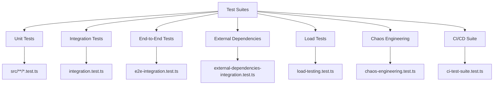
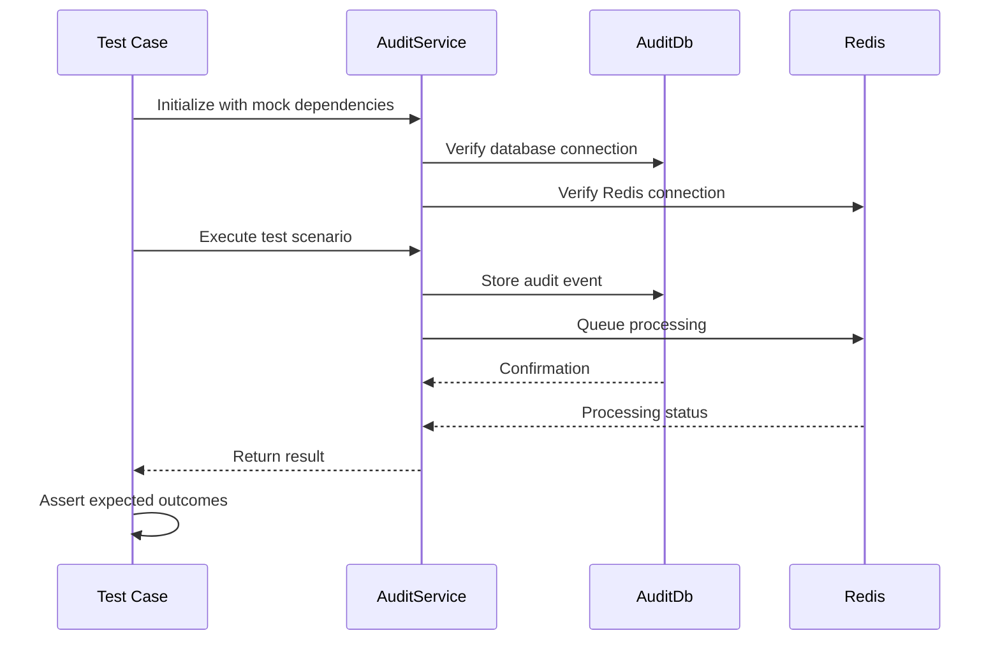
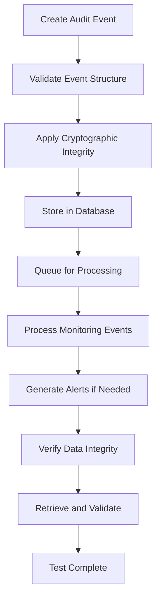
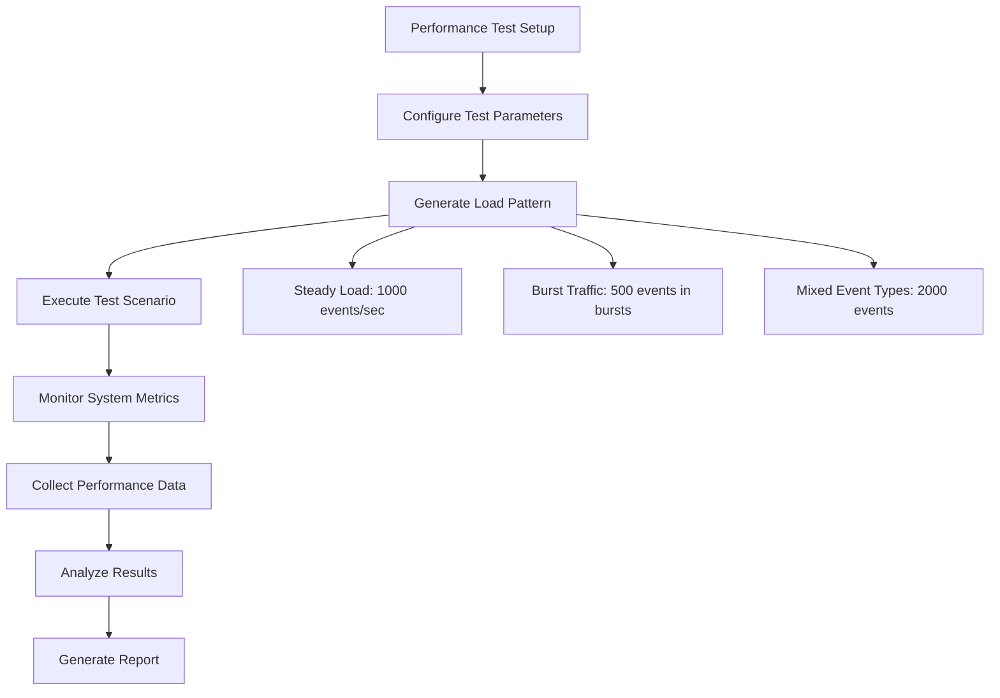
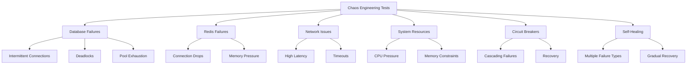
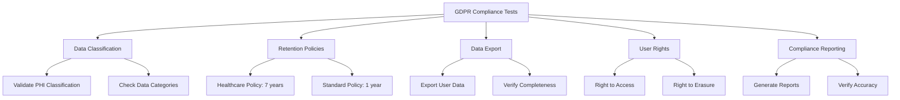
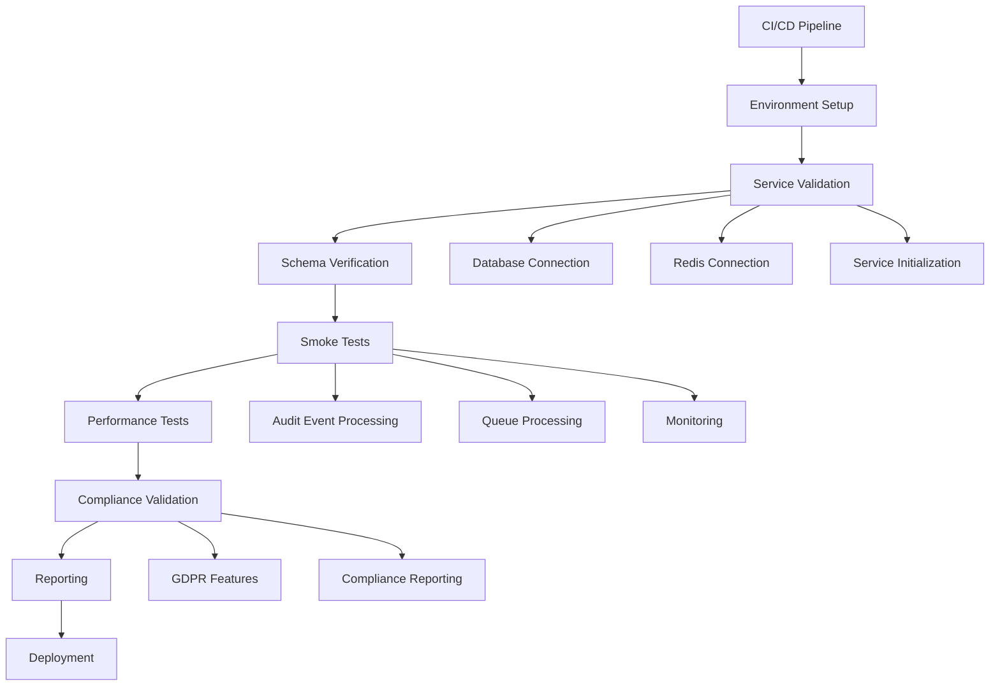
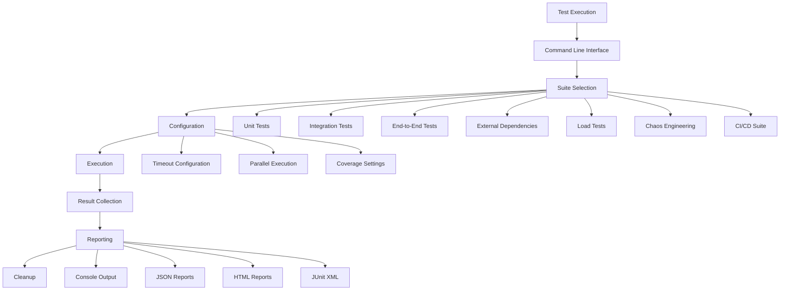

# Testing Strategy

<cite>
**Referenced Files in This Document**   
- [TESTING.md](file://packages/audit/TESTING.md)
- [ci-test-suite.test.ts](file://packages/audit/src/__tests__/ci-test-suite.test.ts)
- [chaos-engineering.test.ts](file://packages/audit/src/__tests__/chaos-engineering.test.ts)
- [load-testing.test.ts](file://packages/audit/src/__tests__/load-testing.test.ts)
- [gdpr-utils.test.ts](file://packages/audit/src/__tests__/gdpr-utils.test.ts)
- [gdpr-integration.test.ts](file://packages/audit-db/src/__tests__/gdpr-integration.test.ts)
- [test-config.json](file://packages/audit/test-config.json)
- [run-tests.sh](file://packages/audit/scripts/run-tests.sh)
- [vitest.config.ts](file://apps/server/vitest.config.ts)
</cite>

## Table of Contents
1. [Testing Overview](#testing-overview)
2. [Test Structure and Organization](#test-structure-and-organization)
3. [Unit and Integration Testing](#unit-and-integration-testing)
4. [End-to-End and External Dependency Testing](#end-to-end-and-external-dependency-testing)
5. [Performance Testing Methodology](#performance-testing-methodology)
6. [Chaos Engineering and Resilience Testing](#chaos-engineering-and-resilience-testing)
7. [GDPR and Compliance Testing](#gdpr-and-compliance-testing)
8. [CI/CD Pipeline Integration](#cicd-pipeline-integration)
9. [Test Execution and Reporting](#test-execution-and-reporting)
10. [Best Practices and Troubleshooting](#best-practices-and-troubleshooting)

## Testing Overview

The audit system employs a comprehensive multi-layered testing strategy to ensure reliability, performance, compliance, and resilience. The testing framework is built on Vitest and covers all aspects of the system from unit-level components to end-to-end workflows and chaos engineering scenarios. The test suite is designed to validate the system under normal conditions as well as adverse scenarios, ensuring the audit system meets stringent requirements for healthcare applications.

The testing approach follows a pyramid model with a strong foundation of unit tests, a substantial layer of integration tests, and targeted end-to-end, performance, and chaos engineering tests. This strategy ensures comprehensive coverage while maintaining efficient test execution times. All tests are designed to be deterministic and repeatable, with proper setup and teardown procedures to ensure isolation between test runs.

**Section sources**
- [TESTING.md](file://packages/audit/TESTING.md#L0-L42)
- [test-config.json](file://packages/audit/test-config.json#L0-L42)

## Test Structure and Organization

The test suite is organized into distinct categories based on the scope and purpose of the tests. This structured approach allows for targeted execution and efficient debugging. The test files are located in the `packages/audit/src/__tests__` directory and follow a consistent naming convention that reflects their purpose.

**Diagram sources**
- [TESTING.md](file://packages/audit/TESTING.md#L42-L50)

The test organization follows these principles:
- **Unit Tests**: Located throughout the codebase with individual component tests
- **Integration Tests**: Focused on component interactions in `integration.test.ts`
- **End-to-End Tests**: Complete audit lifecycle testing in `e2e-integration.test.ts`
- **External Dependencies**: Redis and PostgreSQL integration in dedicated test file
- **Performance Tests**: Load testing scenarios in `load-testing.test.ts`
- **Resilience Tests**: Chaos engineering scenarios in `chaos-engineering.test.ts`
- **CI/CD Suite**: Automated pipeline tests in `ci-test-suite.test.ts`

Each test suite has specific requirements and execution parameters configured in the `test-config.json` file, which defines patterns, timeouts, and environmental dependencies.

**Section sources**
- [TESTING.md](file://packages/audit/TESTING.md#L42-L211)
- [test-config.json](file://packages/audit/test-config.json#L0-L42)

## Unit and Integration Testing

Unit testing focuses on individual components and functions in isolation, ensuring each unit of code works as expected. The unit tests cover all core modules including audit services, GDPR compliance utilities, monitoring components, and queue processing systems. These tests follow the AAA (Arrange, Act, Assert) pattern and use descriptive test names to clearly communicate their purpose.

Integration testing validates the interaction between components and services. The integration tests verify that the audit system components work together correctly, particularly focusing on the integration between the audit service, database, and Redis. These tests ensure that data flows correctly through the system and that component interfaces are properly implemented.

**Diagram sources**
- [ci-test-suite.test.ts](file://packages/audit/src/__tests__/ci-test-suite.test.ts#L0-L200)

The unit and integration tests include comprehensive coverage of:
- Audit event creation and validation
- Cryptographic integrity verification
- Database operations and transaction handling
- Redis queue processing
- Error handling and recovery mechanisms
- Monitoring and alerting integration
- GDPR compliance features

All tests use proper mocking strategies to isolate components and ensure test reliability. External dependencies are mocked using Vitest's mocking utilities, allowing for controlled test scenarios without relying on external services.

**Section sources**
- [TESTING.md](file://packages/audit/TESTING.md#L42-L146)
- [ci-test-suite.test.ts](file://packages/audit/src/__tests__/ci-test-suite.test.ts#L0-L200)

## End-to-End and External Dependency Testing

End-to-end testing validates the complete audit event lifecycle from creation to storage and retrieval. These tests simulate real-world scenarios and ensure that all system components work together seamlessly. The end-to-end tests cover critical workflows including audit event processing with cryptographic integrity, FHIR audit events with proper categorization, authentication events with security monitoring, and GDPR compliance operations.

**Diagram sources**
- [TESTING.md](file://packages/audit/TESTING.md#L146-L211)

External dependency testing focuses on the integration with Redis and PostgreSQL under various conditions. These tests validate the system's behavior when interacting with external services and ensure resilience against connection issues, performance degradation, and resource constraints. The test scenarios include:

- Database connection pooling and failover
- Transaction rollbacks and error recovery
- Large dataset queries and performance
- Redis queue operations and memory pressure
- Connection pool exhaustion
- Circuit breaker protection
- Dead letter queue handling

The external dependency tests use realistic test data that reflects production scenarios and validate both success and failure conditions. These tests ensure that the system can handle transient failures and recover gracefully when external services experience issues.

**Section sources**
- [TESTING.md](file://packages/audit/TESTING.md#L146-L211)
- [external-dependencies-integration.test.ts](file://packages/audit/src/__tests__/external-dependencies-integration.test.ts)

## Performance Testing Methodology

Performance testing evaluates the system's behavior under high-volume conditions to ensure it can handle expected loads with acceptable response times. The load tests simulate various traffic patterns and measure key performance metrics including events per second, latency, throughput, and resource usage.

**Diagram sources**
- [TESTING.md](file://packages/audit/TESTING.md#L188-L211)
- [load-testing.test.ts](file://packages/audit/src/__tests__/load-testing.test.ts#L566-L605)

The performance testing methodology follows these principles:
- Start with small loads and gradually increase
- Monitor system resources (CPU, memory, database connections)
- Use dedicated test environments for accurate results
- Set realistic expectations based on hardware capabilities
- Test both success scenarios and failure conditions

The load tests measure several key metrics:
- **Events per second**: Sustained throughput under load
- **Latency**: Response time for event processing
- **Memory usage**: Stability during sustained load
- **Database performance**: Write volume and query efficiency
- **Error rates**: By error type and component

The target performance metrics require the system to handle at least 100 events per second with a success rate greater than 95%. The tests also validate that the system maintains stable memory usage and does not experience performance degradation over time.

**Section sources**
- [TESTING.md](file://packages/audit/TESTING.md#L188-L211)
- [load-testing.test.ts](file://packages/audit/src/__tests__/load-testing.test.ts#L566-L605)

## Chaos Engineering and Resilience Testing

Chaos engineering tests validate the system's resilience under failure conditions by intentionally introducing failures and observing the system's response. These tests simulate various adverse scenarios to ensure the system can maintain availability and recover gracefully from failures.

**Diagram sources**
- [TESTING.md](file://packages/audit/TESTING.md#L213-L274)
- [chaos-engineering.test.ts](file://packages/audit/src/__tests__/chaos-engineering.test.ts#L0-L199)

The chaos engineering test suite includes scenarios for:
- Intermittent database connection failures
- Database deadlocks and lock timeouts
- Connection pool exhaustion
- Redis connection drops and reconnections
- Redis memory pressure and evictions
- High network latency
- Network timeouts
- CPU pressure
- Cascading failures with circuit breaker protection
- System self-healing after multiple failure types

These tests use the ReliableEventProcessor with configurable retry strategies, circuit breakers, and dead letter queues to validate the system's error recovery mechanisms. The tests measure success rates, recovery times, and system health metrics to ensure the system maintains acceptable performance even under adverse conditions.

The target metrics for chaos engineering tests require a success rate greater than 80% and recovery time under 30 seconds. The tests also validate that circuit breakers function correctly by opening during failure periods and closing after recovery.

**Section sources**
- [TESTING.md](file://packages/audit/TESTING.md#L213-L274)
- [chaos-engineering.test.ts](file://packages/audit/src/__tests__/chaos-engineering.test.ts#L0-L199)

## GDPR and Compliance Testing

GDPR and compliance testing ensures the system meets regulatory requirements for data protection, privacy, and security. These tests validate the implementation of GDPR-specific features including data export, pseudonymization, retention policies, and user rights management.

**Diagram sources**
- [gdpr-utils.test.ts](file://packages/audit/src/__tests__/gdpr-utils.test.ts#L203-L243)
- [gdpr-integration.test.ts](file://packages/audit-db/src/__tests__/gdpr-integration.test.ts#L422-L461)

The GDPR testing suite includes validation of:
- Data classification accuracy (PUBLIC, INTERNAL, CONFIDENTIAL, PHI)
- Retention policy enforcement (7 years for PHI data)
- Data export functionality for user rights requests
- Pseudonymization and anonymization processes
- Compliance reporting with integrity verification
- Audit trail for compliance operations

The tests use realistic test data that includes PHI (Protected Health Information) and other sensitive data classifications. They validate that the system correctly identifies compliance-critical actions and applies appropriate processing rules. The test scenarios also verify that the system generates proper audit trails for all compliance-related operations.

Key validation points include:
- Correct retention policy application based on data classification
- Accurate calculation of retention expiry dates
- Proper handling of leap years in date calculations
- Comprehensive data export including all relevant audit logs
- Generation of compliance reports with breakdowns by legal basis and data categories

**Section sources**
- [gdpr-utils.test.ts](file://packages/audit/src/__tests__/gdpr-utils.test.ts#L203-L243)
- [gdpr-integration.test.ts](file://packages/audit-db/src/__tests__/gdpr-integration.test.ts#L422-L461)
- [compliance.test.ts](file://packages/audit-sdk/src/__tests__/compliance.test.ts#L306-L351)

## CI/CD Pipeline Integration

The CI/CD pipeline integrates automated testing to ensure continuous validation of system quality and reliability. The pipeline executes a comprehensive test suite that validates the environment, core functionality, performance, and compliance requirements before allowing deployments.

**Diagram sources**
- [ci-test-suite.test.ts](file://packages/audit/src/__tests__/ci-test-suite.test.ts#L0-L200)
- [TESTING.md](file://packages/audit/TESTING.md#L356-L420)

The CI/CD test suite includes the following validation steps:
- **Environment Validation**: Verify all required services (database, Redis) are available and properly configured
- **Schema Verification**: Validate database schema is up to date with all required tables and columns
- **Health Check Validation**: Confirm health check endpoints return correct status
- **Smoke Tests**: Basic functionality validation for audit event processing
- **Queue Processing**: Verify events are processed through the queue system
- **Monitoring Validation**: Confirm monitoring and alerting functions work correctly
- **GDPR Compliance**: Validate data export and compliance features
- **Compliance Reporting**: Test report generation with various filters
- **Performance Tests**: Moderate load testing in the CI environment
- **Data Integrity**: Verify cryptographic integrity and data consistency
- **Security Validation**: Test access controls and security features

The pipeline is configured with GitHub Actions, which sets up PostgreSQL and Redis services, installs dependencies, runs database migrations, and executes the CI test suite. Test results are uploaded as artifacts for analysis, and the pipeline only allows deployment when all tests pass successfully.

**Section sources**
- [ci-test-suite.test.ts](file://packages/audit/src/__tests__/ci-test-suite.test.ts#L0-L200)
- [TESTING.md](file://packages/audit/TESTING.md#L356-L420)

## Test Execution and Reporting

Test execution is managed through a comprehensive script that orchestrates the running of different test suites with appropriate configurations. The `run-tests.sh` script provides a command-line interface for executing specific test suites or all tests, with options for coverage reporting, verbose output, and cleanup.

**Diagram sources**
- [run-tests.sh](file://packages/audit/scripts/run-tests.sh#L61-L99)
- [TESTING.md](file://packages/audit/TESTING.md#L501-L546)

The test execution process follows these steps:
1. Validate the test environment (Node.js, database, Redis)
2. Parse command-line arguments for test suite selection
3. Set up environment variables for test configuration
4. Execute selected test suites with appropriate timeouts
5. Capture test results and execution metrics
6. Generate comprehensive test reports
7. Clean up test data and connections
8. Provide final summary and exit status

Test results are generated in multiple formats:
- **Console Output**: Real-time feedback during test execution
- **JSON Reports**: Machine-readable results for automation
- **HTML Reports**: Human-readable reports with coverage details
- **JUnit XML**: Integration with CI/CD pipelines and reporting tools

The reporting includes key metrics such as test execution time, success/failure rates, performance metrics, resource usage, error rates, and recovery times. These metrics are used to monitor system quality over time and identify potential issues.

**Section sources**
- [run-tests.sh](file://packages/audit/scripts/run-tests.sh#L61-L99)
- [TESTING.md](file://packages/audit/TESTING.md#L501-L546)

## Best Practices and Troubleshooting

The testing strategy follows established best practices to ensure effective and reliable testing. These practices cover test writing, performance testing, chaos engineering, and troubleshooting common issues.

```mermaid
flowchart TD
A[Best Practices] --> B[Test Writing]
A --> C[Performance Testing]
A --> D[Chaos Engineering]
A --> E[Troubleshooting]
B --> B1[Descriptive Test Names]
B --> B2[AAA Pattern]
B --> B3[Success and Failure Scenarios]
B --> B4[Proper Cleanup]
B --> B5[Mock External Dependencies]
B --> B6[Realistic Test Data]
C --> C1[Start Small, Scale Up]
C --> C2[Monitor Resources]
C --> C3[Dedicated Environments]
C --> C4[Realistic Expectations]
C --> C5[Test Failure Scenarios]
D --> D1[Start Simple]
D --> D2[Ensure Repeatability]
D --> D3[Document Expected Behavior]
D --> D4[Test Recovery Mechanisms]
D --> D5[Monitor System Health]
E --> E1[Database Connection Errors]
E --> E2[Redis Connection Errors]
E --> E3[Test Timeouts]
E --> E4[Memory Issues]
```

**Diagram sources**
- [TESTING.md](file://packages/audit/TESTING.md#L501-L546)
- [TESTING.md](file://packages/audit/TESTING.md#L276-L355)

Key best practices include:
- Using descriptive test names that explain what is being tested
- Following the AAA (Arrange, Act, Assert) pattern for test structure
- Testing both success and failure scenarios
- Using proper cleanup in beforeAll/afterAll hooks
- Mocking external dependencies appropriately
- Using realistic test data that reflects production scenarios

For troubleshooting common issues:
- **Database Connection Errors**: Verify PostgreSQL is running, check database URL, ensure test database exists, verify user permissions
- **Redis Connection Errors**: Verify Redis server is running, check host/port configuration, verify Redis is accepting connections
- **Test Timeouts**: Increase test timeout, check system resources, verify database performance, check for deadlocks
- **Memory Issues**: Increase Node.js memory limit, run tests on dedicated environment, reduce concurrent operations, check for memory leaks

Debug mode can be enabled with environment variables like `DEBUG=audit:*` for detailed logging, and verbose output can be enabled with the `--reporter=verbose` flag for more detailed test execution information.

**Section sources**
- [TESTING.md](file://packages/audit/TESTING.md#L501-L546)
- [TESTING.md](file://packages/audit/TESTING.md#L276-L355)