# Utilities and Helpers

<cite>
**Referenced Files in This Document**   
- [utils.ts](file://packages/audit-sdk/src/utils.ts)
- [utils.test.ts](file://packages/audit-sdk/src/__tests__/utils.test.ts)
- [middleware.ts](file://packages/audit-sdk/src/middleware.ts)
- [sdk.ts](file://packages/audit-sdk/src/sdk.ts)
- [compliance.ts](file://packages/audit-sdk/src/compliance.ts)
</cite>

## Table of Contents
1. [Introduction](#introduction)
2. [Data Sanitization and Context Normalization](#data-sanitization-and-context-normalization)
3. [Error Serialization and Validation](#error-serialization-and-validation)
4. [Asynchronous Operations and Promise Wrapping](#asynchronous-operations-and-promise-wrapping)
5. [Environment Detection and Diagnostic Logging](#environment-detection-and-diagnostic-logging)
6. [Type Guards and Validation Helpers](#type-guards-and-validation-helpers)
7. [Performance Characteristics and Memory Safety](#performance-characteristics-and-memory-safety)
8. [Integration with Middleware](#integration-with-middleware)
9. [Test Coverage and Examples](#test-coverage-and-examples)

## Introduction
The Audit SDK provides a comprehensive suite of utility functions designed to support secure, compliant, and efficient audit logging in healthcare applications. These utilities handle critical tasks such as data sanitization, context extraction, event batching, rate limiting, and validation. The functions are designed to be modular and reusable across different parts of the application, ensuring consistent behavior and reducing code duplication. This document provides a detailed analysis of these utility functions, their implementation, and their role in supporting the core functionality of the Audit SDK.

## Data Sanitization and Context Normalization

### Data Masking
The `maskSensitiveData` function implements a recursive algorithm to identify and mask sensitive fields in audit events. It uses a configurable list of sensitive field names (defaulting to 'password', 'token', 'secret', and 'key') and applies case-insensitive matching to both direct field names and nested path expressions.

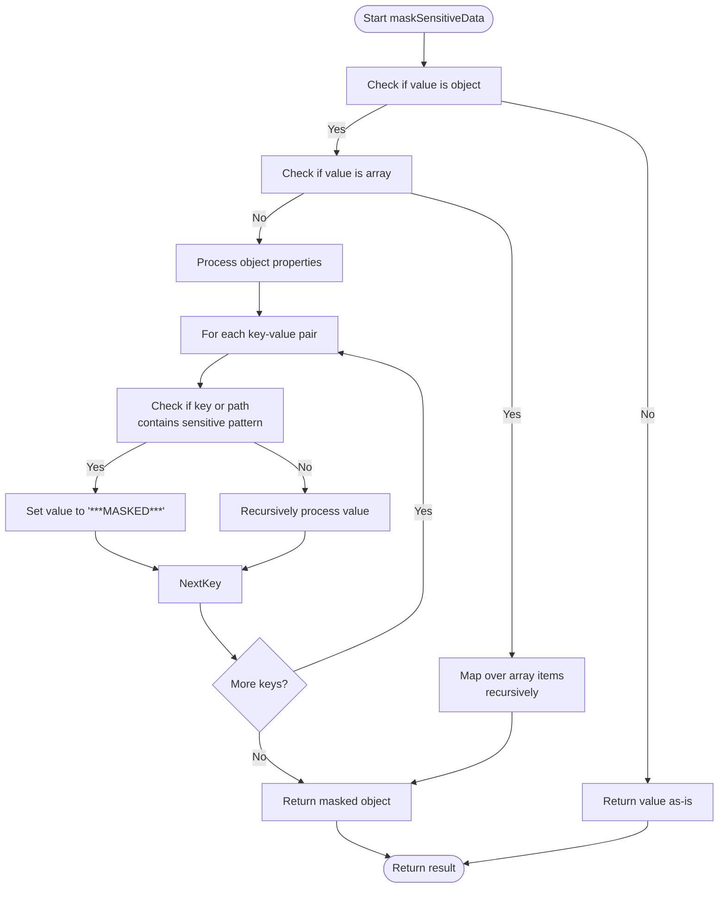

**Diagram sources**
- [utils.ts](file://packages/audit-sdk/src/utils.ts#L20-L78)

**Section sources**
- [utils.ts](file://packages/audit-sdk/src/utils.ts#L20-L78)
- [utils.test.ts](file://packages/audit-sdk/src/__tests__/utils.test.ts#L45-L76)

### Context Extraction
The `extractUserContext` function normalizes user context from various authentication schemes, including JWT tokens, API keys, and session-based authentication. It provides a unified interface for accessing principal information regardless of the authentication method used.

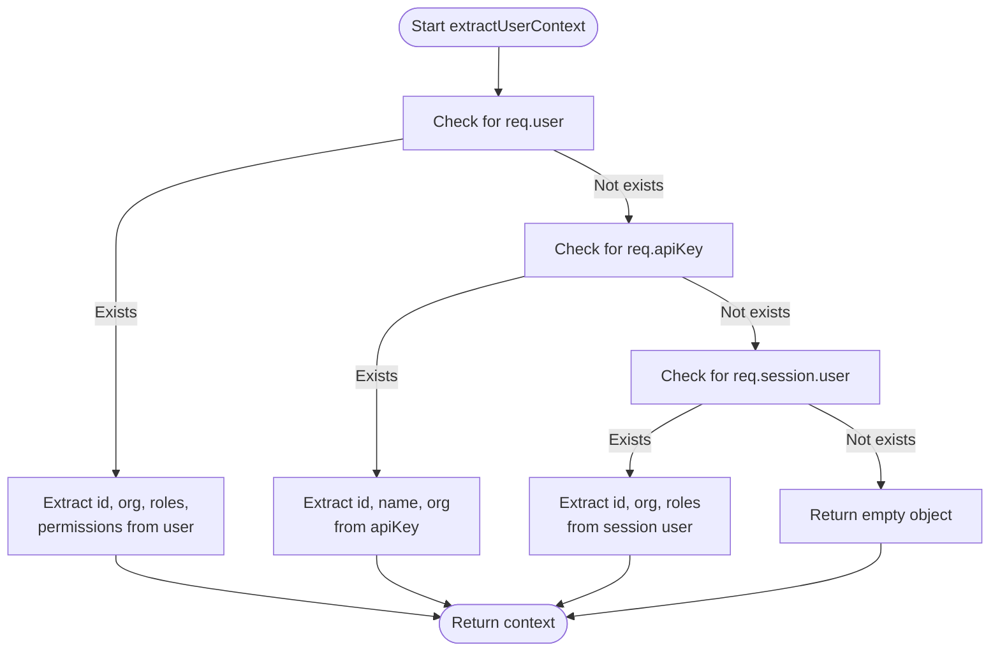

**Diagram sources**
- [utils.ts](file://packages/audit-sdk/src/utils.ts#L80-L118)

**Section sources**
- [utils.ts](file://packages/audit-sdk/src/utils.ts#L80-L118)
- [utils.test.ts](file://packages/audit-sdk/src/__tests__/utils.test.ts#L78-L117)

## Error Serialization and Validation

### Event Structure Validation
The `validateEventStructure` function performs schema validation on audit events, ensuring they meet minimum requirements for compliance and consistency. It checks for required fields and validates enumerated values against allowed options.

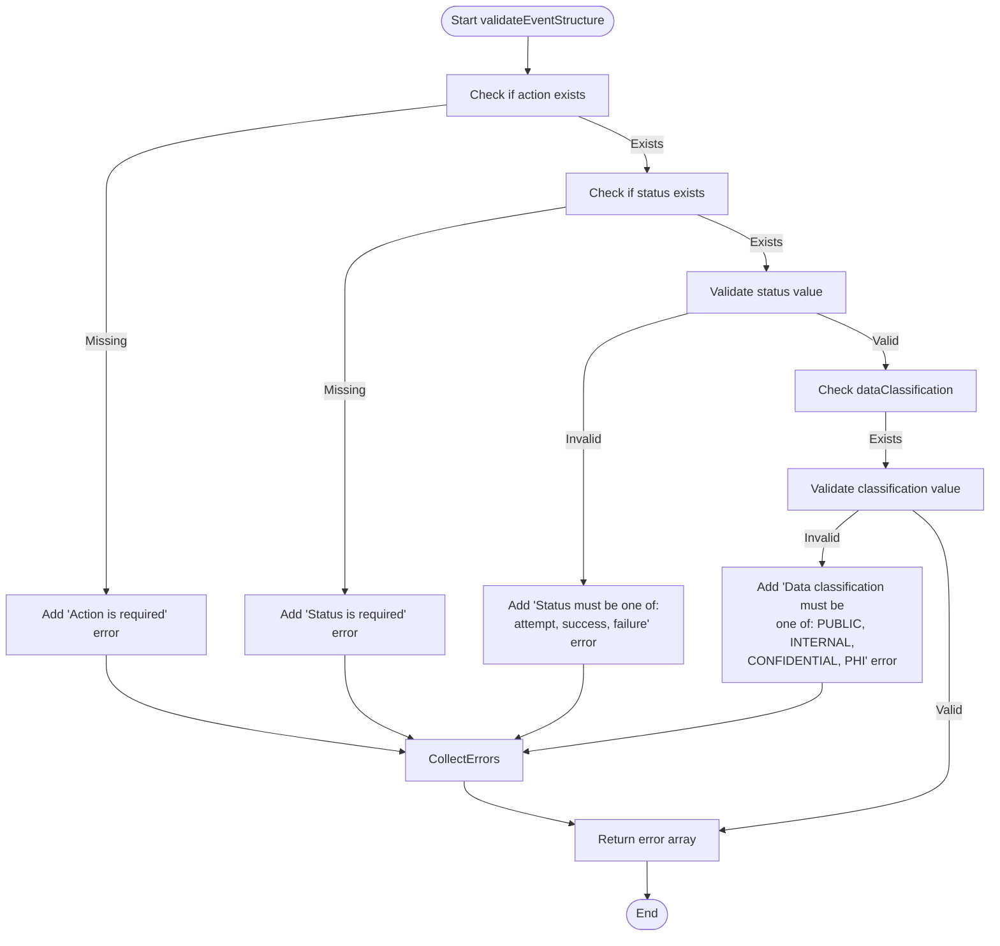

**Diagram sources**
- [utils.ts](file://packages/audit-sdk/src/utils.ts#L300-L334)

**Section sources**
- [utils.ts](file://packages/audit-sdk/src/utils.ts#L300-L334)
- [utils.test.ts](file://packages/audit-sdk/src/__tests__/utils.test.ts#L308-L357)

### CSV Serialization
The utility functions provide robust CSV serialization capabilities for audit events, including proper escaping of special characters and consistent field ordering. The `eventToCSV` and `getCSVHeader` functions work together to produce standardized CSV output.

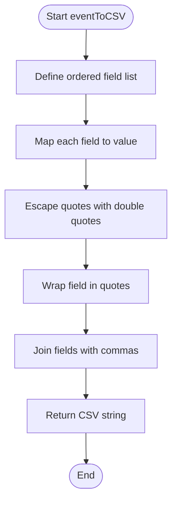

**Diagram sources**
- [utils.ts](file://packages/audit-sdk/src/utils.ts#L336-L378)

**Section sources**
- [utils.ts](file://packages/audit-sdk/src/utils.ts#L336-L378)
- [utils.test.ts](file://packages/audit-sdk/src/__tests__/utils.test.ts#L359-L397)

## Asynchronous Operations and Promise Wrapping

### Event Batching
The `AuditEventBatcher` class implements a batching mechanism for efficient processing of audit events. It combines size-based and time-based flushing strategies to balance performance and latency requirements.

```mermaid
classDiagram
class AuditEventBatcher {
-events : AuditLogEvent[]
-batchSize : number
-flushInterval : number
-onFlush : (events : AuditLogEvent[]) => Promise<void>
-timer : ReturnType<typeof setInterval>
+add(event : AuditLogEvent) : void
+flush() : Promise<void>
+stop() : void
-startTimer() : void
}
AuditEventBatcher --> "uses" (onFlush) : "callback"
```

**Diagram sources**
- [utils.ts](file://packages/audit-sdk/src/utils.ts#L120-L188)

**Section sources**
- [utils.ts](file://packages/audit-sdk/src/utils.ts#L120-L188)
- [utils.test.ts](file://packages/audit-sdk/src/__tests__/utils.test.ts#L159-L198)

### Rate Limiting
The `AuditRateLimiter` class implements a sliding window rate limiting algorithm to prevent audit event spam. It tracks event counts per key and automatically cleans up expired records.

```mermaid
classDiagram
class AuditRateLimiter {
-eventCounts : Map<string, { count : number; resetTime : number }>
-maxEvents : number
-windowMs : number
+isAllowed(key : string) : boolean
+cleanup() : void
}
AuditRateLimiter --> "uses" Map : "eventCounts"
```

**Diagram sources**
- [utils.ts](file://packages/audit-sdk/src/utils.ts#L190-L234)

**Section sources**
- [utils.ts](file://packages/audit-sdk/src/utils.ts#L190-L234)
- [utils.test.ts](file://packages/audit-sdk/src/__tests__/utils.test.ts#L200-L239)

### Event Enrichment
The `AuditEventEnricher` class provides a pipeline for adding contextual information to audit events. It supports both synchronous and asynchronous enrichers, allowing for flexible integration with external services.

```mermaid
classDiagram
class AuditEventEnricher {
-enrichers : Array<(event : AuditLogEvent) => AuditLogEvent | Promise<AuditLogEvent>>
+addEnricher(enricher : (event : AuditLogEvent) => AuditLogEvent | Promise<AuditLogEvent>) : void
+enrich(event : AuditLogEvent) : Promise<AuditLogEvent>
}
class commonEnrichers {
+geolocation(geoService : (ip : string) => Promise<string>) : (event : AuditLogEvent) => Promise<AuditLogEvent>
+organizationContext(orgService : (userId : string) => Promise<{ id : string; name : string }>) : (event : AuditLogEvent) => Promise<AuditLogEvent>
+performanceMetrics() : (event : AuditLogEvent) => AuditLogEvent
}
AuditEventEnricher --> commonEnrichers : "uses"
```

**Diagram sources**
- [utils.ts](file://packages/audit-sdk/src/utils.ts#L236-L298)

**Section sources**
- [utils.ts](file://packages/audit-sdk/src/utils.ts#L236-L298)
- [utils.test.ts](file://packages/audit-sdk/src/__tests__/utils.test.ts#L241-L278)

## Environment Detection and Diagnostic Logging

### Version Reporting
The Audit SDK provides version reporting capabilities through the configuration system. When initializing the SDK, version information can be included in the logger configuration, making it available in all audit logs.

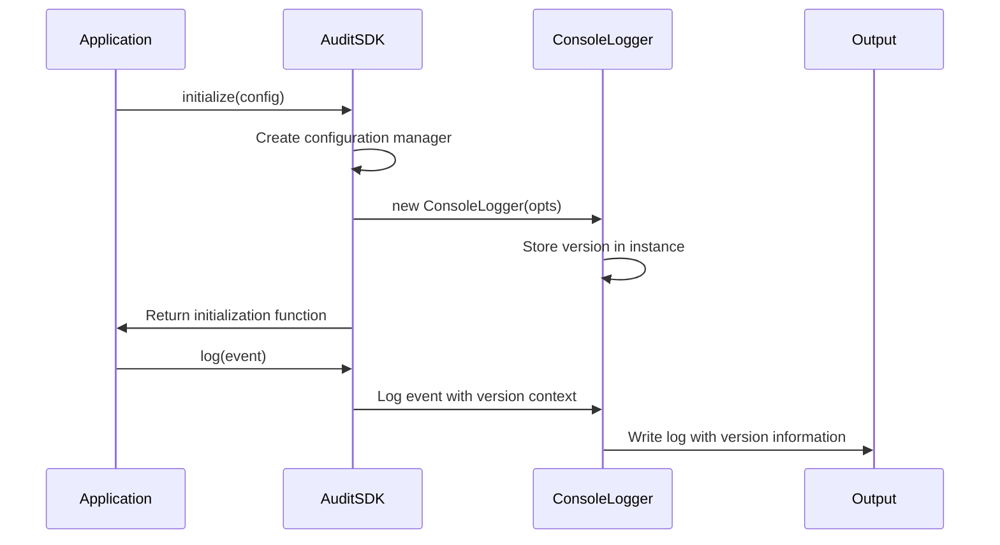

**Diagram sources**
- [sdk.ts](file://packages/audit-sdk/src/sdk.ts#L90-L108)

**Section sources**
- [sdk.ts](file://packages/audit-sdk/src/sdk.ts#L90-L108)

### Diagnostic Logging
The SDK includes comprehensive diagnostic logging capabilities, including health monitoring and system metrics collection. The `getHealth` method provides real-time status information about the audit system components.

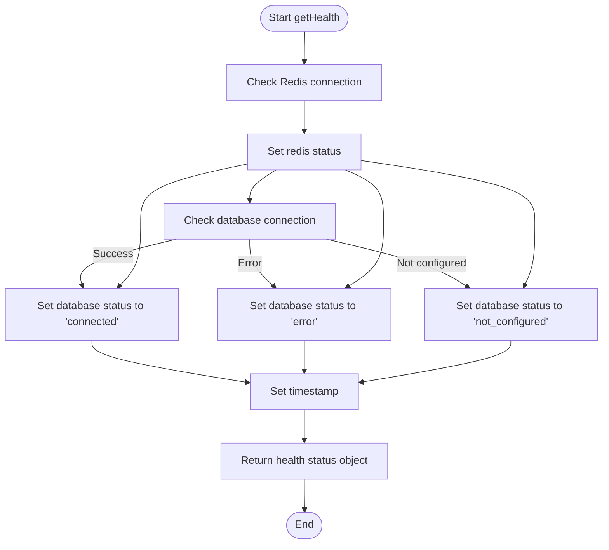

**Diagram sources**
- [sdk.ts](file://packages/audit-sdk/src/sdk.ts#L400-L429)

**Section sources**
- [sdk.ts](file://packages/audit-sdk/src/sdk.ts#L400-L429)

## Type Guards and Validation Helpers

### Compliance Validation
The `validateCompliance` function serves as a type guard and validation helper for compliance requirements. It dispatches to specific validators based on the compliance type (HIPAA, GDPR, or custom rules).

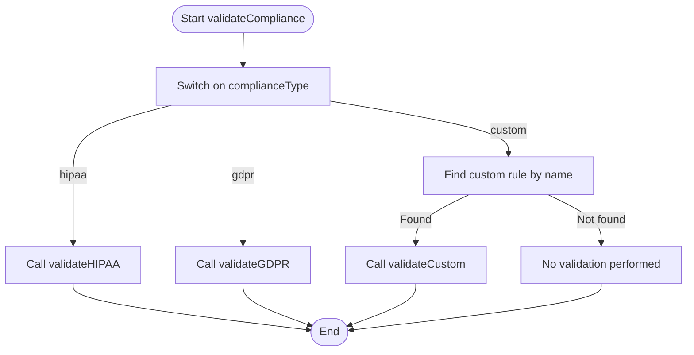

**Diagram sources**
- [compliance.ts](file://packages/audit-sdk/src/compliance.ts#L5-L38)

**Section sources**
- [compliance.ts](file://packages/audit-sdk/src/compliance.ts#L5-L38)
- [sdk.ts](file://packages/audit-sdk/src/sdk.ts#L164-L175)

### HIPAA Validation
The HIPAA validation ensures that audit events involving Protected Health Information (PHI) meet regulatory requirements, including mandatory fields and proper data classification.

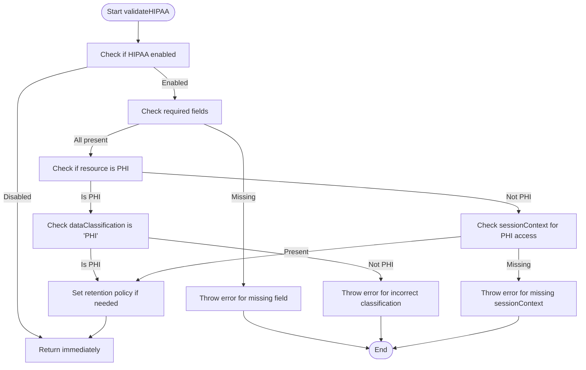

**Diagram sources**
- [compliance.ts](file://packages/audit-sdk/src/compliance.ts#L40-L104)

**Section sources**
- [compliance.ts](file://packages/audit-sdk/src/compliance.ts#L40-L104)

### GDPR Validation
The GDPR validation ensures that personal data processing events include necessary legal basis and data subject identification when required by the regulation.

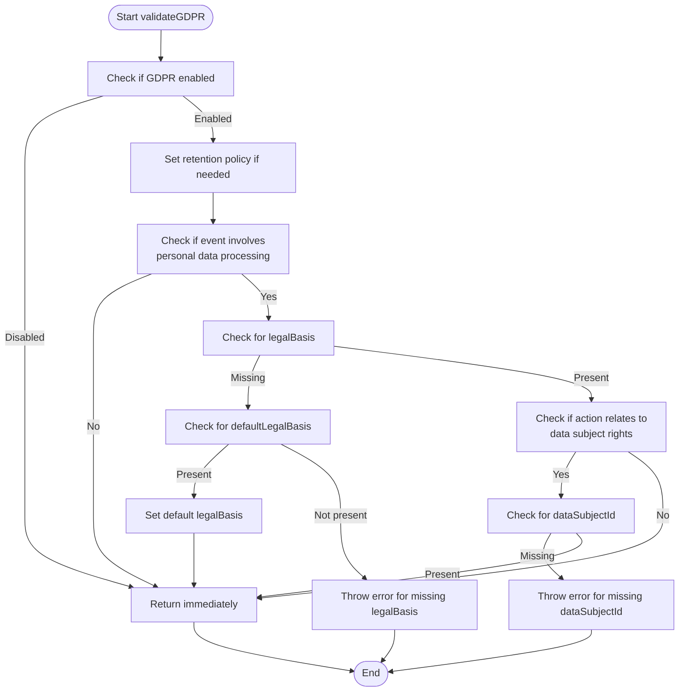

**Diagram sources**
- [compliance.ts](file://packages/audit-sdk/src/compliance.ts#L106-L157)

**Section sources**
- [compliance.ts](file://packages/audit-sdk/src/compliance.ts#L106-L157)

## Performance Characteristics and Memory Safety

### Memory Safety Considerations
The utility functions are designed with memory safety in mind, avoiding common pitfalls such as memory leaks and excessive memory allocation. The `maskSensitiveData` function uses a recursive approach with proper base cases to prevent stack overflow, while the `AuditEventBatcher` manages memory by flushing events to persistent storage.

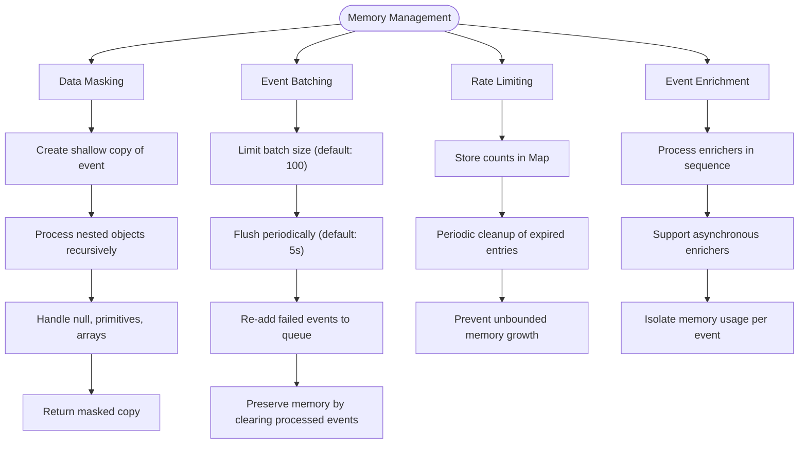

**Section sources**
- [utils.ts](file://packages/audit-sdk/src/utils.ts#L20-L298)

### Performance Characteristics
The utility functions are optimized for performance in high-throughput environments. The `generateEventHash` function uses SHA-256 hashing with JSON stringification of normalized event data, while the `AuditRateLimiter` uses a Map for O(1) lookups and updates.

```mermaid
flowchart LR
subgraph Performance Metrics
Hashing["Event Hashing: O(n) where n = event size"]
Batching["Event Batching: O(1) add, O(m) flush where m = batch size"]
RateLimiting["Rate Limiting: O(1) per check"]
Validation["Event Validation: O(k) where k = number of validation rules"]
Enrichment["Event Enrichment: O(p) where p = number of enrichers"]
end
subgraph Optimization Strategies
Hashing --> Normalization["Normalize event structure before hashing"]
Batching --> "Size and time-based flushing"
RateLimiting --> "Map-based storage with cleanup"
Validation --> "Early termination on first error"
Enrichment --> "Sequential processing with async support"
end
```

**Section sources**
- [utils.ts](file://packages/audit-sdk/src/utils.ts#L120-L298)

## Integration with Middleware

### Express Middleware
The Audit SDK provides middleware integration for Express.js applications, automatically logging HTTP requests and responses. The middleware uses the utility functions for context extraction, event enrichment, and rate limiting.

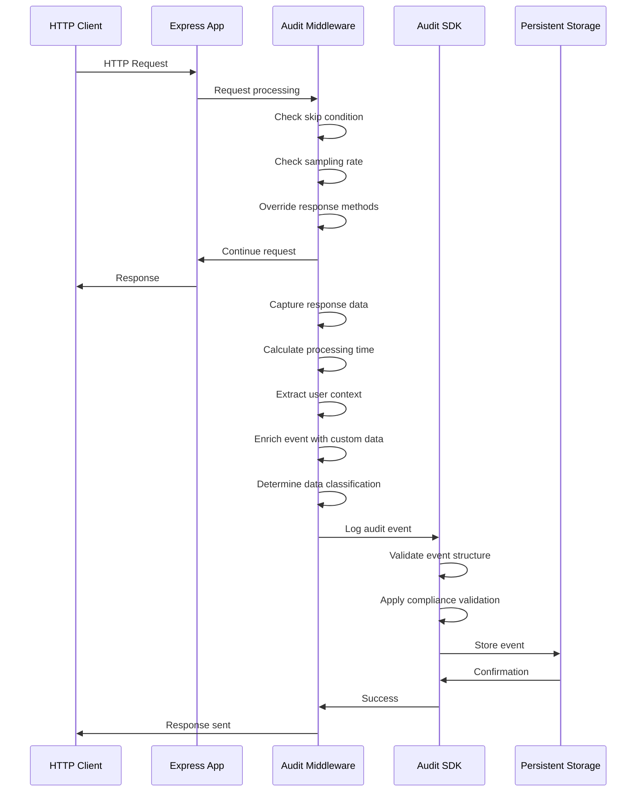

**Diagram sources**
- [middleware.ts](file://packages/audit-sdk/src/middleware.ts#L5-L250)

**Section sources**
- [middleware.ts](file://packages/audit-sdk/src/middleware.ts#L5-L250)
- [audit-sdk.md](file://apps/docs/src/content/docs/audit/audit-sdk.md#L147-L220)

### WebSocket and GraphQL Middleware
The SDK also provides middleware for WebSocket and GraphQL applications, using similar patterns to the Express middleware but adapted to the specific protocols.

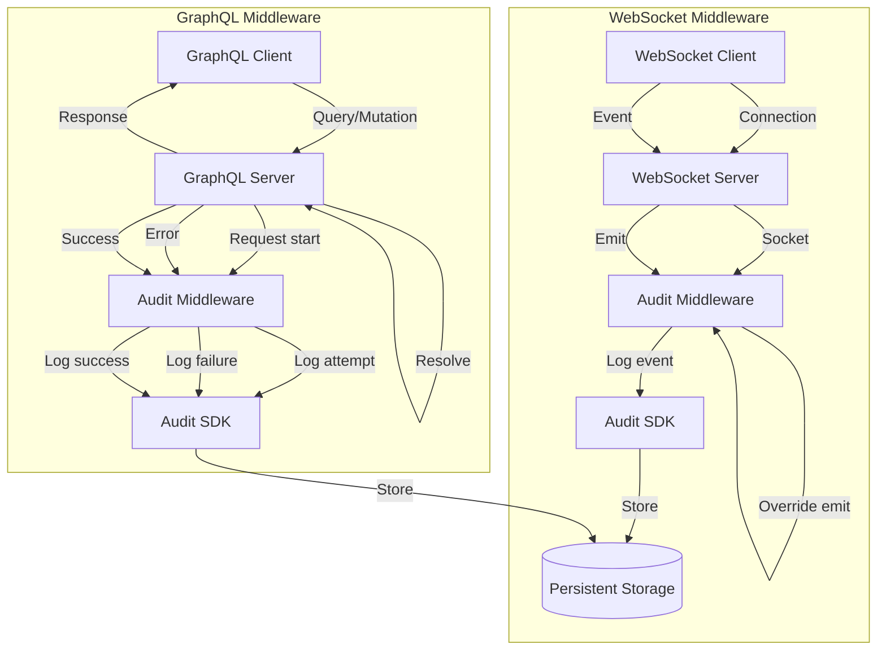

**Diagram sources**
- [middleware.ts](file://packages/audit-sdk/src/middleware.ts#L252-L304)

**Section sources**
- [middleware.ts](file://packages/audit-sdk/src/middleware.ts#L252-L304)
- [audit-sdk.md](file://apps/docs/src/content/docs/audit/audit-sdk.md#L147-L220)

## Test Coverage and Examples

### Test Coverage
The utility functions have comprehensive test coverage, with tests verifying both normal operation and edge cases. The test suite includes unit tests for each utility function, ensuring reliability and correctness.

```mermaid
flowchart TD
Start([Test Suite]) --> CorrelationId["createCorrelationId tests"]
CorrelationId --> |No prefix| TestNoPrefix["Verify format without prefix"]
CorrelationId --> |With prefix| TestWithPrefix["Verify format with prefix"]
Start --> Masking["maskSensitiveData tests"]
Masking --> DefaultFields["Test default sensitive fields"]
Masking --> CustomFields["Test custom sensitive fields"]
Masking --> NestedObjects["Test nested object handling"]
Start --> Context["extractUserContext tests"]
Context --> JWT["Test JWT extraction"]
Context --> APIKey["Test API key extraction"]
Context --> Session["Test session extraction"]
Context --> NoAuth["Test no authentication"]
Start --> Hashing["generateEventHash tests"]
Hashing --> Consistency["Test consistent hashing"]
Hashing --> Differentiation["Test different events have different hashes"]
Start --> Batching["AuditEventBatcher tests"]
Batching --> SizeFlush["Test flush on size limit"]
Batching --> StopFlush["Test flush on stop"]
Start --> RateLimiting["AuditRateLimiter tests"]
RateLimiting --> WithinLimit["Test within rate limit"]
RateLimiting --> OverLimit["Test over rate limit"]
RateLimiting --> Reset["Test reset after window"]
Start --> Enrichment["AuditEventEnricher tests"]
Enrichment --> SingleEnricher["Test single enricher"]
Enrichment --> MultipleEnrichers["Test multiple enrichers"]
Start --> Validation["validateEventStructure tests"]
Validation --> ValidEvent["Test valid event"]
Validation --> MissingFields["Test missing required fields"]
Validation --> InvalidValues["Test invalid enumerated values"]
Start --> CSV["CSV functions tests"]
CSV --> EventToCSV["Test event to CSV conversion"]
CSV --> Header["Test CSV header generation"]
CSV --> Quotes["Test quote escaping"]
```

**Section sources**
- [utils.test.ts](file://packages/audit-sdk/src/__tests__/utils.test.ts#L1-L407)

### Usage Examples
The test file provides clear examples of how to use each utility function, serving as both test cases and usage documentation.

```typescript
// Example: Creating a correlation ID
const correlationId = createCorrelationId('api-request')

// Example: Masking sensitive data
const maskedEvent = maskSensitiveData(event, ['ssn', 'creditCard'])

// Example: Extracting user context
const context = extractUserContext(request)

// Example: Generating event hash
const hash = generateEventHash(event)

// Example: Using event batcher
const batcher = new AuditEventBatcher(50, 3000, async (events) => {
  await auditService.storeEvents(events)
})

// Example: Using rate limiter
const rateLimiter = new AuditRateLimiter(10, 60000) // 10 events per minute
if (rateLimiter.isAllowed(`user-${userId}`)) {
  // Process event
}

// Example: Using event enricher
const enricher = new AuditEventEnricher()
enricher.addEnricher(commonEnrichers.geolocation(geoService))
enricher.addEnricher(commonEnrichers.organizationContext(orgService))
const enrichedEvent = await enricher.enrich(event)
```

**Section sources**
- [utils.test.ts](file://packages/audit-sdk/src/__tests__/utils.test.ts#L1-L407)