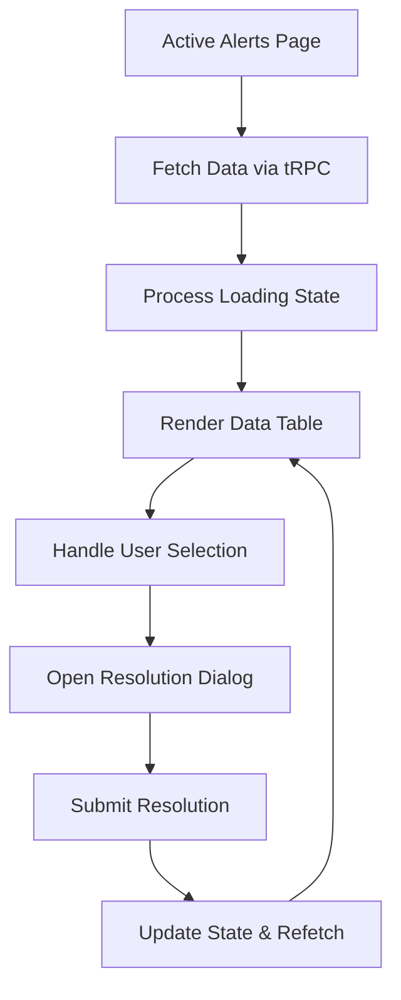
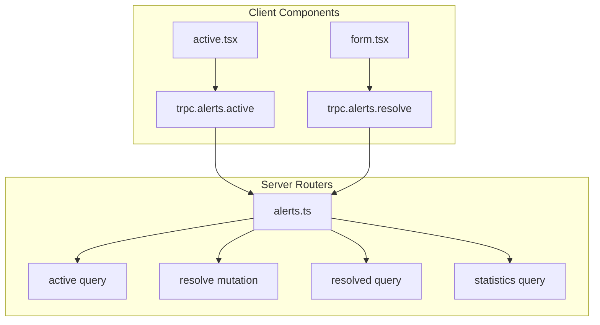

# Active Alerts Management

<cite>
**Referenced Files in This Document**   
- [active.tsx](file://apps/web/src/routes/dashboard/alerts/active.tsx)
- [columns.tsx](file://apps/web/src/components/alerts/columns.tsx)
- [data-table.tsx](file://apps/web/src/components/alerts/data-table.tsx)
- [data.tsx](file://apps/web/src/components/alerts/data.tsx)
- [form.tsx](file://apps/web/src/components/alerts/form.tsx)
- [trpc.ts](file://apps/web/src/utils/trpc.ts)
- [alerts.ts](file://apps/server/src/routers/alerts.ts)
</cite>

## Table of Contents
1. [Introduction](#introduction)
2. [Core Components Overview](#core-components-overview)
3. [Data Table Implementation](#data-table-implementation)
4. [Column Definitions and Rendering](#column-definitions-and-rendering)
5. [Backend Integration via tRPC](#backend-integration-via-trpc)
6. [UI State Management and User Interaction](#ui-state-management-and-user-interaction)
7. [Error Handling and Feedback Mechanisms](#error-handling-and-feedback-mechanisms)
8. [Performance Considerations](#performance-considerations)

## Introduction
The Active Alerts Management interface provides a comprehensive view of currently active system alerts, enabling users to monitor, filter, and resolve critical issues. This document details the implementation of the data table component, its integration with backend services through tRPC, and the overall user experience design for managing active alerts. The interface is built using React with TanStack React Table for data presentation and leverages real-time data fetching to ensure up-to-date information.

## Core Components Overview

The Active Alerts Management system consists of several key components working together to provide a seamless user experience:

- **Active Alerts Page** (`active.tsx`): Main route component that orchestrates data fetching and UI rendering
- **Data Table** (`data-table.tsx`): Reusable table component for displaying alert data with sorting, filtering, and selection capabilities
- **Column Definitions** (`columns.tsx`): Configuration for table columns including rendering logic and filtering behavior
- **Resolve Alert Form** (`form.tsx`): Dialog form for resolving selected alerts with resolution notes
- **tRPC Integration** (`trpc.ts`): Type-safe API client for communicating with the backend alerts router

These components follow a modular architecture where concerns are separated between data presentation, user interaction, and backend communication.

**Section sources**
- [active.tsx](file://apps/web/src/routes/dashboard/alerts/active.tsx#L1-L118)
- [columns.tsx](file://apps/web/src/components/alerts/columns.tsx#L1-L99)
- [data-table.tsx](file://apps/web/src/components/alerts/data-table.tsx)

## Data Table Implementation

The data table component implements a feature-rich interface for displaying and interacting with active alerts. Key features include:

- **Row Selection**: Users can select individual or multiple alerts for batch operations
- **Sorting**: Clickable column headers enable sorting by severity, type, title, description, and source
- **Filtering**: Built-in filtering capabilities allow users to narrow down alerts based on severity and type
- **Pagination**: Although not explicitly shown in the current implementation, the table is designed to support pagination for large datasets
- **Responsive Design**: The table adapts to different screen sizes and maintains usability across devices

The table is implemented using TanStack React Table, which provides a flexible and performant foundation for complex data presentation. The component accepts a generic data type and column configuration, making it reusable across different contexts within the application.



**Diagram sources**
- [active.tsx](file://apps/web/src/routes/dashboard/alerts/active.tsx#L25-L118)
- [data-table.tsx](file://apps/web/src/components/alerts/data-table.tsx)

**Section sources**
- [data-table.tsx](file://apps/web/src/components/alerts/data-table.tsx)
- [active.tsx](file://apps/web/src/routes/dashboard/alerts/active.tsx#L25-L118)

## Column Definitions and Rendering

The column definitions in `columns.tsx` establish the structure and behavior of the data table. Each column is configured with specific properties that control its appearance and functionality:

### Column Configuration
- **Select Column**: Enables row selection with a checkbox interface
  - `id: 'select'`
  - Header renders a master checkbox for selecting all visible rows
  - Cell renders individual row selection checkboxes
  - Sorting and hiding disabled for this column

- **Severity Column**: Displays alert severity levels
  - `accessorKey: 'severity'`
  - Header includes sorting controls
  - Cell renders severity as a labeled badge
  - Supports faceted filtering using predefined severity values

- **Type Column**: Shows the category or type of alert
  - `accessorKey: 'type'`
  - Similar rendering and filtering behavior to severity column

- **Title and Description Columns**: Display alert identification and details
  - Text-based rendering with truncation for long descriptions
  - Full sorting capability

- **Source Column**: Indicates the origin of the alert
  - Simple text display with sorting support

### Filtering Implementation
The filtering system uses faceted filters for categorical data (severity and type). The `filterFn` property in each column definition implements a simple inclusion check:

```typescript
filterFn: (row, id, value) => {
    return value.includes(row.getValue(id))
}
```

This allows users to filter alerts by selecting one or more severity levels or alert types from a dropdown menu.

**Section sources**
- [columns.tsx](file://apps/web/src/components/alerts/columns.tsx#L1-L99)
- [data.tsx](file://apps/web/src/components/alerts/data.tsx)

## Backend Integration via tRPC

The Active Alerts Management interface integrates with the backend through tRPC, providing type-safe API communication between the frontend and server.

### Query Configuration
The component uses `useQuery` from TanStack React Query to fetch active alerts:

```typescript
const { data: alerts, isLoading } = useQuery(trpc.alerts.active.queryOptions())
```

This establishes a connection to the `alerts.active` endpoint on the server, automatically handling loading states and caching.

### Mutation for Alert Resolution
When resolving alerts, the interface uses a mutation:

```typescript
const resolveAlert = useMutation(trpc.alerts.resolve.mutationOptions())
```

This mutation enables the resolution of individual alerts by ID, with appropriate error handling and success feedback.

### Router Endpoint Structure
Based on the import path `trpc.alerts.active`, the backend likely implements an alerts router with the following structure:



**Diagram sources**
- [alerts.ts](file://apps/server/src/routers/alerts.ts)
- [active.tsx](file://apps/web/src/routes/dashboard/alerts/active.tsx#L25-L30)
- [trpc.ts](file://apps/web/src/utils/trpc.ts)

**Section sources**
- [active.tsx](file://apps/web/src/routes/dashboard/alerts/active.tsx#L25-L30)
- [trpc.ts](file://apps/web/src/utils/trpc.ts)

## UI State Management and User Interaction

The interface implements comprehensive state management to handle various user interactions and application states.

### State Variables
The component maintains several state variables:
- `resolvingAlert`: Set of alert IDs currently being resolved
- `isDialogOpen`: Boolean controlling the visibility of the resolution dialog
- `formKey`: Number used to force form reset when dialog reopens
- `dataTableRef`: Reference to the data table instance for programmatic control

### User Interaction Flow
1. User loads the Active Alerts page
2. System displays loading spinner while fetching data
3. Data table renders with fetched alerts
4. User selects one or more alerts using checkboxes
5. User clicks "Resolve" button, triggering `handlemultiResolve`
6. Resolution dialog opens with form for entering notes
7. User submits resolution notes
8. System processes resolution for all selected alerts
9. Success/error toasts provide feedback
10. Data table refreshes with updated alert status

### Batch Resolution Handling
The `handlemultiResolve` function enables batch processing of multiple alerts:

```typescript
const handlemultiResolve = (alerts: Alert[]) => {
    const alertIds = new Set(alerts.map((record) => record.id))
    setResolvingAlert(alertIds)
    setIsDialogOpen(true)
}
```

This allows users to efficiently resolve multiple alerts simultaneously, improving workflow efficiency.

**Section sources**
- [active.tsx](file://apps/web/src/routes/dashboard/alerts/active.tsx#L15-L118)

## Error Handling and Feedback Mechanisms

The interface implements robust error handling and user feedback mechanisms to ensure a reliable user experience.

### Loading State Management
During data fetching, the interface displays a visual loading indicator:

```typescript
{isLoading ? (
    <div className="flex flex-1 items-center justify-center">
        <Spinner variant="bars" size={64} />
    </div>
) : (
    <DataTable ... />
)}
```

This prevents user interaction with incomplete data and provides clear feedback about system status.

### Toast Notifications
The system uses toast notifications to communicate results:
- **Success**: "Resolved X alerts" or "Resolved X of Y alerts"
- **Error**: "Failed to resolve alert [ID]" or "No alert selected to resolve"
- **Unexpected Errors**: "An unexpected error occurred"

These toasts provide immediate feedback about the outcome of resolution attempts.

### Error Recovery
The resolution process includes comprehensive error handling:

```typescript
try {
    const results = await Promise.allSettled(...)
    // Process results and show summary
} catch (error) {
    toast.error('An unexpected error occurred')
} finally {
    // Cleanup: invalidate queries, reset state, clear selection
    queryClient.invalidateQueries({ queryKey })
    setResolvingAlert(new Set())
    setFormKey((prev) => prev + 1)
    setIsDialogOpen(false)
    dataTableRef.current?.clearRowSelection()
}
```

The `finally` block ensures that cleanup operations occur regardless of success or failure, preventing the interface from getting into an inconsistent state.

**Section sources**
- [active.tsx](file://apps/web/src/routes/dashboard/alerts/active.tsx#L50-L110)

## Performance Considerations

The Active Alerts Management interface incorporates several performance optimizations to handle potentially large datasets efficiently.

### Data Fetching Strategy
The implementation uses React Query for data fetching, which provides:
- Automatic caching of results
- Background refetching
- Request deduplication
- Optimistic updates

This reduces unnecessary network requests and improves perceived performance.

### Memory Management
The component efficiently manages memory by:
- Using refs only when necessary (`dataTableRef`)
- Properly cleaning up state after operations
- Avoiding unnecessary re-renders through proper state management

### Large Dataset Considerations
While the current implementation doesn't show explicit pagination, the architecture supports it through:
- Separation of data fetching from presentation
- Use of virtualized rendering in the data table component
- Efficient state updates that don't require full re-renders

For very large datasets, additional optimizations could include:
- Server-side pagination
- Virtual scrolling
- Lazy loading of alert details
- Debounced filtering and searching

The use of `Promise.allSettled` for batch operations ensures that partial failures don't prevent successful resolutions, improving reliability with large selections.

**Section sources**
- [active.tsx](file://apps/web/src/routes/dashboard/alerts/active.tsx)
- [data-table.tsx](file://apps/web/src/components/alerts/data-table.tsx)