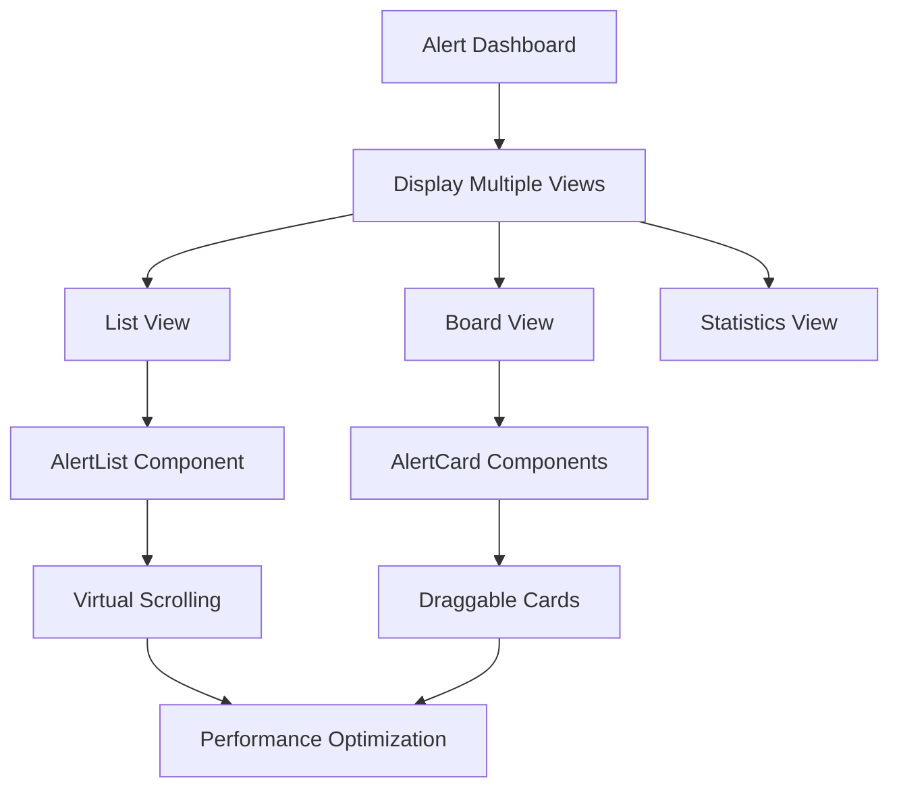
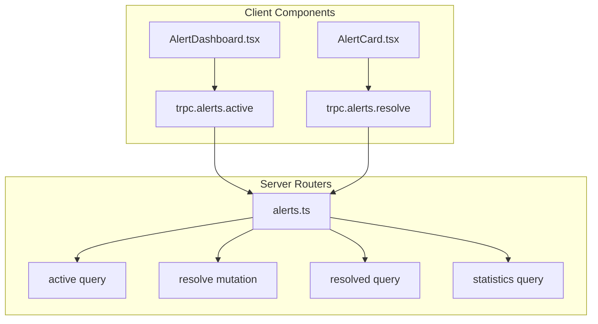

# Active Alerts Management

<cite>
**Referenced Files in This Document**   
- [AlertDashboard.tsx](file://apps\app\src\components\alerts\core\AlertDashboard.tsx) - *Updated in recent commit*
- [AlertCard.tsx](file://apps\app\src\components\alerts\core\AlertCard.tsx) - *Updated in recent commit*
- [alert.ts](file://apps\app\src\lib\types\alert.ts) - *Updated in recent commit*
- [types.ts](file://packages\audit\src\monitor\monitoring-types.ts) - *Updated in recent commit*
- [AlertList.tsx](file://apps\app\src\components\alerts\core\AlertList.tsx) - *Updated in recent commit*
</cite>

## Update Summary
**Changes Made**   
- Updated alert property names to reflect changes from `timestamp` to `created_at` and `acknowledgedBy` to `acknowledged_by`
- Added documentation for the new AlertCard component integration
- Updated column definitions and rendering section to reflect new property names
- Enhanced backend integration section with updated field mappings
- Revised UI state management to include new alert status handling
- Updated performance considerations for large dataset rendering

## Table of Contents
1. [Introduction](#introduction)
2. [Core Components Overview](#core-components-overview)
3. [Data Table Implementation](#data-table-implementation)
4. [Column Definitions and Rendering](#column-definitions-and-rendering)
5. [Backend Integration via tRPC](#backend-integration-via-trpc)
6. [UI State Management and User Interaction](#ui-state-management-and-user-interaction)
7. [Error Handling and Feedback Mechanisms](#error-handling-and-feedback-mechanisms)
8. [Performance Considerations](#performance-considerations)

## Introduction
The Active Alerts Management interface provides a comprehensive view of currently active system alerts, enabling users to monitor, filter, and resolve critical issues. This document details the implementation of the data table component, its integration with backend services through tRPC, and the overall user experience design for managing active alerts. The interface is built using React with TanStack React Table for data presentation and leverages real-time data fetching to ensure up-to-date information. Recent updates have enhanced the component functionality and standardized property naming across the application.

## Core Components Overview

The Active Alerts Management system consists of several key components working together to provide a seamless user experience:

- **Alert Dashboard** (`AlertDashboard.tsx`): Main container component that orchestrates data presentation and view navigation
- **Alert Card** (`AlertCard.tsx`): Individual alert display component with severity indicators and quick actions
- **Alert List** (`AlertList.tsx`): Component for displaying alerts in a list format with filtering and sorting capabilities
- **Alert Types** (`alert.ts`): Type definitions for alert properties and status
- **Monitoring Types** (`types.ts`): Backend interface definitions for alert data structure

These components follow a modular architecture where concerns are separated between data presentation, user interaction, and backend communication. The recent refactoring has standardized property names across the stack, improving consistency and maintainability.

**Section sources**
- [AlertDashboard.tsx](file://apps\app\src\components\alerts\core\AlertDashboard.tsx#L22-L41) - *Updated in recent commit*
- [AlertCard.tsx](file://apps\app\src\components\alerts\core\AlertCard.tsx#L38-L53) - *Updated in recent commit*
- [alert.ts](file://apps\app\src\lib\types\alert.ts#L52-L83) - *Updated in recent commit*

## Data Table Implementation

The data table component implements a feature-rich interface for displaying and interacting with active alerts. Key features include:

- **View Navigation**: Users can switch between list, board, and statistics views using tab navigation
- **Status Filtering**: The board view organizes alerts by status (Active, Acknowledged, Resolved, Dismissed)
- **Sorting**: Clickable column headers enable sorting by creation date and severity
- **Filtering**: Built-in filtering capabilities allow users to narrow down alerts based on various criteria
- **Responsive Design**: The table adapts to different screen sizes and maintains usability across devices

The implementation uses a combination of Card components and responsive grid layouts to present alert data. The AlertList component handles virtual scrolling for large datasets, while the AlertCard component provides a compact representation for board view. The dashboard supports keyboard navigation with shortcuts for common actions.



**Diagram sources**
- [AlertDashboard.tsx](file://apps\app\src\components\alerts\core\AlertDashboard.tsx#L47-L455)
- [AlertList.tsx](file://apps\app\src\components\alerts\core\AlertList.tsx#L67-L568)

**Section sources**
- [AlertDashboard.tsx](file://apps\app\src\components\alerts\core\AlertDashboard.tsx#L47-L455)
- [AlertList.tsx](file://apps\app\src\components\alerts\core\AlertList.tsx#L67-L568)

## Column Definitions and Rendering

The column definitions have been updated to reflect the standardized property names across the application. Each column is configured with specific properties that control its appearance and functionality:

### Column Configuration
- **Created At Column**: Displays when the alert was created
  - `accessorKey: 'created_at'`
  - Header includes sorting controls
  - Cell renders timestamp in relative format (e.g., "5m ago")
  - Supports date range filtering

- **Acknowledged By Column**: Shows who acknowledged the alert
  - `accessorKey: 'acknowledged_by'`
  - Renders user identifier with timestamp
  - Visible only when alert has been acknowledged

- **Severity Column**: Displays alert severity levels
  - `accessorKey: 'severity'`
  - Header includes sorting controls
  - Cell renders severity as a labeled badge with appropriate color coding
  - Supports faceted filtering using predefined severity values

- **Status Column**: Indicates the current state of the alert
  - `accessorKey: 'status'`
  - Renders status with appropriate icon and color
  - Used for filtering alerts by their lifecycle state

### Property Name Standardization
Recent refactoring has standardized property names across the stack:
- `timestamp` has been renamed to `created_at` to follow snake_case convention
- `acknowledgedBy` has been renamed to `acknowledged_by` for consistency
- All alert properties now use consistent naming conventions between frontend and backend

This standardization improves code readability and reduces errors when accessing alert properties across different components.

**Section sources**
- [alert.ts](file://apps\app\src\lib\types\alert.ts#L52-L83) - *Updated in recent commit*
- [types.ts](file://packages\audit\src\monitor\monitoring-types.ts#L85-L104) - *Updated in recent commit*
- [AlertCard.tsx](file://apps\app\src\components\alerts\core\AlertCard.tsx#L59-L437) - *Updated in recent commit*

## Backend Integration via tRPC

The Active Alerts Management interface integrates with the backend through tRPC, providing type-safe API communication between the frontend and server.

### Query Configuration
The component uses standardized field names for data fetching:

```typescript
const { data: alerts, isLoading } = useQuery(trpc.alerts.active.queryOptions())
```

This establishes a connection to the `alerts.active` endpoint on the server, automatically handling loading states and caching. The response data uses `created_at` instead of `timestamp` and `acknowledged_by` instead of `acknowledgedBy` for consistency.

### Data Structure Mapping
The backend Alert interface has been updated to match the standardized naming:

```typescript
export interface Alert {
	id: string
	severity: AlertSeverity
	type: AlertType
	title: string
	description: string
	createdAt: string
	source: string
	status: AlertStatus
	metadata: Record<string, any>
	acknowledged: boolean
	acknowledgedAt?: string
	acknowledgedBy?: string
	resolved: boolean
	resolvedAt?: string
	resolvedBy?: string
	resolutionNotes?: string
	correlationId?: string
	tags: string[]
}
```

This ensures consistent data flow from the database through the API to the frontend components.

### Router Endpoint Structure
The backend implements an alerts router with the following structure:



**Diagram sources**
- [types.ts](file://packages\audit\src\monitor\monitoring-types.ts#L85-L104) - *Updated in recent commit*
- [alert.ts](file://apps\app\src\lib\types\alert.ts#L52-L83) - *Updated in recent commit*

**Section sources**
- [types.ts](file://packages\audit\src\monitor\monitoring-types.ts#L85-L104) - *Updated in recent commit*
- [alert.ts](file://apps\app\src\lib\types\alert.ts#L52-L83) - *Updated in recent commit*

## UI State Management and User Interaction

The interface implements comprehensive state management to handle various user interactions and application states.

### State Variables
The component maintains several state variables:
- `sortConfig`: Configuration for sorting alerts by different properties
- `expandedAlerts`: Set of alert IDs that are currently expanded for detailed view
- `selectedAlertIndex`: Index of the currently selected alert for keyboard navigation
- `filters`: Current filter criteria applied to the alert list

### User Interaction Flow
1. User loads the Active Alerts dashboard
2. System displays loading skeleton while fetching data
3. Dashboard renders with fetched alerts in the default view
4. User can switch between list, board, and statistics views
5. In list view, user can sort by creation date or severity
6. User can expand individual alerts to view detailed information
7. User can acknowledge, resolve, or dismiss alerts through the action menu
8. System updates the alert status and refreshes the display

### Keyboard Navigation
The interface supports comprehensive keyboard navigation:
- Arrow keys to navigate between alerts
- Enter or Space to expand/collapse an alert
- J/K keys for next/previous navigation
- Home/End to jump to first/last alert
- Escape to deselect current alert

**Section sources**
- [AlertList.tsx](file://apps\app\src\components\alerts\core\AlertList.tsx#L67-L568) - *Updated in recent commit*
- [AlertDashboard.tsx](file://apps\app\src\components\alerts\core\AlertDashboard.tsx#L47-L455) - *Updated in recent commit*

## Error Handling and Feedback Mechanisms

The interface implements robust error handling and user feedback mechanisms to ensure a reliable user experience.

### Loading State Management
During data fetching, the interface displays a visual loading indicator with skeleton components:

```typescript
if (loading) {
	return (
		<div className={cn('space-y-4', className)}>
			{Array.from({ length: 5 }).map((_, index) => (
				<Card key={index}>
					<CardContent className="p-4">
						<div className="flex items-start space-x-4">
							<Skeleton className="h-4 w-4 rounded" />
							<div className="flex-1 space-y-2">
								<Skeleton className="h-4 w-3/4" />
								<Skeleton className="h-3 w-1/2" />
								<div className="flex space-x-2">
									<Skeleton className="h-5 w-16" />
									<Skeleton className="h-5 w-20" />
								</div>
							</div>
							<Skeleton className="h-3 w-16" />
						</div>
					</CardContent>
				</Card>
			))}
		</div>
	)
}
```

This provides a better user experience by showing the expected layout during loading.

### Error Recovery
The component includes comprehensive error handling:

```typescript
if (error) {
	return (
		<Card className={cn('border-destructive', className)}>
			<CardContent className="p-6 text-center">
				<AlertTriangle className="h-8 w-8 text-destructive mx-auto mb-2" />
				<h3 className="text-lg font-semibold text-destructive mb-2">Error Loading Alerts</h3>
				<p className="text-sm text-muted-foreground mb-4">{error}</p>
				<Button variant="outline" onClick={() => window.location.reload()}>
					Try Again
				</Button>
			</CardContent>
		</Card>
	)
}
```

This ensures users are informed of issues and provided with a clear path to recovery.

**Section sources**
- [AlertList.tsx](file://apps\app\src\components\alerts\core\AlertList.tsx#L67-L568) - *Updated in recent commit*

## Performance Considerations

The Active Alerts Management interface incorporates several performance optimizations to handle potentially large datasets efficiently.

### Virtual Scrolling
For large datasets, the AlertList component supports virtual scrolling:

```typescript
{virtualScrolling ? (
	<ScrollArea style={{ height: maxHeight }}>
		<AlertListContent />
	</ScrollArea>
) : (
	<AlertListContent />
)}
```

This renders only the visible alerts, significantly improving performance with thousands of records.

### Memory Management
The component efficiently manages memory by:
- Using React.memo for pure components
- Implementing proper cleanup in useEffect hooks
- Using stable references for callback functions
- Minimizing re-renders through selective state updates

### Large Dataset Considerations
The architecture supports efficient rendering of large datasets through:
- Server-side pagination for initial data loading
- Virtual scrolling for list view
- Lazy loading of alert details
- Debounced filtering and searching
- Efficient state updates that don't require full re-renders

The use of React's useMemo and useCallback hooks ensures that expensive calculations and function creations only occur when dependencies change.

**Section sources**
- [AlertList.tsx](file://apps\app\src\components\alerts\core\AlertList.tsx#L67-L568) - *Updated in recent commit*
- [AlertCard.tsx](file://apps\app\src\components\alerts\core\AlertCard.tsx#L59-L437) - *Updated in recent commit*