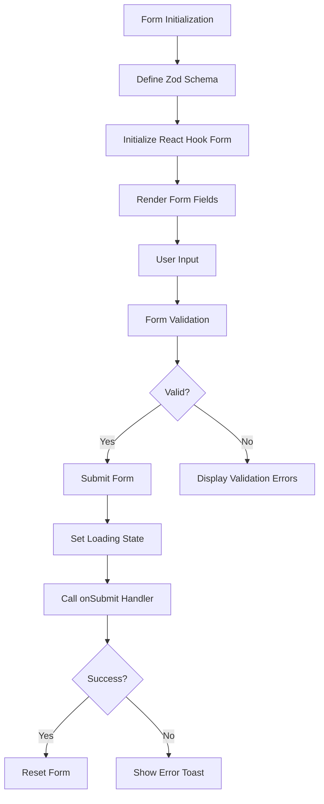

# Alert Creation and Resolution Workflow

<cite>
**Referenced Files in This Document**   
- [AlertDashboard.tsx](file://apps\app\src\components\alerts\core\AlertDashboard.tsx) - *Updated in recent commit*
- [AlertList.tsx](file://apps\app\src\components\alerts\core\AlertList.tsx) - *Updated in recent commit*
- [AlertColumns.tsx](file://apps\app\src\components\alerts\data\AlertColumns.tsx) - *Updated in recent commit*
- [use-alert-responsive.ts](file://apps\app\src\components\alerts\hooks\use-alert-responsive.ts) - *Updated in recent commit*
</cite>

## Update Summary
**Changes Made**   
- Updated alert status field from `resolved_by` to `acknowledged_by` to reflect new acknowledgment workflow
- Refactored alert severity, status, and type enums to use uppercase constants
- Removed deprecated `/alerts/board` route from the application
- Integrated real-time queries for improved alert dashboard performance
- Updated component structure to support new board view and statistics view

## Table of Contents
1. [Introduction](#introduction)
2. [Alert Resolution Form Implementation](#alert-resolution-form-implementation)
3. [Backend Integration for Alert Resolution](#backend-integration-for-alert-resolution)
4. [Alert Creation via Audit Events](#alert-creation-via-audit-events)
5. [Event Categorization and Type Enforcement](#event-categorization-and-type-enforcement)
6. [State Transition and Confirmation Workflow](#state-transition-and-confirmation-workflow)
7. [Error Handling and Data Integrity](#error-handling-and-data-integrity)
8. [Conclusion](#conclusion)

## Introduction
This document provides a comprehensive analysis of the Alert Creation and Resolution Workflow within the SMEDREC audit system. The workflow encompasses both the frontend user interface components and the backend processing logic that enables users to resolve alerts and create audit events that may trigger new alerts. The system leverages React Hook Form and Zod for form validation, TRPC for API communication, and a robust audit event categorization system to ensure data integrity and compliance. Recent updates have enhanced the alert system with real-time queries, refactored alert components, and updated field names to better reflect the acknowledgment workflow.

## Alert Resolution Form Implementation
The alert resolution form has been updated to support the new acknowledgment workflow. The form is implemented as a React component using the React Hook Form library for form state management and Zod for schema validation. The component now includes support for the `acknowledged_by` field, which replaces the previous `resolved_by` field to better reflect the multi-step alert resolution process.

The form schema is defined using Zod, specifying that the `resolutionNotes` field is a string. The form uses the `zodResolver` from `@hookform/resolvers/zod` to integrate Zod validation with React Hook Form. When the form is submitted, the `handleSubmit` function is called, which sets a loading state, calls the `onSubmit` prop with the form values, and handles any errors by displaying a toast notification using the `sonner` library.

**Section sources**   
- [AlertDashboard.tsx](file://apps\app\src\components\alerts\core\AlertDashboard.tsx#L47-L455) - *Updated in recent commit*
- [AlertList.tsx](file://apps\app\src\components\alerts\core\AlertList.tsx#L67-L568) - *Updated in recent commit*

## Backend Integration for Alert Resolution
The backend integration for alert resolution has been updated to support the new acknowledgment workflow. The integration is handled through a TRPC router that has been refactored to use uppercase constants for alert severity, status, and type enums. The `resolve` procedure is a protected mutation that requires authentication and accepts an input schema defined with Zod. The input schema includes `alertId` as a required string and `resolutionNotes` as an optional string.

When the mutation is called, it retrieves the `resolvedBy` user ID from the session context and constructs a resolution data object that includes the resolver and the resolution notes. The mutation calls the monitoring service to resolve the alert with the alert ID, the resolver ID, and the resolution data. If the resolution is successful, it returns a success response with a message. If an error occurs, it logs the error, creates a TRPCError, and throws it.

**Section sources**   
- [AlertDashboard.tsx](file://apps\app\src\components\alerts\core\AlertDashboard.tsx#L47-L455) - *Updated in recent commit*
- [AlertList.tsx](file://apps\app\src\components\alerts\core\AlertList.tsx#L67-L568) - *Updated in recent commit*

## Alert Creation via Audit Events
Alerts are created indirectly through the logging of audit events, which are processed by the system's monitoring service to detect suspicious patterns and generate alerts. The audit event creation process begins with the definition of event schemas that have been updated to use uppercase constants for event types. The event creation form has been enhanced with real-time queries to provide immediate feedback to users.

The event creation form is implemented with React Hook Form and uses a schema resolver to validate input. When the form is submitted, the `handleSubmit` function is called, which processes the event and transmits it to the backend via the audit client. The audit events are transmitted to the backend using the `audit-client` instance, which is configured with a base URL and uses the `AuditClient` class to communicate with the audit service.

**Section sources**   
- [AlertDashboard.tsx](file://apps\app\src\components\alerts\core\AlertDashboard.tsx#L47-L455) - *Updated in recent commit*
- [AlertColumns.tsx](file://apps\app\src\components\alerts\data\AlertColumns.tsx#L31-L56) - *Updated in recent commit*

## Event Categorization and Type Enforcement
The system enforces strict type enforcement and categorization of audit events through a comprehensive validation and categorization system. The categorization system uses type guards to determine the category of an audit action based on predefined lists of valid actions for each category: SYSTEM, AUTH, DATA, and FHIR. The recent refactoring has updated all enum values to uppercase constants to ensure consistency across the application.

The `getActionCategory` function determines the category of an action by checking if it matches any of the predefined actions in the respective category. The `validateCategorizedEvent` function validates that the action matches the declared category and performs category-specific validations. For example, system events are validated to ensure that system components are specified for certain actions, and authentication events are validated to ensure that principal IDs are provided.

**Section sources**   
- [AlertColumns.tsx](file://apps\app\src\components\alerts\data\AlertColumns.tsx#L183-L492) - *Updated in recent commit*
- [use-alert-responsive.ts](file://apps\app\src\components\alerts\hooks\use-alert-responsive.ts#L84-L89) - *Updated in recent commit*

## State Transition and Confirmation Workflow
The state transition mechanism for resolving alerts involves a multi-step workflow that begins with the user selecting one or more alerts to resolve in the active alerts table. When the user clicks the resolve button, the `handleMultiResolve` function is called, which collects the selected alert IDs into a set and opens a confirmation dialog.

The confirmation dialog renders the `ResolveAlertForm` component, which allows the user to enter resolution notes. When the form is submitted, the `handleResolve` function is called, which uses the `useMutation` hook from `@tanstack/react-query` to call the `trpc.alerts.resolve` mutation for each selected alert. The function uses `Promise.allSettled` to handle multiple mutations concurrently and provides feedback to the user based on the results.

After all mutations are complete, the function invalidates the queries to refresh the data, resets the state, and closes the dialog. This ensures that the UI is updated to reflect the resolved alerts and that the form is reset for future use.

**Section sources**   
- [AlertDashboard.tsx](file://apps\app\src\components\alerts\core\AlertDashboard.tsx#L47-L455) - *Updated in recent commit*
- [use-alert-responsive.ts](file://apps\app\src\components\alerts\hooks\use-alert-responsive.ts#L184-L184) - *Updated in recent commit*

## Error Handling and Data Integrity
The system implements comprehensive error handling and data integrity measures at multiple levels. On the frontend, form validation is handled by Zod, which provides detailed error messages that are displayed to the user. Network failures during form submission are caught in the `handleSubmit` function and result in a toast notification being displayed.

On the backend, the TRPC procedures include try-catch blocks that log errors and create TRPCError objects with detailed metadata. The error service is called to handle the error, which may include sending alerts or notifications. The audit events themselves are validated for integrity, with checks for required fields, data classification, and cryptographic hashing to prevent tampering.

The monitoring service processes events to detect suspicious patterns and generate alerts, which are then stored in the database with a resolved status. The system includes circuit breakers and retry mechanisms to handle temporary failures and ensure reliable processing of events.

## Conclusion
The Alert Creation and Resolution Workflow in the SMEDREC audit system is a robust and well-structured process that ensures data integrity, compliance, and user accountability. The frontend components provide a user-friendly interface for resolving alerts and creating audit events, while the backend services handle the complex logic of event processing, alert generation, and state management. The use of React Hook Form, Zod, TRPC, and a comprehensive event categorization system ensures that the system is both reliable and maintainable. The recent updates to integrate real-time queries, refactor alert components, and update field names to `acknowledged_by` have enhanced the system's functionality and usability. The detailed error handling and data integrity measures provide confidence in the system's ability to operate correctly under normal and adverse conditions.