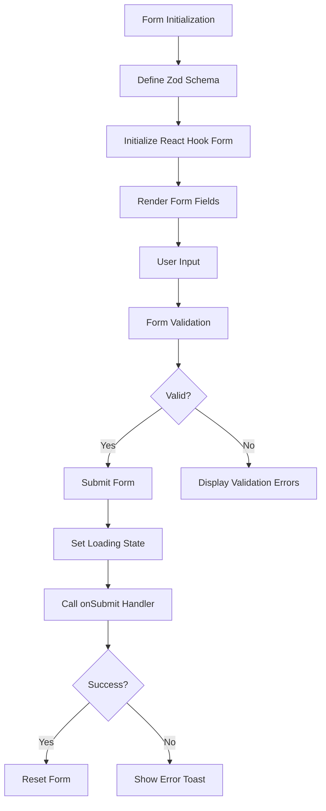
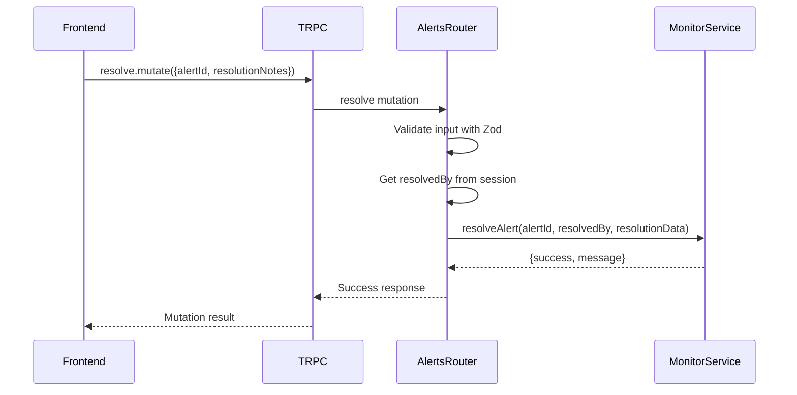
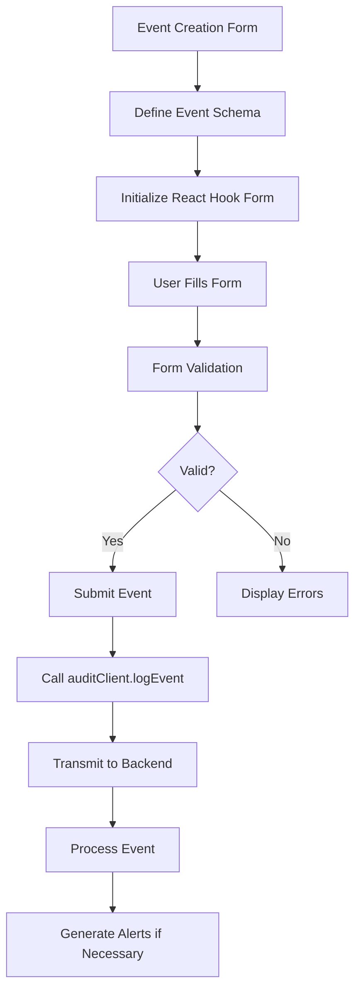
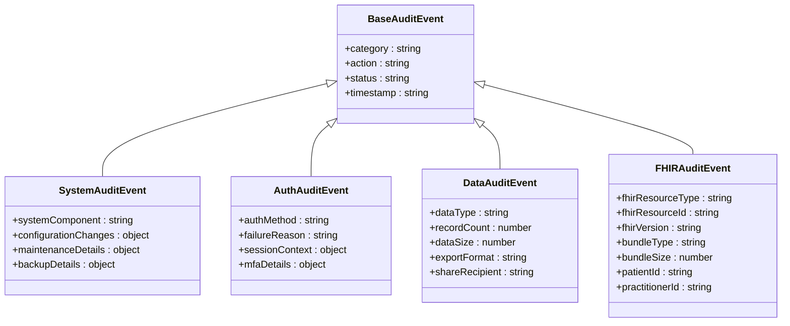
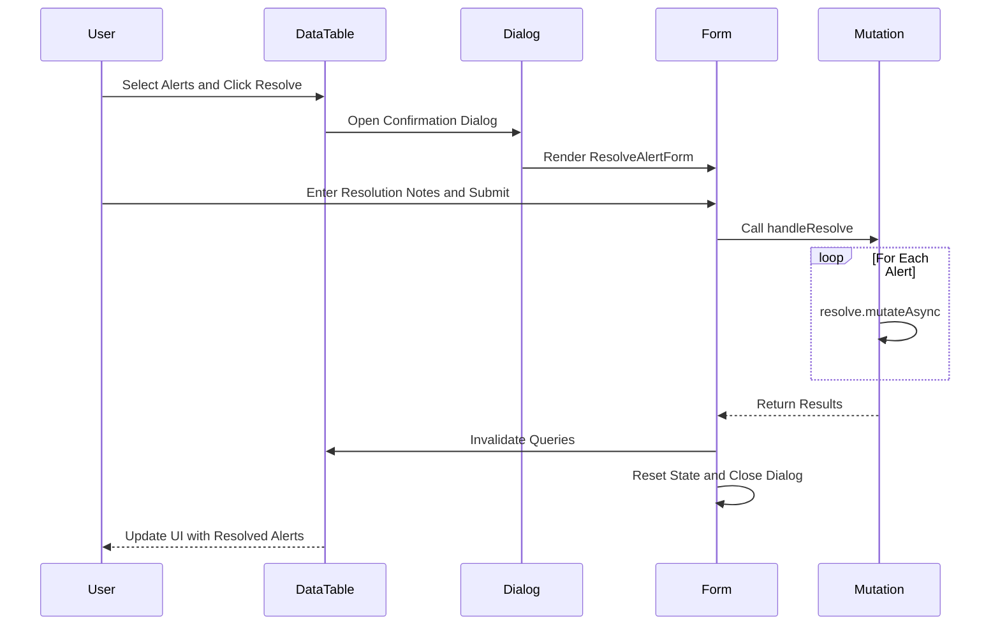

# Alert Creation and Resolution Workflow

<cite>
**Referenced Files in This Document**   
- [form.tsx](file://apps/web/src/components/alerts/form.tsx)
- [alerts.ts](file://apps/server/src/routers/alerts.ts)
- [audit-client.ts](file://apps/web/src/lib/audit-client.ts)
- [event-create-dialog.tsx](file://apps/web/src/components/event-calendar/event-create-dialog.tsx)
- [validations.ts](file://apps/web/src/lib/validations.ts)
- [event-categorization.ts](file://packages/audit/src/event/event-categorization.ts)
- [event-types.ts](file://packages/audit/src/event/event-types.ts)
- [active.tsx](file://apps/web/src/routes/dashboard/alerts/active.tsx)
</cite>

## Table of Contents
1. [Introduction](#introduction)
2. [Alert Resolution Form Implementation](#alert-resolution-form-implementation)
3. [Backend Integration for Alert Resolution](#backend-integration-for-alert-resolution)
4. [Alert Creation via Audit Events](#alert-creation-via-audit-events)
5. [Event Categorization and Type Enforcement](#event-categorization-and-type-enforcement)
6. [State Transition and Confirmation Workflow](#state-transition-and-confirmation-workflow)
7. [Error Handling and Data Integrity](#error-handling-and-data-integrity)
8. [Conclusion](#conclusion)

## Introduction
This document provides a comprehensive analysis of the Alert Creation and Resolution Workflow within the SMEDREC audit system. The workflow encompasses both the frontend user interface components and the backend processing logic that enables users to resolve alerts and create audit events that may trigger new alerts. The system leverages React Hook Form and Zod for form validation, TRPC for API communication, and a robust audit event categorization system to ensure data integrity and compliance. This documentation details the implementation of the resolution form, the backend API endpoints, the event creation process, and the mechanisms for state transition and error handling.

## Alert Resolution Form Implementation

The alert resolution form is implemented as a React component using the React Hook Form library for form state management and Zod for schema validation. The form is designed to collect resolution notes from users when they resolve one or more alerts. The component is located in `apps/web/src/components/alerts/form.tsx` and is a client-side component that manages its own state and handles form submission asynchronously.

The form schema is defined using Zod, specifying that the `resolutionNotes` field is a string. The form uses the `zodResolver` from `@hookform/resolvers/zod` to integrate Zod validation with React Hook Form. When the form is submitted, the `handleSubmit` function is called, which sets a loading state, calls the `onSubmit` prop with the form values, and handles any errors by displaying a toast notification using the `sonner` library.

**Diagram sources**
- [form.tsx](file://apps/web/src/components/alerts/form.tsx#L1-L73)

**Section sources**
- [form.tsx](file://apps/web/src/components/alerts/form.tsx#L1-L73)

## Backend Integration for Alert Resolution

The backend integration for alert resolution is handled through a TRPC router defined in `apps/server/src/routers/alerts.ts`. The `resolve` procedure is a protected mutation that requires authentication and accepts an input schema defined with Zod. The input schema includes `alertId` as a required string and `resolutionNotes` as an optional string. When the mutation is called, it retrieves the `resolvedBy` user ID from the session context and constructs a resolution data object that includes the resolver and the resolution notes.

The mutation calls the `monitor.alert.resolveAlert` method with the alert ID, the resolver ID, and the resolution data. If the resolution is successful, it returns a success response with a message. If an error occurs, it logs the error, creates a TRPCError, and throws it. The error handling includes detailed metadata that is passed to the error service for further processing and monitoring.

**Diagram sources**
- [alerts.ts](file://apps/server/src/routers/alerts.ts#L1-L230)

**Section sources**
- [alerts.ts](file://apps/server/src/routers/alerts.ts#L1-L230)

## Alert Creation via Audit Events

Alerts are created indirectly through the logging of audit events, which are processed by the system's monitoring service to detect suspicious patterns and generate alerts. The audit event creation process begins with the definition of event schemas in `apps/web/src/lib/validations.ts`, where the `createEventSchema` defines the structure of an event with fields such as `title`, `description`, `startDate`, `endDate`, `startTime`, `endTime`, `location`, `category`, and `color`.

The event creation form is implemented in `apps/web/src/components/event-calendar/event-create-dialog.tsx`, which uses React Hook Form with the `createEventSchema` resolver. When the form is submitted, the `handleSubmit` function is called, which currently displays a toast notification indicating that the handler should be overridden to implement actual event creation. In a production environment, this handler would connect to the backend to create the event.

The audit events are transmitted to the backend via the `audit-client` instance defined in `apps/web/src/lib/audit-client.ts`. The client is configured with a base URL and uses the `AuditClient` class from the `@repo/audit-client` package to communicate with the audit service. The client abstracts the details of the API calls and provides a simple interface for logging events.

**Diagram sources**
- [event-create-dialog.tsx](file://apps/web/src/components/event-calendar/event-create-dialog.tsx#L1-L130)
- [validations.ts](file://apps/web/src/lib/validations.ts#L1-L100)
- [audit-client.ts](file://apps/web/src/lib/audit-client.ts#L1-L10)

**Section sources**
- [event-create-dialog.tsx](file://apps/web/src/components/event-calendar/event-create-dialog.tsx#L1-L130)
- [validations.ts](file://apps/web/src/lib/validations.ts#L1-L100)
- [audit-client.ts](file://apps/web/src/lib/audit-client.ts#L1-L10)

## Event Categorization and Type Enforcement

The system enforces strict type enforcement and categorization of audit events through a comprehensive validation and categorization system defined in `packages/audit/src/event/event-categorization.ts` and `packages/audit/src/event/event-types.ts`. The categorization system uses type guards to determine the category of an audit action based on predefined lists of valid actions for each category: system, auth, data, and fhir.

The `getActionCategory` function determines the category of an action by checking if it matches any of the predefined actions in the respective category. The `validateCategorizedEvent` function validates that the action matches the declared category and performs category-specific validations. For example, system events are validated to ensure that system components are specified for certain actions, and authentication events are validated to ensure that principal IDs are provided.

The event types are defined as TypeScript interfaces that extend a base `BaseAuditEvent` interface, with specific fields for each category. Factory functions such as `createSystemAuditEvent`, `createAuthAuditEvent`, `createDataAuditEvent`, and `createFHIRAuditEvent` are provided to create events of the appropriate type with default values and required fields.

**Diagram sources**
- [event-categorization.ts](file://packages/audit/src/event/event-categorization.ts#L1-L382)
- [event-types.ts](file://packages/audit/src/event/event-types.ts#L1-L308)

**Section sources**
- [event-categorization.ts](file://packages/audit/src/event/event-categorization.ts#L1-L382)
- [event-types.ts](file://packages/audit/src/event/event-types.ts#L1-L308)

## State Transition and Confirmation Workflow

The state transition mechanism for resolving alerts involves a multi-step workflow that begins with the user selecting one or more alerts to resolve in the active alerts table. When the user clicks the resolve button, the `handlemultiResolve` function in `apps/web/src/routes/dashboard/alerts/active.tsx` is called, which collects the selected alert IDs into a set and opens a confirmation dialog.

The confirmation dialog renders the `ResolveAlertForm` component, which allows the user to enter resolution notes. When the form is submitted, the `handleResolve` function is called, which uses the `useMutation` hook from `@tanstack/react-query` to call the `trpc.alerts.resolve` mutation for each selected alert. The function uses `Promise.allSettled` to handle multiple mutations concurrently and provides feedback to the user based on the results.

After all mutations are complete, the function invalidates the queries to refresh the data, resets the state, and closes the dialog. This ensures that the UI is updated to reflect the resolved alerts and that the form is reset for future use.

**Diagram sources**
- [active.tsx](file://apps/web/src/routes/dashboard/alerts/active.tsx#L1-L117)

**Section sources**
- [active.tsx](file://apps/web/src/routes/dashboard/alerts/active.tsx#L1-L117)

## Error Handling and Data Integrity

The system implements comprehensive error handling and data integrity measures at multiple levels. On the frontend, form validation is handled by Zod, which provides detailed error messages that are displayed to the user. Network failures during form submission are caught in the `handleSubmit` function and result in a toast notification being displayed.

On the backend, the TRPC procedures include try-catch blocks that log errors and create TRPCError objects with detailed metadata. The error service is called to handle the error, which may include sending alerts or notifications. The audit events themselves are validated for integrity, with checks for required fields, data classification, and cryptographic hashing to prevent tampering.

The monitoring service processes events to detect suspicious patterns and generate alerts, which are then stored in the database with a resolved status. The system includes circuit breakers and retry mechanisms to handle temporary failures and ensure reliable processing of events.

## Conclusion
The Alert Creation and Resolution Workflow in the SMEDREC audit system is a robust and well-structured process that ensures data integrity, compliance, and user accountability. The frontend components provide a user-friendly interface for resolving alerts and creating audit events, while the backend services handle the complex logic of event processing, alert generation, and state management. The use of React Hook Form, Zod, TRPC, and a comprehensive event categorization system ensures that the system is both reliable and maintainable. The detailed error handling and data integrity measures provide confidence in the system's ability to operate correctly under normal and adverse conditions.