# Alert Management

<cite>
**Referenced Files in This Document**  
- [alerts.tsx](file://apps/web/src/components/alerts/data-table.tsx)
- [data-table-resolved.tsx](file://apps/web/src/components/alerts/data-table-resolved.tsx)
- [columns.tsx](file://apps/web/src/components/alerts/columns.tsx)
- [form.tsx](file://apps/web/src/components/alerts/form.tsx)
- [alerts.ts](file://apps/server/src/routers/alerts.ts)
- [audit-client.ts](file://apps/web/src/lib/audit-client.ts)
- [monitoring.ts](file://packages/audit/src/monitor/monitoring.ts)
- [database-alert-handler.ts](file://packages/audit/src/monitor/database-alert-handler.ts)
- [cleanup-old-alerts.ts](file://apps/inngest/src/inngest/functions/alerts/cleanup-old-alerts.ts)
</cite>

## Table of Contents
1. [Introduction](#introduction)
2. [Project Structure](#project-structure)
3. [Core Components](#core-components)
4. [Architecture Overview](#architecture-overview)
5. [Detailed Component Analysis](#detailed-component-analysis)
6. [Alert Creation and Resolution Workflow](#alert-creation-and-resolution-workflow)
7. [Data Fetching and State Management](#data-fetching-and-state-management)
8. [Filtering, Sorting, and Pagination](#filtering-sorting-and-pagination)
9. [Real-Time Updates and Notification Handling](#real-time-updates-and-notification-handling)
10. [Performance Optimization](#performance-optimization)
11. [Error Handling and Audit Client Integration](#error-handling-and-audit-client-integration)
12. [Background Jobs and Alert Lifecycle Management](#background-jobs-and-alert-lifecycle-management)
13. [Troubleshooting Guide](#troubleshooting-guide)
14. [Conclusion](#conclusion)

## Introduction
The Alert Management system is a critical component of the Smart Logs platform, designed to monitor, detect, and respond to system anomalies and security events. This document provides a comprehensive analysis of the alert management implementation, covering both frontend and backend components. The system enables users to view active and resolved alerts, create new alerts, acknowledge incidents, and manage alert lifecycle through a responsive web interface. The architecture leverages tRPC for type-safe communication, Inngest for background workflows, and a modular package structure to ensure scalability and maintainability.

## Project Structure
The Alert Management system spans multiple applications and packages within the monorepo, following a clean separation of concerns. The frontend components reside in the `web` application, while the backend logic is distributed across the `server`, `inngest`, and shared `packages`. This structure enables independent development and deployment of different system layers.

**Diagram sources**
- [apps/web/src/components/alerts](file://apps/web/src/components/alerts)
- [apps/server/src/routers/alerts.ts](file://apps/server/src/routers/alerts.ts)
- [apps/inngest/src/inngest/functions/alerts](file://apps/inngest/src/inngest/functions/alerts)
- [packages/audit](file://packages/audit)

**Section sources**
- [apps/web/src/components/alerts](file://apps/web/src/components/alerts)
- [apps/server/src/routers](file://apps/server/src/routers)
- [packages/audit](file://packages/audit)

## Core Components
The Alert Management system consists of several core components that work together to provide a complete alerting solution. The frontend includes data tables for displaying active and resolved alerts, form components for alert creation, and column definitions for table rendering. The backend provides tRPC routers for API endpoints, monitoring services for alert generation, and background functions for alert cleanup.

**Section sources**
- [apps/web/src/components/alerts](file://apps/web/src/components/alerts)
- [apps/server/src/routers/alerts.ts](file://apps/server/src/routers/alerts.ts)
- [packages/audit/src/monitor](file://packages/audit/src/monitor)

## Architecture Overview
The Alert Management system follows a layered architecture with clear separation between presentation, application logic, and data layers. The frontend communicates with the backend via tRPC, which provides end-to-end type safety. Alerts are generated by monitoring components in the audit package, stored in the database, and exposed through API endpoints. The UI fetches alert data, allows user interaction, and sends commands back to the server.

```mermaid
sequenceDiagram
participant User as "User"
participant UI as "Alert UI"
participant Client as "Audit Client"
participant Server as "Alerts Router"
participant Service as "Monitoring Service"
participant DB as "Database"
User->>UI : View Alerts
UI->>Client : fetchActiveAlerts()
Client->>Server : tRPC query
Server->>Service : getActiveAlerts()
Service->>DB : SELECT active alerts
DB-->>Service : Alert data
Service-->>Server : Return alerts
Server-->>Client : Response
Client-->>UI : Update state
UI-->>User : Display alerts
User->>UI : Resolve Alert
UI->>Client : resolveAlert(id)
Client->>Server : tRPC mutation
Server->>Service : updateAlertStatus(id, resolved)
Service->>DB : UPDATE alert status
DB-->>Service : Confirmation
Service-->>Server : Success
Server-->>Client : Response
Client-->>UI : Update state
UI-->>User : Show success
```

**Diagram sources**
- [apps/web/src/components/alerts/data-table.tsx](file://apps/web/src/components/alerts/data-table.tsx)
- [apps/server/src/routers/alerts.ts](file://apps/server/src/routers/alerts.ts)
- [packages/audit/src/monitor/monitoring.ts](file://packages/audit/src/monitor/monitoring.ts)

## Detailed Component Analysis

### Alert Data Table Components
The alert display system is implemented using two main data table components: one for active alerts and another for resolved alerts. These components use a shared column configuration and leverage a common data fetching mechanism through the audit client.

**Diagram sources**
- [apps/web/src/components/alerts/data-table.tsx](file://apps/web/src/components/alerts/data-table.tsx)
- [apps/web/src/components/alerts/data-table-resolved.tsx](file://apps/web/src/components/alerts/data-table-resolved.tsx)
- [apps/web/src/components/alerts/columns.tsx](file://apps/web/src/components/alerts/columns.tsx)

**Section sources**
- [apps/web/src/components/alerts/data-table.tsx](file://apps/web/src/components/alerts/data-table.tsx)
- [apps/web/src/components/alerts/data-table-resolved.tsx](file://apps/web/src/components/alerts/data-table-resolved.tsx)
- [apps/web/src/components/alerts/columns.tsx](file://apps/web/src/components/alerts/columns.tsx)

### Alert Form Component
The alert creation form provides a user interface for manually creating new alerts. It includes validation logic and integrates with the audit client to submit new alerts to the backend system.

**Diagram sources**
- [apps/web/src/components/alerts/form.tsx](file://apps/web/src/components/alerts/form.tsx)
- [apps/web/src/lib/audit-client.ts](file://apps/web/src/lib/audit-client.ts)

**Section sources**
- [apps/web/src/components/alerts/form.tsx](file://apps/web/src/components/alerts/form.tsx)

## Alert Creation and Resolution Workflow
The alert management system supports both automated and manual alert creation, with a well-defined workflow for alert resolution. When an alert is created, it transitions through various states from active to resolved, with proper audit logging at each step.

**Diagram sources**
- [apps/web/src/components/alerts/form.tsx](file://apps/web/src/components/alerts/form.tsx)
- [apps/server/src/routers/alerts.ts](file://apps/server/src/routers/alerts.ts)
- [packages/audit/src/monitor/database-alert-handler.ts](file://packages/audit/src/monitor/database-alert-handler.ts)

**Section sources**
- [apps/web/src/components/alerts/form.tsx](file://apps/web/src/components/alerts/form.tsx)
- [apps/server/src/routers/alerts.ts](file://apps/server/src/routers/alerts.ts)

## Data Fetching and State Management
The Alert Management system uses tRPC for data fetching, providing type-safe API communication between the frontend and backend. The audit client encapsulates all API calls, ensuring consistent error handling and authentication.

**Diagram sources**
- [apps/web/src/lib/audit-client.ts](file://apps/web/src/lib/audit-client.ts)
- [apps/server/src/routers/alerts.ts](file://apps/server/src/routers/alerts.ts)
- [apps/web/src/utils/trpc.ts](file://apps/web/src/utils/trpc.ts)

**Section sources**
- [apps/web/src/lib/audit-client.ts](file://apps/web/src/lib/audit-client.ts)
- [apps/server/src/routers/alerts.ts](file://apps/server/src/routers/alerts.ts)

## Filtering, Sorting, and Pagination
The alert tables support comprehensive data manipulation features including filtering, sorting, and pagination. These features are implemented consistently across both active and resolved alert views, with parameters passed through the tRPC API to the backend.

**Diagram sources**
- [apps/web/src/components/alerts/data-table.tsx](file://apps/web/src/components/alerts/data-table.tsx)
- [apps/web/src/lib/searchParams.ts](file://apps/web/src/lib/searchParams.ts)
- [apps/server/src/routers/alerts.ts](file://apps/server/src/routers/alerts.ts)

**Section sources**
- [apps/web/src/components/alerts/data-table.tsx](file://apps/web/src/components/alerts/data-table.tsx)
- [apps/web/src/lib/searchParams.ts](file://apps/web/src/lib/searchParams.ts)

## Real-Time Updates and Notification Handling
The system handles real-time updates through a combination of polling and background processing. While WebSockets are not explicitly implemented, the architecture supports frequent polling to ensure users see the latest alert status.

**Diagram sources**
- [apps/web/src/components/alerts/data-table.tsx](file://apps/web/src/components/alerts/data-table.tsx)
- [packages/audit/src/monitor/monitoring.ts](file://packages/audit/src/monitor/monitoring.ts)
- [apps/server/src/routers/alerts.ts](file://apps/server/src/routers/alerts.ts)

**Section sources**
- [apps/web/src/components/alerts/data-table.tsx](file://apps/web/src/components/alerts/data-table.tsx)
- [packages/audit/src/monitor/monitoring.ts](file://packages/audit/src/monitor/monitoring.ts)

## Performance Optimization
The Alert Management system implements several performance optimizations to handle large volumes of alerts efficiently. These include database indexing, query optimization, and client-side caching strategies.

**Diagram sources**
- [packages/audit-db/src/db/partitioning.ts](file://packages/audit-db/src/db/partitioning.ts)
- [packages/audit-db/src/db/schema.ts](file://packages/audit-db/src/db/schema.ts)
- [packages/audit-db/src/cache/redis-query-cache.ts](file://packages/audit-db/src/cache/redis-query-cache.ts)

**Section sources**
- [packages/audit-db/src/db/partitioning.ts](file://packages/audit-db/src/db/partitioning.ts)
- [packages/audit-db/src/cache/redis-query-cache.ts](file://packages/audit-db/src/cache/redis-query-cache.ts)

## Error Handling and Audit Client Integration
The system implements robust error handling through the audit client, which wraps all API calls with consistent error management. This ensures that users receive meaningful feedback when operations fail.

**Diagram sources**
- [apps/web/src/lib/audit-client.ts](file://apps/web/src/lib/audit-client.ts)
- [apps/server/src/lib/errors/unified-handler.ts](file://apps/server/src/lib/errors/unified-handler.ts)
- [packages/audit/src/error/error-handling.ts](file://packages/audit/src/error/error-handling.ts)

**Section sources**
- [apps/web/src/lib/audit-client.ts](file://apps/web/src/lib/audit-client.ts)
- [apps/server/src/lib/errors/unified-handler.ts](file://apps/server/src/lib/errors/unified-handler.ts)

## Background Jobs and Alert Lifecycle Management
The system uses Inngest to manage background jobs for alert lifecycle management, including automated cleanup of old alerts. This ensures the database remains performant by removing resolved alerts that are no longer needed.

**Diagram sources**
- [apps/inngest/src/inngest/functions/alerts/cleanup-old-alerts.ts](file://apps/inngest/src/inngest/functions/alerts/cleanup-old-alerts.ts)
- [packages/audit/src/monitor/database-alert-handler.ts](file://packages/audit/src/monitor/database-alert-handler.ts)

**Section sources**
- [apps/inngest/src/inngest/functions/alerts/cleanup-old-alerts.ts](file://apps/inngest/src/inngest/functions/alerts/cleanup-old-alerts.ts)

## Troubleshooting Guide
This section addresses common issues encountered when working with the Alert Management system and provides solutions for diagnosis and resolution.

### Common Issues and Solutions
- **Alerts not appearing in UI**: Verify that the tRPC query is being called and check browser developer tools for network errors. Ensure the user has appropriate permissions to view alerts.
- **Slow performance with large alert volumes**: Check database indexing on the alerts table, particularly on status and created_at fields. Verify that partitioning is properly configured.
- **Failed alert creation**: Examine the form validation rules and ensure all required fields are provided. Check server logs for validation errors.
- **Real-time updates not working**: Verify the polling interval in the UI component and check that the monitoring service is actively generating alerts.
- **Background cleanup not running**: Check Inngest dashboard for function execution history and verify the schedule is properly configured.

**Section sources**
- [apps/web/src/components/alerts/data-table.tsx](file://apps/web/src/components/alerts/data-table.tsx)
- [apps/server/src/routers/alerts.ts](file://apps/server/src/routers/alerts.ts)
- [apps/inngest/src/inngest/functions/alerts/cleanup-old-alerts.ts](file://apps/inngest/src/inngest/functions/alerts/cleanup-old-alerts.ts)

## Conclusion
The Alert Management system provides a comprehensive solution for monitoring and responding to system events within the Smart Logs platform. Its architecture leverages modern TypeScript patterns with tRPC for type-safe API communication, a clean separation of concerns between frontend and backend components, and background processing for lifecycle management. The system is designed to handle large volumes of alerts efficiently through database optimization and caching strategies. Future enhancements could include real-time WebSocket updates, advanced alert correlation, and machine learning-based anomaly detection to further improve the system's effectiveness.