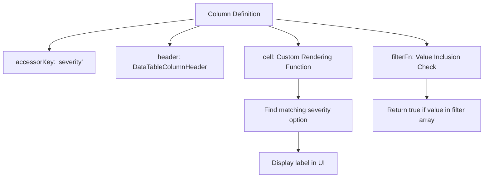
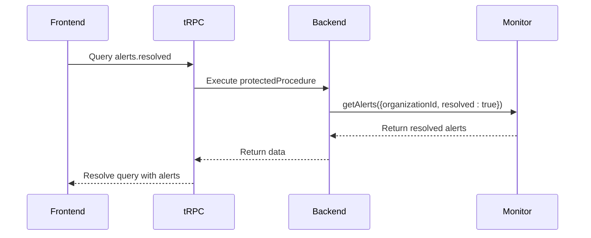
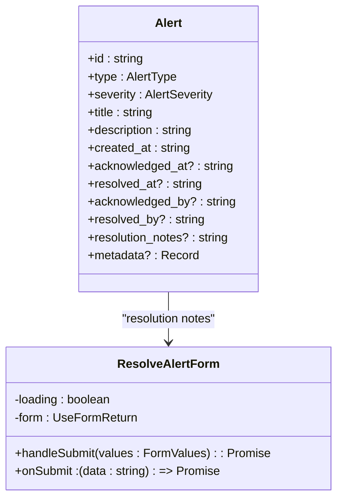
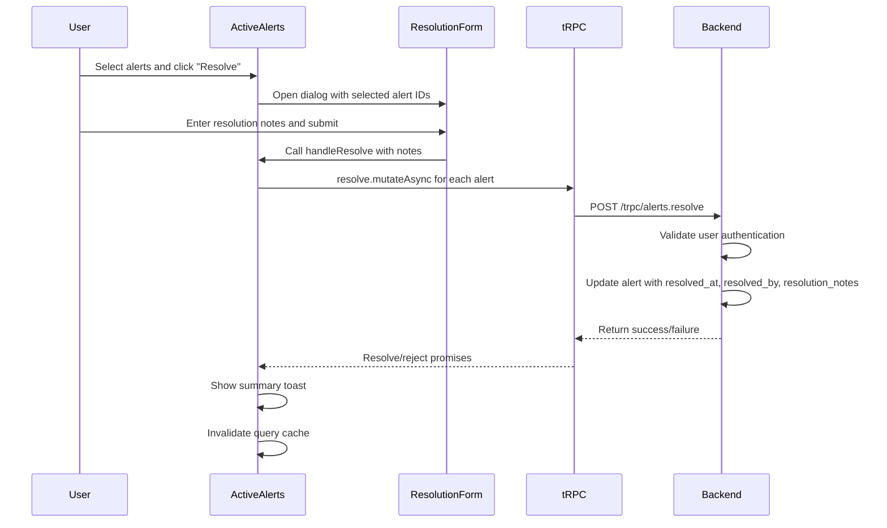
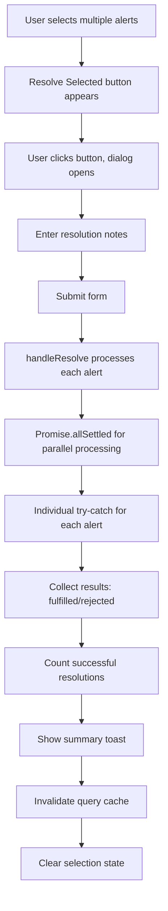
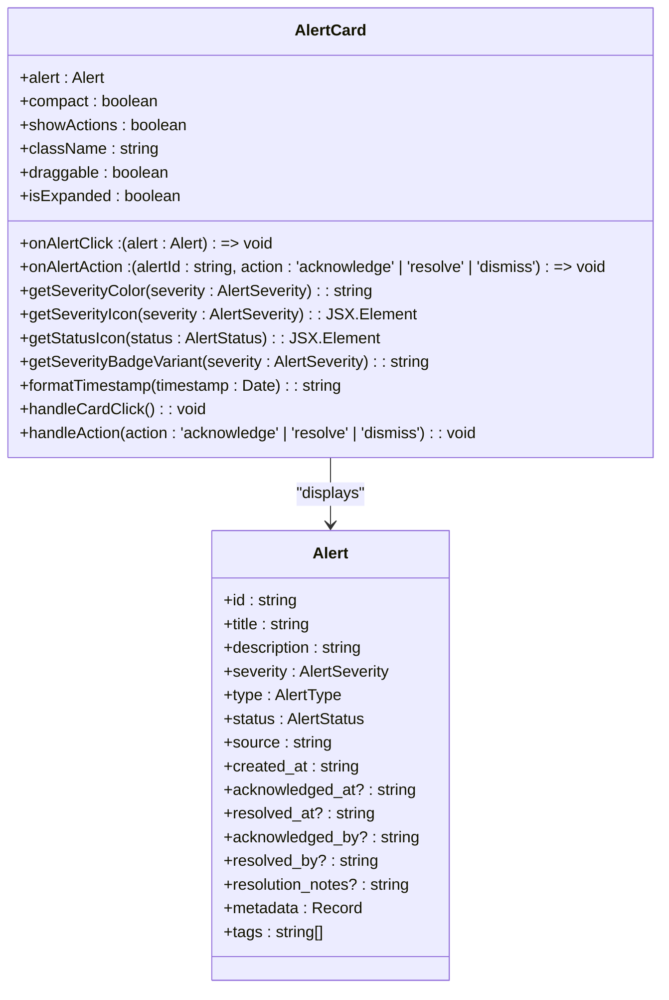

# Resolved Alerts Management

<cite>
**Referenced Files in This Document**   
- [data-table-resolved.tsx](file://apps/web/src/components/alerts/data-table-resolved.tsx) - *Updated in recent commit*
- [columns.tsx](file://apps/web/src/components/alerts/columns.tsx) - *Updated in recent commit*
- [alerts.ts](file://apps/server/src/routers/alerts.ts) - *Updated in recent commit*
- [resolved.tsx](file://apps/web/src/routes/dashboard/alerts/resolved.tsx) - *Updated in recent commit*
- [active.tsx](file://apps/web/src/routes/dashboard/alerts/active.tsx) - *Updated in recent commit*
- [form.tsx](file://apps/web/src/components/alerts/form.tsx) - *Updated in recent commit*
- [types.ts](file://apps/server/src/lib/graphql/types.ts) - *Updated in recent commit*
- [AlertCard.tsx](file://apps/app/src/components/alerts/core/AlertCard.tsx) - *Added in recent commit*
- [AlertDashboard.tsx](file://apps/app/src/components/alerts/core/AlertDashboard.tsx) - *Added in recent commit*
- [AlertList.tsx](file://apps/app/src/components/alerts/core/AlertList.tsx) - *Added in recent commit*
- [alert.ts](file://apps/app/src/lib/types/alert.ts) - *Updated in recent commit*
</cite>

## Update Summary
**Changes Made**   
- Updated property names in Alert interface from `timestamp` to `created_at` and `acknowledgedBy` to `acknowledged_by` across all components
- Added new AlertCard, AlertDashboard, and AlertList components to the documentation
- Updated resolution metadata section to reflect new property naming conventions
- Added documentation for new dashboard component with board view functionality
- Updated state transition section to reflect changes in alert property naming
- Added new diagram for AlertCard component structure

## Table of Contents
1. [Resolved Alerts Data Table Implementation](#resolved-alerts-data-table-implementation)
2. [Column Configuration and Rendering](#column-configuration-and-rendering)
3. [Backend Integration via tRPC](#backend-integration-via-trpc)
4. [Resolution Metadata Display and Validation](#resolution-metadata-display-and-validation)
5. [State Transition from Active to Resolved](#state-transition-from-active-to-resolved)
6. [Data Consistency and Audit Logging](#data-consistency-and-audit-logging)
7. [Bulk Resolution Operations](#bulk-resolution-operations)
8. [Cleanup of Old Resolved Alerts](#cleanup-of-old-resolved-alerts)
9. [New Alert Components](#new-alert-components)

## Resolved Alerts Data Table Implementation

The Resolved Alerts Management interface features a specialized data table component designed to display resolved alerts with filtering, pagination, and bulk actions. The implementation is based on TanStack React Table, providing a flexible and performant solution for rendering large datasets.

The `DataTable` component in `data-table-resolved.tsx` accepts generic props for columns, data, and a cleanup callback. It supports row selection, sorting, filtering, and column visibility controls. The table is initialized with a default page size of 25 rows and includes built-in pagination controls.

Key features of the resolved alerts table include:
- Text-based filtering on the title column
- Faceted filtering for severity and type using dropdown menus
- Column visibility toggling through the view options control
- Reset filters button that appears when filters are applied
- Delete old resolved alerts button for bulk cleanup operations

The component is designed to be reusable and composable, allowing integration with different data sources and column configurations while maintaining consistent UI/UX patterns.

**Section sources**
- [data-table-resolved.tsx](file://apps/web/src/components/alerts/data-table-resolved.tsx#L0-L170)

## Column Configuration and Rendering

The column configuration for alerts is centralized in the `columns.tsx` file, which exports a `createColumns` function that returns an array of `ColumnDef<Alert>` objects. This approach ensures consistency between active and resolved alert tables while allowing for specialized rendering logic.

The columns defined include:
- **Select**: A checkbox column for row selection, rendered using the Checkbox component from the UI library
- **Severity**: Displays severity level with custom rendering that maps severity values to human-readable labels
- **Type**: Shows alert type with similar custom rendering for type values
- **Title**: Simple text display of the alert title
- **Description**: Truncated display of the description with a maximum width of 500px
- **Source**: Text display of the alert source

Each column uses the `DataTableColumnHeader` component for consistent header styling and sorting functionality. The faceted filters for severity and type use predefined options from the `severities` and `types` constants, which are imported from the `data.tsx` file.

The filtering mechanism uses the `filterFn` property to implement custom filtering logic, checking if the filter value array includes the row's value for the respective column.

**Diagram sources**
- [columns.tsx](file://apps/web/src/components/alerts/columns.tsx#L0-L99)
- [data.tsx](file://apps/web/src/components/alerts/data.tsx#L0-L14)

**Section sources**
- [columns.tsx](file://apps/web/src/components/alerts/columns.tsx#L0-L99)

## Backend Integration via tRPC

The Resolved Alerts Management interface integrates with the backend through tRPC queries, specifically the `alerts.resolved` query defined in the `alerts.ts` router. This query retrieves resolved alerts for the current organization, differing from the active alerts query in its filtering criteria.

The `resolved` procedure in the tRPC router applies a filter with `resolved: true` to retrieve only resolved alerts, while the `active` procedure retrieves alerts that have not been resolved. Both queries use the same underlying `getAlerts` method but with different filter parameters.

The tRPC integration follows a protected procedure pattern, ensuring that only authenticated users can access alert data. Error handling is implemented with comprehensive logging and error reporting through the error service, which captures metadata including request ID, user ID, session ID, and organization context.

**Diagram sources**
- [alerts.ts](file://apps/server/src/routers/alerts.ts#L0-L231)

**Section sources**
- [alerts.ts](file://apps/server/src/routers/alerts.ts#L0-L231)

## Resolution Metadata Display and Validation

Resolution metadata is captured and displayed through a structured process that ensures data integrity and provides auditability. The metadata includes the resolution timestamp (`resolved_at`), the resolver ID (`resolved_by`), and optional resolution notes.

The `Alert` interface, defined in `types.ts`, includes optional fields for resolution metadata:
- `resolved_at?: string`: ISO timestamp when the alert was resolved
- `resolved_by?: string`: User ID of the person who resolved the alert
- `resolution_notes?: string`: Optional notes explaining how the alert was resolved

When resolving an alert, the frontend collects resolution notes through a form component that uses React Hook Form with Zod validation. The form schema validates that resolution notes are provided as a string, though they remain optional in the backend implementation.

The resolution process validates that the user is authenticated by checking the session context before allowing the resolution action. The backend automatically captures the `resolved_by` field from the session and sets the `resolved_at` timestamp when the alert is resolved.

**Diagram sources**
- [types.ts](file://apps/server/src/lib/graphql/types.ts#L254-L267)
- [form.tsx](file://apps/web/src/components/alerts/form.tsx#L0-L74)

**Section sources**
- [types.ts](file://apps/server/src/lib/graphql/types.ts#L254-L267)
- [form.tsx](file://apps/web/src/components/alerts/form.tsx#L0-L74)

## State Transition from Active to Resolved

The state transition from active to resolved alerts follows a well-defined process that ensures data consistency and proper audit logging. This transition occurs when a user resolves one or more active alerts through the dashboard interface.

The process begins in the active alerts page (`active.tsx`), where users can select multiple alerts and initiate the resolution process. When alerts are selected, their IDs are stored in the `resolvingAlert` state, and a dialog is opened to collect resolution notes.

The `handlemultiResolve` function captures the selected alerts and opens the resolution dialog, while the `handleResolve` function processes the resolution request. It uses the `resolveAlert` mutation from tRPC to resolve each selected alert individually, handling successes and failures appropriately.

Upon successful resolution, the frontend displays a toast notification summarizing the results, and the query cache is invalidated to ensure the UI reflects the updated state. The resolved alerts are removed from the active alerts view and will appear in the resolved alerts view when queried.

**Diagram sources**
- [active.tsx](file://apps/web/src/routes/dashboard/alerts/active.tsx#L0-L118)
- [alerts.ts](file://apps/server/src/routers/alerts.ts#L100-L171)

**Section sources**
- [active.tsx](file://apps/web/src/routes/dashboard/alerts/active.tsx#L0-L118)

## Data Consistency and Audit Logging

Data consistency between active and resolved alert views is maintained through proper cache invalidation and query management. When alerts are resolved, the frontend invalidates the active alerts query, triggering a refetch that removes the resolved alerts from the active view.

The backend ensures data consistency by using atomic operations when updating alert status. The `resolveAlert` method in the monitor service updates both the `resolved` status and associated metadata fields in a single database transaction, preventing partial updates.

Audit logging of resolution actions is implemented through the error service, which captures detailed metadata about each resolution operation. The error handling middleware logs the resolution attempt with context including:
- Request ID for traceability
- User ID and session ID for authentication context
- Organization ID for multi-tenancy
- Operation details and outcome

This comprehensive logging provides an audit trail for compliance purposes and enables troubleshooting of resolution operations. The logs capture both successful resolutions and failures, with appropriate error messages and stack traces when available.

**Section sources**
- [alerts.ts](file://apps/server/src/routers/alerts.ts#L0-L231)
- [active.tsx](file://apps/web/src/routes/dashboard/alerts/active.tsx#L0-L118)

## Bulk Resolution Operations

Bulk resolution operations allow users to resolve multiple alerts simultaneously, improving efficiency when handling related issues. The implementation uses a combination of frontend selection mechanics and backend processing to handle multiple alerts.

The process begins with row selection in the active alerts table, where users can select multiple alerts using checkboxes. When alerts are selected, the "Resolve Selected" button appears, allowing users to initiate the bulk resolution process.

The `handlemultiResolve` function captures the selected alerts and stores their IDs in the `resolvingAlert` state. When the user submits the resolution form, the `handleResolve` function processes each alert through a `Promise.allSettled` call, which ensures that all resolution attempts are made even if some fail.

This approach provides several benefits:
- Individual error handling for each alert resolution
- Comprehensive success/failure reporting
- Partial success scenarios where some alerts are resolved while others fail
- User feedback through toast notifications that summarize the results

The implementation gracefully handles network errors and validation failures, ensuring that the resolution of one alert does not prevent attempts to resolve others in the same batch.

**Diagram sources**
- [active.tsx](file://apps/web/src/routes/dashboard/alerts/active.tsx#L0-L118)
- [data-table.tsx](file://apps/web/src/components/alerts/data-table.tsx#L0-L191)

**Section sources**
- [active.tsx](file://apps/web/src/routes/dashboard/alerts/active.tsx#L0-L118)

## Cleanup of Old Resolved Alerts

The system provides functionality to clean up old resolved alerts based on retention policies, helping to manage storage and maintain performance. This feature is accessible through the resolved alerts interface via a "Delete old resolved alerts" button.

The cleanup operation is implemented as a tRPC mutation in the `alerts` router, specifically the `cleanup` procedure. This mutation accepts an optional `retentionDays` parameter that specifies how many days of resolved alerts to retain, with a default behavior that likely follows organization-specific retention policies.

The frontend implementation in `data-table-resolved.tsx` includes a cleanup button that calls the `onCleanup` prop when clicked. However, the actual resolved alerts page (`resolved.tsx`) currently has an empty `handleCleanup` function, indicating that the implementation may be incomplete or configured elsewhere.

The cleanup process likely involves:
- Querying for resolved alerts older than the retention period
- Removing these alerts from the primary storage
- Possibly archiving them to cold storage for compliance purposes
- Updating any related indexes or search data

This functionality helps maintain system performance by preventing the accumulation of historical alert data while respecting compliance requirements for data retention.

**Section sources**
- [data-table-resolved.tsx](file://apps/web/src/components/alerts/data-table-resolved.tsx#L0-L170)
- [alerts.ts](file://apps/server/src/routers/alerts.ts#L172-L231)
- [resolved.tsx](file://apps/web/src/routes/dashboard/alerts/resolved.tsx#L0-L34)

## New Alert Components

The alert management system has been enhanced with new components that provide improved user experience and accessibility. These components include AlertCard, AlertDashboard, and AlertList, which work together to create a comprehensive alert management interface.

### AlertCard Component

The AlertCard component provides a compact representation of an alert with key information and quick actions. It displays the alert title, description, severity, status, and source, along with timestamps for creation and resolution.

**Diagram sources**
- [AlertCard.tsx](file://apps/app/src/components/alerts/core/AlertCard.tsx#L0-L440)

**Section sources**
- [AlertCard.tsx](file://apps/app/src/components/alerts/core/AlertCard.tsx#L0-L440)

### AlertDashboard Component

The AlertDashboard component provides a comprehensive view of all alerts with multiple display options. It supports list, board, and statistics views, allowing users to choose the most appropriate visualization for their needs.

The board view organizes alerts by status (Active, Acknowledged, Resolved, Dismissed) in separate columns, providing a Kanban-style interface for managing alert workflows. The list view displays alerts in a traditional table format with sorting and filtering capabilities.

**Section sources**
- [AlertDashboard.tsx](file://apps/app/src/components/alerts/core/AlertDashboard.tsx#L0-L458)

### AlertList Component

The AlertList component displays alerts in a scrollable list format with support for virtualization when dealing with large datasets. It includes sorting controls for date and severity, and displays a count of total alerts.

The component supports keyboard navigation with shortcuts (j/k for navigation, Enter for selection) and provides expandable details for each alert. When expanded, additional information such as acknowledgment and resolution details are displayed.

**Section sources**
- [AlertList.tsx](file://apps/app/src/components/alerts/core/AlertList.tsx#L0-L571)