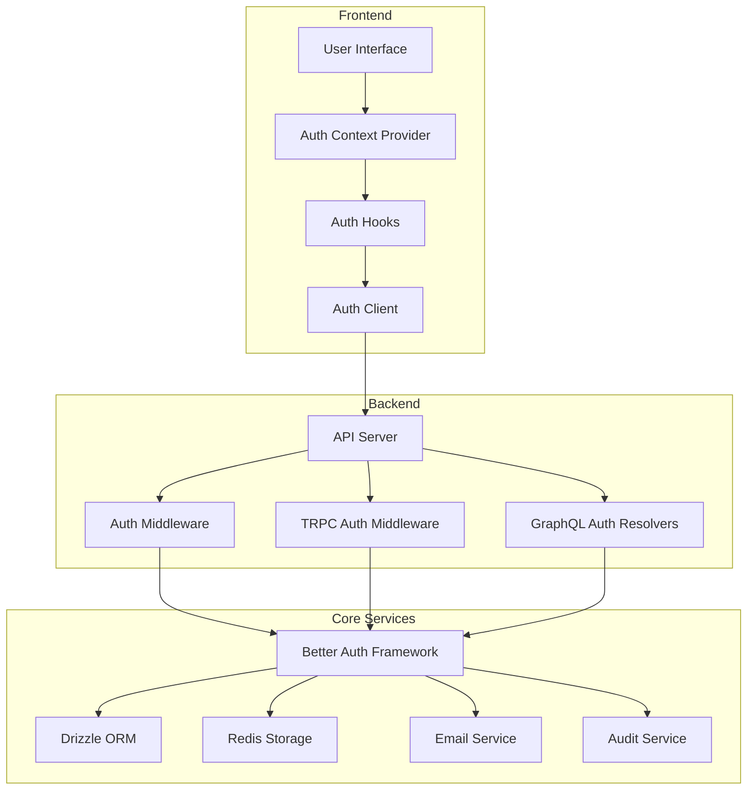
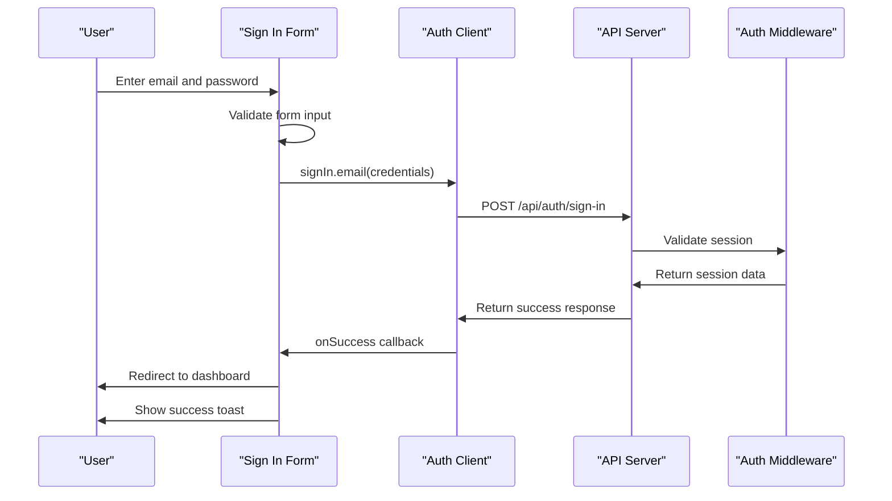
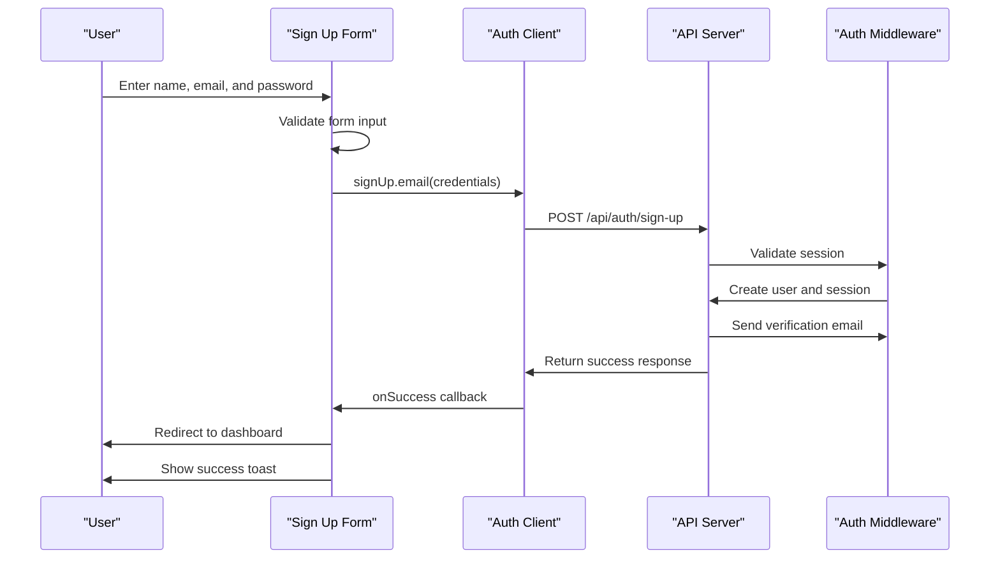
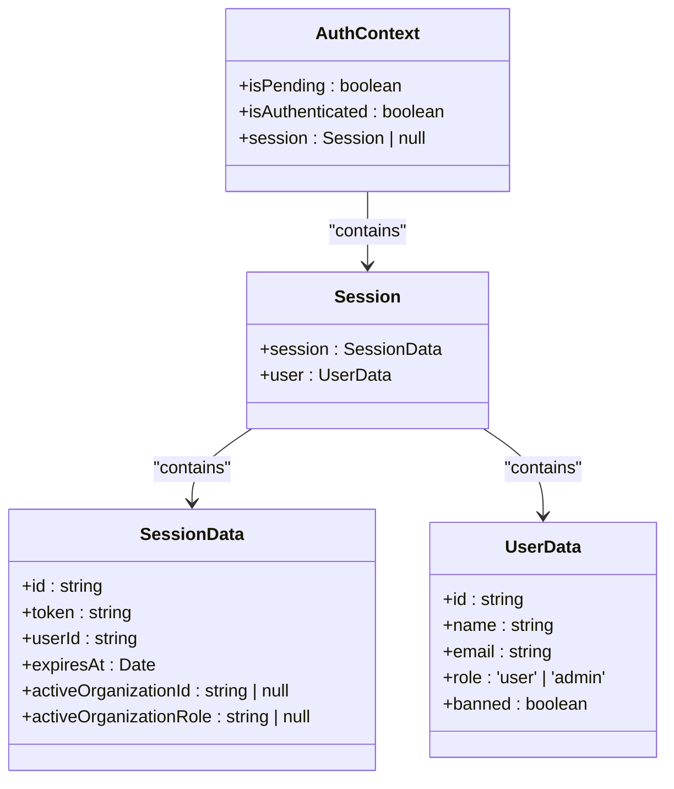
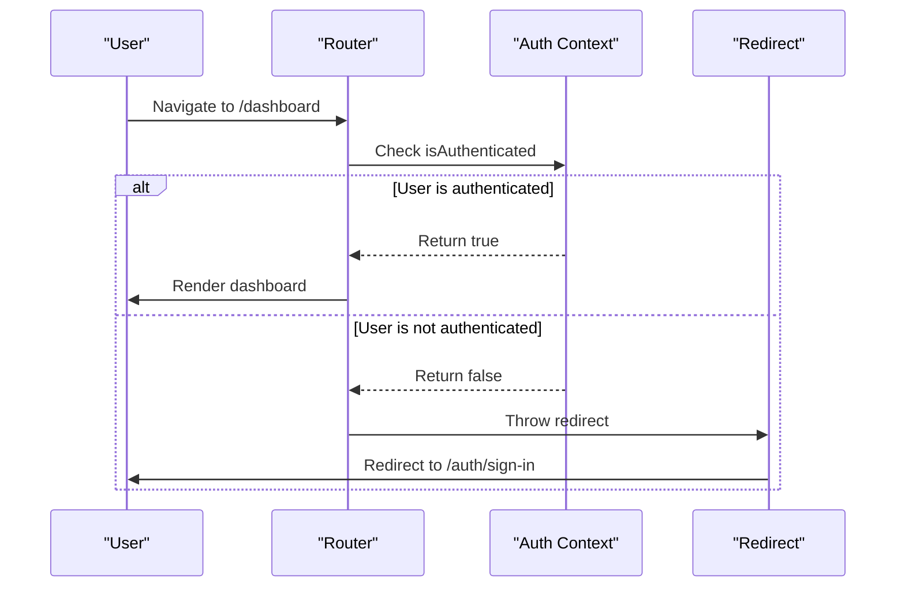
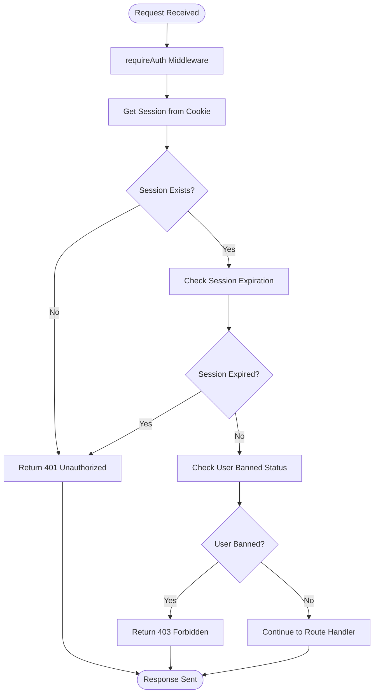
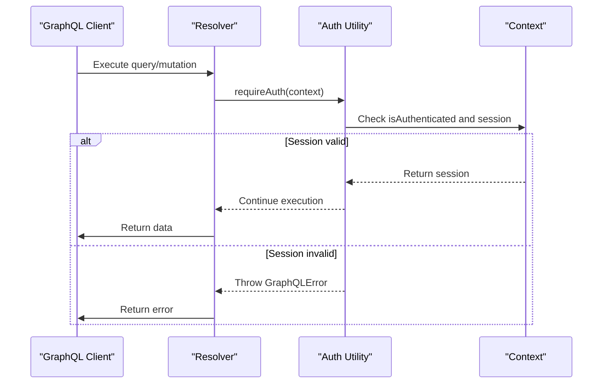
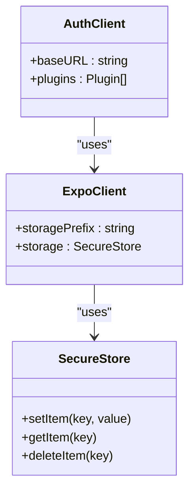

# Authentication Flow

<cite>
**Referenced Files in This Document**   
- [auth.tsx](file://apps/web/src/contexts/auth.tsx)
- [auth-hooks.ts](file://apps/web/src/hooks/auth-hooks.ts)
- [auth-client.ts](file://apps/web/src/lib/auth-client.ts)
- [sign-in-form.tsx](file://apps/web/src/components/sign-in-form.tsx)
- [sign-up-form.tsx](file://apps/web/src/components/sign-up-form.tsx)
- [auth.ts](file://apps/server/src/lib/middleware/auth.ts)
- [auth.ts](file://apps/server/src/lib/auth.ts)
- [auth.ts](file://packages/auth/src/auth.ts)
- [auth.ts](file://apps/server/src/lib/graphql/auth.ts)
- [$pathname.tsx](file://apps/web/src/routes/auth/$pathname.tsx)
- [route.tsx](file://apps/web/src/routes/dashboard/route.tsx)
- [auth-client.ts](file://apps/native/lib/auth-client.ts)
</cite>

## Table of Contents
1. [Introduction](#introduction)
2. [Authentication Architecture Overview](#authentication-architecture-overview)
3. [Core Components](#core-components)
4. [Sign-In Implementation](#sign-in-implementation)
5. [Sign-Up Implementation](#sign-up-implementation)
6. [Session Management](#session-management)
7. [Protected Routes and Authorization](#protected-routes-and-authorization)
8. [Server-Side Authentication](#server-side-authentication)
9. [GraphQL Authentication](#graphql-authentication)
10. [Native Application Authentication](#native-application-authentication)
11. [Error Handling and Security](#error-handling-and-security)
12. [Token Management](#token-management)
13. [Social Login and Custom Providers](#social-login-and-custom-providers)
14. [Troubleshooting Common Issues](#troubleshooting-common-issues)

## Introduction
The Authentication Flow in the Smart Logs application provides a comprehensive system for user authentication, session management, and access control. Built on the Better Auth framework, the system supports email/password authentication, API key access, organization-based permissions, and social login integration. The authentication architecture spans both frontend and backend components, with a focus on security, audit logging, and seamless user experience. This document details the implementation of sign-in, sign-up, session management, and related processes, providing insights into the codebase structure and functionality.

## Authentication Architecture Overview
The authentication system follows a layered architecture with distinct components for frontend, backend, and shared services. The frontend uses React with Tanstack Router and Better Auth's React client for state management and UI interactions. The backend implements authentication middleware using Hono and TRPC, with session validation and access control. The core authentication logic is encapsulated in a shared package that provides database integration, Redis storage, and email services.



**Diagram sources**
- [auth.tsx](file://apps/web/src/contexts/auth.tsx)
- [auth-hooks.ts](file://apps/web/src/hooks/auth-hooks.ts)
- [auth-client.ts](file://apps/web/src/lib/auth-client.ts)
- [auth.ts](file://apps/server/src/lib/middleware/auth.ts)
- [auth.ts](file://packages/auth/src/auth.ts)

## Core Components
The authentication system consists of several core components that work together to provide a secure and user-friendly experience. The AuthContext provider manages authentication state across the application, while auth hooks provide convenient access to authentication functionality. The auth client handles communication with the backend service, and middleware components enforce authentication rules at the API level.

**Section sources**
- [auth.tsx](file://apps/web/src/contexts/auth.tsx)
- [auth-hooks.ts](file://apps/web/src/hooks/auth-hooks.ts)
- [auth-client.ts](file://apps/web/src/lib/auth-client.ts)

## Sign-In Implementation
The sign-in process is implemented through a dedicated sign-in form component that handles user authentication via email and password. The form uses Tanstack React Form for state management and validation, with Zod for schema validation. Upon successful authentication, users are redirected to the dashboard with appropriate feedback.



**Diagram sources**
- [sign-in-form.tsx](file://apps/web/src/components/sign-in-form.tsx)
- [auth-client.ts](file://apps/web/src/lib/auth-client.ts)
- [auth.ts](file://apps/server/src/lib/middleware/auth.ts)

### Form Validation and Error Handling
The sign-in form implements client-side validation using Zod to ensure email format and password length requirements are met. Error messages are displayed inline with the form fields, providing immediate feedback to users. Server-side errors are handled through the auth client's onError callback, with error messages displayed using the Sonner toast notification system.

```typescript
const form = useForm({
    defaultValues: {
        email: '',
        password: '',
    },
    onSubmit: async ({ value }) => {
        await authClient.signIn.email(
            {
                email: value.email,
                password: value.password,
            },
            {
                onSuccess: () => {
                    navigate({
                        to: '/dashboard',
                    })
                    toast.success('Sign in successful')
                },
                onError: (error) => {
                    toast.error(error.error.message)
                },
            }
        )
    },
    validators: {
        onSubmit: z.object({
            email: z.email('Invalid email address'),
            password: z.string().min(8, 'Password must be at least 8 characters'),
        }),
    },
})
```

**Section sources**
- [sign-in-form.tsx](file://apps/web/src/components/sign-in-form.tsx)

## Sign-Up Implementation
The sign-up process allows new users to create an account with their name, email, and password. Similar to the sign-in form, it uses Tanstack React Form for state management and Zod for validation. Upon successful registration, users are automatically signed in and redirected to the dashboard.



**Diagram sources**
- [sign-up-form.tsx](file://apps/web/src/components/sign-up-form.tsx)
- [auth-client.ts](file://apps/web/src/lib/auth-client.ts)
- [auth.ts](file://apps/server/src/lib/middleware/auth.ts)

### Registration Validation
The sign-up form validates that the user's name is at least 2 characters long, the email is in a valid format, and the password meets the minimum length requirement of 8 characters. These validations are implemented using Zod schema validation, ensuring data integrity before submission to the server.

```typescript
const form = useForm({
    defaultValues: {
        email: '',
        password: '',
        name: '',
    },
    onSubmit: async ({ value }) => {
        await authClient.signUp.email(
            {
                email: value.email,
                password: value.password,
                name: value.name,
                callbackURL: 'http://localhost:3001/dashboard',
            },
            {
                onSuccess: () => {
                    navigate({
                        to: '/dashboard',
                    })
                    toast.success('Sign up successful')
                },
                onError: (error) => {
                    toast.error(error.error.message)
                },
            }
        )
    },
    validators: {
        onSubmit: z.object({
            name: z.string().min(2, 'Name must be at least 2 characters'),
            email: z.email('Invalid email address'),
            password: z.string().min(8, 'Password must be at least 8 characters'),
        }),
    },
})
```

**Section sources**
- [sign-up-form.tsx](file://apps/web/src/components/sign-up-form.tsx)

## Session Management
Session management is handled through the AuthContext provider, which uses the auth client's useSession hook to track authentication state. The context provides a consistent interface for components to access session information and authentication status throughout the application.



**Diagram sources**
- [auth.tsx](file://apps/web/src/contexts/auth.tsx)
- [auth-client.ts](file://apps/web/src/lib/auth-client.ts)

### Context Provider Implementation
The AuthProvider component wraps the application and provides authentication state to all child components through React Context. It uses the auth client's useSession hook to retrieve the current session and exposes authentication status through a simple interface.

```typescript
export function AuthProvider({ children }: { children: React.ReactNode }) {
    const { data: session, isPending } = authClient.useSession()
    const isAuthenticated = !!session

    return (
        <AuthContext.Provider value={{ isPending, isAuthenticated, session: session as Session }}>
            {children}
        </AuthContext.Provider>
    )
}

export function useAuth() {
    const context = React.useContext(AuthContext)
    if (!context) {
        throw new Error('useAuth must be used within an AuthProvider')
    }
    return context
}
```

**Section sources**
- [auth.tsx](file://apps/web/src/contexts/auth.tsx)

## Protected Routes and Authorization
Protected routes are implemented using Tanstack Router's beforeLoad guard, which checks authentication status before allowing access to protected pages. The dashboard route redirects unauthenticated users to the sign-in page, ensuring that only authenticated users can access protected content.



**Diagram sources**
- [route.tsx](file://apps/web/src/routes/dashboard/route.tsx)

### Route Protection Implementation
The dashboard route uses a beforeLoad guard to check authentication status before allowing access. If the user is not authenticated, they are redirected to the sign-in page with a redirect parameter that preserves their intended destination.

```typescript
export const Route = createFileRoute('/dashboard')({
    beforeLoad: ({ context, location }) => {
        if (!context.auth.isAuthenticated) {
            throw redirect({
                to: '/auth/sign-in',
                search: {
                    redirect: location.href,
                },
            })
        }
    },
    component: DashboardLayout,
})
```

**Section sources**
- [route.tsx](file://apps/web/src/routes/dashboard/route.tsx)

## Server-Side Authentication
Server-side authentication is implemented through middleware components that validate sessions, enforce access control, and handle various authentication methods. The system supports session-based authentication, API key authentication, and role-based access control.



**Diagram sources**
- [auth.ts](file://apps/server/src/lib/middleware/auth.ts)

### Authentication Middleware
The requireAuth middleware validates session tokens, checks for session expiration, and verifies that the user account is not banned. It integrates with the audit service to log authentication events for security monitoring.

```typescript
export const requireAuth = createMiddleware<HonoEnv>(async (c, next) => {
    const { auth, audit } = c.get('services')
    const requestId = c.get('requestId')

    const sessionCookie = await auth.api.getSession({
        query: {
            disableCookieCache: true,
        },
        headers: c.req.raw.headers,
    })

    if (!sessionCookie) {
        c.set('session', null)
    } else {
        c.set('session', sessionCookie as Session)
    }

    const session = c.get('session')

    if (!session) {
        // Log and throw authentication required error
    }

    // Validate session is not expired
    if (session.session.expiresAt < new Date()) {
        // Log and throw session expired error
    }

    // Check if user is banned
    if (session.user.banned) {
        // Log and throw forbidden error
    }

    await next()
})
```

**Section sources**
- [auth.ts](file://apps/server/src/lib/middleware/auth.ts)

## GraphQL Authentication
GraphQL authentication is implemented through utility functions and decorators that enforce authentication and authorization rules in resolvers. The system provides functions to require authentication, specific roles, organization access, and permissions.



**Diagram sources**
- [auth.ts](file://apps/server/src/lib/graphql/auth.ts)

### Authentication Utilities
The GraphQL authentication utilities provide a comprehensive set of functions for enforcing access control in resolvers. These include requireAuth, requireRole, requireOrganizationAccess, and requirePermission, each throwing appropriate GraphQL errors when requirements are not met.

```typescript
export function requireAuth(context: GraphQLContext): asserts context is GraphQLContext & {
    session: NonNullable<GraphQLContext['session']>
} {
    if (!context.isAuthenticated || !context.session) {
        throw new GraphQLError('Authentication required', {
            extensions: {
                code: 'UNAUTHENTICATED',
                http: { status: 401 },
            },
        })
    }

    // Check if session is expired
    if (context.session.session.expiresAt < new Date()) {
        throw new GraphQLError('Session expired', {
            extensions: {
                code: 'UNAUTHENTICATED',
                http: { status: 401 },
            },
        })
    }

    // Check if user is banned
    if (context.session.user.banned) {
        throw new GraphQLError(context.session.user.banReason || 'Account is banned', {
            extensions: {
                code: 'FORBIDDEN',
                http: { status: 403 },
            },
        })
    }
}
```

**Section sources**
- [auth.ts](file://apps/server/src/lib/graphql/auth.ts)

## Native Application Authentication
The native application implements authentication using the Better Auth Expo client, which integrates with Expo Secure Store for secure token storage. This ensures that authentication tokens are stored securely on mobile devices.



**Diagram sources**
- [auth-client.ts](file://apps/native/lib/auth-client.ts)

### Native Auth Client Configuration
The native auth client is configured to use the Expo client plugin with Secure Store for persistent and secure token storage. This ensures that authentication state is maintained across app restarts while keeping tokens secure.

```typescript
export const authClient = createAuthClient({
  baseURL: process.env.EXPO_PUBLIC_SERVER_URL,
  plugins: [
    expoClient({
      storagePrefix: "my-better-t-app",
      storage: SecureStore,
    }),
  ],
});
```

**Section sources**
- [auth-client.ts](file://apps/native/lib/auth-client.ts)

## Error Handling and Security
The authentication system implements comprehensive error handling and security measures, including session expiration checks, user ban enforcement, and detailed audit logging. All authentication events are logged for security monitoring and compliance.

### Security Features
- Session expiration validation
- User ban enforcement
- IP address and user agent tracking
- Rate limiting for authentication attempts
- Secure token storage
- Email verification for new accounts
- Password reset functionality

### Audit Logging
Authentication events are logged through the audit service, capturing details such as session ID, IP address, user agent, and request context. This provides a comprehensive audit trail for security monitoring and incident investigation.

```typescript
audit.logAuth({
    action: 'session',
    status: 'failure',
    sessionContext: {
        sessionId: 'anonymous',
        ipAddress: c.get('location'),
        userAgent: c.get('userAgent'),
        requestId,
        path: c.req.path,
        method: c.req.method,
        component: 'auth-middleware',
        operation: 'requireAuth',
    },
    reason: 'Authentication required',
})
```

**Section sources**
- [auth.ts](file://apps/server/src/lib/middleware/auth.ts)

## Token Management
Token management is handled through the Better Auth framework, with tokens stored in cookies for web applications and Secure Store for native applications. The system implements token expiration and refresh mechanisms to maintain secure sessions.

### Token Storage
- Web: HTTP-only cookies with secure and same-site attributes
- Native: Expo Secure Store with encryption
- API: Bearer tokens in Authorization header

### Token Validation
Tokens are validated on each request through middleware that checks:
- Token signature and integrity
- Expiration time
- User account status (banned/unbanned)
- IP address consistency (optional)
- User agent consistency (optional)

**Section sources**
- [auth.ts](file://apps/server/src/lib/middleware/auth.ts)
- [auth-client.ts](file://apps/native/lib/auth-client.ts)

## Social Login and Custom Providers
The authentication system supports social login integration through the OIDC provider plugin, allowing users to sign in with external identity providers. Custom authentication providers can be implemented by extending the Better Auth framework.

### OIDC Provider Configuration
The OIDC provider is configured to support dynamic client registration and custom metadata, enabling integration with various identity providers.

```typescript
oidcProvider({
    allowDynamicClientRegistration: true,
    loginPage: `${process.env.APP_PUBLIC_URL}/auth/sign-in`,
    metadata: {
        issuer: `${process.env.APP_PUBLIC_URL}`,
        authorization_endpoint: '/auth/oauth2/authorize',
        token_endpoint: '/auth/oauth2/token',
    },
}),
```

### Custom Provider Implementation
Custom authentication providers can be implemented by creating plugins that extend the Better Auth framework. These plugins can handle authentication with external services, custom token formats, or specialized authentication flows.

**Section sources**
- [auth.ts](file://packages/auth/src/auth.ts)

## Troubleshooting Common Issues
This section addresses common issues encountered during authentication and provides guidance for resolution.

### Session Expiration
When a session expires, users are automatically redirected to the sign-in page. The system should display a clear message indicating that the session has expired and require re-authentication.

**Solution**: Implement session refresh mechanisms or extend session duration based on user activity.

### Password Reset Flow
The password reset flow is initiated through the sendResetPassword function, which sends an email with a reset link. Users click the link to set a new password.

```typescript
sendResetPassword: async ({ user, url }) => {
    const org = await getActiveOrganization(user.id, db)
    if (!org) return
    const emailDetails: MailerSendOptions = {
        from: 'no-reply@smedrec.com',
        to: user.email,
        subject: 'Reset your password',
        html: `
    <p>Hi ${user.name},</p>
    <p>Click the link below to reset your password:</p>
    <p><a href="${url}">${url}</a></p>
    `,
    }
    await email.send({
        principalId: user.id,
        organizationId: org.organizationId,
        service: 'smart-logs',
        action: 'sendResetPassword',
        emailDetails,
    })
},
```

**Section sources**
- [auth.ts](file://packages/auth/src/auth.ts)

### Social Login Integration
Social login integration may fail due to misconfigured redirect URIs, missing client credentials, or network issues.

**Solution**: Verify OIDC provider configuration, ensure redirect URIs match exactly, and check network connectivity to the identity provider.

### API Key Authentication
API key authentication is supported for third-party access, with rate limiting and metadata tracking.

```typescript
export const requireApiKey = createMiddleware<HonoEnv>(async (c, next) => {
    const apiKey = c.req.header('x-api-key') || c.req.header('authorization')?.replace('Bearer ', '')
    
    if (apiKey) {
        try {
            let apiKeySession = (await auth.api.getSession({
                headers: new Headers({
                    'x-api-key': apiKey,
                }),
            })) as Session
            
            if (apiKeySession) {
                c.set('session', apiKeySession as Session)
            }
        } catch (error) {
            c.set('session', null)
        }
    }
    
    const session = c.get('session')
    
    if (!session) {
        throw new HTTPException(401, { message: 'Authentication required' })
    }
    
    await next()
})
```

**Section sources**
- [auth.ts](file://apps/server/src/lib/middleware/auth.ts)