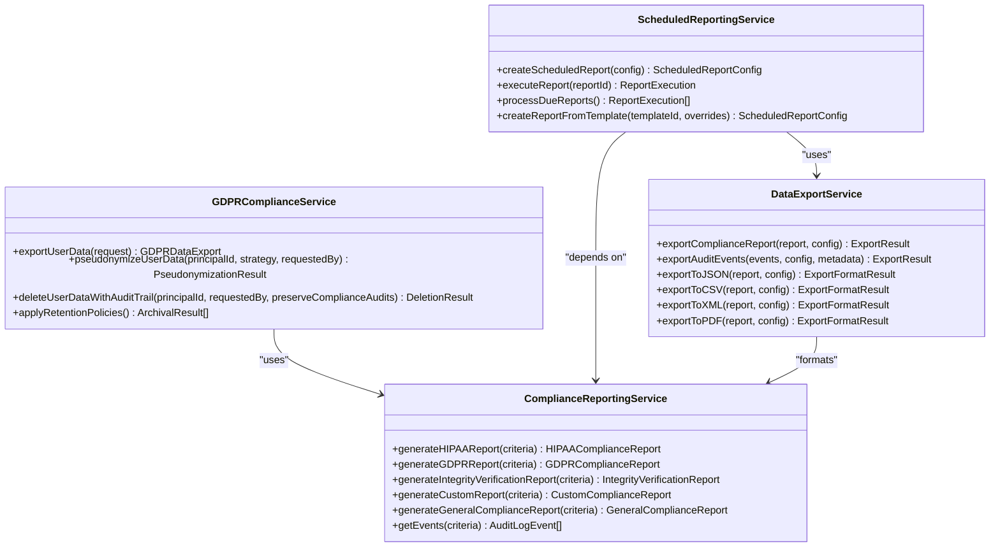
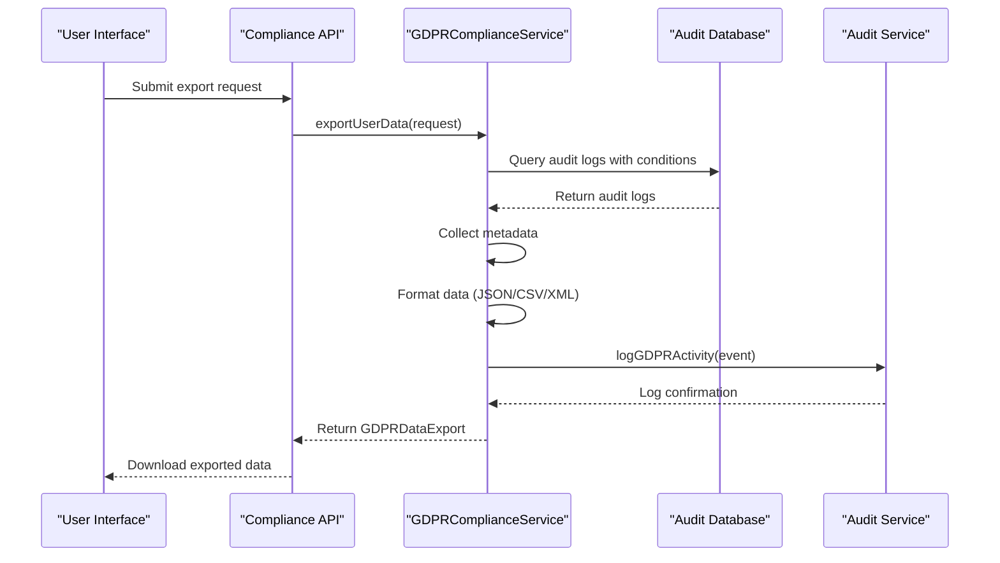
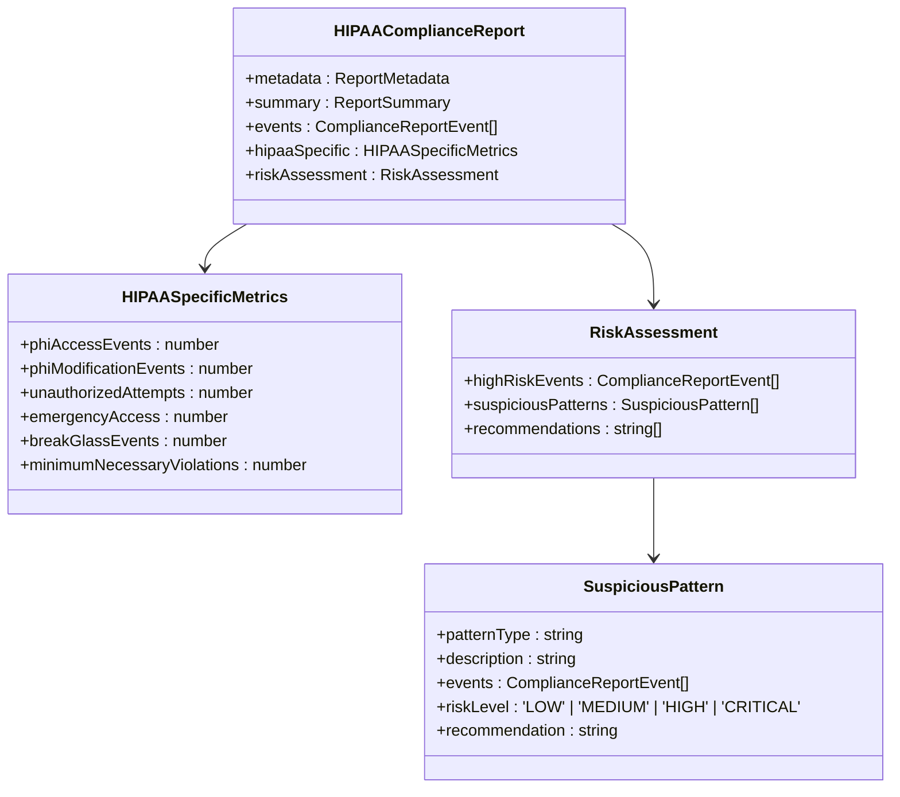
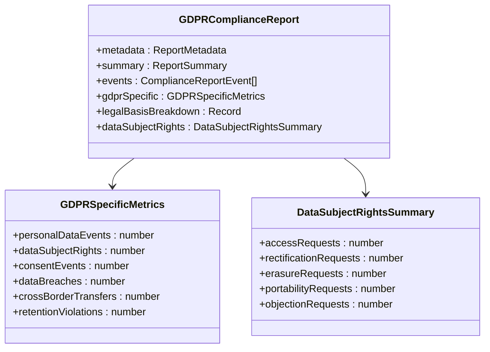
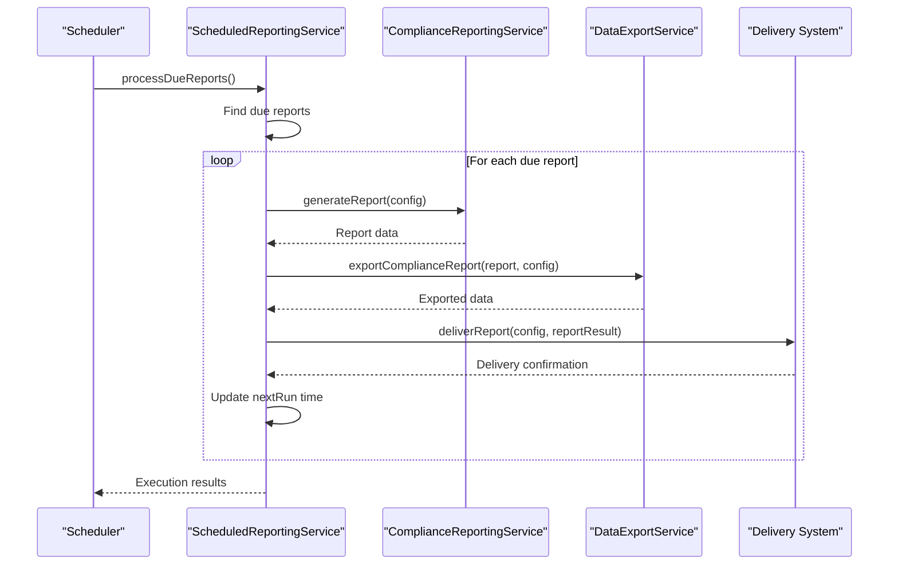
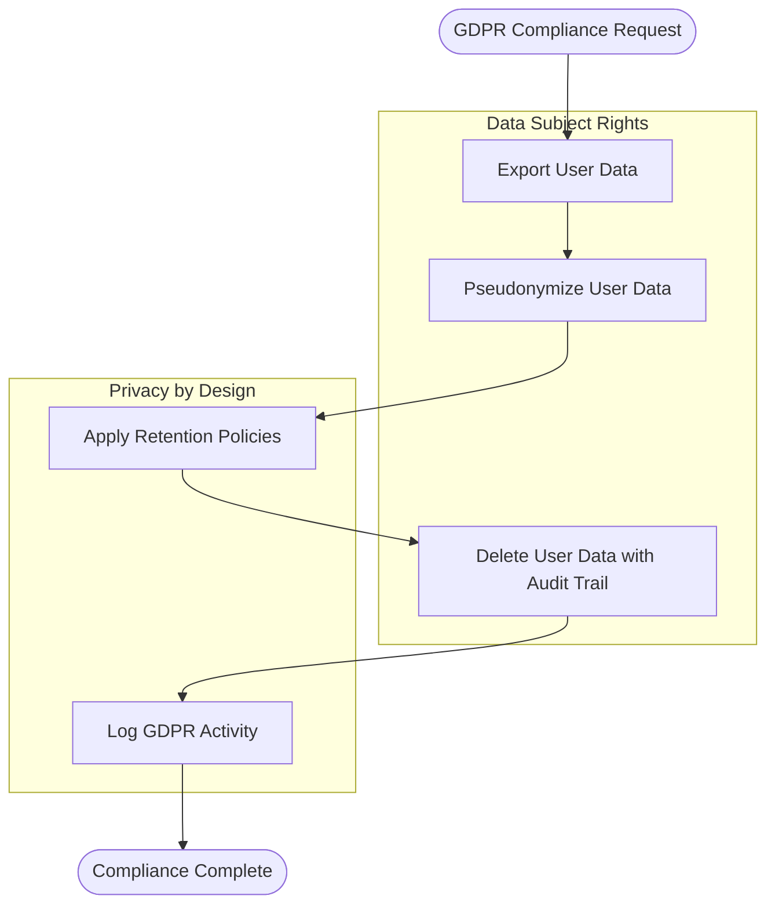
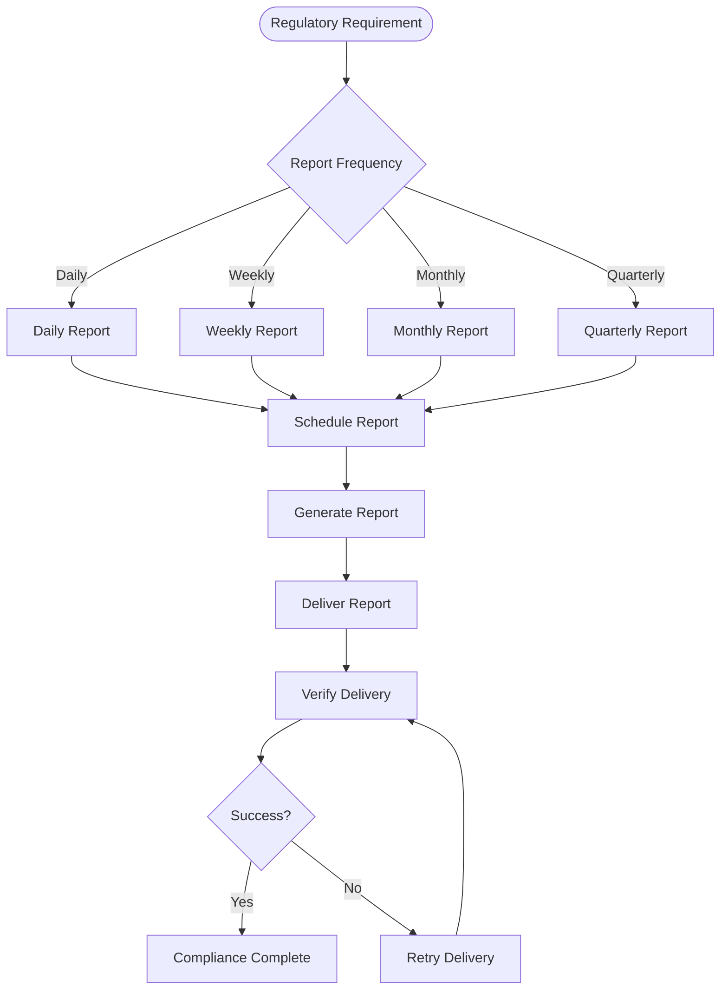
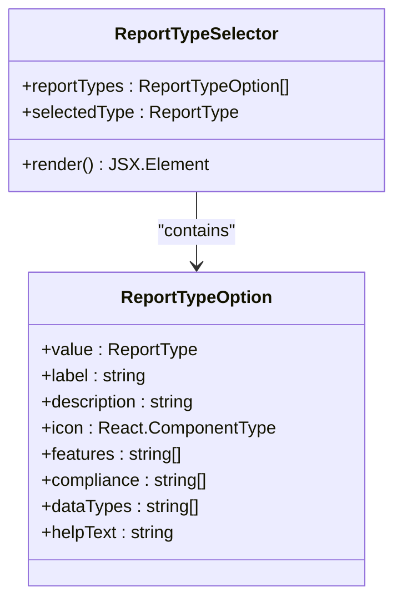
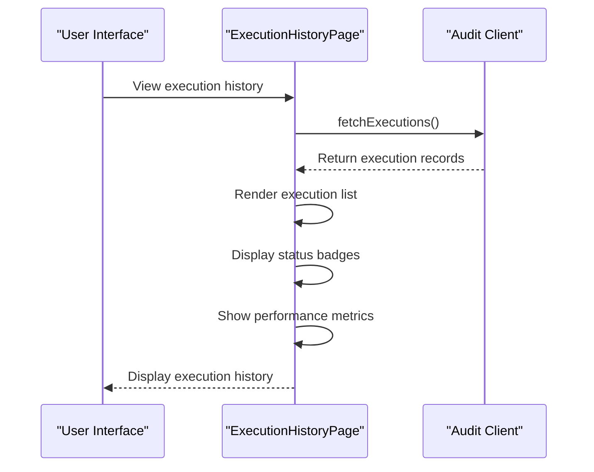
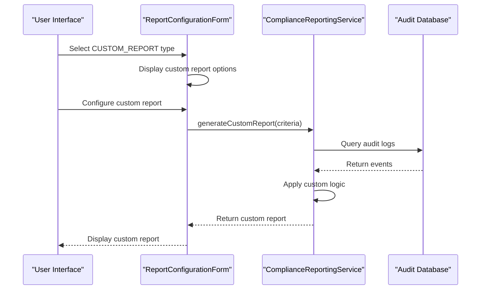

# Compliance Reporting

<cite>
**Referenced Files in This Document**   
- [gdpr-compliance.ts](file://packages/audit/src/gdpr/gdpr-compliance.ts)
- [compliance-reporting.ts](file://packages/audit/src/report/compliance-reporting.ts)
- [scheduled-reporting.ts](file://packages/audit/src/report/scheduled-reporting.ts)
- [data-export.ts](file://packages/audit/src/report/data-export.ts)
- [compliance.ts](file://apps/server/src/lib/graphql/resolvers/compliance.ts)
- [gdpr.tsx](file://apps/web/src/routes/dashboard/compliance/gdpr.tsx)
- [hipaa.tsx](file://apps/web/src/routes/dashboard/compliance/hipaa.tsx)
- [scheduled-reports.tsx](file://apps/web/src/routes/dashboard/compliance/scheduled-reports.tsx)
- [report-templates.tsx](file://apps/web/src/routes/dashboard/compliance/report-templates.tsx)
- [export-reports.tsx](file://apps/web/src/routes/dashboard/compliance/export-reports.tsx)
- [report-type-selector.tsx](file://apps/app/src/components/compliance/forms/report-type-selector.tsx) - *Updated in recent commit*
- [report-details-page.tsx](file://apps/app/src/components/compliance/reports/report-details-page.tsx) - *Updated in recent commit*
- [execution-history-page.tsx](file://apps/app/src/components/compliance/execution/execution-history-page.tsx) - *Updated in recent commit*
- [types.ts](file://packages/audit/src/report/types.ts) - *Updated in recent commit*
</cite>

## Update Summary
**Changes Made**   
- Updated report types to include CUSTOM_REPORT and GENERAL_COMPLIANCE
- Added new section on Custom Report Type and Execution Statuses
- Updated Report Type Selector component documentation
- Enhanced execution history and report details documentation
- Updated type definitions for compliance reporting
- Added new diagram for custom report workflow

## Table of Contents
1. [Introduction](#introduction)
2. [Core Compliance Interfaces](#core-compliance-interfaces)
3. [Data Export Workflows](#data-export-workflows)
4. [Report Generation and Template Management](#report-generation-and-template-management)
5. [Scheduled Reporting System](#scheduled-reporting-system)
6. [Backend Compliance Services](#backend-compliance-services)
7. [Data Retention and Anonymization](#data-retention-and-anonymization)
8. [Audit Trail and Regulatory Deadline Management](#audit-trail-and-regulatory-deadline-management)
9. [Custom Report Type and Execution Statuses](#custom-report-type-and-execution-statuses)
10. [Troubleshooting Common Issues](#troubleshooting-common-issues)

## Introduction
The Compliance Reporting module provides comprehensive functionality for meeting GDPR and HIPAA regulatory requirements through automated data export, report generation, and scheduled compliance checks. This document details the implementation of compliance interfaces, data workflows, and backend services that enable organizations to maintain regulatory compliance while preserving audit trail integrity. The system is designed to handle data subject rights requests, generate regulatory reports, and automate compliance processes with robust security and privacy controls.

## Core Compliance Interfaces

The compliance system implements two primary regulatory frameworks: GDPR and HIPAA, each with specialized interfaces and workflows. The GDPR compliance interface focuses on data subject rights and privacy-by-design principles, while the HIPAA interface emphasizes audit trail preservation and healthcare data protection.



**Diagram sources**
- [gdpr-compliance.ts](file://packages/audit/src/gdpr/gdpr-compliance.ts#L15-L685)
- [compliance-reporting.ts](file://packages/audit/src/report/compliance-reporting.ts#L15-L950)
- [scheduled-reporting.ts](file://packages/audit/src/report/scheduled-reporting.ts#L15-L916)
- [data-export.ts](file://packages/audit/src/report/data-export.ts#L15-L580)

**Section sources**
- [gdpr-compliance.ts](file://packages/audit/src/gdpr/gdpr-compliance.ts#L15-L685)
- [compliance-reporting.ts](file://packages/audit/src/report/compliance-reporting.ts#L15-L950)

## Data Export Workflows

The data export workflow is designed to fulfill data subject rights requests under GDPR regulations, particularly the right to access and data portability. The system provides multiple export formats and maintains comprehensive audit trails for all export operations.

### GDPR Data Export Implementation

The `GDPRComplianceService` class implements the core data export functionality, allowing organizations to respond to data subject rights requests. The export process includes data collection, formatting, and audit logging.



**Diagram sources**
- [gdpr-compliance.ts](file://packages/audit/src/gdpr/gdpr-compliance.ts#L150-L250)
- [compliance.ts](file://apps/server/src/lib/graphql/resolvers/compliance.ts#L45-L67)

**Section sources**
- [gdpr-compliance.ts](file://packages/audit/src/gdpr/gdpr-compliance.ts#L150-L250)
- [gdpr.tsx](file://apps/web/src/routes/dashboard/compliance/gdpr.tsx#L25-L80)

### Export Format Support

The system supports multiple export formats to accommodate different regulatory and organizational requirements:

- **JSON**: Structured format for programmatic processing
- **CSV**: Spreadsheet-compatible format for analysis
- **XML**: Standardized format for system integration

The `formatExportData` method in the `GDPRComplianceService` class handles the conversion of audit logs to the requested format:

```typescript
private async formatExportData(
  auditLogs: any[],
  format: GDPRExportFormat,
  includeMetadata?: boolean
): Promise<Buffer> {
  const exportData = {
    exportMetadata: includeMetadata
      ? {
          exportTimestamp: new Date().toISOString(),
          recordCount: auditLogs.length,
          format,
          gdprCompliant: true,
        }
      : undefined,
    auditLogs,
  }

  switch (format) {
    case 'json':
      return Buffer.from(JSON.stringify(exportData, null, 2))
    case 'csv':
      return this.generateCSVExport(auditLogs)
    case 'xml':
      return this.generateXMLExport(exportData)
    default:
      throw new Error(`Unsupported export format: ${format}`)
  }
}
```

The CSV export implementation handles special characters and ensures compatibility with spreadsheet applications:

```typescript
private generateCSVExport(auditLogs: any[]): Buffer {
  if (auditLogs.length === 0) {
    return Buffer.from('No data to export')
  }

  const headers = Object.keys(auditLogs[0])
  const csvRows = [headers.join(',')]

  for (const log of auditLogs) {
    const row = headers.map((header) => {
      const value = log[header]
      if (value === null || value === undefined) return ''
      if (typeof value === 'string' && value.includes(',')) {
        return `"${value.replace(/"/g, '""')}"` // Handle quotes in strings
      }
      return String(value)
    })
    csvRows.push(row.join(','))
  }

  return Buffer.from(csvRows.join('\n'))
}
```

## Report Generation and Template Management

The compliance reporting system provides specialized report types for different regulatory requirements, with configurable templates and formatting options.

### HIPAA Compliance Reporting

The HIPAA compliance report focuses on Protected Health Information (PHI) access and modification events, with specialized metrics for healthcare data security:



**Diagram sources**
- [compliance-reporting.ts](file://packages/audit/src/report/compliance-reporting.ts#L80-L150)

**Section sources**
- [compliance-reporting.ts](file://packages/audit/src/report/compliance-reporting.ts#L80-L150)
- [hipaa.tsx](file://apps/web/src/routes/dashboard/compliance/hipaa.tsx#L15-L60)

### GDPR Compliance Reporting

The GDPR compliance report tracks personal data processing activities and data subject rights fulfillment:



**Diagram sources**
- [compliance-reporting.ts](file://packages/audit/src/report/compliance-reporting.ts#L150-L200)

**Section sources**
- [compliance-reporting.ts](file://packages/audit/src/report/compliance-reporting.ts#L150-L200)
- [gdpr.tsx](file://apps/web/src/routes/dashboard/compliance/gdpr.tsx#L15-L60)

### Report Criteria and Filtering

Reports can be configured with detailed criteria to filter and scope the data included:

```typescript
interface ReportCriteria {
  dateRange: {
    startDate: string
    endDate: string
  }
  principalIds?: string[]
  organizationIds?: string[]
  actions?: string[]
  dataClassifications?: DataClassification[]
  statuses?: Array<'attempt' | 'success' | 'failure'>
  resourceTypes?: string[]
  verifiedOnly?: boolean
  includeIntegrityFailures?: boolean
  limit?: number
  offset?: number
  sortBy?: 'timestamp' | 'status'
  sortOrder?: 'asc' | 'desc'
}
```

The `getEvents` method in the `ComplianceReportingService` class implements the query logic based on these criteria:

```typescript
private async getEvents(criteria: ReportCriteria): Promise<AuditLogEvent[]> {
  let query = `SELECT * FROM audit_log WHERE organization_id = '${criteria.organizationIds?.[0]}'`

  if (criteria.principalIds && criteria.principalIds.length > 0) {
    query += ` AND principal_id IN (${criteria.principalIds.map((id) => `'${id}'`).join(',')})`
  }
  
  // Additional filters for data classification, actions, status, etc.
  if (criteria.dataClassifications && criteria.dataClassifications.length > 0) {
    query += ` AND data_classification IN (${criteria.dataClassifications
      .map((dc) => `'${dc}'`)
      .join(',')})`
  }
  
  // Apply date range filter
  if (criteria.dateRange) {
    query += ` AND timestamp >= '${criteria.dateRange.startDate}' AND timestamp <= '${criteria.dateRange.endDate}'`
  }

  // Add sorting and pagination
  const sortColumn = criteria.sortBy || 'createdAt'
  const sortDirection = criteria.sortOrder || 'desc'
  query += ` ORDER BY ${sortColumn} ${sortDirection.toUpperCase()}`
  
  if (criteria.limit) {
    query += ` LIMIT ${criteria.limit}`
  }
  if (criteria.offset) {
    query += ` OFFSET ${criteria.offset}`
  }

  const result = await this.client.executeMonitoredQuery(
    (db) => db.execute(sql.raw(query)),
    'get_audit_log_events'
  )

  const rows = result || []
  return rows.map(this.mapDatabaseAuditLogToAuditLog)
}
```

## Scheduled Reporting System

The scheduled reporting system automates compliance reporting through configurable schedules and delivery mechanisms, ensuring regular monitoring and regulatory compliance.

### Scheduled Report Configuration

The `ScheduledReportConfig` interface defines the structure for scheduled reports:

```typescript
interface ScheduledReportConfig {
  id: string
  name: string
  description?: string
  templateId?: string
  reportType: ReportTemplate['reportType']
  criteria: ReportCriteria
  format: ReportFormat
  schedule: {
    frequency: 'daily' | 'weekly' | 'monthly' | 'quarterly'
    dayOfWeek?: number
    dayOfMonth?: number
    time: string
    timezone?: string
  }
  delivery: {
    method: 'email' | 'webhook' | 'storage'
    recipients?: string[]
    webhookUrl?: string
    storageLocation?: string
  }
  export: ExportConfig
  enabled: boolean
  createdAt: string
  createdBy: string
  lastRun?: string
  nextRun?: string
}
```

### Scheduling and Execution Workflow



**Diagram sources**
- [scheduled-reporting.ts](file://packages/audit/src/report/scheduled-reporting.ts#L600-L650)

**Section sources**
- [scheduled-reporting.ts](file://packages/audit/src/report/scheduled-reporting.ts#L600-L650)
- [scheduled-reports.tsx](file://apps/web/src/routes/dashboard/compliance/scheduled-reports.tsx#L25-L80)

### Delivery Mechanisms

The system supports multiple delivery methods for scheduled reports:

- **Email**: Direct delivery to recipients
- **Webhook**: Integration with external systems
- **Storage**: Archival in designated locations

The `deliverReport` method handles the delivery process with retry logic:

```typescript
private async deliverReport(
  config: ScheduledReportConfig,
  reportResult: ExportResult,
  execution: ReportExecution
): Promise<void> {
  const deliveryAttempt: DeliveryAttempt = {
    attemptId: this.generateId('delivery'),
    timestamp: new Date().toISOString(),
    status: 'pending',
    method: config.delivery.method,
    target: this.getDeliveryTarget(config.delivery),
    retryCount: 0,
  }

  execution.deliveryAttempts.push(deliveryAttempt)

  try {
    switch (config.delivery.method) {
      case 'email':
        await this.deliverViaEmail(config.delivery, reportResult, deliveryAttempt)
        break
      case 'webhook':
        await this.deliverViaWebhook(config.delivery, reportResult, deliveryAttempt)
        break
      case 'storage':
        await this.deliverViaStorage(config.delivery, reportResult, deliveryAttempt)
        break
      default:
        throw new Error(`Unsupported delivery method: ${config.delivery.method}`)
    }

    deliveryAttempt.status = 'delivered'
  } catch (error) {
    deliveryAttempt.status = 'failed'
    deliveryAttempt.error = error instanceof Error ? error.message : 'Unknown error'
    throw error
  }
}
```

## Backend Compliance Services

The backend compliance services provide the core functionality for regulatory compliance, integrating with the audit system and database to ensure data integrity and regulatory adherence.

### GDPR Compliance Service

The `GDPRComplianceService` implements key GDPR requirements:



**Diagram sources**
- [gdpr-compliance.ts](file://packages/audit/src/gdpr/gdpr-compliance.ts#L15-L685)

**Section sources**
- [gdpr-compliance.ts](file://packages/audit/src/gdpr/gdpr-compliance.ts#L15-L685)
- [compliance.ts](file://apps/server/src/lib/graphql/resolvers/compliance.ts#L45-L67)

### Data Retention and Archival

The `applyRetentionPolicies` method implements automated data retention and archival:

```typescript
async applyRetentionPolicies(): Promise<ArchivalResult[]> {
  const policies = await this.client.executeOptimizedQuery(
    (db) =>
      db.select().from(auditRetentionPolicy).where(eq(auditRetentionPolicy.isActive, 'true')),
    { cacheKey: 'active_retention_policies', cacheTTL: 3600 }
  )

  const results: ArchivalResult[] = []

  for (const policy of policies) {
    const result = await this.applyRetentionPolicy(policy)
    results.push(result)
  }

  return results
}
```

The `applyRetentionPolicy` method handles both archival and deletion based on policy configuration:

```typescript
private async applyRetentionPolicy(policy: RetentionPolicy): Promise<ArchivalResult> {
  const now = new Date()
  const archiveDate = new Date(
    now.getTime() - (policy.archiveAfterDays || policy.retentionDays) * 24 * 60 * 60 * 1000
  )
  const deleteDate = policy.deleteAfterDays
    ? new Date(now.getTime() - policy.deleteAfterDays * 24 * 60 * 60 * 1000)
    : null

  let recordsArchived = 0
  let recordsDeleted = 0

  // Archive records that meet archival criteria
  if (policy.archiveAfterDays) {
    const archiveResult = await this.db
      .update(auditLog)
      .set({ archivedAt: now.toISOString() })
      .where(
        and(
          eq(auditLog.dataClassification, policy.dataClassification),
          lte(auditLog.timestamp, archiveDate.toISOString()),
          sql`${auditLog.archivedAt} IS NULL`
        )
      )

    recordsArchived = (archiveResult as any).rowCount || 0
  }

  // Delete records that meet deletion criteria
  if (deleteDate) {
    const deleteResult = await this.db
      .delete(auditLog)
      .where(
        and(
          eq(auditLog.dataClassification, policy.dataClassification),
          lte(auditLog.timestamp, deleteDate.toISOString()),
          isNotNull(auditLog.archivedAt)
        )
      )

    recordsDeleted = (deleteResult as any).rowCount || 0
  }

  return {
    recordsArchived,
    recordsDeleted,
    archivedAt: now.toISOString(),
    policy: policy.policyName,
    summary: {
      byClassification,
      byAction,
      dateRange: {
        start: earliestDate,
        end: latestDate,
      },
    },
  }
}
```

## Data Retention and Anonymization

The system implements robust data retention and anonymization strategies to comply with regulatory requirements while preserving audit trail integrity.

### Pseudonymization Strategies

The GDPR compliance service supports multiple pseudonymization strategies:

```typescript
type PseudonymizationStrategy = 'hash' | 'token' | 'encryption'

private generatePseudonymId(originalId: string, strategy: PseudonymizationStrategy): string {
  switch (strategy) {
    case 'hash':
      return `pseudo-${createHash('sha256')
        .update(originalId + process.env.PSEUDONYM_SALT || 'default-salt')
        .digest('hex')
        .substring(0, 16)}`
    case 'token':
      return `pseudo-${randomBytes(16).toString('hex')}`
    case 'encryption':
      return `pseudo-enc-${Buffer.from(originalId)
        .toString('base64')
        .replace(/[^a-zA-Z0-9]/g, '')
        .substring(0, 16)}`
    default:
      throw new Error(`Unsupported pseudonymization strategy: ${strategy}`)
  }
}
```

### Data Deletion with Audit Trail Preservation

The `deleteUserDataWithAuditTrail` method implements the "right to be forgotten" while preserving compliance-critical audit records:

```typescript
async deleteUserDataWithAuditTrail(
  principalId: string,
  requestedBy: string,
  preserveComplianceAudits: boolean = true
): Promise<{ recordsDeleted: number; complianceRecordsPreserved: number }> {
  let recordsDeleted = 0
  let complianceRecordsPreserved = 0

  if (preserveComplianceAudits) {
    // Identify compliance-critical audit records to preserve
    const complianceActions = [
      'auth.login.success',
      'auth.login.failure',
      'data.access.unauthorized',
      'gdpr.data.export',
      'gdpr.data.pseudonymize',
      'gdpr.data.delete',
    ]

    // Pseudonymize compliance records instead of deleting
    const pseudonymResult = await this.pseudonymizeUserData(principalId, 'hash', requestedBy)
    complianceRecordsPreserved = pseudonymResult.recordsAffected

    // Delete non-compliance records
    const deleteResult = await this.db
      .delete(auditLog)
      .where(
        and(
          eq(auditLog.principalId, principalId),
          sql`NOT (${auditLog.action} = ANY(${complianceActions}))`
        )
      )

    recordsDeleted = (deleteResult as any).rowCount || 0
  } else {
    // Delete all records for the user
    const deleteResult = await this.db
      .delete(auditLog)
      .where(eq(auditLog.principalId, principalId))

    recordsDeleted = (deleteResult as any).rowCount || 0
  }

  return {
    recordsDeleted,
    complianceRecordsPreserved,
  }
}
```

## Audit Trail and Regulatory Deadline Management

The system maintains comprehensive audit trails for all compliance activities and provides mechanisms for managing regulatory deadlines.

### Audit Trail Implementation

All GDPR compliance activities are logged with detailed metadata:

```typescript
private async logGDPRActivity(event: AuditLogEvent): Promise<void> {
  await this.audit.log(event, {
    generateHash: true,
    generateSignature: true,
  })
}
```

The audit log includes critical information for regulatory compliance:

```typescript
interface AuditLogEvent {
  timestamp: string
  principalId: string
  organizationId: string
  action: string
  targetResourceType: string
  targetResourceId: string
  status: 'success' | 'failure'
  outcomeDescription: string
  dataClassification: DataClassification
  retentionPolicy: string
  details: Record<string, any>
  hash?: string
  hashAlgorithm?: string
  signature?: string
  correlationId?: string
}
```

### Regulatory Deadline Management

The scheduled reporting system ensures compliance with regulatory deadlines through automated report generation:



**Diagram sources**
- [scheduled-reporting.ts](file://packages/audit/src/report/scheduled-reporting.ts#L600-L650)

**Section sources**
- [scheduled-reporting.ts](file://packages/audit/src/report/scheduled-reporting.ts#L600-L650)
- [scheduled-reports.tsx](file://apps/web/src/routes/dashboard/compliance/scheduled-reports.tsx#L25-L80)

## Custom Report Type and Execution Statuses

The system now supports custom report types and enhanced execution statuses to provide greater flexibility in compliance reporting.

### Custom Report Type Implementation

The `ReportTypeSchema` has been updated to include 'GENERAL_COMPLIANCE' and 'CUSTOM_REPORT' types:

```typescript
export const ReportTypeSchema = z.enum([
	'HIPAA_AUDIT_TRAIL',
	'GDPR_PROCESSING_ACTIVITIES',
	'GENERAL_COMPLIANCE',
	'INTEGRITY_VERIFICATION',
	'CUSTOM_REPORT',
])
```

The `ComplianceReportingService` now includes methods for generating custom and general compliance reports:

```typescript
async generateCustomReport(criteria: ReportCriteria): Promise<CustomComplianceReport> {
  const events = await this.getEvents(criteria)
  const baseReport = await this.generateComplianceReport(events, criteria, 'CUSTOM_REPORT')
  
  // Apply custom report logic
  const customMetrics = this.generateCustomMetrics(events)
  const customSections = this.generateCustomSections(events)
  
  return {
    ...baseReport,
    reportType: 'CUSTOM_REPORT',
    customMetrics,
    customSections,
  }
}

async generateGeneralComplianceReport(criteria: ReportCriteria): Promise<GeneralComplianceReport> {
  const events = await this.getEvents(criteria)
  const baseReport = await this.generateComplianceReport(events, criteria, 'GENERAL_COMPLIANCE')
  
  // Apply general compliance logic
  const generalMetrics = this.generateGeneralMetrics(events)
  const riskAssessment = this.performRiskAssessment(events)
  
  return {
    ...baseReport,
    reportType: 'GENERAL_COMPLIANCE',
    generalMetrics,
    riskAssessment,
  }
}
```

### Report Type Selector Component

The `ReportTypeSelector` component has been updated to include the new report types:



**Diagram sources**
- [report-type-selector.tsx](file://apps/app/src/components/compliance/forms/report-type-selector.tsx#L20-L150)

**Section sources**
- [report-type-selector.tsx](file://apps/app/src/components/compliance/forms/report-type-selector.tsx#L20-L150)
- [types.ts](file://packages/audit/src/report/types.ts#L23-L23)

### Enhanced Execution Statuses

The execution history page now displays enhanced status information for report executions:

```typescript
interface ReportExecution {
  id: string
  reportId: string
  status: 'pending' | 'processing' | 'completed' | 'failed' | 'cancelled' | 'timeout' | 'skipped'
  scheduledTime: string
  executionTime?: string
  duration?: number
  recordsProcessed?: number
  outputSize?: number
  outputFormat: ReportFormat
  triggeredBy: 'system' | 'user' | 'schedule'
  error?: {
    code: string
    message: string
  }
  metadata: {
    reportType: ReportType
    version: string
  }
}
```

The `ExecutionHistoryPage` component displays execution details with status badges and performance metrics:



**Diagram sources**
- [execution-history-page.tsx](file://apps/app/src/components/compliance/execution/execution-history-page.tsx#L100-L200)

**Section sources**
- [execution-history-page.tsx](file://apps/app/src/components/compliance/execution/execution-history-page.tsx#L100-L200)
- [report-details-page.tsx](file://apps/app/src/components/compliance/reports/report-details-page.tsx#L50-L100)

### Custom Report Workflow

The custom report generation workflow supports template-based configuration and execution:



**Diagram sources**
- [report-details-page.tsx](file://apps/app/src/components/compliance/reports/report-details-page.tsx#L150-L200)

**Section sources**
- [report-details-page.tsx](file://apps/app/src/components/compliance/reports/report-details-page.tsx#L150-L200)
- [compliance-reporting.ts](file://packages/audit/src/report/compliance-reporting.ts#L260-L300)

## Troubleshooting Common Issues

This section addresses common issues encountered when using the compliance reporting system and provides guidance for resolution.

### Data Export Issues

**Issue**: Export requests timeout for large datasets
**Solution**: Implement pagination in the export process by using the `limit` and `offset` parameters in the report criteria:

```typescript
const criteria: ReportCriteria = {
  dateRange: {
    startDate: '2023-01-01T00:00:00Z',
    endDate: '2023-12-31T23:59:59Z',
  },
  limit: 1000,
  offset: 0,
}
```

**Issue**: Exported CSV files contain formatting errors
**Solution**: Ensure proper escaping of special characters in the CSV export method:

```typescript
private generateCSVExport(auditLogs: any[]): Buffer {
  // ... existing code ...
  if (typeof value === 'string' && value.includes(',')) {
    return `"${value.replace(/"/g, '""')}"` // Properly escape quotes
  }
  // ... existing code ...
}
```

### Scheduled Reporting Issues

**Issue**: Scheduled reports are not executing
**Solution**: Verify that the scheduler is running and check the `nextRun` timestamp:

```typescript
// Check if report is due
const now = new Date().toISOString()
if (nextRun <= now) {
  // Report should be executed
}
```

**Issue**: Delivery failures for email reports
**Solution**: Configure retry logic and verify SMTP settings:

```typescript
await this.retryFailedDeliveries(maxAge: 24 * 60 * 60 * 1000)
```

### Data Retention Issues

**Issue**: Data is not being archived or deleted according to policy
**Solution**: Verify that retention policies are active and properly configured:

```typescript
const policies = await this.client.executeOptimizedQuery(
  (db) =>
    db.select().from(auditRetentionPolicy).where(eq(auditRetentionPolicy.isActive, 'true')),
)
```

**Issue**: Compliance records are being deleted instead of pseudonymized
**Solution**: Ensure the `preserveComplianceAudits` flag is set to `true`:

```typescript
await this.deleteUserDataWithAuditTrail(
  principalId,
  requestedBy,
  true // preserveComplianceAudits
)
```

**Section sources**
- [gdpr-compliance.ts](file://packages/audit/src/gdpr/gdpr-compliance.ts#L15-L685)
- [compliance-reporting.ts](file://packages/audit/src/report/compliance-reporting.ts#L15-L950)
- [scheduled-reporting.ts](file://packages/audit/src/report/scheduled-reporting.ts#L15-L916)
- [data-export.ts](file://packages/audit/src/report/data-export.ts#L15-L580)