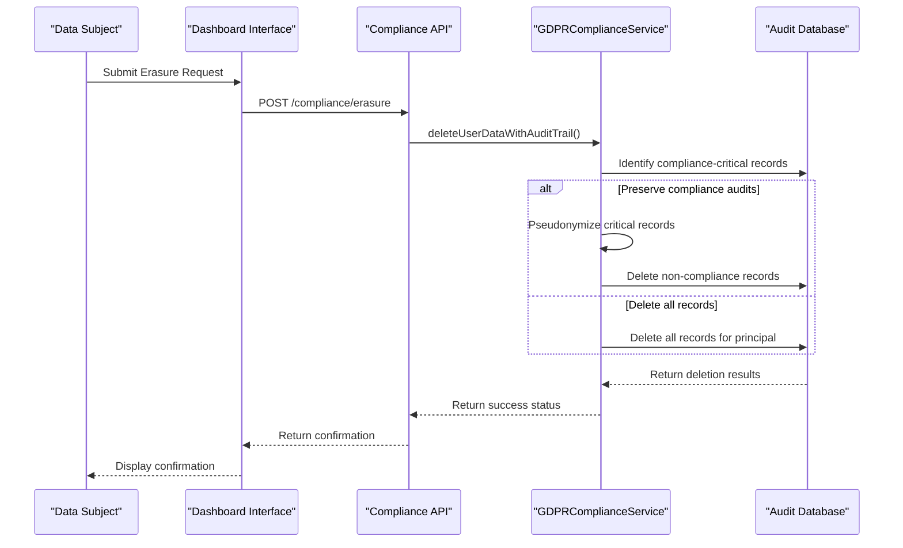
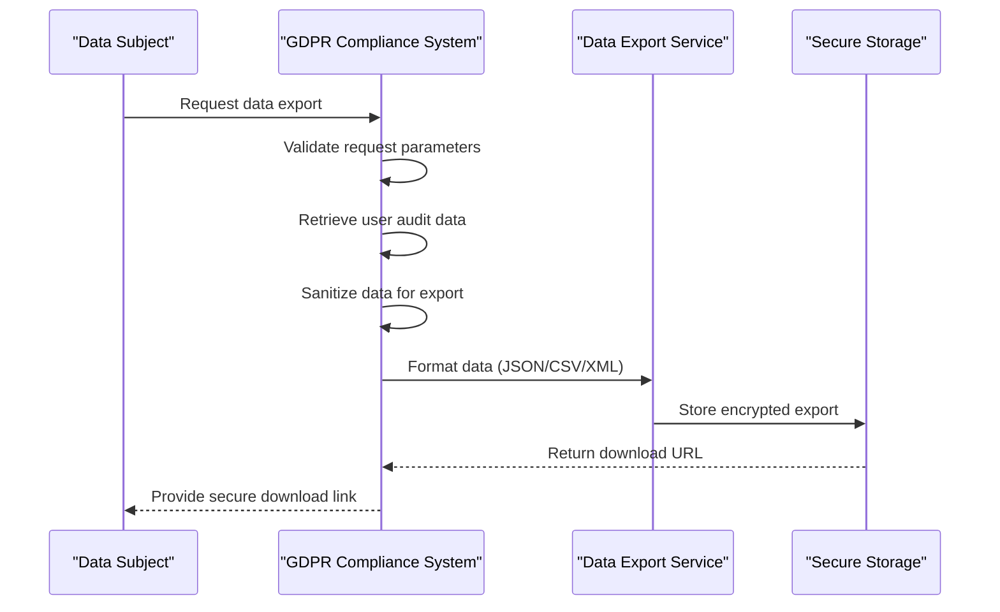
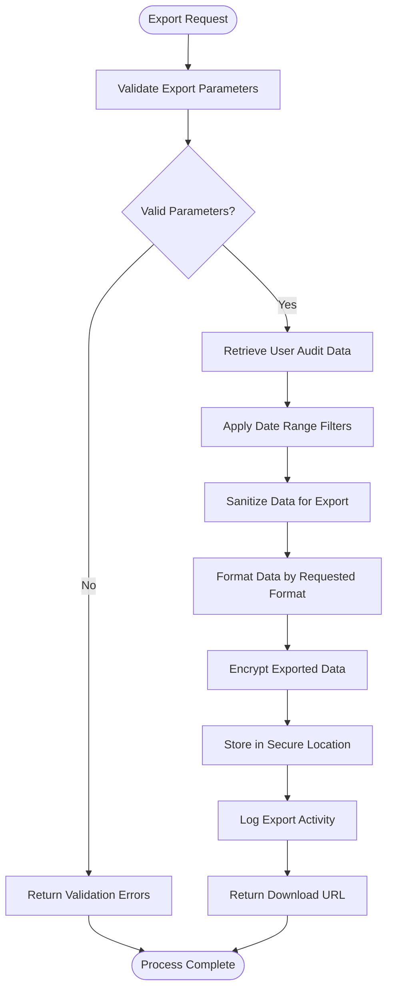
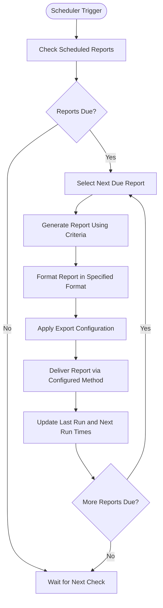
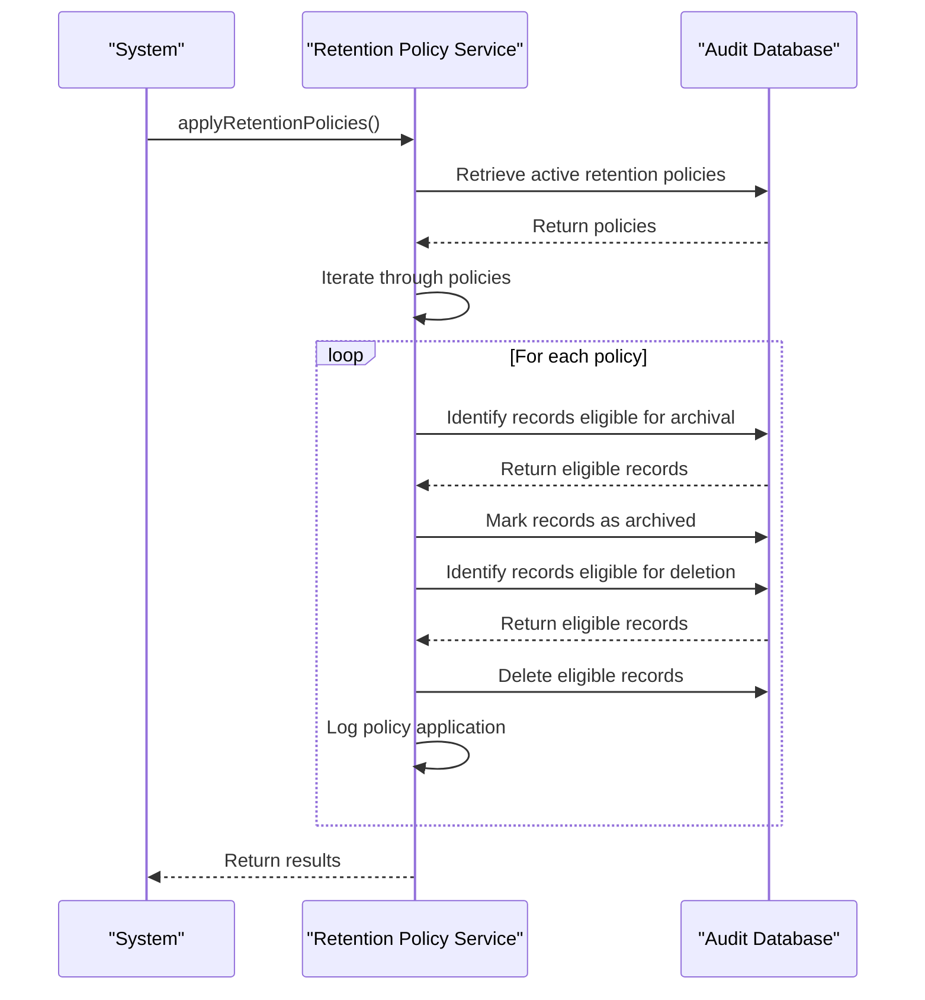
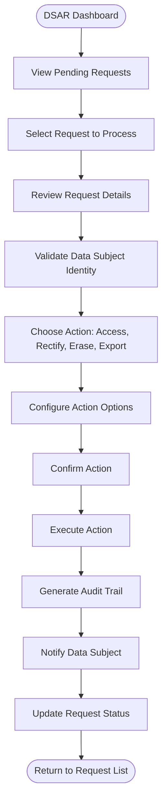

# GDPR Compliance

<cite>
**Referenced Files in This Document**   
- [gdpr-compliance.ts](file://packages/audit/src/gdpr/gdpr-compliance.ts)
- [compliance-reporting.ts](file://packages/audit/src/report/compliance-reporting.ts)
- [gdpr-utils.ts](file://packages/audit/src/gdpr/gdpr-utils.ts)
- [scheduled-reporting.ts](file://packages/audit/src/report/scheduled-reporting.ts)
- [compliance-api.ts](file://apps/server/src/routes/compliance-api.ts)
- [compliance.ts](file://apps/server/src/routers/compliance.ts)
- [compliance.test.ts](file://packages/audit-sdk/src/__tests__/compliance.test.ts)
- [gdpr-integration.test.ts](file://packages/audit-db/src/__tests__/gdpr-integration.test.ts)
- [report-configuration-form.tsx](file://apps/app/src/components/compliance/forms/report-configuration-form.tsx) - *Updated in recent commit*
- [report-templates-page.tsx](file://apps/app/src/components/compliance/templates/report-templates-page.tsx) - *Updated in recent commit*
- [execution-history-page.tsx](file://apps/app/src/components/compliance/execution/execution-history-page.tsx) - *Updated in recent commit*
- [report-details-page.tsx](file://apps/app/src/components/compliance/reports/report-details-page.tsx) - *Updated in recent commit*
</cite>

## Update Summary
- Added documentation for new report types: GENERAL_COMPLIANCE and CUSTOM_REPORT
- Updated report configuration form documentation to reflect new report type options
- Enhanced report templates page documentation with new report type categories
- Added execution history and report details page updates for new report types
- Updated scheduled reporting system section with new report type support
- Maintained consistency with existing GDPR compliance workflows and data subject rights handling

## Table of Contents
1. [Introduction](#introduction)
2. [Data Subject Rights Handling](#data-subject-rights-handling)
3. [Personal Data Identification and Processing](#personal-data-identification-and-processing)
4. [Data Export and Portability](#data-export-and-portability)
5. [Audit Event Filtering and Reporting](#audit-event-filtering-and-reporting)
6. [Integration with Data Export Service](#integration-with-data-export-service)
7. [Scheduled Reporting System](#scheduled-reporting-system)
8. [Common Compliance Issues](#common-compliance-issues)
9. [Data Retention Policy Configuration](#data-retention-policy-configuration)
10. [DSAR Management Interface](#dsar-management-interface)

## Introduction
The GDPR Compliance module provides comprehensive functionality for handling data subject rights, generating compliance reports, and managing personal data in accordance with General Data Protection Regulation (GDPR) requirements. The system implements technical and organizational measures to ensure compliance with GDPR Articles 17 (Right to Erasure), 20 (Right to Data Portability), and other relevant provisions. The architecture is designed to support audit trails, data export, pseudonymization, and automated reporting while maintaining system performance and data integrity.

## Data Subject Rights Handling

The GDPR Compliance module implements a comprehensive system for handling data subject rights as specified in GDPR regulations. The implementation includes workflows for the right to access, right to erasure, and data portability, with proper audit trails and security controls.

### Right to Access Implementation
The system provides mechanisms for data subjects to access their personal data through both API endpoints and dashboard interfaces. When a data subject access request (DSAR) is submitted, the system validates the request and retrieves all audit logs associated with the principal ID.

### Right to Erasure Implementation
The right to erasure (also known as "right to be forgotten") is implemented through the `deleteUserDataWithAuditTrail` method in the `GDPRComplianceService` class. This method ensures that while personal data is removed, compliance-critical audit trails are preserved for regulatory purposes.



**Diagram sources**
- [gdpr-compliance.ts](file://packages/audit/src/gdpr/gdpr-compliance.ts#L118-L684)

**Section sources**
- [gdpr-compliance.ts](file://packages/audit/src/gdpr/gdpr-compliance.ts#L118-L684)

### Data Portability Workflows
The data portability workflow enables data subjects to receive their personal data in a structured, commonly used, and machine-readable format. The system supports JSON, CSV, and XML export formats, allowing for easy transfer of data to another controller.



**Diagram sources**
- [gdpr-compliance.ts](file://packages/audit/src/gdpr/gdpr-compliance.ts#L118-L684)

**Section sources**
- [gdpr-compliance.ts](file://packages/audit/src/gdpr/gdpr-compliance.ts#L118-L684)

## Personal Data Identification and Processing

The system implements robust mechanisms for identifying, categorizing, and processing personal data in compliance with GDPR requirements.

### Data Classification System
Personal data is classified according to sensitivity levels using a standardized classification system:

**Data Classification Levels**
- **PUBLIC**: Non-sensitive information that can be freely shared
- **INTERNAL**: Internal business information not intended for public disclosure
- **CONFIDENTIAL**: Sensitive business or personal information
- **PHI**: Protected Health Information (highest sensitivity level)

The classification is stored in the `dataClassification` field of audit log records and is used to determine appropriate retention policies and access controls.

### Pseudonymization Implementation
The system implements pseudonymization as a data protection measure to reduce privacy risks while maintaining data utility for audit purposes.

```mermaid
classDiagram
class GDPRUtils {
+static generateDeterministicPseudonym(originalId : string, salt? : string) : string
+static generateRandomPseudonym() : string
+static isComplianceCriticalAction(action : string) : boolean
}
class GDPRComplianceService {
-pseudonymMappings : Map<string, string>
+pseudonymizeUserData(principalId : string, strategy : PseudonymizationStrategy, requestedBy : string) : Promise<{ pseudonymId : string, recordsAffected : number }>
+getPseudonymMapping(originalId : string) : string | undefined
+getOriginalId(pseudonymId : string) : string | undefined
}
GDPRUtils --> GDPRComplianceService : "uses"
```

**Diagram sources**
- [gdpr-utils.ts](file://packages/audit/src/gdpr/gdpr-utils.ts#L0-L295)
- [gdpr-compliance.ts](file://packages/audit/src/gdpr/gdpr-compliance.ts#L118-L684)

**Section sources**
- [gdpr-utils.ts](file://packages/audit/src/gdpr/gdpr-utils.ts#L0-L295)
- [gdpr-compliance.ts](file://packages/audit/src/gdpr/gdpr-compliance.ts#L118-L684)

### Anonymization Strategies
The system supports multiple pseudonymization strategies for different use cases:

**Pseudonymization Strategies**
- **Hash**: Deterministic hashing using SHA-256 with salt
- **Token**: Random token generation for non-deterministic pseudonymization
- **Encryption**: Base64 encoding with transformation (placeholder for actual encryption)

The choice of strategy depends on whether referential integrity needs to be maintained across system boundaries.

## Data Export and Portability

The data export functionality enables compliance with GDPR Article 20 (Right to Data Portability) by providing data subjects with their personal data in standardized formats.

### Export Format Support
The system supports multiple export formats to ensure data portability:

**Supported Export Formats**
- **JSON**: Default format with hierarchical structure
- **CSV**: Comma-separated values for spreadsheet applications
- **XML**: Extensible Markup Language for interoperability

### Export Process Flow
The data export process follows a structured workflow to ensure data integrity and security:



**Section sources**
- [gdpr-compliance.ts](file://packages/audit/src/gdpr/gdpr-compliance.ts#L118-L684)

## Audit Event Filtering and Reporting

The system provides sophisticated filtering capabilities for audit events based on data categories and user identifiers.

### Event Filtering by Data Category
Audit events can be filtered by data classification levels to support compliance reporting and investigations.

**Data Classification Filter Options**
- PUBLIC
- INTERNAL
- CONFIDENTIAL
- PHI

The filtering is implemented in the `getEvents` method of the `ComplianceReportingService` class, which constructs SQL queries based on the provided criteria.

### User Identifier Filtering
The system supports filtering audit events by various user identifiers:

**User Identifier Filter Options**
- **principalId**: Unique identifier for the user or system principal
- **organizationId**: Identifier for the organization to which the principal belongs
- **sessionId**: Identifier for the user's session

### Report Criteria Structure
The `ReportCriteria` interface defines the parameters for filtering and configuring compliance reports:

**Report Criteria Properties**
- **dateRange**: Start and end dates for the report period
- **principalIds**: Array of principal IDs to include
- **organizationIds**: Array of organization IDs to include
- **actions**: Array of action types to filter by
- **statuses**: Array of event statuses (attempt, success, failure)
- **dataClassifications**: Array of data classification levels
- **resourceTypes**: Array of resource types to filter by
- **limit**: Maximum number of events to include
- **offset**: Offset for pagination
- **sortBy**: Sorting criteria (timestamp, status)
- **sortOrder**: Sorting direction (asc, desc)

```mermaid
classDiagram
class ReportCriteria {
+dateRange : { startDate : string, endDate : string }
+principalIds? : string[]
+organizationIds? : string[]
+actions? : string[]
+statuses? : Array<'attempt' | 'success' | 'failure'>
+dataClassifications? : DataClassification[]
+resourceTypes? : string[]
+limit? : number
+offset? : number
+sortBy? : 'timestamp' | 'status'
+sortOrder? : 'asc' | 'desc'
}
class ComplianceReportingService {
+generateGDPRReport(criteria : ReportCriteria) : Promise<GDPRComplianceReport>
+generateHIPAAReport(criteria : ReportCriteria) : Promise<HIPAAComplianceReport>
+generateIntegrityVerificationReport(criteria : ReportCriteria, performVerification : boolean) : Promise<IntegrityVerificationReport>
}
ReportCriteria --> ComplianceReportingService : "input to"
```

**Diagram sources**
- [compliance-reporting.ts](file://packages/audit/src/report/compliance-reporting.ts#L0-L950)

**Section sources**
- [compliance-reporting.ts](file://packages/audit/src/report/compliance-reporting.ts#L0-L950)

## Integration with Data Export Service

The GDPR Compliance module integrates with the data export service to provide secure and auditable data export functionality.

### API Integration Points
The system exposes REST API endpoints for data export operations:

**Data Export API Endpoints**
- **POST /compliance/export**: Initiate data export request
- **GET /compliance/export/{requestId}**: Check export status
- **GET /compliance/export/{requestId}/download**: Download exported data

The API integration is implemented in the `compliance-api.ts` file, which defines OpenAPI routes for compliance operations.

### Export Request Validation
All data export requests are validated using the `validateExportRequest` method from the `GDPRUtils` class. The validation checks include:

**Export Request Validation Rules**
- Principal ID is required
- Request type must be one of: access, rectification, erasure, portability, restriction
- Export format must be one of: json, csv, xml
- Requested by field is required
- Date range must include both start and end dates
- Date range start must be before end date

### Security Controls
The data export service implements multiple security controls to protect exported data:

**Security Controls**
- Authentication and authorization checks
- Request parameter validation
- Data sanitization before export
- Encryption of exported files
- Secure storage with access controls
- Audit logging of all export activities

## Scheduled Reporting System

The scheduled reporting system enables automated generation and delivery of compliance reports for regulatory submissions.

### Scheduled Report Configuration
Scheduled reports are configured using the `ScheduledReportConfig` interface, which includes:

**Scheduled Report Configuration Properties**
- **id**: Unique identifier for the scheduled report
- **name**: Descriptive name for the report
- **description**: Optional description of the report purpose
- **templateId**: Identifier for the report template
- **reportType**: Type of report (GDPR, HIPAA, etc.)
- **criteria**: Report criteria for filtering events
- **format**: Output format for the report
- **schedule**: Frequency and timing configuration
- **delivery**: Delivery method and recipients
- **export**: Export configuration including compression and encryption
- **enabled**: Boolean flag indicating if the schedule is active
- **createdAt**: Timestamp when the schedule was created
- **createdBy**: Identifier of the user who created the schedule
- **lastRun**: Timestamp of the last report generation
- **nextRun**: Timestamp of the next scheduled report generation

### Report Generation Workflow
The scheduled reporting workflow follows a systematic process:



**Section sources**
- [scheduled-reporting.ts](file://packages/audit/src/report/scheduled-reporting.ts#L0-L200)

### New Report Types Support
The system now supports additional report types to accommodate various compliance needs:

**Available Report Types**
- **HIPAA_AUDIT_TRAIL**: HIPAA-specific audit trail reports
- **GDPR_PROCESSING_ACTIVITIES**: GDPR-specific data processing reports
- **GENERAL_COMPLIANCE**: General compliance reports for standard requirements
- **CUSTOM_REPORT**: Custom reports for specific organizational needs
- **INTEGRITY_VERIFICATION**: Data integrity verification reports

These report types are now available in the report configuration form and templates page, allowing users to select the appropriate report type based on their compliance requirements.

**Section sources**
- [report-configuration-form.tsx](file://apps/app/src/components/compliance/forms/report-configuration-form.tsx#L81-L573)
- [report-templates-page.tsx](file://apps/app/src/components/compliance/templates/report-templates-page.tsx#L82-L936)

## Common Compliance Issues

The system addresses several common GDPR compliance challenges through technical implementations and operational procedures.

### Consent Tracking
The system tracks consent-related activities through specific audit event actions:

**Consent Tracking Events**
- **consent.granted**: Record when consent is provided
- **consent.withdrawn**: Record when consent is withdrawn
- **consent.updated**: Record when consent terms are updated

The `generateLegalBasisBreakdown` method in the `ComplianceReportingService` analyzes these events to provide insights into the legal basis for data processing activities.

### Cross-Border Data Transfer Compliance
The system identifies cross-border data transfers through specific event actions and includes them in compliance reports:

**Cross-Border Transfer Detection**
- Events with action containing "transfer" are flagged
- Geographic location data from session context is analyzed
- Data flow patterns are monitored for international transfers

The `gdprSpecific.crossBorderTransfers` metric in GDPR compliance reports tracks the number of cross-border data transfer events.

### Automated Decision-Making Disclosures
The system logs automated decision-making activities to support transparency requirements:

**Automated Decision-Making Events**
- **decision.automated**: Record when automated decisions are made
- **decision.reviewed**: Record when automated decisions are reviewed by humans
- **decision.appealed**: Record when automated decisions are appealed

These events are included in GDPR compliance reports to demonstrate compliance with transparency requirements.

## Data Retention Policy Configuration

The system implements configurable data retention policies to ensure compliance with GDPR storage limitation principles.

### Retention Policy Implementation
Data retention policies are applied automatically through the `applyRetentionPolicies` method in the `GDPRComplianceService` class.



**Diagram sources**
- [gdpr-compliance.ts](file://packages/audit/src/gdpr/gdpr-compliance.ts#L118-L684)

**Section sources**
- [gdpr-compliance.ts](file://packages/audit/src/gdpr/gdpr-compliance.ts#L118-L684)

### Recommended Retention Policies
The system provides recommended retention policies based on data classification:

**Recommended Retention Policies**
- **PHI**: 7 years retention (2555 days)
- **CONFIDENTIAL**: 3 years retention (1095 days)
- **INTERNAL**: 2 years retention (730 days)
- **PUBLIC**: 1 year retention (365 days)

These recommendations are implemented in the `getRecommendedRetentionPolicy` method of the `GDPRUtils` class.

### Policy Configuration Interface
Retention policies can be configured through the dashboard interface with the following parameters:

**Retention Policy Configuration Parameters**
- **policyName**: Descriptive name for the policy
- **dataClassification**: Data classification level the policy applies to
- **retentionDays**: Total retention period in days
- **archiveAfterDays**: Number of days after which data should be archived
- **deleteAfterDays**: Number of days after which data should be deleted
- **isActive**: Boolean flag indicating if the policy is active

## DSAR Management Interface

The Data Subject Access Request (DSAR) management interface provides a user-friendly way to handle GDPR requests through the dashboard.

### Dashboard Workflow
The DSAR management workflow in the dashboard follows these steps:



### Request Types
The interface supports the following DSAR types:

**DSAR Types**
- **Access**: Provide data subject with their personal data
- **Rectification**: Correct inaccurate personal data
- **Erasure**: Remove personal data (with audit trail preservation)
- **Portability**: Export personal data in standard format
- **Restriction**: Limit processing of personal data

### Status Tracking
The system tracks the status of DSARs through their lifecycle:

**DSAR Status States**
- **PENDING**: Request received, awaiting processing
- **IN_PROGRESS**: Request being processed
- **COMPLETED**: Request successfully completed
- **REJECTED**: Request rejected with reason
- **ESCALATED**: Request escalated for further review

The status is updated automatically as requests progress through the workflow, and notifications are sent to relevant stakeholders.