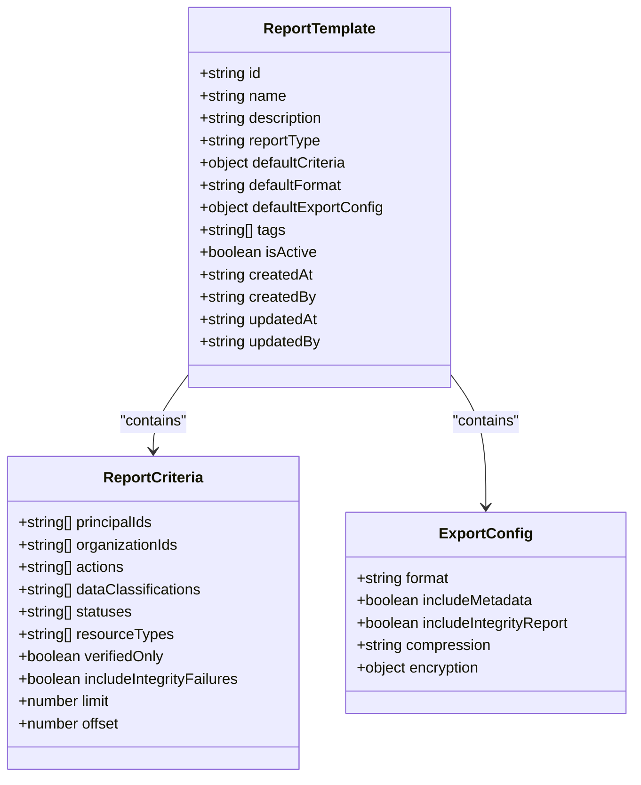
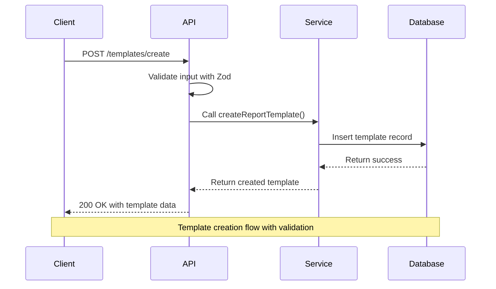
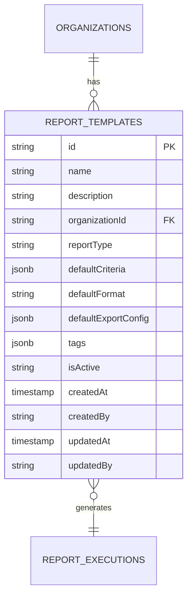
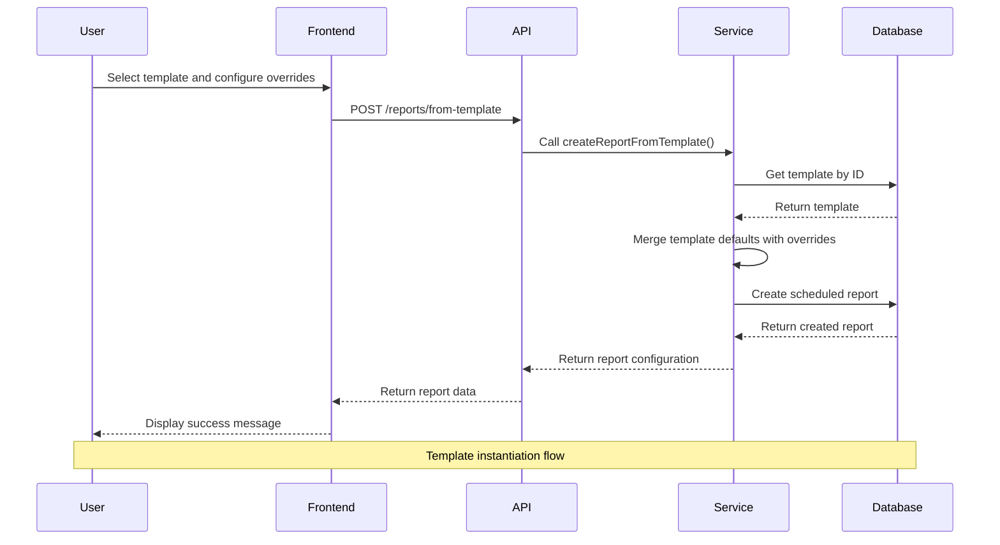
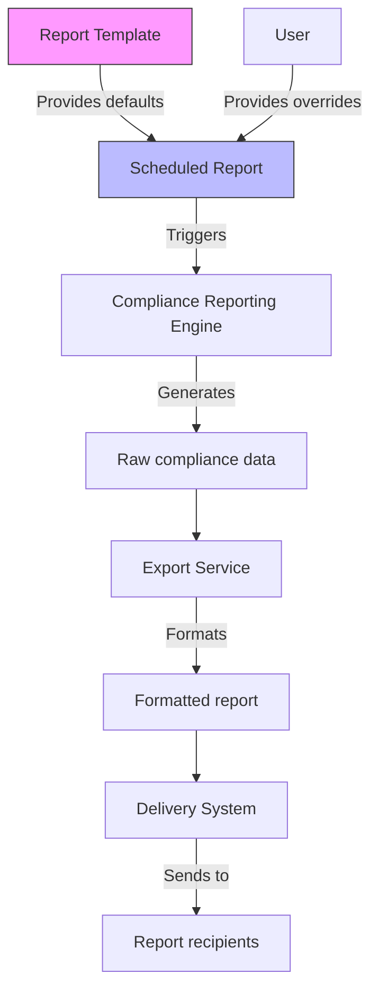

# Report Templates

<cite>
**Referenced Files in This Document**   
- [templates.ts](file://apps/server/src/routers/templates.ts)
- [report-templates.ts](file://apps/web/src/types/report-templates.ts)
- [scheduled-reporting.ts](file://packages/audit/src/report/scheduled-reporting.ts)
- [schema.ts](file://packages/audit-db/src/db/schema.ts)
- [form.tsx](file://apps/web/src/components/templates/form.tsx)
- [data-table.tsx](file://apps/web/src/components/templates/data-table.tsx)
- [column.tsx](file://apps/web/src/components/templates/column.tsx)
</cite>

## Table of Contents
1. [Introduction](#introduction)
2. [Template Structure](#template-structure)
3. [Template Management API](#template-management-api)
4. [Data Model](#data-model)
5. [User Interface Components](#user-interface-components)
6. [Template Instantiation](#template-instantiation)
7. [Integration with Compliance Reporting](#integration-with-compliance-reporting)
8. [Access Control and Permissions](#access-control-and-permissions)
9. [Best Practices for Template Design](#best-practices-for-template-design)

## Introduction

The Report Templates module provides a standardized framework for creating, managing, and instantiating compliance reports. This system enables organizations to define reusable report configurations that ensure consistency across recurring compliance documentation processes. Templates capture predefined filters, data fields, formatting options, and other report parameters, allowing users to generate standardized reports with minimal configuration effort.

The implementation spans multiple layers of the application architecture, including backend services, database schema, API endpoints, and frontend user interface components. The core functionality is provided by the ScheduledReportingService in the audit package, which handles template creation, retrieval, and instantiation into scheduled reports.

**Section sources**
- [scheduled-reporting.ts](file://packages/audit/src/report/scheduled-reporting.ts#L1-L50)

## Template Structure

Report templates define a reusable configuration for compliance reports, capturing default values for various report parameters. The structure includes metadata, filtering criteria, formatting options, and organizational tagging.

### Core Properties

The template structure is defined by the ReportTemplate interface, which includes the following key properties:

- **id**: Unique identifier for the template
- **name**: Display name for the template
- **description**: Optional description explaining the template's purpose
- **reportType**: Classification of the report (HIPAA_AUDIT_TRAIL, GDPR_PROCESSING_ACTIVITIES, GENERAL_COMPLIANCE, INTEGRITY_VERIFICATION)
- **defaultCriteria**: Predefined filters for report data
- **defaultFormat**: Default output format (json, csv, xml, pdf)
- **defaultExportConfig**: Default export configuration including metadata and encryption options
- **tags**: Array of string tags for categorization and search
- **isActive**: Boolean flag indicating whether the template is available for use
- **Timestamps**: createdAt, updatedAt for audit purposes
- **User references**: createdBy, updatedBy for accountability

### Default Criteria Configuration

Templates include defaultCriteria that define filtering parameters for the report data. These criteria support various filtering dimensions:

- **principalIds**: Filter by organization or user principals
- **organizationIds**: Filter by specific organizations
- **actions**: Filter by specific actions or event types
- **dataClassifications**: Filter by data sensitivity levels (PUBLIC, INTERNAL, CONFIDENTIAL, PHI)
- **statuses**: Filter by event status (attempt, success, failure)
- **resourceTypes**: Filter by resource types
- **verifiedOnly**: Include only events with integrity verification
- **includeIntegrityFailures**: Include failed integrity checks
- **Pagination**: limit and offset for large result sets



**Diagram sources**
- [scheduled-reporting.ts](file://packages/audit/src/report/scheduled-reporting.ts#L67-L85)
- [report-templates.ts](file://apps/web/src/types/report-templates.ts#L43-L50)

**Section sources**
- [scheduled-reporting.ts](file://packages/audit/src/report/scheduled-reporting.ts#L67-L85)
- [report-templates.ts](file://apps/web/src/types/report-templates.ts#L1-L51)

## Template Management API

The system provides a comprehensive API for managing report templates through the templates router. This API enables creation, retrieval, and listing of templates with appropriate access control.

### API Endpoints

The templates router exposes the following endpoints:

- **GET /templates/all**: Retrieve all active templates for the current organization
- **GET /templates/id**: Retrieve a specific template by ID
- **POST /templates/create**: Create a new report template

### Input Validation

The API uses Zod for comprehensive input validation, ensuring data integrity and security. The validation schema defines strict requirements for each template property:

- **name**: Required string
- **description**: Optional string
- **reportType**: Enum with specific compliance categories
- **defaultCriteria**: Structured object with typed properties
- **defaultFormat**: Enum with supported formats (json, csv, xml, pdf)
- **defaultExportConfig**: Configuration for export options
- **tags**: Array of strings
- **isActive**: Boolean flag



**Diagram sources**
- [templates.ts](file://apps/server/src/routers/templates.ts#L50-L189)

**Section sources**
- [templates.ts](file://apps/server/src/routers/templates.ts#L1-L189)

## Data Model

The report templates are persisted in the database using a dedicated table with optimized indexing for performance and scalability.

### Database Schema

The report_templates table includes the following columns:

- **id**: Primary key (varchar 255)
- **name**: Template name (varchar 255, not null)
- **description**: Optional description (text)
- **organizationId**: Foreign key to organization (varchar 255, not null)
- **reportType**: Type classification (varchar 100, not null)
- **defaultCriteria**: JSONB column storing filter criteria
- **defaultFormat**: Default output format (varchar 50, not null)
- **defaultExportConfig**: JSONB column storing export configuration
- **tags**: JSONB array of tags with default empty array
- **isActive**: Status flag (varchar 10, default 'true')
- **createdAt**: Creation timestamp with timezone
- **createdBy**: User ID of creator (varchar 255, not null)
- **updatedAt**: Last update timestamp with timezone
- **updatedBy**: User ID of last updater (varchar 255)

### Indexing Strategy

The schema includes multiple indexes to optimize query performance:

- **Primary indexes**: organization_id, report_type, is_active, created_at, created_by, name
- **Composite indexes**: organization + active status, organization + type, active + type
- **JSONB index**: On the tags column for efficient tag-based queries



**Diagram sources**
- [schema.ts](file://packages/audit-db/src/db/schema.ts#L490-L523)

**Section sources**
- [schema.ts](file://packages/audit-db/src/db/schema.ts#L490-L661)

## User Interface Components

The frontend provides a comprehensive set of React components for managing report templates through an intuitive user interface.

### Form Component

The ReportTemplateForm component enables users to create and edit templates with a structured form interface. Key features include:

- **Controlled inputs**: Using react-hook-form for state management
- **Zod validation**: Integration with the same validation schema used in the API
- **Dynamic fields**: Support for all template properties
- **Submit handling**: Callback-based submission with error handling
- **Success feedback**: Toast notifications on successful operations

The form uses a two-column layout for efficient space utilization and includes appropriate labels, placeholders, and descriptions for each field.

### Data Table Component

The DataTable component displays a list of templates with the following capabilities:

- **Sorting**: Clickable column headers with sort indicators
- **Filtering**: Global search filter
- **Pagination**: Previous/Next navigation
- **Responsive design**: Grid layout with appropriate spacing
- **Action menu**: Dropdown for edit and delete operations

### Column Configuration

The createColumns function defines the table structure with the following columns:

- **Name**: Template name with sorting capability
- **Description**: Template description
- **Type**: Report type classification
- **Active**: Status indicator
- **Actions**: Dropdown menu with edit and delete options

```mermaid
flowchart TD
Form["ReportTemplateForm"]
DataTable["DataTable"]
Columns["createColumns"]
Form --> |Uses| Zod["zodResolver(reportTemplate)"]
Form --> |Renders| InputFields["Input fields for all template properties"]
Form --> |Handles| Submission["Form submission with error handling"]
DataTable --> |Displays| TemplateList["List of templates"]
DataTable --> |Provides| Sorting["Column sorting"]
DataTable --> |Provides| Filtering["Global filtering"]
DataTable --> |Provides| Pagination["Page navigation"]
Columns --> |Defines| NameColumn["Name column with sorting"]
Columns --> |Defines| DescriptionColumn["Description column"]
Columns --> |Defines| TypeColumn["Type column"]
Columns --> |Defines| ActiveColumn["Active status column"]
Columns --> |Defines| ActionsColumn["Actions dropdown menu"]
Form --> UI["User Interface"]
DataTable --> UI
Columns --> UI
```



**Diagram sources**
- [form.tsx](file://apps/web/src/components/templates/form.tsx#L1-L134)
- [data-table.tsx](file://apps/web/src/components/templates/data-table.tsx#L1-L151)
- [column.tsx](file://apps/web/src/components/templates/column.tsx#L1-L70)

**Section sources**
- [form.tsx](file://apps/web/src/components/templates/form.tsx#L1-L134)
- [data-table.tsx](file://apps/web/src/components/templates/data-table.tsx#L1-L151)
- [column.tsx](file://apps/web/src/components/templates/column.tsx#L1-L70)

## Template Instantiation

Templates can be instantiated into scheduled reports, providing a powerful mechanism for creating standardized compliance reports with minimal configuration.

### Instantiation Process

The createReportFromTemplate method in the ScheduledReportingService handles the instantiation process:

1. Retrieve the specified template by ID
2. Apply any overrides provided in the request
3. Merge template defaults with override values
4. Create a new scheduled report configuration
5. Return the created report configuration

### Default Value Inheritance

When creating a report from a template, the system applies the following inheritance rules:

- **Name**: Template name with date suffix if no override provided
- **Description**: Template description if no override provided
- **Criteria**: Deep merge of template defaults with override values
- **Format**: Template default format if no override provided
- **Schedule**: Default to monthly at 09:00 UTC if no override provided
- **Delivery**: Default to email delivery with empty recipients if no override provided
- **Export**: Default to JSON format with metadata included if no override provided
- **Enabled**: True by default unless explicitly set to false

### Example Usage

```typescript
// Create a report from a template with overrides
const report = await service.createReportFromTemplate(templateId, {
  name: "Monthly HIPAA Report - Q2",
  schedule: {
    frequency: "monthly",
    dayOfMonth: 15,
    time: "14:00"
  },
  delivery: {
    method: "email",
    recipients: ["compliance@company.com"]
  },
  createdBy: "admin"
})
```



**Diagram sources**
- [scheduled-reporting.ts](file://packages/audit/src/report/scheduled-reporting.ts#L600-L650)

**Section sources**
- [scheduled-reporting.ts](file://packages/audit/src/report/scheduled-reporting.ts#L600-L650)

## Integration with Compliance Reporting

The report templates module is tightly integrated with the compliance reporting engine, enabling standardized reporting across various regulatory requirements.

### Supported Report Types

The system supports multiple compliance report types through the reportType field:

- **HIPAA_AUDIT_TRAIL**: For HIPAA compliance, focusing on Protected Health Information (PHI)
- **GDPR_PROCESSING_ACTIVITIES**: For GDPR compliance, tracking personal data processing
- **GENERAL_COMPLIANCE**: For general compliance monitoring
- **INTEGRITY_VERIFICATION**: For system integrity verification reports

### Reporting Workflow

When a scheduled report is executed, the system follows this workflow:

1. Retrieve the scheduled report configuration
2. If the report has a templateId, retrieve the template
3. Use the report's criteria, format, and other settings (which may come from the template)
4. Generate the report using the appropriate compliance reporting service
5. Export the report according to the export configuration
6. Deliver the report through the specified delivery method

### Dynamic Content Generation

The system supports dynamic content generation by allowing templates to define default criteria that can be overridden during instantiation. This enables:

- **Consistent filtering**: Templates ensure consistent data filtering across reports
- **Flexible customization**: Overrides allow for report-specific adjustments
- **Regulatory alignment**: Templates can be designed to meet specific regulatory requirements
- **Efficient reuse**: Common configurations are captured once and reused many times



**Diagram sources**
- [scheduled-reporting.ts](file://packages/audit/src/report/scheduled-reporting.ts#L800-L850)

**Section sources**
- [scheduled-reporting.ts](file://packages/audit/src/report/scheduled-reporting.ts#L1-L916)

## Access Control and Permissions

The system implements robust access control for report templates, ensuring that users can only access templates within their organization and according to their permissions.

### Organization-Based Isolation

All template operations include organization context to ensure data isolation:

- **Creation**: Templates are created within a specific organization
- **Retrieval**: Templates are filtered by organization ID
- **Listing**: Only templates from the current organization are returned
- **Access**: Cross-organization access is prevented

### Status Filtering

The system only returns active templates (isActive = true) in list operations, allowing organizations to manage template lifecycle without deleting templates permanently.

### Error Handling

The API includes comprehensive error handling for unauthorized access attempts:

- **Template not found**: Returns null for non-existent templates
- **Organization mismatch**: Prevents access to templates from other organizations
- **Validation errors**: Returns detailed validation messages for invalid input
- **Server errors**: Logs errors and returns appropriate HTTP status codes

**Section sources**
- [templates.ts](file://apps/server/src/routers/templates.ts#L1-L189)
- [scheduled-reporting.ts](file://packages/audit/src/report/scheduled-reporting.ts#L550-L597)

## Best Practices for Template Design

Effective template design is crucial for maximizing the benefits of the report templates system. The following best practices are recommended:

### Template Categorization

Organizations should create templates categorized by:

- **Regulatory requirements**: HIPAA, GDPR, etc.
- **Report frequency**: Daily, weekly, monthly
- **Data sensitivity**: PUBLIC, INTERNAL, CONFIDENTIAL, PHI
- **Business function**: Security, compliance, operations

### Naming Conventions

Use clear, descriptive names that indicate the template's purpose:

- "Monthly HIPAA Audit Trail Report"
- "Daily GDPR Processing Activities Report"
- "Quarterly Integrity Verification Report"

### Tagging Strategy

Implement a consistent tagging strategy to facilitate template discovery:

- **Regulatory tags**: "hipaa", "gdpr", "sox"
- **Frequency tags**: "daily", "weekly", "monthly"
- **Data type tags**: "phi", "pii", "financial"
- **Department tags**: "security", "compliance", "it"

### Default Configuration

Design templates with sensible defaults that reflect common use cases:

- Set appropriate data classification filters
- Choose the most commonly used export format
- Include metadata by default
- Set reasonable pagination limits

### Versioning Considerations

Since the system doesn't explicitly support template versioning, consider these approaches:

- Create new templates for significant changes
- Use descriptive names to indicate template versions
- Maintain documentation of template changes
- Use tags to indicate template status (e.g., "current", "deprecated")

### Testing and Validation

Before deploying templates organization-wide:

- Test with sample data to ensure correct filtering
- Verify output format meets requirements
- Confirm delivery methods work correctly
- Validate that the report satisfies compliance requirements

**Section sources**
- [scheduled-reporting.ts](file://packages/audit/src/report/scheduled-reporting.ts#L1-L916)
- [report-templates.ts](file://apps/web/src/types/report-templates.ts#L1-L51)