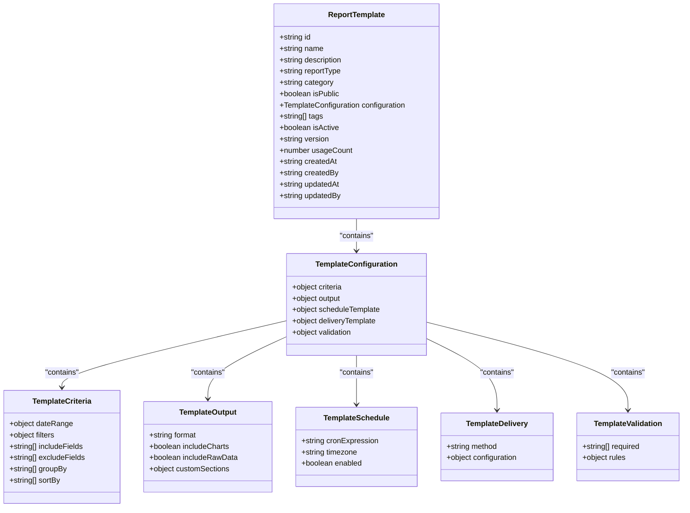
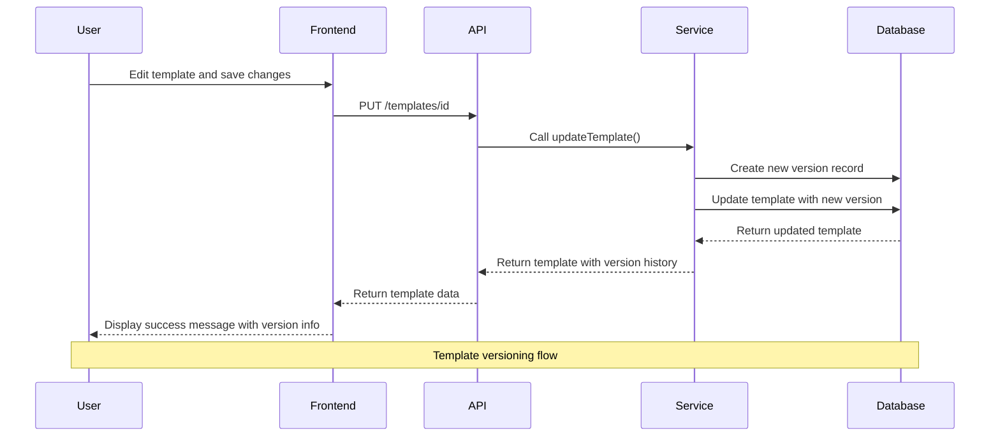
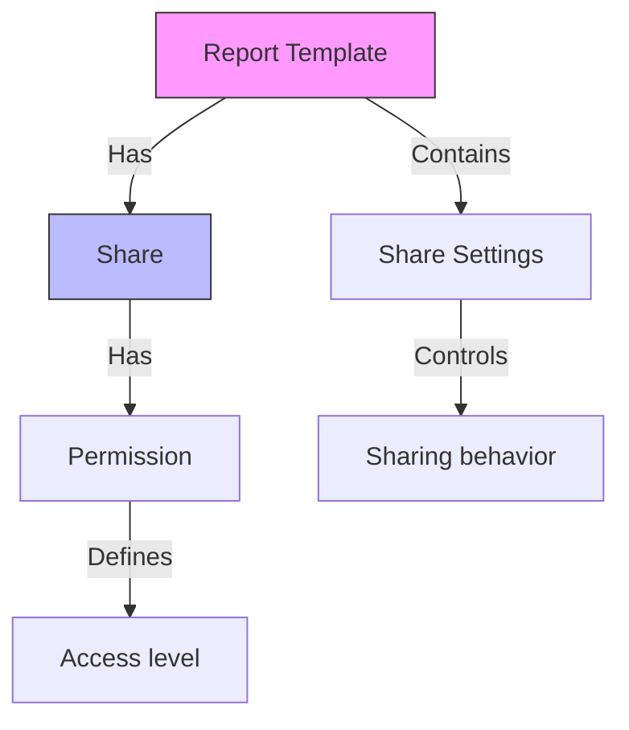
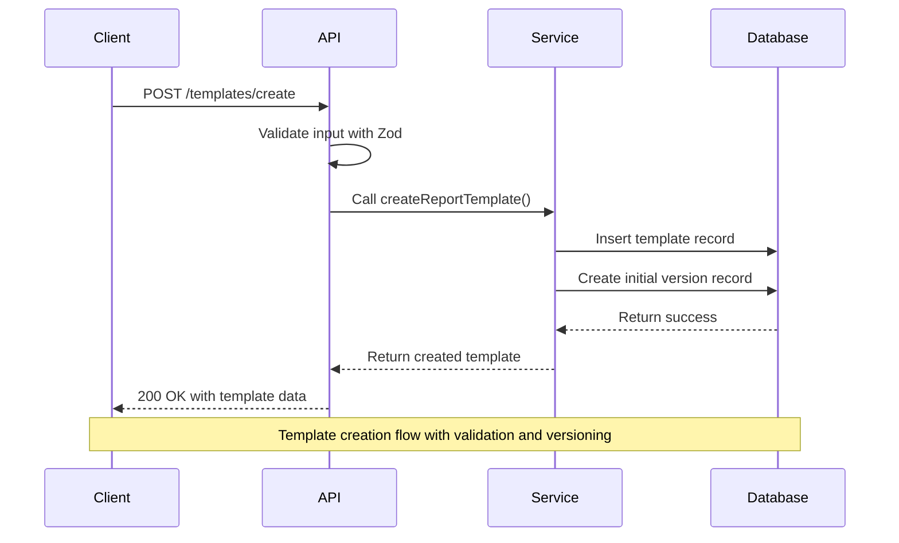
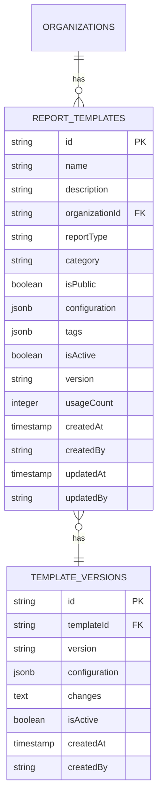
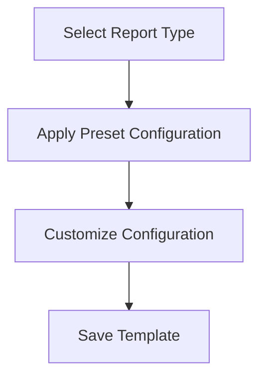
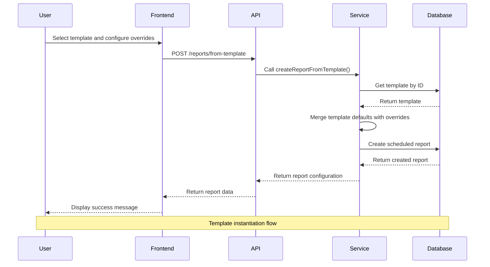
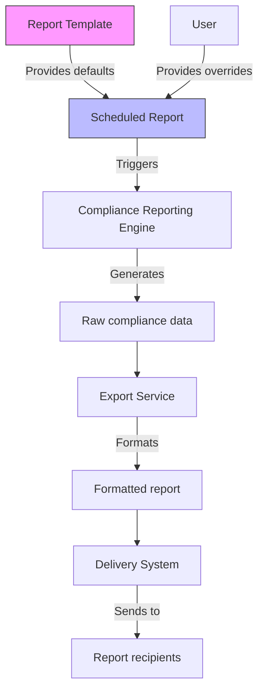

# Report Templates

<cite>
**Referenced Files in This Document**   
- [templates.ts](file://apps/server/src/routers/templates.ts) - *Updated in recent commit*
- [report-templates.ts](file://apps/web/src/types/report-templates.ts) - *Updated in recent commit*
- [scheduled-reporting.ts](file://packages/audit/src/report/scheduled-reporting.ts) - *Updated with new report types and notification configuration*
- [schema.ts](file://packages/audit-db/src/db/schema.ts) - *Enhanced with versioning and metadata columns*
- [report-configuration-form.tsx](file://apps/app/src/components/compliance/forms/report-configuration-form.tsx) - *Added new report types*
- [report-templates-page.tsx](file://apps/app/src/components/compliance/templates/report-templates-page.tsx) - *Updated with versioning and sharing features*
- [template-types.ts](file://apps/app/src/components/compliance/templates/template-types.ts) - *Added versioning and sharing capabilities*
- [template-form.tsx](file://apps/app/src/components/compliance/templates/template-form.tsx) - *Enhanced with multi-step form for template creation*
</cite>

## Update Summary
**Changes Made**   
- Updated **Template Structure** section to include versioning, sharing, and enhanced configuration options
- Added **Template Versioning** section to document version management capabilities
- Added **Template Sharing and Permissions** section to cover sharing functionality
- Updated **Template Management API** to reflect new report types including GENERAL_COMPLIANCE and CUSTOM_REPORT
- Enhanced **User Interface Components** to include version history and sharing management
- Added **Template Configuration Presets** section to document preset configurations for different report types
- Updated **Best Practices for Template Design** to include versioning and sharing strategies

## Table of Contents
1. [Introduction](#introduction)
2. [Template Structure](#template-structure)
3. [Template Versioning](#template-versioning)
4. [Template Sharing and Permissions](#template-sharing-and-permissions)
5. [Template Management API](#template-management-api)
6. [Data Model](#data-model)
7. [User Interface Components](#user-interface-components)
8. [Template Configuration Presets](#template-configuration-presets)
9. [Template Instantiation](#template-instantiation)
10. [Integration with Compliance Reporting](#integration-with-compliance-reporting)
11. [Access Control and Permissions](#access-control-and-permissions)
12. [Best Practices for Template Design](#best-practices-for-template-design)

## Introduction

The Report Templates module provides a standardized framework for creating, managing, and instantiating compliance reports. This system enables organizations to define reusable report configurations that ensure consistency across recurring compliance documentation processes. Templates capture predefined filters, data fields, formatting options, and other report parameters, allowing users to generate standardized reports with minimal configuration effort.

The implementation spans multiple layers of the application architecture, including backend services, database schema, API endpoints, and frontend user interface components. The core functionality is provided by the ScheduledReportingService in the audit package, which handles template creation, retrieval, and instantiation into scheduled reports.

**Section sources**
- [scheduled-reporting.ts](file://packages/audit/src/report/scheduled-reporting.ts#L1-L50)

## Template Structure

Report templates define a reusable configuration for compliance reports, capturing default values for various report parameters. The structure includes metadata, filtering criteria, formatting options, organizational tagging, versioning, and sharing configuration.

### Core Properties

The template structure is defined by the ReportTemplate interface, which includes the following key properties:

- **id**: Unique identifier for the template
- **name**: Display name for the template
- **description**: Optional description explaining the template's purpose
- **reportType**: Classification of the report (HIPAA_AUDIT_TRAIL, GDPR_PROCESSING_ACTIVITIES, GENERAL_COMPLIANCE, INTEGRITY_VERIFICATION, CUSTOM_REPORT)
- **category**: Organizational category for the template (healthcare, privacy, security, financial, custom)
- **isPublic**: Boolean flag indicating whether the template is publicly accessible
- **configuration**: Comprehensive configuration object containing criteria, output, schedule, and delivery settings
- **tags**: Array of string tags for categorization and search
- **isActive**: Boolean flag indicating whether the template is available for use
- **version**: Semantic version string for the template
- **usageCount**: Number of times the template has been used
- **Timestamps**: createdAt, updatedAt for audit purposes
- **User references**: createdBy, updatedBy for accountability

### Configuration Structure

Templates include a comprehensive configuration object that defines all aspects of the report:

- **Criteria**: Report filtering parameters including date range, filters, included/excluded fields, grouping, and sorting
- **Output**: Output format (pdf, csv, json, xlsx), chart inclusion, raw data inclusion, and custom sections
- **Schedule Template**: Optional default scheduling configuration (cron expression, timezone, enabled status)
- **Delivery Template**: Optional default delivery configuration (method, configuration)
- **Validation**: Validation rules for template parameters



**Diagram sources**
- [template-types.ts](file://apps/app/src/components/compliance/templates/template-types.ts#L8-L34)
- [scheduled-reporting.ts](file://packages/audit/src/report/scheduled-reporting.ts#L95-L122)

**Section sources**
- [template-types.ts](file://apps/app/src/components/compliance/templates/template-types.ts#L8-L34)
- [scheduled-reporting.ts](file://packages/audit/src/report/scheduled-reporting.ts#L95-L122)

## Template Versioning

The system provides comprehensive versioning capabilities for report templates, enabling organizations to track changes, maintain historical versions, and manage template evolution over time.

### Version Properties

Each template version includes the following properties:

- **version**: Semantic version string (e.g., "2.1.0")
- **createdAt**: Timestamp of version creation
- **createdBy**: User ID of the creator
- **changes**: Array of strings describing changes made in this version
- **configuration**: Complete template configuration at this version
- **isActive**: Boolean flag indicating whether this version is currently active

### Version Management

The system supports the following version management operations:

- **Automatic Versioning**: New versions are automatically created when templates are updated
- **Version History**: Complete history of all versions is maintained
- **Version Activation**: Users can activate a specific version as the current version
- **Version Comparison**: Side-by-side comparison of different versions
- **Rollback**: Ability to revert to a previous version

### Versioning Workflow

When a template is updated, the system follows this workflow:

1. Create a new version with incremented version number
2. Copy the current configuration to the new version
3. Apply changes to the new version
4. Set the new version as active
5. Preserve previous versions in version history



**Diagram sources**
- [template-types.ts](file://apps/app/src/components/compliance/templates/template-types.ts#L108-L122)
- [template-form.tsx](file://apps/app/src/components/compliance/templates/template-form.tsx#L1-L808)

**Section sources**
- [template-types.ts](file://apps/app/src/components/compliance/templates/template-types.ts#L108-L122)
- [template-form.tsx](file://apps/app/src/components/compliance/templates/template-form.tsx#L1-L808)

## Template Sharing and Permissions

The system provides robust sharing and permission management for report templates, enabling collaboration while maintaining appropriate access controls.

### Share Settings

Templates include share settings that define sharing behavior:

- **isPublic**: Whether the template is publicly accessible
- **allowPublicUse**: Whether others can use this template
- **allowPublicEdit**: Whether others can edit this template
- **requireApproval**: Whether sharing requires approval
- **maxShares**: Maximum number of shares allowed

### Share Permissions

Each share includes specific permissions:

- **view**: Ability to view template details
- **use**: Ability to create reports from the template
- **edit**: Ability to modify the template
- **share**: Ability to share the template with others

### Sharing Workflow

The sharing process follows this workflow:

1. User initiates sharing of a template
2. System validates sharing permissions
3. Share record is created with specified permissions
4. Notification is sent to the recipient
5. Recipient can access the template according to granted permissions



**Diagram sources**
- [template-types.ts](file://apps/app/src/components/compliance/templates/template-types.ts#L124-L150)
- [report-templates-page.tsx](file://apps/app/src/components/compliance/templates/report-templates-page.tsx#L1-L938)

**Section sources**
- [template-types.ts](file://apps/app/src/components/compliance/templates/template-types.ts#L124-L150)
- [report-templates-page.tsx](file://apps/app/src/components/compliance/templates/report-templates-page.tsx#L1-L938)

## Template Management API

The system provides a comprehensive API for managing report templates through the templates router. This API enables creation, retrieval, and listing of templates with appropriate access control.

### API Endpoints

The templates router exposes the following endpoints:

- **GET /templates/all**: Retrieve all active templates for the current organization
- **GET /templates/id**: Retrieve a specific template by ID
- **POST /templates/create**: Create a new report template
- **PUT /templates/id**: Update an existing template
- **DELETE /templates/id**: Delete a template

### Input Validation

The API uses Zod for comprehensive input validation, ensuring data integrity and security. The validation schema defines strict requirements for each template property:

- **name**: Required string
- **description**: Optional string
- **reportType**: Enum with specific compliance categories including new types GENERAL_COMPLIANCE and CUSTOM_REPORT
- **category**: String from predefined categories (healthcare, privacy, security, financial, custom)
- **configuration**: Structured object with typed properties for criteria, output, schedule, delivery, and validation
- **tags**: Array of strings
- **isPublic**: Boolean flag
- **shareSettings**: Configuration for sharing permissions



**Diagram sources**
- [templates.ts](file://apps/server/src/routers/templates.ts#L50-L189)
- [report-configuration-form.tsx](file://apps/app/src/components/compliance/forms/report-configuration-form.tsx#L1-L442)

**Section sources**
- [templates.ts](file://apps/server/src/routers/templates.ts#L1-L189)
- [report-configuration-form.tsx](file://apps/app/src/components/compliance/forms/report-configuration-form.ts#L1-L442)

## Data Model

The report templates are persisted in the database using a dedicated table with optimized indexing for performance and scalability.

### Database Schema

The report_templates table includes the following columns:

- **id**: Primary key (varchar 255)
- **name**: Template name (varchar 255, not null)
- **description**: Optional description (text)
- **organizationId**: Foreign key to organization (varchar 255, not null)
- **reportType**: Type classification (varchar 100, not null)
- **category**: Template category (varchar 50, not null)
- **isPublic**: Public visibility flag (boolean, not null)
- **configuration**: JSONB column storing complete template configuration
- **tags**: JSONB array of tags with default empty array
- **isActive**: Status flag (boolean, not null)
- **version**: Version string (varchar 20, not null)
- **usageCount**: Usage counter (integer, default 0)
- **createdAt**: Creation timestamp with timezone
- **createdBy**: User ID of creator (varchar 255, not null)
- **updatedAt**: Last update timestamp with timezone
- **updatedBy**: User ID of last updater (varchar 255)

### Versioning Schema

The template_versions table includes the following columns:

- **id**: Primary key (varchar 255)
- **templateId**: Foreign key to template (varchar 255, not null)
- **version**: Version string (varchar 20, not null)
- **configuration**: JSONB column storing template configuration at this version
- **changes**: Text description of changes
- **isActive**: Boolean flag indicating if this version is active
- **createdAt**: Creation timestamp with timezone
- **createdBy**: User ID of creator (varchar 255, not null)

### Indexing Strategy

The schema includes multiple indexes to optimize query performance:

- **Primary indexes**: organization_id, report_type, is_active, created_at, created_by, name
- **Composite indexes**: organization + active status, organization + type, active + type
- **JSONB index**: On the tags column for efficient tag-based queries
- **Version index**: template_id + version for efficient version lookup



**Diagram sources**
- [schema.ts](file://packages/audit-db/src/db/schema.ts#L490-L523)
- [template-types.ts](file://apps/app/src/components/compliance/templates/template-types.ts#L8-L34)

**Section sources**
- [schema.ts](file://packages/audit-db/src/db/schema.ts#L490-L661)
- [template-types.ts](file://apps/app/src/components/compliance/templates/template-types.ts#L8-L34)

## User Interface Components

The frontend provides a comprehensive set of React components for managing report templates through an intuitive user interface.

### Form Component

The TemplateForm component enables users to create and edit templates with a structured multi-step form interface. Key features include:

- **Multi-step workflow**: Five-step process for template creation (Basic Information, Report Configuration, Advanced Settings, Sharing & Permissions, Review & Save)
- **Controlled inputs**: Using state management for form data
- **Zod validation**: Integration with the same validation schema used in the API
- **Dynamic fields**: Support for all template properties
- **Submit handling**: Callback-based submission with error handling
- **Success feedback**: Visual feedback on successful operations

The form uses a card-based layout with progress indicators and includes appropriate labels, placeholders, and descriptions for each field.

### Data Table Component

The DataTable component displays a list of templates with the following capabilities:

- **Sorting**: Clickable column headers with sort indicators
- **Filtering**: Global search filter and category/report type filters
- **Pagination**: Previous/Next navigation
- **Responsive design**: Grid layout with appropriate spacing
- **Action menu**: Dropdown for edit, duplicate, version management, sharing management, and delete operations

### Column Configuration

The createColumns function defines the table structure with the following columns:

- **Name**: Template name with sorting capability
- **Type**: Report type classification
- **Category**: Template category
- **Visibility**: Public/private status
- **Usage**: Usage count
- **Updated**: Last update timestamp
- **Actions**: Dropdown menu with various operations

```mermaid
flowchart TD
Form["TemplateForm"]
DataTable["DataTable"]
Columns["createColumns"]
Form --> |Uses| Validation["Zod validation"]
Form --> |Renders| Steps["Multi-step workflow"]
Form --> |Handles| Submission["Form submission with error handling"]
DataTable --> |Displays| TemplateList["List of templates"]
DataTable --> |Provides| Sorting["Column sorting"]
DataTable --> |Provides| Filtering["Global and category filtering"]
DataTable --> |Provides| Pagination["Page navigation"]
Columns --> |Defines| NameColumn["Name column with sorting"]
Columns --> |Defines| TypeColumn["Type column"]
Columns --> |Defines| CategoryColumn["Category column"]
Columns --> |Defines| VisibilityColumn["Visibility column"]
Columns --> |Defines| UsageColumn["Usage count column"]
Columns --> |Defines| UpdatedColumn["Updated timestamp column"]
Columns --> |Defines| ActionsColumn["Actions dropdown menu"]
Form --> UI["User Interface"]
DataTable --> UI
Columns --> UI
```



**Diagram sources**
- [template-form.tsx](file://apps/app/src/components/compliance/templates/template-form.tsx#L1-L808)
- [report-templates-page.tsx](file://apps/app/src/components/compliance/templates/report-templates-page.tsx#L1-L938)
- [template-types.ts](file://apps/app/src/components/compliance/templates/template-types.ts#L8-L34)

**Section sources**
- [template-form.tsx](file://apps/app/src/components/compliance/templates/template-form.ts#L1-L808)
- [report-templates-page.tsx](file://apps/app/src/components/compliance/templates/report-templates-page.ts#L1-L938)
- [template-types.ts](file://apps/app/src/components/compliance/templates/template-types.ts#L8-L34)

## Template Configuration Presets

The system includes predefined configuration presets for common report types, providing sensible defaults that can be customized as needed.

### Preset Types

The system provides presets for the following report types:

- **HIPAA_AUDIT_TRAIL**: Comprehensive HIPAA compliance audit with all required sections
- **GDPR_PROCESSING_ACTIVITIES**: GDPR data processing activities reporting
- **INTEGRITY_VERIFICATION**: Data integrity verification with advanced parameters

### Preset Configuration

Each preset includes default configuration values:

- **HIPAA Preset**: 30-day relative date range, includes timestamp, userId, action, resourceType, ipAddress, userAgent, outcome fields, groups by action and resourceType, includes charts, PDF format
- **GDPR Preset**: 90-day relative date range, includes timestamp, dataSubjectId, processingPurpose, dataCategories, legalBasis, retentionPeriod, thirdPartySharing fields, groups by processingPurpose and legalBasis, includes charts and raw data, PDF format
- **Integrity Preset**: 7-day relative date range, includes timestamp, recordId, checksum, previousChecksum, verificationStatus, anomalies fields, groups by verificationStatus, includes raw data, JSON format

### Preset Application

When a user selects a report type, the corresponding preset is automatically applied to the template configuration, providing a starting point that can be further customized.



**Diagram sources**
- [template-types.ts](file://apps/app/src/components/compliance/templates/template-types.ts#L152-L250)
- [template-form.tsx](file://apps/app/src/components/compliance/templates/template-form.ts#L1-L808)

**Section sources**
- [template-types.ts](file://apps/app/src/components/compliance/templates/template-types.ts#L152-L250)
- [template-form.tsx](file://apps/app/src/components/compliance/templates/template-form.ts#L1-L808)

## Template Instantiation

Templates can be instantiated into scheduled reports, providing a powerful mechanism for creating standardized compliance reports with minimal configuration.

### Instantiation Process

The createReportFromTemplate method in the ScheduledReportingService handles the instantiation process:

1. Retrieve the specified template by ID
2. Apply any overrides provided in the request
3. Merge template defaults with override values
4. Create a new scheduled report configuration
5. Return the created report configuration

### Default Value Inheritance

When creating a report from a template, the system applies the following inheritance rules:

- **Name**: Template name with date suffix if no override provided
- **Description**: Template description if no override provided
- **Criteria**: Deep merge of template defaults with override values
- **Format**: Template default format if no override provided
- **Schedule**: Default to monthly at 09:00 UTC if no override provided
- **Delivery**: Default to email delivery with empty recipients if no override provided
- **Export**: Default to JSON format with metadata included if no override provided
- **Enabled**: True by default unless explicitly set to false

### Example Usage

```typescript
// Create a report from a template with overrides
const report = await service.createReportFromTemplate(templateId, {
  name: "Monthly HIPAA Report - Q2",
  schedule: {
    frequency: "monthly",
    dayOfMonth: 15,
    time: "14:00"
  },
  delivery: {
    method: "email",
    recipients: ["compliance@company.com"]
  },
  createdBy: "admin"
})
```



**Diagram sources**
- [scheduled-reporting.ts](file://packages/audit/src/report/scheduled-reporting.ts#L600-L650)

**Section sources**
- [scheduled-reporting.ts](file://packages/audit/src/report/scheduled-reporting.ts#L600-L650)

## Integration with Compliance Reporting

The report templates module is tightly integrated with the compliance reporting engine, enabling standardized reporting across various regulatory requirements.

### Supported Report Types

The system supports multiple compliance report types through the reportType field:

- **HIPAA_AUDIT_TRAIL**: For HIPAA compliance, focusing on Protected Health Information (PHI)
- **GDPR_PROCESSING_ACTIVITIES**: For GDPR compliance, tracking personal data processing
- **GENERAL_COMPLIANCE**: For general compliance monitoring
- **INTEGRITY_VERIFICATION**: For system integrity verification reports
- **CUSTOM_REPORT**: For custom compliance requirements

### Reporting Workflow

When a scheduled report is executed, the system follows this workflow:

1. Retrieve the scheduled report configuration
2. If the report has a templateId, retrieve the template
3. Use the report's criteria, format, and other settings (which may come from the template)
4. Generate the report using the appropriate compliance reporting service
5. Export the report according to the export configuration
6. Deliver the report through the specified delivery method

### Dynamic Content Generation

The system supports dynamic content generation by allowing templates to define default criteria that can be overridden during instantiation. This enables:

- **Consistent filtering**: Templates ensure consistent data filtering across reports
- **Flexible customization**: Overrides allow for report-specific adjustments
- **Regulatory alignment**: Templates can be designed to meet specific regulatory requirements
- **Efficient reuse**: Common configurations are captured once and reused many times



**Diagram sources**
- [scheduled-reporting.ts](file://packages/audit/src/report/scheduled-reporting.ts#L800-L850)

**Section sources**
- [scheduled-reporting.ts](file://packages/audit/src/report/scheduled-reporting.ts#L1-L916)

## Access Control and Permissions

The system implements robust access control for report templates, ensuring that users can only access templates within their organization and according to their permissions.

### Organization-Based Isolation

All template operations include organization context to ensure data isolation:

- **Creation**: Templates are created within a specific organization
- **Retrieval**: Templates are filtered by organization ID
- **Listing**: Only templates from the current organization are returned
- **Access**: Cross-organization access is prevented

### Status Filtering

The system only returns active templates (isActive = true) in list operations, allowing organizations to manage template lifecycle without deleting templates permanently.

### Error Handling

The API includes comprehensive error handling for unauthorized access attempts:

- **Template not found**: Returns null for non-existent templates
- **Organization mismatch**: Prevents access to templates from other organizations
- **Validation errors**: Returns detailed validation messages for invalid input
- **Server errors**: Logs errors and returns appropriate HTTP status codes

**Section sources**
- [templates.ts](file://apps/server/src/routers/templates.ts#L1-L189)
- [scheduled-reporting.ts](file://packages/audit/src/report/scheduled-reporting.ts#L550-L597)

## Best Practices for Template Design

Effective template design is crucial for maximizing the benefits of the report templates system. The following best practices are recommended:

### Template Categorization

Organizations should create templates categorized by:

- **Regulatory requirements**: HIPAA, GDPR, SOX, PCI, ISO27001
- **Report frequency**: Daily, weekly, monthly, quarterly
- **Data sensitivity**: PUBLIC, INTERNAL, CONFIDENTIAL, PHI
- **Business function**: Security, compliance, operations, privacy

### Naming Conventions

Use clear, descriptive names that indicate the template's purpose:

- "Monthly HIPAA Audit Trail Report"
- "Daily GDPR Processing Activities Report"
- "Quarterly Integrity Verification Report"
- "Custom Security Audit Report"

### Tagging Strategy

Implement a consistent tagging strategy to facilitate template discovery:

- **Regulatory tags**: "hipaa", "gdpr", "sox", "pci", "iso27001"
- **Frequency tags**: "daily", "weekly", "monthly", "quarterly"
- **Data type tags**: "phi", "pii", "financial", "security"
- **Department tags**: "security", "compliance", "it", "privacy"

### Versioning Strategy

Implement a consistent versioning strategy:

- Use semantic versioning (major.minor.patch)
- Document changes in the version history
- Maintain backward compatibility when possible
- Use version activation to control which version is current
- Archive deprecated versions rather than deleting them

### Sharing Strategy

Implement a consistent sharing strategy:

- Define clear sharing policies for public vs. private templates
- Use approval requirements for sensitive templates
- Limit the number of shares for critical templates
- Monitor template usage and sharing patterns
- Regularly review sharing permissions

### Default Configuration

Design templates with sensible defaults that reflect common use cases:

- Set appropriate data classification filters
- Choose the most commonly used output format
- Include metadata by default
- Set reasonable pagination limits
- Include relevant charts and visualizations

### Testing and Validation

Before deploying templates organization-wide:

- Test with sample data to ensure correct filtering
- Verify output format meets requirements
- Confirm delivery methods work correctly
- Validate that the report satisfies compliance requirements
- Test versioning and sharing functionality

**Section sources**
- [scheduled-reporting.ts](file://packages/audit/src/report/scheduled-reporting.ts#L1-L916)
- [template-types.ts](file://apps/app/src/components/compliance/templates/template-types.ts#L8-L34)
- [report-templates-page.tsx](file://apps/app/src/components/compliance/templates/report-templates-page.ts#L1-L938)