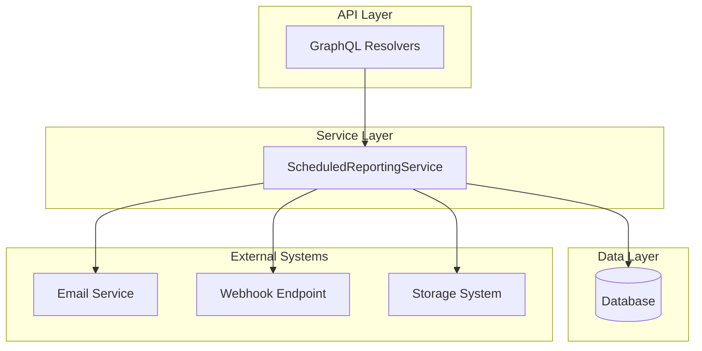
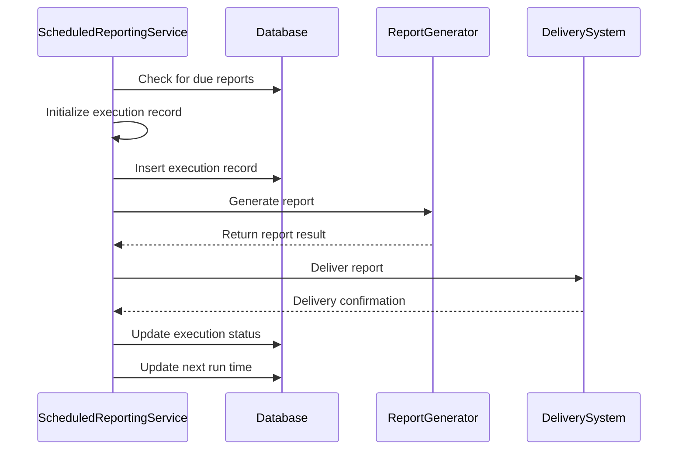
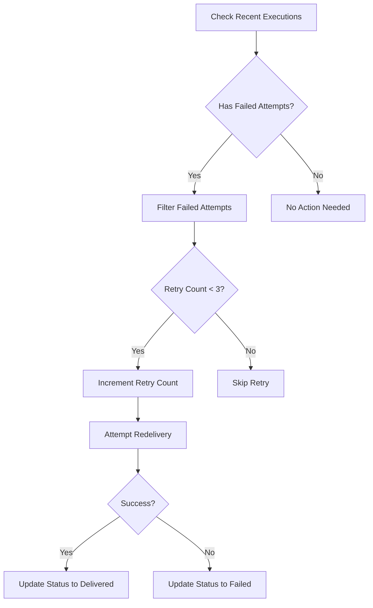
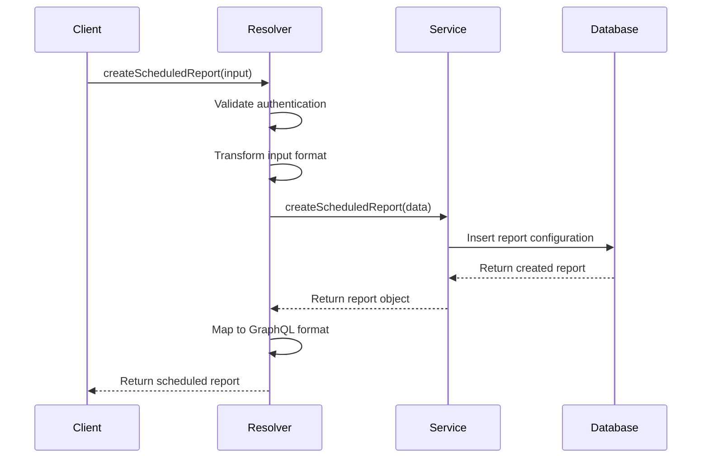

# Scheduled Reporting

<cite>
**Referenced Files in This Document**   
- [scheduled-reporting.ts](file://packages/audit/src/report/scheduled-reporting.ts)
- [scheduled-reports.ts](file://apps/server/src/lib/graphql/resolvers/scheduled-reports.ts)
- [scheduled-reporting.test.ts](file://packages/audit/src/__tests__/scheduled-reporting.test.ts)
</cite>

## Table of Contents
1. [Introduction](#introduction)
2. [Core Components and Architecture](#core-components-and-architecture)
3. [Report Scheduling and Execution](#report-scheduling-and-execution)
4. [Delivery Mechanisms and Retry Logic](#delivery-mechanisms-and-retry-logic)
5. [GraphQL API Interface](#graphql-api-interface)
6. [Report Templates and Configuration](#report-templates-and-configuration)
7. [Error Handling and Monitoring](#error-handling-and-monitoring)
8. [Testing and Validation](#testing-and-validation)
9. [Best Practices and Recommendations](#best-practices-and-recommendations)

## Introduction

The Scheduled Reporting system enables automated generation and delivery of compliance reports based on predefined schedules. It supports various report types including HIPAA, GDPR, and integrity verification reports, with flexible delivery options such as email, webhook, and storage. The system is designed to run in the background using worker processes, ensuring efficient resource utilization while maintaining reliability through robust error handling and retry mechanisms.

This document provides a comprehensive overview of the implementation, covering the architecture, scheduling logic, delivery mechanisms, API interfaces, and operational considerations for managing scheduled compliance reports.

## Core Components and Architecture

The Scheduled Reporting system consists of several interconnected components that work together to automate report generation and delivery:

- **ScheduledReportingService**: Core service responsible for managing scheduled reports, executing them, and handling delivery
- **GraphQL Resolvers**: API layer that exposes scheduled reporting functionality through GraphQL queries and mutations
- **Database Layer**: Stores scheduled report configurations, execution history, and delivery attempts
- **Worker Processes**: Background execution environment for generating reports without blocking the main application

The architecture follows a layered pattern with clear separation of concerns, where the service layer handles business logic, the API layer provides interface access, and external systems handle delivery and storage.



**Diagram sources**
- [scheduled-reporting.ts](file://packages/audit/src/report/scheduled-reporting.ts)
- [scheduled-reports.ts](file://apps/server/src/lib/graphql/resolvers/scheduled-reports.ts)

**Section sources**
- [scheduled-reporting.ts](file://packages/audit/src/report/scheduled-reporting.ts)
- [scheduled-reports.ts](file://apps/server/src/lib/graphql/resolvers/scheduled-reports.ts)

## Report Scheduling and Execution

The system implements cron-like scheduling through recurrence patterns defined in the report configuration. Reports are executed based on frequency settings including daily, weekly, monthly, and quarterly intervals.

### Scheduling Logic

The `calculateNextRun` method determines when a report should next execute based on its frequency and configured time:

```typescript
private calculateNextRun(schedule: ScheduledReportConfig['schedule']): string {
    const now = new Date()
    const [hours, minutes] = schedule.time.split(':').map(Number)
    
    let nextRun = new Date(now)
    nextRun.setHours(hours, minutes, 0, 0)
    
    if (nextRun <= now) {
        switch (schedule.frequency) {
            case 'daily':
                nextRun.setDate(nextRun.getDate() + 1)
                break
            case 'weekly':
                const targetDay = schedule.dayOfWeek || 1
                const currentDay = nextRun.getDay()
                const daysUntilTarget = (targetDay - currentDay + 7) % 7 || 7
                nextRun.setDate(nextRun.getDate() + daysUntilTarget)
                break
            case 'monthly':
                const targetDate = schedule.dayOfMonth || 1
                nextRun.setMonth(nextRun.getMonth() + 1, targetDate)
                break
            case 'quarterly':
                nextRun.setMonth(nextRun.getMonth() + 3, schedule.dayOfMonth || 1)
                break
        }
    }
    
    return nextRun.toISOString()
}
```

### Execution Process

The `executeReport` method handles the complete report generation workflow:

1. Creates an execution record in the database
2. Generates the report content based on the report type
3. Delivers the report through the configured method
4. Updates execution status and records metrics
5. Calculates the next run time for recurring reports

Timezone handling is supported through the `timezone` field in the schedule configuration, though the current implementation uses UTC by default. The system tracks execution duration, records processed, and maintains a complete history of all report executions.



**Diagram sources**
- [scheduled-reporting.ts](file://packages/audit/src/report/scheduled-reporting.ts#L400-L600)

**Section sources**
- [scheduled-reporting.ts](file://packages/audit/src/report/scheduled-reporting.ts#L400-L600)

## Delivery Mechanisms and Retry Logic

The system supports multiple delivery methods for generated reports, each with specific configuration options and delivery tracking.

### Supported Delivery Methods

**Email Delivery**
- Configured with recipient list
- Uses SMTP configuration from service initialization
- Each delivery attempt is recorded with timestamp and status

**Webhook Delivery**
- Sends report data to configured URL endpoint
- Supports custom headers and authentication
- Records response code and response time

**Storage Delivery**
- Saves report to specified location
- Supports various storage providers
- Includes retention policies for automatic cleanup

### Delivery Workflow

The `deliverReport` method orchestrates the delivery process:

```typescript
private async deliverReport(
    config: ScheduledReportConfig,
    reportResult: ExportResult,
    execution: ReportExecution
): Promise<void> {
    const deliveryAttempt: DeliveryAttempt = {
        attemptId: this.generateId('delivery'),
        timestamp: new Date().toISOString(),
        status: 'pending',
        method: config.delivery.method,
        target: this.getDeliveryTarget(config.delivery),
        retryCount: 0,
    }

    execution.deliveryAttempts.push(deliveryAttempt)

    try {
        switch (config.delivery.method) {
            case 'email':
                await this.deliverViaEmail(config.delivery, reportResult, deliveryAttempt)
                break
            case 'webhook':
                await this.deliverViaWebhook(config.delivery, reportResult, deliveryAttempt)
                break
            case 'storage':
                await this.deliverViaStorage(config.delivery, reportResult, deliveryAttempt)
                break
        }

        deliveryAttempt.status = 'delivered'
    } catch (error) {
        deliveryAttempt.status = 'failed'
        deliveryAttempt.error = error instanceof Error ? error.message : 'Unknown error'
        throw error
    }
}
```

### Retry Mechanism

Failed deliveries are automatically retried up to three times using the `retryFailedDeliveries` method:



The retry process preserves the original execution context and updates the delivery attempts array in the database. Each retry increments the retry count and records the attempt timestamp.

**Diagram sources**
- [scheduled-reporting.ts](file://packages/audit/src/report/scheduled-reporting.ts#L800-L916)

**Section sources**
- [scheduled-reporting.ts](file://packages/audit/src/report/scheduled-reporting.ts#L800-L916)

## GraphQL API Interface

The system provides a comprehensive GraphQL API for managing scheduled reports through both UI and programmatic interfaces.

### Query Operations

**Get All Scheduled Reports**
```graphql
query ScheduledReports {
    scheduledReports {
        id
        name
        description
        reportType
        criteria {
            dateRange {
                startDate
                endDate
            }
            organizationIds
            includeMetadata
            format
        }
        schedule {
            frequency
            dayOfWeek
            dayOfMonth
            hour
            minute
            timezone
        }
        deliveryConfig {
            method
            config {
                recipients
                webhookUrl
                storageLocation
            }
        }
        isActive
        createdAt
        updatedAt
    }
}
```

**Get Single Report**
```graphql
query ScheduledReport($id: String!) {
    scheduledReport(id: $id) {
        # Same fields as above
    }
}
```

### Mutation Operations

**Create Scheduled Report**
```graphql
mutation CreateScheduledReport($input: CreateScheduledReportInput!) {
    createScheduledReport(input: $input) {
        id
        name
        # Other fields
    }
}
```

**Update Scheduled Report**
```graphql
mutation UpdateScheduledReport($id: String!, $input: UpdateScheduledReportInput!) {
    updateScheduledReport(id: $id, input: $input) {
        id
        name
        # Other fields
    }
}
}
```

**Delete Scheduled Report**
```graphql
mutation DeleteScheduledReport($id: String!) {
    deleteScheduledReport(id: $id)
}
```

**Execute Report Immediately**
```graphql
mutation ExecuteScheduledReport($id: String!) {
    executeScheduledReport(id: $id) {
        id
        reportId
        startedAt
        completedAt
        status
        error
        downloadUrl
    }
}
```

The resolvers handle authentication, organization-based access control, and data transformation between the GraphQL schema and internal data structures. Error handling includes proper logging and structured error responses with appropriate status codes.



**Diagram sources**
- [scheduled-reports.ts](file://apps/server/src/lib/graphql/resolvers/scheduled-reports.ts)

**Section sources**
- [scheduled-reports.ts](file://apps/server/src/lib/graphql/resolvers/scheduled-reports.ts)

## Report Templates and Configuration

The system supports report templates to standardize common reporting configurations and simplify the creation of new scheduled reports.

### Template Structure

A report template includes:
- **Name and description**: Human-readable identification
- **Report type**: HIPAA, GDPR, or other compliance type
- **Default criteria**: Predefined filters and parameters
- **Default format**: Output format (JSON, CSV, XML)
- **Default export configuration**: Metadata and integrity options
- **Tags**: Categorization and searchability

### Template-Based Report Creation

The `createReportFromTemplate` method allows creating scheduled reports from templates with optional overrides:

```typescript
async createReportFromTemplate(
    templateId: string,
    overrides: Partial<ScheduledReportConfig> & { organizationId: string }
): Promise<ScheduledReportConfig> {
    const template = await this.getReportTemplate(templateId)
    if (!template) {
        throw new Error(`Report template not found: ${templateId}`)
    }

    const reportConfig = {
        ...overrides,
        name: overrides.name || `${template.name} - ${new Date().toISOString().split('T')[0]}`,
        description: overrides.description || template.description,
        organizationId: overrides.organizationId,
        templateId,
        reportType: template.reportType,
        criteria: {
            ...template.defaultCriteria,
            ...overrides.criteria,
        },
        format: overrides.format || template.defaultFormat,
        schedule: overrides.schedule || {
            frequency: 'monthly',
            dayOfMonth: 1,
            time: '09:00',
            timezone: 'UTC',
        },
        delivery: overrides.delivery || {
            method: 'email',
            recipients: [],
        },
        export: overrides.export || {
            format: 'json',
            includeMetadata: true,
            includeIntegrityReport: false,
        },
        enabled: overrides.enabled !== undefined ? overrides.enabled : true,
        createdBy: overrides.createdBy || 'system',
    }

    return this.createScheduledReport(reportConfig)
}
```

This approach ensures consistency across reports while allowing necessary customization for specific use cases.

**Section sources**
- [scheduled-reporting.ts](file://packages/audit/src/report/scheduled-reporting.ts#L600-L800)

## Error Handling and Monitoring

The system implements comprehensive error handling to ensure reliability and provide visibility into report execution status.

### Execution Error Handling

When a report execution fails, the system:
1. Captures the error message
2. Updates the execution record with failure status
3. Preserves delivery attempts made before failure
4. Logs the error with context for debugging

```typescript
try {
    // Report execution logic
} catch (error) {
    execution.status = 'failed'
    execution.error = error instanceof Error ? error.message : 'Unknown error'

    await this.db
        .update(this.reportExecutions)
        .set({
            status: 'failed',
            error: execution.error,
            deliveryAttempts: execution.deliveryAttempts,
        })
        .where(eq(this.reportExecutions.id, executionId))
}
```

### Common Issues and Mitigations

**Timezone Handling**
- The system uses UTC as the default timezone
- Schedule times are stored in ISO format with timezone information
- Consider implementing timezone conversion for user-facing displays

**Missed Executions**
- The `processDueReports` method checks for reports where `nextRun <= now`
- This ensures that overdue reports are executed even if the scheduler missed the exact time
- Consider implementing a grace period to avoid duplicate executions

**Resource Utilization**
- Reports are generated in worker processes to avoid blocking the main application
- Consider implementing rate limiting for resource-intensive reports
- Monitor memory usage during large report generation

**Monitoring Integration**
- The system logs key events (creation, execution, delivery)
- Error handling integrates with the centralized error service
- Consider adding metrics for execution duration, success rates, and delivery performance

**Section sources**
- [scheduled-reporting.ts](file://packages/audit/src/report/scheduled-reporting.ts#L400-L600)

## Testing and Validation

The system includes comprehensive test coverage to ensure reliability and validate functionality.

### Test Coverage

The test suite includes:
- **Creation tests**: Validate report creation with various configurations
- **Update tests**: Verify update operations and error handling
- **Deletion tests**: Confirm proper removal of scheduled reports
- **Execution tests**: Test successful and failed report execution
- **Delivery tests**: Validate all delivery methods
- **Template tests**: Ensure template-based creation works correctly
- **Scheduling tests**: Verify next run time calculations

### Example Test Cases

**Schedule Calculation**
```typescript
it('should calculate next run time correctly for daily schedule', async () => {
    const config = {
        // Daily schedule at 09:00
        schedule: { frequency: 'daily', time: '09:00' }
    }
    
    const result = await service.createScheduledReport(config)
    
    expect(result.nextRun).toBeDefined()
    const nextRun = new Date(result.nextRun!)
    expect(nextRun.getHours()).toBe(9)
    expect(nextRun.getMinutes()).toBe(0)
})
```

**Delivery Method Testing**
```typescript
it('should handle email delivery', async () => {
    const config = {
        delivery: {
            method: 'email',
            recipients: ['test1@test.com', 'test2@test.com']
        }
    }
    
    const created = await service.createScheduledReport(config)
    const execution = await service.executeReport(created.id)
    
    expect(execution.deliveryAttempts).toHaveLength(1)
    expect(execution.deliveryAttempts[0].method).toBe('email')
    expect(execution.deliveryAttempts[0].target).toContain('test1@test.com')
})
```

The tests validate both success and error conditions, ensuring the system behaves correctly under various scenarios.

**Section sources**
- [scheduled-reporting.test.ts](file://packages/audit/src/__tests__/scheduled-reporting.test.ts)

## Best Practices and Recommendations

### Creating Scheduled Reports

**Through UI**
1. Navigate to the Reports section
2. Select "Create Scheduled Report"
3. Choose a template or start from scratch
4. Configure schedule, delivery, and criteria
5. Save and enable the report

**Through API**
```javascript
const response = await fetch('/graphql', {
    method: 'POST',
    headers: { 'Content-Type': 'application/json' },
    body: JSON.stringify({
        query: `
            mutation CreateScheduledReport($input: CreateScheduledReportInput!) {
                createScheduledReport(input: $input) {
                    id
                    name
                    status
                }
            }
        `,
        variables: {
            input: {
                name: "Monthly Compliance Report",
                reportType: "HIPAA",
                criteria: {
                    dateRange: {
                        startDate: "2024-01-01T00:00:00Z",
                        endDate: "2024-01-31T23:59:59Z"
                    },
                    format: "CSV"
                },
                schedule: {
                    frequency: "MONTHLY",
                    dayOfMonth: 1,
                    hour: 9,
                    minute: 0,
                    timezone: "UTC"
                },
                deliveryConfig: {
                    method: "EMAIL",
                    config: {
                        recipients: ["compliance@company.com"]
                    }
                },
                isActive: true
            }
        }
    })
})
```

### Monitoring and Troubleshooting

**Common Issues**
- **Failed deliveries**: Check delivery configuration and target availability
- **Missed executions**: Verify scheduler is running and check system clock
- **Long execution times**: Optimize report criteria or consider resource limits
- **Authentication errors**: Validate API tokens and permissions

**Monitoring Recommendations**
- Set up alerts for failed report executions
- Monitor delivery success rates
- Track execution duration trends
- Review error logs regularly

**Performance Optimization**
- Use appropriate date ranges to limit data processing
- Consider report size when choosing output format
- Schedule resource-intensive reports during off-peak hours
- Implement caching for frequently accessed reports

**Section sources**
- [scheduled-reporting.ts](file://packages/audit/src/report/scheduled-reporting.ts)
- [scheduled-reports.ts](file://apps/server/src/lib/graphql/resolvers/scheduled-reports.ts)
- [scheduled-reporting.test.ts](file://packages/audit/src/__tests__/scheduled-reporting.test.ts)