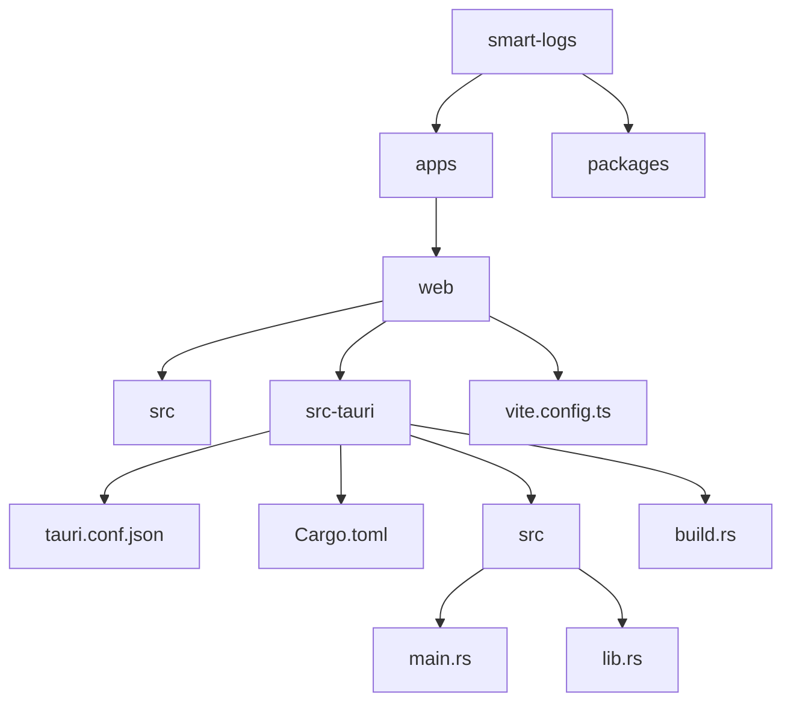
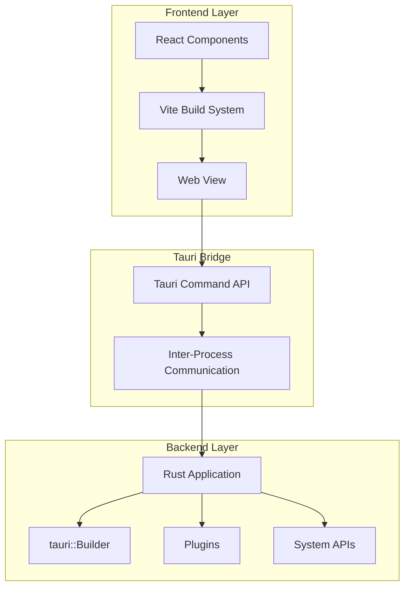
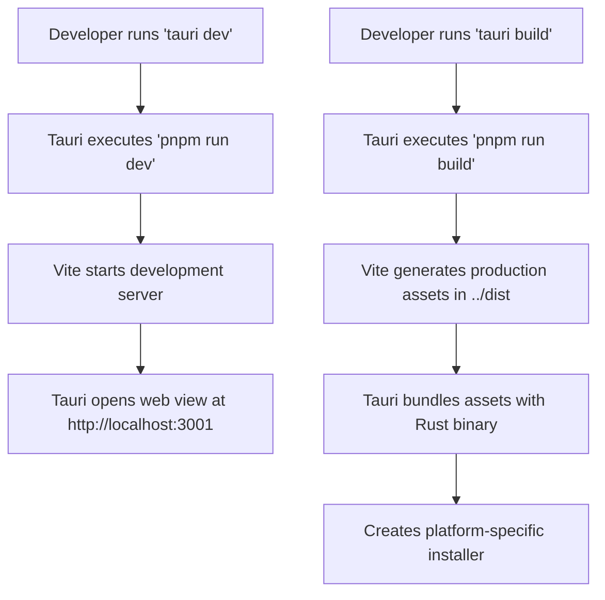
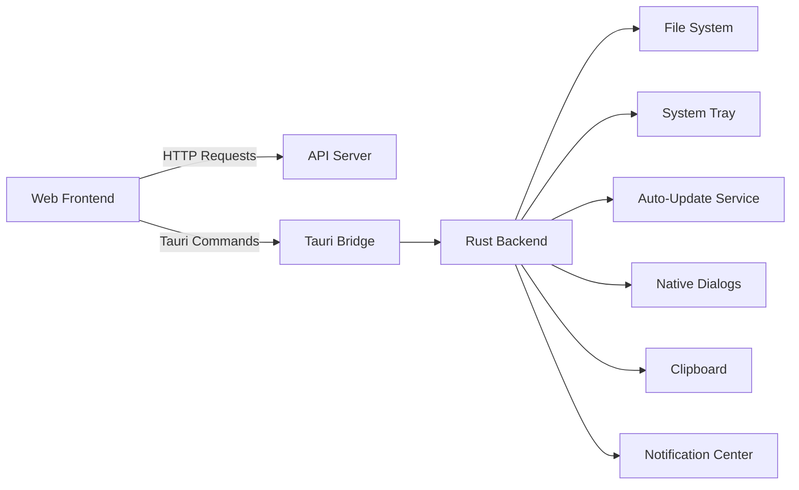
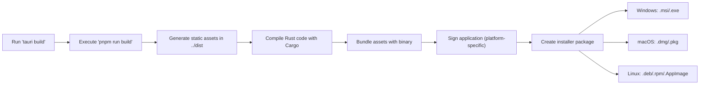

# Desktop Application Packaging

<cite>
**Referenced Files in This Document**   
- [tauri.conf.json](file://apps/web/src-tauri/tauri.conf.json)
- [Cargo.toml](file://apps/web/src-tauri/Cargo.toml)
- [vite.config.ts](file://apps/web/vite.config.ts)
- [main.rs](file://apps/web/src-tauri/src/main.rs)
- [lib.rs](file://apps/web/src-tauri/src/lib.rs)
- [build.rs](file://apps/web/src-tauri/build.rs)
- [pnpm-lock.yaml](file://pnpm-lock.yaml)
</cite>

## Table of Contents
1. [Introduction](#introduction)
2. [Project Structure](#project-structure)
3. [Core Components](#core-components)
4. [Architecture Overview](#architecture-overview)
5. [Integration Between Vite and Tauri Build Processes](#integration-between-vite-and-tauri-build-processes)
6. [Tauri Configuration Analysis](#tauri-configuration-analysis)
7. [Rust-Based Backend Setup](#rust-based-backend-setup)
8. [Technical Decision: Tauri vs Electron](#technical-decision-tauri-vs-electron)
9. [Infrastructure Requirements for Cross-Platform Builds](#infrastructure-requirements-for-cross-platform-builds)
10. [System Context Diagrams](#system-context-diagrams)
11. [Cross-Cutting Concerns](#cross-cutting-concerns)
12. [Technology Stack and Dependencies](#technology-stack-and-dependencies)
13. [Distribution Packaging Process](#distribution-packaging-process)

## Introduction
This document provides comprehensive architectural documentation for packaging a web application as a desktop application using the Tauri framework. The application, named "smart-logs", is built with modern frontend tooling (Vite, React, Tailwind CSS) and packaged into a lightweight, secure desktop application using Tauri. This document details the integration between the frontend build system and Tauri's Rust-based backend, configuration files, technical decisions, platform-specific build requirements, and cross-cutting concerns such as file system access and auto-updates.

## Project Structure
The project follows a monorepo structure managed with pnpm workspaces, containing multiple applications and shared packages. The desktop application packaging is centered in the `apps/web` directory, specifically within the `src-tauri` subdirectory, which contains all Tauri-specific configuration and Rust code.



**Diagram sources**
- [tauri.conf.json](file://apps/web/src-tauri/tauri.conf.json)
- [Cargo.toml](file://apps/web/src-tauri/Cargo.toml)
- [main.rs](file://apps/web/src-tauri/src/main.rs)
- [lib.rs](file://apps/web/src-tauri/src/lib.rs)
- [build.rs](file://apps/web/src-tauri/build.rs)
- [vite.config.ts](file://apps/web/vite.config.ts)

**Section sources**
- [tauri.conf.json](file://apps/web/src-tauri/tauri.conf.json)
- [Cargo.toml](file://apps/web/src-tauri/Cargo.toml)

## Core Components
The core components of the desktop application packaging system include:
- **Vite**: Frontend build tool responsible for bundling and optimizing the web application
- **Tauri**: Framework for creating lightweight desktop applications using web technologies
- **Rust**: Backend language providing system-level capabilities and security
- **tauri.conf.json**: Configuration file defining application metadata, build settings, and window properties
- **Cargo.toml**: Rust package manifest defining dependencies and build configuration

These components work together to compile the frontend assets, package them with a minimal web view, and provide secure access to native system functionality.

**Section sources**
- [tauri.conf.json](file://apps/web/src-tauri/tauri.conf.json)
- [Cargo.toml](file://apps/web/src-tauri/Cargo.toml)
- [vite.config.ts](file://apps/web/vite.config.ts)

## Architecture Overview
The architecture follows a hybrid model where the user interface is rendered in a web view (WebView2 on Windows, WKWebView on macOS, WebKitGTK on Linux) while native system interactions are handled by a Rust backend. The frontend communicates with the backend through a secure, typed API using Tauri's command system.



**Diagram sources**
- [main.rs](file://apps/web/src-tauri/src/main.rs)
- [lib.rs](file://apps/web/src-tauri/src/lib.rs)
- [tauri.conf.json](file://apps/web/src-tauri/tauri.conf.json)

## Integration Between Vite and Tauri Build Processes
The integration between Vite and Tauri is configured through the `tauri.conf.json` file, which specifies the build commands and output directories. During development, Tauri starts the Vite dev server, and in production, it runs the Vite build process to generate static assets.

### Build Process Flow


The `vite.config.ts` file configures the Vite build process with plugins for React, Tailwind CSS, TanStack Router, and PWA support. The Tauri configuration specifies that the frontend distribution directory is `../dist` relative to the `src-tauri` folder.

**Section sources**
- [tauri.conf.json](file://apps/web/src-tauri/tauri.conf.json#L6-L12)
- [vite.config.ts](file://apps/web/vite.config.ts#L1-L40)

## Tauri Configuration Analysis
The `tauri.conf.json` file contains essential configuration for the desktop application:

```json
{
  "productName": "smart-logs",
  "version": "0.1.0",
  "identifier": "com.tauri.dev",
  "build": {
    "frontendDist": "../dist",
    "devUrl": "http://localhost:3001",
    "beforeDevCommand": "pnpm run dev",
    "beforeBuildCommand": "pnpm run build"
  },
  "app": {
    "windows": [
      {
        "title": "smart-logs",
        "width": 800,
        "height": 600,
        "resizable": true,
        "fullscreen": false
      }
    ],
    "security": {
      "csp": null
    }
  },
  "bundle": {
    "active": true,
    "targets": "all",
    "icon": [
      "icons/32x32.png",
      "icons/128x128.png",
      "icons/128x128@2x.png",
      "icons/icon.icns",
      "icons/icon.ico"
    ]
  }
}
```

### Key Configuration Parameters
- **build.frontendDist**: Specifies the output directory of the Vite build process
- **build.devUrl**: Development server URL used during `tauri dev`
- **build.beforeDevCommand**: Command to start the Vite development server
- **build.beforeBuildCommand**: Command to build the production assets
- **app.windows**: Window configuration including size, title, and resize behavior
- **bundle.targets**: Set to "all" to build for all supported platforms
- **bundle.icon**: Array of icon files for different platforms and resolutions

**Section sources**
- [tauri.conf.json](file://apps/web/src-tauri/tauri.conf.json#L1-L36)

## Rust-Based Backend Setup
The Rust backend is structured with two primary files: `main.rs` and `lib.rs`. The `main.rs` file serves as the entry point, while `lib.rs` contains the application logic.

### main.rs
```rust
// Prevents additional console window on Windows in release, DO NOT REMOVE!!
#![cfg_attr(not(debug_assertions), windows_subsystem = "windows")]

fn main() {
  app_lib::run();
}
```

This file includes a Windows-specific attribute to prevent an additional console window from appearing in release builds. The `main` function simply calls the `run` function from the `app_lib` crate.

### lib.rs
```rust
#[cfg_attr(mobile, tauri::mobile_entry_point)]
pub fn run() {
  tauri::Builder::default()
    .setup(|app| {
      if cfg!(debug_assertions) {
        app.handle().plugin(
          tauri_plugin_log::Builder::default()
            .level(log::LevelFilter::Info)
            .build(),
        )?;
      }
      Ok(())
    })
    .run(tauri::generate_context!())
    .expect("error while running tauri application");
}
```

The `run` function creates a Tauri application builder, configures it with a logging plugin in debug mode, and starts the application. The `tauri_plugin_log` is conditionally enabled when debug assertions are active, providing logging capabilities during development.

### Cargo.toml
The `Cargo.toml` file defines the Rust project configuration:

```toml
[package]
name = "app"
version = "0.1.0"
edition = "2021"
rust-version = "1.77.2"

[lib]
name = "app_lib"
crate-type = ["staticlib", "cdylib", "rlib"]

[build-dependencies]
tauri-build = { version = "2.3.0", features = [] }

[dependencies]
serde_json = "1.0"
serde = { version = "1.0", features = ["derive"] }
log = "0.4"
tauri = { version = "2.6.2", features = [] }
tauri-plugin-log = "2"
```

The configuration specifies:
- Rust 2021 edition with version 1.77.2
- A library named `app_lib` with multiple crate types for different linking scenarios
- `tauri-build` as a build dependency for code generation
- Core dependencies including Tauri itself and the logging plugin

**Section sources**
- [main.rs](file://apps/web/src-tauri/src/main.rs#L1-L6)
- [lib.rs](file://apps/web/src-tauri/src/lib.rs#L1-L16)
- [Cargo.toml](file://apps/web/src-tauri/Cargo.toml#L1-L25)

## Technical Decision: Tauri vs Electron
The decision to use Tauri instead of Electron was likely driven by several key advantages in security, performance, and application size.

### Security Benefits
Tauri provides enhanced security through:
- **Minimal attack surface**: Unlike Electron which bundles a full Chromium browser, Tauri uses the system's native web view
- **Default security posture**: Tauri disables Node.js integration by default and requires explicit permission for system access
- **Rust memory safety**: The backend is written in Rust, which eliminates entire classes of memory-related vulnerabilities
- **Capability-based security**: Tauri uses a capability system to restrict what the frontend can access

The configuration shows `"csp": null`, indicating that Content Security Policy is not explicitly set, but Tauri's default security model still provides better isolation than Electron's permissive defaults.

### Performance Benefits
Tauri offers significant performance advantages:
- **Smaller bundle size**: Tauri applications are typically 3-5MB, compared to Electron's 50-100MB baseline
- **Lower memory usage**: By leveraging the system web view, Tauri avoids duplicating browser processes
- **Faster startup**: Applications launch more quickly due to smaller binary size
- **Native performance**: Rust backend provides high-performance system operations

The `pnpm-lock.yaml` shows Tauri CLI binaries for multiple platforms, confirming that the application is designed to be compiled to native code for each target platform.

**Section sources**
- [tauri.conf.json](file://apps/web/src-tauri/tauri.conf.json#L28-L30)
- [Cargo.toml](file://apps/web/src-tauri/Cargo.toml#L20-L24)
- [pnpm-lock.yaml](file://pnpm-lock.yaml#L5478-L5544)

## Infrastructure Requirements for Cross-Platform Builds
Building the application for different platforms requires specific infrastructure:

### Windows
- **Build environment**: Windows machine or Windows Subsystem for Linux (WSL)
- **Compiler**: Microsoft Visual C++ build tools (MSVC)
- **Target specification**: `x64` or `ia32` architecture with `msvc` toolchain
- **Dependencies**: .NET Framework for installer creation

### macOS
- **Build environment**: macOS machine (required due to code signing and notarization)
- **Compiler**: Apple Clang
- **Target specification**: `x64` or `arm64` architecture
- **Dependencies**: Xcode command line tools, Apple Developer account for code signing

### Linux
- **Build environment**: Linux machine or Docker container
- **Compiler**: GCC or Clang
- **Target specification**: Multiple variants including `gnu` and `musl` for different distributions
- **Dependencies**: Standard build tools, package managers for creating distribution-specific packages (deb, rpm, etc.)

The `pnpm-lock.yaml` file shows Tauri CLI binaries for all major platforms, indicating that the build system supports cross-platform compilation:

```yaml
'@tauri-apps/cli-darwin-arm64@2.6.2'
'@tauri-apps/cli-darwin-x64@2.6.2'
'@tauri-apps/cli-linux-arm-gnueabihf@2.6.2'
'@tauri-apps/cli-linux-arm64-gnu@2.6.2'
'@tauri-apps/cli-linux-x64-gnu@2.6.2'
'@tauri-apps/cli-win32-x64-msvc@2.6.2'
```

**Section sources**
- [pnpm-lock.yaml](file://pnpm-lock.yaml#L5478-L5544)

## System Context Diagrams
### Web View and Native System Interactions


This diagram shows how the web frontend interacts with both remote services (API server) and local system resources through the Tauri bridge. The Rust backend acts as a secure intermediary, validating and executing requests to native system capabilities.

**Diagram sources**
- [lib.rs](file://apps/web/src-tauri/src/lib.rs#L1-L16)
- [tauri.conf.json](file://apps/web/src-tauri/tauri.conf.json)

## Cross-Cutting Concerns
### File System Access
Tauri provides secure file system access through its API, requiring explicit permissions in the `tauri.conf.json` file. The current configuration does not show specific file system permissions, indicating that access would need to be explicitly enabled.

### System Tray Integration
System tray integration is not configured in the current `tauri.conf.json`, but Tauri supports this feature through plugins. Implementation would require adding tray configuration and handling events in the Rust backend.

### Auto-Updates
Auto-update functionality is not configured in the current setup. Tauri supports auto-updates through its updater plugin, which would require:
- Configuring update endpoints in `tauri.conf.json`
- Implementing update logic in the Rust backend
- Setting up a server to host update packages and signatures

The `bundle.targets` is set to "all", which enables the bundling process but does not automatically configure auto-updates.

**Section sources**
- [tauri.conf.json](file://apps/web/src-tauri/tauri.conf.json)

## Technology Stack and Dependencies
### Frontend Stack
- **Framework**: React
- **Build Tool**: Vite
- **Styling**: Tailwind CSS
- **Routing**: TanStack Router
- **PWA Support**: Vite Plugin PWA

### Desktop Packaging Stack
- **Framework**: Tauri 2.6.2
- **Backend Language**: Rust 1.77.2
- **Build Tool**: Cargo
- **CLI**: Tauri CLI 2.6.2

### Key Dependencies
- **tauri**: Core framework for desktop application creation
- **tauri-plugin-log**: Logging plugin for development debugging
- **tauri-build**: Build-time dependency for code generation
- **serde**: Serialization framework for data exchange between Rust and JavaScript
- **log**: Logging facade for Rust

The dependency tree is minimal, focusing on essential functionality, which aligns with Tauri's philosophy of being lightweight and secure.

**Section sources**
- [Cargo.toml](file://apps/web/src-tauri/Cargo.toml)
- [vite.config.ts](file://apps/web/vite.config.ts)
- [pnpm-lock.yaml](file://pnpm-lock.yaml)

## Distribution Packaging Process
The distribution packaging process follows these steps:



The process begins with building the frontend assets using Vite, followed by compiling the Rust code and linking it with the web assets. The final step creates platform-specific installers that can be distributed to end users.

The `tauri.conf.json` file enables bundling with `"active": true` and targets all platforms with `"targets": "all"`, ensuring that the build process generates packages for Windows, macOS, and Linux.

**Section sources**
- [tauri.conf.json](file://apps/web/src-tauri/tauri.conf.json#L31-L36)
- [build.rs](file://apps/web/src-tauri/build.rs#L1-L2)