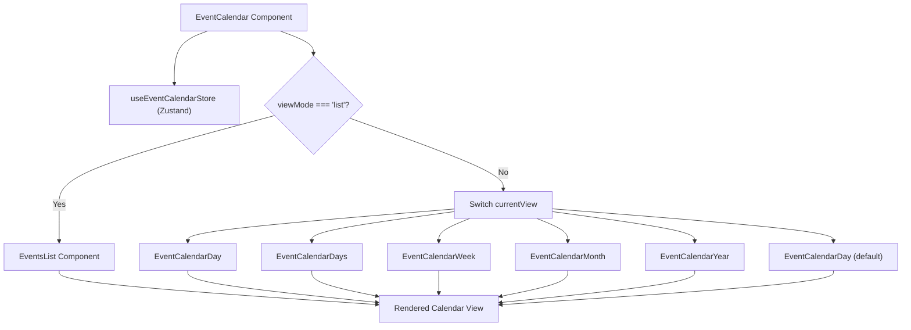
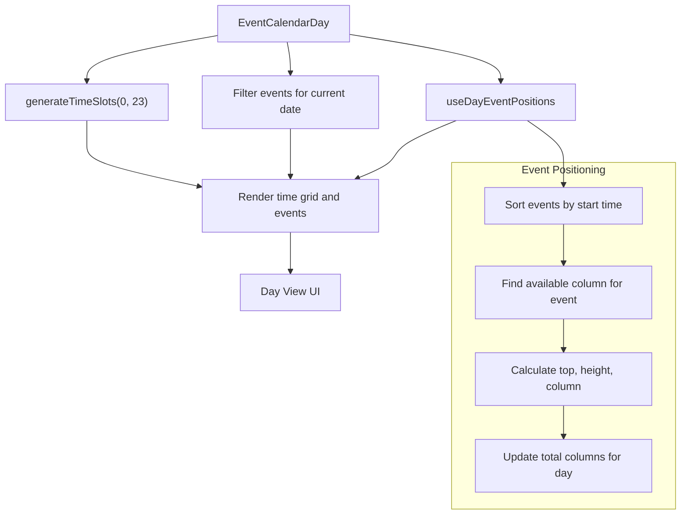
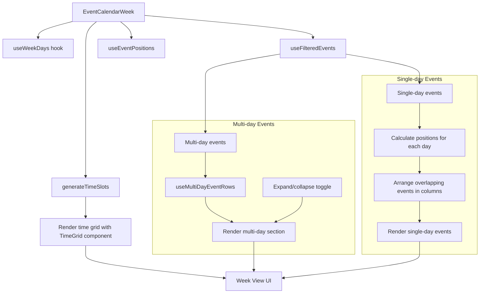
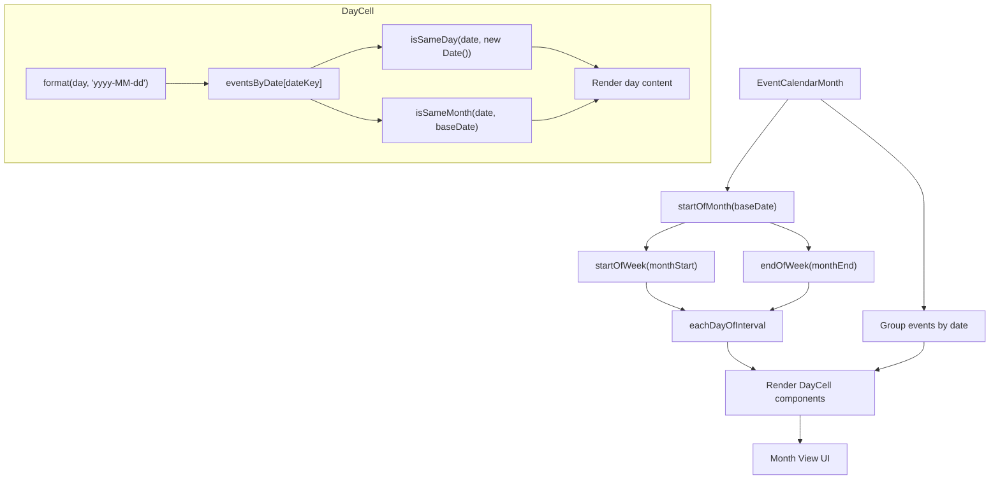
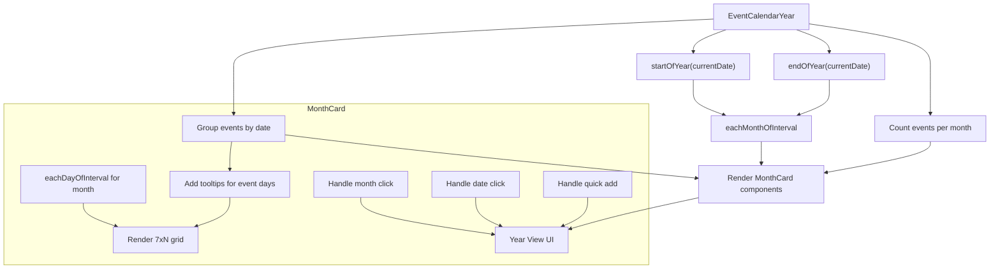
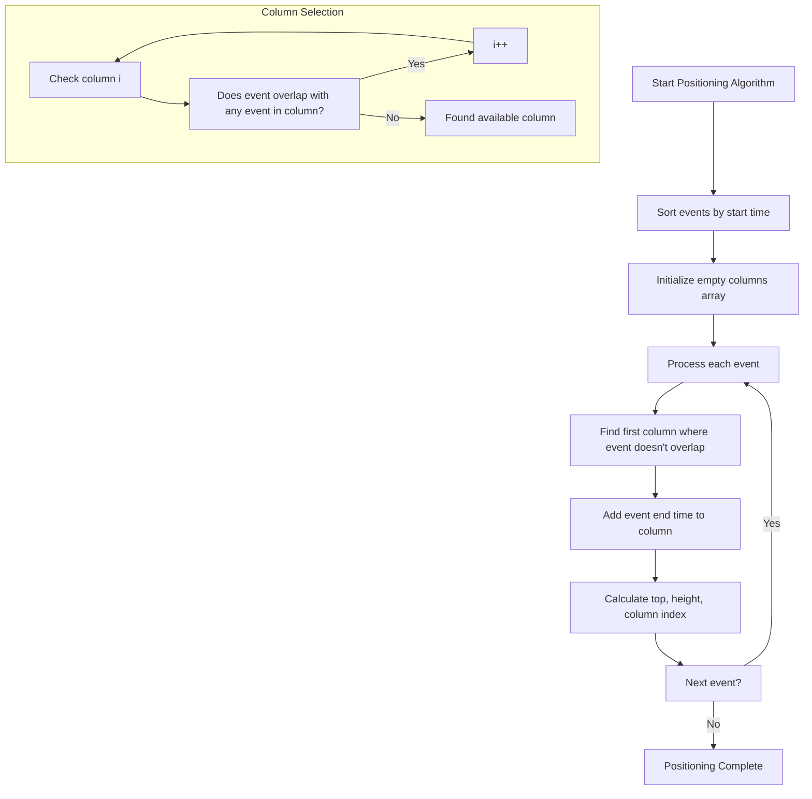
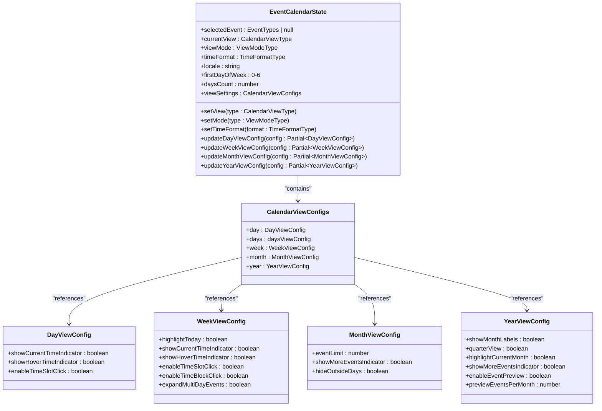

# Core Calendar Views

<cite>
**Referenced Files in This Document**   
- [event-calendar.tsx](file://apps/web/src/components/event-calendar/event-calendar.tsx)
- [event-calendar-day.tsx](file://apps/web/src/components/event-calendar/event-calendar-day.tsx)
- [event-calendar-week.tsx](file://apps/web/src/components/event-calendar/event-calendar-week.tsx)
- [event-calendar-month.tsx](file://apps/web/src/components/event-calendar/event-calendar-month.tsx)
- [event-calendar-year.tsx](file://apps/web/src/components/event-calendar/event-calendar-year.tsx)
- [use-event.ts](file://apps/web/src/hooks/use-event.ts)
- [date.ts](file://apps/web/src/lib/date.ts)
- [event.ts](file://apps/web/src/lib/event.ts)
- [event.ts](file://apps/web/src/types/event.ts)
- [time-grid.tsx](file://apps/web/src/components/event-calendar/ui/time-grid.tsx)
- [day-cell.tsx](file://apps/web/src/components/event-calendar/ui/day-cell.tsx)
- [month-card.tsx](file://apps/web/src/components/event-calendar/ui/month-card.tsx)
</cite>

## Table of Contents
1. [Introduction](#introduction)
2. [Main Calendar View Orchestration](#main-calendar-view-orchestration)
3. [Day View Implementation](#day-view-implementation)
4. [Week View Implementation](#week-view-implementation)
5. [Month View Implementation](#month-view-implementation)
6. [Year View Implementation](#year-view-implementation)
7. [Time Grid and Event Positioning Logic](#time-grid-and-event-positioning-logic)
8. [State Management and Configuration](#state-management-and-configuration)
9. [Performance Considerations](#performance-considerations)

## Introduction
The Core Calendar Views system provides a comprehensive calendar interface with multiple view modes (day, week, month, year) for managing and displaying events. The implementation uses React with Zustand for state management, leveraging conditional rendering to display the appropriate view based on user selection. Each view mode has its own layout strategy, time grid calculations, and event positioning logic to provide an optimal user experience across different time scales.

**Section sources**
- [event-calendar.tsx](file://apps/web/src/components/event-calendar/event-calendar.tsx)

## Main Calendar View Orchestration

The EventCalendar component serves as the main orchestrator for all calendar views, managing view mode selection and rendering the appropriate component based on state. It uses Zustand's `useEventCalendarStore` hook to access the current view mode, view type, and other configuration settings.

The component implements conditional rendering through a `renderCalendarView` function that returns different components based on the current view mode and view type. When in list mode, it displays the EventsList component. For calendar views, it switches between day, days, week, month, and year views based on the `currentView` state.

**Diagram sources**
- [event-calendar.tsx](file://apps/web/src/components/event-calendar/event-calendar.tsx#L24-L64)

**Section sources**
- [event-calendar.tsx](file://apps/web/src/components/event-calendar/event-calendar.tsx)

## Day View Implementation

The EventCalendarDay component implements a detailed hourly view of a single day, displaying events in a time grid format. It uses a fixed height of 64 pixels per hour (HOUR_HEIGHT) to maintain consistent spacing across the timeline.

The component generates time slots using the `generateTimeSlots` utility function, creating slots from 00:00 to 23:00. Events are positioned using the `useDayEventPositions` hook, which calculates the top position and height based on start and end times. Events that overlap are arranged in columns to prevent visual overlap, with the total number of columns determining the width percentage for each event.

The day view includes interactive features such as hover time indicators and current time indicators. When a user hovers over a time slot, the `handlePreciseHover` function calculates the exact minute within the hour based on cursor position. Clicking on a time slot opens a quick add dialog for creating new events.

**Diagram sources**
- [event-calendar-day.tsx](file://apps/web/src/components/event-calendar/event-calendar-day.tsx#L27-L159)

**Section sources**
- [event-calendar-day.tsx](file://apps/web/src/components/event-calendar/event-calendar-day.tsx)

## Week View Implementation

The EventCalendarWeek component provides a comprehensive view of an entire week, displaying events across seven days with a shared time grid. It uses the same 64-pixel hour height as the day view but extends the layout horizontally across multiple days.

The component separates events into single-day and multi-day categories using the `useFilteredEvents` hook. Multi-day events are displayed in a dedicated section at the top of the view, with expandable rows to handle overlapping events. The `useMultiDayEventRows` hook calculates the row position for each multi-day event to prevent visual overlap.

For single-day events, the `useEventPositions` hook calculates positions across all days in the week. The time grid is implemented using the TimeGrid component, which renders clickable time blocks that can be used to create new events. The week view also includes weekday headers with week numbers and day names, supporting localization through the `getLocaleFromCode` function.

**Diagram sources**
- [event-calendar-week.tsx](file://apps/web/src/components/event-calendar/event-calendar-week.tsx)

**Section sources**
- [event-calendar-week.tsx](file://apps/web/src/components/event-calendar/event-calendar-week.tsx)

## Month View Implementation

The EventCalendarMonth component implements a grid-based view of an entire month, with days arranged in a 7-column layout. It uses date-fns functions to calculate the visible days in the month, including days from the previous and next months that fall within the first and last weeks.

Events are grouped by date using the `eventsGroupedByDate` memoized value, which creates a lookup object with date strings as keys. Each day cell is rendered by the DayCell component, which displays the day number and up to one event preview. When multiple events exist for a day, a "more" indicator is shown that opens a dialog with all events for that day.

The month view supports keyboard navigation and screen readers through proper ARIA attributes. The `onKeyDown` handler allows users to activate the quick add dialog by pressing Enter or Space. The component also highlights the current day and handles focus states for accessibility.

**Diagram sources**
- [event-calendar-month.tsx](file://apps/web/src/components/event-calendar/event-calendar-month.tsx)

**Section sources**
- [event-calendar-month.tsx](file://apps/web/src/components/event-calendar/event-calendar-month.tsx)

## Year View Implementation

The EventCalendarYear component provides a high-level overview of an entire year, displaying all twelve months in a grid layout. It uses the `eachMonthOfInterval` function to generate an array of month dates from January to December of the current year.

Events are grouped by date using the `eventsByDate` memoized value, similar to the month view. Each month is rendered as a MonthCard component that displays a mini calendar with day cells. The component calculates the number of events per month to show summary information.

The year view supports multiple interaction patterns: clicking on a month navigates to the month view, clicking on a date with events opens a dialog showing those events, and clicking on an empty date opens a quick add dialog. The MonthCard component uses tooltips to show event counts when hovering over days.

**Diagram sources**
- [event-calendar-year.tsx](file://apps/web/src/components/event-calendar/event-calendar-year.tsx)

**Section sources**
- [event-calendar-year.tsx](file://apps/web/src/components/event-calendar/event-calendar-year.tsx)

## Time Grid and Event Positioning Logic

The calendar system uses a consistent approach to time grid calculations and event positioning across different views. The `generateTimeSlots` function in date.ts creates an array of Date objects at specified intervals between start and end hours. This function is used by both day and week views to create the time grid.

Event positioning is handled by specialized hooks in event.ts. The `useDayEventPositions` hook calculates positions for events in the day view, while `useEventPositions` handles positioning for the week view. Both hooks use a similar algorithm: events are sorted by start time, then assigned to columns where they don't overlap with previously positioned events.

The positioning algorithm works by maintaining an array of columns, where each column contains the end times of events already positioned in that column. When positioning a new event, the algorithm finds the first column where the event's start time is after all end times in that column. This ensures that overlapping events are placed in different columns while minimizing the total number of columns needed.

**Diagram sources**
- [date.ts](file://apps/web/src/lib/date.ts#L150-L180)
- [event.ts](file://apps/web/src/lib/event.ts#L200-L300)

**Section sources**
- [date.ts](file://apps/web/src/lib/date.ts)
- [event.ts](file://apps/web/src/lib/event.ts)

## State Management and Configuration

The calendar system uses Zustand for state management, with the `useEventCalendarStore` providing a centralized store for all calendar-related state. The store is persisted to localStorage using the persist middleware, ensuring user preferences are maintained across sessions.

The store contains various configuration options organized by view type in the `viewSettings` object. Each view (day, week, month, year) has its own configuration interface with boolean flags for features like current time indicators, hover indicators, and time slot click functionality.

The state store also manages the current view mode (calendar or list), time format (12-hour or 24-hour), locale, and first day of the week. Action functions are provided to update these settings, with specific update functions for each view's configuration (e.g., `updateDayViewConfig`, `updateWeekViewConfig`).

**Diagram sources**
- [use-event.ts](file://apps/web/src/hooks/use-event.ts)
- [event.ts](file://apps/web/src/types/event.ts)

**Section sources**
- [use-event.ts](file://apps/web/src/hooks/use-event.ts)
- [event.ts](file://apps/web/src/types/event.ts)

## Performance Considerations

The calendar implementation includes several performance optimizations to handle large numbers of events efficiently. The use of React's `useMemo` and `useCallback` hooks ensures that expensive calculations are only performed when dependencies change.

For the day and week views, event positioning calculations are memoized based on the events array, days array, and hour height. This prevents recalculation when other state changes occur. The `useShallow` function from zustand/shallow is used to prevent unnecessary re-renders when only specific parts of the store change.

The month and year views use virtualization principles by only rendering visible content. The month view renders all days in the grid but limits event display to one preview per day, with additional events accessible via a dialog. The year view renders all twelve months but uses compact representations that only show essential information.

For very large event sets, additional virtualization could be implemented by only rendering visible portions of the time grid and using intersection observers to load content as users scroll. The current implementation assumes a reasonable number of events per day/week/month, but could be enhanced with windowing techniques for enterprise-scale data.

**Section sources**
- [event-calendar-day.tsx](file://apps/web/src/components/event-calendar/event-calendar-day.tsx)
- [event-calendar-week.tsx](file://apps/web/src/components/event-calendar/event-calendar-week.tsx)
- [event-calendar-month.tsx](file://apps/web/src/components/event-calendar/event-calendar-month.tsx)
- [event-calendar-year.tsx](file://apps/web/src/components/event-calendar/event-calendar-year.tsx)
- [event.ts](file://apps/web/src/lib/event.ts)