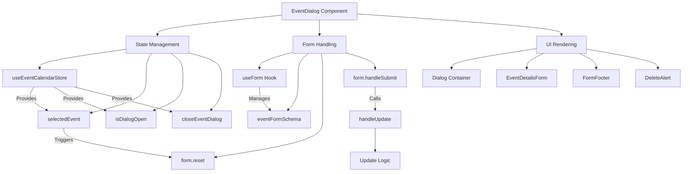
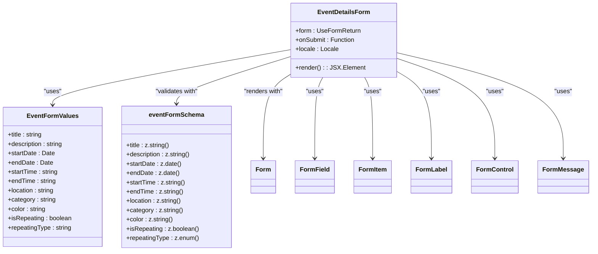
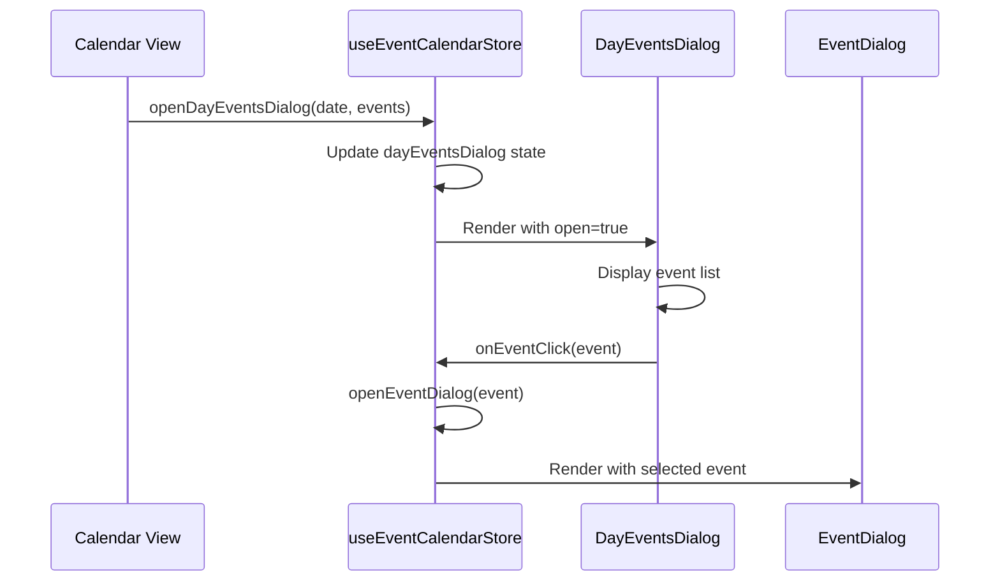
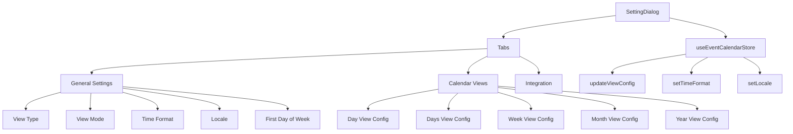
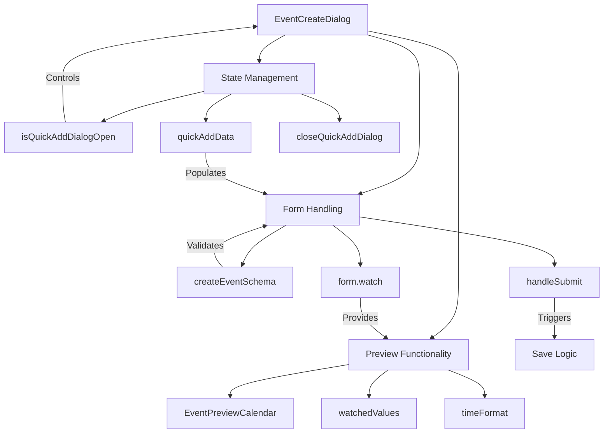
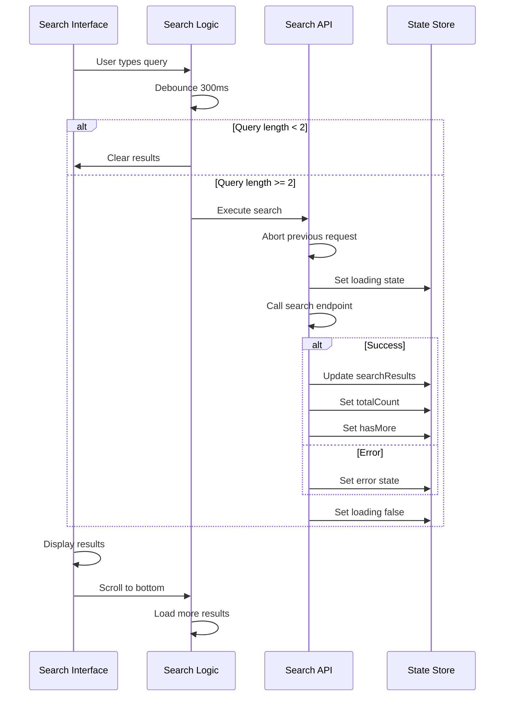
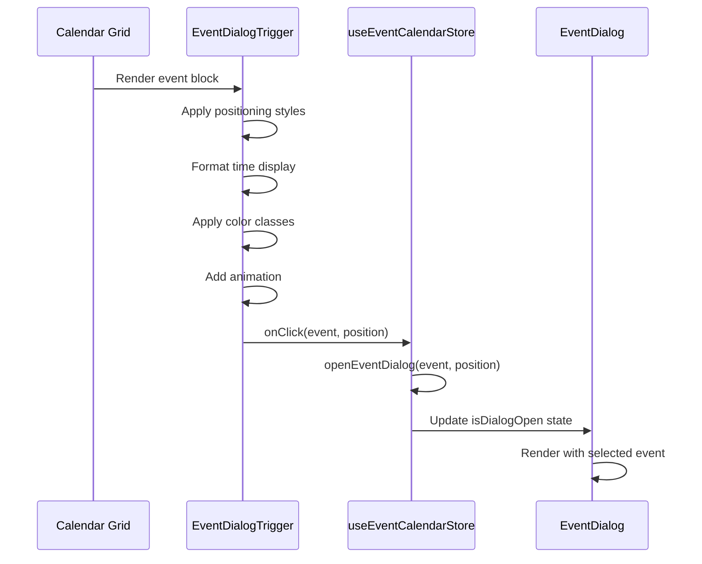
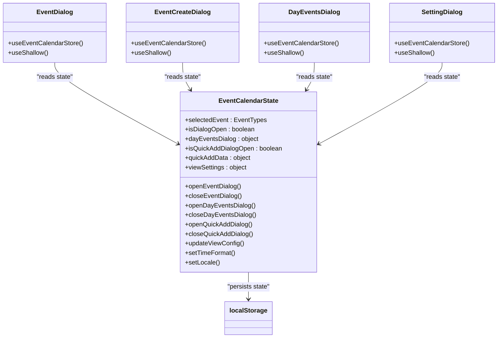

# Dialogs and Modals

<cite>
**Referenced Files in This Document**   
- [event-dialog.tsx](file://apps/web/src/components/event-calendar/event-dialog.tsx)
- [event-detail-form.tsx](file://apps/web/src/components/event-calendar/event-detail-form.tsx)
- [day-events-dialog.tsx](file://apps/web/src/components/event-calendar/day-events-dialog.tsx)
- [event-calendar-setting-dialog.tsx](file://apps/web/src/components/event-calendar/event-calendar-setting-dialog.tsx)
- [event-create-dialog.tsx](file://apps/web/src/components/event-calendar/event-create-dialog.tsx)
- [event-search-dialog.tsx](file://apps/web/src/components/event-calendar/event-search-dialog.tsx)
- [event-dialog-trigger.tsx](file://apps/web/src/components/event-calendar/event-dialog-trigger.tsx)
- [use-event.ts](file://apps/web/src/hooks/use-event.ts)
- [validations.ts](file://apps/web/src/lib/validations.ts)
</cite>

## Table of Contents
1. [Introduction](#introduction)
2. [Core Dialog Components](#core-dialog-components)
3. [EventDialog Architecture](#eventdialog-architecture)
4. [Form Integration and Validation](#form-integration-and-validation)
5. [Multiple Event Viewing System](#multiple-event-viewing-system)
6. [Calendar Settings Dialog](#calendar-settings-dialog)
7. [Event Creation Workflow](#event-creation-workflow)
8. [Event Search Functionality](#event-search-functionality)
9. [Dialog Triggering Mechanism](#dialog-triggering-mechanism)
10. [State Management System](#state-management-system)
11. [Accessibility and Responsive Design](#accessibility-and-responsive-design)

## Introduction
The Event Calendar system implements a comprehensive dialog and modal architecture for managing event-related interactions. This documentation details the implementation of various dialog components including event creation, editing, viewing, searching, and settings configuration. The system uses a centralized state management approach with zustand, React Hook Form for form handling, and a consistent UI pattern across all dialog types. The architecture supports different states (create, edit, view) within the same dialog components, providing a seamless user experience for calendar interactions.

## Core Dialog Components
The Event Calendar system features several specialized dialog components designed for specific use cases:

- **EventDialog**: Primary component for viewing and editing individual events
- **EventCreateDialog**: Dedicated dialog for creating new events with preview functionality
- **DayEventsDialog**: Displays all events for a specific date
- **SettingDialog**: Manages calendar preferences and view configurations
- **EventSearchDialog**: Enables searching across events with filtering capabilities

These components share a common design language and technical architecture, ensuring consistency in user experience and code maintainability.

**Section sources**
- [event-dialog.tsx](file://apps/web/src/components/event-calendar/event-dialog.tsx#L1-L145)
- [event-create-dialog.tsx](file://apps/web/src/components/event-calendar/event-create-dialog.tsx#L1-L131)
- [day-events-dialog.tsx](file://apps/web/src/components/event-calendar/day-events-dialog.tsx#L1-L93)

## EventDialog Architecture
The EventDialog component serves as the central interface for event details management, supporting create, edit, and view states through a unified interface.

**Diagram sources**
- [event-dialog.tsx](file://apps/web/src/components/event-calendar/event-dialog.tsx#L1-L145)

**Section sources**
- [event-dialog.tsx](file://apps/web/src/components/event-calendar/event-dialog.tsx#L1-L145)

## Form Integration and Validation
The event dialog system integrates with React Hook Form and Zod for comprehensive form handling and validation. The EventDetailsForm component serves as the shared interface for both event creation and editing workflows.

The validation schema enforces several business rules:
- Title, description, location, category, and color fields are required
- Start and end times must follow HH:MM format
- End time must be later than start time
- For repeating events, repeating type is required
- Date validation ensures endDate is after startDate when dates differ

**Diagram sources**
- [event-detail-form.tsx](file://apps/web/src/components/event-calendar/event-detail-form.tsx#L1-L215)
- [validations.ts](file://apps/web/src/lib/validations.ts#L1-L100)

**Section sources**
- [event-detail-form.tsx](file://apps/web/src/components/event-calendar/event-detail-form.tsx#L1-L215)
- [validations.ts](file://apps/web/src/lib/validations.ts#L1-L100)

## Multiple Event Viewing System
The DayEventsDialog component provides a dedicated interface for viewing all events on a specific date, allowing users to browse multiple events before selecting one for detailed viewing.

The component displays events in a scrollable list with proper formatting of time and event details. It includes an empty state when no events are scheduled for the selected date.

**Diagram sources**
- [day-events-dialog.tsx](file://apps/web/src/components/event-calendar/day-events-dialog.tsx#L1-L93)
- [use-event.ts](file://apps/web/src/hooks/use-event.ts#L1-L254)

**Section sources**
- [day-events-dialog.tsx](file://apps/web/src/components/event-calendar/day-events-dialog.tsx#L1-L93)

## Calendar Settings Dialog
The SettingDialog component provides a comprehensive interface for configuring calendar preferences and view settings through a tabbed interface.

The dialog uses a persistent state management system that saves user preferences across sessions. The tabbed interface organizes settings into logical groups, making configuration intuitive and accessible.

**Diagram sources**
- [event-calendar-setting-dialog.tsx](file://apps/web/src/components/event-calendar/event-calendar-setting-dialog.tsx#L1-L608)

**Section sources**
- [event-calendar-setting-dialog.tsx](file://apps/web/src/components/event-calendar/event-calendar-setting-dialog.tsx#L1-L608)

## Event Creation Workflow
The EventCreateDialog component implements a dual-pane interface with edit and preview tabs, allowing users to see how their event will appear in the calendar before saving.

The component supports quick add functionality, pre-populating the form with date and time information from the calendar interface. The preview tab renders a visual representation of the event using the current form values.

**Diagram sources**
- [event-create-dialog.tsx](file://apps/web/src/components/event-calendar/event-create-dialog.tsx#L1-L131)

**Section sources**
- [event-create-dialog.tsx](file://apps/web/src/components/event-calendar/event-create-dialog.tsx#L1-L131)

## Event Search Functionality
The EventSearchDialog component provides a debounced search interface with real-time results, allowing users to find events by title, description, location, or category.

The implementation includes several performance optimizations:
- 300ms debounce to prevent excessive API calls
- AbortController to cancel previous requests
- Loading states and error handling
- Infinite scroll with offset-based pagination
- Empty state management

**Diagram sources**
- [event-search-dialog.tsx](file://apps/web/src/components/event-calendar/event-search-dialog.tsx#L1-L238)

**Section sources**
- [event-search-dialog.tsx](file://apps/web/src/components/event-calendar/event-search-dialog.tsx#L1-L238)

## Dialog Triggering Mechanism
The EventDialogTrigger component handles the display and interaction of event representations within the calendar grid, serving as the primary entry point for the event dialog system.

The trigger component uses framer-motion for smooth entrance and exit animations and applies precise positioning based on the event's temporal and spatial properties within the calendar view.

**Diagram sources**
- [event-dialog-trigger.tsx](file://apps/web/src/components/event-calendar/event-dialog-trigger.tsx#L1-L70)
- [use-event.ts](file://apps/web/src/hooks/use-event.ts#L1-L254)

**Section sources**
- [event-dialog-trigger.tsx](file://apps/web/src/components/event-calendar/event-dialog-trigger.tsx#L1-L70)

## State Management System
The dialog system relies on a centralized zustand store for state management, ensuring consistent state across all dialog components and enabling persistence of user preferences.

The store uses the persist middleware to save key settings (view type, time format, locale, etc.) to localStorage, ensuring user preferences are maintained across sessions. The useShallow selector optimizes re-renders by only updating components when relevant state changes occur.

**Diagram sources**
- [use-event.ts](file://apps/web/src/hooks/use-event.ts#L1-L254)

**Section sources**
- [use-event.ts](file://apps/web/src/hooks/use-event.ts#L1-L254)

## Accessibility and Responsive Design
The dialog system implements comprehensive accessibility features and responsive design patterns to ensure usability across device sizes and assistive technologies.

Key accessibility features include:
- Proper ARIA labels and roles for all interactive elements
- Keyboard navigation support for dialog controls
- Focus management when dialogs open and close
- Semantic HTML structure with appropriate heading hierarchy
- High contrast color options for improved visibility

Responsive behaviors:
- Mobile-first design with touch-friendly targets
- Adaptive dialog sizing (full screen on mobile, fixed width on desktop)
- Flexible grid layouts that adjust to available space
- Scrollable content areas to prevent overflow
- Touch gesture support for swipe interactions

The system uses conditional rendering based on device size and implements proper focus trapping within dialogs to meet WCAG 2.1 standards.

**Section sources**
- [event-dialog.tsx](file://apps/web/src/components/event-calendar/event-dialog.tsx#L1-L145)
- [event-create-dialog.tsx](file://apps/web/src/components/event-calendar/event-create-dialog.tsx#L1-L131)
- [ui components](file://apps/web/src/components/ui)