# Event Calendar

<cite>
**Referenced Files in This Document**   
- [event-calendar.tsx](file://apps/web/src/components/event-calendar/event-calendar.tsx#L1-L65)
- [use-event.ts](file://apps/web/src/hooks/use-event.ts#L1-L253)
- [event.ts](file://apps/web/src/types/event.ts#L1-L121)
- [event-calendar-toolbar.tsx](file://apps/web/src/components/event-calendar/event-calendar-toolbar.tsx#L1-L209)
- [event-calendar-tabs.tsx](file://apps/web/src/components/event-calendar/event-calendar-tabs.tsx#L1-L199)
- [event-calendar-day.tsx](file://apps/web/src/components/event-calendar/event-calendar-day.tsx#L1-L160)
- [event-calendar-week.tsx](file://apps/web/src/components/event-calendar/event-calendar-week.tsx#L1-L288)
- [event-calendar-month.tsx](file://apps/web/src/components/event-calendar/event-calendar-month.tsx#L1-L123)
- [event-calendar-year.tsx](file://apps/web/src/components/event-calendar/event-calendar-year.tsx#L1-L96)
- [event-create-dialog.tsx](file://apps/web/src/components/event-calendar/event-create-dialog.tsx)
- [event-dialog.tsx](file://apps/web/src/components/event-calendar/event-dialog.tsx)
- [event-detail-form.tsx](file://apps/web/src/components/event-calendar/event-detail-form.tsx)
- [time-grid.tsx](file://apps/web/src/components/event-calendar/ui/time-grid.tsx)
</cite>

## Table of Contents
1. [Introduction](#introduction)
2. [Component Hierarchy](#component-hierarchy)
3. [State Management](#state-management)
4. [View Modes and Navigation](#view-modes-and-navigation)
5. [Daily View Implementation](#daily-view-implementation)
6. [Weekly View Implementation](#weekly-view-implementation)
7. [Monthly View Implementation](#monthly-view-implementation)
8. [Yearly View Implementation](#yearly-view-implementation)
9. [Event Creation and Editing](#event-creation-and-editing)
10. [Event Positioning and Layout](#event-positioning-and-layout)
11. [Accessibility and Keyboard Navigation](#accessibility-and-keyboard-navigation)
12. [Performance Considerations](#performance-considerations)
13. [Customization Options](#customization-options)
14. [Integration with Audit System](#integration-with-audit-system)

## Introduction

The Event Calendar component is a comprehensive multi-view calendar interface that supports day, week, month, and year views with drag-and-drop event creation and editing capabilities. Built using React with TypeScript, the component leverages Zustand for state management and integrates with the audit event system via tRPC. The calendar provides a responsive user interface with customizable view modes, time formatting, and event styling options.

The component is designed to handle various event types and supports filtering, searching, and navigation through time. It includes accessibility features and keyboard navigation patterns to ensure usability across different devices and user preferences.

**Section sources**
- [event-calendar.tsx](file://apps/web/src/components/event-calendar/event-calendar.tsx#L1-L65)

## Component Hierarchy

The Event Calendar follows a modular component architecture with a clear hierarchy. The main `EventCalendar` component serves as the container and orchestrator, managing the current view state and rendering the appropriate subcomponent based on the selected view mode.

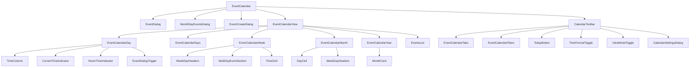

**Diagram sources**
- [event-calendar.tsx](file://apps/web/src/components/event-calendar/event-calendar.tsx#L1-L65)
- [event-calendar-day.tsx](file://apps/web/src/components/event-calendar/event-calendar-day.tsx#L1-L160)
- [event-calendar-week.tsx](file://apps/web/src/components/event-calendar/event-calendar-week.tsx#L1-L288)
- [event-calendar-month.tsx](file://apps/web/src/components/event-calendar/event-calendar-month.tsx#L1-L123)
- [event-calendar-year.tsx](file://apps/web/src/components/event-calendar/event-calendar-year.tsx#L1-L96)

**Section sources**
- [event-calendar.tsx](file://apps/web/src/components/event-calendar/event-calendar.tsx#L1-L65)
- [event-calendar-day.tsx](file://apps/web/src/components/event-calendar/event-calendar-day.tsx#L1-L160)
- [event-calendar-week.tsx](file://apps/web/src/components/event-calendar/event-calendar-week.tsx#L1-L288)

## State Management

The Event Calendar uses Zustand with the persist middleware for state management, providing a centralized store that maintains the calendar's state across sessions. The `useEventCalendarStore` hook manages various aspects of the calendar state including view mode, time format, locale, and event dialog states.

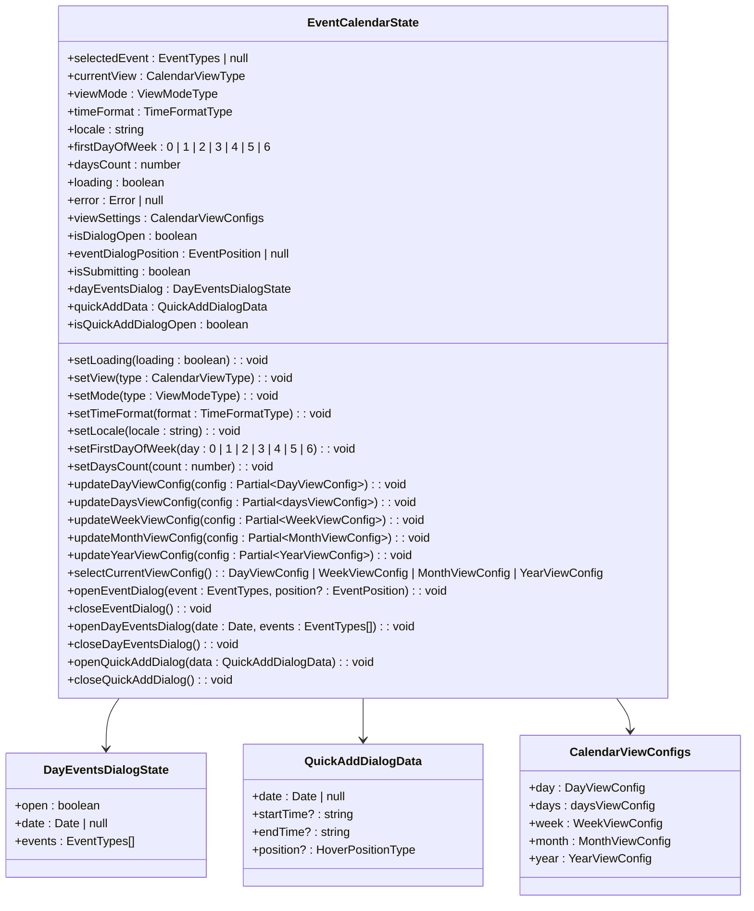

The state store persists key configuration settings such as the current view, time format, locale, and view settings, ensuring that user preferences are maintained between sessions. The store also manages dialog states for event creation, editing, and viewing, providing a consistent user experience.

**Diagram sources**
- [use-event.ts](file://apps/web/src/hooks/use-event.ts#L1-L253)

**Section sources**
- [use-event.ts](file://apps/web/src/hooks/use-event.ts#L1-L253)

## View Modes and Navigation

The Event Calendar supports multiple view modes including calendar and list views, with the ability to switch between different time-based views (day, days, week, month, year). The navigation system is implemented through the `EventCalendarToolbar` and `EventCalendarTabs` components, providing intuitive controls for moving through time and changing views.

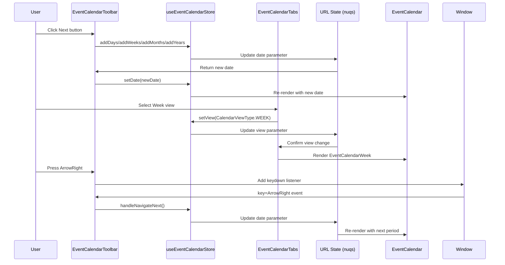

The toolbar provides navigation controls including previous/next buttons, a today button, and quick event creation. It also includes a date picker for direct date selection and toggle buttons for time format (12/24 hour) and view mode (calendar/list). Keyboard navigation is supported with left/right arrow keys for moving between periods.

**Diagram sources**
- [event-calendar-toolbar.tsx](file://apps/web/src/components/event-calendar/event-calendar-toolbar.tsx#L1-L209)
- [event-calendar-tabs.tsx](file://apps/web/src/components/event-calendar/event-calendar-tabs.tsx#L1-L199)

**Section sources**
- [event-calendar-toolbar.tsx](file://apps/web/src/components/event-calendar/event-calendar-toolbar.tsx#L1-L209)
- [event-calendar-tabs.tsx](file://apps/web/src/components/event-calendar/event-calendar-tabs.tsx#L1-L199)

## Daily View Implementation

The daily view displays events in a time-scheduled format with hour-by-hour breakdowns. The `EventCalendarDay` component renders a scrollable timeline with time slots and positioned event blocks. Each hour is represented by a 64px high row, providing a consistent visual rhythm.

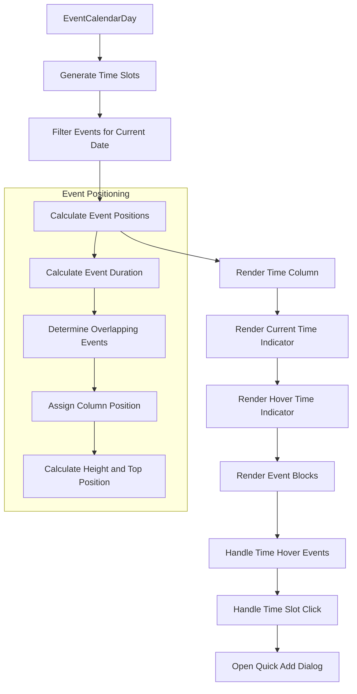

The daily view includes several interactive features:
- **Current Time Indicator**: A horizontal line that shows the current time position
- **Hover Time Indicator**: A line that follows the cursor to show potential event times
- **Time Slot Click**: Clicking on a time slot opens the quick add dialog for creating new events
- **Event Click**: Clicking on an event opens the event detail dialog

The view uses the `useDayEventPositions` hook to calculate the vertical position and height of each event based on its start and end times, ensuring accurate visual representation of event durations.

**Diagram sources**
- [event-calendar-day.tsx](file://apps/web/src/components/event-calendar/event-calendar-day.tsx#L1-L160)

**Section sources**
- [event-calendar-day.tsx](file://apps/web/src/components/event-calendar/event-calendar-day.tsx#L1-L160)

## Weekly View Implementation

The weekly view extends the daily view concept to display seven days of events in a grid format. The `EventCalendarWeek` component renders a more complex layout with multiple columns for days and special handling for multi-day events.

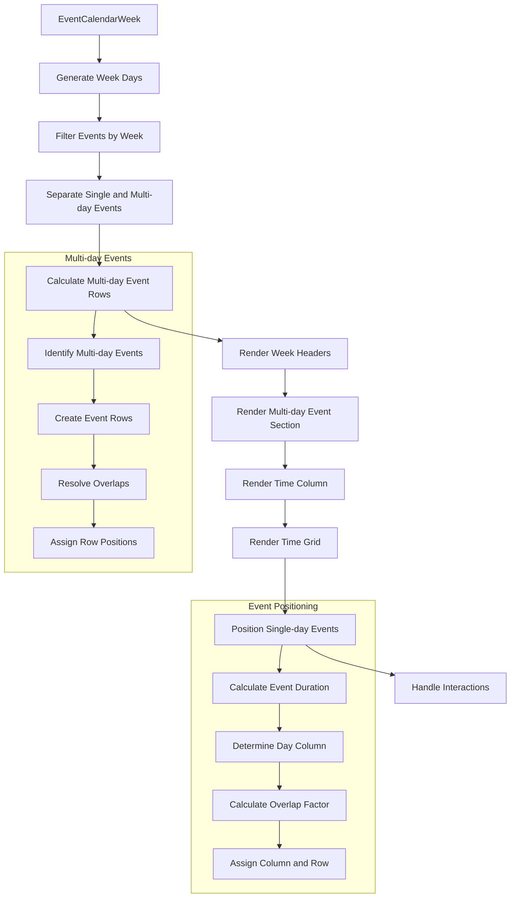

Key features of the weekly view include:
- **Multi-day Event Section**: A dedicated area at the top for events that span multiple days, with expand/collapse functionality
- **Column-based Layout**: Each day occupies approximately 14.28% of the width (100%/7 days)
- **Event Overlapping**: Events that overlap in time are displayed side-by-side with a 50% overlap factor to maximize space usage
- **Time Block Click**: Clicking on a specific time block opens the quick add dialog with pre-filled time values

The view uses several custom hooks including `useWeekDays` to generate the days of the week, `useFilteredEvents` to separate single-day and multi-day events, and `useMultiDayEventRows` to organize multi-day events into non-overlapping rows.

**Diagram sources**
- [event-calendar-week.tsx](file://apps/web/src/components/event-calendar/event-calendar-week.tsx#L1-L288)

**Section sources**
- [event-calendar-week.tsx](file://apps/web/src/components/event-calendar/event-calendar-week.tsx#L1-L288)

## Monthly View Implementation

The monthly view presents events in a traditional calendar grid format with days arranged in rows by week. The `EventCalendarMonth` component renders a grid of day cells, each containing events for that date.

```mermaid
flowchart TD
A[EventCalendarMonth] --> B[Calculate Visible Days]
B --> C[Group Events by Date]
C --> D[Render Week Headers]
D --> E[Render Day Cells]
E --> F[Handle Day Cell Interactions]
subgraph Visible Days Calculation
B1[Start of Month]
B1 --> B2[End of Month]
B2 --> B3[Start of Week (Grid Start)]
B3 --> B4[End of Week (Grid End)]
B4 --> B5[Generate All Days in Range]
B --> B1
end
subgraph Event Grouping
C1[Initialize Empty Groups]
C1 --> C2[Iterate Through Events]
C2 --> C3[Format Date as Key]
C3 --> C4[Add Event to Date Group]
C --> C1
end
subgraph Day Cell Interactions
F1[Quick Add Click]
F1 --> F2[Open Quick Add Dialog]
F2 --> F3[Pre-fill Date]
F4[Show Events Click]
F4 --> F5[Open Day Events Dialog]
F5 --> F6[Display All Events for Date]
F7[Event Click]
F7 --> F8[Open Event Detail Dialog]
end
```

The monthly view implements several important features:
- **Grid Layout**: A 7-column grid representing days of the week, with rows for each week in the month
- **Event Limiting**: Configurable event limit per day with a "more events" indicator when exceeded
- **Outside Days**: Option to hide days from previous/next months that fall within the current month's grid
- **Day Cell Interactions**: Clicking on a day cell allows quick event creation or viewing existing events

The component uses the `DayCell` subcomponent to render individual days, which handles event display, focusing, and interaction events. Events are grouped by date using the `eventsGroupedByDate` memoized value for efficient rendering.

**Diagram sources**
- [event-calendar-month.tsx](file://apps/web/src/components/event-calendar/event-calendar-month.tsx#L1-L123)

**Section sources**
- [event-calendar-month.tsx](file://apps/web/src/components/event-calendar/event-calendar-month.tsx#L1-L123)

## Yearly View Implementation

The yearly view provides an overview of events across all months in a year. The `EventCalendarYear` component renders a grid of month cards, each representing a month with event summaries.

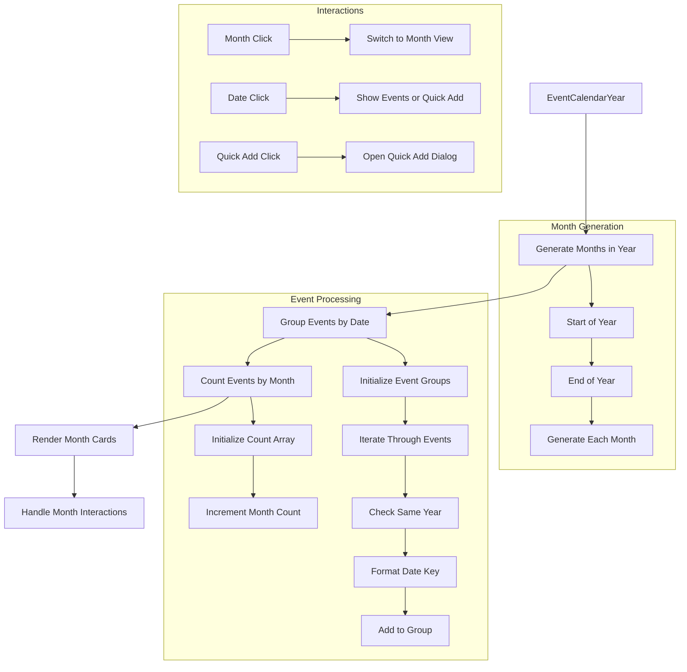

Key features of the yearly view include:
- **Month Cards**: Individual cards for each month displaying the month name and event count
- **Event Previews**: Option to show a limited number of events per month as previews
- **Quarter View**: Configurable option to group months into quarters
- **Month Navigation**: Clicking on a month card switches to the monthly view for that month

The view uses the `MonthCard` component to render each month, which displays the month name, event count, and optional event previews. The component supports both grid layouts (3x4 for months, 2x2 for quarters) and responsive design for different screen sizes.

**Diagram sources**
- [event-calendar-year.tsx](file://apps/web/src/components/event-calendar/event-calendar-year.tsx#L1-L96)

**Section sources**
- [event-calendar-year.tsx](file://apps/web/src/components/event-calendar/event-calendar-year.tsx#L1-L96)

## Event Creation and Editing

The Event Calendar provides multiple pathways for creating and editing events through various dialog components. The primary components involved in event creation are `EventCreateDialog`, `EventDialog`, and `EventDetailForm`.

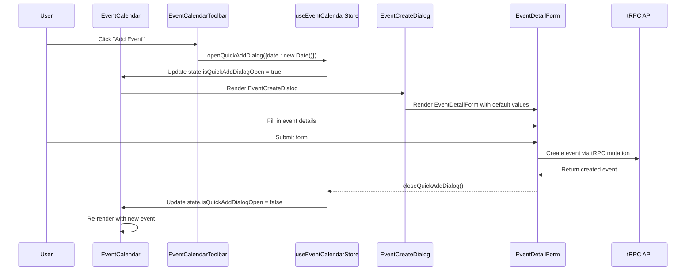

The event creation process supports several entry points:
- **Toolbar Button**: The "Add Event" button in the toolbar creates an event for the current date
- **Time Slot Click**: Clicking on a time slot in day/week views creates an event at that specific time
- **Day Cell Click**: Clicking on a day in month/year views creates an event for that date
- **Drag and Drop**: Future enhancement for creating events by dragging on the calendar

The `EventDetailForm` component provides a comprehensive form for entering event details including title, description, date/time, location, category, and color. It includes validation and error handling to ensure data integrity.

**Section sources**
- [event-create-dialog.tsx](file://apps/web/src/components/event-calendar/event-create-dialog.tsx)
- [event-dialog.tsx](file://apps/web/src/components/event-calendar/event-dialog.tsx)
- [event-detail-form.tsx](file://apps/web/src/components/event-calendar/event-detail-form.tsx)

## Event Positioning and Layout

The Event Calendar uses a sophisticated positioning system to accurately display events in their correct time and date locations across different views. The layout system varies by view type but follows consistent principles of time-to-pixel conversion and overlap management.

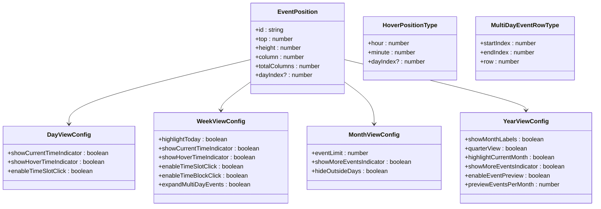

The positioning system uses several key parameters:
- **HOUR_HEIGHT**: 64 pixels per hour, providing a consistent scale across views
- **COLUMN_WIDTH_TOTAL**: 99.5% of available width, leaving space for scrollbars
- **DAY_WIDTH_PERCENT**: 100/7 ≈ 14.28% for week view columns
- **MULTI_DAY_ROW_HEIGHT**: 64 pixels for multi-day event rows

Different views use specialized hooks for positioning:
- **Day View**: `useDayEventPositions` calculates vertical position based on start time and height based on duration
- **Week View**: `useEventPositions` handles both vertical time positioning and horizontal day positioning
- **Month View**: Events are grouped by date and displayed in day cells with overflow handling
- **Year View**: Events are summarized by month with optional previews

**Diagram sources**
- [event.ts](file://apps/web/src/types/event.ts#L1-L121)
- [event-calendar-day.tsx](file://apps/web/src/components/event-calendar/event-calendar-day.tsx#L1-L160)
- [event-calendar-week.tsx](file://apps/web/src/components/event-calendar/event-calendar-week.tsx#L1-L288)

**Section sources**
- [event.ts](file://apps/web/src/types/event.ts#L1-L121)
- [event-calendar-day.tsx](file://apps/web/src/components/event-calendar/event-calendar-day.tsx#L1-L160)
- [event-calendar-week.tsx](file://apps/web/src/components/event-calendar/event-calendar-week.tsx#L1-L288)

## Accessibility and Keyboard Navigation

The Event Calendar implements comprehensive accessibility features to ensure usability for all users, including those using screen readers or keyboard navigation. The component follows WAI-ARIA guidelines and provides multiple navigation methods.

```mermaid
flowchart TD
A[Accessibility Features] --> B[Keyboard Navigation]
A --> C[Screen Reader Support]
A --> D[Focus Management]
A --> E[ARIA Attributes]
B --> B1[Arrow Keys: Navigate Between Periods]
B --> B2[Tab: Move Between Interactive Elements]
B --> B3[Enter/Space: Activate Buttons and Links]
B --> B4[Escape: Close Dialogs]
C --> C1[Semantic HTML Structure]
C --> C2[ARIA Labels and Roles]
C --> C3[Screen Reader Announcements]
C --> C4[Alternative Text for Icons]
D --> D1[Initial Focus on Calendar]
D --> D2[Maintain Focus in Dialogs]
D --> D3[Return Focus After Closing]
D --> D4[Visible Focus Indicators]
E --> E1[role="grid" for Calendar]
E --> E2[aria-label for Navigation]
E --> E3[aria-selected for Active Tabs]
E --> E4[aria-expanded for Expandable Sections]
```

Key accessibility features include:
- **Keyboard Navigation**: Full keyboard support with arrow keys for period navigation, tab for element navigation, and enter/space for activation
- **Screen Reader Support**: Proper ARIA attributes including roles, labels, and states to convey information to assistive technologies
- **Focus Management**: Logical focus order and management, especially within modal dialogs
- **Color Contrast**: Sufficient contrast between text and background colors
- **Responsive Design**: Adapts to different screen sizes and orientations

The toolbar includes a `TodayButton` component with proper ARIA labeling, and the `EventCalendarTabs` component uses `aria-selected` to indicate the active view. Dialogs use `aria-modal` and proper focus trapping to ensure accessibility.

**Section sources**
- [event-calendar-toolbar.tsx](file://apps/web/src/components/event-calendar/event-calendar-toolbar.tsx#L1-L209)
- [event-calendar-tabs.tsx](file://apps/web/src/components/event-calendar/event-calendar-tabs.tsx#L1-L199)
- [event-dialog.tsx](file://apps/web/src/components/event-calendar/event-dialog.tsx)

## Performance Considerations

The Event Calendar implements several performance optimizations to handle large datasets efficiently and maintain smooth user interactions. These optimizations focus on rendering efficiency, state management, and data processing.

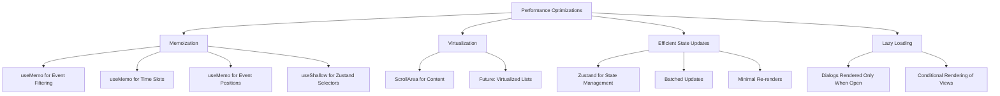

Key performance strategies include:
- **Memoization**: Extensive use of `useMemo` and `useCallback` to prevent unnecessary recalculations
- **Shallow State Selection**: Using `useShallow` from Zustand to avoid re-renders when only specific state properties change
- **Efficient Event Filtering**: Memoized filtering of events based on current date/view
- **Optimized Position Calculations**: Caching of event positions to avoid recalculation on every render
- **Conditional Rendering**: Only rendering the currently active view and dialogs when open

For large datasets, the calendar could be enhanced with virtualization techniques to only render visible events, reducing the DOM size and improving scroll performance. The current implementation uses React's `ScrollArea` component to provide smooth scrolling with optimized performance.

**Section sources**
- [event-calendar-day.tsx](file://apps/web/src/components/event-calendar/event-calendar-day.tsx#L1-L160)
- [event-calendar-week.tsx](file://apps/web/src/components/event-calendar/event-calendar-week.tsx#L1-L288)
- [event-calendar-month.tsx](file://apps/web/src/components/event-calendar/event-calendar-month.tsx#L1-L123)

## Customization Options

The Event Calendar provides extensive customization options through configuration settings and view-specific parameters. These options allow users to tailor the calendar to their preferences and needs.

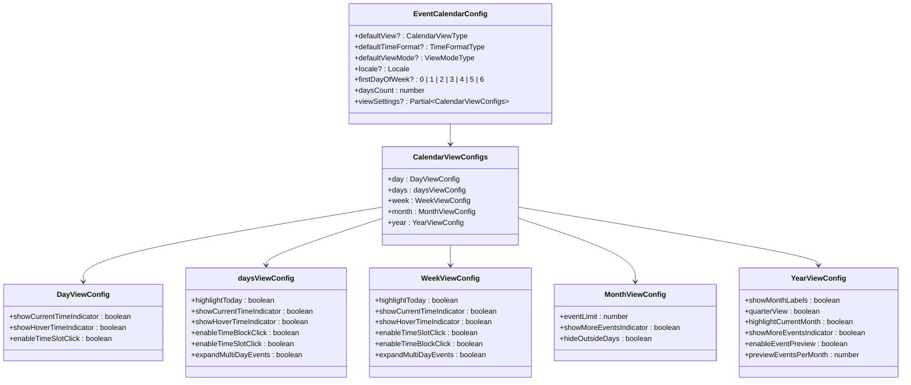

Customization options include:
- **View Configuration**: Default view, time format, and view mode settings
- **Localization**: Support for different locales and first day of week settings
- **Day View Settings**: Control over current time indicator, hover indicator, and time slot click behavior
- **Days View Settings**: Options for highlighting today, time indicators, and multi-day event expansion
- **Week View Settings**: Similar to days view with additional time block click functionality
- **Month View Settings**: Event limit per day, more events indicator, and outside days visibility
- **Year View Settings**: Month labels, quarter view, current month highlighting, and event previews

These settings are persisted using Zustand's persist middleware, ensuring that user preferences are maintained across sessions. The `CalendarSettingsDialog` component provides a user interface for modifying these settings.

**Diagram sources**
- [event.ts](file://apps/web/src/types/event.ts#L1-L121)
- [use-event.ts](file://apps/web/src/hooks/use-event.ts#L1-L253)

**Section sources**
- [event.ts](file://apps/web/src/types/event.ts#L1-L121)
- [use-event.ts](file://apps/web/src/hooks/use-event.ts#L1-L253)

## Integration with Audit System

The Event Calendar integrates with the audit event system through tRPC, enabling secure and type-safe communication between the frontend and backend. This integration allows for event creation, retrieval, updating, and deletion while maintaining audit trails.

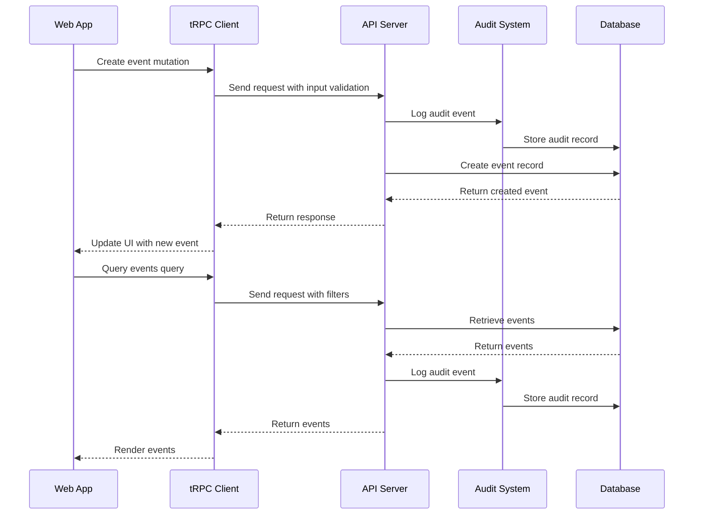

The integration architecture includes:
- **tRPC Endpoints**: Type-safe API endpoints for event operations
- **Audit Logging**: Automatic logging of all event-related operations
- **Input Validation**: Zod-based validation of event data
- **Error Handling**: Comprehensive error handling with user-friendly messages
- **Real-time Updates**: Potential for real-time updates using WebSockets or polling

The calendar uses the `utils/trpc.ts` file to establish the tRPC client connection and defines specific procedures for event operations in the server routers. This ensures type safety from the frontend through to the database layer.

**Section sources**
- [utils/trpc.ts](file://apps/web/src/utils/trpc.ts)
- [routers/events.ts](file://apps/server/src/routers/events.ts)
- [routes/audit-api.ts](file://apps/server/src/routes/audit-api.ts)