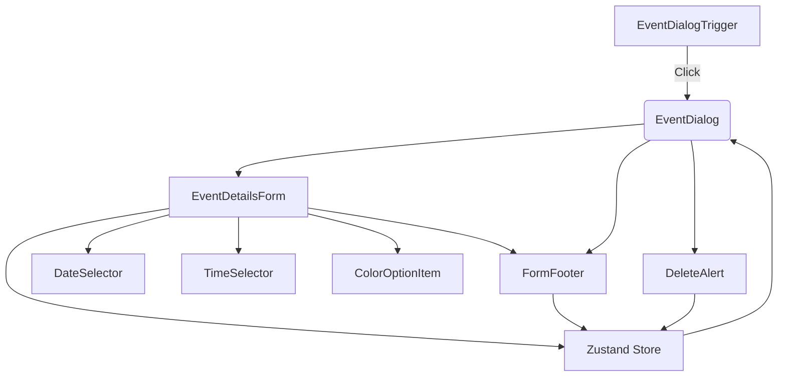
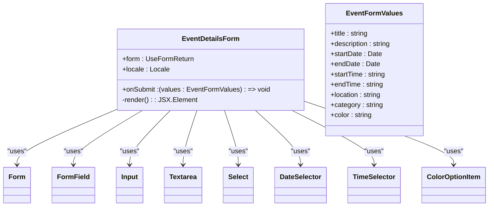
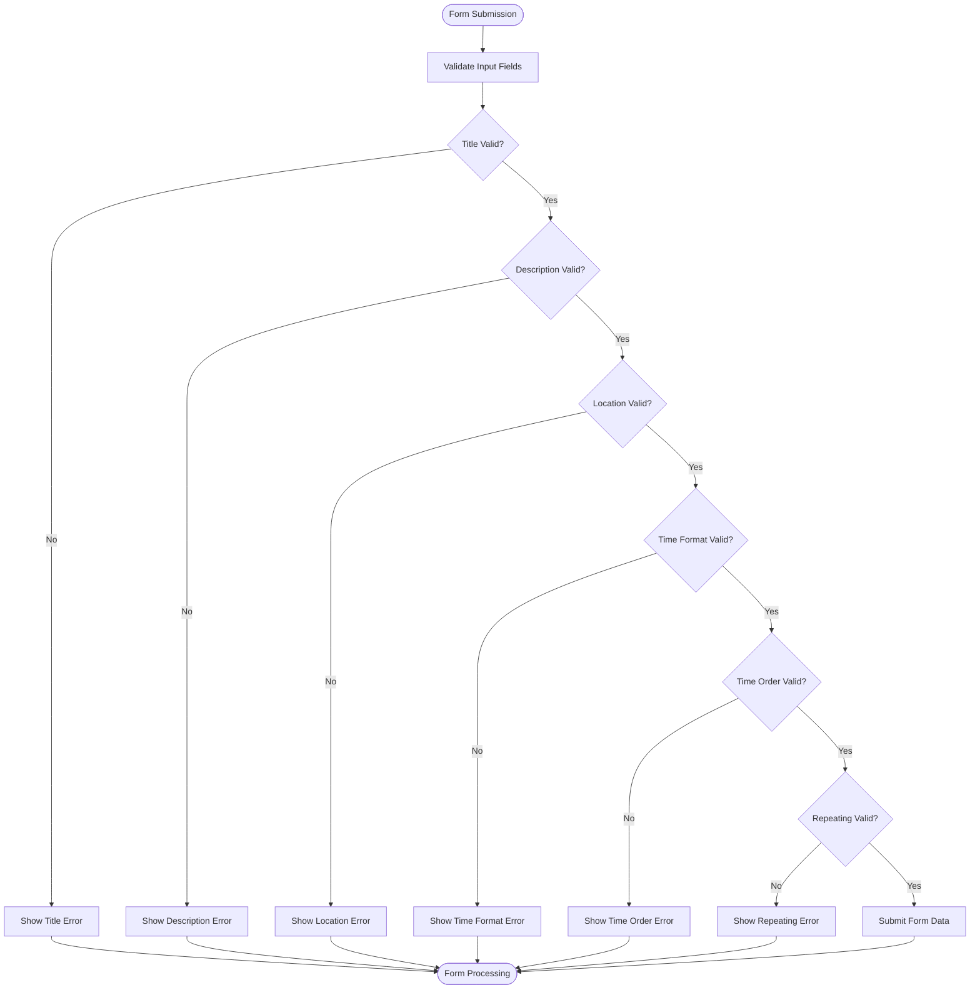
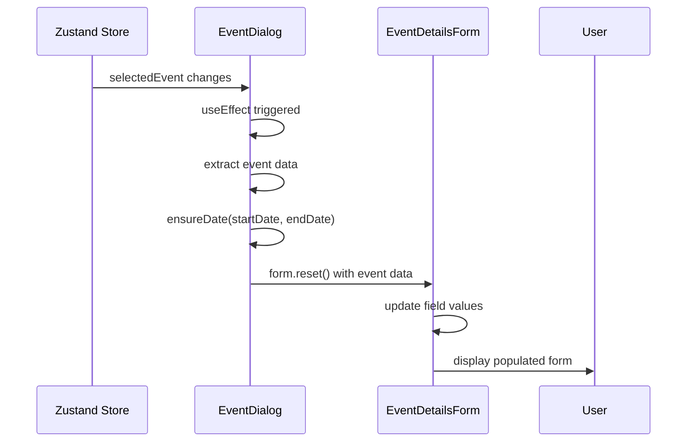
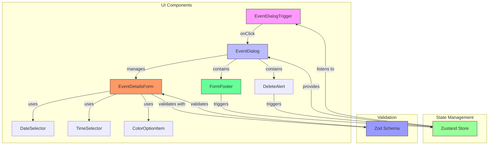

# Event Forms and Data Entry

<cite>
**Referenced Files in This Document**   
- [event-detail-form.tsx](file://apps/web/src/components/event-calendar/event-detail-form.tsx)
- [event-dialog.tsx](file://apps/web/src/components/event-calendar/event-dialog.tsx)
- [event-dialog-trigger.tsx](file://apps/web/src/components/event-calendar/event-dialog-trigger.tsx)
- [form-footer.tsx](file://apps/web/src/components/event-calendar/ui/form-footer.tsx)
- [form.tsx](file://apps/web/src/components/ui/form.tsx)
- [validations.ts](file://apps/web/src/lib/validations.ts)
- [calendar-constant.ts](file://apps/web/src/constants/calendar-constant.ts)
- [event.ts](file://apps/web/src/lib/event.ts)
- [use-event.ts](file://apps/web/src/hooks/use-event.ts)
- [date-selector.tsx](file://apps/web/src/components/event-calendar/ui/date-selector.tsx)
- [time-selector.tsx](file://apps/web/src/components/event-calendar/ui/time-selector.tsx)
- [event.ts](file://apps/web/src/types/event.ts)
</cite>

## Table of Contents
1. [Introduction](#introduction)
2. [Core Components Overview](#core-components-overview)
3. [EventDetailForm Implementation](#eventdetailform-implementation)
4. [Form Validation and Constraints](#form-validation-and-constraints)
5. [Form Data Initialization](#form-data-initialization)
6. [State Management and Data Propagation](#state-management-and-data-propagation)
7. [Form Controls and Input Components](#form-controls-and-input-components)
8. [EventDialogTrigger and Workflow Initiation](#eventdialogtrigger-and-workflow-initiation)
9. [Error Handling and Accessibility](#error-handling-and-accessibility)
10. [Component Relationships Diagram](#component-relationships-diagram)

## Introduction
The event data entry system in the smart-logs application provides a comprehensive interface for creating and editing calendar events. This document details the implementation of the EventDetailForm component and its integration within the broader event management workflow. The system leverages React Hook Form for form state management, Zod for validation, and Zustand for application state persistence. The form supports both new event creation and existing event editing, with proper initialization and data propagation mechanisms.

## Core Components Overview
The event data entry system consists of several interconnected components that work together to provide a seamless user experience for managing calendar events. The primary components include the EventDetailForm for data input, the EventDialog container for presentation, and the EventDialogTrigger for initiating the editing workflow.

**Diagram sources**
- [event-dialog-trigger.tsx](file://apps/web/src/components/event-calendar/event-dialog-trigger.tsx)
- [event-dialog.tsx](file://apps/web/src/components/event-calendar/event-dialog.tsx)
- [event-detail-form.tsx](file://apps/web/src/components/event-calendar/event-detail-form.tsx)
- [use-event.ts](file://apps/web/src/hooks/use-event.ts)

**Section sources**
- [event-dialog-trigger.tsx](file://apps/web/src/components/event-calendar/event-dialog-trigger.tsx)
- [event-dialog.tsx](file://apps/web/src/components/event-calendar/event-dialog.tsx)
- [event-detail-form.tsx](file://apps/web/src/components/event-calendar/event-detail-form.tsx)

## EventDetailForm Implementation
The EventDetailsForm component implements a comprehensive form interface for event data entry using React Hook Form and Radix UI components. The form is structured as a grid layout with various input fields organized in a logical sequence.

### Field Structure
The form contains the following fields:
- **Title**: Required text input with asterisk indicator
- **Description**: Optional textarea with placeholder
- **Start Date/Time**: Paired date and time selectors
- **End Date/Time**: Paired date and time selectors
- **Location**: Required text input
- **Category**: Select dropdown with predefined options
- **Event Color**: Select dropdown with color options

The component uses the Form, FormField, FormItem, FormLabel, FormControl, and FormMessage components from the UI library to create a consistent and accessible form structure.

**Diagram sources**
- [event-detail-form.tsx](file://apps/web/src/components/event-calendar/event-detail-form.tsx)
- [types/event.ts](file://apps/web/src/types/event.ts)

**Section sources**
- [event-detail-form.tsx](file://apps/web/src/components/event-calendar/event-detail-form.tsx)

## Form Validation and Constraints
The form implements comprehensive validation using Zod schema validation, ensuring data integrity and providing immediate feedback to users.

### Validation Schema
The eventFormSchema defined in validations.ts enforces the following constraints:

**:Validation Rules**
- **Title**: Required string (1-256 characters)
- **Description**: Required string (minimum 1 character)
- **Location**: Required string (1-256 characters)
- **Category**: Required string (1-100 characters)
- **Color**: Required string (1-25 characters)
- **Start/End Time**: Must match HH:MM format (00:00-23:59)
- **Date Order**: End date must be after start date when dates differ
- **Time Order**: End time must be after start time for same-day events
- **Repeating Events**: Repeating type required if event is marked as repeating

The schema also includes custom refinement functions to validate temporal relationships between start and end times/dates.

**Diagram sources**
- [validations.ts](file://apps/web/src/lib/validations.ts)
- [event-detail-form.tsx](file://apps/web/src/components/event-calendar/event-detail-form.tsx)

**Section sources**
- [validations.ts](file://apps/web/src/lib/validations.ts)

## Form Data Initialization
The form handles initialization differently for new events versus existing events through the parent EventDialog component.

### New Event Initialization
When creating a new event, the form is initialized with default values defined in the EventDialog component:

**:Default Values**
- **Start Time**: 09:00
- **End Time**: 10:00
- **Color**: bg-red-600
- **Category**: workshop
- **Title**: Empty string
- **Description**: Empty string
- **Location**: Empty string
- **Start/End Date**: Current date

### Existing Event Initialization
When editing an existing event, the form is reset with the event's current data through a useEffect hook that listens for changes to the selectedEvent:

**:Initialization Logic**
- Extract event data from selectedEvent state
- Convert date strings to Date objects using ensureDate utility
- Reset form with event data or default values if field is missing
- Handle potential errors during data conversion

The initialization process ensures that all form fields are properly populated with existing event data while maintaining the expected data types.

**Diagram sources**
- [event-dialog.tsx](file://apps/web/src/components/event-calendar/event-dialog.tsx)
- [event-detail-form.tsx](file://apps/web/src/components/event-calendar/event-detail-form.tsx)
- [use-event.ts](file://apps/web/src/hooks/use-event.ts)

**Section sources**
- [event-dialog.tsx](file://apps/web/src/components/event-calendar/event-dialog.tsx)

## State Management and Data Propagation
The event data entry system uses Zustand for global state management, facilitating data flow between components.

### State Management Architecture
The useEventCalendarStore provides a centralized state management solution with the following key properties:

**:State Properties**
- **selectedEvent**: Currently selected event for editing
- **isDialogOpen**: Controls visibility of the event dialog
- **closeEventDialog**: Function to close the dialog and reset state
- **isSubmitting**: Tracks form submission status

### Data Propagation
Changes made in the form are propagated back to the parent dialog through the onSubmit callback:

**:Data Flow**
1. User submits form in EventDetailsForm
2. Form validation occurs via React Hook Form
3. If valid, onSubmit callback is triggered with form values
4. EventDialog handles the update logic (currently demo implementation)
5. State is updated through Zustand store actions
6. Dialog is closed via closeEventDialog action

The memoized EventDetailsForm component ensures optimal performance by preventing unnecessary re-renders when props haven't changed.

**Section sources**
- [event-dialog.tsx](file://apps/web/src/components/event-calendar/event-dialog.tsx)
- [use-event.ts](file://apps/web/src/hooks/use-event.ts)

## Form Controls and Input Components
The form utilizes specialized input components for date and time selection, providing a user-friendly interface for temporal data entry.

### Date Selector Implementation
The DateSelector component wraps the Radix UI Calendar component in a Popover, providing a familiar date picking interface:

**:DateSelector Props**
- **value**: Current date value
- **onChange**: Callback for date changes
- **label**: Field label displayed above input
- **locale**: Localization for date formatting
- **required**: Whether field is required (displays asterisk)

The component displays the selected date in a localized format (PPP) and provides a placeholder when no date is selected.

### Time Selector Implementation
The TimeSelector component implements a dual-select interface for hour and minute selection:

**:Time Selection Logic**
- Hours: 00-23 in 24-hour format
- Minutes: 00-59 in 5-minute increments
- Value stored as "HH:MM" string format
- Separate Select components for hours and minutes
- Colon separator between selectors

The component splits the time string into hour and minute components, binding each to its respective select control and reconstructing the time string on change.

### Color Selection
The color selection uses a custom ColorOptionItem component within a Select dropdown, displaying color swatches alongside text labels for improved usability.

**Section sources**
- [date-selector.tsx](file://apps/web/src/components/event-calendar/ui/date-selector.tsx)
- [time-selector.tsx](file://apps/web/src/components/event-calendar/ui/time-selector.tsx)
- [event-detail-form.tsx](file://apps/web/src/components/event-calendar/event-detail-form.tsx)

## EventDialogTrigger and Workflow Initiation
The EventDialogTrigger component initiates the event editing workflow by responding to user interactions with existing events on the calendar.

### Trigger Implementation
The component renders as an absolutely positioned button that overlays calendar events:

**:Trigger Props**
- **event**: Event data to be edited
- **position**: Positioning information for the trigger
- **leftOffset/rightOffset**: Percentage-based positioning
- **onClick**: Callback to open the event dialog

The trigger uses framer-motion for entrance and exit animations, providing visual feedback when events are rendered.

### Workflow Initiation
When a user clicks on an event in the calendar:

1. EventDialogTrigger captures the click event
2. handleClick prevents default and propagation
3. onClick callback is triggered with event data
4. Parent component calls openEventDialog with event data
5. Zustand store updates selectedEvent and isDialogOpen
6. EventDialog renders with initialized form data

This workflow ensures that clicking any event on the calendar opens the editing interface with the appropriate data pre-loaded.

**Section sources**
- [event-dialog-trigger.tsx](file://apps/web/src/components/event-calendar/event-dialog-trigger.tsx)
- [event-dialog.tsx](file://apps/web/src/components/event-calendar/event-dialog.tsx)
- [use-event.ts](file://apps/web/src/hooks/use-event.ts)

## Error Handling and Accessibility
The form implementation includes comprehensive error handling and accessibility features to ensure a robust user experience.

### Error Handling
The system implements error handling at multiple levels:

**:Error Handling Mechanisms**
- **Form Validation**: Immediate feedback via FormMessage components
- **Data Conversion**: Try-catch block around form.reset() in EventDialog
- **Console Logging**: Errors during form initialization are logged
- **Toast Notifications**: Demo implementation shows success messages

The validation schema provides specific error messages for different validation failures, helping users understand how to correct their input.

### Accessibility Considerations
The form components include several accessibility features:

**:Accessibility Features**
- **ARIA Attributes**: Proper labeling and error messaging
- **Keyboard Navigation**: Full keyboard support for all form controls
- **Focus Management**: Proper focus handling in dialogs
- **Color Contrast**: Sufficient contrast between text and background
- **Screen Reader Support**: Semantic HTML and ARIA roles
- **Required Field Indicators**: Visual asterisks and programmatic required attributes

The Form component automatically manages aria-describedby attributes to associate error messages with their respective inputs, ensuring screen readers can properly announce validation errors.

### Input Constraints
All form fields implement appropriate constraints to prevent invalid data entry:

**:Input Constraints**
- **Text Fields**: Character limits enforced by Zod schema
- **Time Inputs**: Regex pattern matching for HH:MM format
- **Required Fields**: Server-side and client-side validation
- **Date Validation**: Temporal logic validation for start/end times

These constraints work together to ensure data integrity while providing clear feedback to users when validation fails.

**Section sources**
- [event-detail-form.tsx](file://apps/web/src/components/event-calendar/event-detail-form.tsx)
- [event-dialog.tsx](file://apps/web/src/components/event-calendar/event-dialog.tsx)
- [form.tsx](file://apps/web/src/components/ui/form.tsx)
- [validations.ts](file://apps/web/src/lib/validations.ts)

## Component Relationships Diagram
The following diagram illustrates the complete relationships between components in the event data entry system:

**Diagram sources**
- [event-dialog-trigger.tsx](file://apps/web/src/components/event-calendar/event-dialog-trigger.tsx)
- [event-dialog.tsx](file://apps/web/src/components/event-calendar/event-dialog.tsx)
- [event-detail-form.tsx](file://apps/web/src/components/event-calendar/event-detail-form.tsx)
- [form-footer.tsx](file://apps/web/src/components/event-calendar/ui/form-footer.tsx)
- [use-event.ts](file://apps/web/src/hooks/use-event.ts)
- [validations.ts](file://apps/web/src/lib/validations.ts)