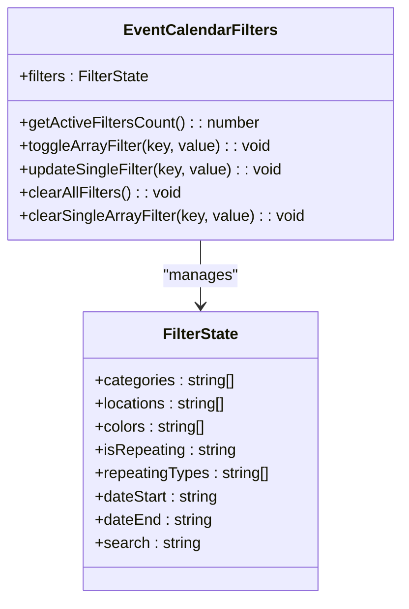
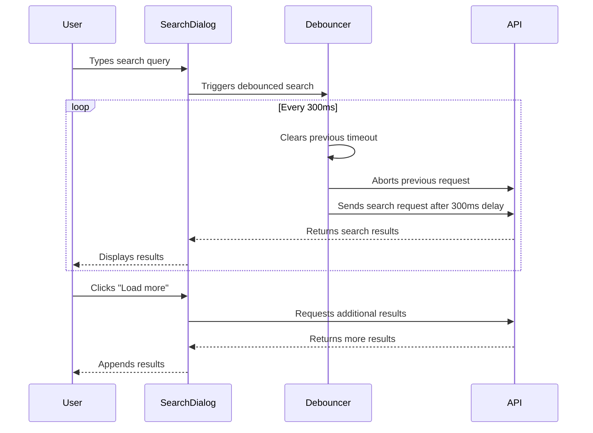
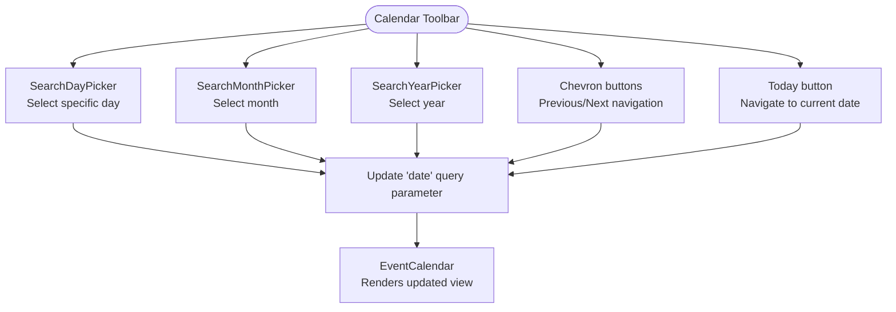
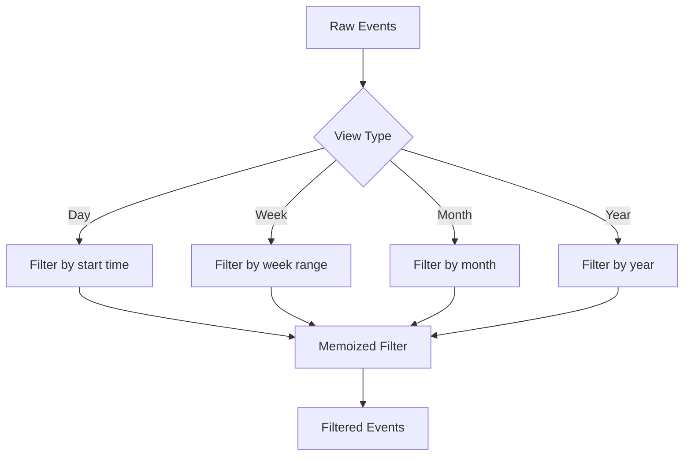

# Filters, Search, and Navigation

<cite>
**Referenced Files in This Document**   
- [event-calendar-filters.tsx](file://apps/web/src/components/event-calendar/event-calendar-filters.tsx)
- [event-search-dialog.tsx](file://apps/web/src/components/event-calendar/event-search-dialog.tsx)
- [event-calendar-toolbar.tsx](file://apps/web/src/components/event-calendar/event-calendar-toolbar.tsx)
- [use-event.ts](file://apps/web/src/hooks/use-event.ts)
- [calendar-constant.ts](file://apps/web/src/constants/calendar-constant.ts)
- [event.ts](file://apps/web/src/lib/event.ts)
- [search-day-picker.tsx](file://apps/web/src/components/event-calendar/ui/search-day-picker.tsx)
- [search-month-picker.tsx](file://apps/web/src/components/event-calendar/ui/search-month-picker.tsx)
- [search-year-picker.tsx](file://apps/web/src/components/event-calendar/ui/search-year-picker.tsx)
- [event-calendar.tsx](file://apps/web/src/components/event-calendar/event-calendar.tsx)
</cite>

## Table of Contents
1. [Introduction](#introduction)
2. [Filtering System](#filtering-system)
3. [Search Functionality](#search-functionality)
4. [Date and Time Navigation](#date-and-time-navigation)
5. [State Management](#state-management)
6. [Performance Considerations](#performance-considerations)
7. [UX Patterns](#ux-patterns)

## Introduction
The Event Calendar system provides a comprehensive set of filtering, search, and navigation features that enable users to efficiently manage and interact with events. This document details the implementation of these features, focusing on the EventCalendarFilters component for event refinement, the EventSearchDialog for search capabilities, and various date/time selection components for calendar navigation. The system leverages modern React patterns with Zustand for state management and nuqs for URL-based state persistence.

## Filtering System

The filtering system allows users to refine event visibility based on multiple criteria including categories, colors, and recurrence patterns. The primary component responsible for this functionality is `EventCalendarFilters`, which provides a comprehensive interface for applying various filter types.



**Diagram sources**
- [event-calendar-filters.tsx](file://apps/web/src/components/event-calendar/event-calendar-filters.tsx#L1-L377)

**Section sources**
- [event-calendar-filters.tsx](file://apps/web/src/components/event-calendar/event-calendar-filters.tsx#L1-L377)
- [calendar-constant.ts](file://apps/web/src/constants/calendar-constant.ts#L1-L78)

### Filter Types and Implementation

The filtering system supports multiple filter types, each implemented with specific UI components:

**Category Filtering**: Users can filter events by category using a popover with checkboxes. The available categories are defined in `CATEGORY_OPTIONS` and include "Workshop", "Konferensi" (Conference), "Seminar", and "Sosial" (Social).

**Color Filtering**: Events can be filtered by color using a similar popover interface. The available colors include red, blue, amber, yellow, lime, green, purple, pink, indigo, and teal, each with corresponding visual indicators.

**Recurrence Filtering**: A select dropdown allows users to filter events by recurrence pattern, with options for "All Events", "Repeating Only", and "Single Events". When "Repeating Only" is selected, an additional filter for repeat types (daily, weekly, monthly) becomes available.

### Filter State Management

Filter state is managed using the `useQueryStates` hook from nuqs, which synchronizes filter values with URL query parameters. This approach provides several benefits:

- **URL Persistence**: Filter states are preserved in the URL, allowing users to bookmark or share filtered views
- **Shallow Routing**: The `.withOptions({ shallow: false })` configuration ensures proper browser history management
- **Default Values**: Each filter has defined default values (typically empty arrays or empty strings)

The filter state structure includes:
```typescript
{
  categories: string[],
  locations: string[],
  colors: string[],
  isRepeating: string,
  repeatingTypes: string[],
  dateStart: string,
  dateEnd: string,
  search: string
}
```

## Search Functionality

The search functionality is implemented through the `EventSearchDialog` component, which provides a modal interface for searching events with real-time results and progressive loading.



**Diagram sources**
- [event-search-dialog.tsx](file://apps/web/src/components/event-calendar/event-search-dialog.tsx#L1-L238)

**Section sources**
- [event-search-dialog.tsx](file://apps/web/src/components/event-calendar/event-search-dialog.tsx#L1-L238)

### Search Implementation Details

The search functionality includes several key features:

**Debounced Searching**: The search is debounced with a 300ms delay to prevent excessive API calls during typing. This is implemented using a `useCallback` hook with `setTimeout` and `clearTimeout`.

**Abortable Requests**: Previous search requests are aborted when a new search is initiated, preventing race conditions and ensuring the most recent query results are displayed.

**Progressive Loading**: When results exceed the initial limit, users can load more events with a "Load more" button that implements infinite scrolling.

**Error Handling**: The component includes comprehensive error handling with user-friendly error messages and loading states.

The search parameters include:
- **Search term**: Minimum 2 characters required
- **Categories**: Filter by selected categories
- **Colors**: Filter by selected colors
- **Locations**: Filter by location
- **Repeating types**: Filter by recurrence pattern
- **Pagination**: Limit and offset for progressive loading

## Date and Time Navigation

The date and time navigation system provides multiple components for moving between different time periods and selecting specific dates.



**Diagram sources**
- [event-calendar-toolbar.tsx](file://apps/web/src/components/event-calendar/event-calendar-toolbar.tsx#L1-L210)
- [search-day-picker.tsx](file://apps/web/src/components/event-calendar/ui/search-day-picker.tsx#L1-L228)
- [search-month-picker.tsx](file://apps/web/src/components/event-calendar/ui/search-month-picker.tsx#L1-L165)
- [search-year-picker.tsx](file://apps/web/src/components/event-calendar/ui/search-year-picker.tsx#L1-L165)

**Section sources**
- [event-calendar-toolbar.tsx](file://apps/web/src/components/event-calendar/event-calendar-toolbar.tsx#L1-L210)
- [search-day-picker.tsx](file://apps/web/src/components/event-calendar/ui/search-day-picker.tsx#L1-L228)
- [search-month-picker.tsx](file://apps/web/src/components/event-calendar/ui/search-month-picker.tsx#L1-L165)
- [search-year-picker.tsx](file://apps/web/src/components/event-calendar/ui/search-year-picker.tsx#L1-L165)

### Navigation Components

The navigation system consists of three main components:

**SearchDayPicker**: A popover-based day selector that displays days of the current month with their day names and suffixes (1st, 2nd, 3rd, etc.). It includes search functionality to quickly find specific days.

**SearchMonthPicker**: A month selection component that displays all 12 months with both full and abbreviated names. Users can search for months by name.

**SearchYearPicker**: A year selector that displays years within a configurable range (default ±10 years from current year). The range can be customized with minYear and maxYear props.

### Navigation Actions

The system supports several navigation actions:

**Previous/Next Navigation**: Chevron buttons allow users to navigate to the previous or next time period based on the current view (day, week, month, or year).

**Today Navigation**: A dedicated "Today" button quickly returns the calendar to the current date.

**Keyboard Navigation**: Arrow keys (left and right) are supported for navigating between time periods, enhancing accessibility.

## State Management

The system uses a sophisticated state management approach combining Zustand for global state and nuqs for URL-based state persistence.

```mermaid
classDiagram
class useEventCalendarStore {
+currentView : CalendarViewType
+viewMode : ViewModeType
+timeFormat : TimeFormatType
+locale : string
+viewSettings : CalendarViewConfigs
+setView() : void
+setMode() : void
+setTimeFormat() : void
+updateViewConfig() : void
}
class EventCalendarFilters {
+filters : FilterState
+setFilters() : void
}
class EventCalendarToolbar {
+date : Date
+setDate() : void
}
useEventCalendarStore <.. EventCalendarToolbar : "uses"
useEventCalendarStore <.. EventCalendarFilters : "uses"
EventCalendarToolbar <.. EventCalendar : "contains"
EventCalendarFilters <.. EventCalendar : "contains"
note right of useEventCalendarStore
Persisted to localStorage
using Zustand persist middleware
end note
note right of EventCalendarToolbar
Synchronized with URL
via nuqs useQueryState
end note
```

**Diagram sources**
- [use-event.ts](file://apps/web/src/hooks/use-event.ts#L1-L254)
- [event-calendar-toolbar.tsx](file://apps/web/src/components/event-calendar/event-calendar-toolbar.tsx#L1-L210)
- [event-calendar-filters.tsx](file://apps/web/src/components/event-calendar/event-calendar-filters.tsx#L1-L377)

**Section sources**
- [use-event.ts](file://apps/web/src/hooks/use-event.ts#L1-L254)

### State Architecture

The state management system has two main components:

**Zustand Store**: The `useEventCalendarStore` manages application-wide state that should persist across sessions, including:
- Current view type (day, week, month, year)
- View mode (calendar or list)
- Time format (12h or 24h)
- Locale settings
- View configurations
- Dialog states

This store uses the `persist` middleware to save selected state to localStorage.

**URL State**: The `nuqs` library manages URL-based state for:
- Current date selection
- Filter parameters
- Search queries

This approach enables bookmarkable URLs and deep linking to specific calendar states.

### Integration Pattern

The main `EventCalendar` component integrates these state management systems by subscribing to both the Zustand store and URL state, then passing the relevant state to child components:

```typescript
const { viewMode, currentView, daysCount } = useEventCalendarStore(
  useShallow((state) => ({
    viewMode: state.viewMode,
    currentView: state.currentView,
    daysCount: state.daysCount,
  }))
)

const [date, setDate] = useQueryState(
  'date',
  parseAsIsoDate.withDefault(new Date()).withOptions({
    shallow: false,
    throttleMs: 300,
  })
)
```

## Performance Considerations

The filtering, search, and navigation system incorporates several performance optimizations to handle large datasets efficiently.

### Client-Side Filtering
For smaller datasets, filtering is performed client-side using JavaScript array methods. The `useEventFilter` and `useEventGrouper` utility functions in `event.ts` handle this processing with memoization to prevent unnecessary recalculations:



**Section sources**
- [event.ts](file://apps/web/src/lib/event.ts#L1-L589)

### Search Optimization
The search functionality includes several performance optimizations:

**Debouncing**: Search requests are debounced by 300ms to prevent excessive API calls during typing.

**Request Cancellation**: Previous search requests are canceled when new searches are initiated, preventing race conditions.

**Progressive Loading**: Results are loaded in batches (limit: 20) to prevent overwhelming the UI with large result sets.

### State Update Optimization
The system uses several React optimization techniques:

**useMemo**: Computationally expensive operations like event filtering and grouping are memoized.

**useCallback**: Event handlers are memoized to prevent unnecessary re-renders.

**useShallow**: The `useShallow` hook from Zustand prevents unnecessary re-renders by only subscribing to specific state properties.

## UX Patterns

The system implements several user experience patterns to enhance usability and accessibility.

### Progressive Disclosure
Filter options are progressively disclosed based on user selection. For example, the repeating types filter only appears when "Repeating Only" is selected, reducing cognitive load.

```mermaid
flowchart LR
A[All Events] --> B{User selects<br/>"Repeating Only"}
B --> |Yes| C[Show repeating<br/>types filter]
B --> |No| D[Hide repeating<br/>types filter]
```

**Section sources**
- [event-calendar-filters.tsx](file://apps/web/src/components/event-calendar/event-calendar-filters.tsx#L1-L377)

### Visual Feedback
The system provides multiple forms of visual feedback:

**Active Filter Indicators**: Buttons display badge counts showing the number of active filters.

**Animated Transitions**: Date pickers use Framer Motion for smooth transitions when values change.

**Loading States**: Clear loading indicators are shown during search operations.

### Accessibility Features
The system includes several accessibility features:

**Keyboard Navigation**: Arrow keys can navigate between time periods.

**ARIA Attributes**: Proper ARIA roles and attributes are used for interactive elements.

**Focus Management**: Focus is properly managed when dialogs and popovers are opened.

### Responsive Design
The interface adapts to different screen sizes:

**Mobile Layout**: On small screens, navigation buttons are stacked and displayed as full-width buttons.

**Desktop Layout**: On larger screens, a more compact layout with icon-only buttons is used.