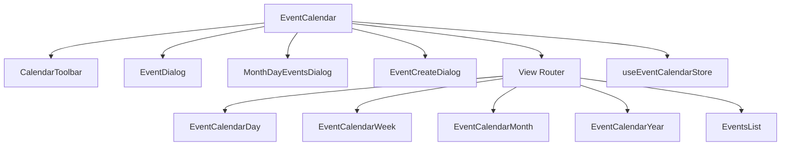
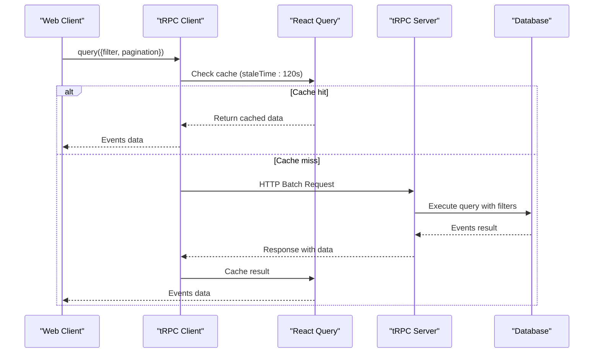
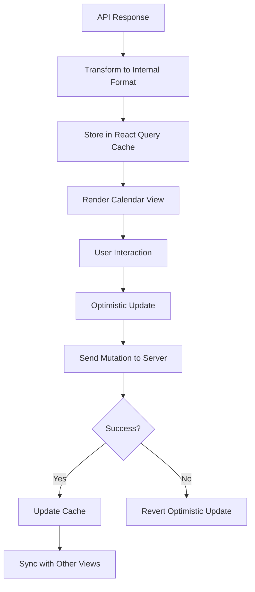
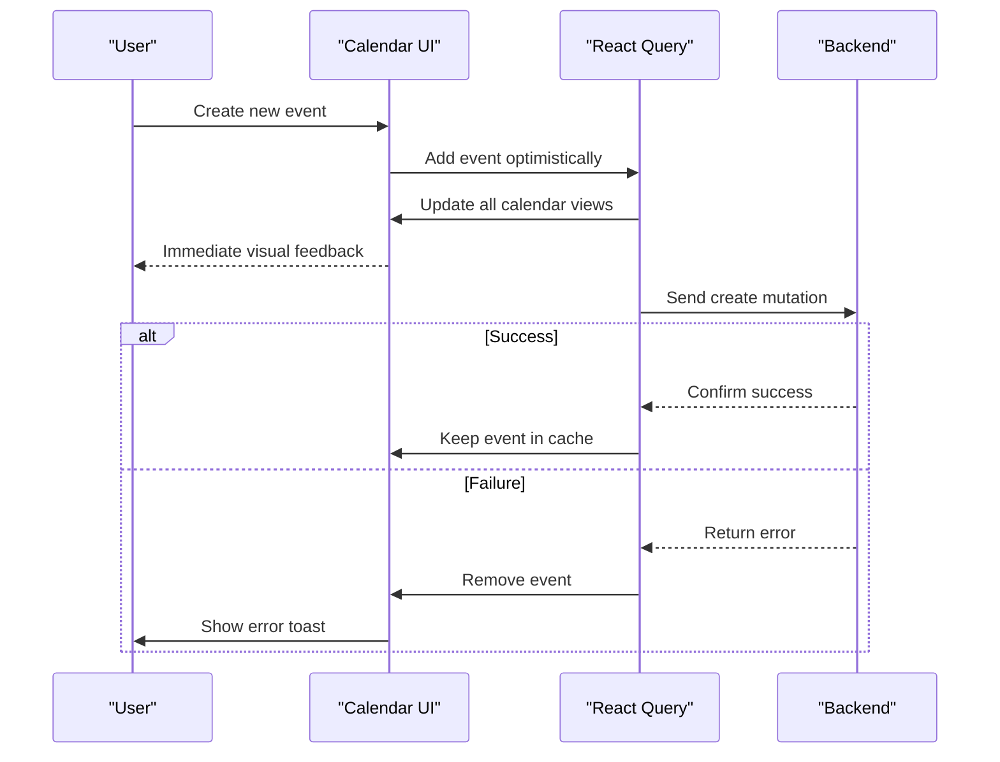

# System Integration and Data Flow

<cite>
**Referenced Files in This Document**   
- [event-calendar.tsx](file://apps/web/src/components/event-calendar/event-calendar.tsx)
- [date.ts](file://apps/web/src/lib/date.ts)
- [calendar-constant.ts](file://apps/web/src/constants/calendar-constant.ts)
- [trpc.ts](file://apps/web/src/utils/trpc.ts)
- [query-constants.ts](file://apps/web/src/constants/query-constants.ts)
- [events.ts](file://apps/server/src/routers/events.ts)
</cite>

## Table of Contents
1. [Introduction](#introduction)
2. [Event Calendar Component Architecture](#event-calendar-component-architecture)
3. [tRPC Integration for Data Fetching and Mutation](#trpc-integration-for-data-fetching-and-mutation)
4. [Date and Time Utilities](#date-and-time-utilities)
5. [Calendar Configuration and Constants](#calendar-configuration-and-constants)
6. [Data Transformation and Event Handling](#data-transformation-and-event-handling)
7. [Timezone and Localization Support](#timezone-and-localization-support)
8. [Error Handling and Loading States](#error-handling-and-loading-states)
9. [Optimistic Updates and Synchronization](#optimistic-updates-and-synchronization)
10. [Integration with Compliance and Alerting Systems](#integration-with-compliance-and-alerting-systems)

## Introduction
The Event Calendar component serves as a central interface for visualizing and managing audit events within the application. It integrates with backend systems through tRPC to fetch, create, and update event data while maintaining consistent time calculations and user experience across different views. This document details the integration architecture, data flow patterns, and supporting utilities that enable robust calendar functionality.

## Event Calendar Component Architecture

The Event Calendar is implemented as a React component that dynamically renders different views based on user preferences. It uses a modular architecture with specialized components for each view mode (day, week, month, year, list).



**Diagram sources**
- [event-calendar.tsx](file://apps/web/src/components/event-calendar/event-calendar.tsx#L1-L65)

**Section sources**
- [event-calendar.tsx](file://apps/web/src/components/event-calendar/event-calendar.tsx#L1-L65)

## tRPC Integration for Data Fetching and Mutation

The calendar component interacts with the backend through tRPC, a type-safe API layer that enables end-to-end TypeScript types. The integration is configured with React Query for caching, error handling, and state management.

### tRPC Client Configuration

The tRPC client is initialized with batching, error handling, and caching strategies:

```typescript
export const queryClient = new QueryClient({
	defaultOptions: {
		queries: {
			staleTime: STALE_TIMES.STANDARD,
			refetchInterval: false,
			retry: 3,
			retryDelay: (attemptIndex) => Math.min(1000 * 2 ** attemptIndex, 30000),
			refetchOnWindowFocus: true,
			refetchOnReconnect: true,
		},
		mutations: {
			retry: 3,
			retryDelay: (attemptIndex) => Math.min(1000 * 2 ** attemptIndex, 30000),
		},
	},
	queryCache: new QueryCache({
		onError: (error) => {
			toast.error(error.message, {
				action: {
					label: 'retry',
					onClick: () => {
						queryClient.invalidateQueries()
					},
				},
			})
		},
	}),
})
```

This configuration ensures resilient data fetching with exponential backoff retry strategies and automatic refetching when the application regains focus or reconnects to the network.

### Event Data Procedures

The server-side events router exposes several procedures for event management:



**Diagram sources**
- [trpc.ts](file://apps/web/src/utils/trpc.ts#L1-L63)
- [events.ts](file://apps/server/src/routers/events.ts#L1-L199)

**Section sources**
- [trpc.ts](file://apps/web/src/utils/trpc.ts#L1-L63)
- [events.ts](file://apps/server/src/routers/events.ts#L1-L199)

## Date and Time Utilities

The `date.ts` utility file provides comprehensive functions for date and time manipulation, formatting, and validation across the application.

### Time Formatting and Generation

The utility includes functions for formatting time displays in both 12-hour and 24-hour formats:

```typescript
export const formatTimeDisplay = (
	timeInput: string | number,
	timeFormat: '12' | '24',
	minutes?: number
): string => {
	// Implementation converts time to specified format
}
```

It also generates time options for UI components:

```typescript
export const generateTimeOptions = (options?: {
	startHour?: number
	endHour?: number
	interval?: number
}) => {
	const { startHour = 0, endHour = 23, interval = 30 } = options || {}
	// Returns array of time options in HH:MM format
}
```

### Duration Calculation and Validation

The utilities include smart duration calculation with human-readable formatting:

```typescript
export const calculateDuration = (
	startTime: string,
	endTime: string,
	format: 'hours' | 'auto' = 'auto'
): number | string => {
	// Returns duration as decimal hours or formatted string (e.g., "1h 30m")
}
```

Time order validation ensures data integrity:

```typescript
export const validateTimeOrder = (startTime: string, endTime: string): boolean => {
	return convertTimeToMinutes(endTime) > convertTimeToMinutes(startTime)
}
```

**Section sources**
- [date.ts](file://apps/web/src/lib/date.ts#L1-L438)

## Calendar Configuration and Constants

The `calendar-constant.ts` file defines shared configuration values used throughout the calendar component.

### Event Defaults and Options

```typescript
export const EVENT_DEFAULTS = {
	START_TIME: '09:00',
	END_TIME: '10:00',
	COLOR: 'blue',
	CATEGORY: 'workshop',
} as const

export const EVENT_COLORS = [
	{ value: 'red', label: 'Red' },
	{ value: 'blue', label: 'Blue' },
	{ value: 'amber', label: 'Amber' },
	// Additional colors
] as const

export const CATEGORY_OPTIONS = [
	{ value: 'workshop', label: 'Workshop' },
	{ value: 'conference', label: 'Konferensi' },
	{ value: 'seminar', label: 'Seminar' },
	{ value: 'social', label: 'Sosial' },
] as const
```

### Localization Support

The constants include locale configurations for internationalization:

```typescript
export const LOCALES = [
	{ value: 'en-US', label: 'English (US)', locale: enUS },
	{ value: 'en-GB', label: 'English (UK)', locale: enGB },
	{ value: 'id-ID', label: 'Bahasa Indonesia', locale: id },
	{ value: 'es-ES', label: 'Español', locale: es },
	// Additional locales
] as const
```

**Section sources**
- [calendar-constant.ts](file://apps/web/src/constants/calendar-constant.ts#L1-L78)

## Data Transformation and Event Handling

The calendar component transforms event data between the API format and the internal representation used for rendering.

### Data Flow Pattern



### Query Structure

The event query uses comprehensive filtering with pagination:

```typescript
const QueryAuditEventsSchema = z.object({
	filter: z.object({
		dateRange: z.object({
			startDate: z.string().datetime(),
			endDate: z.string().datetime(),
		}).optional(),
		principalIds: z.array(z.string()).optional(),
		organizationIds: z.array(z.string()).optional(),
		// Additional filters
	}),
	pagination: z.object({
		limit: z.number().min(1).max(1000).default(50),
		offset: z.number().min(0).default(0),
	}),
	sort: z.object({
		field: z.enum(['timestamp', 'status', 'action', 'principalId']).default('timestamp'),
		direction: z.enum(['asc', 'desc']).default('desc'),
	}).optional(),
})
```

**Section sources**
- [events.ts](file://apps/server/src/routers/events.ts#L1-L400)

## Timezone and Localization Support

The calendar system supports multiple timezones and localized date formatting through integration with date-fns.

### Localized Day Names

The system generates localized day names based on the selected locale:

```typescript
export const getLocalizedDaysOfWeek = (locale: Locale) => {
	const cacheKey = locale.code || 'en-US'
	
	if (dayOfWeekCache.has(cacheKey)) {
		return dayOfWeekCache.get(cacheKey)!
	}
	
	const baseDate = new Date(2023, 0, 1)
	const days = [0, 1, 2, 3, 4, 5, 6].map((dayValue) => {
		const date = new Date(baseDate)
		date.setDate(baseDate.getDate() + dayValue)
		
		return {
			value: dayValue as 0 | 1 | 2 | 3 | 4 | 5 | 6,
			label: format(date, 'EEEE', { locale }),
		}
	})
	
	dayOfWeekCache.set(cacheKey, days)
	return days
}
```

This function caches results to improve performance when switching between locales.

**Section sources**
- [date.ts](file://apps/web/src/lib/date.ts#L400-L438)

## Error Handling and Loading States

The system implements comprehensive error handling at multiple levels.

### React Query Error Handling

The query client includes global error handling:

```typescript
queryCache: new QueryCache({
	onError: (error) => {
		toast.error(error.message, {
			action: {
				label: 'retry',
				onClick: () => {
					queryClient.invalidateQueries()
				},
			},
		})
	},
}),
```

This displays user-friendly error messages with a retry option.

### Loading States

The calendar component manages loading states through React Query's built-in mechanisms:

- **Initial loading**: Skeleton UI while fetching first page of events
- **Background refetch**: Transparent updates when data becomes stale
- **Pagination loading**: Loading indicators when navigating pages
- **Mutation loading**: Optimistic updates with loading states during mutations

**Section sources**
- [trpc.ts](file://apps/web/src/utils/trpc.ts#L1-L63)

## Optimistic Updates and Synchronization

The calendar implements optimistic updates to provide immediate feedback to users.

### Update Flow



This approach ensures that all calendar views (day, week, month, list) remain synchronized even during network latency.

**Section sources**
- [trpc.ts](file://apps/web/src/utils/trpc.ts#L1-L63)
- [event-calendar.tsx](file://apps/web/src/components/event-calendar/event-calendar.tsx#L1-L65)

## Integration with Compliance and Alerting Systems

The event calendar integrates with broader system features for compliance and alerting.

### Audit Event Creation

When events are created through the calendar, they trigger audit logging:

```typescript
create: auditWriteProcedure.input(CreateAuditEventSchema).mutation(async ({ ctx, input }) => {
	const { audit, logger, error } = ctx.services
	const organizationId = ctx.session?.session.activeOrganizationId as string
	
	try {
		const eventData = {
			...input,
			organizationId,
			timestamp: new Date().toISOString(),
			eventVersion: '1.0',
		}
		
		// Create audit event
		await audit.log(eventData)
		
		logger.info('Audit event created successfully', {
			action: input.action,
			principalId: input.principalId,
			organizationId,
		})
		
		return { success: true, message: 'Audit event created successfully' }
	} catch (e) {
		// Error handling with centralized error service
	}
})
```

### Alert Generation

The system can generate alerts based on calendar events, particularly for compliance-related activities. The integration ensures that significant events are properly logged and monitored across the system.

**Section sources**
- [events.ts](file://apps/server/src/routers/events.ts#L1-L199)