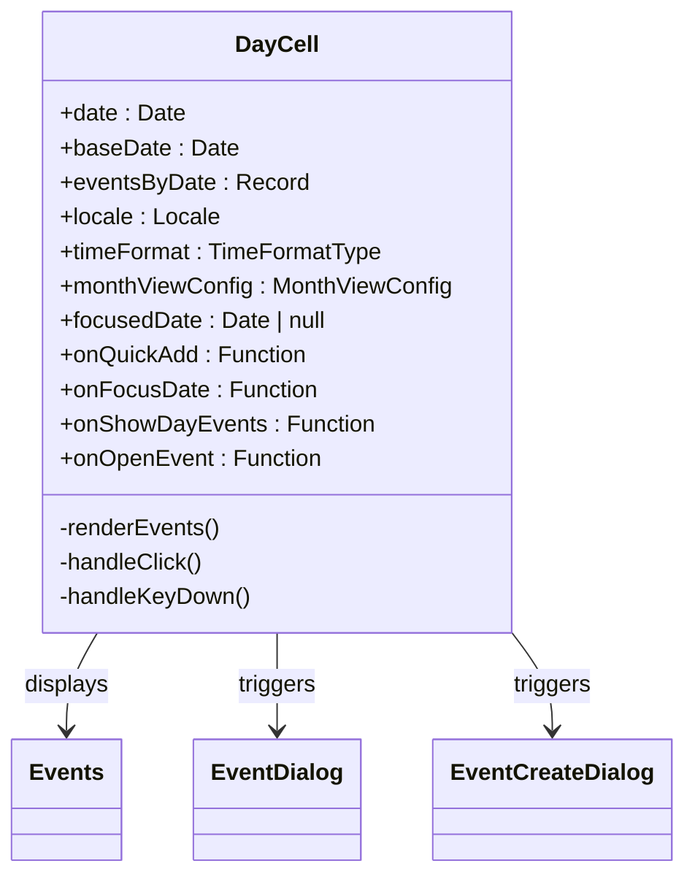
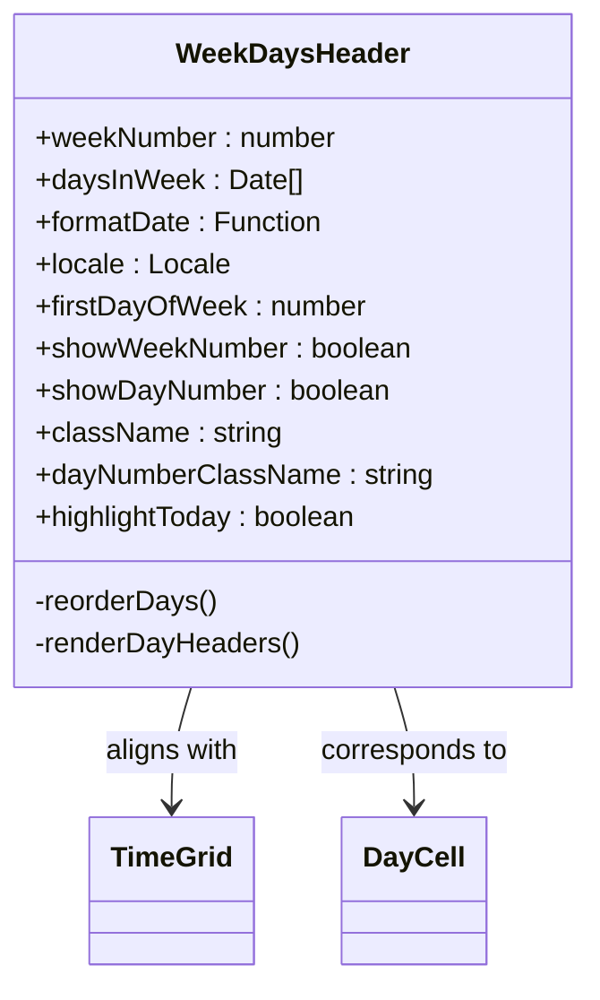
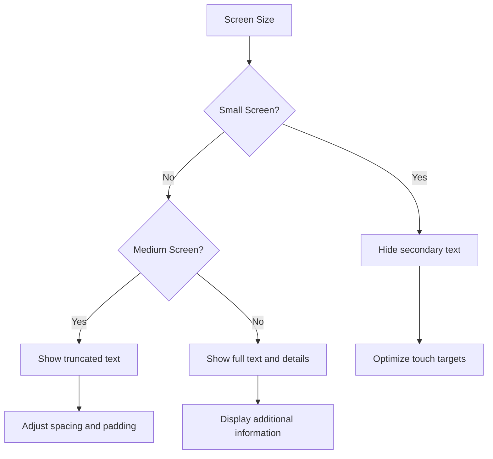
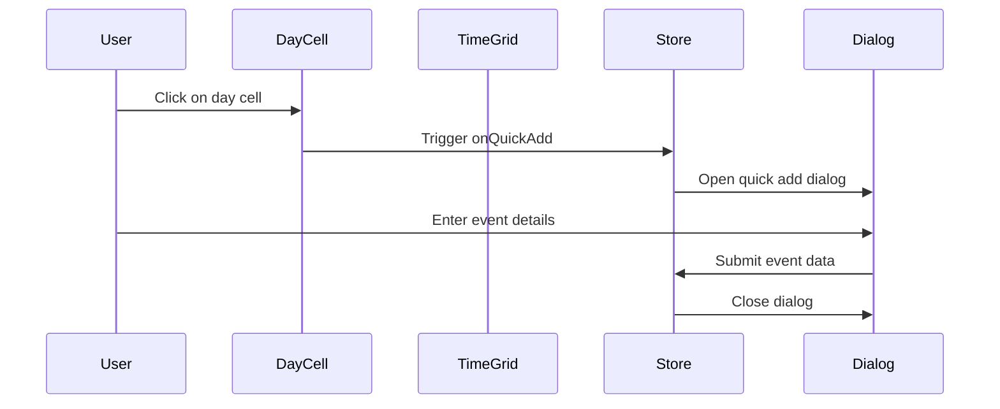
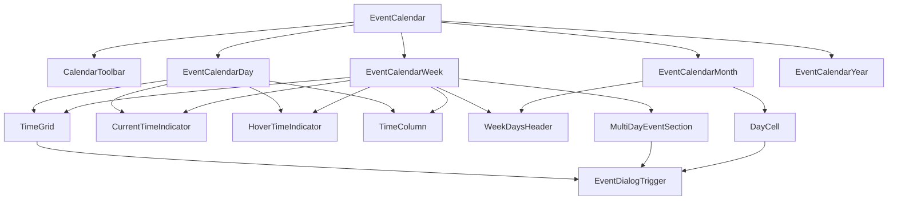

# UI Subcomponents and Utilities

<cite>
**Referenced Files in This Document**   
- [time-grid.tsx](file://apps/web/src/components/event-calendar/ui/time-grid.tsx)
- [day-cell.tsx](file://apps/web/src/components/event-calendar/ui/day-cell.tsx)
- [week-days-header.tsx](file://apps/web/src/components/event-calendar/ui/week-days-header.tsx)
- [current-time-indicator.tsx](file://apps/web/src/components/event-calendar/ui/current-time-indicator.tsx)
- [event-calendar-week.tsx](file://apps/web/src/components/event-calendar/event-calendar-week.tsx)
- [event-calendar-days.tsx](file://apps/web/src/components/event-calendar/event-calendar-days.tsx)
- [event-calendar-day.tsx](file://apps/web/src/components/event-calendar/event-calendar-day.tsx)
- [event-dialog-trigger.tsx](file://apps/web/src/components/event-calendar/event-dialog-trigger.tsx)
- [event-calendar-toolbar.tsx](file://apps/web/src/components/event-calendar/event-calendar-toolbar.tsx)
- [use-event.ts](file://apps/web/src/hooks/use-event.ts)
</cite>

## Table of Contents
1. [Introduction](#introduction)
2. [Core Utility Components](#core-utility-components)
3. [TimeGrid Component](#timegrid-component)
4. [DayCell Component](#daycell-component)
5. [WeekDaysHeader Component](#weekdaysheader-component)
6. [CurrentTimeIndicator Component](#currenttimeindicator-component)
7. [Layout and Styling System](#layout-and-styling-system)
8. [Interaction Patterns](#interaction-patterns)
9. [Responsive Design](#responsive-design)
10. [Accessibility Features](#accessibility-features)
11. [Component Integration](#component-integration)

## Introduction
The Event Calendar interface is composed of several utility components that work together to create a cohesive and interactive scheduling experience. These components handle the visual structure, time alignment, and user interaction patterns that define the calendar's functionality. The system is designed to be responsive, accessible, and intuitive, providing users with multiple views (day, week, month, year) and interaction methods.

**Section sources**
- [event-calendar.tsx](file://apps/web/src/components/event-calendar/event-calendar.tsx#L0-L40)

## Core Utility Components
The Event Calendar's visual structure is built upon several key utility components that handle specific aspects of the interface:

- **TimeGrid**: Manages the time column alignment and layout structure
- **DayCell**: Represents individual days in the calendar grid
- **WeekDaysHeader**: Provides the header elements that display day names
- **CurrentTimeIndicator**: Visually indicates the current time position
- **EventDialogTrigger**: Handles event interactions and dialog presentation

These components work in concert to create a unified calendar experience across different views and screen sizes.

## TimeGrid Component

The TimeGrid component is responsible for creating the time-based grid structure that forms the foundation of the calendar's day and week views. It renders a grid of time slots that align with the days of the week, enabling users to visualize and interact with time-based events.

```mermaid
classDiagram
class TimeGrid {
+highlightToday : boolean
+timeSlots : Date[]
+daysInWeek : Date[]
+todayIndex : number
+onTimeBlockClick : Function
+dayWidthPercent : number
+dynamicWidth : boolean
-renderTimeSlots()
-handleTimeBlockClick()
}
TimeGrid --> "1" "n" DayCell : contains
TimeGrid --> "1" "n" WeekDaysHeader : aligns with
TimeGrid --> CurrentTimeIndicator : positions
```

**Diagram sources**
- [time-grid.tsx](file://apps/web/src/components/event-calendar/ui/time-grid.tsx#L0-L54)

**Section sources**
- [time-grid.tsx](file://apps/web/src/components/event-calendar/ui/time-grid.tsx#L0-L54)

The TimeGrid component accepts several props that control its behavior and appearance:

- **highlightToday**: Boolean flag to highlight the current day
- **timeSlots**: Array of Date objects representing the time intervals
- **daysInWeek**: Array of Date objects for the days being displayed
- **todayIndex**: Index of the current day in the week
- **onTimeBlockClick**: Callback function triggered when a time block is clicked
- **dayWidthPercent**: Width percentage for each day column (when using dynamic width)

The component uses a nested mapping structure to create a grid where each row represents a time slot and each column represents a day. The grid cells are implemented as buttons to enable user interaction. When a time block is clicked, the component calculates the start and end times (with a one-hour duration) and passes this information to the `onTimeBlockClick` callback.

The layout supports both fixed and dynamic width configurations. In dynamic mode, each day column's width is explicitly set via the `dayWidthPercent` prop, allowing for flexible layouts in multi-day views. The component uses Tailwind CSS classes for styling, including hover effects, borders, and conditional highlighting of the current day.

## DayCell Component

The DayCell component represents individual days in the calendar grid, particularly in month view. It displays the day number and any events scheduled for that day, providing both visual information and interaction capabilities.



**Diagram sources**
- [day-cell.tsx](file://apps/web/src/components/event-calendar/ui/day-cell.tsx#L0-L153)

**Section sources**
- [day-cell.tsx](file://apps/web/src/components/event-calendar/ui/day-cell.tsx#L0-L153)

The DayCell component implements several accessibility features, including proper ARIA attributes and keyboard navigation support. The component has a `role="gridcell"` and includes an `aria-label` that describes the day and available actions. Users can navigate to day cells using the keyboard and activate them with the Enter or Space keys.

The visual design includes:
- Day number display with special styling for the current day
- Event preview showing the first event's title and time
- "More" button for days with multiple events
- "Add" button for empty days, visible on hover
- Conditional styling based on whether the day is in the current month

The component uses conditional rendering to handle different scenarios, such as hiding days outside the current month or displaying abbreviated information on smaller screens. It also supports focus states for keyboard navigation and screen reader users.

## WeekDaysHeader Component

The WeekDaysHeader component provides the header row that displays the days of the week at the top of the calendar view. It synchronizes with the main calendar grid to ensure proper alignment and provides visual cues for the current day.



**Diagram sources**
- [week-days-header.tsx](file://apps/web/src/components/event-calendar/ui/week-days-header.tsx#L0-L86)

**Section sources**
- [week-days-header.tsx](file://apps/web/src/components/event-calendar/ui/week-days-header.tsx#L0-L86)

The component accepts props that control its display options:
- **weekNumber**: Optional week number to display
- **daysInWeek**: Array of Date objects for the days being displayed
- **formatDate**: Function to format date strings
- **locale**: Locale for date formatting
- **firstDayOfWeek**: Index of the first day of the week (0=Sunday, 1=Monday, etc.)
- **showWeekNumber**: Flag to display the week number column
- **showDayNumber**: Flag to display day numbers in the header
- **highlightToday**: Flag to highlight the current day

The component uses the `useMemo` hook to reorder the days based on the `firstDayOfWeek` setting, ensuring that the week starts on the correct day according to user preferences. It also implements smooth animations using Framer Motion when the component mounts or updates, providing a polished user experience.

The header cells display the abbreviated day name (e.g., "Mon", "Tue") and optionally the day number. The current day is highlighted with a blue background, matching the styling in the main calendar grid for visual consistency.

## CurrentTimeIndicator Component

The CurrentTimeIndicator component visually indicates the current time position within the calendar's time grid, helping users orient themselves in the schedule.

```mermaid
classDiagram
class CurrentTimeIndicator {
+currentHour : number
+currentMinute : number
+timeFormat : TimeFormatType
+hourHeight : number
+className : string
-calculatePosition()
}
CurrentTimeIndicator --> TimeGrid : overlays
CurrentTimeIndicator --> "1" "1" DayCell : corresponds to
```

**Diagram sources**
- [current-time-indicator.tsx](file://apps/web/src/components/event-calendar/ui/current-time-indicator.tsx#L0-L34)

**Section sources**
- [current-time-indicator.tsx](file://apps/web/src/components/event-calendar/ui/current-time-indicator.tsx#L0-L34)

The component renders a horizontal red line that spans the width of the calendar's time grid. The position of the line is calculated based on the current hour and minute, with the top position determined by:

```
top = (currentHour * hourHeight) + ((currentMinute / 60) * hourHeight)
```

This formula ensures the indicator is positioned accurately within the hour blocks, even when the current time falls between hour boundaries. The component also displays a small label showing the current time, positioned to the left of the indicator line.

The indicator is styled with a red border and has `pointer-events: none` to ensure it doesn't interfere with user interactions with the underlying time grid. This allows users to click on time blocks even when the current time indicator is overlapping them.

## Layout and Styling System

The calendar interface uses a comprehensive layout and styling system based on Tailwind CSS and responsive design principles. The system ensures consistent appearance and behavior across different views and screen sizes.

### Grid Structure
The calendar uses a flexible grid system where:
- Time columns are aligned using percentage-based widths
- Day columns in week and day views use equal distribution (100%/7 for week view)
- Multi-day views use dynamic width calculations based on the number of days displayed

### Responsive Behavior
The layout adapts to different screen sizes through several mechanisms:



**Diagram sources**
- [event-calendar-week.tsx](file://apps/web/src/components/event-calendar/event-calendar-week.tsx#L261-L287)
- [event-dialog-trigger.tsx](file://apps/web/src/components/event-calendar/event-dialog-trigger.tsx#L42-L68)

The system uses CSS classes with responsive prefixes (e.g., `sm:`, `md:`, `lg:`) to apply different styles at different breakpoints. For example:
- On small screens: Event titles are truncated, and secondary information is hidden
- On medium screens: More information is displayed, and spacing is adjusted
- On large screens: Full details are shown with additional visual elements

The calendar also implements overflow handling for events that span multiple days or overlap with other events. The `event-dialog-trigger.tsx` component uses absolute positioning with calculated left and right offsets to ensure proper alignment and prevent overlap.

## Interaction Patterns

The calendar interface implements several interaction patterns that enhance usability and provide a consistent user experience.

### Event Creation
Users can create new events through multiple pathways:
1. Clicking on a time block in the grid
2. Clicking on an empty day cell
3. Using the quick add button in day cells
4. Using the dedicated "Add" button in the toolbar



**Diagram sources**
- [event-calendar-day.tsx](file://apps/web/src/components/event-calendar/event-calendar-day.tsx#L0-L35)
- [use-event.ts](file://apps/web/src/hooks/use-event.ts#L194-L252)

### Navigation
The calendar provides intuitive navigation controls:
- Previous/Next buttons for moving between time periods
- Today button to return to the current date
- View mode toggles to switch between calendar and list views
- Date pickers for jumping to specific dates

The `event-calendar-toolbar.tsx` component manages these navigation controls and updates the calendar state accordingly. It uses the `useQueryState` hook to synchronize the UI with URL parameters, enabling bookmarkable calendar states.

## Responsive Design

The calendar interface is designed to be fully responsive, adapting to various screen sizes and device types.

### Viewport Adaptation
The layout system responds to different viewport sizes by:
- Adjusting font sizes and spacing
- Truncating or hiding non-essential text
- Modifying the number of visible days in multi-day views
- Reorganizing toolbar controls

### Touch Optimization
For mobile devices, the interface includes touch-friendly features:
- Adequate touch target sizes (minimum 44px)
- Swipe gestures for navigation (in some views)
- Optimized spacing to prevent accidental taps
- Mobile-specific UI elements and layouts

The `event-calendar-tabs.tsx` component implements a responsive tab system that switches between a horizontal tab bar on desktop and a dropdown menu on mobile devices, ensuring optimal usability across form factors.

## Accessibility Features

The calendar interface includes several accessibility features to support users with different needs.

### Keyboard Navigation
The interface supports full keyboard navigation:
- Tab key to move between interactive elements
- Arrow keys to navigate within the calendar grid
- Enter/Space keys to activate buttons and triggers
- Escape key to close dialogs

The DayCell component implements proper focus management with `tabIndex={0}` and `onFocus` handlers. The component also includes visual focus indicators using Tailwind's focus ring utilities.

### Screen Reader Support
The interface includes comprehensive ARIA attributes:
- `role="gridcell"` for day cells
- Descriptive `aria-label` attributes
- Proper heading hierarchy
- Status messages for dynamic content updates

The `aria-label` on day cells provides context about the day and available actions, such as "Monday, January 1st. Press Enter to add new event" or "Tuesday, January 2nd. Press Enter to view events".

### Color and Contrast
The interface maintains appropriate color contrast ratios for text and interactive elements, ensuring readability for users with visual impairments. Event colors are selected from a palette that meets WCAG 2.1 contrast requirements, and text is always displayed in white for maximum readability against colored backgrounds.

## Component Integration

The utility components work together to create a cohesive calendar interface. The main calendar views (day, week, month) compose these utility components in different configurations to provide the appropriate user experience for each view mode.



**Diagram sources**
- [event-calendar.tsx](file://apps/web/src/components/event-calendar/event-calendar.tsx#L36-L64)
- [event-calendar-week.tsx](file://apps/web/src/components/event-calendar/event-calendar-week.tsx#L0-L40)
- [event-calendar-days.tsx](file://apps/web/src/components/event-calendar/event-calendar-days.tsx#L0-L39)

The integration is managed through a centralized state store (`useEventCalendarStore`) that coordinates the behavior of all components. This store maintains the current view, date, time format, and other settings, ensuring that all components remain synchronized.

The event positioning system calculates the layout of events across multiple days, handling overlaps and ensuring proper visual hierarchy. The `useEventPositions` hook in the `lib/event.ts` file processes event data and returns positioning information that the `EventDialogTrigger` component uses to render events in the correct location.