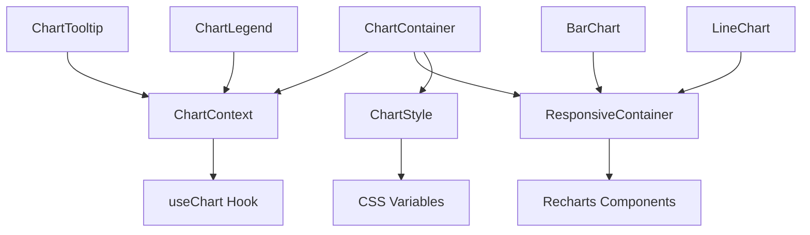
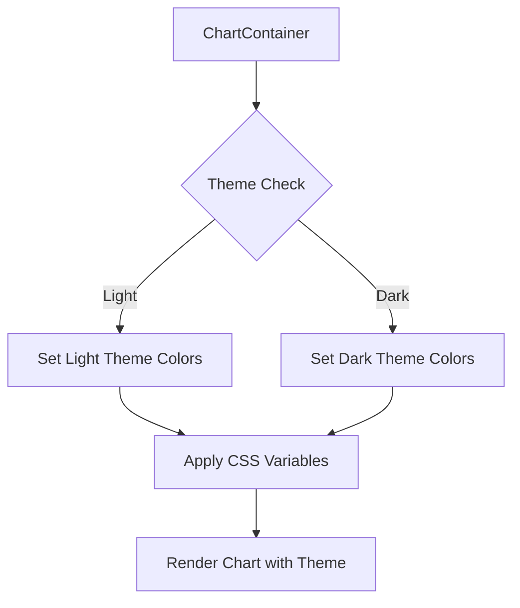
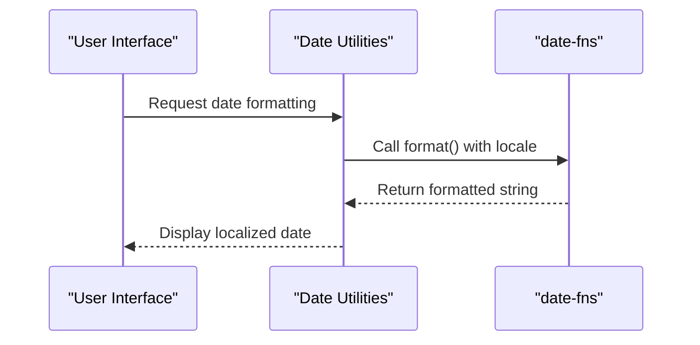
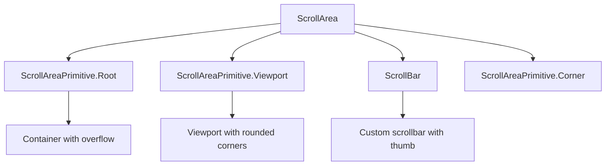
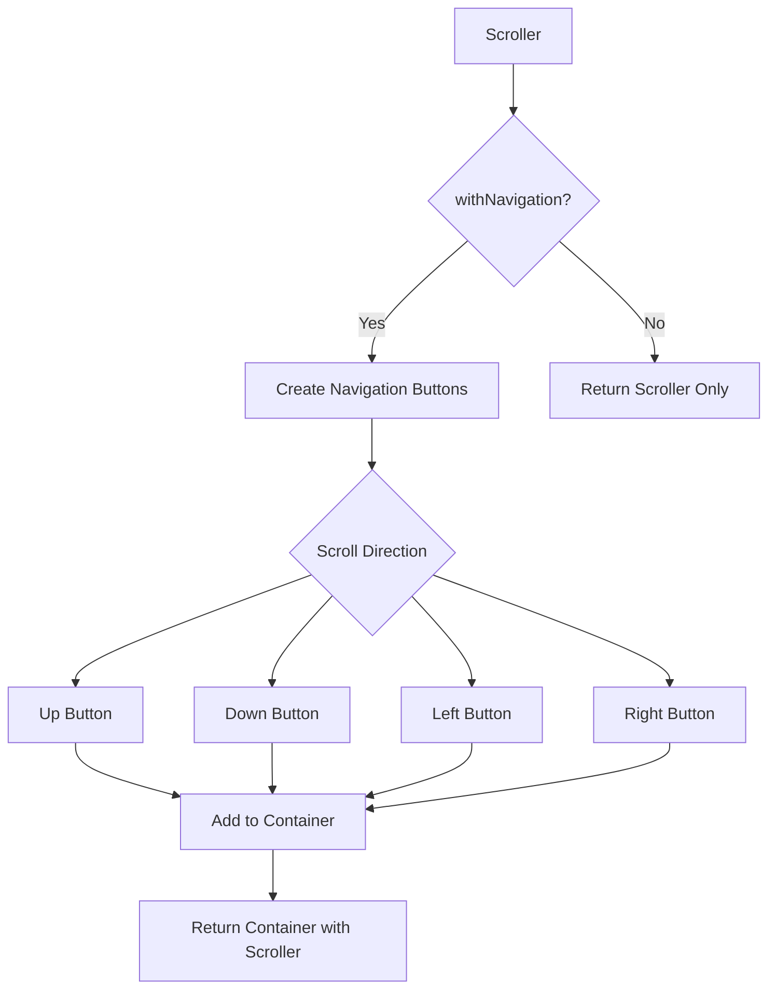
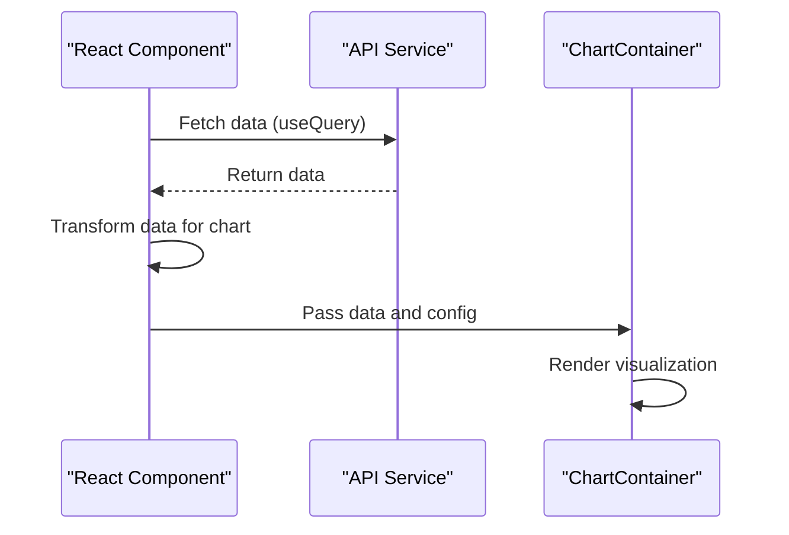

# Data Display and Visualization Components

<cite>
**Referenced Files in This Document**   
- [chart.tsx](file://apps/web/src/components/ui/chart.tsx)
- [calendar.tsx](file://apps/web/src/components/ui/calendar.tsx)
- [scroll-area.tsx](file://apps/web/src/components/ui/scroll-area.tsx)
- [scroller.tsx](file://apps/web/src/components/ui/scroller.tsx)
- [skeleton.tsx](file://apps/web/src/components/ui/skeleton.tsx)
- [date.ts](file://apps/web/src/lib/date.ts)
- [event-preview-calendar.tsx](file://apps/web/src/components/event-calendar/event-preview-calendar.tsx)
</cite>

## Table of Contents
1. [Introduction](#introduction)
2. [Chart Components](#chart-components)
3. [Calendar Components](#calendar-components)
4. [Scrollable Containers](#scrollable-containers)
5. [Skeleton Loading Patterns](#skeleton-loading-patterns)
6. [Integration with API Data Sources](#integration-with-api-data-sources)
7. [Accessibility Considerations](#accessibility-considerations)

## Introduction
This document provides comprehensive documentation for the data display and visualization components within the smart-logs application. The components covered include charts, calendars, scrollable containers, and loading patterns that enhance user experience. These components are designed to handle dynamic data binding, responsive design, time zone awareness, and efficient rendering of large datasets. The documentation details implementation patterns, integration strategies, and best practices for using these components effectively in data-intensive applications.

## Chart Components

The chart components in the application are built on top of Recharts, providing a flexible and theme-aware visualization system. The implementation focuses on dynamic data binding, responsive design, and customizable styling through configuration objects.

The core of the chart system is the `ChartContainer` component, which serves as a wrapper for all chart visualizations. It provides context for chart configuration, including color themes and labeling. The container automatically applies responsive behavior through Recharts' ResponsiveContainer, ensuring charts adapt to their container dimensions.



**Diagram sources**
- [chart.tsx](file://apps/web/src/components/ui/chart.tsx#L50-L150)

**Section sources**
- [chart.tsx](file://apps/web/src/components/ui/chart.tsx#L1-L352)

### Dynamic Data Binding and Configuration
The chart system uses a configuration-driven approach for data binding and styling. The `ChartConfig` type defines how data series are mapped to visual properties:

```typescript
export type ChartConfig = {
  [k in string]: {
    label?: React.ReactNode
    icon?: React.ComponentType
  } & (
    | { color?: string; theme?: never }
    | { color?: never; theme: Record<keyof typeof THEMES, string> }
  )
}
```

This configuration allows components to bind data dynamically while maintaining theme consistency. When a chart is rendered, the configuration is processed to generate CSS variables that control the appearance of data series.

### Responsive Design Implementation
The responsive behavior is implemented through the `RechartsPrimitive.ResponsiveContainer` component, which automatically adjusts the chart dimensions based on the parent container. The container also applies a default aspect ratio of "aspect-video" to maintain consistent proportions across different screen sizes.

The styling system uses CSS variables to handle theme switching between light and dark modes. The `ChartStyle` component generates inline styles that define color variables based on the current theme:



**Diagram sources**
- [chart.tsx](file://apps/web/src/components/ui/chart.tsx#L150-L200)

### Tooltip and Legend Components
The chart system includes specialized components for tooltips and legends that enhance data exploration:

- `ChartTooltipContent`: Provides formatted tooltip displays with support for different indicator styles (dot, line, dashed)
- `ChartLegendContent`: Renders legends with optional icons and consistent styling

These components consume the chart configuration through the `useChart` hook, ensuring consistent styling across all chart elements.

## Calendar Components

The calendar components in the application provide comprehensive date selection and event visualization capabilities. The implementation leverages date-fns for date manipulation and formatting, with careful attention to internationalization and time zone handling.

### Core Calendar Implementation
The base `Calendar` component is built on react-day-picker, providing a flexible foundation for date selection interfaces. The component supports multiple display modes and integrates with the application's styling system:

```mermaid
classDiagram
class Calendar {
+showOutsideDays : boolean
+captionLayout : string
+buttonVariant : string
+classNames : object
+components : object
}
class CalendarDayButton {
+day : object
+modifiers : object
+className : string
}
Calendar --> CalendarDayButton : "renders"
Calendar --> "react-day-picker" : "wraps"
```

**Diagram sources**
- [calendar.tsx](file://apps/web/src/components/ui/calendar.tsx#L1-L212)

**Section sources**
- [calendar.tsx](file://apps/web/src/components/ui/calendar.tsx#L1-L212)

### Date-fns Integration
The application extensively uses date-fns for date formatting and manipulation, particularly in the event calendar components. The `date.ts` utility library provides a comprehensive set of functions that wrap date-fns functionality:

```typescript
export const formatDate = (date: Date, formatStr: string, options?: FormatOptions): string => {
    return options?.locale
        ? format(date, formatStr, { locale: options.locale })
        : format(date, formatStr)
}
```

Key integration points include:
- **Localization**: The `getLocalizedDaysOfWeek` function uses date-fns' `format` function with locale objects to provide properly localized day names
- **Time formatting**: The `formatTimeDisplay` function handles conversion between 12-hour and 24-hour time formats
- **Date calculations**: Utilities for calculating durations, validating date order, and combining date/time values

### Time Zone Handling
While the current implementation primarily works with Date objects, the system is designed to handle time zone considerations through proper date formatting and display:



**Diagram sources**
- [date.ts](file://apps/web/src/lib/date.ts#L85-L100)
- [event-preview-calendar.tsx](file://apps/web/src/components/event-calendar/event-preview-calendar.tsx#L1-L40)

The `ensureDate` function provides robust date parsing that handles various input formats and gracefully falls back to the current date if parsing fails, ensuring consistent behavior across different time zones.

### Event Calendar Features
The event calendar system includes specialized components for displaying and managing events:

- `event-preview-calendar.tsx`: Shows how events will appear in the calendar with proper formatting
- Various event dialog components for creating and editing events
- Filter and search functionality for managing large numbers of events

The preview calendar demonstrates the integration between date formatting and event display, showing how event times are properly formatted according to user preferences.

## Scrollable Containers

The application implements two complementary scrollable container components: `ScrollArea` and `Scroller`. These components address different use cases for content scrolling and virtualization.

### ScrollArea Component
The `ScrollArea` component provides a styled scrollable container using Radix UI's primitives. It's designed for standard scrolling needs with custom scrollbar styling:



**Diagram sources**
- [scroll-area.tsx](file://apps/web/src/components/ui/scroll-area.tsx#L1-L57)

The component applies consistent styling across different platforms, hiding native scrollbars on WebKit browsers and providing custom-styled scrollbar thumbs.

**Section sources**
- [scroll-area.tsx](file://apps/web/src/components/ui/scroll-area.tsx#L1-L57)

### Scroller Component
The `Scroller` component provides enhanced scrolling capabilities with navigation controls and visual indicators for scroll position:

```typescript
const scrollerVariants = cva('', {
    variants: {
        orientation: {
            vertical: [
                'overflow-y-auto',
                'data-[top-scroll=true]:[mask-image:linear-gradient(0deg,#000_calc(100%_-_var(--scroll-shadow-size)),transparent)]',
                'data-[bottom-scroll=true]:[mask-image:linear-gradient(180deg,#000_calc(100%_-_var(--scroll-shadow-size)),transparent)]',
            ],
            horizontal: [
                'overflow-x-auto',
                'data-[left-scroll=true]:[mask-image:linear-gradient(270deg,#000_calc(100%_-_var(--scroll-shadow-size)),transparent)]',
                'data-[right-scroll=true]:[mask-image:linear-gradient(90deg,#000_calc(100%_-_var(--scroll-shadow-size)),transparent)]',
            ],
        },
    },
})
```

Key features include:
- **Visual scroll indicators**: CSS mask images that show shadows when content can be scrolled in a direction
- **Navigation buttons**: Optional overlay buttons for scrolling with different trigger modes (press, hover, click)
- **Dynamic visibility**: Navigation buttons only appear when scrolling is possible in that direction



**Diagram sources**
- [scroller.tsx](file://apps/web/src/components/ui/scroller.tsx#L1-L369)

The component uses React hooks to track scroll position and update data attributes that control the visual indicators. The `onScroll` handler updates attributes like `data-top-scroll`, `data-bottom-scroll`, etc., which are then used in CSS to show or hide the scroll shadows.

## Skeleton Loading Patterns

The skeleton loading component provides a simple yet effective way to indicate loading states and improve perceived performance in data-heavy interfaces.

### Skeleton Component Implementation
The `Skeleton` component is a minimal implementation that applies a pulsing animation and subtle styling to indicate loading content:

```typescript
function Skeleton({ className, ...props }: React.ComponentProps<"div">) {
  return (
    <div
      data-slot="skeleton"
      className={cn("bg-accent animate-pulse rounded-md", className)}
      {...props}
    />
  )
}
```

**Section sources**
- [skeleton.tsx](file://apps/web/src/components/ui/skeleton.tsx#L1-L14)

The component uses:
- `bg-accent`: A subtle background color that contrasts slightly with the main background
- `animate-pulse`: A CSS animation that creates a pulsing effect
- `rounded-md`: Consistent rounded corners with other components

```mermaid
graph TD
A[Skeleton] --> B[div element]
B --> C[data-slot="skeleton"]
B --> D[bg-accent class]
B --> E[animate-pulse class]
B --> F[rounded-md class]
B --> G[Additional className]
```

**Diagram sources**
- [skeleton.tsx](file://apps/web/src/components/ui/skeleton.tsx#L1-L14)

### Usage Patterns
The skeleton component is designed to be used as a placeholder for various types of content:

- **List items**: Multiple skeleton elements can be arranged to mimic a list
- **Cards**: Skeletons can be combined to create card-shaped placeholders
- **Form fields**: Skeletons can represent input fields and buttons
- **Charts**: Skeletons can be styled to resemble chart bars or lines

The simplicity of the implementation allows for flexible composition with other components to create realistic loading states that match the final content layout.

## Integration with API Data Sources

The data display components are designed to work seamlessly with API data sources, handling large datasets efficiently and providing smooth user experiences.

### Chart Data Integration
Charts are typically populated with data from API endpoints through the following pattern:



The `ChartContainer` component accepts a configuration object that maps data fields to visual properties, allowing for dynamic chart creation based on API responses.

### Calendar Data Integration
The event calendar components integrate with API data through several mechanisms:

1. **Event data fetching**: Using tRPC or similar RPC frameworks to retrieve event data
2. **Date range queries**: Fetching events for specific time periods to handle large datasets
3. **Real-time updates**: Subscribing to event changes for live updates

The date utilities in `date.ts` facilitate proper formatting of date parameters for API requests and response handling.

### Performance Optimization for Large Datasets
The components employ several strategies to handle large datasets efficiently:

- **Virtualized rendering**: The scroller components only render visible content
- **Data pagination**: Loading data in chunks rather than all at once
- **Memoization**: Using React.memo and useMemo to prevent unnecessary re-renders
- **Skeleton loading**: Providing immediate feedback while data loads

The combination of skeleton loading and efficient data fetching creates a responsive interface even when dealing with extensive datasets.

## Accessibility Considerations

The data display components include several accessibility features to ensure usability for all users, including those using screen readers and keyboard navigation.

### Keyboard Navigation
The scrollable components support standard keyboard navigation:
- Arrow keys for scrolling in the appropriate direction
- Page Up/Page Down for larger scroll increments
- Home/End to navigate to the beginning or end of content

The `Scroller` component's navigation buttons are fully keyboard accessible, with proper focus management and ARIA attributes.

### Screen Reader Support
The components include appropriate ARIA attributes and semantic HTML:
- Proper heading hierarchy in calendar components
- Descriptive labels for chart elements
- ARIA live regions for dynamic content updates
- Accessible names for interactive elements

The calendar component uses semantic elements like `<time>` and proper heading levels to provide context for screen readers.

### Color and Contrast
The components adhere to accessibility guidelines for color contrast:
- Sufficient contrast between text and background colors
- Visual indicators that don't rely solely on color
- Support for high-contrast modes

The theming system ensures consistent color application across components, maintaining accessibility standards in both light and dark modes.

### Focus Management
Interactive elements within the components have visible focus indicators:
- Custom focus rings on buttons and controls
- Proper focus trapping in modal dialogs
- Logical tab order through component elements

The `ScrollArea` component includes focus-visible styles that provide clear visual feedback when elements receive keyboard focus.