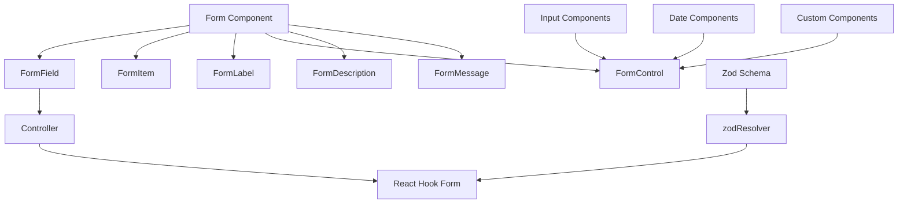
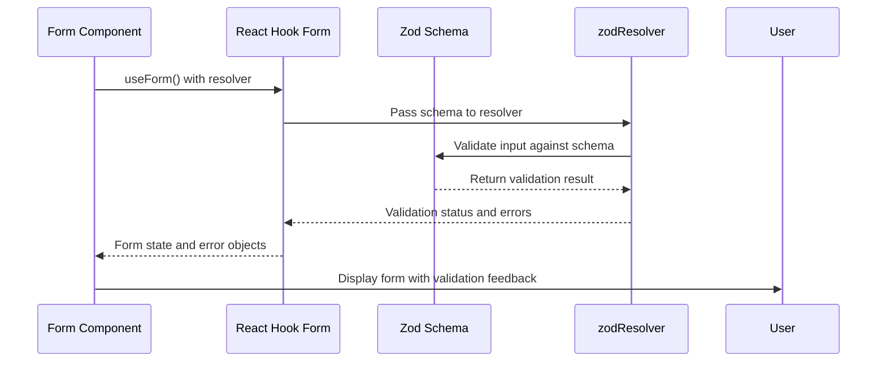
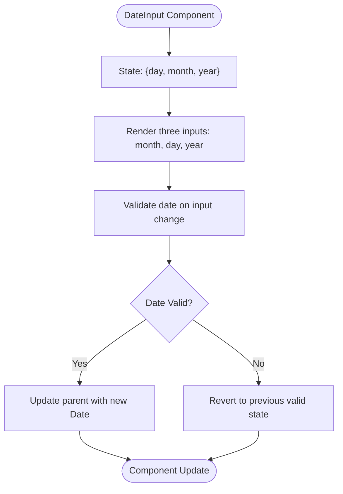

# Form System and Input Components

<cite>
**Referenced Files in This Document**   
- [form.tsx](file://apps/web/src/components/ui/form.tsx)
- [input.tsx](file://apps/web/src/components/ui/input.tsx)
- [date-input.tsx](file://apps/web/src/components/ui/date-input.tsx)
- [date-range-picker.tsx](file://apps/web/src/components/ui/date-range-picker.tsx)
- [validations.ts](file://apps/web/src/lib/validations.ts)
- [resolve-alert-form.tsx](file://apps/web/src/components/alerts/form.tsx)
- [presets/form.tsx](file://apps/web/src/components/presets/form.tsx)
- [templates/form.tsx](file://apps/web/src/components/templates/form.tsx)
</cite>

## Table of Contents
1. [Introduction](#introduction)
2. [Form System Architecture](#form-system-architecture)
3. [React Hook Form with Zod Integration](#react-hook-form-with-zod-integration)
4. [Input Components](#input-components)
5. [Date Input and Range Picker Components](#date-input-and-range-picker-components)
6. [Validation and Error Handling](#validation-and-error-handling)
7. [Complex Form Layouts and Patterns](#complex-form-layouts-and-patterns)
8. [Accessibility Implementation](#accessibility-implementation)
9. [Customization and External Integration](#customization-and-external-integration)
10. [Conclusion](#conclusion)

## Introduction
The form system in this application provides a comprehensive solution for building accessible, validated, and user-friendly forms. Built on React Hook Form with Zod validation schema integration, the system offers a robust foundation for creating various form types including simple inputs, complex layouts, dynamic field arrays, and multi-step processes. This documentation details the implementation, usage patterns, and best practices for working with the form system and input components.

## Form System Architecture



**Diagram sources**
- [form.tsx](file://apps/web/src/components/ui/form.tsx#L0-L165)

**Section sources**
- [form.tsx](file://apps/web/src/components/ui/form.tsx#L0-L165)

## React Hook Form with Zod Integration

The form system is built on React Hook Form, a performant and flexible form library that minimizes re-renders and provides excellent developer experience. It is integrated with Zod, a TypeScript-first schema declaration and validation library, to provide type-safe form validation.

The integration is achieved through the `zodResolver` from `@hookform/resolvers/zod`, which connects Zod validation schemas with React Hook Form's validation system. This combination provides compile-time type safety and runtime validation.



**Diagram sources**
- [form.tsx](file://apps/web/src/components/ui/form.tsx#L0-L165)
- [validations.ts](file://apps/web/src/lib/validations.ts#L0-L99)

**Section sources**
- [form.tsx](file://apps/web/src/components/ui/form.tsx#L0-L165)
- [validations.ts](file://apps/web/src/lib/validations.ts#L0-L99)

## Input Components

### Base Input Component
The base input component provides a styled text input with accessibility features and error state handling.

```tsx
function Input({ className, type, ...props }: React.ComponentProps<"input">) {
  return (
    <input
      type={type}
      data-slot="input"
      className={cn(
        "file:text-foreground placeholder:text-muted-foreground selection:bg-primary selection:text-primary-foreground dark:bg-input/30 border-input flex h-9 w-full min-w-0 rounded-md border bg-transparent px-3 py-1 text-base shadow-xs transition-[color,box-shadow] outline-none file:inline-flex file:h-7 file:border-0 file:bg-transparent file:text-sm file:font-medium disabled:pointer-events-none disabled:cursor-not-allowed disabled:opacity-50 md:text-sm",
        "focus-visible:border-ring focus-visible:ring-ring/50 focus-visible:ring-[3px]",
        "aria-invalid:ring-destructive/20 dark:aria-invalid:ring-destructive/40 aria-invalid:border-destructive",
        className
      )}
      {...props}
    />
  )
}
```

The input component uses Tailwind CSS classes for styling and includes specific states for:
- Focus: Enhanced border and shadow
- Error: Destructive border and ring
- Disabled: Reduced opacity and disabled cursor
- File inputs: Custom styling for file upload inputs

**Section sources**
- [input.tsx](file://apps/web/src/components/ui/input.tsx#L0-L21)

### Form Context Components
The form system provides a set of context-aware components that work together to create accessible and validated forms:

- **Form**: Wrapper component that provides form context
- **FormField**: Connects form fields to React Hook Form controller
- **FormItem**: Container for form field elements
- **FormLabel**: Accessible label with error state
- **FormControl**: Wrapper for input components
- **FormDescription**: Helper text for fields
- **FormMessage**: Displays validation errors

These components use React context to share state and ensure proper accessibility attributes are applied.

**Section sources**
- [form.tsx](file://apps/web/src/components/ui/form.tsx#L0-L165)

## Date Input and Range Picker Components

### Date Input Component
The DateInput component provides a user-friendly interface for entering dates in MM/DD/YYYY format with individual month, day, and year inputs.



The component includes several key features:
- Individual input fields for month, day, and year
- Keyboard navigation between fields
- Arrow key support for incrementing/decrementing values
- Real-time validation of date validity
- Automatic focus management
- Timezone-aware date handling

**Section sources**
- [date-input.tsx](file://apps/web/src/components/ui/date-input.tsx#L0-L260)

### Date Range Picker Component
The DateRangePicker component provides a comprehensive solution for selecting date ranges with comparison capabilities.

Key features include:
- Calendar interface for date selection
- Preset ranges (Today, Yesterday, Last 7 days, etc.)
- Compare mode for year-over-year analysis
- Mobile-responsive design
- Customizable alignment
- Locale support

The component handles timezone considerations by using `getDateAdjustedForTimezone` function which ensures dates are properly adjusted for the user's local timezone when converting from string inputs.

```mermaid
classDiagram
class DateRangePicker {
+onUpdate : (values : {range : DateRange, rangeCompare? : DateRange}) => void
+initialDateFrom : Date | string
+initialDateTo : Date | string
+initialCompareFrom : Date | string
+initialCompareTo : Date | string
+align : 'start' | 'center' | 'end'
+locale : string
+showCompare : boolean
-range : DateRange
-rangeCompare : DateRange | undefined
-isOpen : boolean
-selectedPreset : string | undefined
+setPreset(preset : string)
+resetValues()
+checkPreset()
+areRangesEqual(a? : DateRange, b? : DateRange) : boolean
}
class DateRange {
+from : Date
+to : Date | undefined
}
class Preset {
+name : string
+label : string
}
DateRangePicker --> DateRange : "has"
DateRangePicker --> Preset : "uses"
DateRangePicker --> Calendar : "renders"
DateRangePicker --> DateInput : "includes"
DateRangePicker --> Popover : "wraps"
```

**Diagram sources**
- [date-range-picker.tsx](file://apps/web/src/components/ui/date-range-picker.tsx#L0-L540)

**Section sources**
- [date-range-picker.tsx](file://apps/web/src/components/ui/date-range-picker.tsx#L0-L540)

## Validation and Error Handling

### Zod Validation Schemas
The application uses Zod for defining validation schemas with TypeScript integration. Validation schemas are defined in `validations.ts` and include:

- **createEventSchema**: For creating new events
- **eventFormSchema**: Extended schema with refinement rules
- **UpdateEventSchema**: Partial schema for updates
- **eventFilterSchema**: For filtering events
- **searchEventFilterSchema**: For search functionality

The schemas include various validation rules:
- String length constraints (min, max)
- Regular expression patterns (time format)
- Enum validation
- Custom refinement rules
- Date validation

```ts
const timeRegex = /^(0[0-9]|1[0-9]|2[0-3]):[0-5][0-9]$/

const baseEventSchema = z.object({
	id: z.uuid(),
	title: z.string().min(1).max(256),
	description: z.string().min(1),
	startDate: z.date(),
	endDate: z.date(),
	startTime: z.string().regex(timeRegex),
	endTime: z.string().regex(timeRegex),
	location: z.string().min(1).max(256),
	category: z.string().min(1).max(100),
	color: z.string().min(1).max(25),
	createdAt: z.iso.datetime(),
	updatedAt: z.iso.datetime(),
})
```

**Section sources**
- [validations.ts](file://apps/web/src/lib/validations.ts#L0-L99)

### Error Handling Patterns
The form system implements a comprehensive error handling approach:

1. **Visual Feedback**: Error messages are displayed below the input field
2. **Accessibility**: ARIA attributes indicate invalid fields
3. **Error Parsing**: Custom error parsing for Zod validation errors
4. **User Feedback**: Toast notifications for form submission errors

The `FormMessage` component conditionally renders error messages when validation fails:

```tsx
function FormMessage({ className, ...props }: React.ComponentProps<"p">) {
  const { error, formMessageId } = useFormField()
  const body = error ? String(error?.message ?? "") : props.children

  if (!body) {
    return null
  }

  return (
    <p
      data-slot="form-message"
      id={formMessageId}
      className={cn("text-destructive text-sm", className)}
      {...props}
    >
      {body}
    </p>
  )
}
```

**Section sources**
- [form.tsx](file://apps/web/src/components/ui/form.tsx#L135-L164)

## Complex Form Layouts and Patterns

### Dynamic Field Arrays
The system supports dynamic field arrays through components like TagsInput, which allows users to add multiple values to a field.

In the presets form, the requiredFields field uses TagsInput to allow multiple required fields to be specified:

```tsx
<FormField
  control={form.control}
  name="requiredFields"
  render={({ field }) => (
    <FormItem>
      <FormLabel>Enter required fields</FormLabel>
      <FormControl>
        <TagsInput
          value={field.value}
          onValueChange={field.onChange}
          placeholder="Enter your fields"
        />
      </FormControl>
      <FormDescription>Add required fields.</FormDescription>
      <FormMessage />
    </FormItem>
  )}
/>
```

**Section sources**
- [presets/form.tsx](file://apps/web/src/components/presets/form.tsx#L135-L162)

### Multi-Step Forms
While the codebase doesn't contain explicit multi-step forms, the form system is designed to support them through:
- Form state persistence
- Conditional rendering of form sections
- Step-by-step validation
- Progress indicators

The architecture allows for implementing multi-step forms by:
1. Managing step state in the parent component
2. Rendering different form sections based on the current step
3. Validating each step before proceeding
4. Preserving form data across steps

### Complex Form Layouts
The system supports complex layouts through:
- Grid-based layouts using Tailwind CSS
- Responsive design with different column counts
- Grouped form fields
- Conditional field rendering

The templates form demonstrates a two-column layout:

```tsx
<div className="grid grid-cols-12 gap-4">
  <div className="col-span-6">
    {/* Field 1 */}
  </div>
  <div className="col-span-6">
    {/* Field 2 */}
  </div>
</div>
```

**Section sources**
- [templates/form.tsx](file://apps/web/src/components/templates/form.tsx#L47-L96)

## Accessibility Implementation

### Label and Field Association
The form system ensures proper accessibility through:

- **Programmatic Label Association**: Using `htmlFor` and `id` attributes
- **ARIA Attributes**: `aria-describedby`, `aria-invalid`, `aria-required`
- **Focus Management**: Proper tab order and focus states
- **Screen Reader Support**: Semantic HTML and ARIA roles

The FormLabel component automatically associates with its corresponding input:

```tsx
function FormLabel({
  className,
  ...props
}: React.ComponentProps<typeof LabelPrimitive.Root>) {
  const { error, formItemId } = useFormField()

  return (
    <Label
      data-slot="form-label"
      data-error={!!error}
      className={cn("data-[error=true]:text-destructive", className)}
      htmlFor={formItemId}
      {...props}
    />
  )
}
```

### Error Messaging
Error messages are implemented with accessibility in mind:

- **Descriptive Error Text**: Clear, specific error messages
- **Visual and Textual Indicators**: Color changes and text content
- **Programmatic Announcement**: Screen readers announce errors
- **Error Region Association**: `aria-describedby` links input to error message

The FormControl component manages the relationship between input and error message:

```tsx
function FormControl({ ...props }: React.ComponentProps<typeof Slot>) {
  const { error, formItemId, formDescriptionId, formMessageId } = useFormField()

  return (
    <Slot
      data-slot="form-control"
      id={formItemId}
      aria-describedby={
        !error
          ? `${formDescriptionId}`
          : `${formDescriptionId} ${formMessageId}`
      }
      aria-invalid={!!error}
      {...props}
    />
  )
}
```

### Keyboard Navigation
The input components support full keyboard navigation:
- Tab/Shift+Tab to move between fields
- Arrow keys to increment/decrement date values
- Enter to submit forms
- Escape to close date pickers

**Section sources**
- [form.tsx](file://apps/web/src/components/ui/form.tsx#L46-L164)
- [date-input.tsx](file://apps/web/src/components/ui/date-input.tsx#L0-L260)

## Customization and External Integration

### Component Customization
Input components can be customized through:
- **Props**: Standard HTML attributes and custom props
- **Class Names**: Using the `className` prop to add custom styles
- **Theming**: Integration with the application's theme system

The Input component accepts all standard input props and allows additional styling:

```tsx
<Input 
  placeholder="Enter your name" 
  type="text" 
  className="custom-class"
  disabled={false}
/>
```

### External Validation Libraries
While the system primarily uses Zod, it can integrate with other validation libraries through React Hook Form's resolver system. The architecture supports custom resolvers that can work with:
- Yup
- Joi
- Superstruct
- Custom validation functions

The zodResolver pattern can be replaced with other resolvers:

```tsx
const form = useForm({
  resolver: customResolver // Could be yupResolver, joiResolver, etc.
});
```

### Integration Examples
The system is used in various contexts throughout the application:

**Alert Resolution Form**
```tsx
export default function ResolveAlertForm({ onSubmit }: FormProps) {
  const [loading, setLoading] = useState(false)
  const form = useForm<z.infer<typeof formSchema>>({
    resolver: zodResolver(formSchema),
  })

  async function handleSubmit(values: z.infer<typeof formSchema>) {
    try {
      setLoading(true)
      await onSubmit(values.resolutionNotes)
      setLoading(false)
    } catch (error) {
      toast.error('Failed to submit the form. Please try again.')
    }
  }

  return (
    <Form {...form}>
      <form onSubmit={form.handleSubmit(handleSubmit)}>
        <FormField
          control={form.control}
          name="resolutionNotes"
          render={({ field }) => (
            <FormItem>
              <FormLabel>Resolution note</FormLabel>
              <FormControl>
                <Textarea placeholder="" className="resize-none" {...field} />
              </FormControl>
              <FormDescription>This is your resolution notes.</FormDescription>
              <FormMessage />
            </FormItem>
          )}
        />
        <Button type="submit">
          {loading ? <Spinner variant="bars" size={16} /> : 'Resolve Alerts'}
        </Button>
      </form>
    </Form>
  )
}
```

**Preset Creation Form**
```tsx
function PresetsForm({ initialData, onSubmit }: PresetFormProps) {
  const form = useForm<z.infer<typeof formSchema>>({
    resolver: zodResolver(formSchema),
    defaultValues: initialData || {
      requiredFields: [],
    },
  })

  function handleSubmit(values: z.infer<typeof formSchema>) {
    try {
      onSubmit(values as AuditPreset)
      form.reset()
      toast.success('Audit preset data submitted successfully!')
    } catch (error) {
      toast.error('Failed to submit the form. Please try again.')
    }
  }

  return (
    <Form {...form}>
      <form onSubmit={form.handleSubmit(handleSubmit)}>
        <FormField
          control={form.control}
          name="name"
          render={({ field }) => (
            <FormItem>
              <FormLabel>Name</FormLabel>
              <FormControl>
                <Input placeholder="authentication" type="" {...field} />
              </FormControl>
              <FormDescription>This is your public audit preset name.</FormDescription>
              <FormMessage />
            </FormItem>
          )}
        />
        {/* Additional fields */}
      </form>
    </Form>
  )
}
```

**Section sources**
- [resolve-alert-form.tsx](file://apps/web/src/components/alerts/form.tsx#L0-L73)
- [presets/form.tsx](file://apps/web/src/components/presets/form.tsx#L48-L100)

## Conclusion
The form system and input components provide a robust, accessible, and type-safe solution for building forms in the application. By leveraging React Hook Form and Zod, the system offers excellent developer experience with compile-time type safety and runtime validation. The component architecture promotes reusability and consistency across the application while supporting complex use cases like dynamic field arrays and date range selection with timezone considerations. The accessibility features ensure the forms are usable by all users, and the extensible design allows for customization and integration with external libraries when needed.