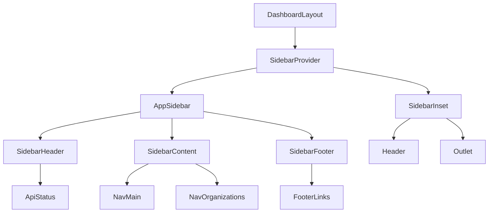
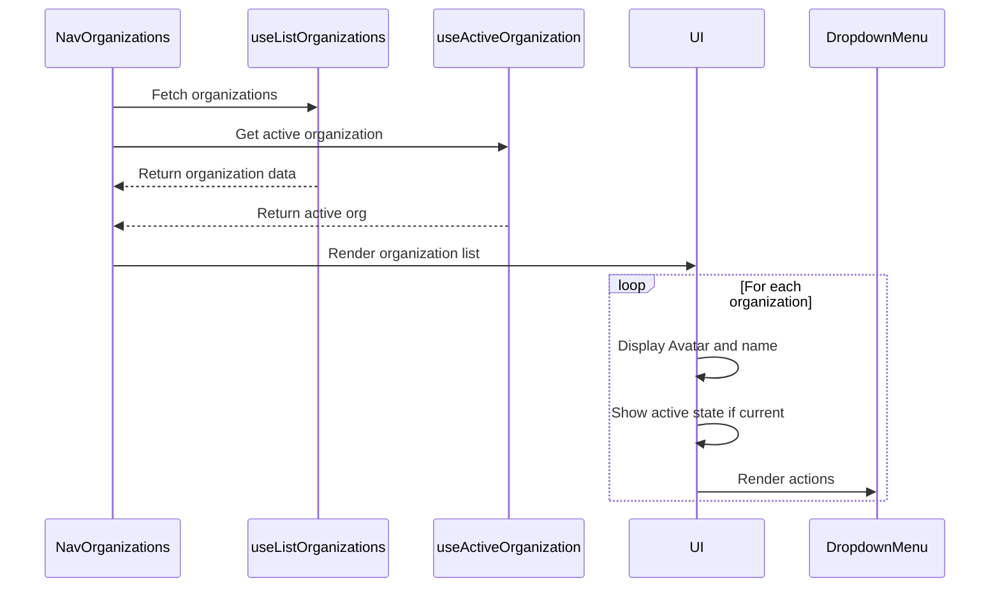
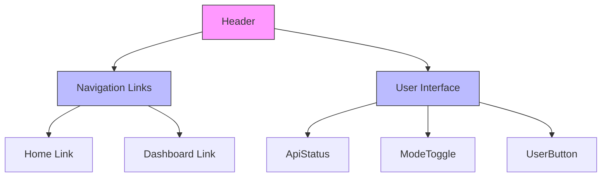
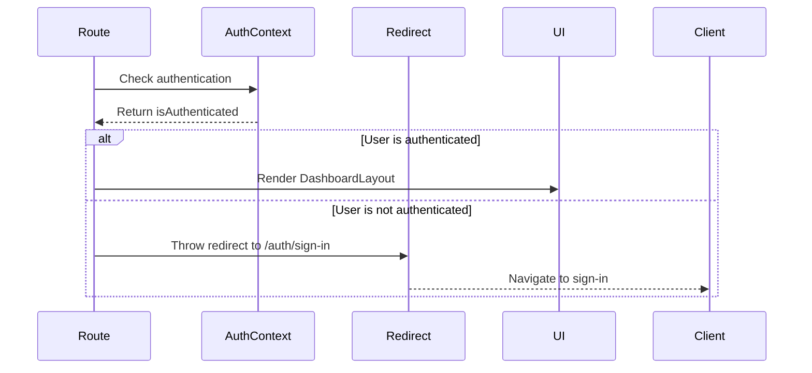
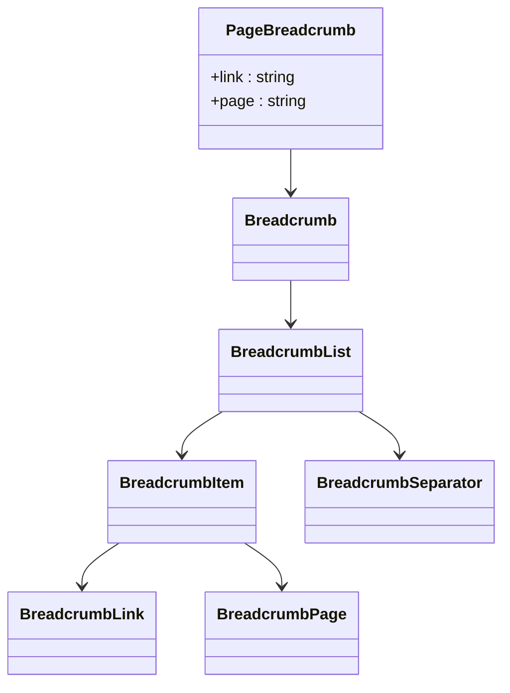
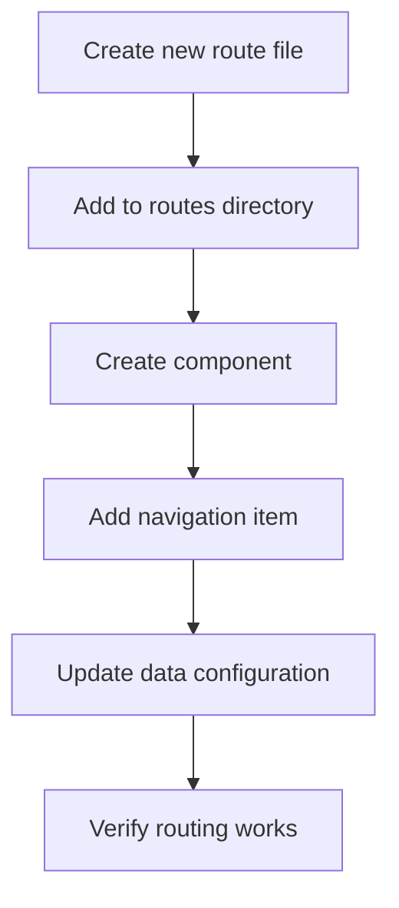

# Navigation and Layout Components

<cite>
**Referenced Files in This Document**   
- [app-sidebar.tsx](file://apps/web/src/components/app-sidebar.tsx)
- [nav-main.tsx](file://apps/web/src/components/nav-main.tsx)
- [nav-organizations.tsx](file://apps/web/src/components/nav-organizations.tsx)
- [header.tsx](file://apps/web/src/components/header.tsx)
- [page-breadcrumb.tsx](file://apps/web/src/components/ui/page-breadcrumb.tsx)
- [route.tsx](file://apps/web/src/routes/dashboard/route.tsx)
- [active.tsx](file://apps/web/src/routes/dashboard/alerts/active.tsx)
- [vite.config.ts](file://apps/web/vite.config.ts)
</cite>

## Table of Contents
1. [Introduction](#introduction)
2. [Layout Architecture Overview](#layout-architecture-overview)
3. [Sidebar Navigation System](#sidebar-navigation-system)
4. [Organization Switcher Implementation](#organization-switcher-implementation)
5. [Header Bar and User Interface](#header-bar-and-user-interface)
6. [Routing Integration with Tanstack Router](#routing-integration-with-tanstack-router)
7. [Dynamic Breadcrumb Generation](#dynamic-breadcrumb-generation)
8. [Responsive Design Considerations](#responsive-design-considerations)
9. [Active State Management](#active-state-management)
10. [Performance Optimization](#performance-optimization)
11. [Customization and Extension](#customization-and-extension)

## Introduction
This document provides a comprehensive analysis of the navigation and layout components in the Smart Logs application. The system is built around a modern React architecture with Tanstack Router for routing, implementing a sophisticated sidebar navigation system, organization switcher, and responsive header bar. The documentation covers implementation details, component relationships, routing integration, and best practices for customization and optimization.

**Section sources**
- [app-sidebar.tsx](file://apps/web/src/components/app-sidebar.tsx#L1-L170)
- [nav-main.tsx](file://apps/web/src/components/nav-main.tsx#L1-L72)

## Layout Architecture Overview
The application implements a structured layout architecture centered around the Sidebar component from the UI library, with AppSidebar serving as the primary container for navigation elements. The layout follows a modular design pattern, separating concerns between navigation, content, and user interface components.



**Diagram sources**
- [app-sidebar.tsx](file://apps/web/src/components/app-sidebar.tsx#L66-L128)
- [route.tsx](file://apps/web/src/routes/dashboard/route.tsx#L30-L51)

**Section sources**
- [app-sidebar.tsx](file://apps/web/src/components/app-sidebar.tsx#L1-L170)
- [route.tsx](file://apps/web/src/routes/dashboard/route.tsx#L30-L51)

## Sidebar Navigation System
The sidebar navigation system is implemented through the NavMain component, which renders hierarchical navigation items with collapsible submenus. The component accepts a configuration object that defines the navigation structure, including titles, URLs, icons, and nested items.

### Component Structure and Implementation
The NavMain component uses the UI library's sidebar components to create an accessible and visually consistent navigation interface. It leverages the Collapsible component for expandable sections and maps over the items array to generate menu entries.

```mermaid
classDiagram
class NavMain {
+items : NavItem[]
-NavItem {
title : string
url : string
icon? : LucideIcon
isActive? : boolean
items? : SubItem[]
}
-SubItem {
title : string
url : string
}
}
class SidebarGroup
class SidebarGroupLabel
class SidebarMenu
class SidebarMenuItem
class SidebarMenuButton
class SidebarMenuSub
class SidebarMenuSubItem
class SidebarMenuSubButton
class Collapsible
class CollapsibleTrigger
class CollapsibleContent
NavMain --> SidebarGroup
SidebarGroup --> SidebarGroupLabel
SidebarGroup --> SidebarMenu
SidebarMenu --> SidebarMenuItem
SidebarMenuItem --> SidebarMenuButton
SidebarMenuItem --> Collapsible
Collapsible --> CollapsibleTrigger
Collapsible --> CollapsibleContent
CollapsibleContent --> SidebarMenuSub
SidebarMenuSub --> SidebarMenuSubItem
SidebarMenuSubItem --> SidebarMenuSubButton
```

**Diagram sources**
- [nav-main.tsx](file://apps/web/src/components/nav-main.tsx#L1-L72)
- [app-sidebar.tsx](file://apps/web/src/components/app-sidebar.tsx#L66-L128)

**Section sources**
- [nav-main.tsx](file://apps/web/src/components/nav-main.tsx#L1-L72)
- [app-sidebar.tsx](file://apps/web/src/components/app-sidebar.tsx#L66-L128)

### Navigation Data Structure
The navigation structure is defined in the AppSidebar component as a static data object containing three main sections: Alerts, Compliance, and Settings. Each section can have nested items that are displayed when the parent section is expanded.

```typescript
const data = {
  navMain: [
    {
      title: 'Alerts',
      url: '#',
      icon: CircleAlert,
      isActive: true,
      items: [
        { title: 'Active', url: '/dashboard/alerts/active' },
        { title: 'Resolved', url: '/dashboard/alerts/resolved' },
        { title: 'Statistics', url: '/dashboard/alerts/statistics' }
      ]
    },
    {
      title: 'Compliance',
      url: '#',
      icon: FileCheck2,
      items: [
        { title: 'Hipaa Report', url: '/dashboard/compliance/hipaa' },
        { title: 'GDPR Report', url: '/dashboard/compliance/gdpr' },
        // Additional compliance items
      ]
    }
  ]
}
```

**Section sources**
- [app-sidebar.tsx](file://apps/web/src/components/app-sidebar.tsx#L10-L65)

## Organization Switcher Implementation
The NavOrganizations component provides an organization switching functionality that displays a list of available organizations with visual indicators for the active organization. It integrates with authentication hooks to fetch organization data and manage state.

### Component Architecture
The organization switcher uses several UI components to create an interactive interface:
- SidebarGroup for grouping organization items
- Avatar components for organization logos
- DropdownMenu for additional actions
- Spinner for loading states



**Diagram sources**
- [nav-organizations.tsx](file://apps/web/src/components/nav-organizations.tsx#L1-L105)

**Section sources**
- [nav-organizations.tsx](file://apps/web/src/components/nav-organizations.tsx#L1-L105)

### State Management and Error Handling
The component implements comprehensive state management with loading indicators and error handling. It uses React's useMemo hook to memoize the organizations array and provides user-friendly error messages when data loading fails.

```typescript
const { data: organizationsData, isPending: isLoadingOrganizations, error: organizationsError } = useListOrganizations()
const { data: activeOrganization } = useActiveOrganization()

const organizations = useMemo(() => organizationsData || [], [organizationsData])

const organizationsLoadError = organizationsError 
  ? 'Error loading organizations: NetworkError: Unable to connect to the server. Please check if the server is running.'
  : undefined
```

**Section sources**
- [nav-organizations.tsx](file://apps/web/src/components/nav-organizations.tsx#L15-L35)

## Header Bar and User Interface
The header component implements a responsive top navigation bar that includes primary navigation links, API status indicator, theme toggle, and user authentication controls.

### Component Structure
The header is a simple functional component that renders a flex-based layout with two main sections: navigation links on the left and user interface elements on the right.



**Diagram sources**
- [header.tsx](file://apps/web/src/components/header.tsx#L1-L46)

**Section sources**
- [header.tsx](file://apps/web/src/components/header.tsx#L1-L46)

### Integration with Authentication
The header integrates with the authentication system through the UserButton component from better-auth-ui, which handles user session management and provides a consistent interface for login/logout actions.

```typescript
return (
  <div className="flex flex-row items-center justify-between px-2 py-1">
    <nav className="flex gap-4 text-lg">
      {links.map(({ to, label }) => {
        return (
          <Link key={to} to={to}>{label}</Link>
        )
      })}
    </nav>
    <div className="flex items-center gap-2">
      <ApiStatus />
      <ModeToggle />
      <UserButton 
        className="text-accent-foreground bg-background shadow-xs hover:bg-accent hover:text-accent-foreground dark:bg-input/30 dark:border-input dark:hover:bg-input/50"
        size="sm"
      />
    </div>
  </div>
)
```

**Section sources**
- [header.tsx](file://apps/web/src/components/header.tsx#L10-L45)

## Routing Integration with Tanstack Router
The application uses Tanstack Router for client-side routing, providing a file-based routing system that integrates seamlessly with the navigation components.

### Router Configuration
The routing system is configured in vite.config.ts with the tanstackRouter plugin, enabling automatic route generation based on the file structure in the routes directory.

```typescript
// vite.config.ts
import { tanstackRouter } from '@tanstack/router-plugin/vite'

export default defineConfig({
  plugins: [
    tanstackRouter({}),
    // other plugins
  ],
})
```

**Section sources**
- [vite.config.ts](file://apps/web/vite.config.ts#L1-L39)

### Route Protection and Layout
The dashboard route implements authentication protection using the beforeLoad hook, redirecting unauthenticated users to the sign-in page. The layout component wraps content with the sidebar and header elements.



**Diagram sources**
- [route.tsx](file://apps/web/src/routes/dashboard/route.tsx#L4-L51)

**Section sources**
- [route.tsx](file://apps/web/src/routes/dashboard/route.tsx#L4-L51)

## Dynamic Breadcrumb Generation
The application implements dynamic breadcrumb navigation through the PageBreadcrumb component, which displays hierarchical navigation context for the current page.

### Component Implementation
The PageBreadcrumb component uses the UI library's breadcrumb components to create a responsive breadcrumb trail that adapts to screen size.



**Diagram sources**
- [page-breadcrumb.tsx](file://apps/web/src/components/ui/page-breadcrumb.tsx#L1-L30)
- [breadcrumb.tsx](file://apps/web/src/components/ui/breadcrumb.tsx#L1-L108)

**Section sources**
- [page-breadcrumb.tsx](file://apps/web/src/components/ui/page-breadcrumb.tsx#L1-L30)

### Usage in Routes
The breadcrumb component is used in individual route components to provide context-specific navigation, such as in the alerts/active route:

```typescript
function RouteComponent() {
  return (
    <div className="flex flex-1 flex-col gap-4 p-4">
      <PageBreadcrumb link="Alerts" page="Active" />
      {/* Rest of component */}
    </div>
  )
}
```

**Section sources**
- [active.tsx](file://apps/web/src/routes/dashboard/alerts/active.tsx#L100-L103)

## Responsive Design Considerations
The navigation system implements responsive design principles to ensure usability across different device sizes.

### Mobile Adaptation
The sidebar components automatically adapt to mobile layouts using the useSidebar hook, which provides information about the current device type.

```typescript
const { isMobile } = useSidebar()
// Used in nav-organizations.tsx to adjust dropdown positioning
<DropdownMenuContent
  side={isMobile ? 'bottom' : 'right'}
  align={isMobile ? 'end' : 'start'}
>
```

**Section sources**
- [nav-organizations.tsx](file://apps/web/src/components/nav-organizations.tsx#L14-L15)

### Conditional Rendering
Components use CSS classes with responsive prefixes (e.g., hidden md:block) to show or hide elements based on screen size, particularly in the breadcrumb component.

```typescript
<BreadcrumbItem className="hidden md:block">
  <BreadcrumbLink href="#">{link}</BreadcrumbLink>
</BreadcrumbItem>
<BreadcrumbSeparator className="hidden md:block" />
```

**Section sources**
- [page-breadcrumb.tsx](file://apps/web/src/components/ui/page-breadcrumb.tsx#L12-L13)

## Active State Management
The navigation system implements active state management to highlight the currently selected navigation item.

### Implementation Approach
Active states are managed through the isActive prop in navigation items and the URL matching capabilities of Tanstack Router's Link component.

```typescript
<SidebarMenuButton isActive={active} asChild>
  <Link to={`/dashboard/organizations/${item.slug}`}>
    {/* Button content */}
  </Link>
</SidebarMenuButton>
```

The NavMain component receives active state information through the data configuration:

```typescript
{
  title: 'Alerts',
  url: '#',
  icon: CircleAlert,
  isActive: true, // Controls initial collapse state
  items: [/* ... */]
}
```

**Section sources**
- [nav-organizations.tsx](file://apps/web/src/components/nav-organizations.tsx#L58-L62)
- [app-sidebar.tsx](file://apps/web/src/components/app-sidebar.tsx#L10-L65)

## Performance Optimization
The navigation system implements several performance optimizations to ensure smooth user experience.

### Data Fetching Optimization
The organization switcher uses React Query hooks with built-in caching and loading states to optimize data fetching:

```typescript
const { data: organizationsData, isPending: isLoadingOrganizations, error: organizationsError } = useListOrganizations()
```

### Memoization
The component uses useMemo to prevent unnecessary re-renders when the organizations data hasn't changed:

```typescript
const organizations = useMemo(() => organizationsData || [], [organizationsData])
```

### Lazy Loading
The file-based routing system with Tanstack Router enables code splitting and lazy loading of route components, reducing initial bundle size.

**Section sources**
- [nav-organizations.tsx](file://apps/web/src/components/nav-organizations.tsx#L15-L35)

## Customization and Extension
The navigation system is designed to be easily customizable and extensible for new features and routes.

### Adding New Navigation Items
To add new navigation items, modify the data object in AppSidebar:

```typescript
// Add a new section to the navMain array
{
  title: 'New Feature',
  url: '#',
  icon: NewIcon,
  items: [
    { title: 'Feature Page', url: '/dashboard/new-feature' }
  ]
}
```

### Integrating New Routes
New routes should be added to the routes directory following the file-based routing convention, and corresponding navigation items should be added to the appropriate section.



**Section sources**
- [app-sidebar.tsx](file://apps/web/src/components/app-sidebar.tsx#L10-L65)
- [route.tsx](file://apps/web/src/routes/dashboard/route.tsx#L4-L51)